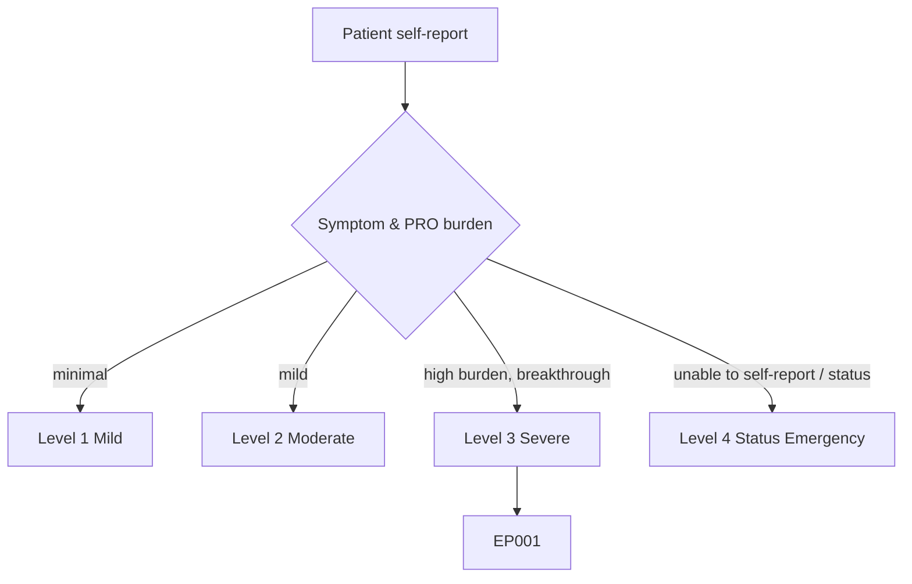
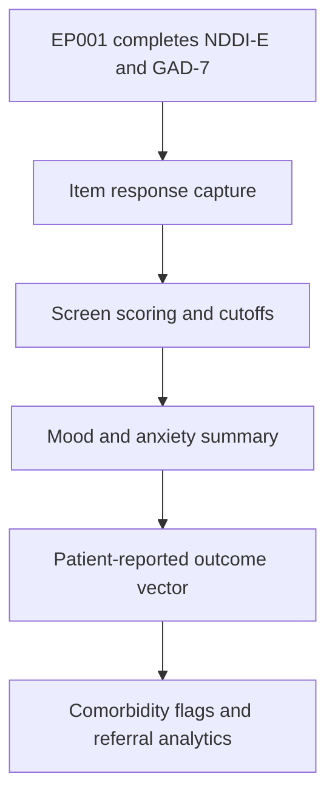
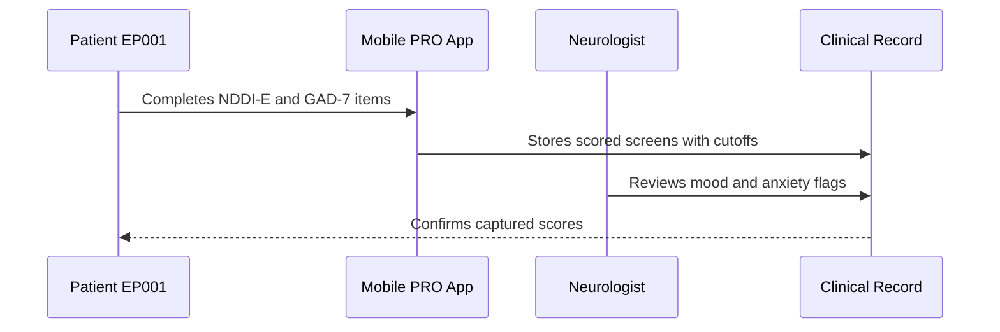
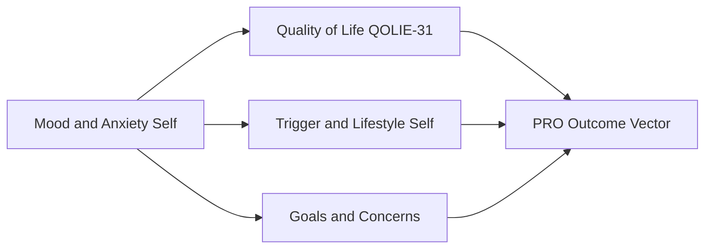
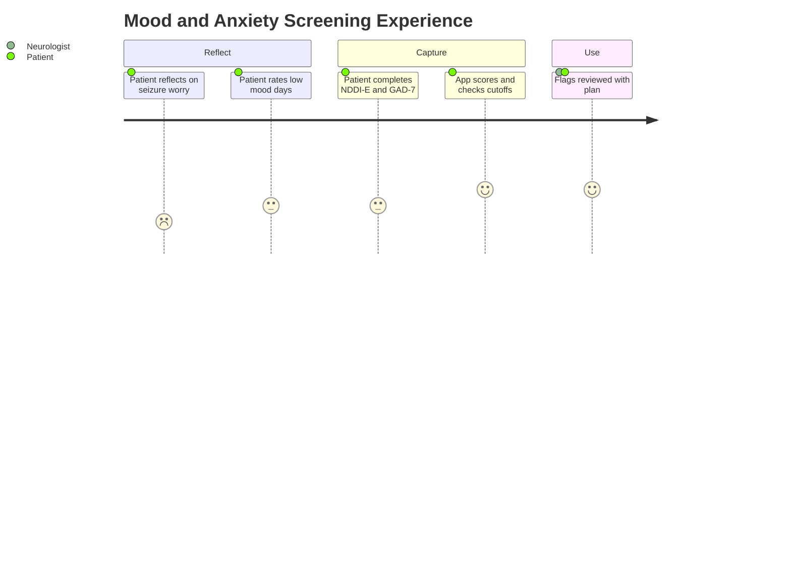

# Patient Self-Report — Section 7: Mood & Anxiety Self-Report (NDDI-E, GAD-7) (EP001)

> **Why (this doc):** Depression and anxiety are the most common psychiatric comorbidities in epilepsy and are strongly tied to quality of life and adherence; the NDDI-E and GAD-7 are validated self-report screens that quantify them. **How:** Patient EP001 completes the NDDI-E and GAD-7 items, captured into a fixed variable/value table that feeds the downstream patient-reported-outcome (PRO) vector.

**Problem:** Mood and anxiety in epilepsy are frequently under-detected, yet they degrade quality of life and adherence when left unmeasured.

**Research Objective:** Capture standardized NDDI-E and GAD-7 self-report scores for EP001 so mood and anxiety burden can be quantified and linked to quality-of-life, adherence, and seizure-control data.

**Role:** Patient · **Type:** Primary (patient-reported outcome) data

*Caption - NDDI-E and GAD-7 self-report scores reported by EP001. These validated screens quantify mood and anxiety burden, a key comorbidity signal that shapes quality of life and treatment planning.*

| Variable | Value |
|---|---|
| GAD-7 Total | 9 (moderate anxiety) |
| GAD-7 — Feeling Nervous | Several days |
| GAD-7 — Worry About Seizures | More than half the days |
| GAD-7 — Trouble Relaxing | Several days |
| GAD-7 — Restlessness | Several days |
| NDDI-E Total | 14 (mildly elevated) |
| NDDI-E Screen Cutoff (>15) | Below cutoff |
| NDDI-E — Everything a Struggle | Sometimes |
| NDDI-E — Feeling Down | Sometimes |
| Suicidality Item (NDDI-E) | Not endorsed |
| Main Emotional Concern | Worry about next seizure |
| Assessment Date | 2026-07-08 |

## Questionnaire (Enterprise Form)

*Caption - The self-report questions the patient answers for this section, with response type, validation, EP001's example answer, and the derived AI feature.*

| ID | Question | Response Type | Validation | EP001 (Example) | AI Feature |
|---|---|---|---|---|---|
| PAT-0701 | What is my total GAD-7 anxiety score? | Read-only(Auto) | GAD-7 0–21 | 9 (moderate anxiety) | gad7_total_score |
| PAT-0702 | How often have I felt nervous or anxious? | Dropdown[Not at all/Several days/More than half the days/Nearly every day] | GAD-7 item 0–3 | Several days | gad7_nervousness |
| PAT-0703 | How often do I worry about having seizures? | Dropdown[Not at all/Several days/More than half the days/Nearly every day] | GAD-7 item 0–3 | More than half the days | gad7_seizure_worry |
| PAT-0704 | How often do I have trouble relaxing? | Dropdown[Not at all/Several days/More than half the days/Nearly every day] | GAD-7 item 0–3 | Several days | gad7_trouble_relaxing |
| PAT-0705 | How often do I feel restless? | Dropdown[Not at all/Several days/More than half the days/Nearly every day] | GAD-7 item 0–3 | Several days | gad7_restlessness |
| PAT-0706 | What is my total NDDI-E depression score? | Read-only(Auto) | NDDI-E 6–24 | 14 (mildly elevated) | nddie_total_score |
| PAT-0707 | Am I above the NDDI-E screening cutoff (>15)? | Read-only(Auto) | Boolean (cutoff >15) | Below cutoff | nddie_cutoff_flag |
| PAT-0708 | How often does everything feel like a struggle? | Dropdown[Never/Rarely/Sometimes/Always] | NDDI-E item 1–4 | Sometimes | nddie_struggle |
| PAT-0709 | How often do I feel down or unhappy? | Dropdown[Never/Rarely/Sometimes/Always] | NDDI-E item 1–4 | Sometimes | nddie_feeling_down |
| PAT-0710 | Have I had thoughts of self-harm (NDDI-E)? | Yes-No | Boolean; triggers safety flag | Not endorsed | suicidality_safety_flag |
| PAT-0711 | What is my main emotional concern? | Text | Free-text ≤120 chars | Worry about next seizure | primary_emotional_concern |
| PAT-0712 | When did I complete this assessment? | Date | ISO date ≤ today | 2026-07-08 | assessment_date |

## Severity Scenario Model — Patient View

*Caption - The same self-report across four epilepsy severity levels from the patient's point of view; each self-reported variable shifts with severity. EP001 corresponds to Level 3 (Severe). Level 4 is the operational emergency — status epilepticus with seizures recurring about every 5 minutes.*

### Level 1 — Mild (Well-Controlled)
| Variable | Value |
|---|---|
| GAD-7 Total | 2 (minimal) |
| GAD-7 — Feeling Nervous | Not at all |
| GAD-7 — Worry About Seizures | Not at all |
| GAD-7 — Trouble Relaxing | Not at all |
| GAD-7 — Restlessness | Not at all |
| NDDI-E Total | 8 (normal) |
| NDDI-E Screen Cutoff (>15) | Below cutoff |
| NDDI-E — Everything a Struggle | Never |
| NDDI-E — Feeling Down | Rarely |
| Suicidality Item (NDDI-E) | Not endorsed |
| Main Emotional Concern | None significant |
| Assessment Date | 2026-07-08 |

### Level 2 — Moderate (Intermediate)
| Variable | Value |
|---|---|
| GAD-7 Total | 5 (mild) |
| GAD-7 — Feeling Nervous | Several days |
| GAD-7 — Worry About Seizures | Several days |
| GAD-7 — Trouble Relaxing | Not at all |
| GAD-7 — Restlessness | Several days |
| NDDI-E Total | 11 (low–mild) |
| NDDI-E Screen Cutoff (>15) | Below cutoff |
| NDDI-E — Everything a Struggle | Rarely |
| NDDI-E — Feeling Down | Sometimes |
| Suicidality Item (NDDI-E) | Not endorsed |
| Main Emotional Concern | Occasional seizure worry |
| Assessment Date | 2026-07-08 |

### Level 3 — Severe (Poorly Controlled) — EP001
| Variable | Value |
|---|---|
| GAD-7 Total | 9 (moderate anxiety) |
| GAD-7 — Feeling Nervous | Several days |
| GAD-7 — Worry About Seizures | More than half the days |
| GAD-7 — Trouble Relaxing | Several days |
| GAD-7 — Restlessness | Several days |
| NDDI-E Total | 14 (mildly elevated) |
| NDDI-E Screen Cutoff (>15) | Below cutoff |
| NDDI-E — Everything a Struggle | Sometimes |
| NDDI-E — Feeling Down | Sometimes |
| Suicidality Item (NDDI-E) | Not endorsed |
| Main Emotional Concern | Worry about next seizure |
| Assessment Date | 2026-07-08 |

### Level 4 — Refractory / Status Epilepticus (Operational Emergency)
| Variable | Value |
|---|---|
| GAD-7 Total | 18 (severe anxiety) |
| GAD-7 — Feeling Nervous | Nearly every day |
| GAD-7 — Worry About Seizures | Nearly every day |
| GAD-7 — Trouble Relaxing | Nearly every day |
| GAD-7 — Restlessness | Nearly every day |
| NDDI-E Total | 20 (screen positive) |
| NDDI-E Screen Cutoff (>15) | Above cutoff — refer |
| NDDI-E — Everything a Struggle | Always |
| NDDI-E — Feeling Down | Always |
| Suicidality Item (NDDI-E) | Requires urgent evaluation |
| Main Emotional Concern | Fear after status; completed by proxy / retrospective |
| Assessment Date | Deferred — post-emergency |

### Severity Classification Logic

**Reason:** To show how self-reported mood and anxiety scale across severity. **Why:** Because anxiety and depression burden rise with seizure frequency and loss of control. **What is happening:** EP001 reports moderate anxiety (GAD-7 = 9) and mildly elevated mood symptoms below cutoff at Level 3, while Level 4 crosses the screen-positive threshold. **How it is happening:** Escalating seizure worry lifts screen scores until a crisis forces deferred, proxy-assisted reporting. **Reference:** Cramer et al. (1998).

## Data Flow in the Pipeline

**Reason:** To show where mood and anxiety data enters and travels through the pipeline. **Why:** Because emotional burden is only knowable from the patient's own screen responses. **What is happening:** NDDI-E and GAD-7 responses become scored screens that populate the PRO vector. **How it is happening:** EP001 completes the items and the app applies validated scoring and cutoffs passed forward. **Reference:** Fisher et al. (2017).

## Role Capturing the Data

**Reason:** To make explicit that the patient completes the mood and anxiety screens. **Why:** Because emotional provenance belongs to the patient. **What is happening:** EP001 self-completes screens that the neurologist reviews for comorbidity flags. **How it is happening:** The app scores responses with cutoffs, stored and read back for confirmation. **Reference:** Topol (2019).

## Linkage to Other Assessment Sections

**Reason:** To show how mood and anxiety connect to the wider PRO vector. **Why:** Because emotional burden must correlate with quality of life, stress triggers, and personal concerns. **What is happening:** Mood and anxiety scores link laterally to QoL, trigger, and goals sections and feed the composite PRO vector. **How it is happening:** Shared patient identifiers join these sections into one record. **Reference:** Topol (2019).

## Patient and Role Experience

**Reason:** To surface the lived experience of screening for mood and anxiety. **Why:** Because anxiety about the next seizure pervades EP001's daily experience. **What is happening:** EP001's emotional burden is quantified as moderate anxiety with mildly elevated mood symptoms below the depression cutoff. **How it is happening:** Brief validated screens make emotional state reportable and trackable over time. **Reference:** APA (2020).

## Professor Readiness (Defense Q&A)

**Q1: Why use the NDDI-E rather than a general depression screen?** The NDDI-E was designed to minimize confounding by ASM side effects and cognitive symptoms in epilepsy, making it a more specific self-report screen for depression in this population.

**Q2: What does GAD-7 of 9 and NDDI-E of 14 indicate?** GAD-7 of 9 signals moderate anxiety warranting monitoring, while NDDI-E of 14 is mildly elevated but below the >15 screen-positive cutoff, so depression is monitored rather than immediately referred.

**Q3: Why screen mood and anxiety at all in an epilepsy workup?** Depression and anxiety are the leading comorbidities in epilepsy and independently reduce quality of life and adherence, so quantifying them is essential to a complete patient-centred picture.

## References

American Psychological Association. (2020). *Publication manual of the American Psychological Association* (7th ed.). American Psychological Association. https://doi.org/10.1037/0000165-000

Fisher, R. S., Cross, J. H., French, J. A., Higurashi, N., Hirsch, E., Jansen, F. E., Lagae, L., Moshé, S. L., Peltola, J., Roulet Perez, E., Scheffer, I. E., & Zuberi, S. M. (2017). Operational classification of seizure types by the International League Against Epilepsy. *Epilepsia, 58*(4), 522–530. https://doi.org/10.1111/epi.13670

Cramer, J. A., Perrine, K., Devinsky, O., Bryant-Comstock, L., Meador, K., & Hermann, B. (1998). Development and cross-cultural translations of a 31-item quality of life in epilepsy inventory (QOLIE-31). *Epilepsia, 39*(1), 81–88. https://doi.org/10.1111/j.1528-1157.1998.tb01278.x
