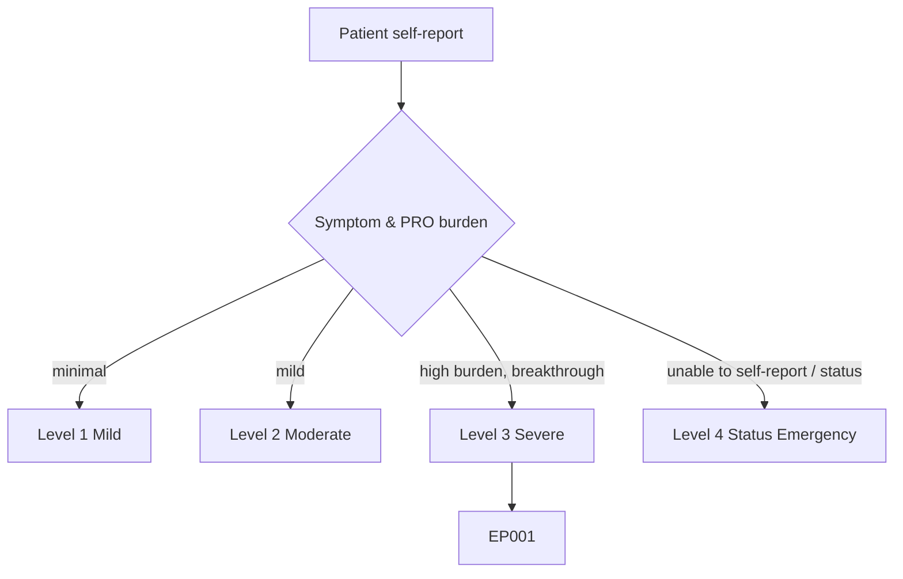
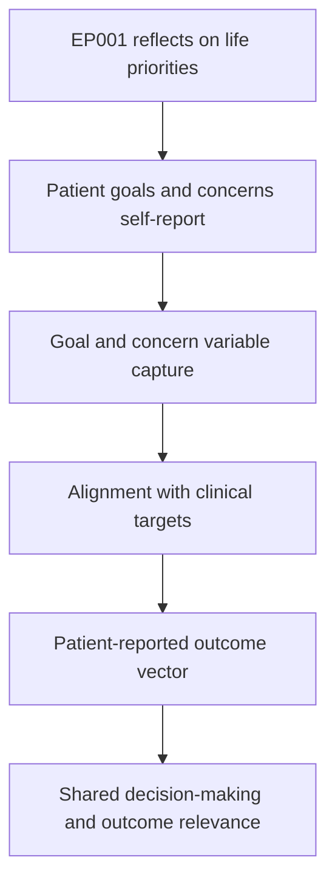
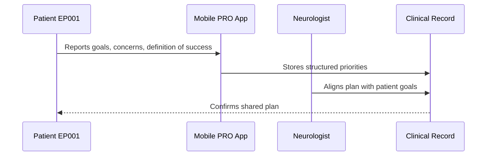
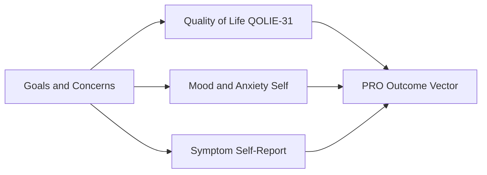
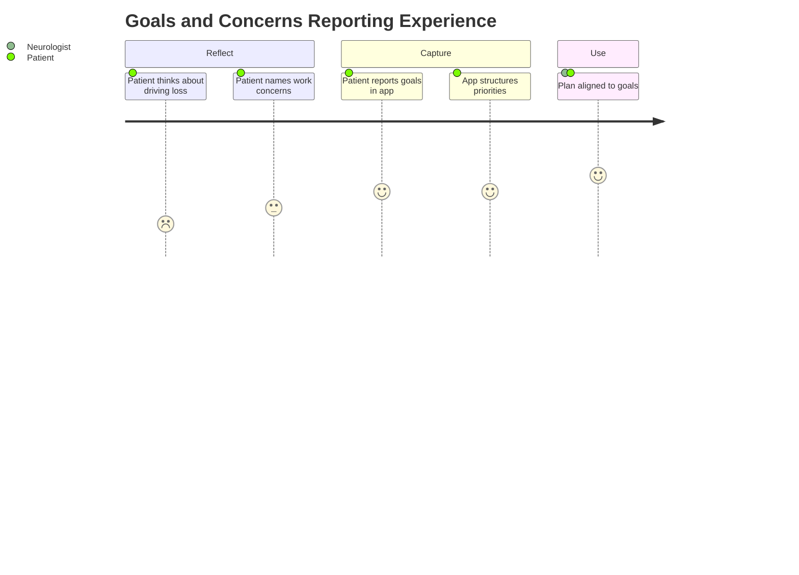

# Patient Self-Report — Section 8: Personal Goals & Concerns (EP001)

> **Why (this doc):** The patient's own goals and concerns define what treatment success means to him; they turn clinical targets into patient-centred priorities such as regaining driving independence. **How:** Patient EP001 reports personal goals and concerns into a fixed variable/value table that feeds the downstream patient-reported-outcome (PRO) vector and shared decision-making.

**Problem:** Care planning that ignores the patient's own priorities risks optimizing seizure counts while missing what matters most to the person living with epilepsy.

**Research Objective:** Capture standardized, first-person goal and concern variables for EP001 so patient priorities can be linked to clinical targets and shared decision-making.

**Role:** Patient · **Type:** Primary (patient-reported outcome) data

*Caption - First-person goals and concerns reported by EP001. These values align clinical targets with patient priorities and anchor shared decision-making and outcome relevance.*

| Variable | Value |
|---|---|
| My Top Goal | Regain driving independence |
| My Second Goal | Fewer seizures per month |
| My Third Goal | Sleep better and lower stress |
| Biggest Concern | Losing my license affects my job |
| Second Concern | Seizure at work in front of colleagues |
| Third Concern | Long-term medication side effects |
| Impact On Work | Commute and confidence affected |
| Impact On Relationships | Wife worries; I feel dependent |
| What Success Looks Like | 3 months seizure-free, driving again |
| Support I Want | Clear plan and trigger coaching |
| Willing To Try | Sleep changes, better adherence |
| Confidence In Plan | Moderate, hopeful |

## Questionnaire (Enterprise Form)

*Caption - The self-report questions the patient answers for this section, with response type, validation, EP001's example answer, and the derived AI feature.*

| ID | Question | Response Type | Validation | EP001 (Example) | AI Feature |
|---|---|---|---|---|---|
| PAT-0801 | What is my top goal for treatment? | Text | Free-text ≤120 chars | Regain driving independence | primary_goal |
| PAT-0802 | What is my second goal? | Text | Free-text ≤120 chars | Fewer seizures per month | secondary_goal |
| PAT-0803 | What is my third goal? | Text | Free-text ≤120 chars | Sleep better and lower stress | tertiary_goal |
| PAT-0804 | What is my biggest concern? | Text | Free-text ≤120 chars | Losing my license affects my job | primary_concern |
| PAT-0805 | What is my second concern? | Text | Free-text ≤120 chars | Seizure at work in front of colleagues | secondary_concern |
| PAT-0806 | What is my third concern? | Text | Free-text ≤120 chars | Long-term medication side effects | tertiary_concern |
| PAT-0807 | How does epilepsy affect my work? | Text | Free-text ≤200 chars | Commute and confidence affected | work_impact |
| PAT-0808 | How does epilepsy affect my relationships? | Text | Free-text ≤200 chars | Wife worries; I feel dependent | relationship_impact |
| PAT-0809 | What does treatment success look like to me? | Text | Free-text ≤200 chars | 3 months seizure-free, driving again | success_definition |
| PAT-0810 | What support do I want? | Text | Free-text ≤200 chars | Clear plan and trigger coaching | desired_support |
| PAT-0811 | What am I willing to try? | Text | Free-text ≤200 chars | Sleep changes, better adherence | willingness_to_change |
| PAT-0812 | How confident am I in my care plan? | Dropdown[Low/Moderate/High] | Ordered category | Moderate, hopeful | plan_confidence |

## Severity Scenario Model — Patient View

*Caption - The same self-report across four epilepsy severity levels from the patient's point of view; each self-reported variable shifts with severity. EP001 corresponds to Level 3 (Severe). Level 4 is the operational emergency — status epilepticus with seizures recurring about every 5 minutes.*

### Level 1 — Mild (Well-Controlled)
| Variable | Value |
|---|---|
| My Top Goal | Maintain seizure freedom |
| My Second Goal | Stay off extra medication |
| My Third Goal | Keep healthy routine |
| Biggest Concern | Rare — occasional relapse worry |
| Second Concern | Minimal |
| Third Concern | Minimal |
| Impact On Work | None |
| Impact On Relationships | None |
| What Success Looks Like | Continue as now |
| Support I Want | Routine check-ins |
| Willing To Try | Maintain habits |
| Confidence In Plan | High |

### Level 2 — Moderate (Intermediate)
| Variable | Value |
|---|---|
| My Top Goal | Reduce to seizure-free |
| My Second Goal | Regain full driving eligibility |
| My Third Goal | Improve sleep |
| Biggest Concern | Occasional seizure disrupts plans |
| Second Concern | Mild work impact |
| Third Concern | Side-effect worry |
| Impact On Work | Minor |
| Impact On Relationships | Slight worry |
| What Success Looks Like | Seizure-free 6 months |
| Support I Want | Clear plan |
| Willing To Try | Sleep and adherence tweaks |
| Confidence In Plan | Good |

### Level 3 — Severe (Poorly Controlled) — EP001
| Variable | Value |
|---|---|
| My Top Goal | Regain driving independence |
| My Second Goal | Fewer seizures per month |
| My Third Goal | Sleep better and lower stress |
| Biggest Concern | Losing my license affects my job |
| Second Concern | Seizure at work in front of colleagues |
| Third Concern | Long-term medication side effects |
| Impact On Work | Commute and confidence affected |
| Impact On Relationships | Wife worries; I feel dependent |
| What Success Looks Like | 3 months seizure-free, driving again |
| Support I Want | Clear plan and trigger coaching |
| Willing To Try | Sleep changes, better adherence |
| Confidence In Plan | Moderate, hopeful |

### Level 4 — Refractory / Status Epilepticus (Operational Emergency)
| Variable | Value |
|---|---|
| My Top Goal | Survive and stabilize after status |
| My Second Goal | Prevent another emergency |
| My Third Goal | Regain basic function |
| Biggest Concern | Life-threatening seizures |
| Second Concern | Long hospital stay / recovery |
| Third Concern | Loss of independence and job |
| Impact On Work | Off work; unable to function |
| Impact On Relationships | Family in crisis; fully dependent |
| What Success Looks Like | Out of danger, seizures stopped |
| Support I Want | Emergency and inpatient care |
| Willing To Try | Any intervention needed |
| Confidence In Plan | Frightened; goals stated by proxy |

### Severity Classification Logic

**Reason:** To show how personal goals and concerns shift across severity. **Why:** Because what the patient wants changes from maintaining freedom to surviving a crisis as control worsens. **What is happening:** EP001 aims to regain driving independence at Level 3, while Level 4 reduces goals to survival stated by proxy. **How it is happening:** Escalating seizure burden reframes priorities down the ladder until an emergency displaces long-term goals. **Reference:** Topol (2019).

## Data Flow in the Pipeline

**Reason:** To show where goals and concerns enter and travel through the pipeline. **Why:** Because patient priorities are only knowable from the patient and must shape the plan. **What is happening:** Life priorities become structured goal variables that populate the PRO vector. **How it is happening:** EP001 reports goals that are mapped to standardized fields and aligned with clinical targets. **Reference:** Topol (2019).

## Role Capturing the Data

**Reason:** To make explicit that the patient defines goals and concerns. **Why:** Because priority provenance belongs to the patient. **What is happening:** EP001 self-reports priorities that the neurologist aligns into the care plan. **How it is happening:** The app transcribes goals into structured fields used in shared decision-making. **Reference:** Topol (2019).

## Linkage to Other Assessment Sections

**Reason:** To show how goals connect to the wider PRO vector. **Why:** Because personal priorities must correlate with quality of life, mood, and symptom burden. **What is happening:** Goals link laterally to QoL, mood, and symptom sections and feed the composite PRO vector. **How it is happening:** Shared patient identifiers join these sections into one record. **Reference:** Topol (2019).

## Patient and Role Experience

**Reason:** To surface the lived experience behind personal priorities. **Why:** Because lost driving independence and job worry dominate EP001's motivation. **What is happening:** EP001's priorities are captured so the plan targets what matters to him. **How it is happening:** Structured goal capture turns felt priorities into shared, trackable objectives. **Reference:** APA (2020).

## Professor Readiness (Defense Q&A)

**Q1: Why capture patient goals as structured data?** Structuring goals makes patient priorities comparable and trackable, so treatment success can be judged against what matters to EP001 — driving and fewer seizures — not seizure counts alone.

**Q2: How do goals connect to the clinical plan?** Each goal maps to a clinical target: driving independence depends on seizure freedom, which depends on adherence and trigger control, aligning shared decision-making with measurable steps.

**Q3: Why does capturing concerns improve outcomes?** Naming concerns such as seizures at work and long-term side effects lets the team address adherence and psychosocial barriers directly, improving engagement and real-world outcomes.

## References

American Psychological Association. (2020). *Publication manual of the American Psychological Association* (7th ed.). American Psychological Association. https://doi.org/10.1037/0000165-000

Fisher, R. S., Cross, J. H., French, J. A., Higurashi, N., Hirsch, E., Jansen, F. E., Lagae, L., Moshé, S. L., Peltola, J., Roulet Perez, E., Scheffer, I. E., & Zuberi, S. M. (2017). Operational classification of seizure types by the International League Against Epilepsy. *Epilepsia, 58*(4), 522–530. https://doi.org/10.1111/epi.13670

Topol, E. J. (2019). *Deep medicine: How artificial intelligence can make healthcare human again*. Basic Books.
