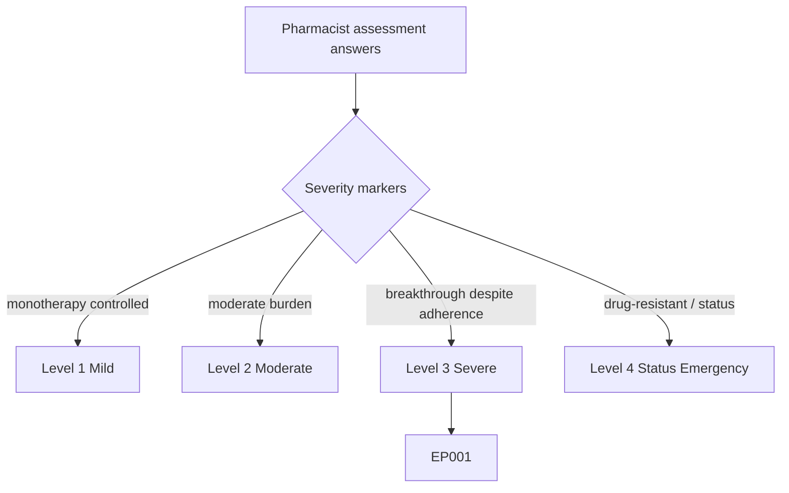
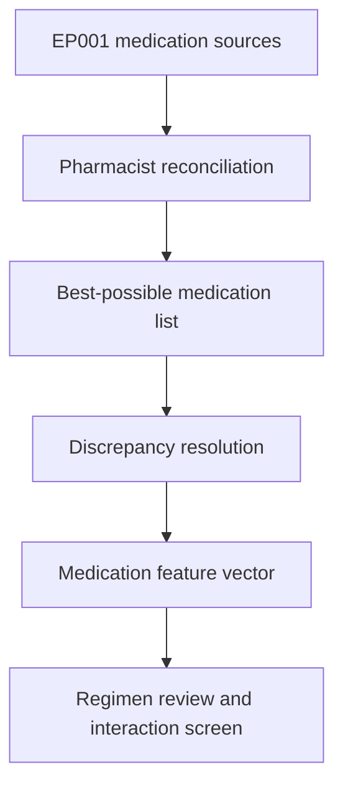
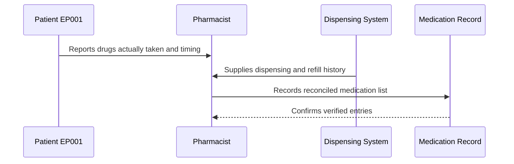
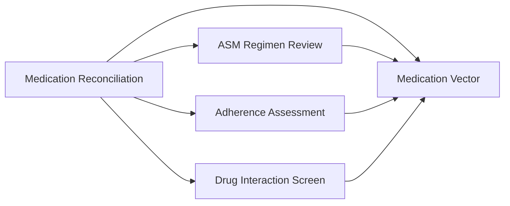
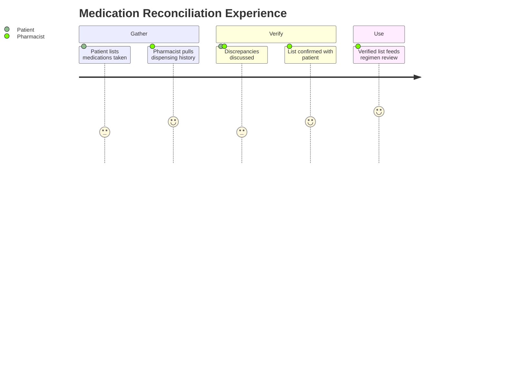

# Pharmacist Assessment — Section 1: Medication Reconciliation (EP001)

> **Why (this doc):** Medication reconciliation is the foundation of every pharmaceutical care decision; it produces a single, verified list of everything EP001 actually takes so that regimen review, interaction screening, and dosing all start from truth rather than assumption. **How:** The clinical pharmacist compares physician orders, dispensing history, and patient-reported use for patient EP001, resolving discrepancies into a fixed variable/value table that feeds the downstream medication vector and analytics pipeline.

**Problem:** Incomplete or conflicting medication lists cause undetected duplications, omissions, and interactions that drive breakthrough seizures and avoidable harm in focal epilepsy.

**Research Objective:** Capture a fully reconciled, source-verified medication list for EP001 so it can be reliably linked to adherence, interaction, dosing, and outcome data across the assessment.

**Role:** Pharmacist · **Type:** Primary (medication) data

*Caption - Reconciled best-possible medication history for EP001, verified by the clinical pharmacist across prescriber orders, pharmacy dispensing records, and patient self-report. These values anchor every downstream medication decision in the epilepsy workup.*

| Variable | Value |
|---|---|
| Patient ID | EP001 (EP-2026-001) |
| Weight | 72 kg |
| Reconciliation Date | 2026-07-11 |
| Sources Used | Prescriber orders, pharmacy dispensing log, patient interview |
| ASM 1 | Carbamazepine (CBZ) 400 mg BID |
| ASM 2 | Levetiracetam (LEV) 500 mg BID |
| PRN / Rescue | None currently prescribed |
| OTC / Supplements | Occasional ibuprofen; vitamin D 1000 IU |
| Known Allergies | No known drug allergies (NKDA) |
| Discrepancies Found | 1 (CBZ evening dose taken late/variably) |
| Discrepancies Resolved | Yes — timing counselling flagged |
| Total Active Medications | 2 ASMs + 1 supplement |

## Severity Scenario Model — Pharmacist View

*Caption - The same assessment answered across four epilepsy severity levels from the pharmacist's point of view; each variable shifts with severity. EP001 corresponds to Level 3 (Severe). Level 4 is the operational emergency — status epilepticus with seizures recurring about every 5 minutes.*

### Level 1 — Mild (Well-Controlled)
| Variable | Value |
|---|---|
| Patient ID | EP001 (EP-2026-001) |
| Weight | 72 kg |
| Reconciliation Date | 2026-07-11 |
| Sources Used | Single prescriber order + patient interview |
| ASM 1 | Levetiracetam (LEV) 250 mg BID (monotherapy) |
| ASM 2 | None |
| PRN / Rescue | None |
| OTC / Supplements | Vitamin D 1000 IU |
| Known Allergies | No known drug allergies (NKDA) |
| Discrepancies Found | 0 |
| Discrepancies Resolved | Not applicable |
| Total Active Medications | 1 ASM |

### Level 2 — Moderate (Intermediate)
| Variable | Value |
|---|---|
| Patient ID | EP001 (EP-2026-001) |
| Weight | 72 kg |
| Reconciliation Date | 2026-07-11 |
| Sources Used | Prescriber order + pharmacy dispensing log |
| ASM 1 | Levetiracetam (LEV) 500 mg BID (monotherapy) |
| ASM 2 | None |
| PRN / Rescue | None |
| OTC / Supplements | Occasional ibuprofen; vitamin D 1000 IU |
| Known Allergies | No known drug allergies (NKDA) |
| Discrepancies Found | 1 (dose-timing) |
| Discrepancies Resolved | Yes |
| Total Active Medications | 1 ASM + 1 supplement |

### Level 3 — Severe (Poorly Controlled) — EP001
| Variable | Value |
|---|---|
| Patient ID | EP001 (EP-2026-001) |
| Weight | 72 kg |
| Reconciliation Date | 2026-07-11 |
| Sources Used | Prescriber orders, pharmacy dispensing log, patient interview |
| ASM 1 | Carbamazepine (CBZ) 400 mg BID |
| ASM 2 | Levetiracetam (LEV) 500 mg BID |
| PRN / Rescue | None currently prescribed |
| OTC / Supplements | Occasional ibuprofen; vitamin D 1000 IU |
| Known Allergies | No known drug allergies (NKDA) |
| Discrepancies Found | 1 (CBZ evening dose taken late/variably) |
| Discrepancies Resolved | Yes — timing counselling flagged |
| Total Active Medications | 2 ASMs + 1 supplement |

### Level 4 — Refractory / Status Epilepticus (Operational Emergency)
| Variable | Value |
|---|---|
| Patient ID | EP001 (EP-2026-001) |
| Weight | 72 kg |
| Reconciliation Date | 2026-07-11 (emergency) |
| Sources Used | ED record + ICU chart (incomplete, urgent) |
| ASM 1 | Carbamazepine (CBZ) 400 mg BID (home regimen) |
| ASM 2 | Levetiracetam (LEV) IV loading + maintenance |
| PRN / Rescue | IV lorazepam first-line; midazolam infusion |
| OTC / Supplements | Held during admission |
| Known Allergies | No known drug allergies (NKDA) |
| Discrepancies Found | Multiple (home vs inpatient) |
| Discrepancies Resolved | Partial — urgent reconciliation in progress |
| Total Active Medications | 3+ ASMs + IV rescue agents |

### Severity Classification Logic

**Reason:** To grade EP001's reconciled medication list against a pharmacist severity ladder. **Why:** Because regimen complexity and rescue-medication need rise sharply with severity. **What is happening:** The same reconciliation variables shift from single-agent lists to emergency IV polypharmacy across levels. **How it is happening:** The pharmacist reads medication count, rescue status, and source completeness as severity markers. **Reference:** Patsalos (2013).

## Data Flow in the Pipeline

**Reason:** To show where reconciled medication data enters and travels through the epilepsy pipeline. **Why:** Because every downstream medication decision is invalid if the starting list is wrong. **What is happening:** Multiple medication sources are merged into one verified list that populates the medication vector. **How it is happening:** The pharmacist collates prescriber, pharmacy, and patient sources, resolves discrepancies, and passes the confirmed list forward. **Reference:** Patsalos (2013).

## Role Capturing the Data

**Reason:** To make explicit which role captures and verifies each medication element. **Why:** Because provenance of the medication list matters for safety and research. **What is happening:** The pharmacist integrates patient, dispensing, and prescriber input into one verified record. **How it is happening:** A structured medication interview plus dispensing-log cross-check is transcribed and read back for confirmation. **Reference:** Fisher et al. (2017).

## Linkage to Other Assessment Sections

**Reason:** To show how reconciliation connects to the wider medication vector. **Why:** Because regimen, adherence, and interaction work all depend on an accurate baseline list. **What is happening:** The reconciled list links laterally to every other pharmacist section and feeds the composite medication vector. **How it is happening:** Shared patient identifiers and drug codes join these sections into one record. **Reference:** Topol (2019).

## Patient and Role Experience

**Reason:** To surface the lived experience of building the reconciled list. **Why:** Because recall gaps and reporting reluctance affect list accuracy. **What is happening:** Patient recall and dispensing data are shaped into a confirmed, usable list. **How it is happening:** A guided interview plus refill-history cross-check reduces omissions and improves accuracy. **Reference:** APA (2020).

## Professor Readiness (Defense Q&A)

**Q1: Why is medication reconciliation done before regimen review?** Because a valid regimen or interaction assessment is impossible without first confirming what the patient actually takes; reconciliation removes the risk of building decisions on an inaccurate list.

**Q2: Why use three independent sources?** Prescriber orders, dispensing records, and patient self-report each capture different failure modes (ordering errors, refill gaps, actual-use deviations), and triangulating them yields the best-possible medication history.

**Q3: What discrepancy did EP001 show and why does it matter?** The evening carbamazepine dose is taken late or variably, which flattens trough coverage and plausibly contributes to breakthrough seizures despite otherwise good adherence.

## References

American Psychological Association. (2020). *Publication manual of the American Psychological Association* (7th ed.). https://doi.org/10.1037/0000165-000

Fisher, R. S., Cross, J. H., French, J. A., Higurashi, N., Hirsch, E., Jansen, F. E., Lagae, L., Moshé, S. L., Peltola, J., Roulet Perez, E., Scheffer, I. E., & Zuberi, S. M. (2017). Operational classification of seizure types by the International League Against Epilepsy. *Epilepsia, 58*(4), 522–530. https://doi.org/10.1111/epi.13670

Patsalos, P. N. (2013). *Antiepileptic drug interactions: A clinical guide* (2nd ed.). Springer. https://doi.org/10.1007/978-1-4471-2434-4
