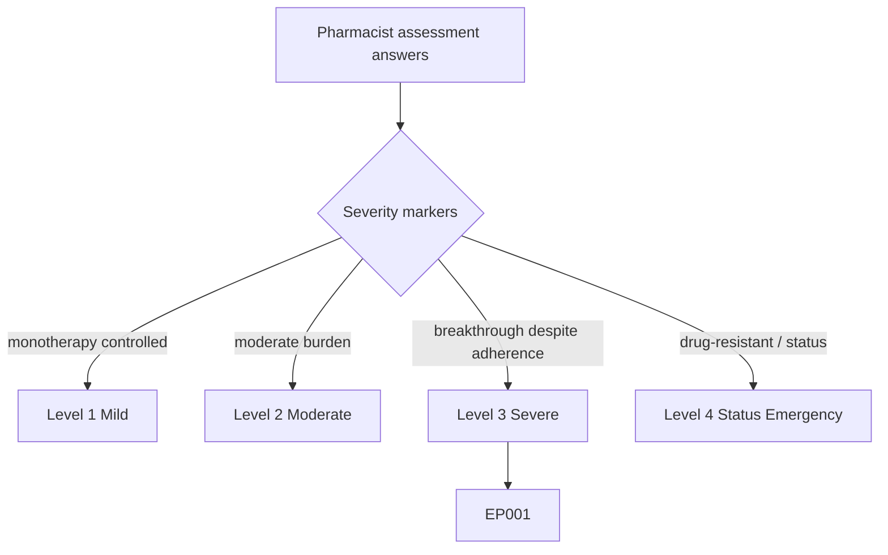
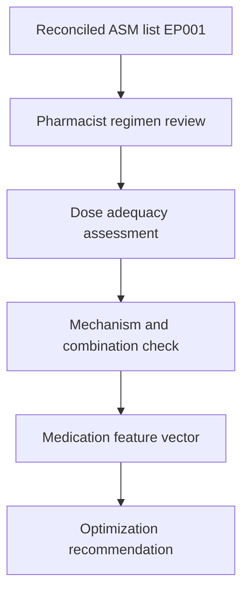
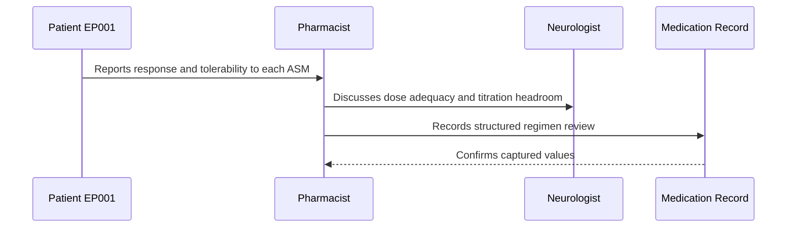
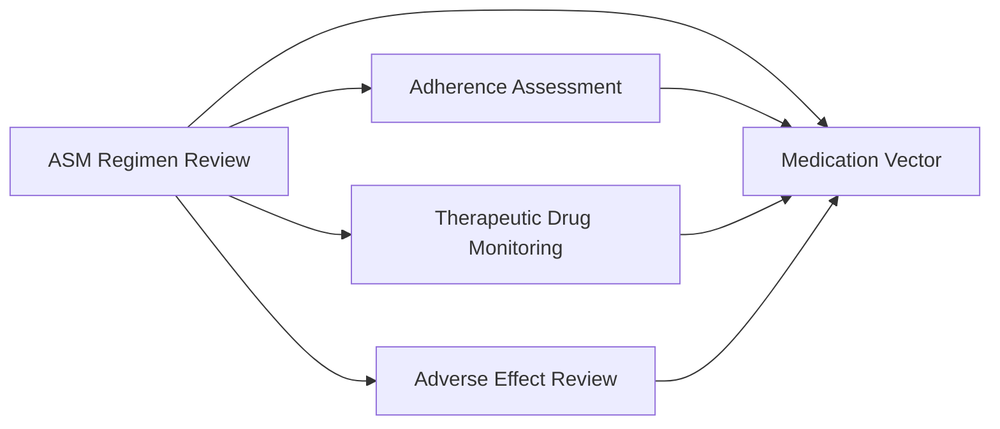
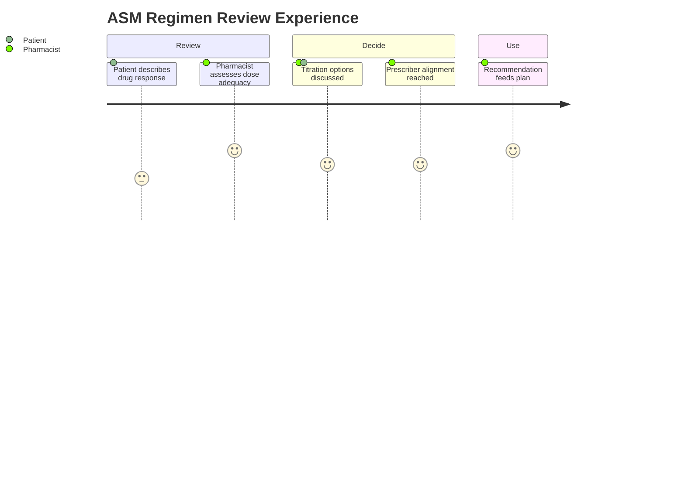

# Pharmacist Assessment — Section 2: ASM Regimen Review (EP001)

> **Why (this doc):** The antiseizure-medication (ASM) regimen is the primary lever for seizure control; reviewing its rationality, dosing, and mechanism fit tells the team whether EP001's breakthrough seizures reflect an undertreated regimen versus an adherence or pharmacokinetic problem. **How:** The clinical pharmacist evaluates each ASM's indication, dose, frequency, and mechanistic rationale for patient EP001 into a fixed variable/value table that feeds the downstream medication vector and analytics pipeline.

**Problem:** Suboptimal ASM selection, dosing, or combination leads to persistent seizures despite treatment, and unstructured review hides whether the regimen itself is the limiting factor.

**Research Objective:** Capture a structured, mechanism-aware ASM regimen review for EP001 so dose adequacy and combination rationale can be linked to control, TDM, and outcome data.

**Role:** Pharmacist · **Type:** Primary (medication) data

*Caption - Structured ASM regimen review for EP001, recorded by the clinical pharmacist. These values quantify dose adequacy and combination rationale that determine whether the current regimen can plausibly achieve seizure freedom.*

| Variable | Value |
|---|---|
| ASM 1 | Carbamazepine (CBZ) |
| CBZ Dose | 400 mg BID (800 mg/day) |
| CBZ Mechanism | Sodium-channel blockade |
| CBZ Enzyme Status | Strong CYP3A4 inducer (auto-inducer) |
| ASM 2 | Levetiracetam (LEV) |
| LEV Dose | 500 mg BID (1000 mg/day) |
| LEV Mechanism | SV2A synaptic-vesicle binding |
| Combination Rationale | Complementary mechanisms; no shared metabolism target |
| Dose Adequacy (CBZ) | Low–moderate; below weight-based ceiling |
| Dose Adequacy (LEV) | Low; titration headroom to 1500–3000 mg/day |
| Seizure Control | Inadequate — ~5/month, breakthrough |
| Regimen Recommendation | Optimize LEV titration; reassess CBZ trough |

## Questionnaire (Enterprise Form)

*Caption - The items the pharmacist records for this section, with response type, validation, EP001's example value, and the derived AI feature.*

| ID | Question | Response Type | Validation | EP001 (Example) | AI Feature |
|---|---|---|---|---|---|
| PHA-0201 | What is the first antiseizure medication? | Text | Drug name | Carbamazepine (CBZ) | primary_asm_identity |
| PHA-0202 | What is the carbamazepine dose and total daily amount? | Text | mg BID; max 1600 mg/day | 400 mg BID (800 mg/day) | cbz_daily_dose_mg |
| PHA-0203 | What is carbamazepine's mechanism of action? | Read-only(Auto) | Drug-class lookup | Sodium-channel blockade | mechanism_class_tag |
| PHA-0204 | What is carbamazepine's enzyme-induction status? | Read-only(Auto) | Inducer / inhibitor / neutral | Strong CYP3A4 inducer (auto-inducer) | enzyme_induction_flag |
| PHA-0205 | What is the second antiseizure medication? | Text | Drug name, or None | Levetiracetam (LEV) | secondary_asm_identity |
| PHA-0206 | What is the levetiracetam dose and total daily amount? | Text | mg BID; 500–3000 mg/day | 500 mg BID (1000 mg/day) | lev_daily_dose_mg |
| PHA-0207 | What is levetiracetam's mechanism of action? | Read-only(Auto) | Drug-class lookup | SV2A synaptic-vesicle binding | mechanism_class_tag |
| PHA-0208 | What is the rationale for this drug combination? | Text | Free text | Complementary mechanisms; no shared metabolism target | combination_rationality_score |
| PHA-0209 | Is the carbamazepine dose adequate relative to the ceiling? | Dropdown[Subtherapeutic/Low/Low-moderate/Adequate/At-ceiling] | Single select | Low–moderate; below weight-based ceiling | cbz_dose_adequacy |
| PHA-0210 | Is the levetiracetam dose adequate relative to headroom? | Dropdown[Subtherapeutic/Low/Low-moderate/Adequate/At-ceiling] | Single select | Low; titration headroom to 1500–3000 mg/day | lev_dose_adequacy |
| PHA-0211 | What is the current seizure-control status? | Dropdown[Controlled/Mostly controlled/Inadequate/Status] | Single select | Inadequate — ~5/month, breakthrough | seizure_control_status |
| PHA-0212 | What is the regimen recommendation? | Text | Free text | Optimize LEV titration; reassess CBZ trough | regimen_optimization_action |

## Severity Scenario Model — Pharmacist View

*Caption - The same assessment answered across four epilepsy severity levels from the pharmacist's point of view; each variable shifts with severity. EP001 corresponds to Level 3 (Severe). Level 4 is the operational emergency — status epilepticus with seizures recurring about every 5 minutes.*

### Level 1 — Mild (Well-Controlled)
| Variable | Value |
|---|---|
| ASM 1 | Levetiracetam (LEV) |
| CBZ Dose | Not applicable (no CBZ) |
| CBZ Mechanism | Not applicable |
| CBZ Enzyme Status | Not applicable |
| ASM 2 | None (monotherapy) |
| LEV Dose | 250 mg BID (500 mg/day) |
| LEV Mechanism | SV2A synaptic-vesicle binding |
| Combination Rationale | Monotherapy — none required |
| Dose Adequacy (CBZ) | Not applicable |
| Dose Adequacy (LEV) | Adequate at low dose |
| Seizure Control | Controlled — seizure-free |
| Regimen Recommendation | Maintain monotherapy |

### Level 2 — Moderate (Intermediate)
| Variable | Value |
|---|---|
| ASM 1 | Levetiracetam (LEV) |
| CBZ Dose | Not applicable (no CBZ) |
| CBZ Mechanism | Not applicable |
| CBZ Enzyme Status | Not applicable |
| ASM 2 | None (monotherapy) |
| LEV Dose | 500 mg BID (1000 mg/day) |
| LEV Mechanism | SV2A synaptic-vesicle binding |
| Combination Rationale | Monotherapy maintained |
| Dose Adequacy (CBZ) | Not applicable |
| Dose Adequacy (LEV) | Moderate; minor tolerability issues |
| Seizure Control | Mostly controlled — rare seizures |
| Regimen Recommendation | Monitor; consider small titration |

### Level 3 — Severe (Poorly Controlled) — EP001
| Variable | Value |
|---|---|
| ASM 1 | Carbamazepine (CBZ) |
| CBZ Dose | 400 mg BID (800 mg/day) |
| CBZ Mechanism | Sodium-channel blockade |
| CBZ Enzyme Status | Strong CYP3A4 inducer (auto-inducer) |
| ASM 2 | Levetiracetam (LEV) |
| LEV Dose | 500 mg BID (1000 mg/day) |
| LEV Mechanism | SV2A synaptic-vesicle binding |
| Combination Rationale | Complementary mechanisms; no shared metabolism target |
| Dose Adequacy (CBZ) | Low–moderate; below weight-based ceiling |
| Dose Adequacy (LEV) | Low; titration headroom to 1500–3000 mg/day |
| Seizure Control | Inadequate — ~5/month, breakthrough |
| Regimen Recommendation | Optimize LEV titration; reassess CBZ trough |

### Level 4 — Refractory / Status Epilepticus (Operational Emergency)
| Variable | Value |
|---|---|
| ASM 1 | Carbamazepine (CBZ) |
| CBZ Dose | 400 mg BID (home) — held/adjusted acutely |
| CBZ Mechanism | Sodium-channel blockade |
| CBZ Enzyme Status | Strong CYP3A4 inducer (complicates IV dosing) |
| ASM 2 | Levetiracetam + IV valproate/phenytoin loading |
| LEV Dose | IV load ~60 mg/kg then maintenance |
| LEV Mechanism | SV2A synaptic-vesicle binding |
| Combination Rationale | Emergency multi-agent to abort status |
| Dose Adequacy (CBZ) | Insufficient — failed to prevent status |
| Dose Adequacy (LEV) | Escalated to IV loading dose |
| Seizure Control | Status epilepticus — seizures every ~5 min |
| Regimen Recommendation | IV benzodiazepine + IV loading; ICU management |

### Severity Classification Logic

**Reason:** To grade EP001's ASM regimen against a pharmacist severity ladder. **Why:** Because regimen complexity and dose escalation track directly with seizure severity. **What is happening:** The regimen shifts from low-dose monotherapy to emergency IV loading polytherapy across levels. **How it is happening:** The pharmacist reads drug count, dose adequacy, and control status as severity markers. **Reference:** Patsalos (2013).

## Data Flow in the Pipeline

**Reason:** To show where regimen-review data enters the epilepsy pipeline. **Why:** Because control decisions depend on knowing whether dosing is adequate before escalation. **What is happening:** The reconciled ASM list becomes a scored regimen with dose-adequacy and mechanism flags. **How it is happening:** The pharmacist maps each drug to dose, mechanism, and ceiling, then forwards the optimization signal. **Reference:** Patsalos (2013).

## Role Capturing the Data

**Reason:** To make explicit who evaluates the regimen and against what. **Why:** Because pharmacist–prescriber collaboration governs dosing decisions. **What is happening:** The pharmacist integrates patient response with dosing science and prescriber intent. **How it is happening:** A structured review of dose, mechanism, and ceiling is transcribed and confirmed. **Reference:** Fisher et al. (2017).

## Linkage to Other Assessment Sections

**Reason:** To show how regimen review connects to adherence, TDM, and tolerability. **Why:** Because dose adequacy is only interpretable alongside adherence and serum levels. **What is happening:** The regimen review links laterally to sibling sections and feeds the medication vector. **How it is happening:** Shared patient keys and drug codes join these outputs into one record. **Reference:** Topol (2019).

## Patient and Role Experience

**Reason:** To surface the experience behind regimen review. **Why:** Because patient-perceived response shapes titration acceptance. **What is happening:** Patient response and dosing science combine into an optimization plan. **How it is happening:** Guided review of each drug informs a shared titration decision. **Reference:** APA (2020).

## Professor Readiness (Defense Q&A)

**Q1: Is EP001's regimen mechanistically rational?** Yes — CBZ (sodium-channel) and LEV (SV2A) act by complementary mechanisms with no shared metabolic target, which is a defensible rational polytherapy pairing.

**Q2: If the combination is rational, why are seizures persisting?** Both agents sit below their weight-based ceilings, especially LEV with wide titration headroom, so the most likely limiting factor is underdosing rather than mechanism mismatch.

**Q3: Why address LEV before adding a third agent?** Because optimizing an existing well-tolerated agent to an effective dose is preferred over adding new drugs that increase interaction and adverse-effect burden.

## References

American Psychological Association. (2020). *Publication manual of the American Psychological Association* (7th ed.). https://doi.org/10.1037/0000165-000

Fisher, R. S., Cross, J. H., French, J. A., Higurashi, N., Hirsch, E., Jansen, F. E., Lagae, L., Moshé, S. L., Peltola, J., Roulet Perez, E., Scheffer, I. E., & Zuberi, S. M. (2017). Operational classification of seizure types by the International League Against Epilepsy. *Epilepsia, 58*(4), 522–530. https://doi.org/10.1111/epi.13670

Patsalos, P. N. (2013). *Antiepileptic drug interactions: A clinical guide* (2nd ed.). Springer. https://doi.org/10.1007/978-1-4471-2434-4
