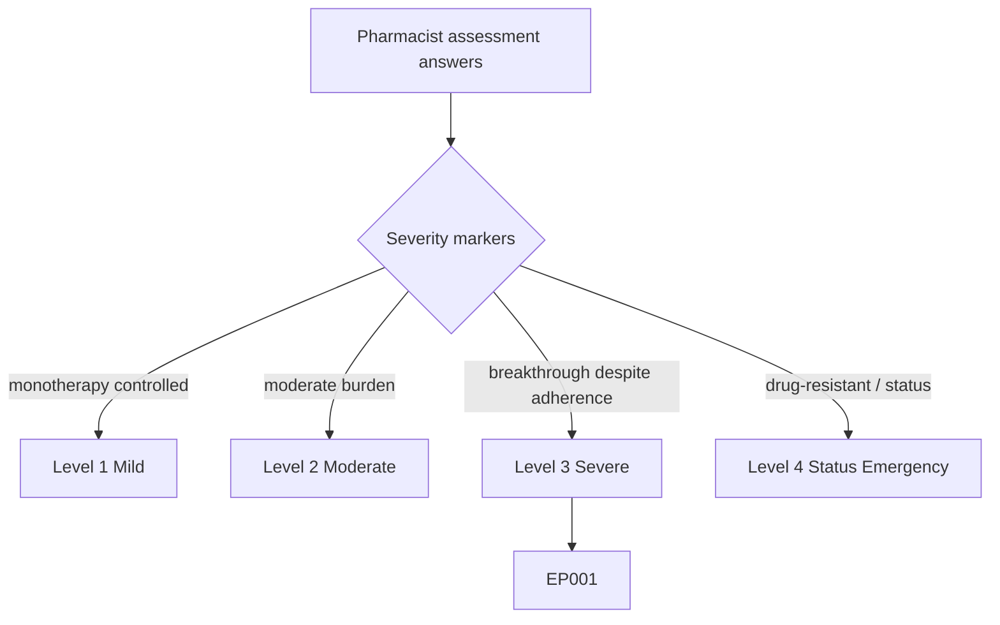
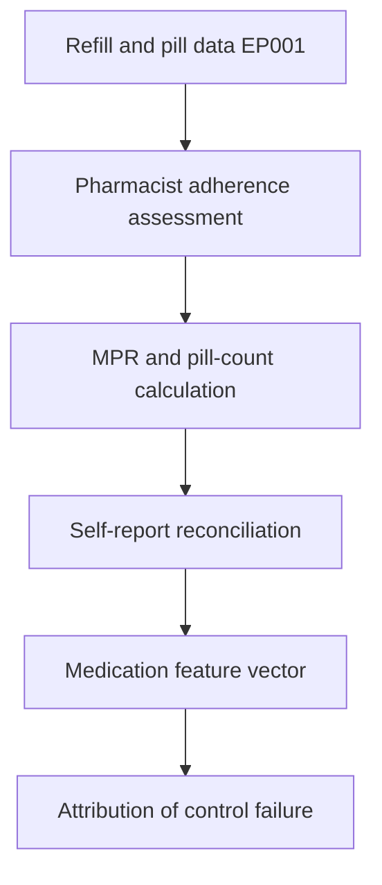
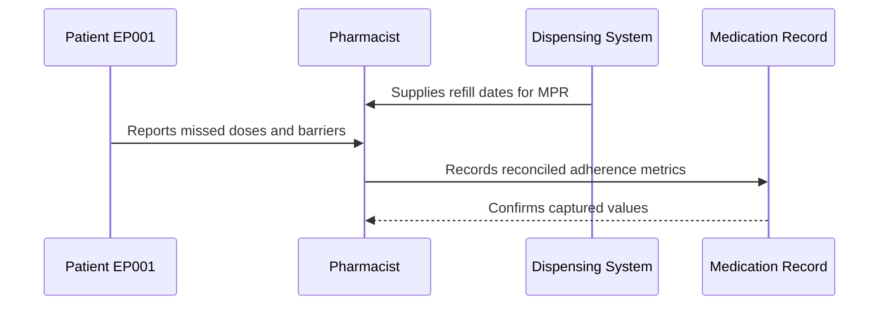
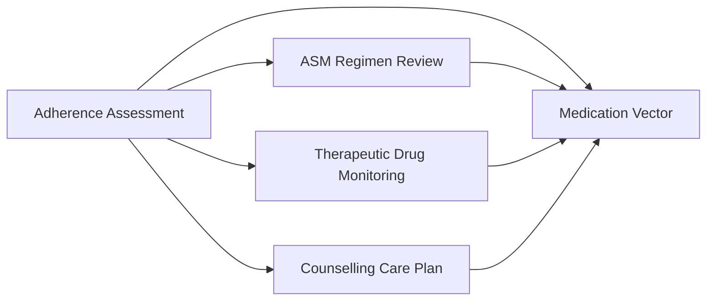
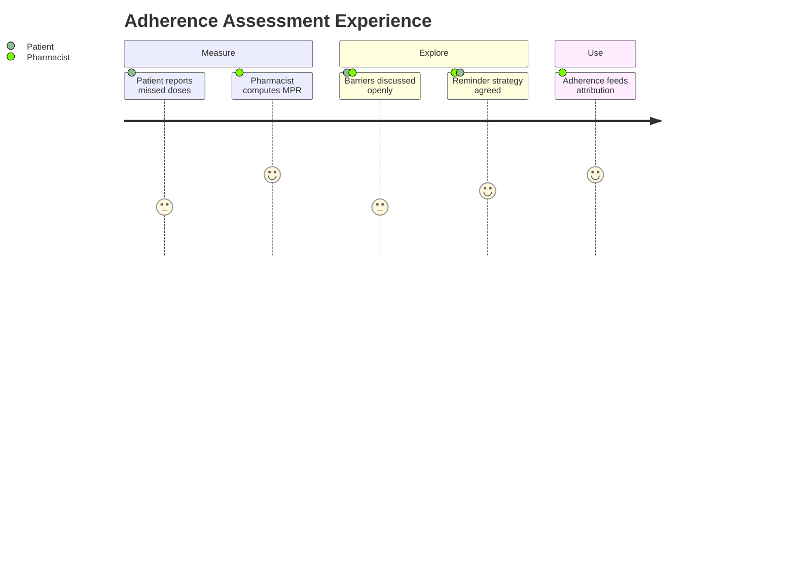

# Pharmacist Assessment — Section 3: Adherence Assessment (EP001)

> **Why (this doc):** Adherence is the hinge between a prescribed regimen and the dose the patient actually receives; quantifying it tells the team whether EP001's breakthrough seizures stem from underdosing-by-nonadherence versus a genuinely inadequate regimen. **How:** The clinical pharmacist measures adherence for patient EP001 using pill count, medication possession ratio (MPR), and validated self-report into a fixed variable/value table that feeds the downstream medication vector and analytics pipeline.

**Problem:** Unmeasured or overstated adherence masks the true cause of persistent seizures and leads to unnecessary dose escalation or drug switching.

**Research Objective:** Capture triangulated, objective adherence metrics for EP001 so control failures can be correctly attributed to adherence versus regimen and linked to TDM and outcome data.

**Role:** Pharmacist · **Type:** Primary (medication) data

*Caption - Triangulated adherence metrics for EP001, recorded by the clinical pharmacist across pill count, MPR, and self-report. These values determine whether breakthrough seizures reflect nonadherence or an inadequate regimen.*

| Variable | Value |
|---|---|
| Assessment Method | Pill count + MPR + self-report |
| Refill Records Reviewed | 90 days |
| Medication Possession Ratio (MPR) | 0.88 |
| Pill Count Adherence | 87% |
| Self-Report (Morisky-style) | Occasionally misses evening dose |
| Doses Missed / Week (est.) | 1–2 (evening CBZ) |
| Adherence Category | Suboptimal (borderline) |
| Barrier Identified | Evening schedule / work shift timing |
| Pattern | Consistent morning, variable evening |
| Impact on Control | Plausible contributor to breakthrough |
| Intervention | Dose-timing counselling, reminder app |
| Reassessment Interval | 4 weeks |

## Questionnaire (Enterprise Form)

*Caption - The items the pharmacist records for this section, with response type, validation, EP001's example value, and the derived AI feature.*

| ID | Question | Response Type | Validation | EP001 (Example) | AI Feature |
|---|---|---|---|---|---|
| PHA-0301 | Which methods were used to assess adherence? | Dropdown[Pill count/MPR/Self-report/Inpatient MAR review] (multi-select) | At least 1 required | Pill count + MPR + self-report | adherence_method_set |
| PHA-0302 | How many days of refill records were reviewed? | Number | 30–365 days | 90 days | refill_window_days |
| PHA-0303 | What is the medication possession ratio (MPR)? | Number | 0.00–1.00 | 0.88 | medication_possession_ratio |
| PHA-0304 | What is the pill-count adherence percentage? | Percentage | 0–100% | 87% | pill_count_adherence_pct |
| PHA-0305 | What did the patient self-report about missed doses? | Text | Free text | Occasionally misses evening dose | self_report_adherence |
| PHA-0306 | How many doses are missed per week (estimated)? | Number | 0–14 | 1–2 (evening CBZ) | missed_doses_per_week |
| PHA-0307 | What is the overall adherence category? | Dropdown[Optimal/Good/Suboptimal/Critical] | Single select | Suboptimal (borderline) | adherence_category |
| PHA-0308 | What adherence barrier was identified? | Text | Free text, or None | Evening schedule / work shift timing | adherence_barrier_tag |
| PHA-0309 | What is the observed dosing pattern? | Text | Free text | Consistent morning, variable evening | dosing_pattern_profile |
| PHA-0310 | What is the likely impact of adherence on seizure control? | Dropdown[None/Minimal/Plausible contributor/Precipitant] | Single select | Plausible contributor to breakthrough | adherence_control_impact |
| PHA-0311 | What adherence intervention is planned? | Text | Free text | Dose-timing counselling, reminder app | adherence_intervention |
| PHA-0312 | When should adherence be reassessed? | Dropdown[4 weeks/3 months/6–12 months/Continuous] | Single select | 4 weeks | reassessment_interval |

## Severity Scenario Model — Pharmacist View

*Caption - The same assessment answered across four epilepsy severity levels from the pharmacist's point of view; each variable shifts with severity. EP001 corresponds to Level 3 (Severe). Level 4 is the operational emergency — status epilepticus with seizures recurring about every 5 minutes.*

### Level 1 — Mild (Well-Controlled)
| Variable | Value |
|---|---|
| Assessment Method | Self-report + MPR |
| Refill Records Reviewed | 90 days |
| Medication Possession Ratio (MPR) | 0.98 |
| Pill Count Adherence | 98% |
| Self-Report (Morisky-style) | No missed doses |
| Doses Missed / Week (est.) | 0 |
| Adherence Category | Optimal |
| Barrier Identified | None |
| Pattern | Consistent daily dosing |
| Impact on Control | None — well controlled |
| Intervention | Reinforce good adherence |
| Reassessment Interval | 6–12 months |

### Level 2 — Moderate (Intermediate)
| Variable | Value |
|---|---|
| Assessment Method | Pill count + MPR + self-report |
| Refill Records Reviewed | 90 days |
| Medication Possession Ratio (MPR) | 0.93 |
| Pill Count Adherence | 92% |
| Self-Report (Morisky-style) | Rare missed dose |
| Doses Missed / Week (est.) | Less than 1 |
| Adherence Category | Good |
| Barrier Identified | Occasional forgetfulness |
| Pattern | Mostly consistent |
| Impact on Control | Minimal |
| Intervention | Light reminder counselling |
| Reassessment Interval | 3 months |

### Level 3 — Severe (Poorly Controlled) — EP001
| Variable | Value |
|---|---|
| Assessment Method | Pill count + MPR + self-report |
| Refill Records Reviewed | 90 days |
| Medication Possession Ratio (MPR) | 0.88 |
| Pill Count Adherence | 87% |
| Self-Report (Morisky-style) | Occasionally misses evening dose |
| Doses Missed / Week (est.) | 1–2 (evening CBZ) |
| Adherence Category | Suboptimal (borderline) |
| Barrier Identified | Evening schedule / work shift timing |
| Pattern | Consistent morning, variable evening |
| Impact on Control | Plausible contributor to breakthrough |
| Intervention | Dose-timing counselling, reminder app |
| Reassessment Interval | 4 weeks |

### Level 4 — Refractory / Status Epilepticus (Operational Emergency)
| Variable | Value |
|---|---|
| Assessment Method | Inpatient MAR review (unable to self-administer) |
| Refill Records Reviewed | Home history (pre-admission) |
| Medication Possession Ratio (MPR) | Not measurable acutely; pre-event ~0.80 |
| Pill Count Adherence | Not applicable — IV route |
| Self-Report (Morisky-style) | Unavailable — impaired consciousness |
| Doses Missed / Week (est.) | Nonadherence suspected as precipitant |
| Adherence Category | Critical — IV administration required |
| Barrier Identified | Acute seizures / obtundation |
| Pattern | Home regimen disrupted, precipitated status |
| Impact on Control | Precipitated status epilepticus |
| Intervention | IV dosing; adherence root-cause after stabilization |
| Reassessment Interval | Continuous inpatient monitoring |

### Severity Classification Logic

**Reason:** To grade EP001's adherence against a pharmacist severity ladder. **Why:** Because adherence measurability and its consequences worsen sharply with severity. **What is happening:** MPR falls and the measurement mode shifts from self-report to inpatient MAR across levels. **How it is happening:** The pharmacist reads MPR, missed-dose pattern, and administration route as severity markers. **Reference:** Patsalos (2013).

## Data Flow in the Pipeline

**Reason:** To show where adherence data enters the epilepsy pipeline. **Why:** Because control failures cannot be correctly attributed without an objective adherence measure. **What is happening:** Refill and pill-count data become a quantified adherence score reconciled with self-report. **How it is happening:** The pharmacist computes MPR, cross-checks pill counts and self-report, and forwards the attribution signal. **Reference:** Patsalos (2013).

## Role Capturing the Data

**Reason:** To make explicit who measures adherence and how. **Why:** Because objective plus self-reported sources must be reconciled by one accountable role. **What is happening:** The pharmacist integrates dispensing data with patient-reported behavior. **How it is happening:** MPR computation and structured self-report are transcribed and confirmed. **Reference:** Fisher et al. (2017).

## Linkage to Other Assessment Sections

**Reason:** To show how adherence connects to regimen, TDM, and counselling. **Why:** Because serum levels and dose decisions are only interpretable with adherence context. **What is happening:** Adherence links laterally to sibling sections and feeds the medication vector. **How it is happening:** Shared patient keys join adherence with dosing and level data. **Reference:** Topol (2019).

## Patient and Role Experience

**Reason:** To surface the experience of measuring adherence. **Why:** Because honest disclosure of missed doses depends on a non-judgmental interaction. **What is happening:** Objective data and candid self-report combine into an actionable adherence picture. **How it is happening:** A supportive interview plus MPR data reduces over-reporting bias. **Reference:** APA (2020).

## Professor Readiness (Defense Q&A)

**Q1: Why triangulate three adherence measures?** Each method has bias — self-report overstates, pill count is gameable, and MPR misses actual ingestion — so combining them yields a more defensible estimate than any single measure.

**Q2: Is 88% adherence good enough for epilepsy?** For ASMs the effective threshold is high; even 88% (roughly one missed evening dose per week) can produce trough dips sufficient to permit breakthrough seizures, so it is treated as suboptimal.

**Q3: How does this change management?** Because adherence is borderline rather than poor, the plan prioritizes dose-timing counselling and reminders before assuming the regimen itself has failed, avoiding premature escalation.

## References

American Psychological Association. (2020). *Publication manual of the American Psychological Association* (7th ed.). https://doi.org/10.1037/0000165-000

Fisher, R. S., Cross, J. H., French, J. A., Higurashi, N., Hirsch, E., Jansen, F. E., Lagae, L., Moshé, S. L., Peltola, J., Roulet Perez, E., Scheffer, I. E., & Zuberi, S. M. (2017). Operational classification of seizure types by the International League Against Epilepsy. *Epilepsia, 58*(4), 522–530. https://doi.org/10.1111/epi.13670

Patsalos, P. N. (2013). *Antiepileptic drug interactions: A clinical guide* (2nd ed.). Springer. https://doi.org/10.1007/978-1-4471-2434-4
