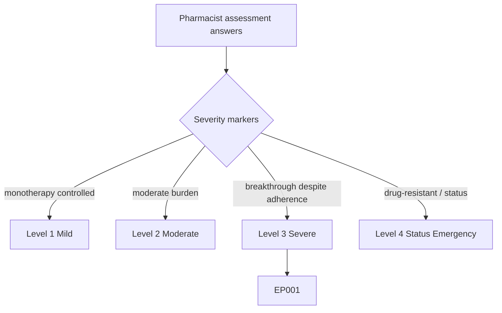
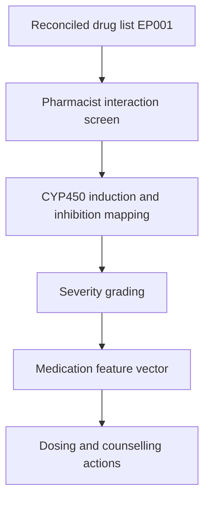
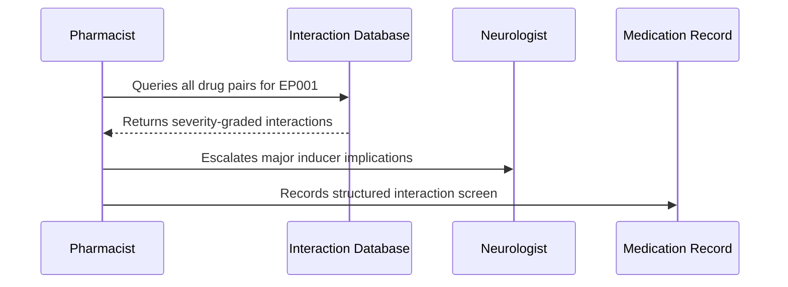
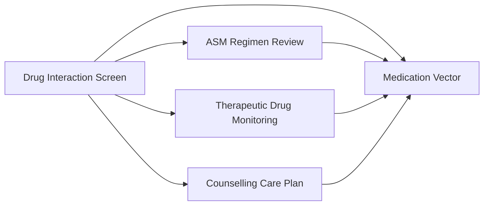
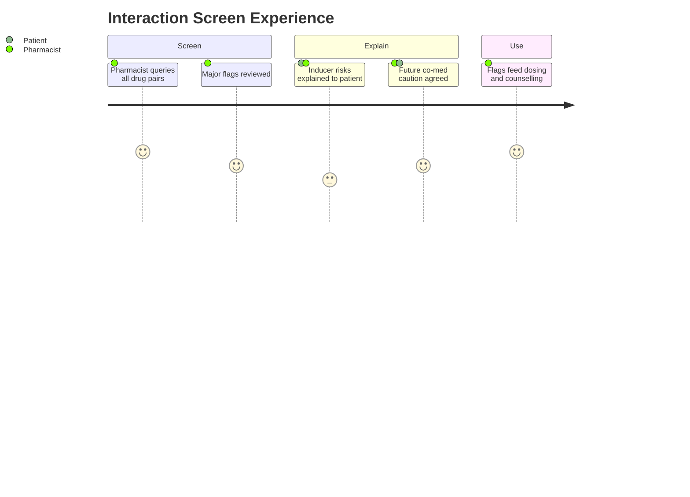

# Pharmacist Assessment — Section 4: Drug–Drug Interaction Screen (EP001)

> **Why (this doc):** Enzyme-inducing ASMs silently lower the levels of their co-medications and even themselves, so a structured interaction screen is what prevents EP001's carbamazepine from undermining seizure control and future co-prescriptions. **How:** The clinical pharmacist screens every drug pair for patient EP001 with emphasis on CYP-mediated interactions into a fixed variable/value table that feeds the downstream medication vector and analytics pipeline.

**Problem:** Enzyme-inducer interactions (especially carbamazepine on CYP3A4) go undetected in unstructured review, causing subtherapeutic co-medications, contraceptive failure, and fluctuating ASM levels.

**Research Objective:** Capture a systematic drug–drug interaction screen for EP001 so induction and inhibition risks can be linked to dosing, TDM, and counselling decisions.

**Role:** Pharmacist · **Type:** Primary (medication) data

*Caption - Systematic drug–drug interaction screen for EP001, recorded by the clinical pharmacist with emphasis on carbamazepine's enzyme-inducing effects. These values flag induction risks that alter dosing of both ASMs and any co-medication.*

| Variable | Value |
|---|---|
| Screening Tool | CYP450 interaction matrix + clinical database |
| Index Inducer | Carbamazepine (strong CYP3A4 inducer) |
| Auto-Induction | Yes — CBZ induces its own metabolism |
| CBZ × LEV | Minimal (LEV renally cleared, non-CYP) |
| CBZ × Oral Contraceptives | Major — reduced contraceptive efficacy |
| CBZ × Warfarin | Major — reduced anticoagulant effect |
| CBZ × Ibuprofen (OTC) | Minor — monitor, no action |
| Enzyme-Inhibitor Present | No |
| Highest Severity Flag | Major (contraceptive / anticoagulant class) |
| Clinically Active Interactions | 0 current (no OC/warfarin now) |
| Counselling Trigger | Yes — future co-prescribing caution |
| Recommendation | Document inducer status prominently in record |

## Severity Scenario Model — Pharmacist View

*Caption - The same assessment answered across four epilepsy severity levels from the pharmacist's point of view; each variable shifts with severity. EP001 corresponds to Level 3 (Severe). Level 4 is the operational emergency — status epilepticus with seizures recurring about every 5 minutes.*

### Level 1 — Mild (Well-Controlled)
| Variable | Value |
|---|---|
| Screening Tool | CYP450 interaction matrix + clinical database |
| Index Inducer | None (LEV non-inducing) |
| Auto-Induction | No |
| CBZ × LEV | Not applicable (no CBZ) |
| CBZ × Oral Contraceptives | Not applicable |
| CBZ × Warfarin | Not applicable |
| CBZ × Ibuprofen (OTC) | Not applicable |
| Enzyme-Inhibitor Present | No |
| Highest Severity Flag | None |
| Clinically Active Interactions | 0 |
| Counselling Trigger | No |
| Recommendation | Routine reassessment only |

### Level 2 — Moderate (Intermediate)
| Variable | Value |
|---|---|
| Screening Tool | CYP450 interaction matrix + clinical database |
| Index Inducer | None (LEV monotherapy) |
| Auto-Induction | No |
| CBZ × LEV | Not applicable (no CBZ) |
| CBZ × Oral Contraceptives | Not applicable |
| CBZ × Warfarin | Not applicable |
| CBZ × Ibuprofen (OTC) | Minor — monitor OTC use |
| Enzyme-Inhibitor Present | No |
| Highest Severity Flag | Minor (OTC only) |
| Clinically Active Interactions | 0 |
| Counselling Trigger | Low |
| Recommendation | Monitor OTC use |

### Level 3 — Severe (Poorly Controlled) — EP001
| Variable | Value |
|---|---|
| Screening Tool | CYP450 interaction matrix + clinical database |
| Index Inducer | Carbamazepine (strong CYP3A4 inducer) |
| Auto-Induction | Yes — CBZ induces its own metabolism |
| CBZ × LEV | Minimal (LEV renally cleared, non-CYP) |
| CBZ × Oral Contraceptives | Major — reduced contraceptive efficacy |
| CBZ × Warfarin | Major — reduced anticoagulant effect |
| CBZ × Ibuprofen (OTC) | Minor — monitor, no action |
| Enzyme-Inhibitor Present | No |
| Highest Severity Flag | Major (contraceptive / anticoagulant class) |
| Clinically Active Interactions | 0 current (no OC/warfarin now) |
| Counselling Trigger | Yes — future co-prescribing caution |
| Recommendation | Document inducer status prominently in record |

### Level 4 — Refractory / Status Epilepticus (Operational Emergency)
| Variable | Value |
|---|---|
| Screening Tool | Urgent inpatient interaction check (IV agents) |
| Index Inducer | Carbamazepine (complicates IV ASM levels) |
| Auto-Induction | Yes — alters IV loading pharmacokinetics |
| CBZ × LEV | Minimal |
| CBZ × IV Phenytoin/Valproate | Major — induction lowers levels, dosing complexity |
| CBZ × IV Benzodiazepine | Additive CNS depression — monitor airway |
| CBZ × Ibuprofen (OTC) | Held during admission |
| Enzyme-Inhibitor Present | Possible (valproate inhibits) |
| Highest Severity Flag | Major (emergency polypharmacy) |
| Clinically Active Interactions | Multiple active |
| Counselling Trigger | Not applicable (ICU) |
| Recommendation | Real-time TDM-guided IV dosing |

### Severity Classification Logic

**Reason:** To grade EP001's interaction burden against a pharmacist severity ladder. **Why:** Because interaction count and clinical activity escalate with polypharmacy and emergency IV agents. **What is happening:** The screen shifts from no inducer to multiple active IV-agent interactions across levels. **How it is happening:** The pharmacist reads inducer status, interaction severity, and active-interaction count as severity markers. **Reference:** Patsalos (2013).

## Data Flow in the Pipeline

**Reason:** To show where interaction data enters the epilepsy pipeline. **Why:** Because induction effects change the meaning of every dose and serum level downstream. **What is happening:** The drug list is mapped against CYP pathways and graded by severity. **How it is happening:** The pharmacist screens each pair, grades severity, and forwards actionable flags. **Reference:** Patsalos (2013).

## Role Capturing the Data

**Reason:** To make explicit who runs and interprets the interaction screen. **Why:** Because severity grading and escalation must be owned by the pharmacist. **What is happening:** Database output is clinically interpreted and escalated where major. **How it is happening:** Automated screening plus expert judgment is transcribed into the record. **Reference:** Fisher et al. (2017).

## Linkage to Other Assessment Sections

**Reason:** To show how the interaction screen connects to dosing, TDM, and counselling. **Why:** Because induction explains why CBZ trough levels sit low and guides co-prescribing. **What is happening:** Interaction flags link laterally to sibling sections and feed the medication vector. **How it is happening:** Shared patient keys and drug codes join interaction data with dosing and levels. **Reference:** Topol (2019).

## Patient and Role Experience

**Reason:** To surface the experience of interaction screening. **Why:** Because patients must understand why future prescriptions need caution. **What is happening:** Technical interaction data is translated into patient-relevant guidance. **How it is happening:** Database screening plus plain-language explanation informs the patient and record. **Reference:** APA (2020).

## Professor Readiness (Defense Q&A)

**Q1: Why is carbamazepine's auto-induction clinically important for EP001?** Auto-induction means CBZ accelerates its own clearance over the first weeks, so a dose that once gave a therapeutic level can drift low — consistent with EP001's low-therapeutic trough of 6.2 mg/L.

**Q2: There are no current major interactions — why still flag them?** Because EP001 is a 29-year-old whose future care may include contraceptives, anticoagulants, or other CYP3A4 substrates; prominently documenting inducer status prevents predictable failures before they occur.

**Q3: Why is CBZ × LEV low risk?** Levetiracetam is cleared largely unchanged by the kidney and is not a CYP substrate, so it is pharmacokinetically insulated from CBZ's enzyme induction — a key reason the pairing is robust.

## References

American Psychological Association. (2020). *Publication manual of the American Psychological Association* (7th ed.). https://doi.org/10.1037/0000165-000

Fisher, R. S., Cross, J. H., French, J. A., Higurashi, N., Hirsch, E., Jansen, F. E., Lagae, L., Moshé, S. L., Peltola, J., Roulet Perez, E., Scheffer, I. E., & Zuberi, S. M. (2017). Operational classification of seizure types by the International League Against Epilepsy. *Epilepsia, 58*(4), 522–530. https://doi.org/10.1111/epi.13670

Patsalos, P. N. (2013). *Antiepileptic drug interactions: A clinical guide* (2nd ed.). Springer. https://doi.org/10.1007/978-1-4471-2434-4
