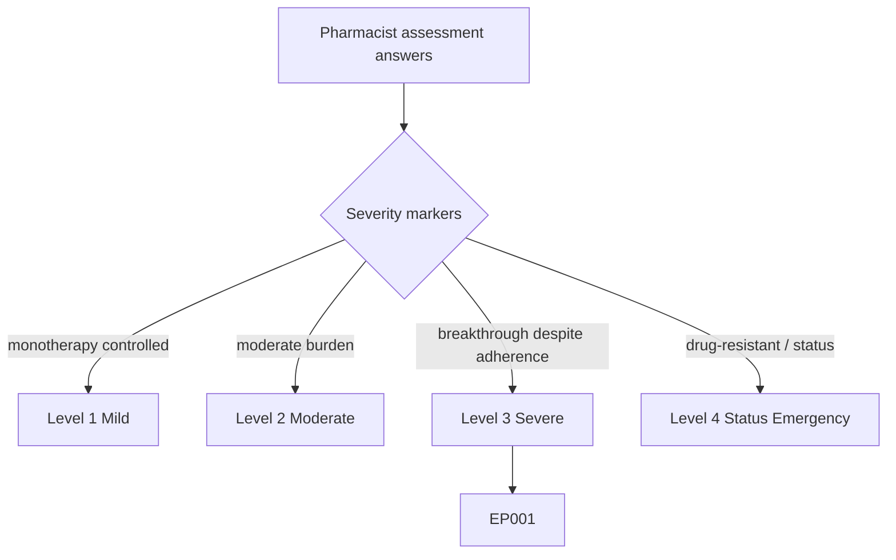
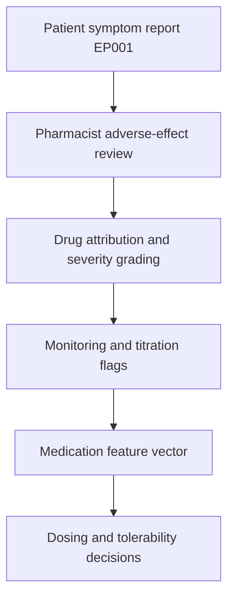
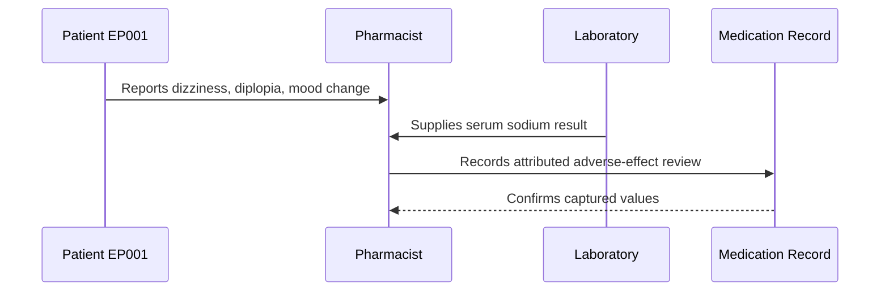
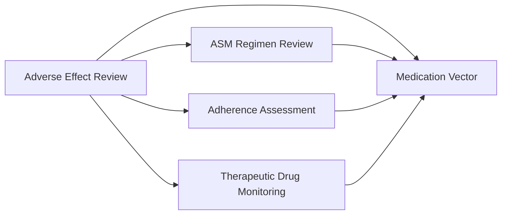
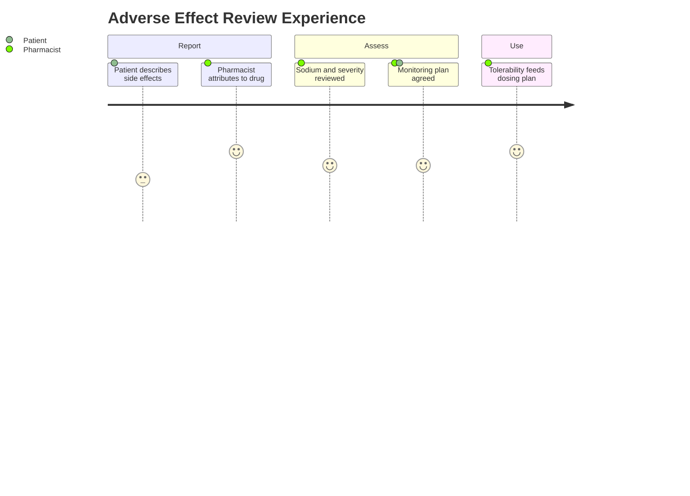

# Pharmacist Assessment — Section 5: Adverse-Effect / Tolerability Review (EP001)

> **Why (this doc):** Tolerability determines whether EP001 can actually reach an effective dose; systematically screening ASM adverse effects distinguishes dose-limiting toxicity from safely titratable side effects and protects against silent harms like hyponatremia. **How:** The clinical pharmacist reviews drug-specific adverse effects for patient EP001 by symptom, severity, and attribution into a fixed variable/value table that feeds the downstream medication vector and analytics pipeline.

**Problem:** Unscreened ASM adverse effects cause covert nonadherence, avoidable morbidity (e.g., carbamazepine hyponatremia), and premature ceilings on effective dosing.

**Research Objective:** Capture a structured adverse-effect and tolerability review for EP001 so drug-attributed symptoms can be linked to dosing, TDM, and adherence decisions.

**Role:** Pharmacist · **Type:** Primary (medication) data

*Caption - Structured adverse-effect and tolerability review for EP001, recorded by the clinical pharmacist. These values separate dose-limiting toxicity from titratable effects and flag monitoring needs such as sodium checks for carbamazepine.*

| Variable | Value |
|---|---|
| Review Tool | ASM-specific adverse-effect checklist |
| CBZ — Dizziness | Mild, intermittent |
| CBZ — Diplopia | Occasional, dose-related |
| CBZ — Hyponatremia | Screen — Na 137 mmol/L (normal) |
| CBZ — Rash History | None |
| LEV — Irritability / Mood | Mild irritability reported |
| LEV — Somnolence | Minimal |
| Overall Tolerability | Acceptable — no dose-limiting toxicity |
| Dose-Limiting Effect | None currently |
| Serious ADR Flag | None |
| Sodium Monitoring | Continue periodic checks (CBZ) |
| Mood Monitoring | Track LEV irritability at follow-up |
| Titration Feasibility | LEV headroom available with monitoring |

## Questionnaire (Enterprise Form)

*Caption - The items the pharmacist records for this section, with response type, validation, EP001's example value, and the derived AI feature.*

| ID | Question | Response Type | Validation | EP001 (Example) | AI Feature |
|---|---|---|---|---|---|
| PHA-0501 | Which tool was used for the adverse-effect review? | Read-only(Auto) | Tool name | ASM-specific adverse-effect checklist | review_tool_id |
| PHA-0502 | What is the severity of carbamazepine-related dizziness? | Dropdown[None/Mild/Moderate/Severe] | Single select | Mild, intermittent | cbz_dizziness_severity |
| PHA-0503 | What is the severity of carbamazepine-related diplopia? | Dropdown[None/Mild/Moderate/Severe] | Single select | Occasional, dose-related | cbz_diplopia_severity |
| PHA-0504 | What is the serum sodium (carbamazepine hyponatremia screen)? | Number | 120–145 mmol/L | Screen — Na 137 mmol/L (normal) | serum_sodium_mmol |
| PHA-0505 | Is there any history of carbamazepine rash? | Yes-No | Yes / No | None | cbz_rash_flag |
| PHA-0506 | What is the severity of levetiracetam-related mood/irritability? | Dropdown[None/Mild/Moderate/Severe] | Single select | Mild irritability reported | lev_mood_severity |
| PHA-0507 | What is the severity of levetiracetam-related somnolence? | Dropdown[None/Minimal/Mild/Moderate/Severe] | Single select | Minimal | lev_somnolence_severity |
| PHA-0508 | What is the overall tolerability rating? | Dropdown[Excellent/Good/Acceptable/Poor] | Single select | Acceptable — no dose-limiting toxicity | overall_tolerability |
| PHA-0509 | Is any dose-limiting effect present? | Text | Free text, or None | None currently | dose_limiting_effect_flag |
| PHA-0510 | Is any serious adverse drug reaction flagged? | Yes-No | Yes / No | None | serious_adr_flag |
| PHA-0511 | What is the sodium-monitoring plan? | Text | Free text | Continue periodic checks (CBZ) | sodium_monitoring_plan |
| PHA-0512 | What is the mood-monitoring plan? | Text | Free text | Track LEV irritability at follow-up | mood_monitoring_plan |
| PHA-0513 | Is upward dose titration feasible given tolerability? | Dropdown[None/Small/Available/IV only] | Single select | LEV headroom available with monitoring | titration_feasibility |

## Severity Scenario Model — Pharmacist View

*Caption - The same assessment answered across four epilepsy severity levels from the pharmacist's point of view; each variable shifts with severity. EP001 corresponds to Level 3 (Severe). Level 4 is the operational emergency — status epilepticus with seizures recurring about every 5 minutes.*

### Level 1 — Mild (Well-Controlled)
| Variable | Value |
|---|---|
| Review Tool | ASM-specific adverse-effect checklist |
| CBZ — Dizziness | Not applicable (no CBZ) |
| CBZ — Diplopia | Not applicable |
| CBZ — Hyponatremia | Not applicable |
| CBZ — Rash History | Not applicable |
| LEV — Irritability / Mood | None |
| LEV — Somnolence | None |
| Overall Tolerability | Excellent |
| Dose-Limiting Effect | None |
| Serious ADR Flag | None |
| Sodium Monitoring | Not required |
| Mood Monitoring | Routine |
| Titration Feasibility | Not needed — controlled |

### Level 2 — Moderate (Intermediate)
| Variable | Value |
|---|---|
| Review Tool | ASM-specific adverse-effect checklist |
| CBZ — Dizziness | Not applicable (no CBZ) |
| CBZ — Diplopia | Not applicable |
| CBZ — Hyponatremia | Not applicable |
| CBZ — Rash History | Not applicable |
| LEV — Irritability / Mood | Occasional mild irritability |
| LEV — Somnolence | Mild |
| Overall Tolerability | Good — minor issues |
| Dose-Limiting Effect | None |
| Serious ADR Flag | None |
| Sodium Monitoring | Routine |
| Mood Monitoring | Light monitoring |
| Titration Feasibility | Small headroom |

### Level 3 — Severe (Poorly Controlled) — EP001
| Variable | Value |
|---|---|
| Review Tool | ASM-specific adverse-effect checklist |
| CBZ — Dizziness | Mild, intermittent |
| CBZ — Diplopia | Occasional, dose-related |
| CBZ — Hyponatremia | Screen — Na 137 mmol/L (normal) |
| CBZ — Rash History | None |
| LEV — Irritability / Mood | Mild irritability reported |
| LEV — Somnolence | Minimal |
| Overall Tolerability | Acceptable — no dose-limiting toxicity |
| Dose-Limiting Effect | None currently |
| Serious ADR Flag | None |
| Sodium Monitoring | Continue periodic checks (CBZ) |
| Mood Monitoring | Track LEV irritability at follow-up |
| Titration Feasibility | LEV headroom available with monitoring |

### Level 4 — Refractory / Status Epilepticus (Operational Emergency)
| Variable | Value |
|---|---|
| Review Tool | Acute ICU ADR + toxicity surveillance |
| CBZ — Dizziness | Masked by obtundation |
| CBZ — Diplopia | Unassessable acutely |
| CBZ — Hyponatremia | Urgent — check Na (seizure risk) |
| CBZ — Rash History | Screen for hypersensitivity |
| LEV — Irritability / Mood | Not assessable |
| LEV — Somnolence | Compounded by IV benzodiazepines |
| Overall Tolerability | Toxicity risk high (IV loading) |
| Dose-Limiting Effect | Respiratory depression (benzodiazepine), infusion effects |
| Serious ADR Flag | Yes — sedation, hypotension, arrhythmia (IV phenytoin) |
| Sodium Monitoring | Urgent / continuous |
| Mood Monitoring | Deferred |
| Titration Feasibility | IV titration under continuous monitoring |

### Severity Classification Logic

**Reason:** To grade EP001's tolerability profile against a pharmacist severity ladder. **Why:** Because adverse-effect burden and toxicity risk escalate with dose and IV emergency agents. **What is happening:** The profile shifts from no effects to high-risk IV toxicity surveillance across levels. **How it is happening:** The pharmacist reads dose-limiting effects, serious-ADR flags, and monitoring urgency as severity markers. **Reference:** Patsalos (2013).

## Data Flow in the Pipeline

**Reason:** To show where adverse-effect data enters the epilepsy pipeline. **Why:** Because tolerability caps the achievable dose and drives monitoring. **What is happening:** Symptoms are attributed to specific ASMs and graded for severity. **How it is happening:** The pharmacist maps symptoms to drug, grades severity, and forwards monitoring flags. **Reference:** Patsalos (2013).

## Role Capturing the Data

**Reason:** To make explicit who attributes and grades adverse effects. **Why:** Because drug attribution requires pharmacologic expertise. **What is happening:** Patient symptoms and lab data are integrated into an attributed review. **How it is happening:** A structured checklist plus sodium result is transcribed and confirmed. **Reference:** Fisher et al. (2017).

## Linkage to Other Assessment Sections

**Reason:** To show how tolerability connects to dosing, adherence, and TDM. **Why:** Because adverse effects both limit titration and drive covert nonadherence. **What is happening:** Adverse-effect flags link laterally to sibling sections and feed the medication vector. **How it is happening:** Shared patient keys join tolerability data with dosing and levels. **Reference:** Topol (2019).

## Patient and Role Experience

**Reason:** To surface the experience of adverse-effect review. **Why:** Because unreported side effects drive silent nonadherence. **What is happening:** Patient-reported symptoms become an attributed, monitored profile. **How it is happening:** A structured checklist plus reassurance elicits honest reporting. **Reference:** APA (2020).

## Professor Readiness (Defense Q&A)

**Q1: Why specifically screen sodium on carbamazepine?** CBZ commonly causes hyponatremia via SIADH-like effect, which can worsen seizures and cause confusion; EP001's sodium of 137 mmol/L is normal, so titration can proceed with periodic monitoring.

**Q2: Do EP001's current adverse effects justify changing the regimen?** No — dizziness, diplopia, and mild LEV irritability are mild and non-dose-limiting, so they warrant monitoring rather than drug withdrawal, preserving titration headroom.

**Q3: How does tolerability review support reaching seizure freedom?** By confirming no dose-limiting toxicity, it establishes that LEV can be titrated upward safely, meaning the path to control is dose optimization rather than drug substitution.

## References

American Psychological Association. (2020). *Publication manual of the American Psychological Association* (7th ed.). https://doi.org/10.1037/0000165-000

Fisher, R. S., Cross, J. H., French, J. A., Higurashi, N., Hirsch, E., Jansen, F. E., Lagae, L., Moshé, S. L., Peltola, J., Roulet Perez, E., Scheffer, I. E., & Zuberi, S. M. (2017). Operational classification of seizure types by the International League Against Epilepsy. *Epilepsia, 58*(4), 522–530. https://doi.org/10.1111/epi.13670

Patsalos, P. N. (2013). *Antiepileptic drug interactions: A clinical guide* (2nd ed.). Springer. https://doi.org/10.1007/978-1-4471-2434-4
