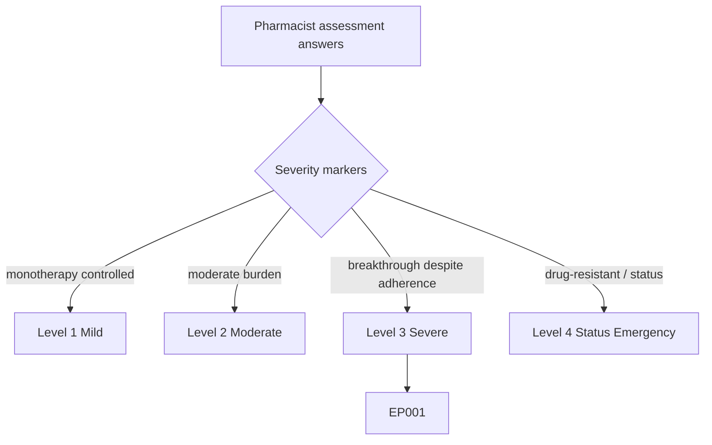
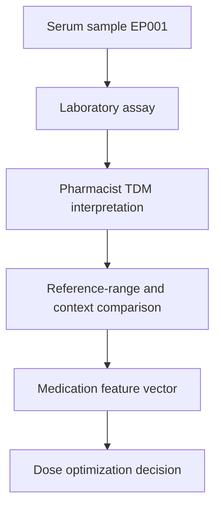
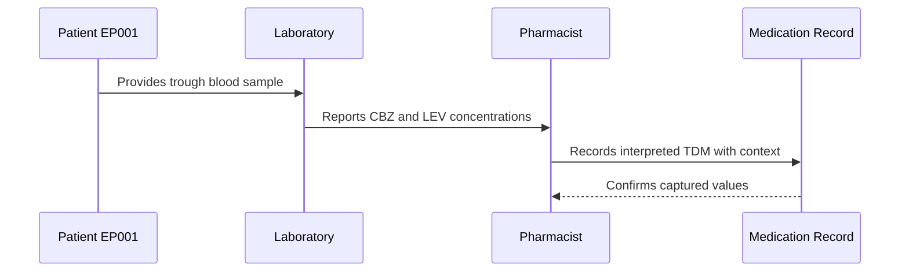
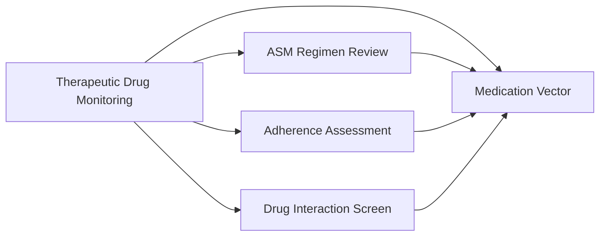
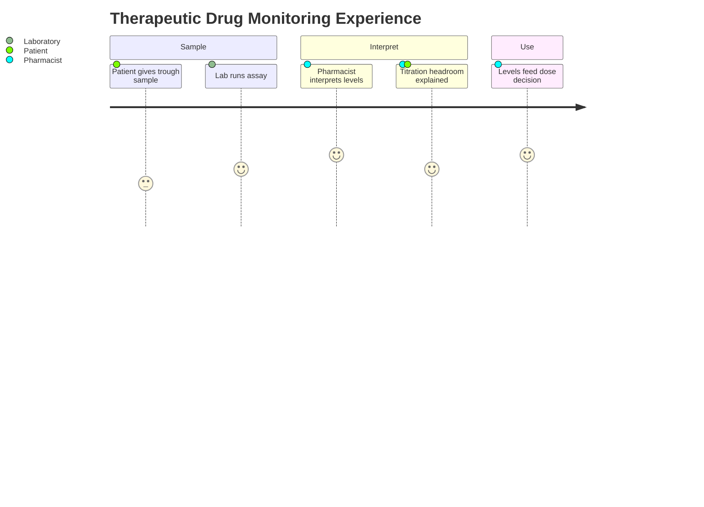

# Pharmacist Assessment — Section 6: Therapeutic Drug Monitoring (EP001)

> **Why (this doc):** Serum-level monitoring converts an abstract dose into the concentration the brain actually sees; for EP001 it reveals whether breakthrough seizures occur at a low-therapeutic carbamazepine level with titration headroom rather than at the ceiling. **How:** The clinical pharmacist interprets ASM serum concentrations for patient EP001 against reference ranges and sampling context into a fixed variable/value table that feeds the downstream medication vector and analytics pipeline.

**Problem:** Dosing without serum-level context misattributes control failure, missing subtherapeutic troughs (e.g., induced carbamazepine) and unnecessary escalation of already-adequate drugs.

**Research Objective:** Capture interpreted therapeutic-drug-monitoring data for EP001 so serum levels can be linked to adherence, interaction, and dosing decisions with correct sampling context.

**Role:** Pharmacist · **Type:** Primary (medication) data

*Caption - Interpreted serum therapeutic-drug-monitoring data for EP001, recorded by the clinical pharmacist against reference ranges and sampling timing. These values show whether the current dose achieves therapeutic concentrations and where titration headroom exists.*

| Variable | Value |
|---|---|
| Sample Type | Trough (pre-dose) |
| CBZ Serum Level | 6.2 mg/L |
| CBZ Reference Range | 4–12 mg/L |
| CBZ Interpretation | Low-therapeutic |
| LEV Serum Level | 18 mg/L (est.) |
| LEV Reference Range | 12–46 mg/L |
| LEV Interpretation | Low-therapeutic |
| Sampling Context | Steady state, morning trough |
| Adherence at Sampling | MPR 0.88 (borderline) |
| Auto-Induction Effect | Likely lowering CBZ level |
| Titration Headroom | Yes — both agents below mid-range |
| Recommendation | Repeat trough after LEV titration |

## Severity Scenario Model — Pharmacist View

*Caption - The same assessment answered across four epilepsy severity levels from the pharmacist's point of view; each variable shifts with severity. EP001 corresponds to Level 3 (Severe). Level 4 is the operational emergency — status epilepticus with seizures recurring about every 5 minutes.*

### Level 1 — Mild (Well-Controlled)
| Variable | Value |
|---|---|
| Sample Type | Trough (routine) |
| CBZ Serum Level | Not applicable (no CBZ) |
| CBZ Reference Range | 4–12 mg/L |
| CBZ Interpretation | Not applicable |
| LEV Serum Level | 25 mg/L |
| LEV Reference Range | 12–46 mg/L |
| LEV Interpretation | Mid-therapeutic |
| Sampling Context | Steady state |
| Adherence at Sampling | MPR 0.98 |
| Auto-Induction Effect | None |
| Titration Headroom | Not needed |
| Recommendation | Annual monitoring |

### Level 2 — Moderate (Intermediate)
| Variable | Value |
|---|---|
| Sample Type | Trough (pre-dose) |
| CBZ Serum Level | Not applicable (no CBZ) |
| CBZ Reference Range | 4–12 mg/L |
| CBZ Interpretation | Not applicable |
| LEV Serum Level | 22 mg/L |
| LEV Reference Range | 12–46 mg/L |
| LEV Interpretation | Mid-therapeutic |
| Sampling Context | Steady state, morning trough |
| Adherence at Sampling | MPR 0.93 |
| Auto-Induction Effect | None |
| Titration Headroom | Small |
| Recommendation | Monitor 6-monthly |

### Level 3 — Severe (Poorly Controlled) — EP001
| Variable | Value |
|---|---|
| Sample Type | Trough (pre-dose) |
| CBZ Serum Level | 6.2 mg/L |
| CBZ Reference Range | 4–12 mg/L |
| CBZ Interpretation | Low-therapeutic |
| LEV Serum Level | 18 mg/L (est.) |
| LEV Reference Range | 12–46 mg/L |
| LEV Interpretation | Low-therapeutic |
| Sampling Context | Steady state, morning trough |
| Adherence at Sampling | MPR 0.88 (borderline) |
| Auto-Induction Effect | Likely lowering CBZ level |
| Titration Headroom | Yes — both agents below mid-range |
| Recommendation | Repeat trough after LEV titration |

### Level 4 — Refractory / Status Epilepticus (Operational Emergency)
| Variable | Value |
|---|---|
| Sample Type | STAT random + serial levels |
| CBZ Serum Level | Sub/variable — urgent assay |
| CBZ Reference Range | 4–12 mg/L |
| CBZ Interpretation | Subtherapeutic — likely precipitant |
| LEV Serum Level | Post IV-load, result pending |
| LEV Reference Range | 12–46 mg/L |
| LEV Interpretation | Loading toward high-therapeutic |
| Sampling Context | Acute, non-steady-state |
| Adherence at Sampling | Uncertain — suspected lapse |
| Auto-Induction Effect | Complicates IV dosing |
| Titration Headroom | IV loading to ceiling |
| Recommendation | Urgent STAT TDM guiding IV loading |

### Severity Classification Logic

**Reason:** To grade EP001's serum-level picture against a pharmacist severity ladder. **Why:** Because TDM urgency and interpretation complexity rise as control fails. **What is happening:** Sampling shifts from routine mid-therapeutic troughs to STAT non-steady-state levels across levels. **How it is happening:** The pharmacist reads level adequacy, sampling context, and monitoring urgency as severity markers. **Reference:** Patsalos (2013).

## Data Flow in the Pipeline

**Reason:** To show where TDM data enters the epilepsy pipeline. **Why:** Because a serum level is meaningless without interpretive context. **What is happening:** Assay results become interpreted, context-adjusted values. **How it is happening:** The pharmacist compares levels to reference ranges and sampling context, then forwards the dosing signal. **Reference:** Patsalos (2013).

## Role Capturing the Data

**Reason:** To make explicit who interprets the serum levels. **Why:** Because raw assay numbers require pharmacokinetic interpretation. **What is happening:** Lab values are contextualized by timing, adherence, and induction. **How it is happening:** Assay output plus sampling metadata is interpreted and recorded. **Reference:** Fisher et al. (2017).

## Linkage to Other Assessment Sections

**Reason:** To show how TDM connects to dosing, adherence, and interactions. **Why:** Because a low level could reflect underdosing, nonadherence, or induction — sections that must be read together. **What is happening:** TDM links laterally to sibling sections and feeds the medication vector. **How it is happening:** Shared patient keys join serum levels with dose and adherence data. **Reference:** Topol (2019).

## Patient and Role Experience

**Reason:** To surface the experience of therapeutic drug monitoring. **Why:** Because correct trough timing depends on patient cooperation. **What is happening:** A blood sample becomes an interpreted, actionable concentration. **How it is happening:** Guided trough sampling plus expert interpretation yields a reliable level. **Reference:** APA (2020).

## Professor Readiness (Defense Q&A)

**Q1: Why does a "normal" CBZ level of 6.2 mg/L still matter?** Although 6.2 mg/L is within the 4–12 mg/L range, it sits in the low-therapeutic zone; for a patient with breakthrough seizures this signals room to optimize rather than a level that excludes underdosing.

**Q2: Why sample a trough rather than a random level?** Trough (pre-dose) levels are reproducible and comparable to reference ranges, whereas random peaks overstate exposure; standardized trough sampling makes the value clinically interpretable.

**Q3: How does auto-induction complicate interpretation for EP001?** CBZ's auto-induction lowers its own steady-state level over time, so a low-therapeutic trough may reflect enzyme induction rather than nonadherence — which is why TDM is read alongside the adherence and interaction sections.

## References

American Psychological Association. (2020). *Publication manual of the American Psychological Association* (7th ed.). https://doi.org/10.1037/0000165-000

Fisher, R. S., Cross, J. H., French, J. A., Higurashi, N., Hirsch, E., Jansen, F. E., Lagae, L., Moshé, S. L., Peltola, J., Roulet Perez, E., Scheffer, I. E., & Zuberi, S. M. (2017). Operational classification of seizure types by the International League Against Epilepsy. *Epilepsia, 58*(4), 522–530. https://doi.org/10.1111/epi.13670

Patsalos, P. N. (2013). *Antiepileptic drug interactions: A clinical guide* (2nd ed.). Springer. https://doi.org/10.1007/978-1-4471-2434-4
