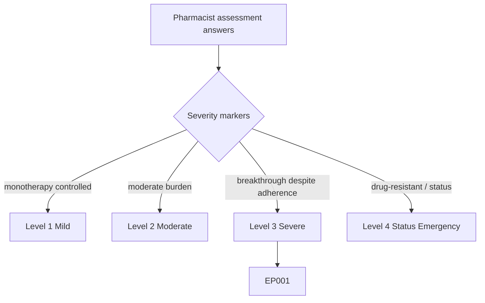
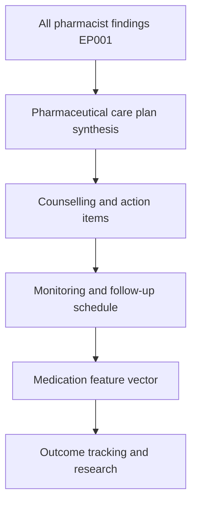
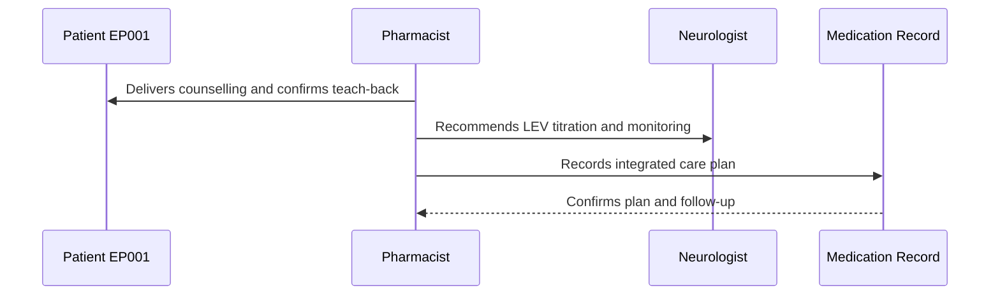
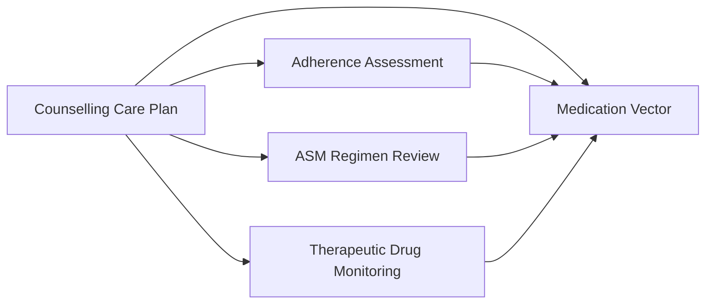
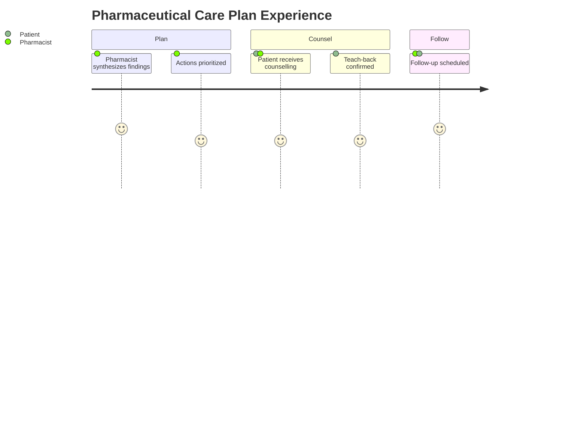

# Pharmacist Assessment — Section 7: Counselling & Pharmaceutical Care Plan (EP001)

> **Why (this doc):** The pharmaceutical care plan converts all prior pharmacist findings into concrete, patient-facing actions; for EP001 it is where adherence coaching, dose-timing fixes, and monitoring commitments are consolidated into a single accountable plan. **How:** The clinical pharmacist synthesizes reconciliation, regimen, adherence, interaction, tolerability, and TDM findings for patient EP001 into a fixed variable/value care-plan table that feeds the downstream medication vector and analytics pipeline.

**Problem:** Without a consolidated care plan, individual pharmacist findings never translate into behavior change, monitoring, or follow-up, and seizure control stalls.

**Research Objective:** Capture an integrated counselling and pharmaceutical care plan for EP001 so every prior finding maps to an owned action linked to outcome and follow-up data.

**Role:** Pharmacist · **Type:** Primary (medication) data

*Caption - Integrated counselling and pharmaceutical care plan for EP001, recorded by the clinical pharmacist. These values consolidate every prior finding into owned, scheduled actions that close the loop from assessment to seizure-control outcome.*

| Variable | Value |
|---|---|
| Care Plan Date | 2026-07-11 |
| Primary Goal | Reduce seizure frequency toward control |
| Counselling — Adherence | Fix evening CBZ timing; reminder app |
| Counselling — Sleep | Address 5.2 hr sleep as trigger |
| Counselling — Interactions | Warn on future OC / CYP3A4 co-meds |
| Counselling — Adverse Effects | Report diplopia, mood, dizziness early |
| Dosing Action | Recommend LEV titration to prescriber |
| Monitoring Plan | Repeat TDM + sodium at 4–6 weeks |
| Adherence Target | MPR greater than 0.95 |
| Patient Understanding | Teach-back confirmed |
| Follow-Up | Pharmacist review in 4 weeks |
| Shared With | Neurologist, patient |

## Severity Scenario Model — Pharmacist View

*Caption - The same assessment answered across four epilepsy severity levels from the pharmacist's point of view; each variable shifts with severity. EP001 corresponds to Level 3 (Severe). Level 4 is the operational emergency — status epilepticus with seizures recurring about every 5 minutes.*

### Level 1 — Mild (Well-Controlled)
| Variable | Value |
|---|---|
| Care Plan Date | 2026-07-11 |
| Primary Goal | Maintain seizure freedom |
| Counselling — Adherence | Reinforce good adherence |
| Counselling — Sleep | General sleep hygiene |
| Counselling — Interactions | Routine — no inducer present |
| Counselling — Adverse Effects | Report any new symptoms |
| Dosing Action | Maintain monotherapy |
| Monitoring Plan | Annual level + labs |
| Adherence Target | Maintain MPR greater than 0.95 |
| Patient Understanding | Teach-back confirmed |
| Follow-Up | Review in 6–12 months |
| Shared With | Neurologist, patient |

### Level 2 — Moderate (Intermediate)
| Variable | Value |
|---|---|
| Care Plan Date | 2026-07-11 |
| Primary Goal | Sustain control, minimize side effects |
| Counselling — Adherence | Reminder strategy |
| Counselling — Sleep | Sleep hygiene guidance |
| Counselling — Interactions | Monitor OTC use |
| Counselling — Adverse Effects | Report mood / somnolence |
| Dosing Action | Consider minor titration |
| Monitoring Plan | Level + labs 6-monthly |
| Adherence Target | MPR greater than 0.95 |
| Patient Understanding | Teach-back confirmed |
| Follow-Up | Review in 3 months |
| Shared With | Neurologist, patient |

### Level 3 — Severe (Poorly Controlled) — EP001
| Variable | Value |
|---|---|
| Care Plan Date | 2026-07-11 |
| Primary Goal | Reduce seizure frequency toward control |
| Counselling — Adherence | Fix evening CBZ timing; reminder app |
| Counselling — Sleep | Address 5.2 hr sleep as trigger |
| Counselling — Interactions | Warn on future OC / CYP3A4 co-meds |
| Counselling — Adverse Effects | Report diplopia, mood, dizziness early |
| Dosing Action | Recommend LEV titration to prescriber |
| Monitoring Plan | Repeat TDM + sodium at 4–6 weeks |
| Adherence Target | MPR greater than 0.95 |
| Patient Understanding | Teach-back confirmed |
| Follow-Up | Pharmacist review in 4 weeks |
| Shared With | Neurologist, patient |

### Level 4 — Refractory / Status Epilepticus (Operational Emergency)
| Variable | Value |
|---|---|
| Care Plan Date | 2026-07-11 (emergency) |
| Primary Goal | Terminate status epilepticus; protect airway |
| Counselling — Adherence | Deferred — post-stabilization root cause |
| Counselling — Sleep | Deferred |
| Counselling — Interactions | Real-time IV interaction management |
| Counselling — Adverse Effects | Monitor IV toxicity (sedation, hypotension) |
| Dosing Action | IV lorazepam then IV loading (LEV/phenytoin/valproate) |
| Monitoring Plan | Continuous ICU + STAT serial TDM |
| Adherence Target | Not applicable — IV administration |
| Patient Understanding | Family updated; patient obtunded |
| Follow-Up | ICU handover; neurology emergency team |
| Shared With | ICU, neurologist, emergency team |

### Severity Classification Logic

**Reason:** To grade EP001's care plan against a pharmacist severity ladder. **Why:** Because the care goal shifts from maintenance to emergency stabilization with severity. **What is happening:** The plan moves from annual reinforcement to ICU-level IV emergency management across levels. **How it is happening:** The pharmacist reads primary goal, dosing action, and follow-up setting as severity markers. **Reference:** Patsalos (2013).

## Data Flow in the Pipeline

**Reason:** To show where the care plan enters and closes the epilepsy pipeline. **Why:** Because findings only improve outcomes once converted to owned actions. **What is happening:** All prior pharmacist findings are synthesized into a scheduled action set. **How it is happening:** The pharmacist consolidates each section's signal into counselling, dosing, and monitoring items and forwards them. **Reference:** Patsalos (2013).

## Role Capturing the Data

**Reason:** To make explicit who owns and communicates the care plan. **Why:** Because accountability and follow-through require a single owning role. **What is happening:** The pharmacist delivers counselling, aligns with the prescriber, and records the plan. **How it is happening:** Teach-back plus prescriber recommendation is transcribed and scheduled. **Reference:** Fisher et al. (2017).

## Linkage to Other Assessment Sections

**Reason:** To show how the care plan integrates all sibling sections. **Why:** Because the plan is only valid if it reflects adherence, regimen, and TDM findings together. **What is happening:** The care plan links back to every pharmacist section and feeds the medication vector. **How it is happening:** Shared patient keys join each finding to its corresponding action. **Reference:** Topol (2019).

## Patient and Role Experience

**Reason:** To surface the experience of care-plan delivery. **Why:** Because patient engagement determines whether the plan is enacted. **What is happening:** Consolidated findings become a shared, understood action plan. **How it is happening:** Counselling plus teach-back confirms understanding before follow-up. **Reference:** APA (2020).

## Professor Readiness (Defense Q&A)

**Q1: Why is teach-back part of the care plan?** Teach-back confirms the patient can restate key actions (dose timing, adverse-effect reporting), which validates understanding and is a stronger predictor of enactment than passive counselling.

**Q2: How does the care plan address EP001's breakthrough seizures without a new drug?** It targets the two most modifiable contributors first — evening-dose timing/adherence and LEV underdosing — plus sleep as a trigger, reserving drug addition for if optimization fails.

**Q3: Why set an MPR target above 0.95?** Because ASM efficacy is adherence-sensitive; moving EP001 from 0.88 toward greater than 0.95 meaningfully stabilizes troughs and is a concrete, measurable goal for the 4-week review.

## References

American Psychological Association. (2020). *Publication manual of the American Psychological Association* (7th ed.). https://doi.org/10.1037/0000165-000

Fisher, R. S., Cross, J. H., French, J. A., Higurashi, N., Hirsch, E., Jansen, F. E., Lagae, L., Moshé, S. L., Peltola, J., Roulet Perez, E., Scheffer, I. E., & Zuberi, S. M. (2017). Operational classification of seizure types by the International League Against Epilepsy. *Epilepsia, 58*(4), 522–530. https://doi.org/10.1111/epi.13670

Patsalos, P. N. (2013). *Antiepileptic drug interactions: A clinical guide* (2nd ed.). Springer. https://doi.org/10.1007/978-1-4471-2434-4
