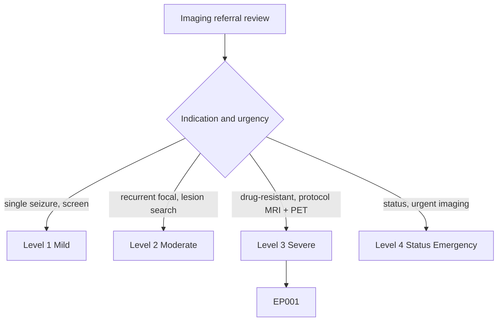
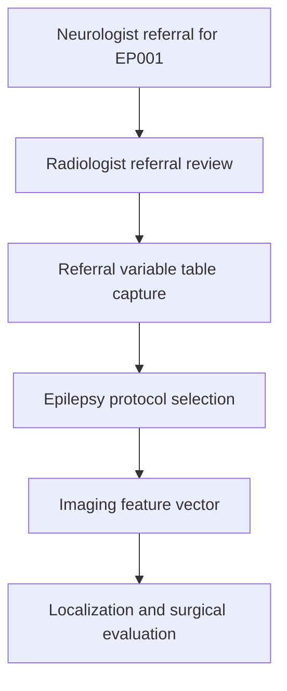
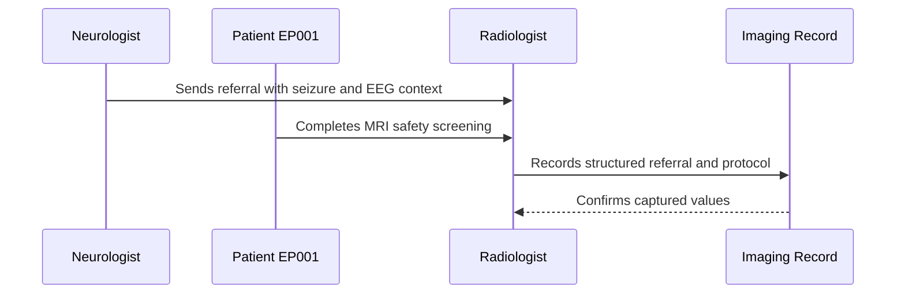
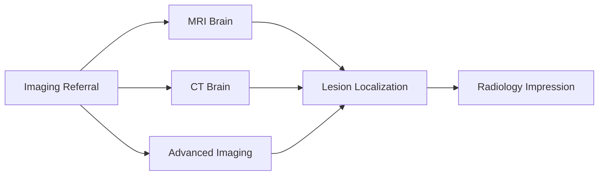
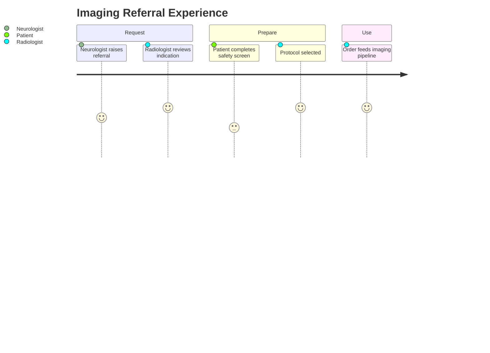

# Radiologist Assessment — Section 1: Imaging Referral & Indication (EP001)

> **Why (this doc):** The imaging referral is the entry point of the neuroimaging pathway; it fixes the clinical question, the epilepsy protocol required, and the urgency that govern how EP001 is scanned and reported. **How:** The radiologist reviews and structures the referral indication for patient EP001 into a fixed variable/value table that triages the study and feeds the downstream imaging pipeline.

**Problem:** Vague or non-epilepsy-specific imaging referrals lead to generic scans that miss subtle epileptogenic lesions such as mesial temporal sclerosis.

**Research Objective:** Capture standardized, ILAE-aligned imaging-referral variables for EP001 so the correct epilepsy protocol is selected and results can be linked to the seizure, EEG, and surgical-evaluation data.

**Role:** Radiologist · **Type:** Secondary (imaging) data

*Caption - Core imaging-referral variables for EP001, curated by the radiologist from the neurologist's request. These values anchor protocol selection, triage urgency, and the clinical question for the rest of the epilepsy imaging workup.*

| Variable | Value |
|---|---|
| Referral Source | Neurologist (Epilepsy Clinic) |
| Clinical Question | Structural cause of focal impaired-awareness seizures |
| Suspected Localization | Left temporal |
| Requested Modality | MRI Brain (3T epilepsy protocol) |
| Indication Category | Focal epilepsy — lesion search |
| Prior Imaging Available | No prior MRI for comparison |
| Contrast Required | No (unless lesion found) |
| Urgency | Routine (elective work-up) |
| Safety Screen (MRI) | Cleared — no implants |
| Renal Function (if contrast) | eGFR normal |
| Referral Completeness | Complete — seizure + EEG context provided |

## Questionnaire (Enterprise Form)

*Caption - The referral-intake questions the radiologist verifies to accept and protocol this study, with response type, validation, EP001's example answer, and the derived AI feature.*

| ID | Question | Response Type | Validation | EP001 (Example) | AI Feature |
|---|---|---|---|---|---|
| RAD-0101 | Who referred the patient for imaging? | Dropdown[Neurologist|Emergency|Neurosurgeon|GP] | one-of[...] | Neurologist (Epilepsy Clinic) | referral_source |
| RAD-0102 | What is the clinical question to answer? | Text | free-text, required | Structural cause of focal impaired-awareness seizures | clinical_question |
| RAD-0103 | What localization is suspected clinically? | Dropdown[Left temporal|Right temporal|Frontal|Other|Unknown] | one-of[...] | Left temporal | suspected_localization |
| RAD-0104 | Which imaging modality is requested? | Dropdown[MRI 3T epilepsy|MRI routine|CT|PET|SPECT] | one-of[...] | MRI Brain (3T epilepsy protocol) | requested_modality |
| RAD-0105 | What is the indication category? | Dropdown[Focal epilepsy lesion search|New-onset seizure|Status|Follow-up] | one-of[...] | Focal epilepsy — lesion search | indication_category |
| RAD-0106 | Is prior imaging available for comparison? | Yes-No | one-of[Yes|No] | No prior MRI for comparison | prior_imaging_available |
| RAD-0107 | Is contrast required? | Dropdown[Yes|No|If lesion found] | one-of[...] | No (unless lesion found) | contrast_required |
| RAD-0108 | What is the urgency of the study? | Dropdown[Routine|Urgent|Emergent] | one-of[...] | Routine (elective work-up) | urgency |
| RAD-0109 | Has MRI safety screening been cleared? | Yes-No | one-of[Yes|No] | Cleared — no implants | mri_safety_cleared |
| RAD-0110 | Is renal function adequate for contrast? | Dropdown[Normal|Impaired|Unknown] | one-of[...] | eGFR normal | renal_function |
| RAD-0111 | Is the referral clinically complete? | Dropdown[Complete|Partial|Missing EEG context] | one-of[...] | Complete — seizure + EEG context provided | referral_completeness |

## Severity Scenario Model — Radiologist View

*Caption - The same referral answered across four epilepsy severity levels from the radiologist's point of view; each variable shifts with severity. EP001 corresponds to Level 3 (Severe). Level 4 is the imaging emergency — status epilepticus requiring urgent scanning.*

### Level 1 — Mild (Well-Controlled)
| Variable | Value |
|---|---|
| Referral Source | GP / Neurologist |
| Clinical Question | Screen for structural cause after single seizure |
| Suspected Localization | Unknown / none |
| Requested Modality | MRI routine or CT |
| Indication Category | New-onset seizure — screen |
| Prior Imaging Available | No |
| Contrast Required | No |
| Urgency | Routine |
| Safety Screen (MRI) | Cleared |
| Renal Function (if contrast) | Normal |
| Referral Completeness | Complete |

### Level 2 — Moderate (Intermediate)
| Variable | Value |
|---|---|
| Referral Source | Neurologist |
| Clinical Question | Cause of recurrent focal seizures |
| Suspected Localization | Temporal (side uncertain) |
| Requested Modality | MRI 3T epilepsy protocol |
| Indication Category | Focal epilepsy — lesion search |
| Prior Imaging Available | No |
| Contrast Required | If lesion found |
| Urgency | Routine — expedited |
| Safety Screen (MRI) | Cleared |
| Renal Function (if contrast) | Normal |
| Referral Completeness | Complete |

### Level 3 — Severe (Poorly Controlled) — EP001
| Variable | Value |
|---|---|
| Referral Source | Neurologist (Epilepsy Clinic) |
| Clinical Question | Structural cause of focal impaired-awareness seizures |
| Suspected Localization | Left temporal |
| Requested Modality | MRI Brain (3T epilepsy protocol) |
| Indication Category | Focal epilepsy — lesion search |
| Prior Imaging Available | No prior MRI for comparison |
| Contrast Required | No (unless lesion found) |
| Urgency | Routine (elective work-up) |
| Safety Screen (MRI) | Cleared — no implants |
| Renal Function (if contrast) | eGFR normal |
| Referral Completeness | Complete — seizure + EEG context provided |

### Level 4 — Refractory / Status Epilepticus (Imaging Emergency)
| Variable | Value |
|---|---|
| Referral Source | Emergency / ICU |
| Clinical Question | Cause of status epilepticus; exclude acute lesion |
| Suspected Localization | Left temporal + query bilateral involvement |
| Requested Modality | Urgent CT then MRI when stable |
| Indication Category | Status epilepticus — urgent imaging |
| Prior Imaging Available | Yes — prior epilepsy-protocol MRI for comparison |
| Contrast Required | Yes |
| Urgency | Emergent |
| Safety Screen (MRI) | Deferred until stabilized |
| Renal Function (if contrast) | Checked urgently |
| Referral Completeness | Complete — acute context |

### Severity Classification Logic

**Reason:** The referral is triaged along a severity ladder rather than a single request type. **Why:** Indication and urgency decide protocol and turnaround for EP001. **What is happening:** The request escalates from a screening CT to an urgent status-imaging pathway. **How it is happening:** The radiologist grades the clinical question and urgency against level thresholds. **Reference:** Bernasconi et al. (2019).

## Data Flow in the Pipeline

**Reason:** To show where referral data enters and travels through the epilepsy imaging pipeline. **Why:** Because protocol selection and reporting depend on the indication being captured before scanning. **What is happening:** A clinical request becomes a structured, protocolled imaging order that seeds the imaging vector. **How it is happening:** The radiologist reviews the referral, records it in the fixed table, and maps it to the correct epilepsy protocol. **Reference:** Bernasconi et al. (2019).

## Role Capturing the Data

**Reason:** To make explicit which role captures each element of the referral. **Why:** Because provenance of the clinical question matters for a valid, protocolled study. **What is happening:** The radiologist integrates neurologist context and patient safety data into one verified order. **How it is happening:** Structured referral review plus safety screening is transcribed into the imaging record and confirmed. **Reference:** Rosenow & Luders (2001).

## Linkage to Other Assessment Sections

**Reason:** To show how the referral connects to the wider imaging vector. **Why:** Because the clinical question must drive every modality selected. **What is happening:** The referral gates the MRI, CT, and advanced-imaging sections that feed localization and impression. **How it is happening:** Shared patient identifiers and the indication code join these sections into one imaging record. **Reference:** Bernasconi et al. (2019).

## Patient and Role Experience

**Reason:** To surface the lived experience of initiating the imaging pathway. **Why:** Because referral quality and safety screening affect scan value and patient safety. **What is happening:** A clinical concern is shaped into a safe, protocolled, usable imaging order. **How it is happening:** A structured referral review plus MRI safety screening reduces wasted, non-diagnostic scans. **Reference:** APA (2020).

## Professor Readiness (Defense Q&A)

**Q1: Why does the referral indication matter so much in epilepsy imaging?** Because a generic scan can miss subtle epileptogenic lesions; the indication tells the radiologist to apply a dedicated 3T epilepsy protocol angled to the suspected localization.

**Q2: Why record the suspected localization on the referral?** Left-temporal suspicion prompts thin-section oblique-coronal sequences through the hippocampi, maximizing detection of mesial temporal sclerosis for EP001.

**Q3: Why capture prior-imaging availability?** Comparison with prior scans distinguishes stable from progressive lesions; its absence for EP001 establishes a new structural baseline.

## References

American Psychological Association. (2020). *Publication manual of the American Psychological Association* (7th ed.). https://doi.org/10.1037/0000165-000

Bernasconi, A., Cendes, F., Theodore, W. H., Gill, R. S., Koepp, M. J., Hogan, R. E., Jackson, G. D., Federico, P., Labate, A., Vaudano, A. E., Blümcke, I., Ryvlin, P., & Bernasconi, N. (2019). Recommendations for the use of structural magnetic resonance imaging in the care of patients with epilepsy: A consensus report from the International League Against Epilepsy Neuroimaging Task Force. *Epilepsia, 60*(6), 1054–1068. https://doi.org/10.1111/epi.15612

Fisher, R. S., Cross, J. H., French, J. A., Higurashi, N., Hirsch, E., Jansen, F. E., Lagae, L., Moshé, S. L., Peltola, J., Roulet Perez, E., Scheffer, I. E., & Zuberi, S. M. (2017). Operational classification of seizure types by the International League Against Epilepsy. *Epilepsia, 58*(4), 522–530. https://doi.org/10.1111/epi.13670

Rosenow, F., & Luders, H. (2001). Presurgical evaluation of epilepsy. *Brain, 124*(9), 1683–1700. https://doi.org/10.1093/brain/124.9.1683
