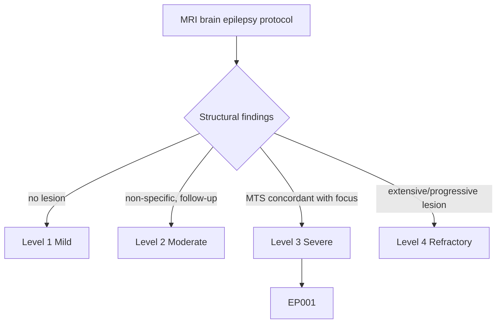
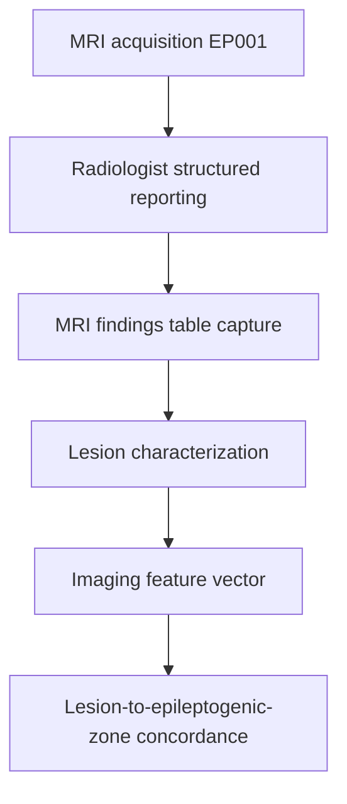
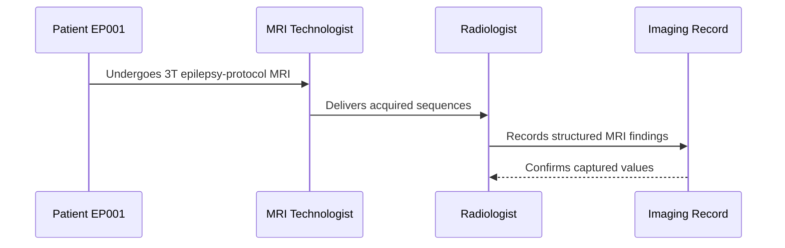
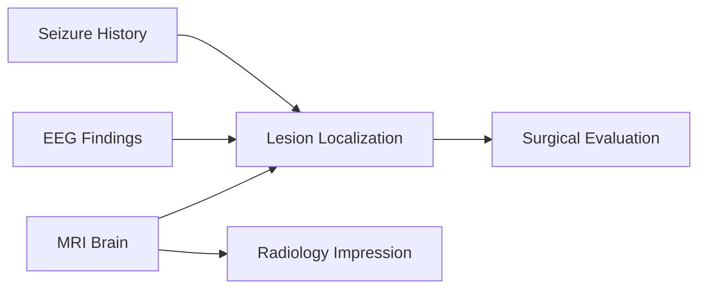
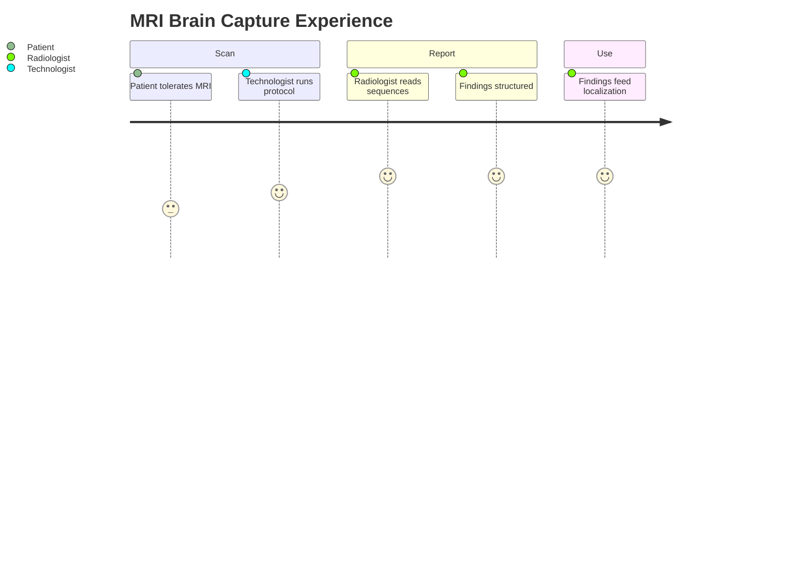

# Radiologist Assessment — Section 2: MRI Brain Protocol & Findings (EP001)

> **Why (this doc):** The MRI brain is the single highest-yield investigation for a structural cause of focal epilepsy; the epilepsy protocol and its findings decide whether EP001 has a resectable lesion. **How:** The radiologist records the MRI protocol and structured findings for patient EP001 into a fixed variable/value table that feeds localization and surgical evaluation.

**Problem:** Non-epilepsy-protocol or low-field MRI frequently misses subtle mesial temporal sclerosis, mislabeling patients as MRI-negative.

**Research Objective:** Capture standardized, ILAE-aligned MRI-protocol and findings variables for EP001 so subtle hippocampal pathology is detected and linked to EEG and surgical-evaluation data.

**Role:** Radiologist · **Type:** Secondary (imaging) data

*Caption - Core MRI brain variables for EP001, recorded by the radiologist from a dedicated 3T epilepsy protocol. These values anchor lesion detection, lateralization, and the mesial temporal sclerosis query for the rest of the imaging workup.*

| Variable | Value |
|---|---|
| Field Strength | 3T |
| Protocol | Dedicated epilepsy protocol |
| Key Sequences | 3D T1, oblique-coronal T2/FLAIR, DWI |
| Hippocampal Assessment | Left hippocampal T2/FLAIR hyperintensity |
| Volume Loss | Left hippocampal volume loss |
| Lateralization | Left |
| Lobe Involved | Temporal (mesial) |
| Primary Finding | Subtle left mesial temporal signal + atrophy |
| Provisional Diagnosis | Query mesial temporal sclerosis (MTS) |
| Contrast Given | No |
| Comparison to Prior | None available (baseline) |
| Scan Quality | Diagnostic — no motion artifact |

## Questionnaire (Enterprise Form)

*Caption - The structured reporting fields the radiologist completes for the MRI brain, with response type, validation, EP001's example finding, and the derived AI feature.*

| ID | Question | Response Type | Validation | EP001 (Example) | AI Feature |
|---|---|---|---|---|---|
| RAD-0201 | What field strength was used? | Dropdown[1.5T|3T|7T] | one-of[...] | 3T | mri_field_strength |
| RAD-0202 | Which protocol was applied? | Dropdown[Routine|Dedicated epilepsy protocol] | one-of[...] | Dedicated epilepsy protocol | mri_protocol |
| RAD-0203 | Which key sequences were acquired? | Multi-select[3D T1|Coronal T2/FLAIR|DWI|SWI] | subset-of[...] | 3D T1, oblique-coronal T2/FLAIR, DWI | mri_sequences |
| RAD-0204 | What is the hippocampal signal finding? | Dropdown[Normal|Left T2/FLAIR hyperintensity|Right T2/FLAIR hyperintensity|Bilateral] | one-of[...] | Left hippocampal T2/FLAIR hyperintensity | hippocampal_signal |
| RAD-0205 | Is there hippocampal volume loss? | Dropdown[None|Left|Right|Bilateral] | one-of[...] | Left hippocampal volume loss | hippocampal_volume_loss |
| RAD-0206 | What is the lateralization of the finding? | Dropdown[Left|Right|Bilateral|None] | one-of[...] | Left | mri_lateralization |
| RAD-0207 | Which lobe is involved? | Dropdown[Temporal|Frontal|Parietal|Occipital|None] | one-of[...] | Temporal (mesial) | mri_lobe |
| RAD-0208 | What is the primary MRI finding? | Text | free-text, required | Subtle left mesial temporal signal + atrophy | mri_primary_finding |
| RAD-0209 | What is the provisional imaging diagnosis? | Dropdown[Normal|Query MTS|Tumor|FCD|Vascular] | one-of[...] | Query mesial temporal sclerosis (MTS) | mri_provisional_dx |
| RAD-0210 | Was contrast administered? | Yes-No | one-of[Yes|No] | No | mri_contrast |
| RAD-0211 | Was comparison with prior imaging possible? | Dropdown[Yes|No baseline] | one-of[...] | None available (baseline) | mri_prior_comparison |
| RAD-0212 | What was the scan quality? | Dropdown[Diagnostic|Limited by motion|Non-diagnostic] | one-of[...] | Diagnostic — no motion artifact | mri_scan_quality |

## Severity Scenario Model — Radiologist View

*Caption - The same MRI answered across four epilepsy severity levels from the radiologist's point of view; each variable shifts with severity. EP001 corresponds to Level 3 (Severe). Level 4 is extensive or progressive structural disease.*

### Level 1 — Mild (Well-Controlled)
| Variable | Value |
|---|---|
| Field Strength | 1.5T or 3T |
| Protocol | Routine brain |
| Key Sequences | T1, T2/FLAIR |
| Hippocampal Assessment | Normal |
| Volume Loss | None |
| Lateralization | None |
| Lobe Involved | None |
| Primary Finding | No structural lesion |
| Provisional Diagnosis | Normal MRI |
| Contrast Given | No |
| Comparison to Prior | Not required |
| Scan Quality | Diagnostic |

### Level 2 — Moderate (Intermediate)
| Variable | Value |
|---|---|
| Field Strength | 3T |
| Protocol | Epilepsy protocol |
| Key Sequences | 3D T1, coronal T2/FLAIR, DWI |
| Hippocampal Assessment | Borderline / non-specific signal |
| Volume Loss | Equivocal |
| Lateralization | Uncertain |
| Lobe Involved | Temporal (query) |
| Primary Finding | Non-specific finding, follow-up advised |
| Provisional Diagnosis | Indeterminate — repeat imaging |
| Contrast Given | No |
| Comparison to Prior | None |
| Scan Quality | Diagnostic |

### Level 3 — Severe (Poorly Controlled) — EP001
| Variable | Value |
|---|---|
| Field Strength | 3T |
| Protocol | Dedicated epilepsy protocol |
| Key Sequences | 3D T1, oblique-coronal T2/FLAIR, DWI |
| Hippocampal Assessment | Left hippocampal T2/FLAIR hyperintensity |
| Volume Loss | Left hippocampal volume loss |
| Lateralization | Left |
| Lobe Involved | Temporal (mesial) |
| Primary Finding | Subtle left mesial temporal signal + atrophy |
| Provisional Diagnosis | Query mesial temporal sclerosis (MTS) |
| Contrast Given | No |
| Comparison to Prior | None available (baseline) |
| Scan Quality | Diagnostic — no motion artifact |

### Level 4 — Refractory / Status (Extensive or Progressive Lesion)
| Variable | Value |
|---|---|
| Field Strength | 3T |
| Protocol | Epilepsy protocol + contrast |
| Key Sequences | 3D T1, coronal T2/FLAIR, DWI, post-contrast |
| Hippocampal Assessment | Bilateral or extensive signal change |
| Volume Loss | Bilateral / progressive atrophy |
| Lateralization | Bilateral or widespread |
| Lobe Involved | Temporal + extratemporal spread |
| Primary Finding | Extensive/progressive lesion or diffusion restriction |
| Provisional Diagnosis | Progressive structural disease — urgent review |
| Contrast Given | Yes |
| Comparison to Prior | Interval progression vs prior MRI |
| Scan Quality | Diagnostic (may be motion-limited if unwell) |

### Severity Classification Logic

**Reason:** MRI findings are graded along a severity ladder rather than a binary normal/abnormal. **Why:** Lesion extent and concordance decide surgical candidacy and urgency for EP001. **What is happening:** Findings escalate from a normal scan to progressive structural disease. **How it is happening:** The radiologist grades signal, volume, and extent against level thresholds. **Reference:** Bernasconi et al. (2019).

## Data Flow in the Pipeline

**Reason:** To show where MRI findings enter and travel through the epilepsy imaging pipeline. **Why:** Because localization and surgical planning depend on structured MRI capture. **What is happening:** Raw images become structured, characterized findings that populate the imaging vector. **How it is happening:** The radiologist reads the epilepsy protocol, records the findings table, and passes the characterized lesion forward. **Reference:** Bernasconi et al. (2019).

## Role Capturing the Data

**Reason:** To make explicit which role captures each element of the MRI report. **Why:** Because provenance from acquisition to interpretation matters for a valid finding. **What is happening:** The radiologist converts technologist-acquired images into a verified structured report. **How it is happening:** Protocolled acquisition plus expert reading is transcribed into the imaging record and confirmed. **Reference:** Rosenow & Luders (2001).

## Linkage to Other Assessment Sections

**Reason:** To show how MRI connects to the wider clinical and imaging vector. **Why:** Because MRI lesions must correlate with EEG and semiology for a valid diagnosis. **What is happening:** MRI feeds localization and impression and is cross-checked against EEG and seizure history. **How it is happening:** Shared patient identifiers and lateralization codes join these sections. **Reference:** Bernasconi et al. (2019).

## Patient and Role Experience

**Reason:** To surface the lived experience of the MRI workup. **Why:** Because scan tolerance and protocol fidelity affect data quality. **What is happening:** Patient effort and expert reading are shaped into a confirmed structural finding. **How it is happening:** A dedicated epilepsy protocol plus careful hippocampal review reduces missed MTS. **Reference:** APA (2020).

## Professor Readiness (Defense Q&A)

**Q1: Why is a dedicated epilepsy MRI protocol required?** Thin-section oblique-coronal T2/FLAIR angled to the hippocampi detects the subtle signal change and volume loss of mesial temporal sclerosis that routine axial imaging misses in EP001.

**Q2: What imaging features define mesial temporal sclerosis?** Increased hippocampal T2/FLAIR signal with hippocampal volume loss and disturbed internal architecture — the constellation seen on the left in EP001.

**Q3: Why does a subtle-but-concordant MRI finding matter?** A subtle left hippocampal lesion concordant with the left-temporal EEG focus supports a well-lateralized, potentially surgically remediable epilepsy for EP001.

## References

American Psychological Association. (2020). *Publication manual of the American Psychological Association* (7th ed.). https://doi.org/10.1037/0000165-000

Bernasconi, A., Cendes, F., Theodore, W. H., Gill, R. S., Koepp, M. J., Hogan, R. E., Jackson, G. D., Federico, P., Labate, A., Vaudano, A. E., Blümcke, I., Ryvlin, P., & Bernasconi, N. (2019). Recommendations for the use of structural magnetic resonance imaging in the care of patients with epilepsy: A consensus report from the International League Against Epilepsy Neuroimaging Task Force. *Epilepsia, 60*(6), 1054–1068. https://doi.org/10.1111/epi.15612

Fisher, R. S., Cross, J. H., French, J. A., Higurashi, N., Hirsch, E., Jansen, F. E., Lagae, L., Moshé, S. L., Peltola, J., Roulet Perez, E., Scheffer, I. E., & Zuberi, S. M. (2017). Operational classification of seizure types by the International League Against Epilepsy. *Epilepsia, 58*(4), 522–530. https://doi.org/10.1111/epi.13670

Rosenow, F., & Luders, H. (2001). Presurgical evaluation of epilepsy. *Brain, 124*(9), 1683–1700. https://doi.org/10.1093/brain/124.9.1683
