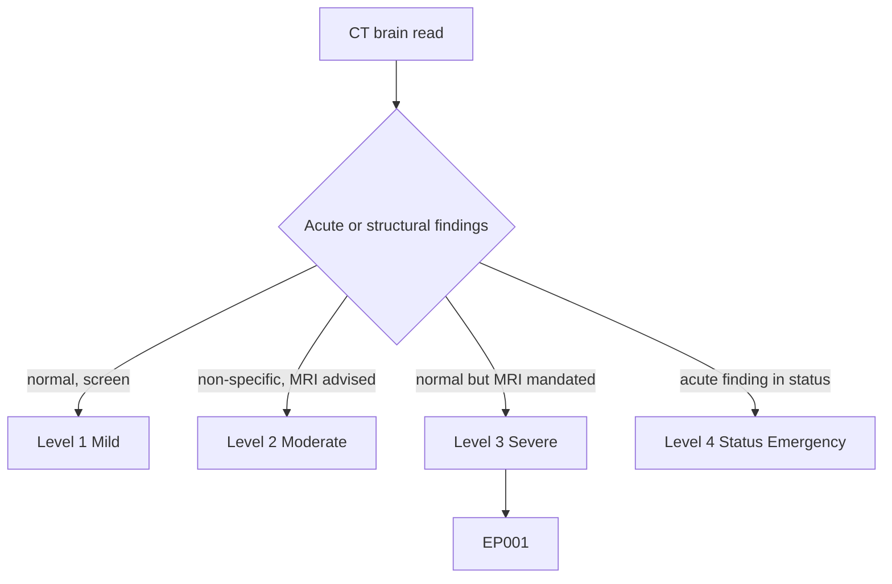
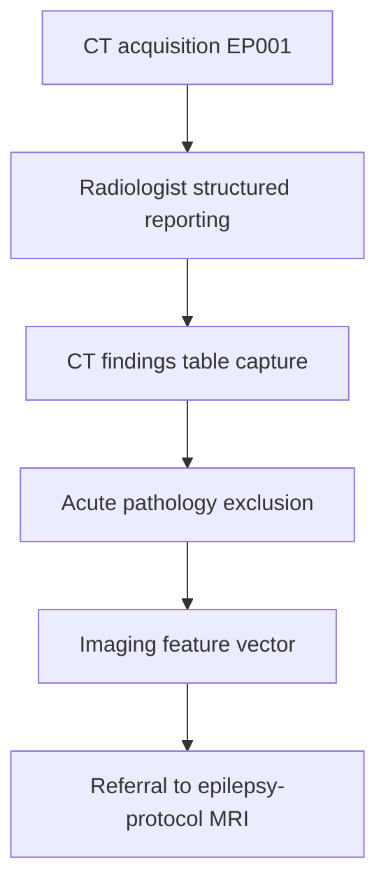
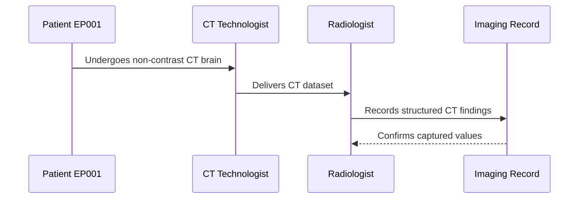
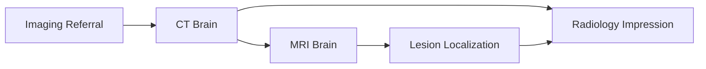
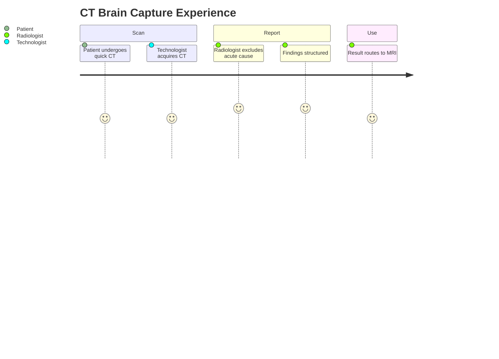

# Radiologist Assessment — Section 3: CT Brain Findings (EP001)

> **Why (this doc):** CT brain is the fast, widely available first-line study that excludes acute pathology (hemorrhage, gross lesion, calcification) even though MRI is the definitive epilepsy tool; its result frames the urgency of the workup for EP001. **How:** The radiologist records the CT brain findings for patient EP001 into a fixed variable/value table that complements MRI in the imaging pipeline.

**Problem:** Over-reliance on a normal CT can falsely reassure clinicians and delay the epilepsy-protocol MRI needed to find subtle lesions.

**Research Objective:** Capture standardized CT-brain variables for EP001 so acute pathology is excluded and the result is correctly positioned relative to the definitive MRI in the imaging vector.

**Role:** Radiologist · **Type:** Secondary (imaging) data

*Caption - Core CT brain variables for EP001, recorded by the radiologist. A normal CT here excludes acute causes and directs attention to the epilepsy-protocol MRI for lesion detection.*

| Variable | Value |
|---|---|
| Indication | Exclude acute pathology in focal epilepsy |
| Contrast | Non-contrast |
| Acute Hemorrhage | None |
| Mass / Space-occupying Lesion | None |
| Calcification | None |
| Hydrocephalus | None |
| Cortical / Skull Abnormality | None |
| Hippocampal Detail | Not resolved on CT (expected) |
| Overall Impression | Normal CT brain |
| Sensitivity for MTS | Low — MRI required |
| Urgency Outcome | No acute finding; proceed to MRI |
| Comparison to Prior | None available |

## Questionnaire (Enterprise Form)

*Caption - The structured reporting fields the radiologist completes for the CT brain, with response type, validation, EP001's example finding, and the derived AI feature.*

| ID | Question | Response Type | Validation | EP001 (Example) | AI Feature |
|---|---|---|---|---|---|
| RAD-0301 | What is the indication for CT? | Dropdown[Exclude acute pathology|Trauma|Status|MRI contraindicated] | one-of[...] | Exclude acute pathology in focal epilepsy | ct_indication |
| RAD-0302 | Was contrast used? | Dropdown[Non-contrast|Contrast] | one-of[...] | Non-contrast | ct_contrast |
| RAD-0303 | Is there acute hemorrhage? | Yes-No | one-of[Yes|No] | None | ct_hemorrhage |
| RAD-0304 | Is there a mass or space-occupying lesion? | Yes-No | one-of[Yes|No] | None | ct_mass |
| RAD-0305 | Is there intracranial calcification? | Yes-No | one-of[Yes|No] | None | ct_calcification |
| RAD-0306 | Is there hydrocephalus? | Yes-No | one-of[Yes|No] | None | ct_hydrocephalus |
| RAD-0307 | Is there a cortical or skull abnormality? | Yes-No | one-of[Yes|No] | None | ct_cortical_abnormality |
| RAD-0308 | Was hippocampal detail resolved? | Dropdown[Resolved|Not resolved on CT] | one-of[...] | Not resolved on CT (expected) | ct_hippocampal_detail |
| RAD-0309 | What is the overall CT impression? | Dropdown[Normal|Acute finding|Chronic finding] | one-of[...] | Normal CT brain | ct_impression |
| RAD-0310 | What is CT sensitivity for MTS here? | Dropdown[Low|Moderate|High] | one-of[...] | Low — MRI required | ct_mts_sensitivity |
| RAD-0311 | What is the urgency outcome? | Dropdown[No acute finding proceed to MRI|Urgent intervention] | one-of[...] | No acute finding; proceed to MRI | ct_urgency_outcome |
| RAD-0312 | Was comparison with prior CT possible? | Dropdown[Yes|No prior] | one-of[...] | None available | ct_prior_comparison |

## Severity Scenario Model — Radiologist View

*Caption - The same CT answered across four epilepsy severity levels from the radiologist's point of view; each variable shifts with severity. EP001 corresponds to Level 3 (Severe) — a normal CT that mandates the epilepsy MRI. Level 4 is the acute status setting where CT may reveal or exclude an emergent cause.*

### Level 1 — Mild (Well-Controlled)
| Variable | Value |
|---|---|
| Indication | Screen after single seizure |
| Contrast | Non-contrast |
| Acute Hemorrhage | None |
| Mass / Space-occupying Lesion | None |
| Calcification | None |
| Hydrocephalus | None |
| Cortical / Skull Abnormality | None |
| Hippocampal Detail | Not assessed |
| Overall Impression | Normal CT brain |
| Sensitivity for MTS | Low |
| Urgency Outcome | No acute finding; routine follow-up |
| Comparison to Prior | Not required |

### Level 2 — Moderate (Intermediate)
| Variable | Value |
|---|---|
| Indication | Recurrent seizures — first-line |
| Contrast | Non-contrast |
| Acute Hemorrhage | None |
| Mass / Space-occupying Lesion | None |
| Calcification | Small incidental focus (query) |
| Hydrocephalus | None |
| Cortical / Skull Abnormality | None |
| Hippocampal Detail | Not resolved |
| Overall Impression | Non-specific; MRI advised |
| Sensitivity for MTS | Low |
| Urgency Outcome | No acute finding; expedite MRI |
| Comparison to Prior | None |

### Level 3 — Severe (Poorly Controlled) — EP001
| Variable | Value |
|---|---|
| Indication | Exclude acute pathology in focal epilepsy |
| Contrast | Non-contrast |
| Acute Hemorrhage | None |
| Mass / Space-occupying Lesion | None |
| Calcification | None |
| Hydrocephalus | None |
| Cortical / Skull Abnormality | None |
| Hippocampal Detail | Not resolved on CT (expected) |
| Overall Impression | Normal CT brain |
| Sensitivity for MTS | Low — MRI required |
| Urgency Outcome | No acute finding; proceed to MRI |
| Comparison to Prior | None available |

### Level 4 — Refractory / Status Epilepticus (Acute Setting)
| Variable | Value |
|---|---|
| Indication | Status epilepticus — exclude acute lesion |
| Contrast | Non-contrast + CT angiography if indicated |
| Acute Hemorrhage | Excluded / or acute finding identified |
| Mass / Space-occupying Lesion | Excluded / or lesion identified |
| Calcification | Assessed |
| Hydrocephalus | Excluded |
| Cortical / Skull Abnormality | Assessed (post-ictal edema query) |
| Hippocampal Detail | Not resolved on CT |
| Overall Impression | Emergent read; guides acute care |
| Sensitivity for MTS | Low — MRI when stable |
| Urgency Outcome | Immediate; directs ICU pathway |
| Comparison to Prior | Compared to prior imaging |

### Severity Classification Logic

**Reason:** CT is graded by what it excludes and the pathway it triggers, not by abnormality alone. **Why:** A normal CT in EP001 still mandates the definitive epilepsy MRI. **What is happening:** The role of CT escalates from screening to emergent triage. **How it is happening:** The radiologist grades findings and urgency against level thresholds. **Reference:** Bernasconi et al. (2019).

## Data Flow in the Pipeline

**Reason:** To show where CT findings enter and travel through the imaging pipeline. **Why:** Because excluding acute pathology gates the elective MRI workup. **What is happening:** Raw CT becomes a structured exclusion result that positions the MRI. **How it is happening:** The radiologist reads the CT, records the findings table, and routes EP001 to MRI. **Reference:** Bernasconi et al. (2019).

## Role Capturing the Data

**Reason:** To make explicit which role captures each element of the CT report. **Why:** Because provenance from acquisition to interpretation matters for a valid exclusion. **What is happening:** The radiologist converts technologist-acquired CT into a verified structured report. **How it is happening:** Acquisition plus expert reading is transcribed into the imaging record and confirmed. **Reference:** Rosenow & Luders (2001).

## Linkage to Other Assessment Sections

**Reason:** To show how CT connects to the wider imaging vector. **Why:** Because CT exclusion sequences into the definitive MRI and impression. **What is happening:** CT gates the MRI and contributes a normal-baseline finding to the impression. **How it is happening:** Shared patient identifiers join CT to the MRI and impression sections. **Reference:** Bernasconi et al. (2019).

## Patient and Role Experience

**Reason:** To surface the lived experience of the CT step. **Why:** Because a fast, tolerable scan shapes early reassurance and next steps. **What is happening:** Patient effort and a rapid read are shaped into an exclusion result. **How it is happening:** Non-contrast CT plus prompt reporting excludes acute causes and directs the MRI. **Reference:** APA (2020).

## Professor Readiness (Defense Q&A)

**Q1: Why do a CT if MRI is the definitive epilepsy test?** CT is fast and available and reliably excludes hemorrhage, gross masses, and calcification; a normal CT in EP001 makes an acute cause unlikely and supports proceeding to the elective MRI.

**Q2: Why is a normal CT not reassuring for MTS?** CT lacks the soft-tissue contrast and thin-section hippocampal resolution needed to detect mesial temporal sclerosis, so a normal CT cannot exclude it in EP001.

**Q3: When does CT become the primary emergency study?** In status epilepticus, CT is the immediate study to exclude an acute lesion or hemorrhage before the patient is stable enough for MRI.

## References

American Psychological Association. (2020). *Publication manual of the American Psychological Association* (7th ed.). https://doi.org/10.1037/0000165-000

Bernasconi, A., Cendes, F., Theodore, W. H., Gill, R. S., Koepp, M. J., Hogan, R. E., Jackson, G. D., Federico, P., Labate, A., Vaudano, A. E., Blümcke, I., Ryvlin, P., & Bernasconi, N. (2019). Recommendations for the use of structural magnetic resonance imaging in the care of patients with epilepsy: A consensus report from the International League Against Epilepsy Neuroimaging Task Force. *Epilepsia, 60*(6), 1054–1068. https://doi.org/10.1111/epi.15612

Fisher, R. S., Cross, J. H., French, J. A., Higurashi, N., Hirsch, E., Jansen, F. E., Lagae, L., Moshé, S. L., Peltola, J., Roulet Perez, E., Scheffer, I. E., & Zuberi, S. M. (2017). Operational classification of seizure types by the International League Against Epilepsy. *Epilepsia, 58*(4), 522–530. https://doi.org/10.1111/epi.13670

Rosenow, F., & Luders, H. (2001). Presurgical evaluation of epilepsy. *Brain, 124*(9), 1683–1700. https://doi.org/10.1093/brain/124.9.1683
