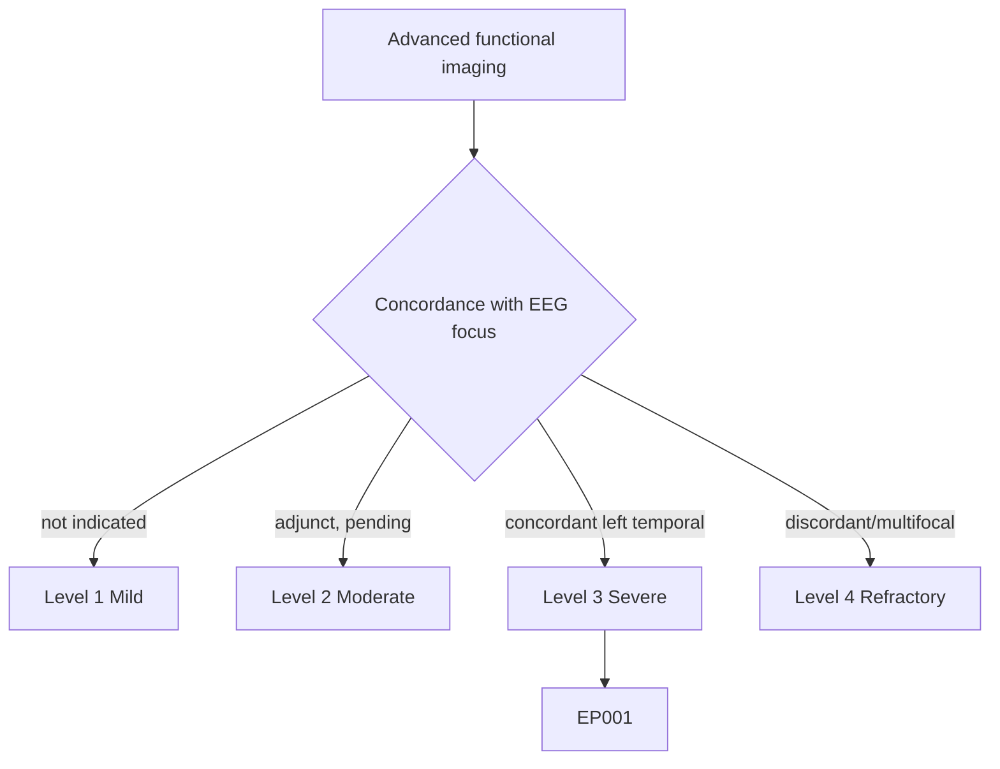
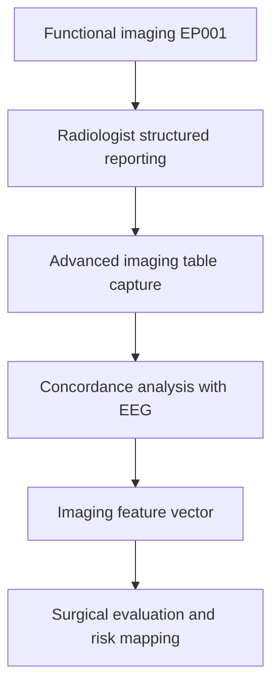
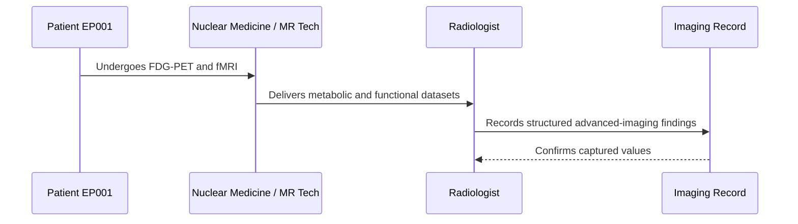
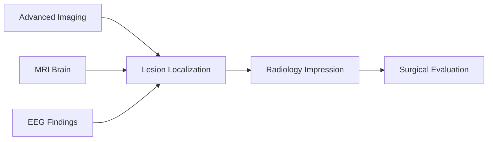
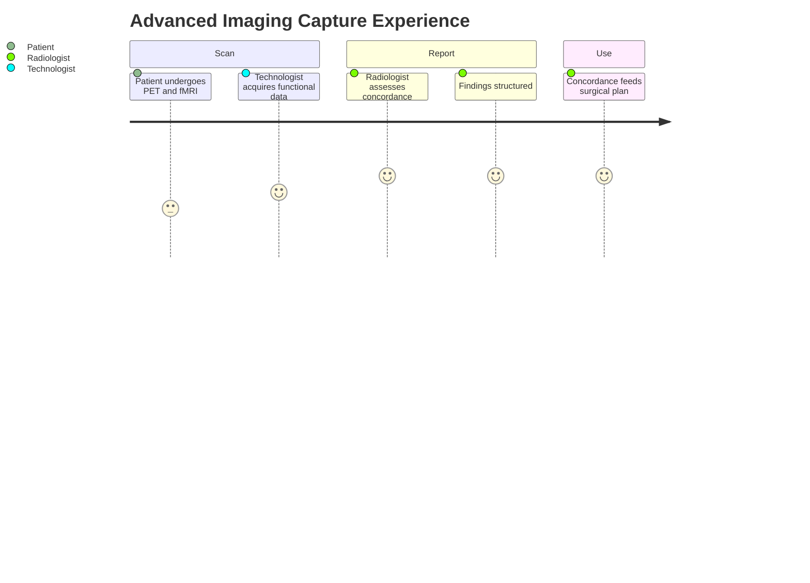

# Radiologist Assessment — Section 4: Advanced Imaging (PET / SPECT / fMRI / MEG) (EP001)

> **Why (this doc):** When MRI is subtle or the case is heading to surgery, functional and metabolic imaging (PET, SPECT, fMRI, MEG) confirms and lateralizes the epileptogenic zone; for EP001 PET provides the decisive concordant marker. **How:** The radiologist records the advanced-imaging findings for patient EP001 into a fixed variable/value table that strengthens localization and surgical planning.

**Problem:** Structural MRI alone can be subtle or discordant; without functional imaging the epileptogenic zone may be under-localized and surgery deferred.

**Research Objective:** Capture standardized advanced-imaging variables for EP001 so metabolic and functional data reinforce the left-temporal localization and link to the surgical-evaluation vector.

**Role:** Radiologist · **Type:** Secondary (imaging) data

*Caption - Core advanced-imaging variables for EP001, recorded by the radiologist. FDG-PET hypometabolism concordant with the EEG focus is the decisive functional confirmation for the mesial temporal sclerosis query.*

| Variable | Value |
|---|---|
| FDG-PET (interictal) | Left temporal hypometabolism |
| PET Concordance with EEG | Concordant (left temporal) |
| Ictal SPECT | Not performed (reserved) |
| fMRI Language Lateralization | Left-dominant language |
| fMRI Memory Mapping | Left mesial temporal activation |
| MEG Source | Not performed (reserved) |
| Functional Deficit Risk | Verbal memory at risk (left) |
| Primary Functional Finding | Left temporal hypometabolism |
| Contribution to Localization | Confirms left temporal focus |
| Modality Driving Decision | FDG-PET |
| Concordance Grade | High (imaging + EEG agree) |
| Surgical Relevance | Supports left temporal candidacy |

## Questionnaire (Enterprise Form)

*Caption - The structured reporting fields the radiologist completes for advanced imaging, with response type, validation, EP001's example finding, and the derived AI feature.*

| ID | Question | Response Type | Validation | EP001 (Example) | AI Feature |
|---|---|---|---|---|---|
| RAD-0401 | What does interictal FDG-PET show? | Dropdown[Normal|Left temporal hypometabolism|Right temporal hypometabolism|Extratemporal] | one-of[...] | Left temporal hypometabolism | pet_finding |
| RAD-0402 | Is PET concordant with the EEG focus? | Dropdown[Concordant|Discordant|Indeterminate] | one-of[...] | Concordant (left temporal) | pet_concordance |
| RAD-0403 | Was ictal SPECT performed? | Dropdown[Performed|Not performed] | one-of[...] | Not performed (reserved) | spect_status |
| RAD-0404 | What is fMRI language lateralization? | Dropdown[Left-dominant|Right-dominant|Bilateral] | one-of[...] | Left-dominant language | fmri_language |
| RAD-0405 | What does fMRI memory mapping show? | Dropdown[Left mesial temporal|Right mesial temporal|Bilateral] | one-of[...] | Left mesial temporal activation | fmri_memory |
| RAD-0406 | Was MEG source localization performed? | Dropdown[Performed|Not performed] | one-of[...] | Not performed (reserved) | meg_status |
| RAD-0407 | What functional deficit is at risk? | Dropdown[Verbal memory|Visual memory|Language|None] | one-of[...] | Verbal memory at risk (left) | functional_deficit_risk |
| RAD-0408 | What is the primary functional finding? | Text | free-text, required | Left temporal hypometabolism | advanced_primary_finding |
| RAD-0409 | How does advanced imaging contribute to localization? | Text | free-text, required | Confirms left temporal focus | advanced_localization_contribution |
| RAD-0410 | Which modality drives the decision? | Dropdown[FDG-PET|Ictal SPECT|fMRI|MEG] | one-of[...] | FDG-PET | decision_modality |
| RAD-0411 | What is the concordance grade? | Dropdown[High|Moderate|Low] | one-of[...] | High (imaging + EEG agree) | concordance_grade |
| RAD-0412 | What is the surgical relevance? | Text | free-text, required | Supports left temporal candidacy | advanced_surgical_relevance |

## Severity Scenario Model — Radiologist View

*Caption - The same advanced-imaging panel answered across four epilepsy severity levels from the radiologist's point of view; each variable shifts with severity. EP001 corresponds to Level 3 (Severe) with concordant PET. Level 4 is the extensive/discordant scenario needing invasive work-up.*

### Level 1 — Mild (Well-Controlled)
| Variable | Value |
|---|---|
| FDG-PET (interictal) | Not indicated |
| PET Concordance with EEG | Not applicable |
| Ictal SPECT | Not indicated |
| fMRI Language Lateralization | Not required |
| fMRI Memory Mapping | Not required |
| MEG Source | Not required |
| Functional Deficit Risk | None |
| Primary Functional Finding | No functional imaging performed |
| Contribution to Localization | None needed |
| Modality Driving Decision | None (MRI sufficient) |
| Concordance Grade | Not applicable |
| Surgical Relevance | Not a surgical candidate |

### Level 2 — Moderate (Intermediate)
| Variable | Value |
|---|---|
| FDG-PET (interictal) | Considered if MRI equivocal |
| PET Concordance with EEG | Pending |
| Ictal SPECT | Not performed |
| fMRI Language Lateralization | Not yet performed |
| fMRI Memory Mapping | Not yet performed |
| MEG Source | Not performed |
| Functional Deficit Risk | To be assessed |
| Primary Functional Finding | Awaiting functional work-up |
| Contribution to Localization | Adjunct if MRI unclear |
| Modality Driving Decision | MRI, PET adjunct |
| Concordance Grade | Pending |
| Surgical Relevance | Possible future evaluation |

### Level 3 — Severe (Poorly Controlled) — EP001
| Variable | Value |
|---|---|
| FDG-PET (interictal) | Left temporal hypometabolism |
| PET Concordance with EEG | Concordant (left temporal) |
| Ictal SPECT | Not performed (reserved) |
| fMRI Language Lateralization | Left-dominant language |
| fMRI Memory Mapping | Left mesial temporal activation |
| MEG Source | Not performed (reserved) |
| Functional Deficit Risk | Verbal memory at risk (left) |
| Primary Functional Finding | Left temporal hypometabolism |
| Contribution to Localization | Confirms left temporal focus |
| Modality Driving Decision | FDG-PET |
| Concordance Grade | High (imaging + EEG agree) |
| Surgical Relevance | Supports left temporal candidacy |

### Level 4 — Refractory / Status (Extensive or Discordant)
| Variable | Value |
|---|---|
| FDG-PET (interictal) | Widespread or bilateral hypometabolism |
| PET Concordance with EEG | Discordant or multifocal |
| Ictal SPECT | Performed (SISCOM co-registration) |
| fMRI Language Lateralization | Atypical / bilateral |
| fMRI Memory Mapping | Bilateral — high deficit risk |
| MEG Source | Performed for source localization |
| Functional Deficit Risk | High — memory and language |
| Primary Functional Finding | Multifocal or discordant network |
| Contribution to Localization | Requires invasive EEG |
| Modality Driving Decision | Multimodal + intracranial EEG |
| Concordance Grade | Low — needs invasive confirmation |
| Surgical Relevance | Complex; palliative options considered |

### Severity Classification Logic

**Reason:** Advanced imaging is graded by how strongly it concords with the EEG focus. **Why:** Concordance decides surgical candidacy and the need for invasive work-up in EP001. **What is happening:** Findings escalate from not-indicated to discordant networks requiring intracranial EEG. **How it is happening:** The radiologist grades metabolic and functional concordance against level thresholds. **Reference:** Bernasconi et al. (2019).

## Data Flow in the Pipeline

**Reason:** To show where advanced-imaging findings enter and travel through the pipeline. **Why:** Because concordance and functional risk drive surgical decisions. **What is happening:** Metabolic and functional data become structured concordance findings feeding the imaging vector. **How it is happening:** The radiologist reads PET/fMRI, records the table, and passes concordance forward. **Reference:** Bernasconi et al. (2019).

## Role Capturing the Data

**Reason:** To make explicit which role captures each element of the functional imaging. **Why:** Because provenance from acquisition to interpretation matters for a valid concordance call. **What is happening:** The radiologist converts acquired functional data into a verified structured report. **How it is happening:** Acquisition plus expert reading is transcribed into the imaging record and confirmed. **Reference:** Rosenow & Luders (2001).

## Linkage to Other Assessment Sections

**Reason:** To show how advanced imaging connects to the wider clinical and imaging vector. **Why:** Because functional data must reinforce MRI and EEG for a valid localization. **What is happening:** PET and fMRI feed localization and impression alongside MRI and EEG. **How it is happening:** Shared patient identifiers and concordance codes join these sections. **Reference:** Bernasconi et al. (2019).

## Patient and Role Experience

**Reason:** To surface the lived experience of the functional-imaging workup. **Why:** Because these studies are longer and more demanding, affecting data quality. **What is happening:** Patient effort and expert interpretation are shaped into a concordance finding. **How it is happening:** FDG-PET plus fMRI mapping reinforces localization and flags memory risk. **Reference:** APA (2020).

## Professor Readiness (Defense Q&A)

**Q1: Why add FDG-PET when MRI already suggests MTS?** Interictal PET hypometabolism concordant with the left-temporal EEG focus independently confirms the epileptogenic zone and strengthens surgical candidacy for EP001, especially when MRI is subtle.

**Q2: What does concordance mean and why is it decisive?** Concordance is agreement of the localizing modalities (MRI, PET, EEG) on the same region; high left-temporal concordance in EP001 predicts good surgical outcome and reduces the need for invasive EEG.

**Q3: Why map language and memory with fMRI before surgery?** Left-dominant language and left mesial temporal memory activation flag verbal-memory risk from a left temporal resection, informing consent and surgical extent for EP001.

## References

American Psychological Association. (2020). *Publication manual of the American Psychological Association* (7th ed.). https://doi.org/10.1037/0000165-000

Bernasconi, A., Cendes, F., Theodore, W. H., Gill, R. S., Koepp, M. J., Hogan, R. E., Jackson, G. D., Federico, P., Labate, A., Vaudano, A. E., Blümcke, I., Ryvlin, P., & Bernasconi, N. (2019). Recommendations for the use of structural magnetic resonance imaging in the care of patients with epilepsy: A consensus report from the International League Against Epilepsy Neuroimaging Task Force. *Epilepsia, 60*(6), 1054–1068. https://doi.org/10.1111/epi.15612

Fisher, R. S., Cross, J. H., French, J. A., Higurashi, N., Hirsch, E., Jansen, F. E., Lagae, L., Moshé, S. L., Peltola, J., Roulet Perez, E., Scheffer, I. E., & Zuberi, S. M. (2017). Operational classification of seizure types by the International League Against Epilepsy. *Epilepsia, 58*(4), 522–530. https://doi.org/10.1111/epi.13670

Rosenow, F., & Luders, H. (2001). Presurgical evaluation of epilepsy. *Brain, 124*(9), 1683–1700. https://doi.org/10.1093/brain/124.9.1683
