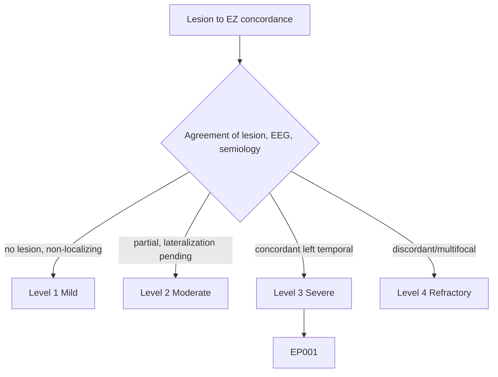
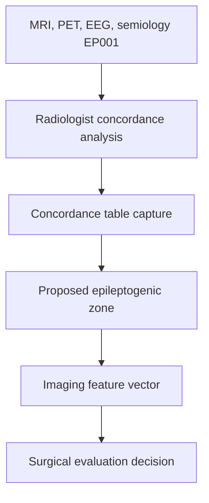
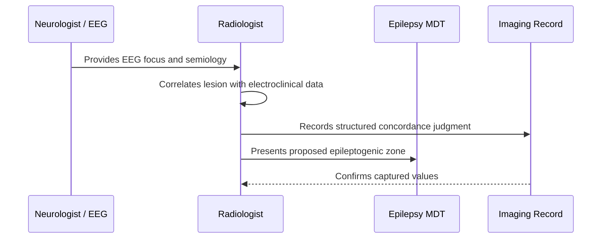
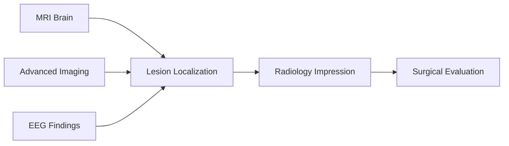
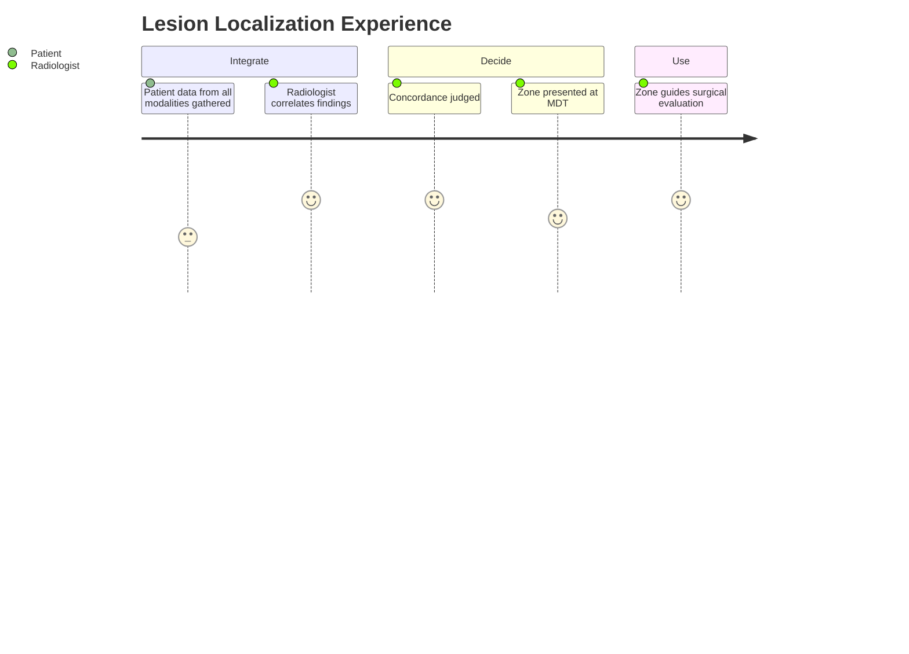

# Radiologist Assessment — Section 5: Lesion → Epileptogenic-Zone Concordance (EP001)

> **Why (this doc):** Surgical decisions hinge not on any single scan but on whether the imaging lesion, the EEG focus, and the seizure semiology point to the same epileptogenic zone; this section formalizes that concordance for EP001. **How:** The radiologist records the lesion-to-epileptogenic-zone concordance for patient EP001 into a fixed variable/value table that gates surgical evaluation.

**Problem:** Discordance between the imaging lesion and the electroclinical focus, if unrecognized, leads to failed surgery or unnecessary invasive monitoring.

**Research Objective:** Capture standardized concordance variables for EP001 so the imaging lesion is formally mapped to the electroclinical epileptogenic zone and linked to the surgical-evaluation vector.

**Role:** Radiologist · **Type:** Secondary (imaging) data

*Caption - Core lesion-localization variables for EP001, recorded by the radiologist. The left mesial temporal lesion is formally judged concordant with the left-temporal EEG focus and semiology, supporting surgical candidacy.*

| Variable | Value |
|---|---|
| Imaging Lesion | Left mesial temporal sclerosis (query) |
| Lesion Lateralization | Left |
| Lesion Lobe | Temporal (mesial) |
| EEG Focus | Left temporal |
| Seizure Semiology | Focal impaired awareness (left temporal) |
| PET Correlate | Left temporal hypometabolism |
| Imaging–EEG Concordance | Concordant |
| Electroclinical–Imaging Concordance | Concordant |
| Epileptogenic Zone (proposed) | Left mesial temporal |
| Discordance Flags | None |
| Invasive EEG Needed | Not required (well concordant) |
| Localization Confidence | High |

## Questionnaire (Enterprise Form)

*Caption - The structured concordance fields the radiologist completes to map lesion to epileptogenic zone, with response type, validation, EP001's example finding, and the derived AI feature.*

| ID | Question | Response Type | Validation | EP001 (Example) | AI Feature |
|---|---|---|---|---|---|
| RAD-0501 | What is the imaging lesion? | Text | free-text, required | Left mesial temporal sclerosis (query) | lesion_type |
| RAD-0502 | What is the lesion lateralization? | Dropdown[Left|Right|Bilateral|None] | one-of[...] | Left | lesion_lateralization |
| RAD-0503 | Which lobe contains the lesion? | Dropdown[Temporal|Frontal|Parietal|Occipital] | one-of[...] | Temporal (mesial) | lesion_lobe |
| RAD-0504 | Where is the EEG focus? | Dropdown[Left temporal|Right temporal|Frontal|Multifocal] | one-of[...] | Left temporal | eeg_focus |
| RAD-0505 | What is the seizure semiology localization? | Text | free-text, required | Focal impaired awareness (left temporal) | semiology_localization |
| RAD-0506 | What is the PET correlate? | Dropdown[Left temporal hypometabolism|Right|None] | one-of[...] | Left temporal hypometabolism | pet_correlate |
| RAD-0507 | Is imaging concordant with EEG? | Dropdown[Concordant|Discordant|Indeterminate] | one-of[...] | Concordant | imaging_eeg_concordance |
| RAD-0508 | Is imaging concordant with electroclinical data? | Dropdown[Concordant|Discordant|Indeterminate] | one-of[...] | Concordant | electroclinical_concordance |
| RAD-0509 | What is the proposed epileptogenic zone? | Text | free-text, required | Left mesial temporal | proposed_ez |
| RAD-0510 | Are there any discordance flags? | Dropdown[None|Lateralization mismatch|Multifocal|Lobar mismatch] | one-of[...] | None | discordance_flags |
| RAD-0511 | Is invasive EEG required? | Yes-No | one-of[Yes|No] | Not required (well concordant) | invasive_eeg_needed |
| RAD-0512 | What is the localization confidence? | Dropdown[High|Moderate|Low] | one-of[...] | High | localization_confidence |

## Severity Scenario Model — Radiologist View

*Caption - Concordance mapping answered across four epilepsy severity levels from the radiologist's point of view; each variable shifts with severity. EP001 corresponds to Level 3 (Severe) — a well-concordant left temporal zone. Level 4 is the discordant/multifocal case requiring invasive work-up.*

### Level 1 — Mild (Well-Controlled)
| Variable | Value |
|---|---|
| Imaging Lesion | None |
| Lesion Lateralization | None |
| Lesion Lobe | None |
| EEG Focus | None localized |
| Seizure Semiology | Non-lateralizing |
| PET Correlate | Not performed |
| Imaging–EEG Concordance | Not applicable |
| Electroclinical–Imaging Concordance | Not applicable |
| Epileptogenic Zone (proposed) | Not defined |
| Discordance Flags | Not applicable |
| Invasive EEG Needed | No |
| Localization Confidence | Not applicable |

### Level 2 — Moderate (Intermediate)
| Variable | Value |
|---|---|
| Imaging Lesion | Non-specific / equivocal |
| Lesion Lateralization | Uncertain |
| Lesion Lobe | Temporal (query) |
| EEG Focus | Temporal, side uncertain |
| Seizure Semiology | Suggestive temporal |
| PET Correlate | Pending |
| Imaging–EEG Concordance | Partial |
| Electroclinical–Imaging Concordance | Partial |
| Epileptogenic Zone (proposed) | Temporal, lateralization pending |
| Discordance Flags | Lateralization pending |
| Invasive EEG Needed | Possibly |
| Localization Confidence | Moderate |

### Level 3 — Severe (Poorly Controlled) — EP001
| Variable | Value |
|---|---|
| Imaging Lesion | Left mesial temporal sclerosis (query) |
| Lesion Lateralization | Left |
| Lesion Lobe | Temporal (mesial) |
| EEG Focus | Left temporal |
| Seizure Semiology | Focal impaired awareness (left temporal) |
| PET Correlate | Left temporal hypometabolism |
| Imaging–EEG Concordance | Concordant |
| Electroclinical–Imaging Concordance | Concordant |
| Epileptogenic Zone (proposed) | Left mesial temporal |
| Discordance Flags | None |
| Invasive EEG Needed | Not required (well concordant) |
| Localization Confidence | High |

### Level 4 — Refractory / Status (Discordant or Multifocal)
| Variable | Value |
|---|---|
| Imaging Lesion | Extensive / bilateral or progressive |
| Lesion Lateralization | Bilateral / widespread |
| Lesion Lobe | Temporal + extratemporal |
| EEG Focus | Multifocal or bilateral |
| Seizure Semiology | Variable / non-localizing |
| PET Correlate | Multifocal hypometabolism |
| Imaging–EEG Concordance | Discordant |
| Electroclinical–Imaging Concordance | Discordant |
| Epileptogenic Zone (proposed) | Ill-defined network |
| Discordance Flags | Multifocal, lateralization mismatch |
| Invasive EEG Needed | Yes — intracranial monitoring |
| Localization Confidence | Low |

### Severity Classification Logic

**Reason:** Localization is graded by the degree of multimodal agreement, not a single scan. **Why:** Concordance decides surgical candidacy and invasive-EEG need for EP001. **What is happening:** Confidence escalates from undefined to a high-confidence left temporal zone, or degrades to a discordant network. **How it is happening:** The radiologist grades lesion, EEG, and semiology agreement against level thresholds. **Reference:** Rosenow & Luders (2001).

## Data Flow in the Pipeline

**Reason:** To show where concordance data enters and travels through the pipeline. **Why:** Because surgical planning depends on a formally mapped epileptogenic zone. **What is happening:** Multimodal findings become a structured concordance judgment feeding the imaging vector. **How it is happening:** The radiologist integrates modalities, records the table, and proposes the zone. **Reference:** Rosenow & Luders (2001).

## Role Capturing the Data

**Reason:** To make explicit which role integrates each element of the localization. **Why:** Because concordance is a shared, cross-role judgment with clear provenance. **What is happening:** The radiologist fuses electroclinical and imaging data into a verified concordance statement. **How it is happening:** Correlation plus MDT presentation is transcribed into the imaging record and confirmed. **Reference:** Rosenow & Luders (2001).

## Linkage to Other Assessment Sections

**Reason:** To show how localization connects to the wider clinical and imaging vector. **Why:** Because the epileptogenic zone integrates every modality into one judgment. **What is happening:** MRI, PET, and EEG converge on localization, which drives the impression and surgery. **How it is happening:** Shared patient identifiers and concordance codes join these sections. **Reference:** Rosenow & Luders (2001).

## Patient and Role Experience

**Reason:** To surface the lived experience of the localization step. **Why:** Because multimodal integration is where uncertainty is resolved for the patient. **What is happening:** Cross-modality data is shaped into a confident zone that shapes the patient's surgical path. **How it is happening:** Structured correlation plus MDT review reduces the risk of operating on the wrong zone. **Reference:** APA (2020).

## Professor Readiness (Defense Q&A)

**Q1: Why is concordance more important than any single modality?** Surgical success depends on resecting the true epileptogenic zone; agreement among MRI, PET, EEG, and semiology, as in EP001's left temporal concordance, best predicts that the resected zone is the seizure source.

**Q2: When is invasive EEG avoided?** When non-invasive modalities are highly concordant and well-lateralized, as in EP001, invasive intracranial monitoring can often be avoided, reducing risk and cost.

**Q3: What would a discordance flag change?** Any lateralization or lobar mismatch would lower confidence and typically mandate intracranial EEG before resection, shifting EP001 toward a more complex pathway.

## References

American Psychological Association. (2020). *Publication manual of the American Psychological Association* (7th ed.). https://doi.org/10.1037/0000165-000

Bernasconi, A., Cendes, F., Theodore, W. H., Gill, R. S., Koepp, M. J., Hogan, R. E., Jackson, G. D., Federico, P., Labate, A., Vaudano, A. E., Blümcke, I., Ryvlin, P., & Bernasconi, N. (2019). Recommendations for the use of structural magnetic resonance imaging in the care of patients with epilepsy: A consensus report from the International League Against Epilepsy Neuroimaging Task Force. *Epilepsia, 60*(6), 1054–1068. https://doi.org/10.1111/epi.15612

Fisher, R. S., Cross, J. H., French, J. A., Higurashi, N., Hirsch, E., Jansen, F. E., Lagae, L., Moshé, S. L., Peltola, J., Roulet Perez, E., Scheffer, I. E., & Zuberi, S. M. (2017). Operational classification of seizure types by the International League Against Epilepsy. *Epilepsia, 58*(4), 522–530. https://doi.org/10.1111/epi.13670

Rosenow, F., & Luders, H. (2001). Presurgical evaluation of epilepsy. *Brain, 124*(9), 1683–1700. https://doi.org/10.1093/brain/124.9.1683
