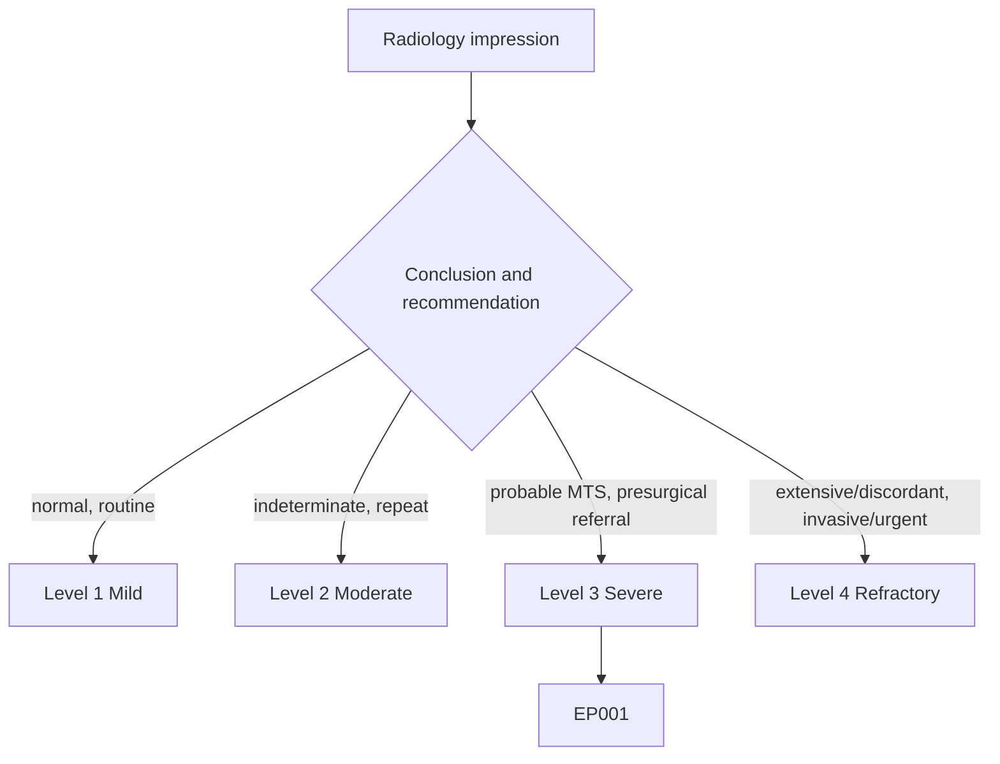
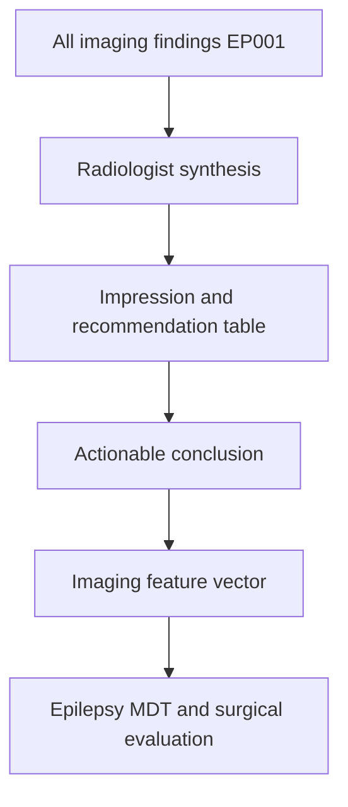
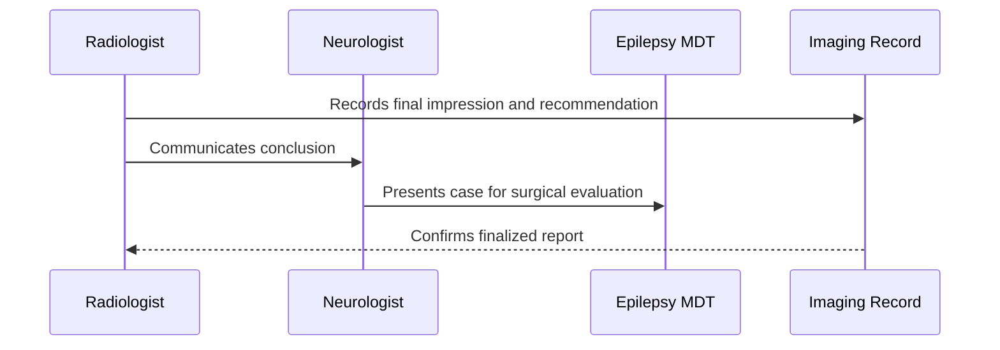
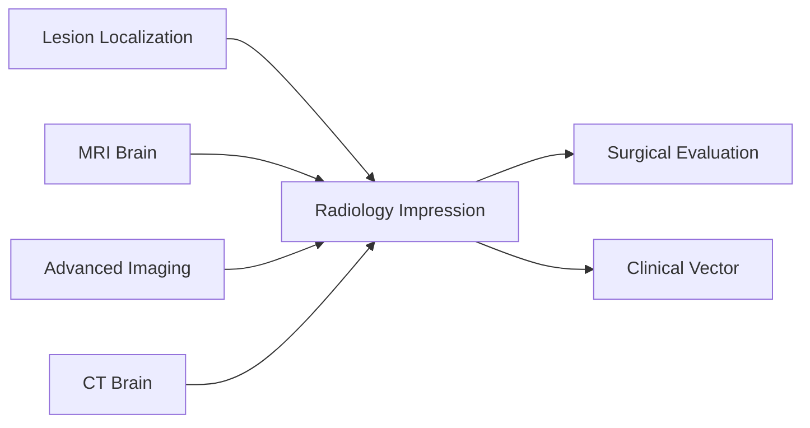
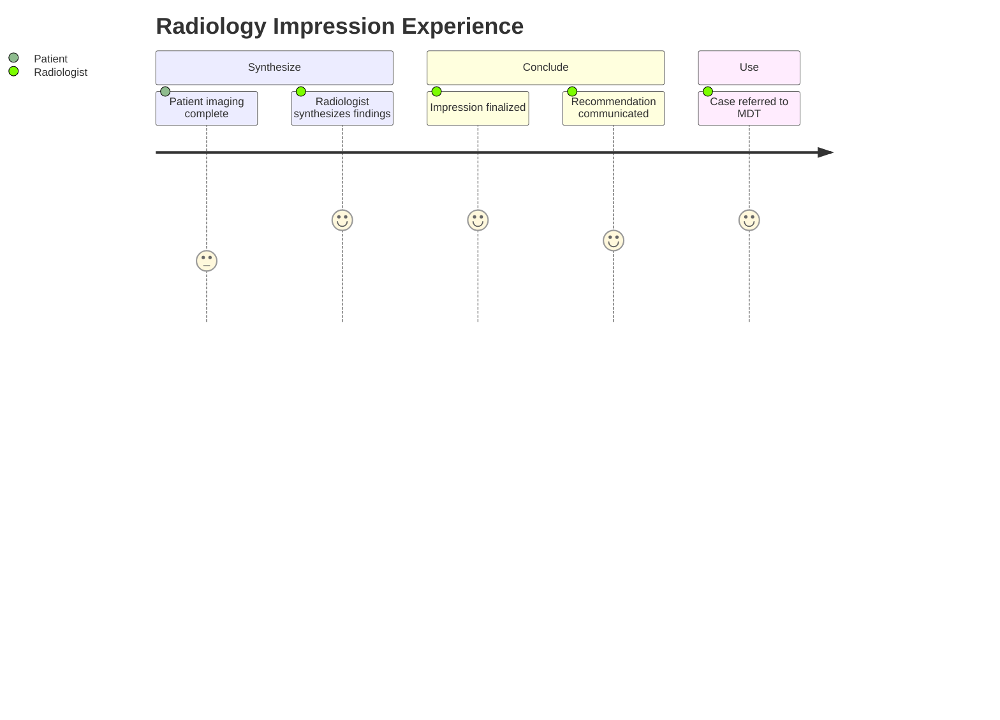

# Radiologist Assessment — Section 6: Radiology Impression & Recommendation (EP001)

> **Why (this doc):** The impression is the radiologist's synthesized conclusion and actionable recommendation; it converts all imaging into a single statement that the epilepsy team acts on for EP001. **How:** The radiologist records the final impression and recommendation for patient EP001 into a fixed variable/value table that closes the imaging pathway and hands off to surgical evaluation.

**Problem:** A findings list without a clear, prioritized impression and recommendation leaves the referring team without an actionable next step.

**Research Objective:** Capture a standardized impression and recommendation for EP001 so the imaging conclusion (probable left MTS, surgical-evaluation candidate) is explicit, prioritized, and linked to the surgical pathway.

**Role:** Radiologist · **Type:** Secondary (imaging) data

*Caption - Core impression variables for EP001, recorded by the radiologist. The synthesized conclusion is probable left mesial temporal sclerosis, concordant with the electroclinical focus, and the patient is flagged as a surgical-evaluation candidate.*

| Variable | Value |
|---|---|
| Primary Impression | Probable left mesial temporal sclerosis |
| Lateralization | Left temporal |
| Concordance Summary | MRI + PET concordant with left temporal EEG |
| CT Contribution | Normal — acute causes excluded |
| Diagnostic Confidence | High |
| Differential Considered | FCD, low-grade tumor (less likely) |
| Recommendation | Refer for presurgical evaluation |
| Additional Imaging Advised | Consider ictal SPECT/MEG if invasive work-up |
| Surgical Candidacy | Candidate (left temporal resection) |
| Follow-up Imaging | Repeat MRI if clinical change |
| Report Turnaround | Finalized and communicated |
| Prior-Scan Comparison | None — baseline established |

## Questionnaire (Enterprise Form)

*Caption - The structured impression fields the radiologist completes to close the study, with response type, validation, EP001's example conclusion, and the derived AI feature.*

| ID | Question | Response Type | Validation | EP001 (Example) | AI Feature |
|---|---|---|---|---|---|
| RAD-0601 | What is the primary impression? | Text | free-text, required | Probable left mesial temporal sclerosis | primary_impression |
| RAD-0602 | What is the lateralization? | Dropdown[Left temporal|Right temporal|Other|None] | one-of[...] | Left temporal | impression_lateralization |
| RAD-0603 | What is the concordance summary? | Text | free-text, required | MRI + PET concordant with left temporal EEG | concordance_summary |
| RAD-0604 | What did CT contribute? | Text | free-text, required | Normal — acute causes excluded | ct_contribution |
| RAD-0605 | What is the diagnostic confidence? | Dropdown[High|Moderate|Low] | one-of[...] | High | diagnostic_confidence |
| RAD-0606 | What differentials were considered? | Text | free-text, required | FCD, low-grade tumor (less likely) | differential |
| RAD-0607 | What is the recommendation? | Dropdown[Refer for presurgical evaluation|Routine follow-up|Repeat imaging|Urgent review] | one-of[...] | Refer for presurgical evaluation | recommendation |
| RAD-0608 | What additional imaging is advised? | Text | free-text | Consider ictal SPECT/MEG if invasive work-up | additional_imaging |
| RAD-0609 | Is the patient a surgical candidate? | Dropdown[Candidate|Not a candidate|Needs invasive EEG] | one-of[...] | Candidate (left temporal resection) | surgical_candidacy |
| RAD-0610 | What follow-up imaging is advised? | Text | free-text | Repeat MRI if clinical change | followup_imaging |
| RAD-0611 | What is the report turnaround status? | Dropdown[Finalized and communicated|Pending|Preliminary] | one-of[...] | Finalized and communicated | report_turnaround |
| RAD-0612 | Was prior-scan comparison possible? | Dropdown[Yes|None baseline] | one-of[...] | None — baseline established | impression_prior_comparison |

## Severity Scenario Model — Radiologist View

*Caption - The impression answered across four epilepsy severity levels from the radiologist's point of view; each variable shifts with severity. EP001 corresponds to Level 3 (Severe) — probable left MTS, surgical candidate. Level 4 is the extensive/discordant or emergent case.*

### Level 1 — Mild (Well-Controlled)
| Variable | Value |
|---|---|
| Primary Impression | Normal neuroimaging |
| Lateralization | None |
| Concordance Summary | No lesion to concord |
| CT Contribution | Normal |
| Diagnostic Confidence | High (negative study) |
| Differential Considered | None |
| Recommendation | Routine follow-up |
| Additional Imaging Advised | None |
| Surgical Candidacy | Not a candidate |
| Follow-up Imaging | Only if clinical change |
| Report Turnaround | Finalized |
| Prior-Scan Comparison | Not required |

### Level 2 — Moderate (Intermediate)
| Variable | Value |
|---|---|
| Primary Impression | Non-specific finding, indeterminate |
| Lateralization | Uncertain |
| Concordance Summary | Partial concordance |
| CT Contribution | Normal |
| Diagnostic Confidence | Moderate |
| Differential Considered | MTS vs non-specific |
| Recommendation | Repeat/expedite epilepsy-protocol MRI |
| Additional Imaging Advised | PET if MRI remains equivocal |
| Surgical Candidacy | To be determined |
| Follow-up Imaging | Interval repeat MRI |
| Report Turnaround | Finalized |
| Prior-Scan Comparison | None |

### Level 3 — Severe (Poorly Controlled) — EP001
| Variable | Value |
|---|---|
| Primary Impression | Probable left mesial temporal sclerosis |
| Lateralization | Left temporal |
| Concordance Summary | MRI + PET concordant with left temporal EEG |
| CT Contribution | Normal — acute causes excluded |
| Diagnostic Confidence | High |
| Differential Considered | FCD, low-grade tumor (less likely) |
| Recommendation | Refer for presurgical evaluation |
| Additional Imaging Advised | Consider ictal SPECT/MEG if invasive work-up |
| Surgical Candidacy | Candidate (left temporal resection) |
| Follow-up Imaging | Repeat MRI if clinical change |
| Report Turnaround | Finalized and communicated |
| Prior-Scan Comparison | None — baseline established |

### Level 4 — Refractory / Status (Extensive, Discordant, or Emergent)
| Variable | Value |
|---|---|
| Primary Impression | Extensive/bilateral or progressive disease |
| Lateralization | Bilateral / ill-defined |
| Concordance Summary | Discordant or multifocal network |
| CT Contribution | Emergent read in status |
| Diagnostic Confidence | Low — needs invasive confirmation |
| Differential Considered | Progressive lesion, dual pathology |
| Recommendation | Urgent review + intracranial EEG |
| Additional Imaging Advised | Ictal SPECT, MEG, urgent MRI in status |
| Surgical Candidacy | Complex; palliative options considered |
| Follow-up Imaging | Short-interval repeat imaging |
| Report Turnaround | Expedited / emergent |
| Prior-Scan Comparison | Interval progression assessed |

### Severity Classification Logic

**Reason:** The impression is graded by the strength of conclusion and the pathway it triggers. **Why:** Confidence and concordance decide whether EP001 is referred for surgery. **What is happening:** The conclusion escalates from a normal study to a discordant, invasively worked-up case. **How it is happening:** The radiologist grades confidence and concordance against level thresholds. **Reference:** Rosenow & Luders (2001).

## Data Flow in the Pipeline

**Reason:** To show where the impression enters and travels through the pipeline. **Why:** Because the referring team acts on the synthesized conclusion, not the raw findings. **What is happening:** All findings become a single prioritized recommendation feeding the imaging vector. **How it is happening:** The radiologist synthesizes modalities, records the impression table, and communicates it. **Reference:** Bernasconi et al. (2019).

## Role Capturing the Data

**Reason:** To make explicit which role authors and communicates the conclusion. **Why:** Because the finalized, communicated impression carries clinical accountability. **What is happening:** The radiologist authors a verified conclusion that the neurologist and MDT act on. **How it is happening:** Synthesis plus communication is transcribed into the imaging record and confirmed. **Reference:** Rosenow & Luders (2001).

## Linkage to Other Assessment Sections

**Reason:** To show how the impression connects to the wider clinical and imaging vector. **Why:** Because the impression is the convergence point of every imaging section. **What is happening:** MRI, CT, advanced imaging, and localization converge on one recommendation. **How it is happening:** Shared patient identifiers and the recommendation code join these sections. **Reference:** Bernasconi et al. (2019).

## Patient and Role Experience

**Reason:** To surface the lived experience of the impression step. **Why:** Because a timely, clear conclusion shapes the patient's onward care. **What is happening:** Completed imaging is shaped into an actionable, communicated recommendation. **How it is happening:** Synthesis plus prompt communication moves EP001 toward presurgical evaluation. **Reference:** APA (2020).

## Professor Readiness (Defense Q&A)

**Q1: Why must the impression be more than a findings list?** The referring team needs a prioritized, actionable conclusion; for EP001 the impression states probable left MTS and recommends presurgical evaluation, converting imaging into a decision.

**Q2: What makes EP001 a surgical-evaluation candidate on imaging?** A concordant, well-lateralized left temporal lesion (MRI + PET agreeing with EEG) with high diagnostic confidence predicts a good chance of seizure freedom after left temporal resection.

**Q3: Why record differentials and confidence?** Documenting FCD and low-grade tumor as less-likely alternatives and stating high confidence makes the reasoning auditable and guides whether further imaging or invasive EEG is needed.

## References

American Psychological Association. (2020). *Publication manual of the American Psychological Association* (7th ed.). https://doi.org/10.1037/0000165-000

Bernasconi, A., Cendes, F., Theodore, W. H., Gill, R. S., Koepp, M. J., Hogan, R. E., Jackson, G. D., Federico, P., Labate, A., Vaudano, A. E., Blümcke, I., Ryvlin, P., & Bernasconi, N. (2019). Recommendations for the use of structural magnetic resonance imaging in the care of patients with epilepsy: A consensus report from the International League Against Epilepsy Neuroimaging Task Force. *Epilepsia, 60*(6), 1054–1068. https://doi.org/10.1111/epi.15612

Fisher, R. S., Cross, J. H., French, J. A., Higurashi, N., Hirsch, E., Jansen, F. E., Lagae, L., Moshé, S. L., Peltola, J., Roulet Perez, E., Scheffer, I. E., & Zuberi, S. M. (2017). Operational classification of seizure types by the International League Against Epilepsy. *Epilepsia, 58*(4), 522–530. https://doi.org/10.1111/epi.13670

Rosenow, F., & Luders, H. (2001). Presurgical evaluation of epilepsy. *Brain, 124*(9), 1683–1700. https://doi.org/10.1093/brain/124.9.1683
