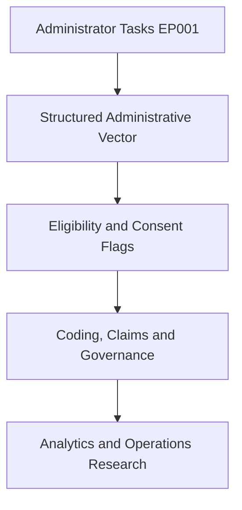
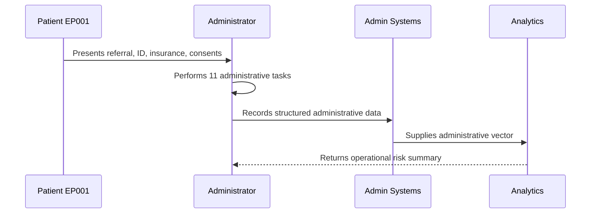
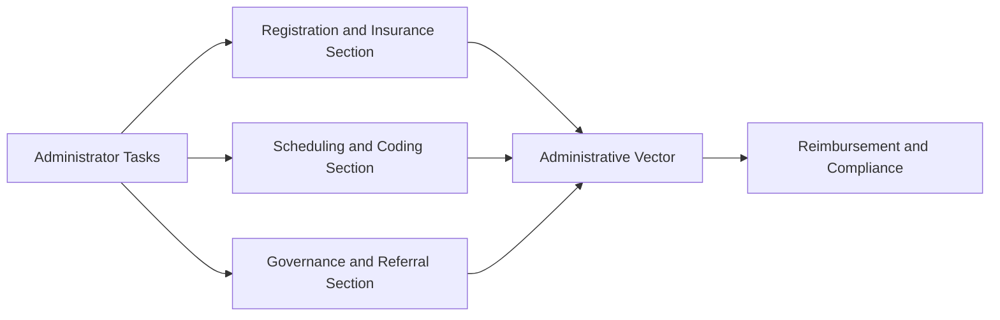
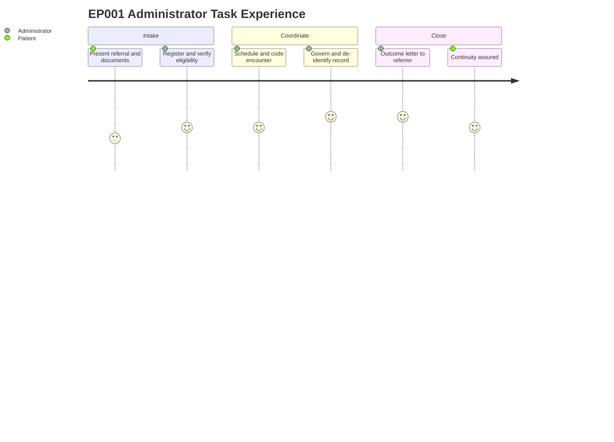

# Role — Administrator: Tasks, Concerns & Task List (EP001)

> **Why (this doc):** The clinic administrator is the primary owner of administrative data and
> the operational record for EP001 (29M, focal impaired awareness seizures, left-temporal);
> this doc captures what the administrator performs, the concerns surfaced, and the resulting
> task list so the administrative vector feeding downstream billing, governance, and analytics
> is complete and traceable. **How:** Structured task tables plus concern and task registers,
> each preceded by a caption and mapped into the pipeline via flow, sequence, linkage, and
> journey diagrams.

**Role:** Administrator · **Owns:** Primary (administrative) data + operational record

**Problem:** EP001 enters the clinic through a referral that must be registered, verified,
scheduled, coded, governed, and coordinated; fragmented administrative capture risks denied
claims, privacy breach, and lost continuity of the epilepsy workup.

**Research Objective:** Standardize administrator-owned capture into a consistent,
machine-readable administrative vector that supports reimbursement, HIPAA/GDPR compliance,
and epilepsy operations research.

## Tasks Performed

*Caption - The full slate of administrator-performed tasks for EP001, from registration to
referral loop-closure; this is the primary source of the structured administrative vector.*

| # | Task | Data Captured |
|---|---|---|
| 1 | Patient Registration | Identity, demographics, MRN, Study ID |
| 2 | Insurance Verification | Payer, eligibility, prior authorization |
| 3 | Consent Capture | Treat, HIPAA, research, GDPR basis |
| 4 | Appointment Scheduling | Consult, EEG, MRI, follow-up slots |
| 5 | Encounter Coding | ICD-10 G40.209, CPT 99204/95816/70553 |
| 6 | Charge Capture | Claim readiness, audit flag |
| 7 | Records Management | RBAC, audit logging, retention |
| 8 | De-identification | Safe Harbor to Study ID DBA-EP-001 |
| 9 | Referral Intake | Source, triage, completeness |
| 10 | Care Coordination | Diagnostics, interdisciplinary loop |
| 11 | Loop Closure | Outcome letter to referrer |

## Administrative Concerns (Pain Points) Identified

*Caption - Pain points the administrator flags from EP001 intake; these concerns prioritize
the task list and become operational risk features in the downstream model.*

| Concern | Evidence in EP001 |
|---|---|
| Prior-authorization delay | EEG and MRI require payer approval |
| Consent completeness | Separate treat vs research consents needed |
| Privacy exposure | Sensitive PHI requiring de-identification |
| Coding specificity | Focal epilepsy must map to correct G40.x |
| Referral loop closure | Outcome letter to GP still pending |

## Task List (Recommended, not prescriptive)

*Caption - The recommended action set derived from the tasks and concerns; it closes the loop
from administrative capture to reimbursement, compliance, and continuity.*

| # | Task |
|---|---|
| 1 | Verify identity and assign MRN/Study ID |
| 2 | Confirm eligibility and prior authorization |
| 3 | Capture all consents (treat, HIPAA, research) |
| 4 | Sequence consult, EEG, MRI, follow-up |
| 5 | Assign and audit ICD-10/CPT codes |
| 6 | Apply RBAC, audit logging, retention policy |
| 7 | De-identify record to DBA-EP-001 |
| 8 | Close referral loop with outcome letter |

## Pipeline & Flow Diagrams

### Where this data flows in the pipeline

**Reason:** To show that administrator-owned tasks are the origin of the operational record.
**Why:** Downstream claims, governance, and analytics are only valid if capture is complete.
**What is happening:** Raw intake actions are transformed into an administrative vector, then
into flags, claims, and research inputs. **How it is happening:** Each task row maps to typed
fields that concatenate into the vector consumed downstream. **Reference:** U.S. Department of
Health and Human Services (2013); Topol (2019).

### Role capturing it

**Reason:** To make explicit who captures each administrative element and in what order.
**Why:** Role clarity prevents gaps and duplicated ownership. **What is happening:** The
administrator registers, verifies, schedules, codes, governs, and coordinates, writing
structured data that analytics consumes. **How it is happening:** Each interaction commits a
record that the next stage reads. **Reference:** Voigt & von dem Bussche (2017); APA (2020).

### How it links to other assessment sections and the administrative vector

**Reason:** To position administrator data relative to sibling administrative sections. **Why:**
The administrative vector is only meaningful when its component sections interlink. **What is
happening:** Registration, scheduling/coding, and governance/referral sections feed a shared
vector that drives reimbursement and compliance. **How it is happening:** Shared patient keys
(MRN EP-2026-001, Study ID DBA-EP-001) join section outputs into one vector. **Reference:**
World Health Organization (2019); Topol (2019).

### Patient and role experience for this item

**Reason:** To surface the lived experience behind each captured administrative field. **Why:**
Capture quality depends on patient effort and administrative workload. **What is happening:**
The patient presents documents and the administrator registers, verifies, schedules, codes,
governs, and coordinates across the intake episode. **How it is happening:** Each journey step
corresponds to an administrative task row being populated. **Reference:** Topol (2019); APA
(2020).

## Professor Readiness (Defense Q&A)

**Q1: Why is the administrator the owner of primary administrative data?**
Because the administrator performs registration, verification, scheduling, coding, governance,
and coordination; concentrating ownership ensures accountability and a single authoritative
source for the administrative vector.

**Q2: How do the concerns connect to the task list?**
Each concern is evidence-backed from EP001 intake (e.g., EEG/MRI needing prior authorization),
and each maps to one or more recommended tasks such as confirming eligibility and closing the
referral loop.

**Q3: How is EP001 represented administratively for research?**
The clinical identity (MRN EP-2026-001) is de-identified via HIPAA Safe Harbor to Study ID
DBA-EP-001 under explicit GDPR consent, coded as focal epilepsy (ICD-10 G40.209), so the
record is lawfully reusable and correctly cohorted.

## References

American Psychological Association. (2020). *Publication manual of the American Psychological
Association* (7th ed.). https://doi.org/10.1037/0000165-000

U.S. Department of Health and Human Services. (2013). *HIPAA administrative simplification:
Regulation text (45 CFR Parts 160, 162, and 164)*. Office for Civil Rights.
https://www.hhs.gov/hipaa

Voigt, P., & von dem Bussche, A. (2017). *The EU General Data Protection Regulation (GDPR): A
practical guide* (1st ed.). Springer International Publishing.
https://doi.org/10.1007/978-3-319-57959-7

World Health Organization. (2019). *International statistical classification of diseases and
related health problems* (11th ed.). https://icd.who.int/

Topol, E. J. (2019). High-performance medicine: The convergence of human and artificial
intelligence. *Nature Medicine, 25*(1), 44–56. https://doi.org/10.1038/s41591-018-0300-7
