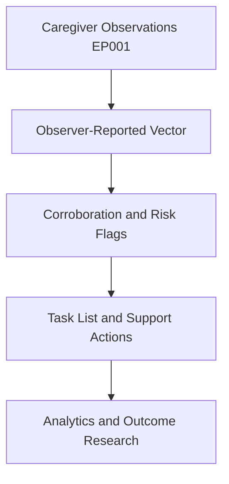
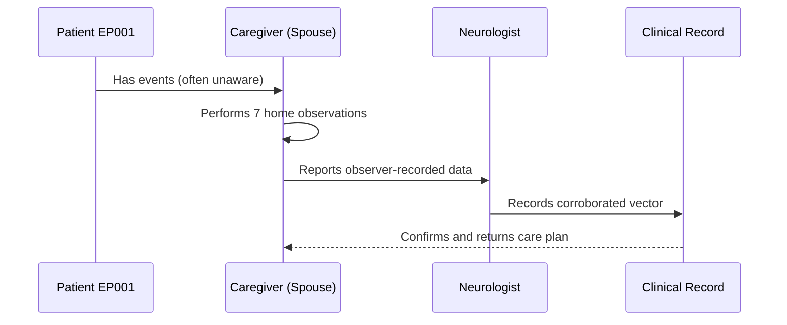
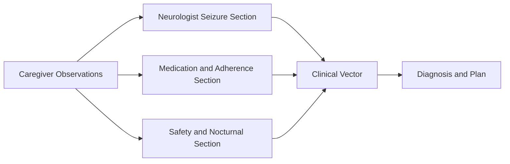
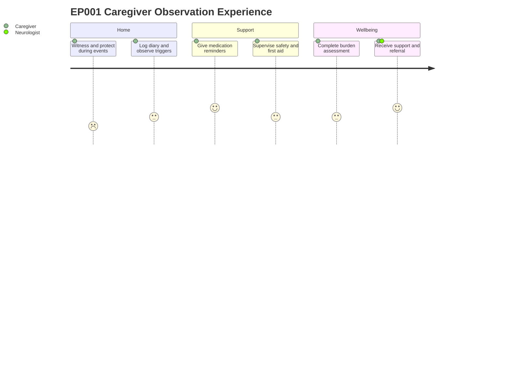

# Role — Caregiver (Spouse): Observations, Concerns & Tasks (EP001)

> **Why (this doc):** The caregiver is EP001's co-habiting spouse and the primary witness to
> events the patient cannot self-report (29M, focal impaired awareness seizures, left-temporal,
> ~5/month including nocturnal); this doc captures what the caregiver observes, the concerns
> surfaced, and the resulting task list so the observer stream feeding the clinical vector is
> complete and traceable. **How:** Structured observation tables plus concern and task
> registers, each preceded by a caption and mapped into the pipeline via flow, sequence,
> linkage, and journey diagrams.

**Role:** Caregiver (Spouse) · **Owns:** Primary (observer-reported) data + home monitoring

**Problem:** EP001's impaired-awareness and nocturnal seizures leave him amnestic for events,
and without a structured caregiver record the semiology, true frequency, adherence, and safety
signal are lost to the clinical model.

**Research Objective:** Standardize caregiver-owned observation capture into a consistent,
machine-readable observer vector that corroborates neurologist data and supports diagnosis,
treatment optimization, and epilepsy outcome research.

## Observations Performed

*Caption - The full slate of caregiver-performed observations for EP001, from witnessed
semiology to caregiver wellbeing; this is the primary source of the observer-reported vector
that corroborates the clinical record.*

| # | Observation | Data Captured |
|---|---|---|
| 1 | Witnessed Seizure Semiology | Onset, automatisms, awareness, duration, generalization |
| 2 | Home Frequency & Diary | Monthly count, timing, cluster days, logging adherence |
| 3 | Nocturnal / Unwitnessed Events | Night events, indirect signs, hidden burden estimate |
| 4 | Observed Triggers | Sleep, stress, missed doses, caffeine, correlation |
| 5 | Medication Support | Reminders, organizer, observed adherence, side effects |
| 6 | Safety & Supervision | Falls, driving, first aid, supervision, emergency plan |
| 7 | Caregiver Burden (ZBI) | Burden score, sleep loss, anxiety, support needs |

## Caregiver Concerns (Pain Points) Identified

*Caption - Pain points the caregiver flags from EP001 observations; these concerns prioritize
the task list and become corroborating risk features in the downstream clinical model.*

| Concern | Evidence in EP001 |
|---|---|
| Hidden nocturnal burden | ~3/month nocturnal events, indirect morning signs |
| Sleep deficit as trigger | Observed 5.2 hrs/day, precedes most events |
| Adherence gaps | Missed evening doses, observed adherence 88% |
| Injury / SUDEP risk | 1 fall, occasional generalization, no rescue med |
| Caregiver strain | ZBI 32 (mild–moderate), nocturnal vigilance sleep loss |

## Task List (Recommended, not prescriptive)

*Caption - The recommended action set derived from the observations and concerns; it closes
the loop from home capture to clinical decision and caregiver support.*

| # | Task |
|---|---|
| 1 | Maintain same-day seizure diary logging |
| 2 | Consider nocturnal monitoring device |
| 3 | Reinforce evening-dose reminders |
| 4 | Strengthen sleep-hygiene support |
| 5 | Document formal seizure emergency plan |
| 6 | Discuss rescue-medication provision with neurologist |
| 7 | Refer caregiver to support group / re-screen ZBI |

## Pipeline & Flow Diagrams

### Where this data flows in the pipeline

**Reason:** To show that caregiver-owned observations are the origin of the observer-reported
record. **Why:** Downstream corroboration and analytics are only valid if home capture is
complete. **What is happening:** Raw observations are transformed into an observer vector, then
into flags, tasks, and research inputs. **How it is happening:** Each observation row maps to
typed fields that concatenate into the vector consumed downstream. **Reference:** Fisher et
al. (2017); Topol (2019).

### Role capturing it

**Reason:** To make explicit who captures each observed element and in what order. **Why:** Role
clarity prevents gaps between patient, caregiver, and clinician data. **What is happening:** The
caregiver observes at home, and the neurologist integrates and confirms the record. **How it
is happening:** Each interaction commits a record that the next stage reads. **Reference:**
Fisher et al. (2017); APA (2020).

### How it links to other assessment sections and the clinical vector

**Reason:** To position caregiver data relative to sibling assessment sections. **Why:** The
clinical vector is only complete when observer data interlinks with clinician data. **What is
happening:** Seizure, medication, and safety observations feed a shared vector that drives
diagnosis. **How it is happening:** Shared patient keys join section outputs into one vector.
**Reference:** Fisher et al. (2017); Topol (2019).

### Patient and role experience for this item

**Reason:** To surface the lived experience behind each observed field. **Why:** Capture quality
and sustainability depend on caregiver effort and wellbeing. **What is happening:** The spouse
witnesses, logs, supports, and supervises across daily life while carrying her own strain. **How
it is happening:** Each journey step corresponds to an observation row being populated.
**Reference:** Topol (2019); APA (2020).

## Professor Readiness (Defense Q&A)

**Q1: Why is the caregiver an owner of primary data, not just a bystander?**
Because EP001's impaired-awareness and nocturnal seizures make him amnestic for events; the
co-habiting spouse is the sole reliable source for semiology, true frequency, and real
adherence, so she owns an authoritative observer stream that corroborates the clinical vector.

**Q2: How do the caregiver concerns connect to the task list?**
Each concern is evidence-backed from EP001 observations (e.g., ~3 nocturnal events/month with
indirect signs), and each maps to one or more recommended tasks such as considering a nocturnal
monitoring device and documenting a formal emergency plan.

**Q3: How is caregiver data validated against clinician data?**
The neurologist reads back and corroborates observed semiology, frequency, and adherence
against clinical history and EEG, and the ZBI provides a validated measure of the caregiver's
own capacity to sustain reliable reporting.

## References

American Psychological Association. (2020). *Publication manual of the American Psychological
Association* (7th ed.). https://doi.org/10.1037/0000165-000

Fisher, R. S., Cross, J. H., French, J. A., Higurashi, N., Hirsch, E., Jansen, F. E., Lagae,
L., Moshé, S. L., Peltola, J., Roulet Perez, E., Scheffer, I. E., & Zuberi, S. M. (2017).
Operational classification of seizure types by the International League Against Epilepsy:
Position paper of the ILAE Commission for Classification and Terminology. *Epilepsia, 58*(4),
522–530. https://doi.org/10.1111/epi.13670

Zarit, S. H., Reever, K. E., & Bach-Peterson, J. (1980). Relatives of the impaired elderly:
Correlates of feelings of burden. *The Gerontologist, 20*(6), 649–655.
https://doi.org/10.1093/geront/20.6.649
