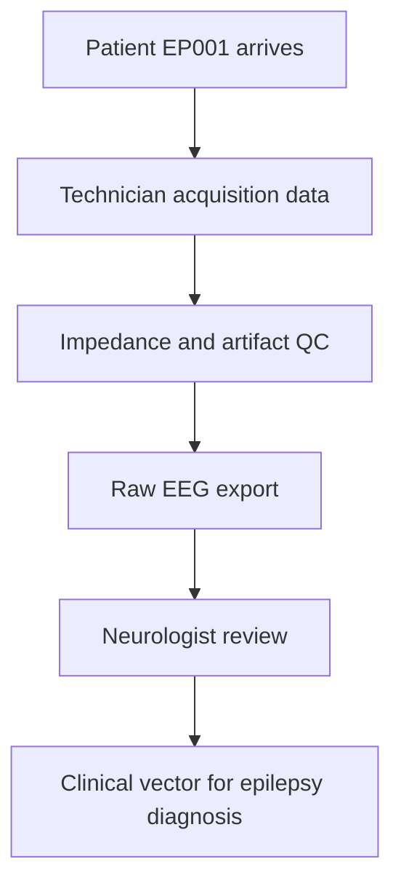
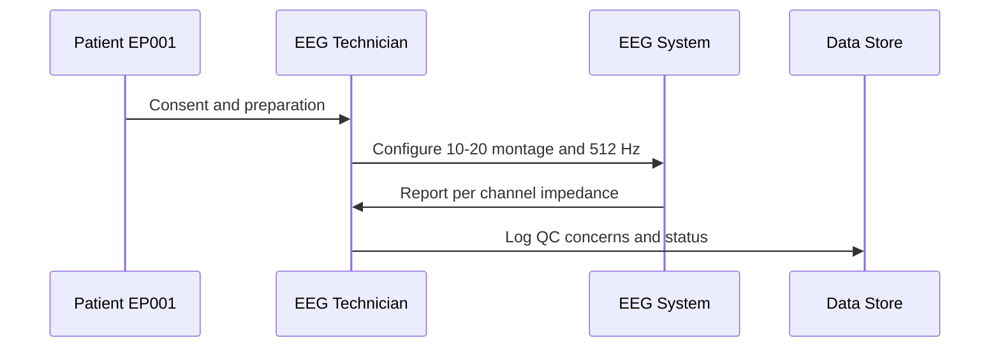
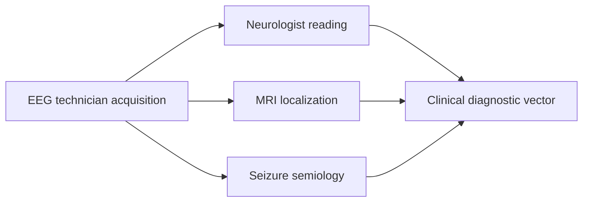
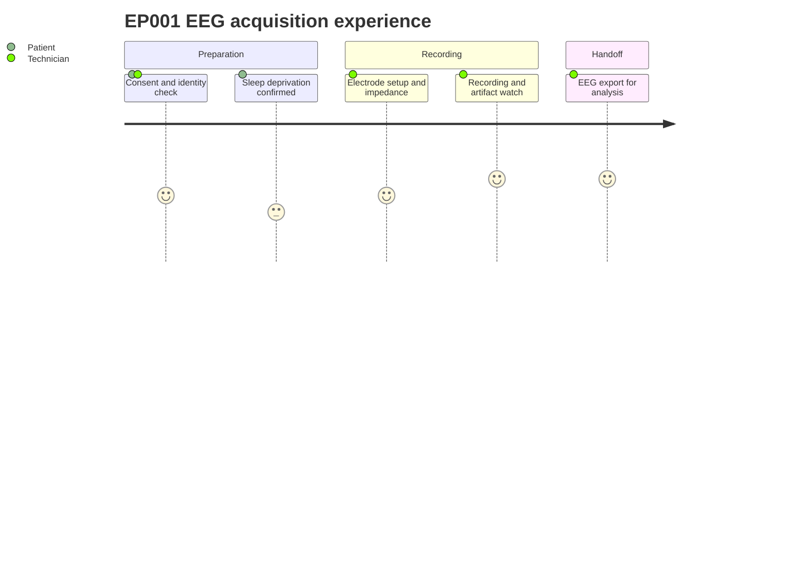

# Role — EEG Technician: Assessments, Concerns & Tasks (EP001)

> **Why (this doc):** The EEG technician produces the raw electrophysiological signal and its quality metadata, which is the single most decisive input for diagnosing focal impaired-awareness epilepsy in EP001. **How:** It standardizes what the technician captures (preparation, setup, impedance, recording conditions, artifact risk, notes) so downstream neurologist review and analytics receive clean, traceable data.

**Problem:** Poor acquisition quality (high impedance, artifact burden, non-compliant sleep deprivation) silently degrades every downstream interpretation of EP001's left-temporal focal epilepsy.

**Research Objective:** Define and validate the EEG technician's data-capture standard so that acquisition quality is measurable, reproducible, and fit for both clinical reading and machine analysis.

**Role:** EEG Technician · **Owns:** EEG acquisition & quality-control (pre-EEG) data

## Assessments Performed

*Caption - Enumerates the six acquisition assessments the technician performs for EP001, defining the raw data and quality metadata that seed the entire epilepsy diagnostic pipeline.*

| # | Assessment | Data Captured |
|---|---|---|
| 1 | Patient Preparation | Identity, consent, sleep-deprivation, prep |
| 2 | EEG Setup | 10–20 system, 21 electrodes, sampling rate |
| 3 | Electrode Quality | Per-channel & average impedance (<5 kΩ) |
| 4 | Recording Conditions | Awake/drowsy, hyperventilation, photic |
| 5 | Artifact Risk | Eye blink, muscle, movement, noise |
| 6 | Technician Notes | Cooperation, readiness, protocol suitability |

**Reason:** Shows where technician-captured data enters the diagnostic pipeline. **Why:** Acquisition quality gates every later step, so its position must be explicit. **What is happening:** EP001 preparation and QC produce a validated raw EEG that flows to neurologist review. **How it is happening:** Each node hands a verified artifact to the next, preventing bad signal from propagating. **Reference:** Fisher et al. (2017).

## Technical Concerns (Pain Points) Monitored

*Caption - Records the specific quality risks the technician actively monitors during EP001's session and their resolved status, making acquisition fitness auditable.*

| Concern | EP001 Status |
|---|---|
| High impedance | Average 3.1 kΩ — OK (<5 kΩ) |
| Artifact burden | Low (mild blink only) |
| Sleep-deprivation compliance | Confirmed |
| Movement risk | Low |
| Recording usability | Suitable for routine EEG |

**Reason:** Depicts the technician role capturing and logging quality concerns. **Why:** Clarifies who acts and in what order during acquisition. **What is happening:** The technician prepares EP001, configures the system, and records impedance and artifact status. **How it is happening:** Each message is a discrete verified handoff between patient, technician, hardware, and store. **Reference:** Topol (2019).

## Task List

*Caption - Lists the ordered operational tasks the technician executes for EP001, linking assessment intent to concrete acquisition actions.*

| # | Task |
|---|---|
| 1 | Verify consent & identity |
| 2 | Confirm sleep deprivation |
| 3 | Record current medication |
| 4 | Check electrode impedance |
| 5 | Verify sampling rate (512 Hz) |
| 6 | Start recording |
| 7 | Monitor artifacts during recording |
| 8 | Export EEG for analysis |

**Reason:** Maps how technician data links to other assessment sections. **Why:** Diagnosis of left-temporal focal epilepsy fuses several evidence streams. **What is happening:** Acquisition output joins imaging and semiology to form the clinical vector. **How it is happening:** Each section contributes a feature that converges on a shared diagnostic vector. **Reference:** Fisher et al. (2017).

**Reason:** Traces the patient and technician experience for this acquisition item. **Why:** Comfort and compliance directly affect signal quality for EP001. **What is happening:** EP001 moves from preparation through recording to export with technician support. **How it is happening:** Each stage scores the experience to surface friction that could degrade data. **Reference:** Topol (2019).

## Professor Readiness (Defense Q&A)

**Q1: Why is electrode impedance kept below 5 kΩ?** High impedance raises noise and distorts the signal; keeping it below 5 kΩ (EP001 averaged 3.1 kΩ) ensures interpretable, low-artifact EEG.

**Q2: Why is sleep deprivation part of preparation?** Sleep deprivation increases the yield of interictal epileptiform discharges, improving sensitivity for detecting EP001's focal epilepsy.

**Q3: How does the technician's data affect downstream analytics?** It is the raw substrate; poor acquisition propagates errors into every reading and model, so QC metadata makes acquisition fitness explicit and auditable.

## References

American Psychological Association. (2020). *Publication manual of the American Psychological Association* (7th ed.). American Psychological Association.

Fisher, R. S., Cross, J. H., French, J. A., Higurashi, N., Hirsch, E., Jansen, F. E., Lagae, L., Moshé, S. L., Peltola, J., Roulet Perez, E., Scheffer, I. E., & Zuberi, S. M. (2017). Operational classification of seizure types by the International League Against Epilepsy. *Epilepsia, 58*(4), 522–530. https://doi.org/10.1111/epi.13670

Topol, E. J. (2019). *Deep medicine: How artificial intelligence can make healthcare human again*. Basic Books.
