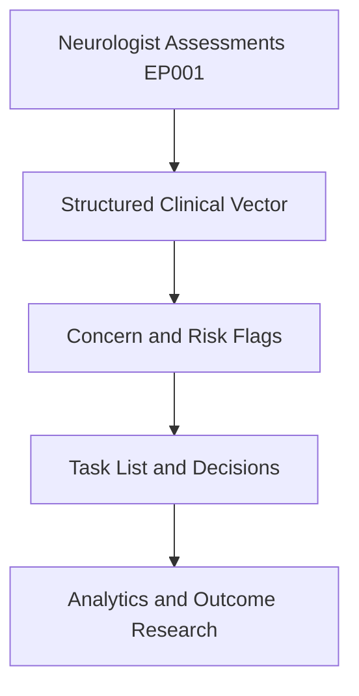
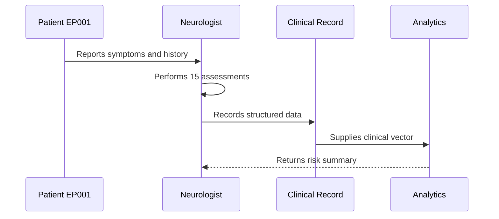
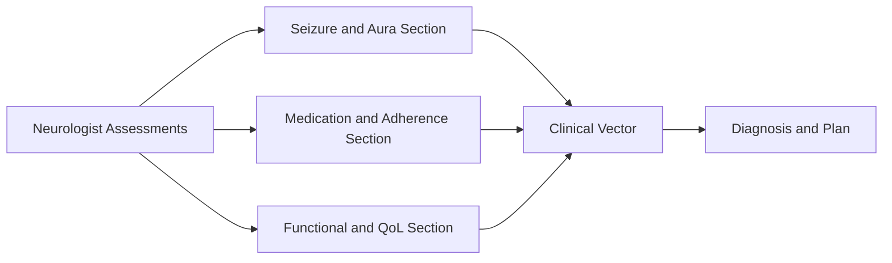
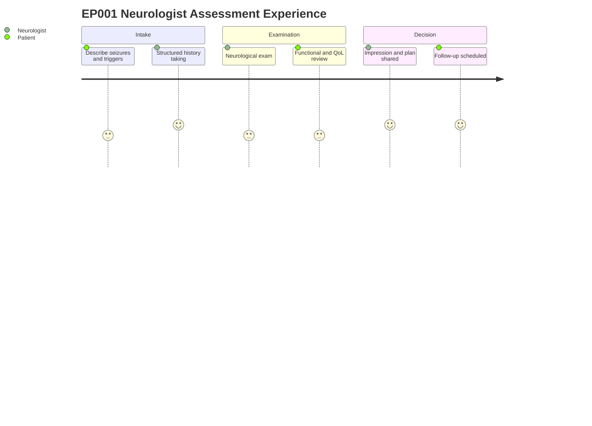

# Role — Neurologist: Assessments, Concerns & Tasks (EP001)

> **Why (this doc):** The neurologist is the primary owner of clinical data and final
> clinical decisions for EP001 (29M, focal impaired awareness seizures, left-temporal);
> this doc captures what the neurologist assesses, the concerns surfaced, and the resulting
> task list so the clinical vector feeding downstream analytics is complete and traceable.
> **How:** Structured assessment tables plus concern and task registers, each preceded by a
> caption and mapped into the pipeline via flow, sequence, linkage, and journey diagrams.

**Role:** Neurologist · **Owns:** Primary (clinical) data + final clinical decisions

**Problem:** EP001 has poorly controlled focal epilepsy (breakthrough seizures despite good
adherence), and fragmented clinical capture risks losing the signal needed for treatment
decisions and research.

**Research Objective:** Standardize neurologist-owned assessment capture into a consistent,
machine-readable clinical vector that supports diagnosis, treatment optimization, and
epilepsy outcome research.

## Assessments Performed

*Caption - The full slate of neurologist-performed assessments for EP001, from chief
complaint to final impression; this is the primary source of the structured clinical vector.*

| # | Assessment | Data Captured |
|---|---|---|
| 1 | Chief Complaint | Reason, concern, duration, severity, ER visits |
| 2 | History of Present Illness | Onset, progression, breakthrough seizures |
| 3 | Seizure History | Type, frequency, duration, nocturnal, diary |
| 4 | Aura | Metallic taste, déjà vu, speech difficulty |
| 5 | During Seizure | Awareness, tongue biting, jerking, deviation |
| 6 | Post-Ictal | Confusion, headache, fatigue, recovery |
| 7 | Trigger Assessment | Sleep, stress, missed meds, alcohol |
| 8 | Medication History | Drug, dose, adherence, side effects, failures |
| 9 | Past Medical History | Head injury, stroke, infection |
| 10 | Family History | Epilepsy, migraine |
| 11 | Lifestyle | Sleep, alcohol, caffeine, stress |
| 12 | Neurological Examination | Motor, sensory, reflexes, gait |
| 13 | Functional Assessment | Driving, ADL/IADL, falls, injury risk |
| 14 | Quality of Life | QOLIE-31, anxiety, depression, fatigue |
| 15 | Impression | Diagnosis, medication plan, follow-up |

## Clinical Concerns (Pain Points) Identified

*Caption - Pain points the neurologist flags from EP001 data; these concerns prioritize the
task list and become risk features in the downstream clinical model.*

| Concern | Evidence in EP001 |
|---|---|
| Poor seizure control | 5 seizures/month + breakthrough seizures |
| Sleep deficit as trigger | 5.2 hrs/day, poor quality |
| High trigger burden | Trigger Burden = 4 (High) |
| Medication response | Breakthrough despite 88% adherence |
| Functional/safety risk | Driving restricted, 1 fall, moderate injury risk |

## Task List (Recommended, not prescriptive)

*Caption - The recommended action set derived from the assessments and concerns; it closes
the loop from data capture to clinical decision and follow-up.*

| # | Task |
|---|---|
| 1 | Confirm seizure classification |
| 2 | Review medication response |
| 3 | Assess sleep and trigger management |
| 4 | Confirm safety restrictions (driving) |
| 5 | Order repeat EEG |
| 6 | Sleep & trigger counselling |
| 7 | Schedule follow-up (3 months) |

## Pipeline & Flow Diagrams

### Where this data flows in the pipeline

**Reason:** To show that neurologist-owned assessments are the origin of the structured
clinical record. **Why:** Downstream risk flags and analytics are only valid if capture is
complete. **What is happening:** Raw assessments are transformed into a clinical vector, then
into flags, tasks, and research inputs. **How it is happening:** Each assessment row maps to
typed fields that concatenate into the vector consumed downstream. **Reference:** Fisher et
al. (2017); Topol (2019).

### Role capturing it

**Reason:** To make explicit who captures each data element and in what order. **Why:** Role
clarity prevents gaps and duplicated ownership. **What is happening:** The neurologist elicits
history, performs assessments, and writes structured data that analytics consumes. **How it
is happening:** Each interaction commits a record that the next stage reads. **Reference:**
Fisher et al. (2017); APA (2020).

### How it links to other assessment sections and the clinical vector

**Reason:** To position neurologist data relative to sibling assessment sections. **Why:** The
clinical vector is only meaningful when its component sections interlink. **What is
happening:** Seizure, medication, and functional sections feed a shared vector that drives
diagnosis. **How it is happening:** Shared patient keys join section outputs into one vector.
**Reference:** Fisher et al. (2017); Topol (2019).

### Patient and role experience for this item

**Reason:** To surface the lived experience behind each captured field. **Why:** Capture
quality depends on patient effort and clinician workload. **What is happening:** The patient
reports and the neurologist assesses, examines, and decides across a single visit. **How it
is happening:** Each journey step corresponds to an assessment row being populated.
**Reference:** Topol (2019); APA (2020).

## Professor Readiness (Defense Q&A)

**Q1: Why is the neurologist the owner of primary clinical data?**
Because the neurologist performs the diagnostic assessments and makes the final clinical
decisions; concentrating ownership ensures accountability and a single authoritative source
for the clinical vector.

**Q2: How do the concerns connect to the task list?**
Each concern is evidence-backed from EP001 data (e.g., breakthrough seizures despite 88%
adherence), and each maps to one or more recommended tasks such as reviewing medication
response and ordering a repeat EEG.

**Q3: How is EP001 classified per ILAE terminology?**
Focal onset seizures with impaired awareness of left-temporal origin, consistent with the
Fisher et al. (2017) operational classification, confirmed via seizure semiology and EEG.

## References

American Psychological Association. (2020). *Publication manual of the American Psychological
Association* (7th ed.). https://doi.org/10.1037/0000165-000

Fisher, R. S., Cross, J. H., French, J. A., Higurashi, N., Hirsch, E., Jansen, F. E., Lagae,
L., Moshé, S. L., Peltola, J., Roulet Perez, E., Scheffer, I. E., & Zuberi, S. M. (2017).
Operational classification of seizure types by the International League Against Epilepsy:
Position paper of the ILAE Commission for Classification and Terminology. *Epilepsia, 58*(4),
522–530. https://doi.org/10.1111/epi.13670

Topol, E. J. (2019). High-performance medicine: The convergence of human and artificial
intelligence. *Nature Medicine, 25*(1), 44–56. https://doi.org/10.1038/s41591-018-0300-7
