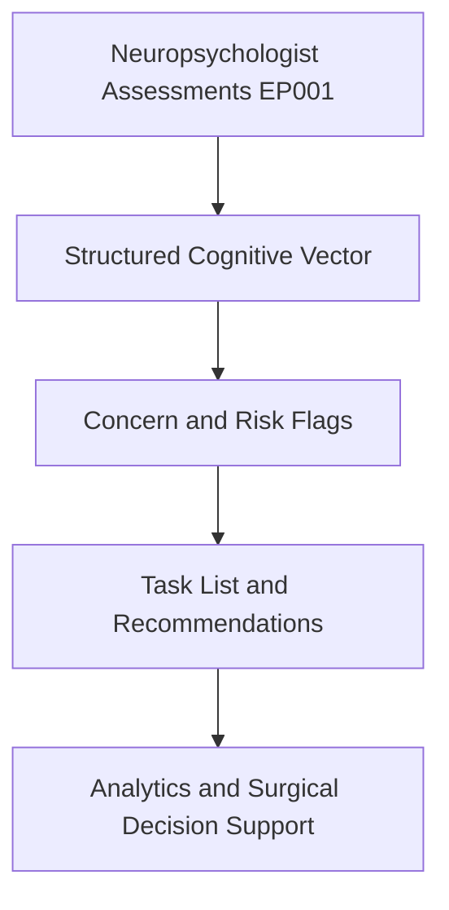
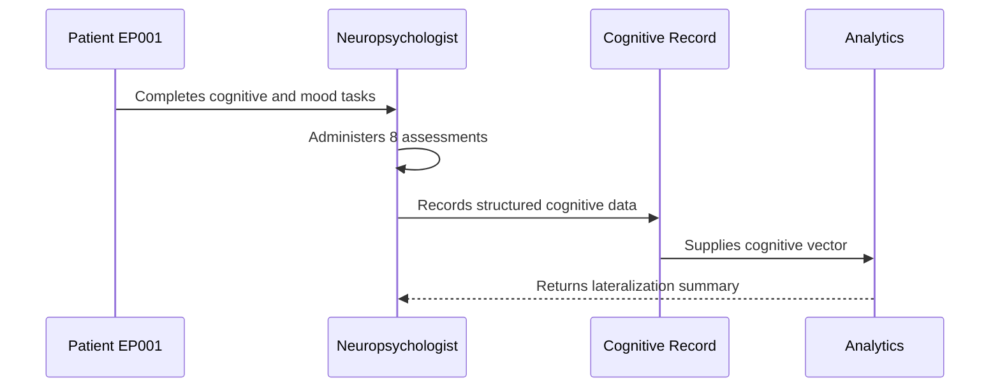
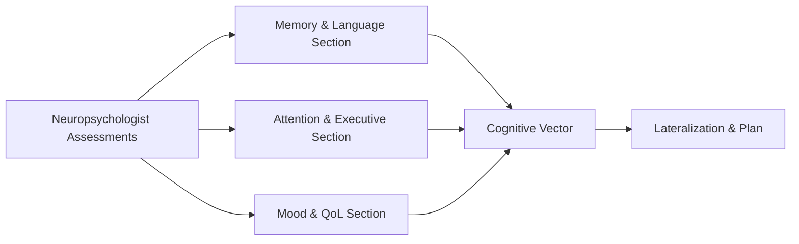
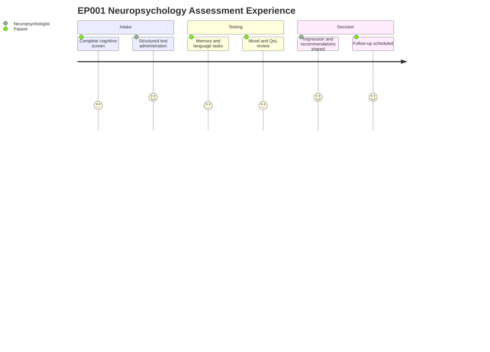

# Role — Neuropsychologist: Assessments, Concerns & Tasks (EP001)

> **Why (this doc):** The neuropsychologist is the owner of cognitive, mood, and quality-of-life
> data for EP001 (29M, focal impaired awareness seizures, left-temporal, right-handed); this doc
> captures what the neuropsychologist assesses, the concerns surfaced, and the resulting task list
> so the cognitive vector feeding downstream analytics and surgical decisions is complete and
> traceable. **How:** Structured assessment tables plus concern and task registers, each preceded
> by a caption and mapped into the pipeline via flow, sequence, linkage, and journey diagrams.

**Role:** Neuropsychologist · **Owns:** Primary (cognitive) data + cognitive/psychosocial formulation

**Problem:** EP001 has left-temporal focal epilepsy with expected verbal-memory and naming
weakness, plus mild mood symptoms and reduced quality of life; fragmented cognitive capture risks
losing the lateralizing signal needed for treatment and surgical decisions.

**Research Objective:** Standardize neuropsychologist-owned assessment capture into a consistent,
machine-readable cognitive vector that supports lateralization, functional-risk estimation, and
epilepsy outcome research.

## Assessments Performed

*Caption - The full slate of neuropsychologist-performed assessments for EP001, from global screen
to integrated impression; this is the primary source of the structured cognitive vector.*

| # | Assessment | Data Captured |
|---|---|---|
| 1 | Global Cognitive Screening | MoCA/MMSE total, domain flags |
| 2 | Verbal & Visual Memory | WMS indices, verbal–visual dissociation |
| 3 | Attention & Processing Speed | Digit span, coding, PSI, vigilance |
| 4 | Executive Function | Trails, Stroop, WCST, fluency |
| 5 | Language & Naming | BNT, cue benefit, comprehension |
| 6 | Mood & Anxiety | NDDI-E, GAD-7, BDI-II |
| 7 | Quality of Life & Psychosocial | QOLIE-31 subscales, roles |
| 8 | Integrated Impression | Lateralized formulation, recommendations |

## Cognitive Concerns (Pain Points) Identified

*Caption - Pain points the neuropsychologist flags from EP001 data; these concerns prioritize the
task list and become risk features in the downstream cognitive model.*

| Concern | Evidence in EP001 |
|---|---|
| Verbal memory weakness | Auditory Memory Index 84; delayed recall low |
| Confrontation naming decline | BNT 48/60 with phonemic-cue benefit |
| Processing-speed slowing | PSI 88; likely ASM + sleep related |
| Mood/anxiety burden | GAD-7 = 9, BDI-II = 17, NDDI-E borderline |
| Reduced quality of life | QOLIE-31 moderately reduced; seizure worry low |

## Task List (Recommended, not prescriptive)

*Caption - The recommended action set derived from the assessments and concerns; it closes the loop
from cognitive data capture to intervention and follow-up.*

| # | Task |
|---|---|
| 1 | Confirm left-temporal cognitive lateralization |
| 2 | Verbal memory compensatory strategy training |
| 3 | Refer for mood/anxiety management |
| 4 | Recommend ASM/sleep review to neurologist |
| 5 | Baseline for pre-surgical cognitive risk |
| 6 | Quality-of-life targeted counselling |
| 7 | Schedule cognitive re-assessment (6–12 months) |

## Pipeline & Flow Diagrams

### Where this data flows in the pipeline

**Reason:** To show that neuropsychologist-owned assessments are the origin of the structured
cognitive record. **Why:** Downstream lateralization and risk analytics are only valid if capture is
complete. **What is happening:** Raw assessments are transformed into a cognitive vector, then into
flags, tasks, and research inputs. **How it is happening:** Each assessment row maps to typed fields
that concatenate into the vector consumed downstream. **Reference:** Baxendale & Thompson (2010);
Topol (2019).

### Role capturing it

**Reason:** To make explicit who captures each cognitive element and in what order. **Why:** Role
clarity prevents gaps and duplicated ownership. **What is happening:** The neuropsychologist
administers tests and writes structured data that analytics consumes. **How it is happening:** Each
interaction commits a record that the next stage reads. **Reference:** Baxendale & Thompson (2010);
APA (2020).

### How it links to other assessment sections and the clinical vector

**Reason:** To position neuropsychologist data relative to sibling assessment sections. **Why:** The
cognitive vector is only meaningful when its component sections interlink. **What is happening:**
Memory, executive, and mood sections feed a shared vector that drives lateralization. **How it is
happening:** Shared patient keys join section outputs into one vector. **Reference:** Baxendale &
Thompson (2010); Topol (2019).

### Patient and role experience for this item

**Reason:** To surface the lived experience behind each captured field. **Why:** Capture quality
depends on patient effort, fatigue, and mood. **What is happening:** The patient performs tasks and
the neuropsychologist tests, integrates, and recommends across the session. **How it is happening:**
Each journey step corresponds to an assessment row being populated. **Reference:** Topol (2019);
APA (2020).

## Professor Readiness (Defense Q&A)

**Q1: Why is the neuropsychologist the owner of cognitive and psychosocial data?**
Because the neuropsychologist administers and interprets the standardized cognitive, mood, and QoL
instruments; concentrating ownership ensures accountability and a single authoritative source for the
cognitive vector that supports lateralization and surgical planning.

**Q2: How do the concerns connect to the task list?**
Each concern is evidence-backed from EP001 data (e.g., BNT 48/60 with phonemic-cue benefit), and each
maps to one or more recommended tasks such as compensatory memory training and pre-surgical risk
baselining.

**Q3: How does neuropsychology corroborate the left-temporal localization?**
Convergent verbal-memory weakness, mild confrontation-naming anomia, and a verbal-below-visual memory
dissociation align with left (dominant) temporal dysfunction, corroborating the neurologist and EEG
lateralization for EP001.

## References

American Psychological Association. (2020). *Publication manual of the American Psychological
Association* (7th ed.). https://doi.org/10.1037/0000165-000

Baxendale, S., & Thompson, P. (2010). Beyond localization: The role of traditional neuropsychological
tests in an age of imaging. *Epilepsia, 51*(11), 2225–2230. https://doi.org/10.1111/j.1528-1167.2010.02710.x

Topol, E. J. (2019). High-performance medicine: The convergence of human and artificial intelligence.
*Nature Medicine, 25*(1), 44–56. https://doi.org/10.1038/s41591-018-0300-7
