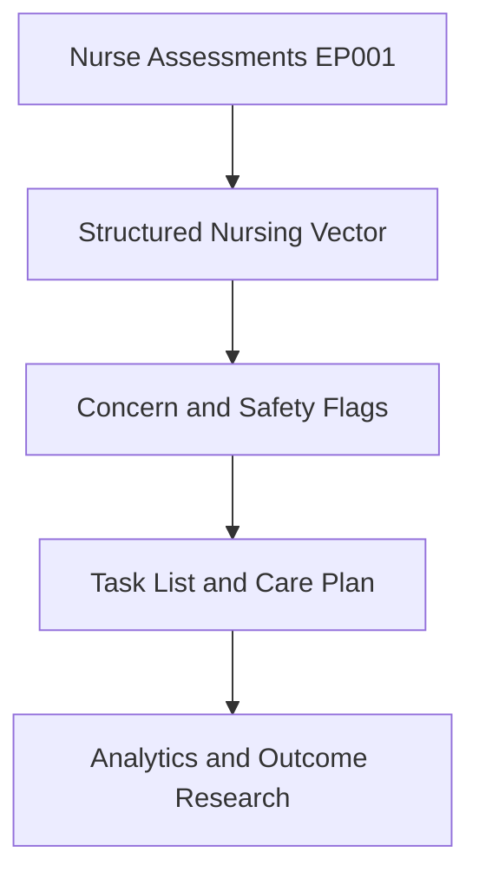
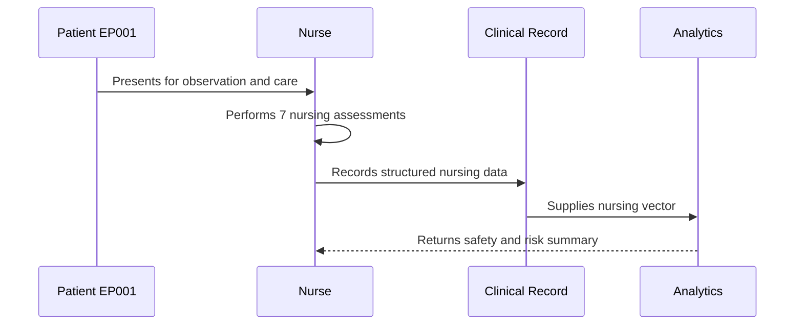
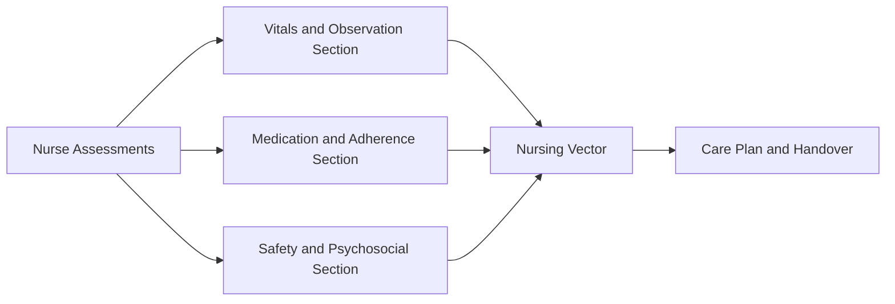
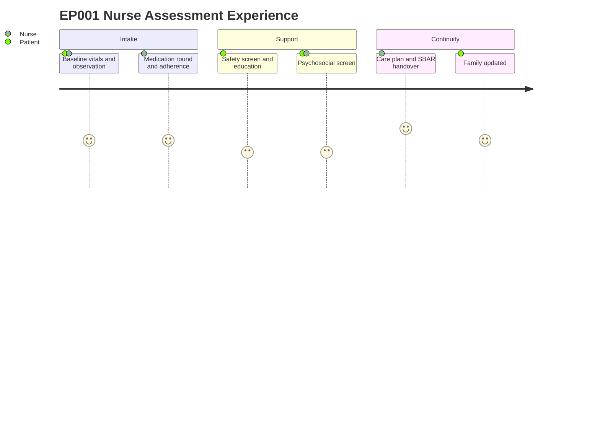

# Role — Nurse: Assessments, Concerns & Tasks (EP001)

> **Why (this doc):** The epilepsy nurse is the primary owner of continuous bedside data and
> patient-safety decisions for EP001 (29M, focal impaired awareness seizures, left-temporal);
> this doc captures what the nurse assesses, the concerns surfaced, and the resulting task
> list so the nursing vector feeding downstream analytics is complete and traceable.
> **How:** Structured assessment tables plus concern and task registers, each preceded by a
> caption and mapped into the pipeline via flow, sequence, linkage, and journey diagrams.

**Role:** Nurse · **Owns:** Primary (nursing) data + bedside safety decisions

**Problem:** EP001 has poorly controlled focal epilepsy (breakthrough seizures despite good
adherence), and fragmented bedside capture risks losing the continuous monitoring, safety, and
self-management signal needed for care decisions and research.

**Research Objective:** Standardize nurse-owned assessment capture into a consistent,
machine-readable nursing vector that supports patient safety, adherence, self-management, and
epilepsy outcome research.

## Assessments Performed

*Caption - The full slate of nurse-performed assessments for EP001, from baseline vitals to
shift handover; this is the primary source of the structured nursing vector.*

| # | Assessment | Data Captured |
|---|---|---|
| 1 | Vital Signs & Baseline | BP, HR, Temp, SpO2, RR, NEWS2, glucose |
| 2 | Seizure Observation Chart | Type, duration, semiology, peri-ictal SpO2 |
| 3 | Medication Administration | ASM doses, adherence, serum level, side effects |
| 4 | Injury & Safety Screen | Falls, tongue-bite, incontinence, Morse score |
| 5 | Patient Education | First-aid, triggers, adherence, teach-back |
| 6 | Psychosocial Support Screen | PHQ-2, GAD-2, coping, stigma, support |
| 7 | Care Plan & Handover | SBAR, precautions, escalation, tasks |

## Clinical Concerns (Pain Points) Identified

*Caption - Pain points the nurse flags from EP001 data; these concerns prioritize the task
list and become risk features in the downstream clinical model.*

| Concern | Evidence in EP001 |
|---|---|
| Peri-ictal hypoxia risk | Observed SpO2 dropped to 93% during seizure |
| Non-adherence contribution | 7 missed doses / 88% adherence, shift-work barrier |
| Injury and falls risk | 1 fall, moderate injury, Morse 45 |
| Sleep deficit as trigger | 5.2 hrs/day, worry-driven, Trigger Burden 4 |
| Psychosocial strain | Mild low mood/anxiety, driving loss, stigma |

## Task List (Recommended, not prescriptive)

*Caption - The recommended action set derived from the assessments and concerns; it closes the
loop from bedside data capture to nursing action and handover.*

| # | Task |
|---|---|
| 1 | Maintain 15-min checks and overnight SpO2 monitoring |
| 2 | Reconcile ASM doses and reinforce adherence aids |
| 3 | Apply seizure precautions and falls measures |
| 4 | Deliver sleep-hygiene and first-aid education |
| 5 | Complete psychosocial screen and offer referral |
| 6 | Update SBAR care plan and hand over safely |
| 7 | Escalate to neurologist on cluster/status/NEWS2 >= 3 |

## Pipeline & Flow Diagrams

### Where this data flows in the pipeline

**Reason:** To show that nurse-owned assessments are the origin of the continuous nursing
record. **Why:** Downstream safety flags and analytics are only valid if bedside capture is
complete. **What is happening:** Raw assessments are transformed into a nursing vector, then
into flags, tasks, and research inputs. **How it is happening:** Each assessment row maps to
typed fields that concatenate into the vector consumed downstream. **Reference:** Fisher et
al. (2017); Topol (2019).

### Role capturing it

**Reason:** To make explicit who captures each data element and in what order. **Why:** Role
clarity prevents gaps and duplicated ownership between nurse and neurologist. **What is
happening:** The nurse observes, screens, administers, and writes structured data that analytics
consumes. **How it is happening:** Each interaction commits a record that the next stage reads.
**Reference:** Fisher et al. (2017); APA (2020).

### How it links to other assessment sections and the clinical vector

**Reason:** To position nurse data relative to sibling assessment sections. **Why:** The nursing
vector is only meaningful when its component sections interlink. **What is happening:** Vitals,
medication, and safety sections feed a shared vector that drives the care plan. **How it is
happening:** Shared patient keys join section outputs into one vector. **Reference:** Fisher et
al. (2017); Topol (2019).

### Patient and role experience for this item

**Reason:** To surface the lived experience behind each captured field. **Why:** Capture quality
depends on patient cooperation and nursing workload across shifts. **What is happening:** The
patient is observed and supported while the nurse assesses, educates, and hands over. **How it
is happening:** Each journey step corresponds to a nursing assessment row being populated.
**Reference:** Topol (2019); APA (2020).

## Professor Readiness (Defense Q&A)

**Q1: Why is the nurse the owner of continuous bedside and safety data?**
Because the nurse provides round-the-clock observation, medication administration, and safety
measures; concentrating ownership ensures accountability and a single authoritative source for
the continuous nursing vector that complements the neurologist's episodic clinical vector.

**Q2: How do the concerns connect to the task list?**
Each concern is evidence-backed from EP001 data (e.g., peri-ictal SpO2 of 93%, 7 missed doses),
and each maps to one or more recommended tasks such as overnight SpO2 monitoring and adherence
reinforcement.

**Q3: How does nursing capture complement the neurologist's assessment?**
The neurologist captures episodic diagnostic history, while the nurse captures continuous
witnessed events, real-time vitals, adherence verification, and self-management readiness,
together forming a complete, corroborated record for EP001.

## References

American Psychological Association. (2020). *Publication manual of the American Psychological
Association* (7th ed.). https://doi.org/10.1037/0000165-000

Fisher, R. S., Cross, J. H., French, J. A., Higurashi, N., Hirsch, E., Jansen, F. E., Lagae,
L., Moshé, S. L., Peltola, J., Roulet Perez, E., Scheffer, I. E., & Zuberi, S. M. (2017).
Operational classification of seizure types by the International League Against Epilepsy:
Position paper of the ILAE Commission for Classification and Terminology. *Epilepsia, 58*(4),
522–530. https://doi.org/10.1111/epi.13670

Topol, E. J. (2019). High-performance medicine: The convergence of human and artificial
intelligence. *Nature Medicine, 25*(1), 44–56. https://doi.org/10.1038/s41591-018-0300-7
