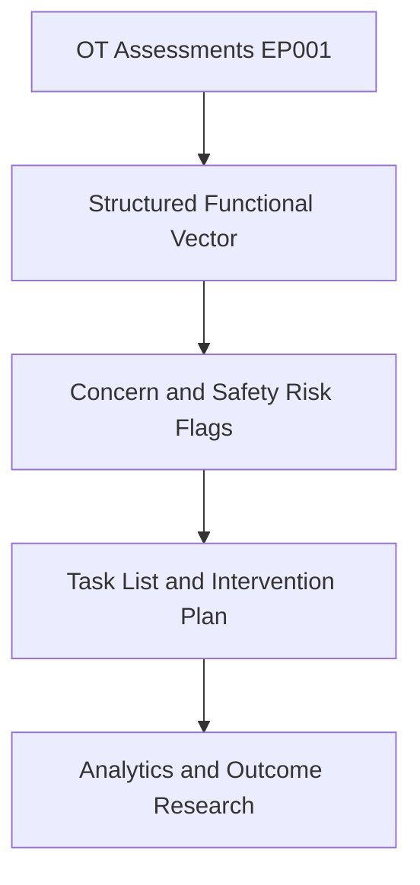
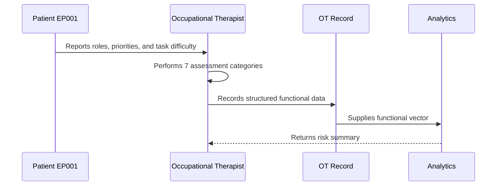
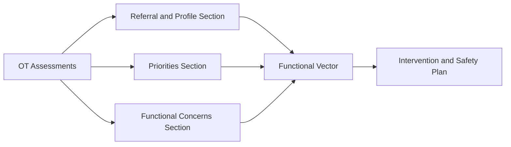
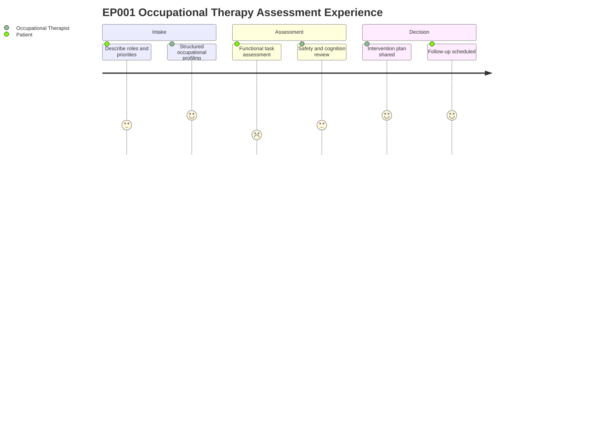

# Role — Occupational Therapist: Assessments, Concerns & Tasks (EP001)

> **Why (this doc):** The occupational therapist is the primary owner of functional data for
> EP001 (29M, focal impaired awareness seizures, left-temporal); this doc captures what the OT
> assesses, the functional and safety concerns surfaced, and the resulting task list so the
> functional vector feeding downstream analytics is complete and traceable.
> **How:** Structured assessment tables plus concern and task registers, each preceded by a
> caption and mapped into the pipeline via flow, sequence, linkage, and journey diagrams.

**Role:** Occupational Therapist · **Owns:** Primary (functional) data + client-centred goals

**Problem:** EP001 has poorly controlled focal epilepsy (breakthrough seizures despite good
adherence) and is on medical leave with assistance needed for meal preparation; fragmented
functional capture risks losing the signal needed for safety and independence planning.

**Research Objective:** Standardize occupational-therapist-owned assessment capture into a
consistent, machine-readable functional vector that supports safety, independence, and
epilepsy outcome research.

## Assessments Performed

*Caption - The full slate of occupational-therapist-performed assessments for EP001, from
referral to home-environment review; this is the primary source of the structured functional
vector.*

| # | Category | Assessment | Data Captured |
|---|---|---|---|
| A | Referral Information | Referral intake | Source, reason, diagnosis, urgency, signature |
| B | Occupational Profile | Roles and routines | Living arrangement, employment, roles, routine, participation |
| C | Patient Priorities | Client-centred goals | Ranked priorities across life domains |
| D | Functional Concerns | ADL/IADL difficulty | Dressing, cooking, shopping, medications, task completion |
| E | Safety Assessment | Home and task safety | Seizure-related hazards, burn/fall risk, supervision needs |
| F | Cognitive-Functional Screen | Functional cognition | Memory, attention, task sequencing post-ictal |
| G | Intervention Plan | Goal-directed plan | Adaptations, energy conservation, return-to-work planning |

## Clinical Concerns (Pain Points) Identified

*Caption - Pain points the occupational therapist flags from EP001 data; these concerns
prioritize the task list and become risk features in the downstream functional model.*

| Concern | Evidence in EP001 |
|---|---|
| Reduced occupational participation | On medical leave; ~80% occupational impact |
| Meal-preparation safety risk | Requires assistance cooking (burn/seizure risk at stove) |
| Community participation limited by fear | Outings curtailed by seizure fear |
| Shopping dependence | Requires assistance (fatigue, crowds, transport) |
| Return-to-work barrier | Valued worker role interrupted; top patient priority |

## Task List (Recommended, not prescriptive)

*Caption - The recommended action set derived from the assessments and concerns; it closes
the loop from data capture to functional intervention and follow-up.*

| # | Task |
|---|---|
| 1 | Complete kitchen safety and meal-preparation assessment |
| 2 | Provide seizure-safe cooking adaptations |
| 3 | Arrange supported shopping / transport strategy |
| 4 | Energy-conservation and fatigue-management plan |
| 5 | Graded return-to-work planning with employer liaison |
| 6 | Community re-engagement plan addressing seizure fear |
| 7 | Schedule OT follow-up (4-6 weeks) |

## Occupational Participation Map

*Caption - Current versus desired participation for EP001 across life domains, with priority
and OT focus; this map turns the profile and priorities into a targeted intervention frame.*

| Life Domain | Current Participation | Desired Participation | Priority | OT Focus |
|---|---|---|---|---|
| Self-care | Independent, minor difficulty | Fully independent, confident | Medium | Seizure-safe ADL routines |
| Household Management | Assistance for cooking | Safe independent meal preparation | High | Kitchen safety adaptations |
| Employment | On medical leave | Graded return to work | High | Return-to-work planning |
| Community Participation | Curtailed by seizure fear | Regular outings with confidence | Medium | Fear-management, transport strategy |
| Leisure | Maintained with spouse | Broadened leisure engagement | Low | Activity grading and pacing |

## Smart Logic

*Caption - Conditional rules the OT record applies to EP001 data so capture drives the right
flags and follow-up automatically.*

| Condition | Logic / Action |
|---|---|
| Referral source is Psychiatrist | Translate to Neurologist (epilepsy-only scope) |
| Requires assistance in any IADL | Raise Safety Risk flag and add safety-assessment task |
| Employment = medical leave | Trigger return-to-work planning track |
| Community participation limited by fear | Add fear-management intervention |
| Functional Concern Score >= 60 | Escalate OT episode to Priority intensity |
| Seizures ~every 5 min (status) | Escalate to Urgent; supervised inpatient ADL only |

## AI-Derived Variables

*Caption - Variables computed from the OT capture for EP001; each summarizes raw functional
data into a machine-readable index for the downstream model.*

| Variable | Derivation | EP001 Value |
|---|---|---|
| Occupational Participation Index | Weighted participation across domains | 40/100 (reduced) |
| Functional Concern Index | Aggregated ADL/IADL difficulty | 62/100 (moderate-high) |
| Occupational Impact Score | Estimated epilepsy impact on occupations | ~80% |
| Safety Risk Index | Task-level seizure hazard aggregation | High (cooking, shopping) |
| Patient Priority Profile | Ranked client-centred goals | Return to Work, Independence, Safer Meal Prep |
| Baseline Functional Independence | Independent domains vs assisted | Independent except 2 IADL |
| Referral Complexity Score | Urgency + diagnosis + concern load | Priority (moderate-high) |
| OT Assessment Readiness | Completeness of captured functional data | Ready (all categories captured) |

## Pipeline & Flow Diagrams

### Where this data flows in the pipeline

**Reason:** To show that OT-owned assessments are the origin of the structured functional
record. **Why:** Downstream safety flags and analytics are only valid if capture is complete.
**What is happening:** Raw assessments are transformed into a functional vector, then into
flags, tasks, and research inputs. **How it is happening:** Each assessment row maps to typed
fields that concatenate into the vector consumed downstream. **Reference:** American
Occupational Therapy Association (2020); Topol (2019).

### Role capturing it

**Reason:** To make explicit who captures each data element and in what order. **Why:** Role
clarity prevents gaps and duplicated ownership. **What is happening:** The occupational
therapist elicits the profile, assesses function, and writes structured data that analytics
consumes. **How it is happening:** Each interaction commits a record that the next stage reads.
**Reference:** American Occupational Therapy Association (2020); APA (2020).

### How it links to other assessment sections and the functional vector

**Reason:** To position OT data relative to sibling assessment sections. **Why:** The
functional vector is only meaningful when its component sections interlink. **What is
happening:** Referral, priorities, and functional sections feed a shared vector that drives the
plan. **How it is happening:** Shared patient keys join section outputs into one vector.
**Reference:** American Occupational Therapy Association (2020); Topol (2019).

### Patient and role experience for this item

**Reason:** To surface the lived experience behind each captured field. **Why:** Capture
quality depends on patient effort and seizure-related fear. **What is happening:** The patient
reports and demonstrates while the occupational therapist profiles, assesses, and plans across
a single episode. **How it is happening:** Each journey step corresponds to an assessment row
being populated. **Reference:** Topol (2019); APA (2020).

## Professor Readiness (Defense Q&A)

**Q1: Why is the occupational therapist the owner of primary functional data?**
Because the OT performs the functional and safety assessments and sets client-centred goals;
concentrating ownership ensures accountability and a single authoritative source for the
functional vector.

**Q2: How do the concerns connect to the task list?**
Each concern is evidence-backed from EP001 data (e.g., requires assistance cooking due to
burn/seizure risk), and each maps to one or more recommended tasks such as a kitchen safety
assessment and seizure-safe cooking adaptations.

**Q3: How does OT capture stay within the epilepsy-only scope?**
Any non-epilepsy referral structure (e.g., a psychiatrist source) is translated to the
Neurologist within the epilepsy record, and all functional variables are framed against the
seizure classification supplied by the neurologist.

## References

American Occupational Therapy Association. (2020). *Occupational therapy practice framework:
Domain and process* (4th ed.). *American Journal of Occupational Therapy, 74*(Suppl. 2),
7412410010. https://doi.org/10.5014/ajot.2020.74S2001

American Psychological Association. (2020). *Publication manual of the American Psychological
Association* (7th ed.). https://doi.org/10.1037/0000165-000

Fisher, R. S., Cross, J. H., French, J. A., Higurashi, N., Hirsch, E., Jansen, F. E., Lagae,
L., Moshé, S. L., Peltola, J., Roulet Perez, E., Scheffer, I. E., & Zuberi, S. M. (2017).
Operational classification of seizure types by the International League Against Epilepsy:
Position paper of the ILAE Commission for Classification and Terminology. *Epilepsia, 58*(4),
522–530. https://doi.org/10.1111/epi.13670

Topol, E. J. (2019). High-performance medicine: The convergence of human and artificial
intelligence. *Nature Medicine, 25*(1), 44–56. https://doi.org/10.1038/s41591-018-0300-7
