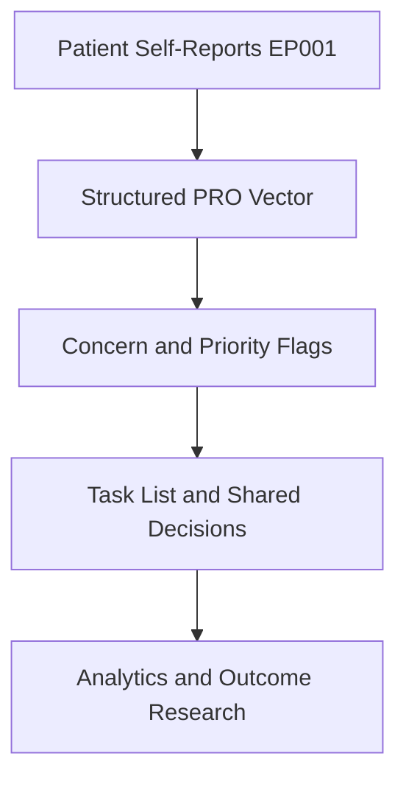
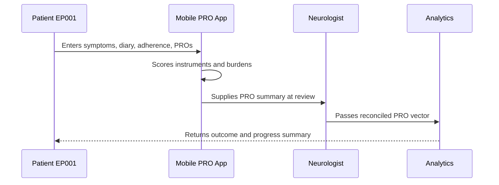
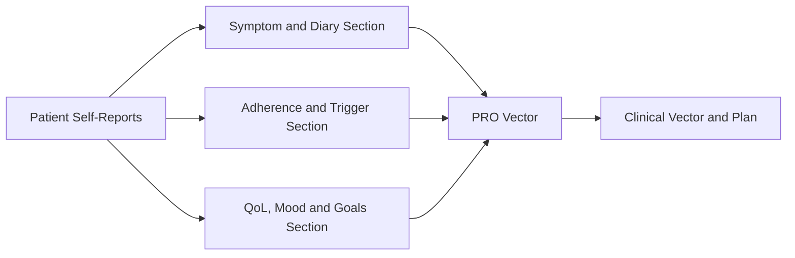
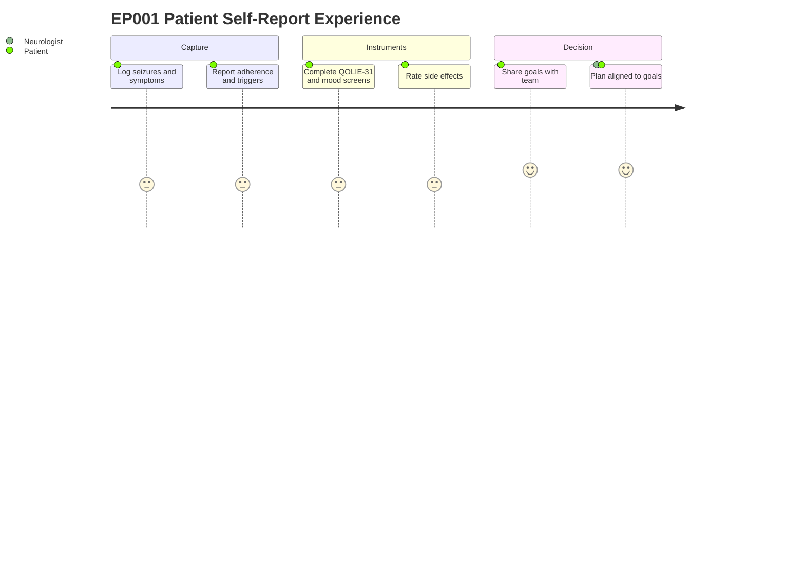

# Role — Patient: Self-Reports, Concerns & Tasks (EP001)

> **Why (this doc):** The patient is the primary owner of patient-reported-outcome (PRO) data
> for EP001 (29M, focal impaired awareness seizures, left-temporal, software engineer,
> married, right-handed); this doc captures what EP001 self-reports, the concerns he
> surfaces, and the resulting task list so the PRO vector feeding downstream analytics is
> complete and traceable. **How:** Structured self-report tables plus concern and task
> registers, each preceded by a caption and mapped into the pipeline via flow, sequence,
> linkage, and journey diagrams.

**Role:** Patient · **Owns:** Primary (patient-reported outcome) data + lived experience

**Problem:** EP001 has breakthrough focal seizures despite an adequate prescribed regimen, and
without structured self-report the subjective signal — auras, adherence behaviour, side
effects, mood, and personal goals — is lost to the clinical record.

**Research Objective:** Standardize patient-owned self-report capture into a consistent,
machine-readable PRO vector that complements the clinical vector and supports
patient-centred treatment optimization and epilepsy outcome research.

## Self-Reports Provided

*Caption - The full slate of patient-provided self-reports for EP001, from symptom experience
to personal goals; this is the primary source of the structured PRO vector.*

| # | Self-Report | Data Captured |
|---|---|---|
| 1 | Symptom Self-Report | Aura, awareness, warning time, post-ictal state |
| 2 | Seizure Diary (Self) | Event count, timing, nocturnal share, logging adherence |
| 3 | Adherence Self-Report | Self-estimated adherence, missed dose, barriers |
| 4 | Trigger & Lifestyle | Sleep, stress, alcohol, missed dose, trigger burden |
| 5 | Side-Effect Self-Report | LAEP-style dizziness, fatigue, irritability, burden |
| 6 | Quality of Life | QOLIE-31 subscales and total score |
| 7 | Mood & Anxiety | NDDI-E, GAD-7 scores and cutoffs |
| 8 | Goals & Concerns | Driving goal, work concerns, definition of success |

## Personal Concerns (Pain Points) Identified

*Caption - Pain points EP001 flags from his own experience; these concerns prioritize the
task list and become patient-centred outcome features in the downstream PRO model.*

| Concern | Evidence in EP001 Self-Report |
|---|---|
| Loss of driving independence | Top goal; affects job and confidence |
| Breakthrough seizures | ~5/month logged despite 88% self-adherence |
| Poor sleep as trigger | 5.2 hrs/night, poor quality, trigger burden High |
| ASM side-effect burden | Moderate; dizziness and fatigue bother him most |
| Anxiety about next seizure | GAD-7 = 9; seizure worry at work |
| Evening-dose adherence gap | Misses evening dose when busy at work |

## Task List (Patient-Facing, not prescriptive)

*Caption - The recommended self-management action set derived from the self-reports and
concerns; it closes the loop from lived experience to shared decision-making.*

| # | Task |
|---|---|
| 1 | Keep logging every seizure in the diary app |
| 2 | Improve evening-dose adherence (reminder + routine) |
| 3 | Target sleep to 7+ hours; reduce late screen time |
| 4 | Track and report side effects each week |
| 5 | Complete QOLIE-31, NDDI-E, GAD-7 at review intervals |
| 6 | Discuss driving pathway and work concerns with team |
| 7 | Review shared goals at 3-month follow-up |

## Pipeline & Flow Diagrams

### Where this data flows in the pipeline

**Reason:** To show that patient-owned self-reports are the origin of the structured PRO
record. **Why:** Downstream patient-centred flags and analytics are only valid if self-report
capture is complete. **What is happening:** Raw self-reports are transformed into a PRO vector,
then into flags, tasks, and research inputs. **How it is happening:** Each self-report row maps
to typed fields that concatenate into the vector consumed downstream. **Reference:** Cramer et
al. (1998); Topol (2019).

### Role capturing it

**Reason:** To make explicit who captures each PRO element and in what order. **Why:** Role
clarity prevents gaps and misattributed provenance. **What is happening:** The patient
self-reports, the app scores, and the neurologist reconciles data that analytics consumes.
**How it is happening:** Each interaction commits a record that the next stage reads.
**Reference:** Fisher et al. (2017); APA (2020).

### How it links to other assessment sections and the clinical vector

**Reason:** To position patient data relative to sibling self-report sections and the clinical
vector. **Why:** The PRO vector is only meaningful when its component sections interlink and
reconcile with clinical data. **What is happening:** Symptom, adherence, and QoL sections feed a
shared PRO vector that joins the clinical vector for planning. **How it is happening:** Shared
patient keys join section outputs into one vector. **Reference:** Cramer et al. (1998); Topol
(2019).

### Patient and role experience for this item

**Reason:** To surface the lived experience behind each self-reported field. **Why:** Capture
quality depends on patient effort, post-ictal state, and daily logging burden. **What is
happening:** EP001 reports symptoms, behaviour, and priorities across daily use and clinic
review. **How it is happening:** Each journey step corresponds to a self-report row being
populated. **Reference:** Topol (2019); APA (2020).

## Professor Readiness (Defense Q&A)

**Q1: Why is the patient the owner of primary PRO data?**
Because subjective experience — auras, felt side effects, mood, adherence behaviour, and
personal goals — is only fully accessible to the person living with the seizures;
concentrating this ownership with the patient ensures an authoritative source for the PRO
vector.

**Q2: How do the concerns connect to the task list?**
Each concern is evidence-backed from EP001's self-reports (e.g., breakthrough seizures despite
88% self-adherence, GAD-7 of 9), and each maps to one or more self-management tasks such as
improving evening-dose adherence and targeting sleep.

**Q3: How does the PRO vector relate to the clinical vector?**
The PRO vector complements and reconciles with the neurologist's clinical vector through shared
patient identifiers, so subjective outcomes (QOLIE-31, mood, tolerability) are interpreted
alongside objective findings for a complete, patient-centred picture.

## References

American Psychological Association. (2020). *Publication manual of the American Psychological
Association* (7th ed.). https://doi.org/10.1037/0000165-000

Fisher, R. S., Cross, J. H., French, J. A., Higurashi, N., Hirsch, E., Jansen, F. E., Lagae,
L., Moshé, S. L., Peltola, J., Roulet Perez, E., Scheffer, I. E., & Zuberi, S. M. (2017).
Operational classification of seizure types by the International League Against Epilepsy:
Position paper of the ILAE Commission for Classification and Terminology. *Epilepsia, 58*(4),
522–530. https://doi.org/10.1111/epi.13670

Cramer, J. A., Perrine, K., Devinsky, O., Bryant-Comstock, L., Meador, K., & Hermann, B.
(1998). Development and cross-cultural translations of a 31-item quality of life in epilepsy
inventory (QOLIE-31). *Epilepsia, 39*(1), 81–88.
https://doi.org/10.1111/j.1528-1157.1998.tb01278.x
