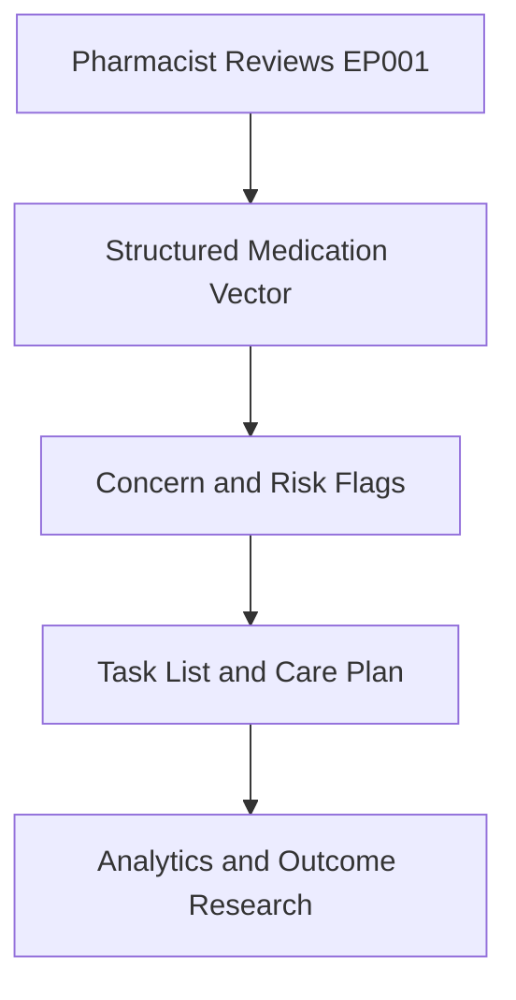
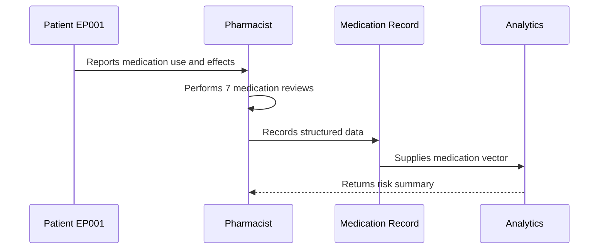
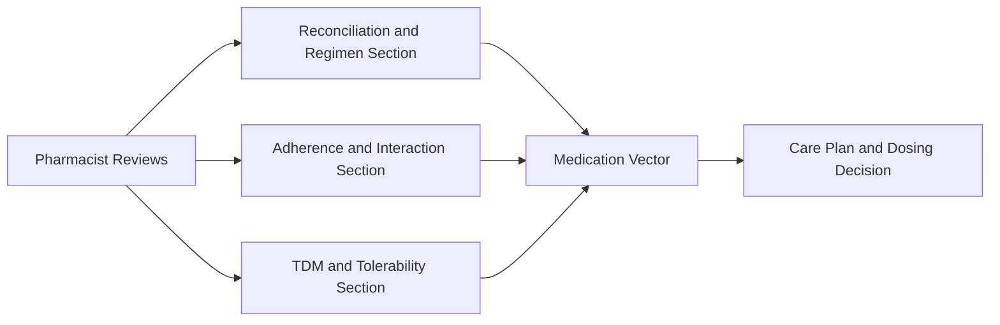
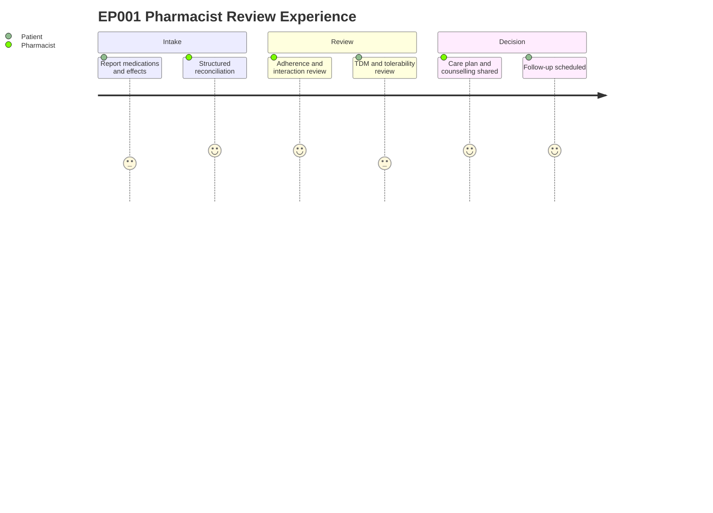

# Role — Pharmacist: Assessments, Concerns & Tasks (EP001)

> **Why (this doc):** The clinical pharmacist is the primary owner of medication data and
> pharmaceutical care decisions for EP001 (29M, focal impaired awareness seizures,
> left-temporal, on CBZ + LEV); this doc captures what the pharmacist reviews, the concerns
> surfaced, and the resulting task list so the medication vector feeding downstream analytics
> is complete and traceable. **How:** Structured review tables plus concern and task
> registers, each preceded by a caption and mapped into the pipeline via flow, sequence,
> linkage, and journey diagrams.

**Role:** Pharmacist · **Owns:** Primary (medication) data + pharmaceutical care decisions

**Problem:** EP001 has breakthrough focal seizures (~5/month) despite 88% adherence on
carbamazepine + levetiracetam, and fragmented medication capture risks losing the signal
needed to distinguish underdosing, nonadherence, and enzyme-induction effects.

**Research Objective:** Standardize pharmacist-owned medication capture into a consistent,
machine-readable medication vector that supports dose optimization, interaction safety, and
epilepsy outcome research.

## Assessments Performed

*Caption - The full slate of pharmacist-performed reviews for EP001, from medication
reconciliation to the pharmaceutical care plan; this is the primary source of the structured
medication vector.*

| # | Assessment | Data Captured |
|---|---|---|
| 1 | Medication Reconciliation | Sources, ASMs, OTC, allergies, discrepancies |
| 2 | ASM Regimen Review | Dose, mechanism, enzyme status, dose adequacy |
| 3 | Adherence Assessment | Pill count, MPR, self-report, barriers |
| 4 | Drug Interaction Screen | CYP450 induction, severity grading |
| 5 | Adverse Effect Review | Dizziness, diplopia, hyponatremia, mood |
| 6 | Therapeutic Drug Monitoring | CBZ/LEV serum levels, reference ranges |
| 7 | Counselling & Care Plan | Counselling, dosing action, monitoring, follow-up |

## Clinical Concerns (Pain Points) Identified

*Caption - Pain points the pharmacist flags from EP001 data; these concerns prioritize the
task list and become risk features in the downstream medication model.*

| Concern | Evidence in EP001 |
|---|---|
| Suboptimal control on current regimen | Breakthrough seizures despite CBZ + LEV |
| Borderline adherence | MPR 0.88, variable evening CBZ dose |
| Underdosing / titration headroom | Both ASMs low-therapeutic; LEV below ceiling |
| Enzyme-induction risk | CBZ strong CYP3A4 auto-inducer, low trough 6.2 mg/L |
| Tolerability monitoring | CBZ dizziness/diplopia/hyponatremia; LEV irritability |

## Task List (Recommended, not prescriptive)

*Caption - The recommended action set derived from the reviews and concerns; it closes the
loop from medication capture to pharmaceutical care decision and follow-up.*

| # | Task |
|---|---|
| 1 | Reconcile full medication list and resolve discrepancies |
| 2 | Recommend LEV titration to prescriber |
| 3 | Counsel on evening CBZ dose timing and reminders |
| 4 | Repeat trough TDM and serum sodium at 4–6 weeks |
| 5 | Document CBZ inducer status for future co-prescribing |
| 6 | Address sleep as modifiable seizure trigger |
| 7 | Pharmacist follow-up review in 4 weeks |

## Pipeline & Flow Diagrams

### Where this data flows in the pipeline

**Reason:** To show that pharmacist-owned reviews are the origin of the structured medication
record. **Why:** Downstream dose and safety decisions are only valid if capture is complete.
**What is happening:** Raw reviews are transformed into a medication vector, then into flags,
tasks, and research inputs. **How it is happening:** Each review row maps to typed fields that
concatenate into the vector consumed downstream. **Reference:** Patsalos (2013); Topol (2019).

### Role capturing it

**Reason:** To make explicit who captures each medication element and in what order. **Why:**
Role clarity prevents gaps and duplicated ownership. **What is happening:** The pharmacist
elicits medication use, performs reviews, and writes structured data that analytics consumes.
**How it is happening:** Each interaction commits a record that the next stage reads.
**Reference:** Fisher et al. (2017); APA (2020).

### How it links to other assessment sections and the clinical vector

**Reason:** To position pharmacist data relative to sibling review sections. **Why:** The
medication vector is only meaningful when its component sections interlink. **What is
happening:** Reconciliation, adherence, and TDM sections feed a shared vector that drives the
care plan. **How it is happening:** Shared patient keys join section outputs into one vector.
**Reference:** Patsalos (2013); Topol (2019).

### Patient and role experience for this item

**Reason:** To surface the lived experience behind each captured field. **Why:** Capture
quality depends on patient disclosure and pharmacist workload. **What is happening:** The
patient reports and the pharmacist reviews, interprets, and plans across a single visit.
**How it is happening:** Each journey step corresponds to a review row being populated.
**Reference:** Topol (2019); APA (2020).

## Professor Readiness (Defense Q&A)

**Q1: Why is the pharmacist the owner of primary medication data?**
Because the pharmacist performs reconciliation, interaction screening, and TDM interpretation
and makes the pharmaceutical care decisions; concentrating ownership ensures accountability
and a single authoritative source for the medication vector.

**Q2: How do the concerns connect to the task list?**
Each concern is evidence-backed from EP001 data (e.g., low-therapeutic CBZ trough of 6.2 mg/L
with borderline MPR 0.88), and each maps to one or more recommended tasks such as LEV
titration, dose-timing counselling, and repeat TDM.

**Q3: How does the pharmacist explain breakthrough seizures despite adherence?**
By distinguishing three interacting causes — borderline adherence (missed evening doses),
underdosing (both ASMs low-therapeutic with headroom), and CBZ auto-induction lowering its own
level — which together explain persistent seizures without invoking regimen failure.

## References

American Psychological Association. (2020). *Publication manual of the American Psychological
Association* (7th ed.). https://doi.org/10.1037/0000165-000

Fisher, R. S., Cross, J. H., French, J. A., Higurashi, N., Hirsch, E., Jansen, F. E., Lagae,
L., Moshé, S. L., Peltola, J., Roulet Perez, E., Scheffer, I. E., & Zuberi, S. M. (2017).
Operational classification of seizure types by the International League Against Epilepsy:
Position paper of the ILAE Commission for Classification and Terminology. *Epilepsia, 58*(4),
522–530. https://doi.org/10.1111/epi.13670

Patsalos, P. N. (2013). *Antiepileptic drug interactions: A clinical guide* (2nd ed.).
Springer. https://doi.org/10.1007/978-1-4471-2434-4
