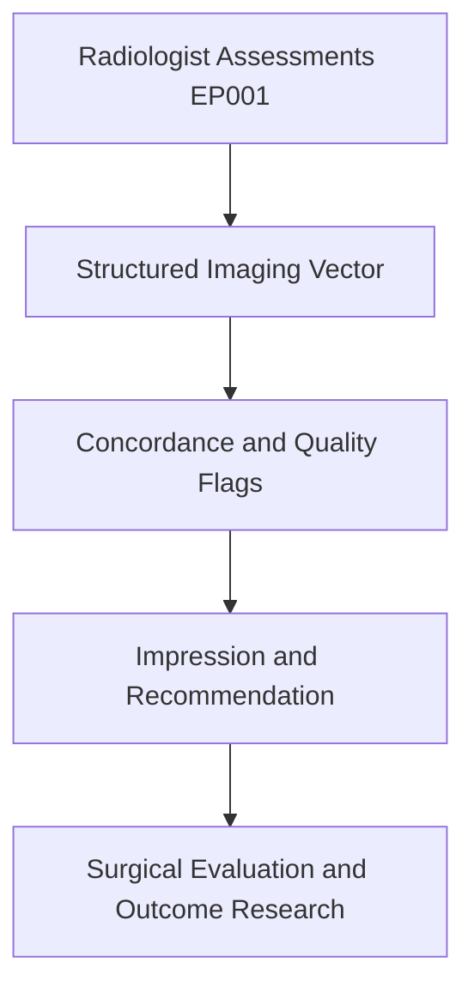
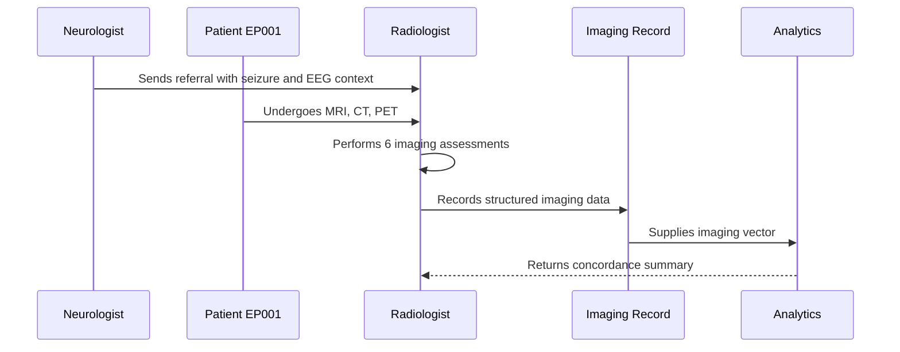
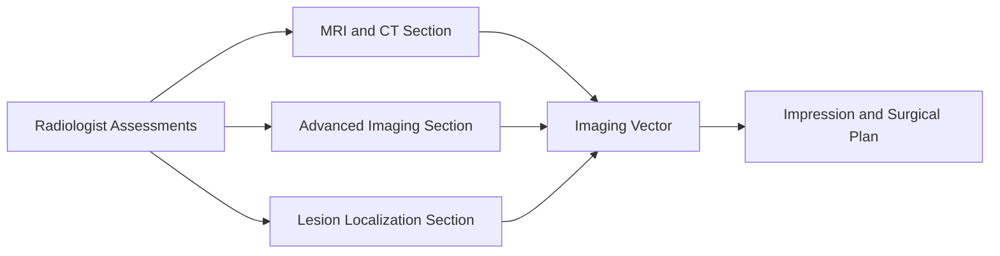
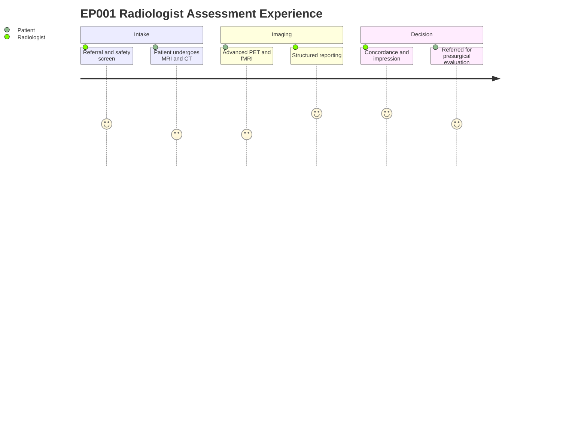

# Role — Radiologist: Assessments, Concerns & Tasks (EP001)

> **Why (this doc):** The radiologist is the owner of secondary imaging data for EP001 (29M,
> focal impaired-awareness seizures, left-temporal); this doc captures what the radiologist
> assesses, the concerns surfaced, and the resulting task list so the imaging vector feeding
> localization and surgical evaluation is complete and traceable.
> **How:** Structured assessment tables plus concern and task registers, each preceded by a
> caption and mapped into the pipeline via flow, sequence, linkage, and journey diagrams.

**Role:** Radiologist · **Owns:** Secondary (imaging) data + imaging conclusions

**Problem:** EP001 has drug-resistant focal epilepsy with a subtle structural cause;
incomplete or non-epilepsy-protocol imaging risks missing the mesial temporal sclerosis that
drives the surgical decision.

**Research Objective:** Standardize radiologist-owned imaging capture into a consistent,
machine-readable imaging vector that supports lesion localization, concordance analysis, and
epilepsy surgical-evaluation research.

## Assessments Performed

*Caption - The full slate of radiologist-performed imaging assessments for EP001, from
referral to final impression; this is the primary source of the structured imaging vector.*

| # | Assessment | Data Captured |
|---|---|---|
| 1 | Imaging Referral & Indication | Referral source, clinical question, protocol, urgency |
| 2 | MRI Brain Protocol & Findings | Field strength, sequences, hippocampal signal, MTS query |
| 3 | CT Brain Findings | Acute pathology exclusion, hemorrhage, mass, normal read |
| 4 | Advanced Imaging (PET/SPECT/fMRI/MEG) | Hypometabolism, concordance, language/memory mapping |
| 5 | Lesion → Epileptogenic-Zone Concordance | Lesion, EEG focus, semiology, concordance, confidence |
| 6 | Radiology Impression & Recommendation | Impression, differential, surgical candidacy, referral |

## Clinical Concerns (Pain Points) Identified

*Caption - Pain points the radiologist flags from EP001 imaging and workflow; these concerns
prioritize the task list and become quality/risk features in the downstream imaging model.*

| Concern | Evidence in EP001 |
|---|---|
| Incomplete / low-field MRI missing MTS | Subtle left hippocampal signal needs 3T epilepsy protocol |
| Non-epilepsy-protocol scans | Routine axial imaging under-samples the hippocampi |
| Discordant imaging vs EEG | Concordance must be verified against left temporal EEG focus |
| Incidental findings | Non-target findings can distract from the epileptogenic lesion |
| Report turnaround | Delayed finalization slows presurgical referral |
| Lack of prior-scan comparison | No baseline MRI limits stable-vs-progressive judgment |

## Task List (Recommended, not prescriptive)

*Caption - The recommended action set derived from the assessments and concerns; it closes the
loop from imaging capture to surgical-evaluation referral.*

| # | Task |
|---|---|
| 1 | Apply dedicated 3T epilepsy MRI protocol with oblique-coronal hippocampal sequences |
| 2 | Confirm CT exclusion of acute pathology |
| 3 | Correlate MRI lesion with left temporal EEG focus |
| 4 | Obtain FDG-PET to confirm hypometabolic concordance |
| 5 | Assess language/memory mapping for surgical risk |
| 6 | Formalize lesion-to-epileptogenic-zone concordance |
| 7 | Finalize impression and refer for presurgical evaluation |

## Pipeline & Flow Diagrams

### Where this data flows in the pipeline

**Reason:** To show that radiologist-owned imaging is the origin of the structured imaging
record. **Why:** Downstream localization and surgical decisions are only valid if imaging
capture is complete and protocolled. **What is happening:** Raw scans are transformed into an
imaging vector, then into concordance flags, an impression, and research inputs. **How it is
happening:** Each imaging assessment maps to typed fields that concatenate into the vector
consumed downstream. **Reference:** Bernasconi et al. (2019); Topol (2019).

### Role capturing it

**Reason:** To make explicit who captures each imaging element and in what order. **Why:** Role
clarity prevents gaps and duplicated ownership between clinical and imaging data. **What is
happening:** The radiologist reads referral context, images the patient, and writes structured
data that analytics consumes. **How it is happening:** Each interaction commits a record that
the next stage reads. **Reference:** Bernasconi et al. (2019); APA (2020).

### How it links to other assessment sections and the clinical vector

**Reason:** To position radiologist data relative to sibling imaging sections and the clinical
vector. **Why:** The imaging vector is only meaningful when its component sections interlink
with EEG and semiology. **What is happening:** MRI/CT, advanced imaging, and localization feed
a shared vector that drives the impression. **How it is happening:** Shared patient keys join
section outputs into one vector. **Reference:** Bernasconi et al. (2019); Topol (2019).

### Patient and role experience for this item

**Reason:** To surface the lived experience behind each captured imaging field. **Why:** Capture
quality depends on patient tolerance and protocol fidelity. **What is happening:** The patient
is imaged and the radiologist reports, correlates, and concludes across the workup. **How it is
happening:** Each journey step corresponds to an imaging assessment row being populated.
**Reference:** Topol (2019); APA (2020).

## Professor Readiness (Defense Q&A)

**Q1: Why is the radiologist the owner of secondary imaging data?**
Because the radiologist selects the epilepsy protocol, interprets the studies, and authors the
concordance and impression; concentrating ownership ensures accountability and a single
authoritative source for the imaging vector.

**Q2: How do the concerns connect to the task list?**
Each concern is evidence-backed from EP001 imaging (e.g., subtle left hippocampal signal
needing a 3T epilepsy protocol), and each maps to one or more recommended tasks such as
applying the dedicated protocol and confirming PET concordance.

**Q3: How does imaging support the ILAE classification and surgical pathway for EP001?**
A left mesial temporal sclerosis lesion concordant with the left-temporal EEG focus and
focal impaired-awareness semiology (Fisher et al., 2017) supports drug-resistant left temporal
lobe epilepsy and a presurgical-evaluation referral (Rosenow & Luders, 2001).

## References

American Psychological Association. (2020). *Publication manual of the American Psychological
Association* (7th ed.). https://doi.org/10.1037/0000165-000

Bernasconi, A., Cendes, F., Theodore, W. H., Gill, R. S., Koepp, M. J., Hogan, R. E., Jackson,
G. D., Federico, P., Labate, A., Vaudano, A. E., Blümcke, I., Ryvlin, P., & Bernasconi, N.
(2019). Recommendations for the use of structural magnetic resonance imaging in the care of
patients with epilepsy: A consensus report from the International League Against Epilepsy
Neuroimaging Task Force. *Epilepsia, 60*(6), 1054–1068. https://doi.org/10.1111/epi.15612

Fisher, R. S., Cross, J. H., French, J. A., Higurashi, N., Hirsch, E., Jansen, F. E., Lagae,
L., Moshé, S. L., Peltola, J., Roulet Perez, E., Scheffer, I. E., & Zuberi, S. M. (2017).
Operational classification of seizure types by the International League Against Epilepsy:
Position paper of the ILAE Commission for Classification and Terminology. *Epilepsia, 58*(4),
522–530. https://doi.org/10.1111/epi.13670

Rosenow, F., & Luders, H. (2001). Presurgical evaluation of epilepsy. *Brain, 124*(9),
1683–1700. https://doi.org/10.1093/brain/124.9.1683

Topol, E. J. (2019). High-performance medicine: The convergence of human and artificial
intelligence. *Nature Medicine, 25*(1), 44–56. https://doi.org/10.1038/s41591-018-0300-7
