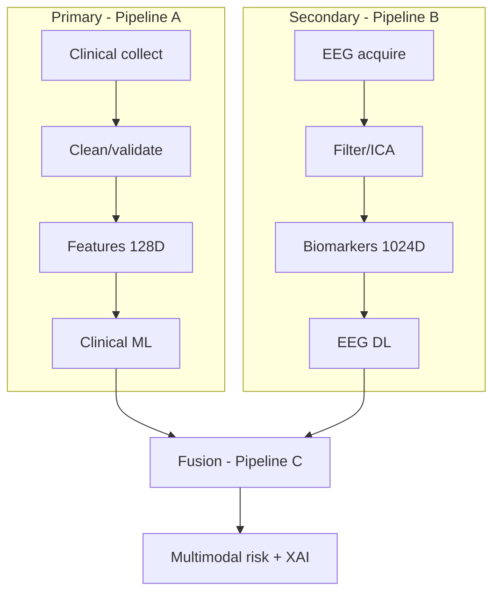
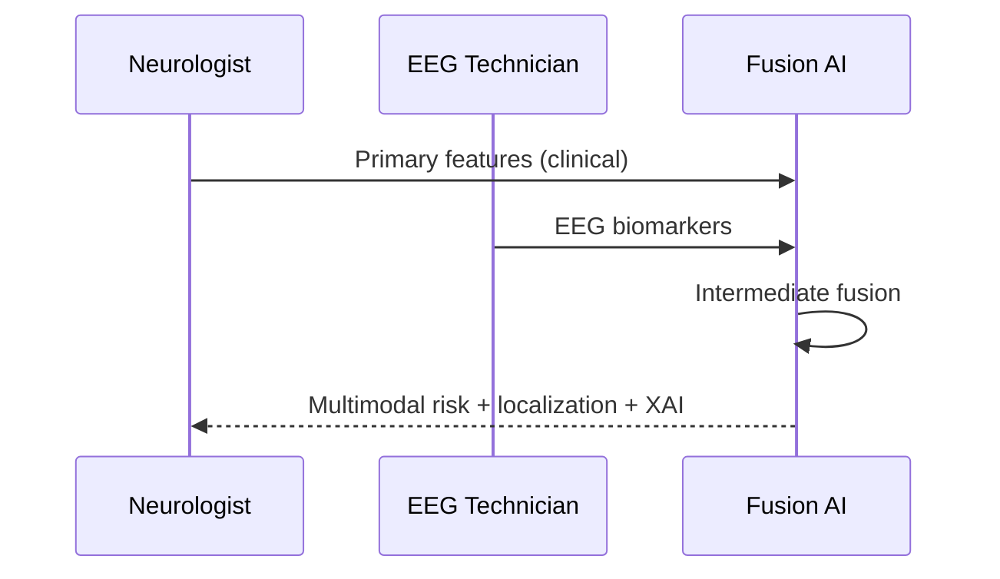
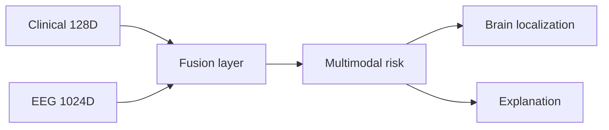
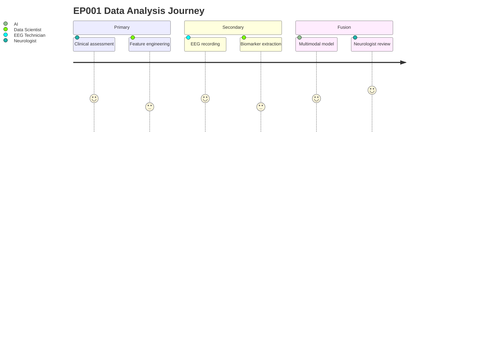
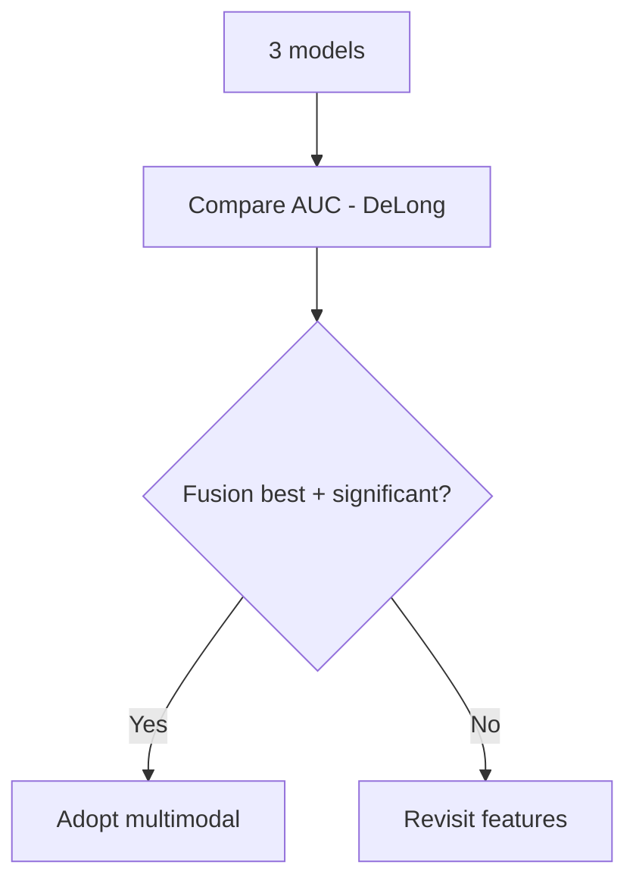

# Primary vs Secondary Data Analysis — Step by Step (Epilepsy, EP001)

> **Why (this doc):** Explain, step by step, how primary (clinical) and secondary (EEG) data
> are analyzed and fused — the analytical backbone of the DBA.
> **How:** Two parallel 16-step pipelines, each step explained with a table + flowchart, then
> the fusion step, to the canonical standard.

## 1. Problem

> **Why:** State why two analyses are needed.
> **How:** Problem paragraph + table.

A neurologist decides using *both* clinical assessment and EEG. Analyzing only one loses
information; the challenge is to analyze each rigorously and then fuse them.

*Caption — contrasts the two data types the analysis must handle.*

| Aspect | Primary (clinical) | Secondary (EEG) |
|---|---|---|
| Owner | Neurologist | EEG Technician |
| Nature | Structured/tabular | Physiological signal |
| Example (EP001) | 5 seizures/mo, adherence 88% | 21-ch, 512 Hz, impedance 3.1 kΩ |
| Pipeline | A | B |

## 2. Sub-Problems

*Caption — the analytical sub-problems for each stream.*

| # | Sub-problem | Stream |
|---|---|---|
| SP1 | Clean & validate clinical fields | Primary |
| SP2 | Clean & filter EEG signal | Secondary |
| SP3 | Engineer clinical features | Primary |
| SP4 | Extract EEG biomarkers | Secondary |
| SP5 | Fuse both into one risk view | Both |

## 3. Research Problem

**Research problem:** *Does rigorous, explainable analysis of primary and secondary data —
and their fusion — improve epilepsy risk assessment over either stream alone?*

## 4. Research Objective

*Caption — measurable objectives for the analysis.*

| Objective | Success criterion |
|---|---|
| Rigorous primary analysis | Leak-free, validated clinical features |
| Rigorous secondary analysis | Artifact-clean EEG biomarkers |
| Effective fusion | Multimodal beats single-modality (H3) |

## 5. Flow (both streams)

*Caption — the two pipelines run in parallel then fuse.*

| Stage | Primary (A) | Secondary (B) |
|---|---|---|
| Collect | Neurologist assessment | EEG acquisition |
| Clean | Validate/clean fields | Filter/ICA/artifact removal |
| Transform | Encode/scale | FFT/wavelet |
| Features | Clinical scores (128-D) | Biomarkers → embedding (1024-D) |
| Model | Clinical ML | EEG deep learning |
| Fuse | → Multimodal (Pipeline C) | → Multimodal (Pipeline C) |

## 6. Primary Data Analysis — 16 Steps Explained

> **Why:** Each clinical step must be defensible.
> **How:** One row per step with what/why.

*Caption — the primary (clinical) analysis steps, in order.*

| Step | What happens | Why it matters |
|---|---|---|
| 1 Collection | Capture neurologist + technician data | Complete record |
| 2 Validation | Range/consistency checks | Trustworthy inputs |
| 3 Cleaning | Fix units, typos, conflicts | Comparable values |
| 4 Standardization | ICD/SNOMED, unit norms | Interoperability |
| 5 EDA | Profile distributions/associations | Evidence for choices |
| 6 Statistics | Test hypotheses + effect sizes | Significance |
| 7 Transformation | Split → encode → scale | ML-ready, leak-free |
| 8 Feature engineering | Sleep/seizure/trigger scores | Better predictors |
| 9 Feature selection | Filter/RFE/embedded + clinical review | Parsimony |
| 10 Machine learning | LR→RF→XGBoost, subject-level CV | Best model |
| 11 Explainable AI | SHAP, per-patient reasons | Trust |
| 12 Clinical RAG | Guideline-grounded report | Evidence |
| 13 CDSS | Role-specific recommendations | Action |
| 14 Deployment | Serving + EMR integration | Real use |
| 15 Monitoring | Drift/latency/quality | Reliability |
| 16 Governance | Bias/audit/versioning | Safety |

## 7. Secondary Data Analysis — 16 Steps Explained

*Caption — the secondary (EEG) analysis steps, in order.*

| Step | What happens | Why it matters |
|---|---|---|
| 1 Acquisition | Import EDF/BDF, 21 ch @ 512 Hz | Raw signal |
| 2 Quality check | Impedance, missing channels | Usable recording |
| 3 Cleaning | Bandpass 0.5–45 Hz, notch, ICA | Remove artifacts |
| 4 Standardization | Montage, resample, BIDS | Consistency |
| 5 Exploratory | Topomaps, spectra | Visual insight |
| 6 Statistics | Band power, connectivity | Quantify |
| 7 Transformation | FFT, wavelet, time-frequency | Feature basis |
| 8 Feature engineering | Spikes, theta power, coherence | Biomarkers |
| 9 Feature selection | Discriminative biomarkers | Parsimony |
| 10 Classical ML | SVM/RF/XGBoost | Baseline |
| 11 Deep learning | EEGNet/CNN/transformer → 1024-D | Strong model |
| 12 Explainable AI | Grad-CAM, channel/freq importance | Localization |
| 13 Clinical RAG | ILAE/AAN grounding | Evidence |
| 14 CDSS | Neurophysiologist views | Action |
| 15 Deployment | Inference service, monitoring | Real use |
| 16 Governance | Drift/bias/audit | Safety |

## 8. Brain-Region Mapping (secondary, EP001-oriented)

> **Why:** Localization is more clinically valuable than "epilepsy yes/no".
> **How:** Map channels → lobes; report focus + confidence.

*Caption — channel-to-region mapping used for localization.*

| Region | Example channels | EP001 relevance |
|---|---|---|
| Frontal | Fp1, Fp2, F3, F4, F7, F8 | — |
| Temporal | T7(T3), T8(T4), P7(T5), P8(T6) | Left temporal focus (aura, jerking) |
| Parietal | P3, P4 | — |
| Occipital | O1, O2 | — |
| Central | C3, C4, Cz | — |

## 9. Sequence Diagram — Primary + Secondary Hand-off

## 10. Network Diagram — Fusion Inputs

## 11. Journey Map — Data Through Both Pipelines

## 12. Hypotheses

*Caption — the fusion hypotheses this analysis enables.*

| ID | H0 | H1 |
|---|---|---|
| H1 | Primary-only sufficient | Primary adds value |
| H2 | EEG-only sufficient | EEG adds value |
| H3 | Fusion = single-modality | Fusion > single-modality |

## 13. Statistical Analysis

*Caption — how the fusion advantage is tested.*

| Comparison | Test | Metric |
|---|---|---|
| Primary vs EEG vs Fusion AUC | DeLong | ΔAUC, p |
| Paired accuracy | McNemar | p |
| Calibration | Brier score | ↓ better |

## Professor Readiness (Defense Q&A)

### Q1. Why is subject-level split critical for EEG?
EEG is segmented into windows; if the same patient appears in train and test, the model
memorizes the patient, inflating accuracy (data leakage).

### Q2. Why intermediate fusion, not early or late?
It balances flexibility, performance, and interpretability — separate encoders then a fusion
layer (Baltrušaitis et al., 2019).

### Q3. How do you prove fusion is worth it?
DeLong test on AUC across primary-only, EEG-only, fusion; report ΔAUC + CI (H3).

### Q4. Primary vs secondary — which owns the decision?
Neither model decides; the neurologist does. AI is decision support (Topol, 2019).

## References

American Psychological Association. (2020). *Publication manual of the American Psychological
Association* (7th ed.). https://doi.org/10.1037/0000165-000

Baltrušaitis, T., Ahuja, C., & Morency, L.-P. (2019). Multimodal machine learning: A survey
and taxonomy. *IEEE Transactions on Pattern Analysis and Machine Intelligence, 41*(2),
423–443. https://doi.org/10.1109/TPAMI.2018.2798607

DeLong, E. R., DeLong, D. M., & Clarke-Pearson, D. L. (1988). Comparing the areas under two or
more correlated receiver operating characteristic curves. *Biometrics, 44*(3), 837–845.
https://doi.org/10.2307/2531595

Topol, E. J. (2019). High-performance medicine: The convergence of human and artificial
intelligence. *Nature Medicine, 25*(1), 44–56. https://doi.org/10.1038/s41591-018-0300-7
