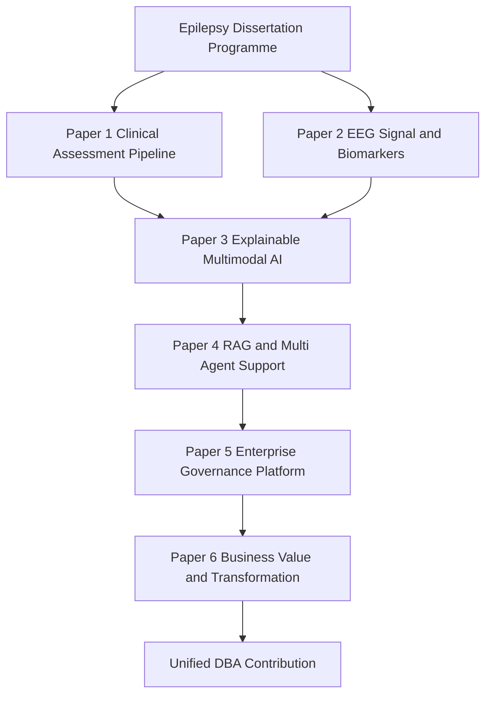
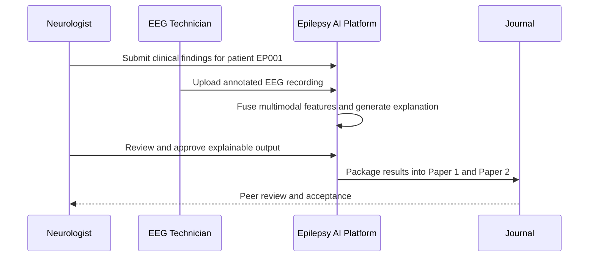
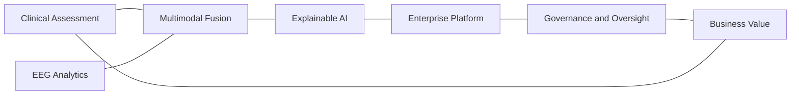
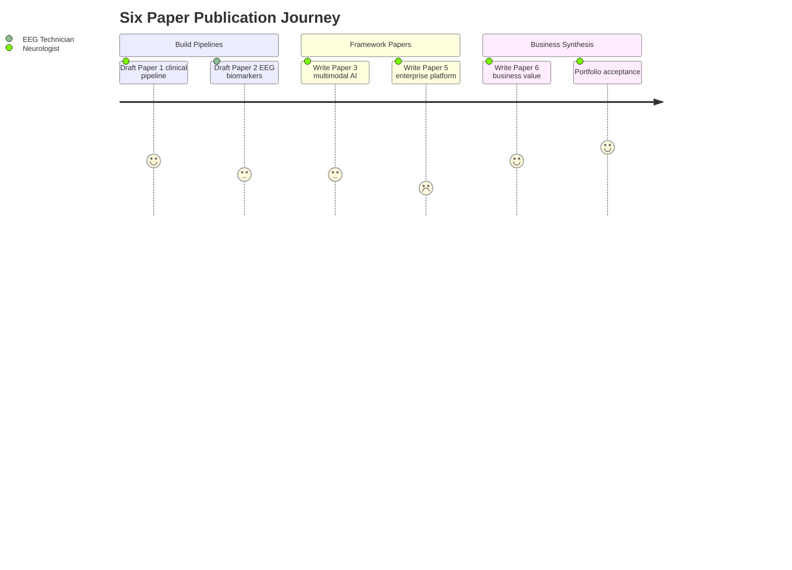

# Publication Strategy (Top 1%)

> **Why (this doc):** A DBA dissertation on the *Enterprise AI Platform for Explainable Multimodal Epilepsy Intelligence* represents years of technical and organizational work; funnelling it into a single thesis and a single paper under-realizes its scholarly and business value. This document defines how to decompose one coherent epilepsy-intelligence programme into six independently publishable Q1 outputs.
> **How:** It maps the dissertation's three central contributions (multimodal framework, enterprise platform, business-value evaluation) onto a six-paper portfolio, assigns each paper a target journal type, and sequences them so the technical pipelines (clinical assessment, EEG analytics, RAG + multi-agent decision support) feed the higher-order framework papers.

**Problem.** A wealth of dissertation output risks being compressed into one publication, diluting impact and slowing dissemination across the distinct audiences (clinical informatics, biomedical signal processing, AI-in-medicine, enterprise IS, and DBA/business) that the work legitimately serves.

**Research Objective.** Define a publication portfolio that converts a single epilepsy-intelligence dissertation into multiple, mutually reinforcing Q1 papers, each independently publishable yet collectively narrating one enterprise-transformation story anchored in explainable, human-supervised epilepsy care.

Instead of writing one thesis and one paper, use the dissertation to produce **multiple
publishable outputs**.

*Caption - The six-paper portfolio below is the operational core of this strategy: it names each planned output, its distinct scholarly contribution, and the class of Q1 journal it targets, so that a single body of epilepsy research reaches five separate expert communities.*

| Paper | Contribution | Suggested Journal Type |
|---|---|---|
| **Paper 1** | Clinical assessment AI pipeline | Digital Health / Medical Informatics |
| **Paper 2** | EEG signal processing & multimodal biomarkers | Biomedical Signal Processing |
| **Paper 3** | Explainable multimodal AI for epilepsy | AI in Medicine |
| **Paper 4** | RAG + Multi-Agent clinical decision support | Medical AI / Health Informatics |
| **Paper 5** | Enterprise AI governance & deployment framework | Health / Enterprise Information Systems |
| **Paper 6** | Business value & digital transformation via enterprise AI | Business / DBA / Digital Transformation |

## Portfolio Overview

> **Why:** A reader needs to see how six scattered papers cohere into one programme before trusting the plan. **How:** The flowchart traces the dependency spine from raw epilepsy data through the technical pipelines to the three framework contributions.

## Why This Works for a DBA

> **Why:** Examiners must see that the split serves the DBA mandate, not just publication counting. **How:** It aligns the three central contributions with Papers 3, 5, and 6 while the remaining papers supply the technical evidence base.

The three central contributions — **multimodal framework**, **enterprise platform**, and
**business value evaluation** — map cleanly onto Papers 3, 5, and 6, while Papers 1, 2, and
4 harvest the technical pipelines. Each paper is independently publishable yet collectively
tells one coherent enterprise-transformation story.

### Mapping Contributions to Papers

> **Why:** A precise contribution-to-paper mapping prevents overlap and self-plagiarism across submissions. **How:** Each contribution is pinned to a lead paper and its supporting technical papers.

*Caption - This mapping table is present to make the division of intellectual labour explicit, showing which paper owns each central contribution and which technical papers substantiate it, so reviewers see distinct-but-connected outputs rather than salami slicing.*

| Central Contribution | Lead Paper | Supporting Papers | Primary Audience |
|---|---|---|---|
| Multimodal AI framework (clinical + EEG) | Paper 3 | Paper 1, Paper 2 | AI in Medicine |
| Enterprise clinical intelligence platform | Paper 5 | Paper 4 | Enterprise / Health IS |
| Business value evaluation framework | Paper 6 | Paper 5 | DBA / Digital Transformation |

### Submission Sequencing

> **Why:** Order of submission affects citability and reviewer context across the portfolio. **How:** Technical pipeline papers submit first so framework papers can cite them as published evidence.

## Final Recommendation

> **Why:** The dissertation must resolve into a defensible, bounded scholarly claim. **How:** It refines the work around three central contributions rather than many scattered innovations.

Refine the dissertation around **three central contributions** rather than many independent
innovations:

1. A multimodal AI framework integrating primary clinical assessment with EEG analytics.
2. An enterprise clinical intelligence platform combining explainable AI, RAG, human
   oversight, and governance.
3. A business value evaluation framework linking enterprise AI to clinical workflows,
   operational efficiency, governance, and organizational outcomes.

These combine **technical innovation + organizational transformation + measurable business
impact** — the hallmark of a strong DBA.

### Contribution Network

> **Why:** The three contributions are interdependent, not sequential silos. **How:** The network graph shows how technical, platform, and business layers reinforce one another around epilepsy care.

### Publication Journey

> **Why:** The multi-year path from draft to accepted portfolio needs a realistic emotional and effort map. **How:** The journey diagram scores each stage to flag where support and revision effort concentrate.

## Professor Readiness (Defense Q&A)

> **Why:** The committee will probe whether six papers constitute genuine scholarship or fragmentation. **How:** These rehearsed questions and answers preempt the most likely lines of challenge.

### Is a six-paper split just salami slicing of one study?

No. Each paper carries a distinct research question, methodology, and audience: Papers 1 and 2 report separable technical pipelines (clinical assessment and EEG analytics), while Papers 3, 5, and 6 advance the three central conceptual contributions. The mapping table documents non-overlapping contributions, and each paper stands alone under independent peer review.

### Why does an epilepsy-focused programme belong in a DBA rather than a clinical PhD?

The unit of contribution is organizational transformation, not a new clinical treatment. The epilepsy platform is the vehicle for demonstrating enterprise AI governance, human oversight (Neurologist and EEG Technician roles), and measurable business value — the Papers 5 and 6 contributions — which are business and information-systems questions.

### How do you ensure clinical safety and explainability across all six papers?

Every output keeps a human in the loop: the Neurologist approves explainable model outputs before use, and validation is anchored to a controlled test case (patient EP001). Explainability is a first-class requirement (Paper 3), consistent with calls for transparent, clinician-supervised AI in medicine (Topol, 2019).

### What prevents the portfolio from losing coherence across five journal communities?

The contribution network binds the papers: technical pipelines feed the multimodal framework, which feeds the enterprise platform, which feeds the business-value evaluation. The dissertation narrative frames all six as one enterprise-transformation story, and each paper explicitly cites its portfolio siblings.

## References

> **Why:** Q1 submissions demand authoritative, correctly formatted sourcing. **How:** Entries follow APA 7th edition and anchor the clinical, AI, and methodological claims made above.

American Psychological Association. (2020). *Publication manual of the American Psychological Association* (7th ed.). https://doi.org/10.1037/0000165-000

Fisher, R. S., Cross, J. H., French, J. A., Higurashi, N., Hirsch, E., Jansen, F. E., Lagae, L., Moshé, S. L., Peltola, J., Roulet Perez, E., Scheffer, I. E., & Zuberi, S. M. (2017). Operational classification of seizure types by the International League Against Epilepsy: Position paper of the ILAE Commission for Classification and Terminology. *Epilepsia, 58*(4), 522-530. https://doi.org/10.1111/epi.13670

Holzinger, A., Langs, G., Denk, H., Zatloukal, K., & Müller, H. (2019). Causality and explainability of artificial intelligence in medicine. *WIREs Data Mining and Knowledge Discovery, 9*(4), e1312. https://doi.org/10.1002/widm.1312

Topol, E. J. (2019). High-performance medicine: The convergence of human and artificial intelligence. *Nature Medicine, 25*(1), 44-56. https://doi.org/10.1038/s41591-018-0300-7
