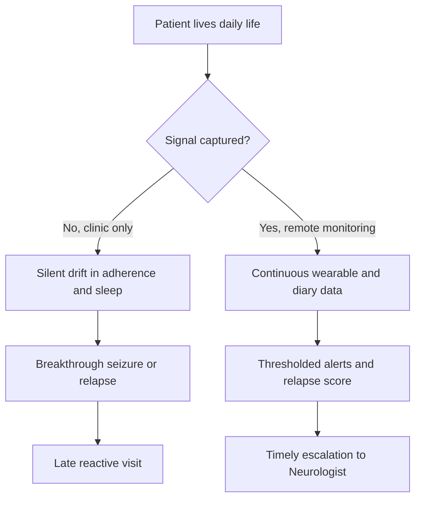
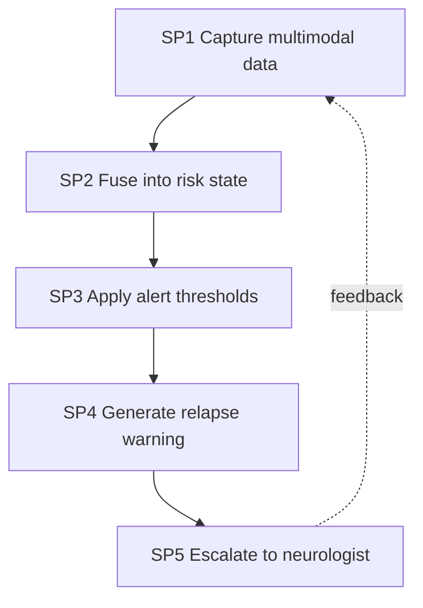
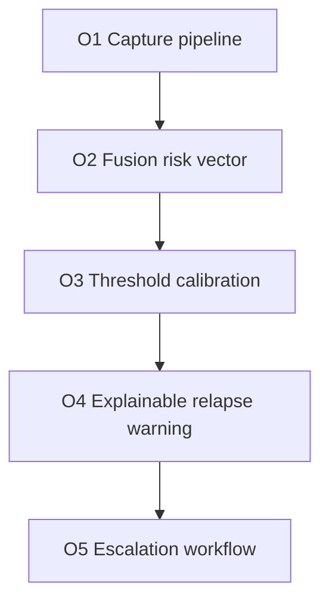
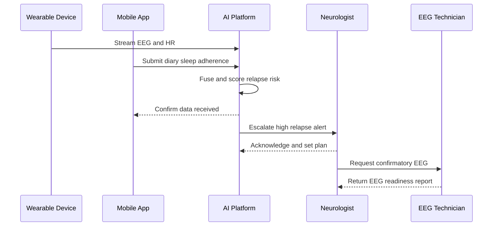
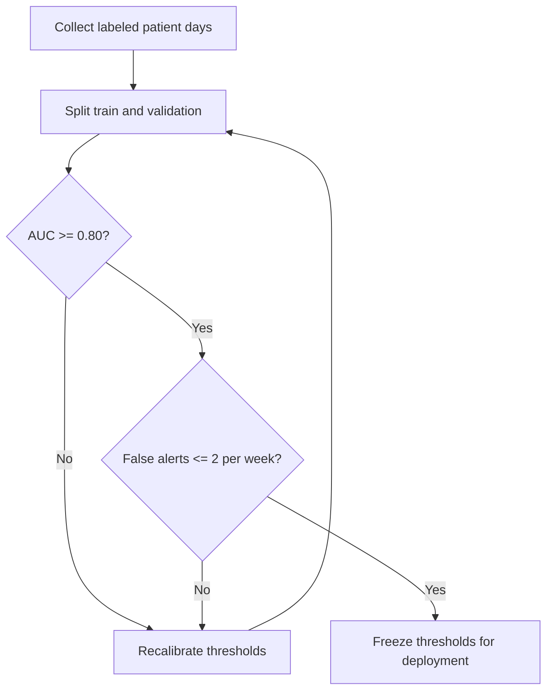
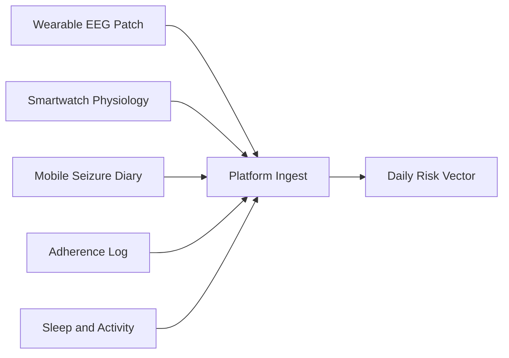
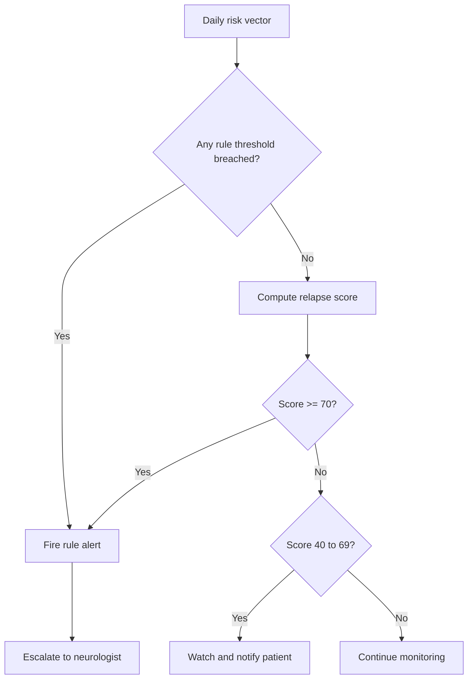
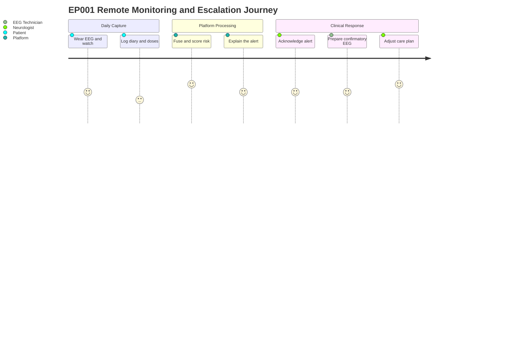

# Remote Epilepsy Monitoring (Wearables, Alerts, Relapse Warning)

> **Why (this doc):** Focal impaired-awareness epilepsy is episodic, largely nocturnal, and clinically invisible between infrequent neurology visits; a patient like EP001 (5 seizures/month, breakthrough events on Levetiracetam, 88% adherence, 5.2h poor sleep) needs continuous out-of-clinic surveillance to catch deterioration before the next relapse. **How:** By defining a wearable-plus-mobile remote monitoring subsystem for the Enterprise AI Platform that fuses wearable EEG, smartwatch physiology, a daily seizure diary, sleep, medication adherence, and activity into thresholded alerts, an explainable relapse-warning score, and a governed escalation path to the Neurologist, measured by defensible KPIs.

---

## 1. Problem

> **Why:** A dissertation must anchor to a concrete, defensible clinical gap before proposing engineering. **How:** State the between-visit surveillance gap for focal epilepsy in measurable terms tied to EP001.

Patients with focal impaired-awareness epilepsy are seen in clinic only every 3-6 months, yet their risk state changes daily. Seizures are under-reported (many nocturnal or with impaired awareness), medication adherence drifts silently, and sleep deprivation - a dominant seizure trigger - goes unrecorded. For EP001, the clinically meaningful signals (adherence 88% with 3 missed doses/month, sleep 5.2h, trigger burden 4/10 high, breakthrough seizures despite therapy) exist in the patient's daily life but never reach the care team until harm occurs. The core problem is the **absence of a continuous, trustworthy, and explainable remote monitoring layer** that converts everyday wearable and self-report data into timely clinical action.

*Caption - The table below decomposes the problem into observable data gaps and their clinical consequence, justifying why remote monitoring is required rather than optional.*

| Data domain | Clinic-only reality | Consequence for EP001 | Remote-monitoring remedy |
|---|---|---|---|
| Seizure frequency | Recalled at visit, under-reported | Nocturnal events missed | Wearable EEG + diary capture |
| Medication adherence | Self-claimed at visit | 3 missed doses/month unseen | Smart-cap/mobile adherence log |
| Sleep | Not measured | 5.2h poor sleep undocumented | Smartwatch sleep staging |
| Triggers/activity | Anecdotal | Burden 4/10 unquantified | Activity + context sensing |
| Deterioration timing | Reactive (post-relapse) | Late intervention | Relapse-warning score |

---

## 2. Sub-Problems

> **Why:** A single broad problem must be split into researchable, individually solvable units. **How:** Enumerate five sub-problems spanning capture, fusion, thresholds, warning, and escalation.

*Caption - This table maps each sub-problem to the data source and the KPI that will later demonstrate it was solved, keeping the research falsifiable.*

| # | Sub-problem | Primary data source | Success signal |
|---|---|---|---|
| SP1 | Reliable multimodal capture in daily life | Wearable EEG, smartwatch, mobile diary | >=90% data completeness |
| SP2 | Fusing heterogeneous signals into one state | All streams | Coherent daily risk vector |
| SP3 | Setting clinically valid alert thresholds | Adherence, sleep, seizure counts | Low false-alert rate |
| SP4 | Producing an explainable relapse warning | Fused features | Lead-time before relapse |
| SP5 | Governed escalation to the right clinician | Alert + score | Time-to-acknowledgement |

---

## 3. Research Problem

> **Why:** The examiner needs one crisp researchable statement. **How:** Frame the problem as a testable question about explainable remote monitoring and clinical lead-time.

**Research problem:** *Can an explainable multimodal remote-monitoring subsystem - fusing wearable EEG, smartwatch physiology, seizure diary, sleep, medication adherence, and activity - generate thresholded alerts and a relapse-warning score that provide clinically actionable lead-time and reliable escalation for focal epilepsy patients such as EP001, without overwhelming clinicians with false alerts?*

*Caption - The table sharpens the research problem into its independent, dependent, and constraint variables so the study remains measurable.*

| Element | Definition in this study |
|---|---|
| Independent variables | Adherence %, sleep hours, seizure cluster count, activity, EEG risk |
| Dependent variables | Alert firing, relapse-warning score, escalation latency |
| Constraint | False-alert rate must stay clinically tolerable |
| Population anchor | EP001 focal impaired-awareness epilepsy profile |

---

## 4. Research Objective

> **Why:** Objectives convert the problem into concrete build-and-measure goals. **How:** List one primary and four specific objectives, each traceable to a sub-problem.

*Caption - Objectives are mapped one-to-one to sub-problems and to a measurable target, demonstrating research completeness.*

| Objective | Addresses | Measurable target |
|---|---|---|
| O1 Design multimodal capture pipeline | SP1 | >=90% daily completeness |
| O2 Build fusion into daily risk vector | SP2 | Unified vector per patient-day |
| O3 Calibrate alert thresholds | SP3 | Precision >=0.7 on alerts |
| O4 Produce explainable relapse warning | SP4 | Lead-time >=48h before relapse |
| O5 Define governed escalation workflow | SP5 | Ack within 24h for high alerts |

---

## 5. Flow

> **Why:** A defense requires an end-to-end picture of how data becomes clinical action. **How:** Present the runtime flow as both a table and a sequence diagram across device, platform, and clinician.

*Caption - This table traces one patient-day of EP001 data through each stage so the reviewer can audit where value and risk are introduced.*

| Stage | Actor/component | Input | Output |
|---|---|---|---|
| 1 Capture | Wearable + mobile | Raw EEG, HR, sleep, diary | Time-stamped streams |
| 2 Ingest | Platform gateway | Streams | Validated records |
| 3 Fuse | Feature engine | Records | Daily risk vector |
| 4 Evaluate | Rules + model | Risk vector | Alerts + relapse score |
| 5 Explain | XAI layer | Score | Feature attributions |
| 6 Escalate | Care workflow | High alert | Neurologist task |

---

## 6. Hypotheses

> **Why:** Falsifiable hypotheses make the study scientific rather than descriptive. **How:** State null and alternative hypotheses for lead-time, alert precision, and adherence detection.

*Caption - The hypothesis table pairs each null with its alternative and the statistical test used, so the analysis plan is transparent up front.*

| ID | Null (H0) | Alternative (H1) | Test |
|---|---|---|---|
| H1 | Relapse warning gives no lead-time vs chance | Lead-time >=48h | One-sample t-test |
| H2 | Alert precision <= 0.5 | Precision > 0.7 | Proportion z-test |
| H3 | Multimodal fusion no better than diary alone | Fusion improves AUC | DeLong test |
| H4 | Adherence alerts miss true lapses | Sensitivity > 0.8 | Binomial test |

---

## 7. Statistical Analysis

> **Why:** The examiner will probe how claims are validated numerically. **How:** Specify metrics, tests, thresholds, and how EP001-like cohorts are evaluated.

*Caption - This table lists each metric, its formula in plain terms, and the acceptance threshold that constitutes a defensible result.*

| Metric | Meaning | Acceptance threshold |
|---|---|---|
| Lead-time (hours) | Warning-to-relapse interval | >= 48h |
| Precision | Alerts that were true | >= 0.70 |
| Sensitivity/recall | True lapses detected | >= 0.80 |
| AUC-ROC | Discrimination of relapse | >= 0.80 |
| False-alert rate/week | Nuisance burden | <= 2 per patient-week |
| Cohen kappa | Model-clinician agreement | >= 0.60 |

---

## 8. Multimodal Data Capture (Wearable EEG, Smartwatch, Mobile)

> **Why:** The whole system depends on trustworthy daily signals from consumer and clinical devices. **How:** Define each stream, its sensor, sampling, and clinical purpose, mapped to EP001.

Remote capture combines a **wearable EEG patch** (subset of the 10-20 montage, useful for nocturnal focal activity where EP001's seizures occur), a **smartwatch** (heart rate, HRV, accelerometry, sleep staging - directly relevant to EP001's 5.2h poor sleep and nocturnal events), and a **mobile app** hosting the daily seizure diary, medication adherence log, and self-reported triggers.

*Caption - This table specifies each capture modality so a reviewer can judge signal validity and coverage against EP001's clinical profile.*

| Modality | Sensor/source | Sampling | Captures | EP001 relevance |
|---|---|---|---|---|
| Wearable EEG | Reduced 10-20 patch | up to 256 Hz | Focal epileptiform activity | Nocturnal focal seizures |
| Smartwatch physiology | PPG + accelerometer | 1-50 Hz | HR, HRV, motion | Autonomic seizure signs |
| Sleep | Watch sleep staging | Per-minute | Duration, fragmentation | 5.2h poor sleep trigger |
| Seizure diary | Mobile app | Per event | Count, duration, aura | 5/month, 90s, metallic-taste aura |
| Adherence | Smart cap / app log | Per dose | Doses taken vs due | 88%, 3 missed/month |
| Activity/triggers | Watch + app | Continuous | Steps, stress, context | Trigger burden 4/10 |

### 8.1 Daily Seizure Diary

> **Why:** Patient-reported events remain the clinical ground truth for seizure frequency. **How:** Structure the diary to capture count, duration, aura, and nocturnal timing for reconciliation with wearable EEG.

For EP001 the diary records each event's time, duration (~90s), awareness level, aura (metallic taste, deja vu), and suspected trigger, then reconciles against wearable EEG-detected events to reduce under-reporting.

*Caption - The diary schema below shows the minimum fields needed for the platform to trend seizure burden and detect clustering.*

| Field | Type | Example (EP001) |
|---|---|---|
| Event timestamp | datetime | Nocturnal 02:14 |
| Duration | seconds | 90 |
| Awareness | enum | Impaired |
| Aura | tags | Metallic taste, deja vu |
| Trigger | tags | Sleep deprivation |

### 8.2 Data Quality and Completeness

> **Why:** Alerts built on missing or corrupt data are dangerous. **How:** Gate every stream through completeness and artifact checks before fusion, using the EEG Technician for signal-quality review.

*Caption - This quality-gate table defines the pass criteria per stream, mirroring the clinical EEG pre-assessment standard (impedance 3.1 kOhm, low artifact risk, 98% readiness).*

| Stream | Quality check | Pass criterion |
|---|---|---|
| Wearable EEG | Impedance, artifact | <= 5 kOhm, low artifact |
| Smartwatch | Wear-time | >= 20h/day |
| Diary | Submission | Daily entry present |
| Adherence | Log continuity | No >2 day gap |

---

## 9. Alert Thresholds and Relapse Warning

> **Why:** Raw signals must become discrete, defensible decisions. **How:** Define rule-based thresholds plus a fused relapse-warning score, with explainability for every fired alert.

The system uses a two-tier logic: deterministic **rule thresholds** for clear clinical red lines, and a fused **relapse-warning score** that integrates trend and interaction effects the rules miss.

*Caption - This table lists each production alert threshold, its rationale, and severity, forming the core clinical decision layer.*

| Alert | Threshold | Rationale | Severity |
|---|---|---|---|
| Adherence low | Adherence < 60% | Subtherapeutic drug levels | High |
| Sleep deprivation | Sleep < 4h | Dominant seizure trigger | Medium |
| Seizure cluster | >= 3 seizures in 24h | Status/relapse risk | High |
| Rising burden | Weekly count up >50% | Trend deterioration | Medium |
| EEG epileptiform surge | Spike rate up sharply | Cortical instability | High |

For EP001 today (adherence 88%, sleep 5.2h) no single rule fires, yet the relapse score can still rise if trends converge - which is the value of fusion over isolated rules.

*Caption - The relapse-warning score table shows how weighted features combine into a single 0-100 risk value with banded actions.*

| Feature | Weight | EP001 contribution |
|---|---|---|
| Adherence deficit | 0.30 | Moderate (88%) |
| Sleep deficit | 0.25 | Elevated (5.2h) |
| Seizure trend | 0.25 | Elevated (breakthrough) |
| Trigger burden | 0.10 | High (4/10) |
| EEG instability | 0.10 | Low today |

---

## 10. Escalation to Neurologist and KPIs

> **Why:** A warning with no owner and no deadline is clinically worthless. **How:** Define a governed escalation ladder with roles, SLAs, and a KPI dashboard for the whole subsystem.

Escalation routes high-severity alerts and high relapse scores to the **Neurologist** for clinical decision, optionally triggering the **EEG Technician** to prepare a confirmatory in-clinic EEG (EP001 EEG readiness 98%). Low/medium items route to patient self-management notifications.

*Caption - This escalation table binds each alert tier to an owner, channel, and service-level target, making accountability explicit for the defense.*

| Tier | Trigger | Owner | Channel | SLA |
|---|---|---|---|---|
| Critical | Seizure cluster / score >=85 | Neurologist | Urgent task + call | <= 4h ack |
| High | Rule high alert / score 70-84 | Neurologist | Task queue | <= 24h ack |
| Medium | Score 40-69 | Nurse / patient | App nudge | <= 72h |
| Low | Stable | Patient | Weekly summary | N/A |

*Caption - The KPI table defines how the subsystem's clinical and operational performance is judged after deployment.*

| KPI | Definition | Target |
|---|---|---|
| Relapse lead-time | Warning before relapse | >= 48h |
| Alert precision | True alerts / all alerts | >= 0.70 |
| Escalation ack time | Alert to clinician ack | <= 24h high tier |
| Data completeness | Days with full streams | >= 90% |
| False-alert rate | Nuisance alerts/week | <= 2 |
| Adherence detection | True lapses caught | >= 0.80 sensitivity |
| Patient engagement | Diary submission rate | >= 85% |

---

## Professor Readiness (Defense Q&A)

> **Why:** Anticipating examiner challenges demonstrates command of the work. **How:** Pre-answer five likely questions with concise reasoning, tables, or logic.

### Q1. How do you avoid alert fatigue while staying safe?

> **Why:** Over-alerting destroys clinician trust and buries true positives. **How:** Combine hard rules with a calibrated fused score and cap false alerts.

We tier alerts, require a fused score for ambiguous cases, and enforce a KPI ceiling of <= 2 false alerts per patient-week. Thresholds are frozen only after validation shows precision > 0.70, balancing sensitivity against nuisance burden.

### Q2. Consumer wearables are noisy - why trust them clinically?

> **Why:** Signal validity underpins every downstream decision. **How:** Gate data with quality checks and reconcile with clinical EEG.

Every stream passes a completeness and artifact gate (EEG impedance <= 5 kOhm, watch wear-time >= 20h). Wearable EEG events are reconciled against the diary, and high alerts trigger a confirmatory clinical EEG by the EEG Technician (EP001 readiness 98%), so consumer data screens rather than diagnoses.

### Q3. What makes the relapse warning explainable, not a black box?

> **Why:** Clinicians and regulators reject unexplained risk scores. **How:** Expose weighted feature attributions with every score.

*Caption - This shows the explanation surfaced with EP001's score, listing the top contributing features and direction.*

| Contributor | Direction | Shown to clinician |
|---|---|---|
| Sleep deficit 5.2h | Increases risk | Yes |
| Adherence 88% | Slight increase | Yes |
| Seizure trend | Increases risk | Yes |
| EEG stable today | Decreases risk | Yes |

### Q4. Why not rely on the seizure diary alone?

> **Why:** Diaries are the cheapest source and a natural baseline. **How:** Show fusion outperforms diary-only via H3.

Diaries under-report nocturnal and impaired-awareness events - exactly EP001's seizure type. Hypothesis H3 formally tests fusion vs diary-only AUC using the DeLong test; if fusion does not improve discrimination, the added sensors are not justified. The design is falsifiable, not assumed.

### Q5. How does this protect patient safety and privacy?

> **Why:** Remote health data carries clinical and regulatory risk. **How:** Governed escalation SLAs plus consent and minimization.

Critical alerts carry a 4h acknowledgement SLA with fallback contact, ensuring no warning is orphaned. Data is minimized to clinically necessary features, encrypted in transit, and access is role-scoped to Neurologist and EEG Technician, consistent with APA (2020) ethical data-handling guidance.

---

## References

Fisher, R. S., Cross, J. H., French, J. A., Higurashi, N., Hirsch, E., Jansen, F. E., Lagae, L., Moshe, S. L., Peltola, J., Roulet Perez, E., Scheffer, I. E., & Zuberi, S. M. (2017). Operational classification of seizure types by the International League Against Epilepsy: Position paper of the ILAE Commission for Classification and Terminology. *Epilepsia, 58*(4), 522-530. https://doi.org/10.1111/epi.13670

Topol, E. J. (2019). High-performance medicine: The convergence of human and artificial intelligence. *Nature Medicine, 25*(1), 44-56. https://doi.org/10.1038/s41591-018-0300-7

American Psychological Association. (2020). *Publication manual of the American Psychological Association* (7th ed.). American Psychological Association.

Beniczky, S., Wiebe, S., Jeppesen, J., Tatum, W. O., Brazdil, M., Wang, Y., Herman, S. T., & Ryvlin, P. (2021). Automated seizure detection using wearable devices: A clinical practice guideline of the International League Against Epilepsy and the International Federation of Clinical Neurophysiology. *Epilepsia, 62*(3), 632-646. https://doi.org/10.1111/epi.16818

Bruno, E., Simblett, S., Lang, A., Biondi, A., Odoi, C., Schulze-Bonhage, A., Wykes, T., & Richardson, M. P. (2018). Wearable technology in epilepsy: The views of patients, caregivers, and healthcare professionals. *Epilepsy & Behavior, 85*, 141-149. https://doi.org/10.1016/j.yebeh.2018.05.044

Cramer, J. A., Perrine, K., Devinsky, O., Bryant-Comstock, L., Meador, K., & Hermann, B. (1998). Development and cross-cultural translations of a 31-item quality of life in epilepsy inventory (QOLIE-31). *Epilepsia, 39*(1), 81-88. https://doi.org/10.1111/j.1528-1157.1998.tb01278.x

Ryvlin, P., Ciumas, C., Wisniewski, I., & Beniczky, S. (2018). Wearable devices for sudden unexpected death in epilepsy prevention. *Epilepsia, 59*(S1), 61-66. https://doi.org/10.1111/epi.14054
