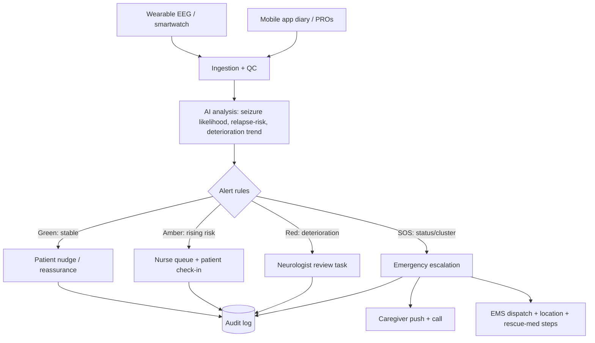
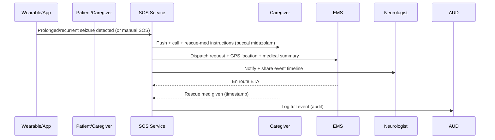
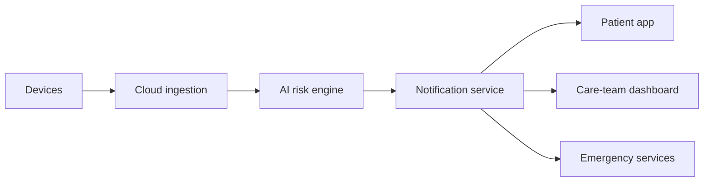
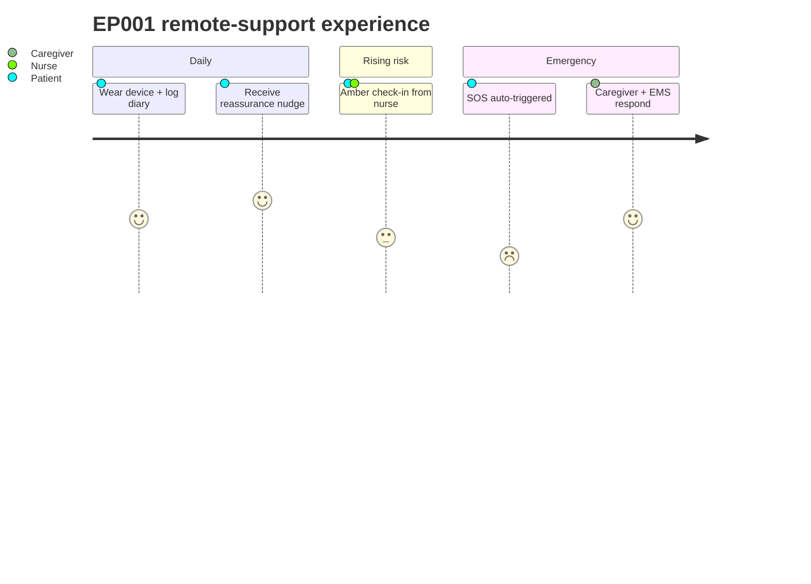

# Remote Support, Alerts & Emergency SOS

> **Why (this doc):** Between infrequent clinic visits, epilepsy is clinically invisible; a patient
> like EP001 (≈5 seizures/month, nocturnal events, breakthrough on CBZ+LEV) needs continuous remote
> support with graded alerts and a one-touch **SOS** for emergencies. **How:** defines the remote-support
> plan, the alert/notification architecture for both patient and care team, and the status-epilepticus
> SOS escalation. Extends [remote-monitoring](remote-monitoring.md).

## 1. Remote support plan

*Caption - The tiers of remote support, what each provides, and who is involved.*

| Tier | Trigger | Support provided | Actor |
|---|---|---|---|
| Self-management | Routine | App diary, medication reminders, education, trigger nudges | Patient |
| Nurse tele-support | Amber alert / query | Message/call, adherence + safety check | Epilepsy nurse |
| Neurologist review | Red alert / deterioration trend | Tele-consult, regimen/plan change | Neurologist |
| Emergency (SOS) | Status / cluster (~seizures every 5 min) | Ambulance dispatch, rescue-med guidance, location share | Caregiver + EMS |

## 2. Alert / notification architecture

*Caption - How wearable + app + model signals become graded notifications to patient and care team.*

**Reason:** To show the signal-to-notification path and its grading. **Why:** Alert fatigue and missed emergencies both harm; grading balances them. **What is happening:** Wearable/app signals are analysed, thresholded into Green/Amber/Red/SOS, and routed to the right actor. **How it is happening:** Rule + model thresholds map risk to a channel; every alert is audited. **Reference:** Beniczky et al. (2021).

## 3. Notification matrix

*Caption - Channel, latency target, and recipient per alert level.*

| Level | Condition | Patient channel | Care-team channel | Latency target |
|---|---|---|---|---|
| Green | Stable | In-app summary | Dashboard tile | Daily |
| Amber | Rising risk / missed doses | Push + in-app | Nurse work-queue | < 4 h |
| Red | Deterioration trend / cluster risk | Push + call prompt | Neurologist task + page | < 30 min |
| **SOS** | Status epilepticus (~every 5 min) / prolonged >5 min | Auto-SOS screen + audible | Caregiver call + **EMS** | < 1 min |

## 4. Emergency SOS flow (status epilepticus)

*Caption - The one-touch/auto SOS sequence for a life-threatening event.*

**Reason:** To make the emergency path explicit and fast. **Why:** Status epilepticus is time-critical (mortality rises with duration). **What is happening:** Detection or manual SOS triggers caregiver, EMS, and neurologist simultaneously with location + summary. **How it is happening:** The SOS service fans out to all responders and logs the timeline. **Reference:** Trinka et al. (2015).

## 5. Network + experience

**Reason:** Component view of remote support. **Why:** Reliability of the notification path is safety-critical. **What is happening:** Devices → cloud → risk engine → notification fan-out. **How it is happening:** A dedicated notification service decouples detection from delivery. **Reference:** Beniczky et al. (2021).

**Reason:** The lived experience across states. **Why:** Trust depends on calm daily UX and reliable emergency response. **What is happening:** Routine reassurance escalates to nurse then emergency as risk rises. **How it is happening:** Each state maps to an alert tier. **Reference:** Topol (2019).

## Professor Readiness (Defense Q&A)

**Q1: How is alert fatigue managed?** Four graded tiers with distinct channels/latency; only Red/SOS interrupt, and thresholds are tuned to precision.

**Q2: Is detection reliable enough to dispatch EMS?** SOS supports **manual** trigger and conservative auto-thresholds; false positives are safer than misses for status, and the neurologist is notified in parallel.

**Q3: What is logged?** Every alert and SOS event (timeline, rescue-med time, responders) to the audit log for governance and quality review.

## References

Beniczky, S., et al. (2021). Automated seizure detection using wearable devices. *Epilepsia, 62*(S2).

Trinka, E., et al. (2015). A definition and classification of status epilepticus — ILAE. *Epilepsia, 56*(10), 1515–1523.

Topol, E. J. (2019). *Deep medicine*. Basic Books.
