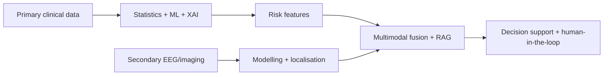

# Research Framework — Problem, Sub-Problems, Objectives, Design & Gap

> **Why (this doc):** Consolidates the formal DBA research framing in one place — the research
> problem, its sub-problems, objectives, questions, design, and the literature gap it fills —
> tied to the [variable dictionary](analysis/variable-dictionary.md) and
> [hypotheses](analysis/hypotheses.md). **How:** structured sections with a conceptual-framework
> diagram; anchors on patient EP001.

## 1. Research problem

Epilepsy care is **fragmented** across primary clinical assessment (multi-role) and secondary
machine data (EEG, imaging), and existing AI work stops at *"can AI detect epilepsy from EEG?"*.
The **problem**: there is no explainable, human-supervised platform that unifies multi-role
primary assessment with secondary EEG/imaging to reduce onboarding time, monitor remotely,
localise the epileptogenic focus, and support decisions — while remaining fair, governed, and
clinically trustworthy.

## 2. Sub-problems

*Caption - The problem decomposed into addressable sub-problems, each mapped to a platform capability.*

| # | Sub-problem | Addressed by |
|---|---|---|
| SP1 | Multi-role assessment data is unstructured / non-comparable | 9-role enterprise questionnaires + severity model |
| SP2 | Onboarding is slow and clinically incomplete | AI intake agent ([patient-onboarding](patient-onboarding.md)) |
| SP3 | Deterioration is invisible between visits | Remote monitoring ([remote-monitoring](remote-monitoring.md)) |
| SP4 | "Epilepsy detected" is not clinically actionable | Brain-focus localisation ([brain-localization](brain-localization.md)) |
| SP5 | Modalities are analysed in isolation | Multimodal fusion ([fusion](analysis/fusion-analysis.md)) |
| SP6 | Models are opaque, potentially biased, ungoverned | [Responsible AI](responsible-ai/index.md) + runtime SHAP/LIME/fairness |
| SP7 | No defensible statistical evidence | [Primary](analysis/primary-analysis.md)/[secondary](analysis/secondary-analysis.md) analyses |

## 3. Research objectives

O1 reduce patient onboarding time · O2 enable continuous remote monitoring · O3 localise the
epileptogenic focus · O4 provide clinical decision support · O5 make every output explainable ·
O6 keep a human in the loop. (Full KPIs in [research-vision](research-vision.md).)

## 4. Research questions

Overarching: *Can an explainable AI-enabled remote epilepsy care platform reduce onboarding
time, support monitoring, localise the focus, and improve clinician workflow while maintaining
human oversight?* Sub-questions map 1:1 to O1–O6.

## 5. Research design

*Caption - The mixed, three-pipeline design enabling a baseline-to-multimodal comparison.*

| Element | Choice |
|---|---|
| Paradigm | Post-positivist, quantitative with design-science artefact |
| Strategy | Three connected pipelines: primary (clinical) → secondary (EEG/imaging) → fusion |
| Data | Development on public data (TUH, Siena — *future scope*); methodology demonstrated on a **seeded synthetic cohort (N=500)**; clinical validation on retrospective linked hospital data (*future scope*) |
| Unit of analysis | Patient (subject-level split; index case EP001) |
| Analysis | Descriptive → inferential (Spearman, Kruskal/ANOVA + η², χ², ordinal logistic) → ML (LASSO/RFE, CV AUC) → fairness/XAI |
| Comparison | Statistical baseline vs ML vs multimodal+RAG (incremental value) |

**Reason:** To show the design's data-to-decision logic. **Why:** A three-pipeline design lets us quantify AI's incremental value over statistics. **What is happening:** Primary and secondary streams are modelled then fused into supervised decision support. **How it is happening:** Shared patient id links modalities; each stage is a reproducible artefact. **Reference:** Hevner et al. (2004).

## 6. Research gap

*Caption - What the literature lacks and how this work fills it.*

| Gap in literature | This work |
|---|---|
| EEG classification treated in isolation | Unifies primary assessment + EEG + (future) imaging |
| Accuracy-only, no explanation | SHAP + LIME + brain-region attribution (runnable) |
| Fairness rarely audited in epilepsy AI | Demographic-parity + equal-opportunity audit **and** mitigation |
| Onboarding/workflow ignored | GenAI onboarding + KPIs |
| No governance/human-oversight design | Responsible-AI framework + human-in-the-loop CDSS |

## Professor Readiness (Defense Q&A)

**Q1: Is the synthetic data a threat to validity?** Yes — it demonstrates *methodology*, not clinical performance; real public + retrospective data (future scope) is required for external validity, and this is stated explicitly.

**Q2: How do sub-problems map to hypotheses?** SP1/SP7 → H1–H5 (primary), SP4 → H6/H8 (localisation), SP5 → H9 (fusion) — see [hypotheses](analysis/hypotheses.md).

**Q3: Why design science?** The deliverable is an artefact (platform) evaluated against objectives/KPIs, which the design-science paradigm formalises.

## References

Hevner, A. R., March, S. T., Park, J., & Ram, S. (2004). Design science in information systems research. *MIS Quarterly, 28*(1), 75–105.

Topol, E. J. (2019). *Deep medicine*. Basic Books.
