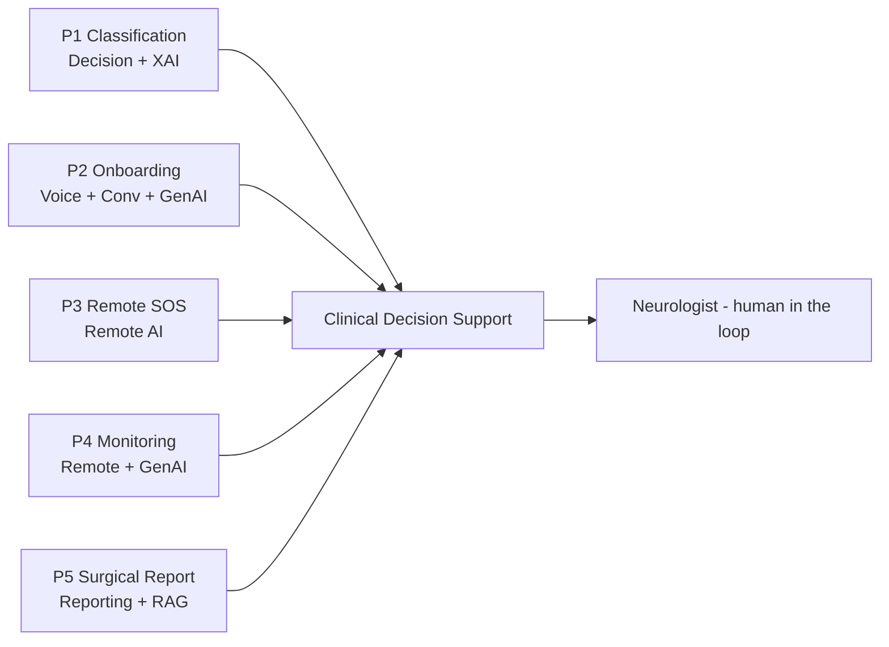

# Research Problems 1–5 (Master Framing) + AI Technology Map

> **Why (this doc):** Consolidates the DBA into five explicit research problems, each with its
> objective, the AI technology it uses (voice / conversational / remote / generative / decision /
> reporting AI), its data, and where it is implemented in this repo. **How:** a master table plus a
> problem-by-problem breakdown; anchors on patient EP001. Ties to
> [research-framework](research-framework.md), [hypotheses](analysis/hypotheses.md), and
> [variable dictionary](analysis/variable-dictionary.md).

## Master map

*Caption - The five research problems mapped to objective, AI technology, primary data, and implementing artefacts.*

| # | Research problem | Objective | AI technology | Key data | Implemented in |
|---|---|---|---|---|---|
| **1** | Classify epilepsy type, seizure type & severity **level** from assessment | Accurate, explainable multi-class + ordinal classification | **Decision AI** (classical ML + ordinal logistic) + **Explainable AI** | Primary assessment (9–10 roles), severity model | [primary-analysis](analysis/primary-analysis.md), [scenarios](scenarios/index.md), viewer scoring |
| **2** | Reduce onboarding time; get the assessment done by AI | Faster, complete intake without a clinician bottleneck | **Voice AI** + **Conversational AI** + **Generative AI** | Symptoms, history, PROs, questionnaires | [patient-onboarding](patient-onboarding.md) + voice layer (below) |
| **3** | Remote support: SOS, notification, alert | Timely emergency + graded support out of clinic | **Remote AI** + **Decision AI** | Wearable/app signals, seizure events | [remote-support-sos](remote-support-sos.md) |
| **4** | Continuous monitoring, notification, advisory | Detect deterioration early; advise proactively | **Remote AI** + **Generative AI** (advisory) | Wearable EEG, smartwatch, sleep, adherence | [remote-monitoring](remote-monitoring.md) |
| **5** | Build a recommendation **report** for the doctor (surgery) | AI-assisted, evidence-linked surgical-eval report | **Reporting AI** + **Decision AI** + **Generative AI (RAG)** | EEG + MRI + PET + video-EEG + neuropsych (multimodal) | [surgical-recommendation](surgical-recommendation.md) |

**Reason:** To show the five problems converging on one decision-support hub. **Why:** They are complementary stages of one care pathway, not isolated projects. **What is happening:** Classification, onboarding, remote support/monitoring, and reporting all feed the neurologist's decision. **How it is happening:** Each problem is a module with its own AI technology; the neurologist retains authority. **Reference:** Topol (2019).

## Problem 1 — Classification (Decision AI + Explainable AI)

Multi-class (epilepsy type, seizure type) + **ordinal severity level** classification from the
multi-role assessment. Taxonomy = the [scenario database](scenarios/index.md) (28 seizure types,
10 syndromes, 4 severity levels). Model = LASSO/RFE features → RF/logistic + ordinal logistic;
explained by SHAP/LIME; audited for fairness. **Result:** severity/drug-resistance AUC 0.969
(primary), fusion 0.976. See [hypotheses](analysis/hypotheses.md) H1–H5, H9.

## Problem 2 — Voice/Conversational/Generative onboarding

A **voice + conversational** GenAI intake agent conducts the assessment, validates completeness,
and pre-populates the [role questionnaires](primary-assessment/index.md), then risk-triages.
Voice adds accessibility + speed; the generative layer drafts the record for clinician confirmation.
See [patient-onboarding](patient-onboarding.md); KPIs = registration time, time-to-first-review,
missing-info rate, satisfaction.

## Problem 3 — Remote support, SOS, alerts (Remote AI)

Graded Green/Amber/Red/**SOS** alerts to patient + care team; status-epilepticus emergency
escalation to caregiver + EMS. See [remote-support-sos](remote-support-sos.md).

## Problem 4 — Continuous monitoring + advisory (Remote + Generative AI)

Wearable/app streams → deterioration-trend detection → proactive **advisory** notifications
(GenAI-worded guidance) + high-risk prioritisation. See [remote-monitoring](remote-monitoring.md).

## Problem 5 — Surgical recommendation report (Reporting AI + RAG)

A **reporting AI** assembles a multimodal, evidence-linked epilepsy-surgery evaluation report for
the neurologist/MDT — concordance of EEG + MRI + PET + video-EEG + neuropsychology — with the
clinician making the final decision. See [surgical-recommendation](surgical-recommendation.md).

## Professor Readiness (Defense Q&A)

**Q1: Are these five separate studies?** No — one care pathway; each problem is a module with a
distinct AI technology, evaluated against its own KPI, that feeds a shared decision-support hub.

**Q2: Which is the core contribution?** Problem 1 (explainable classification) is the scientific
core; Problems 2–5 operationalise it into a workflow (the DBA/enterprise contribution).

**Q3: Where is human oversight?** Every problem keeps the neurologist as the authority — AI
classifies, drafts, alerts, and reports; the clinician decides.

## References

Topol, E. J. (2019). *Deep medicine: How artificial intelligence can make healthcare human again*. Basic Books.

American Psychological Association. (2020). *Publication manual of the American Psychological Association* (7th ed.).
