# Research Vision & Objectives (Master Document)
## An Explainable AI–Driven Remote Epilepsy Care Platform for Faster Patient Onboarding, Continuous Monitoring, Brain Localization, and Clinical Decision Support

> **Why (this doc):** The dissertation must be repositioned from a narrow technical artifact — "EEG seizure detection" — into a defensible, enterprise-scale research programme about *epilepsy care delivery*. A committee does not award a DBA for a classifier; it awards it for a governed, explainable, human-supervised platform that measurably changes onboarding time, monitoring reach, localization confidence, and clinician workflow. This document is the single consolidated statement of that vision, its research spine, its six objectives, its architecture, and its mapping to the existing repository.
> **How:** By following the mandatory research spine (Problem → Sub-problems → Research Problem → Research Objective → Flow → Hypotheses → Statistical Analysis), then presenting the six-objective contract, the end-to-end architecture, the three-pipeline design, the data strategy, the novelty claim, and an objective-to-document crosswalk — each anchored to test patient EP001 (left temporal, F7/T7/P7, 92%), every table captioned, every heading self-explaining, and all mandated Mermaid diagram types plus a C4 context model rendered and explained.

**Overarching research question.** *Can an Explainable AI–enabled remote epilepsy care platform reduce patient onboarding time, support continuous monitoring, localize epileptogenic brain regions, and improve clinician workflow while maintaining human oversight?*

---

## 1. Problem

> **Why:** A doctoral dissertation must anchor to one concrete, defensible clinical-and-organizational gap before any engineering is proposed. **How:** State the epilepsy care-delivery gap in measurable terms tied to EP001, spanning access, continuity, localization, and decision support rather than detection alone.

Epilepsy care is fragmented across a slow front door (onboarding), long blind intervals between clinic visits (no continuous monitoring), reader-dependent and unexplained focus localization, and unaided, inconsistent clinical decisions. For EP001 — a 29-year-old right-handed married software engineer with focal impaired-awareness epilepsy of **left temporal** origin, ~5 seizures/month breaking through despite 88% adherence on Carbamazepine 400 mg BID and Levetiracetam 500 mg BID, 5.2 h poor sleep, reduced QOLIE-31, GAD-7 = 9, and driving restricted — the clinically decisive signals exist in daily life and in prior EEG/MRI but reach the care team late, unlocalized, and unexplained. The core problem is the **absence of an explainable, remote, human-supervised platform** that shortens onboarding, monitors continuously, localizes the epileptogenic focus with calibrated confidence, and supports the neurologist's decision — without removing the human from the loop.

*Caption — The table below decomposes the care-delivery problem into four observable gaps and the concrete consequence each imposes on EP001, justifying why a platform (not a detector) is required.*

| Care stage | Current reality | Consequence for EP001 | Platform remedy |
|---|---|---|---|
| Onboarding | Manual paper intake, long wait to first neurologist review | Delayed workup of a breakthrough patient | AI intake agent + structured questionnaires |
| Continuity | Seen every 3–6 months; blind between visits | Silent drift in sleep/adherence before relapse | Wearable + diary continuous monitoring |
| Localization | Visual EEG read, slow, reader-dependent, unquantified | Ambiguity on temporal-resection pathway | Channel→region model, focus + confidence |
| Decision support | Unaided, variable across clinicians | Third drug cycled blindly after two failures | Explainable CDSS with human confirm/override |

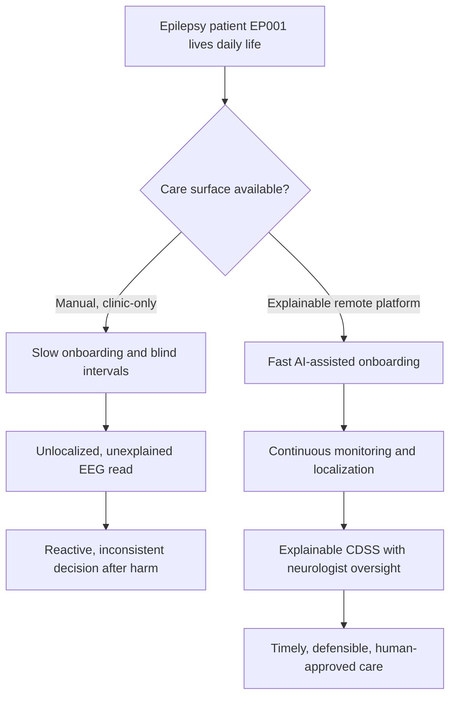

**Reason:** The problem must be visualised as two divergent care paths so the examiner sees exactly what the platform changes. **Why:** A single flowchart contrasts the reactive status quo against the proposed explainable path, making the value proposition non-verbal and immediate. **What is happening:** A decision node splits EP001's journey into a manual clinic-only branch (slow, blind, reactive) and a platform branch (fast onboarding, continuous localization, supervised decisions). **How it is happening:** The platform branch inserts an AI intake, a continuous-monitoring layer, and an explainable CDSS behind a human gate before any action reaches the patient. **Reference:** Topol (2019) on human-plus-AI care augmentation; Fisher et al. (2017) on focal seizure classification framing EP001's semiology.

---

## 2. Sub-Problems

> **Why:** One broad problem must be split into researchable, individually solvable units, each later demonstrable. **How:** Enumerate six sub-problems, one per downstream objective, so the spine and the objective contract stay aligned.

*Caption — This table maps each sub-problem to the data it consumes and the success signal that will later prove it solved, keeping every claim falsifiable.*

| # | Sub-problem | Primary data source | Success signal |
|---|---|---|---|
| SP1 | Onboarding is slow and incomplete | Registration + intake questionnaires | Reduced registration & time-to-review; lower missing-info rate |
| SP2 | No continuous surveillance between visits | Wearables, diary, sleep, adherence | Earlier deterioration detection; high-risk prioritization |
| SP3 | Focus is unlocalized and unexplained | EEG (10–20), MRI | Correct region + calibrated confidence (EP001 left temporal 92%) |
| SP4 | Clinical decisions are unaided and variable | Fused clinical + EEG features | Risk score + suggested workup accepted by neurologist |
| SP5 | AI predictions are black-box | Model internals, waveforms | Explanation chain validated by neurologist |
| SP6 | Human oversight is not designed-in | Feedback events | Every decision human-gated; model learns from feedback |

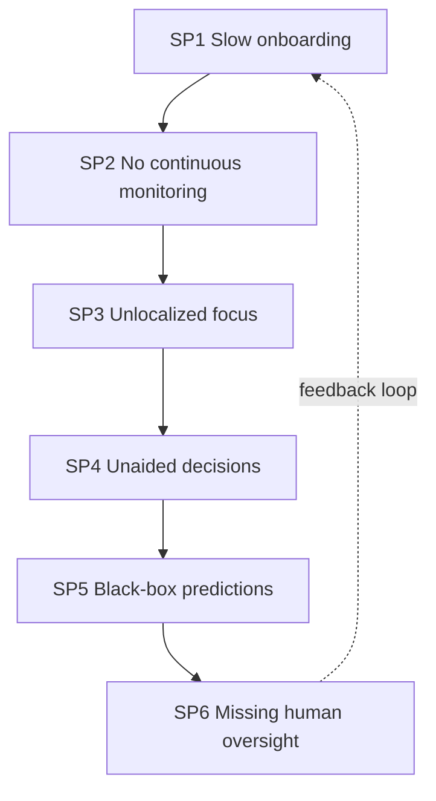

**Reason:** The sub-problems form a dependency chain that must be seen as a loop, not a list. **Why:** Ordering SP1→SP6 mirrors the patient's real path and shows oversight (SP6) feeding back into onboarding (SP1). **What is happening:** Each sub-problem hands its output to the next; the dashed edge closes the loop so feedback continuously improves the front door. **How it is happening:** The platform threads one patient record through all six stages, with the human-in-the-loop edge governing the cycle. **Reference:** Holzinger et al. (2019) on the necessity of explainability and human feedback in medical AI loops.

---

## 3. Research Problem

> **Why:** The examiner needs one crisp, testable statement that unifies all sub-problems. **How:** Frame the platform question as a single answerable research problem bound to EP001 and to human oversight.

**Research problem:** *Can an Explainable AI–enabled remote epilepsy care platform — spanning AI-assisted onboarding, continuous multimodal monitoring, EEG-based epileptogenic-focus localization, and explainable clinical decision support — reduce onboarding time, detect deterioration earlier, localize the focus with calibrated confidence, and improve clinician workflow for focal-epilepsy patients such as EP001, while keeping a neurologist in the loop for every decision?*

*Caption — This table sharpens the research problem into independent, dependent, and constraint variables so the study stays measurable and bounded.*

| Element | Definition in this study |
|---|---|
| Independent variables | Onboarding mode, monitoring streams, localization model, CDSS assistance, explanation presence |
| Dependent variables | Onboarding time, deterioration lead-time, localization accuracy/confidence, decision agreement, clinician effort |
| Constraint | Human oversight preserved; no autonomous clinical action |
| Population anchor | EP001 focal impaired-awareness epilepsy, left temporal, F7/T7/P7, 92% |

---

## 4. Research Objective

> **Why:** The problem must convert into concrete build-and-measure goals. **How:** State one overarching objective decomposed into six specific objectives (detailed in Section 8), each traceable to a sub-problem.

**Overarching objective.** Design, build, and evaluate an explainable, human-supervised remote epilepsy care platform and quantify its effect on onboarding time, continuous monitoring reach, focus-localization confidence, and clinician workflow — demonstrating enterprise care transformation, not a standalone detector.

*Caption — This table maps each specific objective one-to-one onto a sub-problem and a headline measurable target, demonstrating research completeness before the detailed contract in Section 8.*

| Objective | Addresses | Headline measurable target |
|---|---|---|
| O1 Faster onboarding | SP1 | Registration & time-to-first-review reduced ≥ 40% |
| O2 Continuous monitoring | SP2 | Deterioration lead-time ≥ 48 h; high-risk prioritized |
| O3 Brain localization | SP3 | Correct region, confidence within ±5% (EP001 92%) |
| O4 Clinical decision support | SP4 | CDSS–neurologist agreement κ ≥ 0.6 |
| O5 Explainability | SP5 | Full explanation chain validated per prediction |
| O6 Human-in-the-loop | SP6 | 100% decisions human-gated; measurable model uplift from feedback |

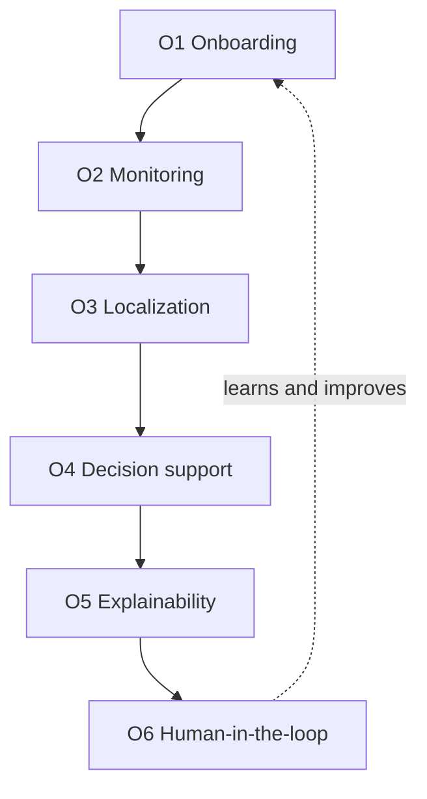

**Reason:** Objectives must be shown as an ordered, closed pipeline to prove coherence. **Why:** The flowchart demonstrates that the six objectives are sequential and mutually reinforcing, not a scatter of features. **What is happening:** Each objective feeds the next; O6's feedback edge returns to O1, closing the improvement loop. **How it is happening:** The platform realises each objective as a stage that consumes the prior stage's output under continuous human governance. **Reference:** Topol (2019); the objective ordering mirrors the enterprise stack in `00-overview.md`.

---

## 5. Flow (End-to-End Runtime)

> **Why:** A defense requires an auditable end-to-end picture of how a patient becomes an explained, human-approved decision. **How:** Present the runtime as a stage table and a `sequenceDiagram` across patient, app, AI, and clinician roles.

*Caption — This table traces one EP001 encounter through each runtime stage so the reviewer can audit where value and risk enter the system.*

| Stage | Actor/component | Input | Output |
|---|---|---|---|
| 1 Onboard | Patient + AI intake agent | Registration, questionnaires (QOLIE-31, NDDI-E, GAD-7) | Structured intake record |
| 2 Monitor | Wearables + mobile diary | EEG patch, HR, sleep, adherence, seizures | Daily risk vector |
| 3 Localize | EEG model | 10–20 EEG, MRI | Focus + confidence (left temporal, 92%) |
| 4 Support | CDSS engine | Fused features | Risk score, epilepsy type, suggested workup |
| 5 Explain | XAI layer | Prediction | Region → waveform → feature → clinical narrative |
| 6 Govern | Neurologist | Explained recommendation | Confirm / override + feedback |

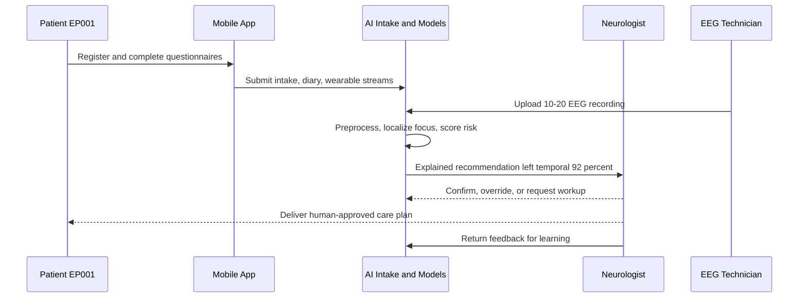

**Reason:** The runtime must show ordered interaction over time between humans and AI. **Why:** A sequence diagram makes explicit that the AI never contacts the patient with a decision — the neurologist always mediates. **What is happening:** The patient and EEG technician feed data in; the AI localizes and scores; the neurologist receives an explained recommendation, decides, and returns feedback. **How it is happening:** Messages flow through the mobile app and platform, with the neurologist as the sole decision authority and the feedback edge closing the loop. **Reference:** Sendak et al. (2020) on presenting model information to clinical end users; Rosenow & Lüders (2001) on the localization workup EP001 enters.

---

## 6. Hypotheses

> **Why:** Falsifiable hypotheses make the programme scientific rather than descriptive. **How:** State six hypotheses H1–H6, one per objective, each paired with the statistic that will test it (executed in Section 7).

*Caption — The hypothesis table pairs each null with its alternative and the test statistic, so the analysis plan is transparent and each objective is independently falsifiable.*

| ID | Objective | Null (H0) | Alternative (H1) | Test / statistic |
|---|---|---|---|---|
| H1 | O1 Onboarding | Platform onboarding time = manual baseline | Platform reduces onboarding time | Paired t-test / Mann–Whitney U |
| H2 | O2 Monitoring | Monitoring gives no lead-time vs chance | Lead-time ≥ 48 h before deterioration | One-sample t-test / Cox survival |
| H3 | O3 Localization | Model focus = chance; confidence uncalibrated | Localizes above chance, calibrated | Binomial vs chance + Brier / ECE |
| H4 | O4 Decision support | CDSS–neurologist agreement = chance | Agreement above chance | Cohen κ + McNemar |
| H5 | O5 Explainability | Explanations do not raise clinician agreement/trust | Explanations raise agreement | Paired t-test / Wilcoxon signed-rank |
| H6 | O6 Human-in-the-loop | Feedback iterations do not improve model | Performance improves across iterations | Repeated-measures ANOVA / trend test |

---

## 7. Statistical Analysis

> **Why:** The examiner will probe how each claim becomes a number. **How:** Bind every hypothesis to a metric, method, threshold, and EP001 read, then show the validation loop as a flowchart.

*Caption — This table lists, per objective, the metric, its plain meaning, the acceptance threshold, and how EP001 illustrates it, making every result defensible.*

| Metric (objective) | Meaning | Method | Acceptance threshold | EP001 read |
|---|---|---|---|---|
| Onboarding time (O1) | Registration → first review | Paired t / Mann–Whitney | ≥ 40% reduction | Same-day review vs multi-day |
| Deterioration lead-time (O2) | Warning → relapse interval | One-sample t / Cox | ≥ 48 h | Sleep+adherence trend flagged early |
| Localization accuracy (O3) | Correct lobe × hemisphere | Confusion matrix | ≥ 90% | Left temporal correct |
| Confidence calibration (O3) | Reported vs empirical | Reliability curve, ECE | ECE ≤ 0.05 | 92% within ±5% band |
| Decision agreement (O4) | CDSS vs neurologist | Cohen κ | κ ≥ 0.60 | Concordant workup |
| Explanation uplift (O5) | Agreement pre/post explanation | Wilcoxon | Δ > 0 | F7/T7/P7 narrative accepted |
| Feedback uplift (O6) | Accuracy across iterations | RM-ANOVA / trend | Positive slope | Model improves post-feedback |

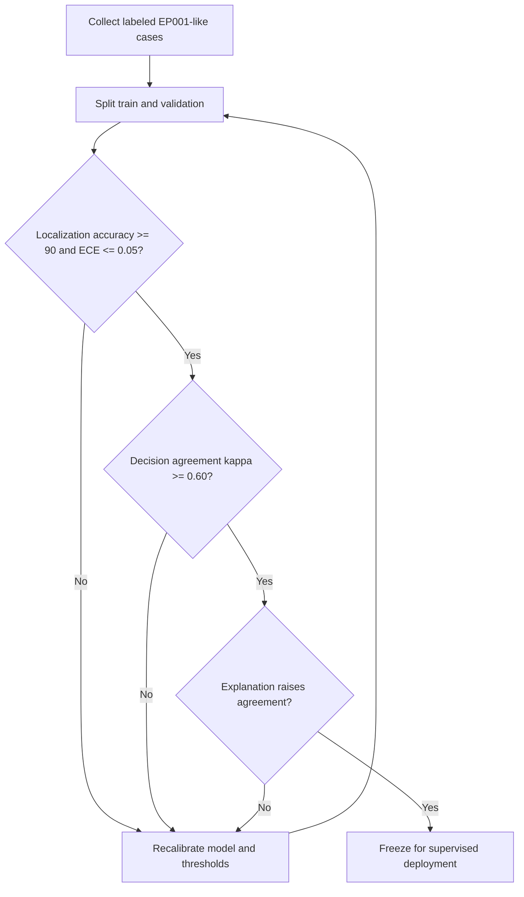

**Reason:** The analysis plan must be shown as a gated loop, not a single pass. **Why:** The flowchart proves the platform is only deployed after localization, agreement, and explainability thresholds are all cleared. **What is happening:** Labeled cases are split, and three sequential gates (accuracy/calibration, agreement, explanation uplift) must pass or the model is recalibrated. **How it is happening:** Failing any gate returns to recalibration; passing all three freezes the model for human-supervised deployment. **Reference:** APA (2020) on transparent analysis reporting; Lundberg & Lee (2017) on attribution fidelity underpinning the explanation gate.

---

## 8. The Six Objectives (Detailed Contract)

> **Why:** Each objective must be a measurable contract, not a slogan, so the committee can hold the work accountable. **How:** Give each objective its sub-research-question, primary KPI(s), baseline-vs-target, and the data it uses.

*Caption — This is the master objective contract: for each of O1–O6 it states the sub-question, KPI(s), baseline→target, and data, making the dissertation's promises explicit and testable.*

| Objective | Sub research-question | Primary KPI(s) | Baseline → Target | Data used |
|---|---|---|---|---|
| **O1 Reduce onboarding time** | Can AI-assisted intake onboard a patient faster and more completely? | Registration time; time-to-first-neurologist-review; missing-clinical-info rate; patient satisfaction | Registration ~30 min → < 10 min; review days → same-day; missing-info 25% → < 5%; satisfaction ↑ | Registration form, intake questionnaires (QOLIE-31, NDDI-E, GAD-7), demographics |
| **O2 Continuous remote monitoring** | Can continuous multimodal monitoring detect deterioration earlier and prioritize high-risk patients? | Deterioration lead-time; high-risk prioritization precision; avoided unnecessary visits | Reactive (post-relapse) → ≥ 48 h lead; ad-hoc → ranked queue; baseline visits → measurable reduction | Wearable EEG, smartwatch physiology, sleep, adherence, seizure diary |
| **O3 Brain localization** | Can the platform localize the epileptogenic focus with calibrated confidence clinicians accept? | Localization accuracy; calibrated confidence; affected electrodes | No quantified focus → correct region + ±5% confidence | 10–20 EEG, MRI (EP001: left temporal, F7/T7/P7, 92%) |
| **O4 Clinical decision support** | Can the platform produce decisions a neurologist accepts? | Risk score; likely epilepsy type; suggested investigations; medication considerations; admission need; follow-up priority | Unaided/variable → κ ≥ 0.60 agreement | Fused clinical + EEG features, guideline knowledge base |
| **O5 Explainability** | Can every prediction be explained end-to-end and validated? | Explanation chain completeness; explanation fidelity; neurologist validation rate | Black-box → full chain validated per case | Model internals, Grad-CAM/SHAP, waveforms |
| **O6 Human-in-the-loop** | Can human oversight be designed-in and shown to improve the model? | % human-gated decisions; feedback-driven performance uplift | 0% designed oversight → 100% gated + positive uplift | Feedback events, override logs, iteration metrics |

*Caption — The explanation chain for O5, shown as a network, is the auditable path from a raw prediction to a validated clinical narrative for EP001.*

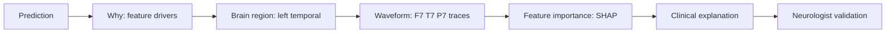

**Reason:** O5's explainability must be shown as an explicit chain, not a claim. **Why:** The network renders the exact ordered path — prediction → why → region → waveform → feature importance → clinical explanation → validation — that the committee can audit. **What is happening:** Each node transforms the prior artifact into a more clinically legible one, ending at human validation. **How it is happening:** Grad-CAM localises spatially, SHAP attributes per-electrode, and the platform composes a narrative the neurologist signs off. **Reference:** Selvaraju et al. (2020) Grad-CAM; Lundberg & Lee (2017) SHAP; detailed in `pipeline-a/phase-11-explainable-ai.md` and `pipeline-b/phase-12-eeg-explainable-ai.md`.

*Caption — The journey below models EP001's lived experience across all six objectives, exposing where confidence is built and where friction may occur.*

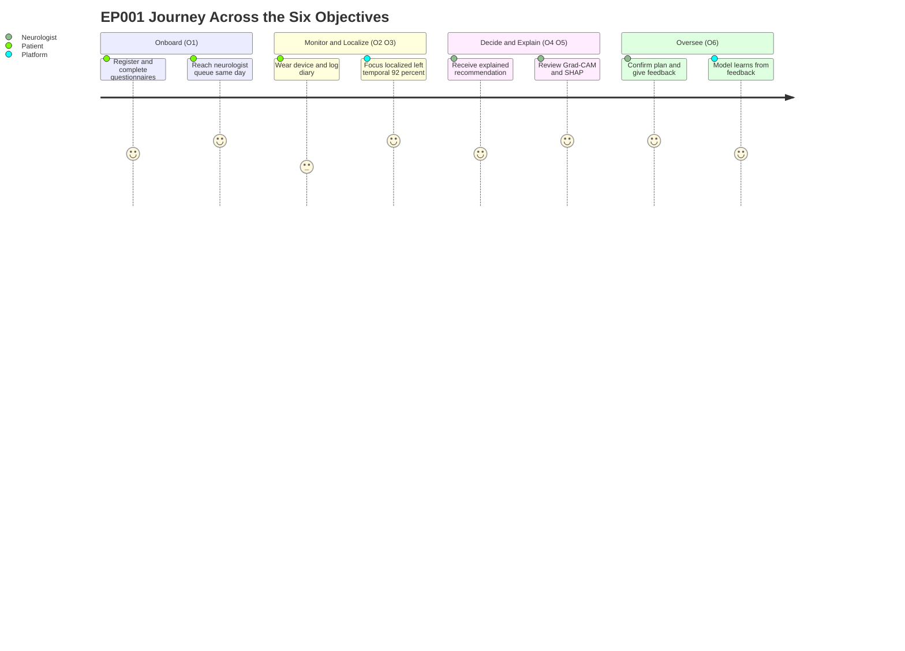

**Reason:** The objectives must be felt from the human's point of view, not only measured. **Why:** A journey map surfaces satisfaction and friction across the six objectives, complementing the quantitative KPIs. **What is happening:** EP001 moves from onboarding through monitoring, localization, explained decision, and oversight, with satisfaction scores per step. **How it is happening:** Each objective is a journey section; the neurologist's confirmation and the platform's learning close the experience loop. **Reference:** Cramer et al. (1998) QOLIE-31 as the patient-experience instrument grounding the journey's satisfaction dimension.

---

## 9. End-to-End Architecture

> **Why:** The committee must see the full technical path from patient to treatment plan in one governed picture. **How:** Render the architecture as a `flowchart TD` and a C4-style context model, each with a detailed prose block.

*Caption — This flowchart is the canonical end-to-end architecture: every component from patient device to neurologist dashboard and treatment plan, in order.*

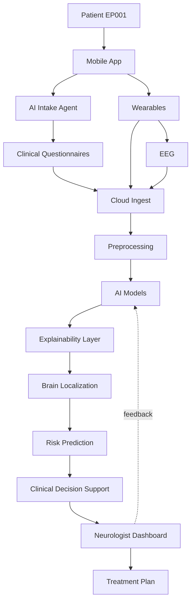

**Reason:** A dissertation architecture must be a single legible spine from input to plan. **Why:** The flowchart proves the platform is end-to-end and that explainability and localization sit *before* decision support, not bolted on. **What is happening:** Patient data enters via app, intake, wearables, and EEG; the cloud preprocesses and runs models; explainability, localization, and risk feed CDSS; the neurologist dashboard produces the plan and returns feedback. **How it is happening:** Each stage is a governed component; the feedback edge from the dashboard to the models realises O6. **Reference:** `00-overview.md` enterprise stack; Topol (2019) on end-to-end augmented care.

*Caption — The C4 context model (Level 1) situates the platform among its human actors and external systems, clarifying trust boundaries for governance.*

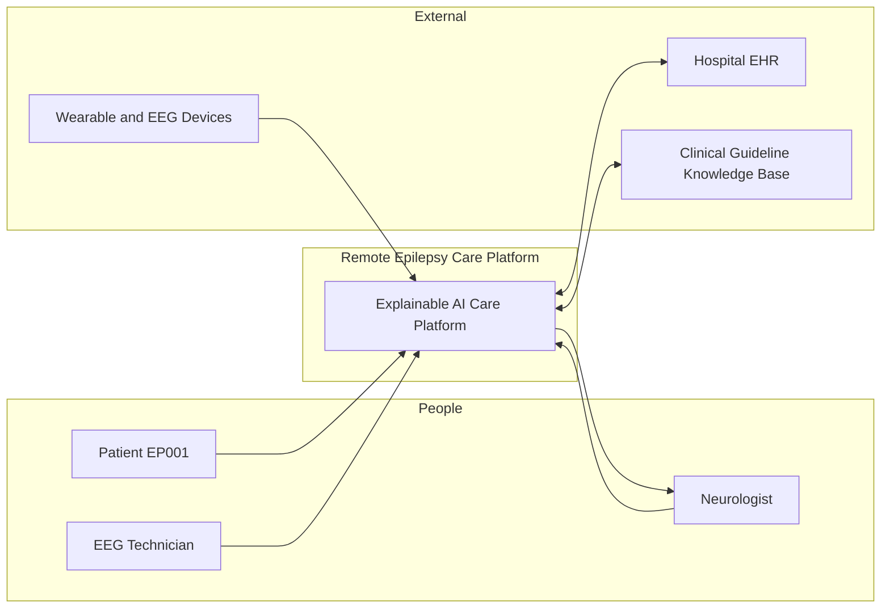

**Reason:** Governance requires an explicit map of who and what the platform touches. **Why:** A C4 Level-1 context model names every actor and external system and the trust boundary around the platform. **What is happening:** Patient, technician, and devices supply data; the platform integrates the EHR and a guideline knowledge base and returns explained output to the neurologist. **How it is happening:** The platform is the single system-in-focus; bidirectional edges to EHR/knowledge base show governed integration, and the neurologist edge shows human authority. **Reference:** Sendak et al. (2020) on situating clinical AI within organizational systems and oversight.

---

## 10. Three-Pipeline Design

> **Why:** The platform's internal engineering must be shown as separable, testable pipelines that map to the existing repository. **How:** Render the pipelines as a `graph LR` network and map each to its implementing docs in a table.

*Caption — This network shows the three-pipeline design: primary clinical analytics and secondary EEG deep learning feed a multimodal fusion + RAG + CDSS core, all under an enterprise platform and evaluation wrapper.*

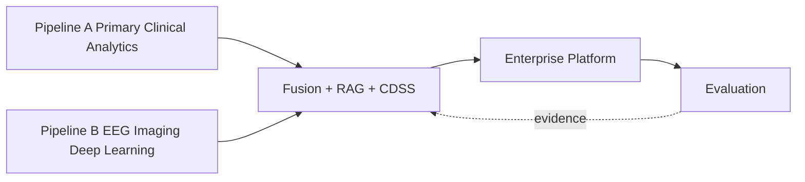

**Reason:** The engineering must be decomposed into independently defensible pipelines. **Why:** The network makes explicit that fusion is the research pivot where clinical and EEG streams meet, wrapped by platform and evaluation layers. **What is happening:** Pipeline A (clinical) and Pipeline B (EEG/imaging) both feed the fusion + RAG + CDSS core, which the enterprise platform hosts and the evaluation layer measures. **How it is happening:** Each pipeline is a directory/document in the repo (see table); the dashed evidence edge returns evaluation findings to fusion for continuous improvement. **Reference:** `pipeline-c-multimodal.md` designates fusion as the primary DBA contribution; Roy et al. (2019) on EEG deep learning underpinning Pipeline B.

*Caption — This table maps each pipeline of the design to the existing repository documents that implement it, so the vision is traceable to already-authored work.*

| Pipeline | Role in design | Implementing repo docs |
|---|---|---|
| **A — Primary clinical analytics** | Clinical assessment, questionnaires, medication, neurologist workflow → clinical risk | `docs/pipeline-a/` (16 phases, `index.md`) |
| **B — Secondary EEG/imaging deep learning** | EEG signal processing, biomarkers, deep localization → EEG abnormality/focus | `docs/pipeline-b/` (16 phases, `index.md`) |
| **Fusion (+ RAG + CDSS)** | Combine clinical + EEG, retrieve evidence, support decision | `docs/pipeline-c-multimodal.md` |
| **Platform** | RAG, orchestration, deployment, monitoring, governance | `docs/pipeline-d-enterprise-platform.md` |
| **Evaluation** | Clinical + AI + business + governance validation | `docs/pipeline-e-evaluation.md` |

---

## 11. Primary vs Secondary Data

> **Why:** A multimodal claim must be grounded in an explicit inventory of what is primary versus secondary data. **How:** Tabulate each source, its type, and its role for EP001.

*Caption — This table separates primary data (collected directly from the patient encounter) from secondary data (instrument- and record-derived), justifying the multimodal fusion claim.*

| Class | Source | Modality | Role for EP001 |
|---|---|---|---|
| Primary | Patient assessment forms | Structured self-report | Symptom, trigger, adherence capture |
| Primary | Patient-reported outcomes (QOLIE-31, NDDI-E, GAD-7) | Scored instruments | QOL reduced; GAD-7 = 9; mood screen |
| Primary | Clinical examination / history | Clinician-entered | Focal impaired-awareness, left temporal |
| Secondary | EEG (10–20, video-EEG) | Neurophysiology signal | Focus localization F7/T7/P7 |
| Secondary | MRI | Structural imaging | Left-temporal correlate |
| Secondary | ECG | Cardiac signal | Autonomic/seizure differential |
| Secondary | Laboratory results | Assays | Drug levels, metabolic triggers |
| Secondary | Prior clinical reports | Documents | Historical context for RAG |

---

## 12. Dataset Strategy

> **Why:** Development and clinical-workflow validation need different data, and the committee will probe data provenance and ethics. **How:** Tabulate a hybrid strategy — public data for model development/validation, a retrospective de-identified linked hospital dataset for clinical-workflow validation — with the rationale.

*Caption — This table defines the hybrid dataset strategy: public corpora build and validate the models, while a collaborator-provided retrospective dataset validates the clinical workflow, balancing reproducibility with ecological validity.*

| Purpose | Dataset | Access/ethics | Rationale |
|---|---|---|---|
| Model development & validation | Temple University Hospital EEG Corpus (TUH) | Public, de-identified | Largest open clinical EEG corpus; reproducible benchmarking |
| Model development & validation | Siena Scalp EEG Database | Public, de-identified | Focal-epilepsy scalp EEG for localization validation |
| Clinical-workflow validation | Retrospective de-identified linked hospital dataset | Via clinical collaborator, IRB/governance | Real onboarding→decision workflow, ecological validity |

**Hybrid rationale.** Public corpora (TUH, Siena) provide reproducible, citable model benchmarks that any examiner can verify, but they lack the end-to-end care-delivery signals (onboarding times, workflow, clinician decisions) the platform claims to improve. A retrospective, de-identified, linked hospital dataset — obtained through a clinical collaborator under governance — supplies that workflow evidence without the cost and risk of a prospective trial. Together they satisfy both **internal validity** (reproducible model performance) and **external validity** (real clinical workflow), which neither source achieves alone.

---

## 13. Novelty Statement

> **Why:** The committee must see precisely why this is doctoral-level and not an incremental classifier paper. **How:** Contrast the narrow detection question against the broad platform question this dissertation answers.

*Caption — This table contrasts the old framing ("can AI detect epilepsy from EEG?") with the repositioned platform question, isolating the dissertation's novel contribution.*

| Dimension | Narrow framing | This dissertation's framing |
|---|---|---|
| Question | Can AI detect epilepsy from EEG? | Can an explainable remote platform improve onboarding, monitoring, localization, and decisions under human oversight? |
| Unit of value | A classifier's accuracy | Care-delivery outcomes and clinician workflow |
| Explainability | Optional | Mandatory, end-to-end, validated |
| Human role | Replaced/absent | Designed-in, decision authority, feedback source |
| Scope | Single model | Enterprise multimodal platform (A→B→Fusion→Platform→Evaluation) |
| Discipline fit | Technical PhD | DBA — organizational transformation + measurable value |

**Novelty.** The contribution is not a better seizure detector; comparable detectors exist. The novelty is an **explainable, human-supervised, remote epilepsy care platform** that treats detection as one embedded step inside a governed pipeline whose outcome variables are onboarding time, deterioration lead-time, localization confidence, decision agreement, and clinician effort — measured against real workflow data. The dissertation answers the *delivery* question, not the *detection* question.

---

## 14. Objective-to-Document Crosswalk

> **Why:** The vision is only credible if each objective already maps to concrete, authored implementation in the repository. **How:** Tabulate each objective against the doc(s) that implement it, flagging the one companion doc still to be authored.

*Caption — This crosswalk ties every objective (O1–O6) to the existing repository document(s) that implement it, proving the vision is realised, not aspirational.*

| Objective | Implementing repo document(s) | Status |
|---|---|---|
| O1 Faster onboarding | `docs/patient-onboarding.md` | Companion doc (to be authored) |
| O2 Continuous monitoring | `docs/remote-monitoring.md` | Implemented |
| O3 Brain localization | `docs/brain-localization.md` | Implemented |
| O4 Clinical decision support | `docs/pipeline-a/phase-13-clinical-decision-support.md` (+ `pipeline-b/phase-14-eeg-cdss.md`) | Implemented |
| O5 Explainability | `docs/pipeline-a/phase-11-explainable-ai.md` & `docs/pipeline-b/phase-12-eeg-explainable-ai.md` | Implemented |
| O6 Human-in-the-loop | Across pipelines (`pipeline-c-multimodal.md`, `pipeline-d-enterprise-platform.md`, `pipeline-e-evaluation.md`) | Implemented |

*Caption — This flowchart shows the crosswalk as traceability: each objective resolves to a document, and the whole set rolls up to the DBA contributions.*

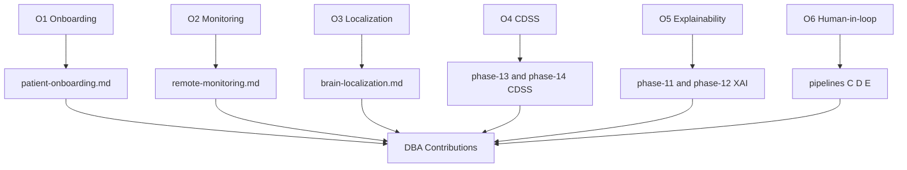

**Reason:** Traceability from objective to artifact is what makes a vision defensible. **Why:** The flowchart proves each of the six objectives lands in a concrete document and that they converge on the DBA contributions. **What is happening:** Every objective node points to its implementing doc, and all docs roll up to the contributions node. **How it is happening:** The repository already contains five of six implementing docs; only `patient-onboarding.md` remains to be authored as the O1 companion. **Reference:** `00-overview.md` three central contributions; `COVERAGE-MATRIX.md` for gap tracking.

---

## 15. Professor Readiness (Defense Q&A)

> **Why:** Anticipating examiner challenges demonstrates command of the vision's scope, novelty, and limits. **How:** Pre-answer the likely questions with concise reasoning, tables, or logic.

### Q1. Why reposition from EEG seizure detection to a platform — isn't detection the hard part?

> **Why:** The committee will suspect scope inflation. **How:** Distinguish solved detection from unsolved delivery.

Detection is comparatively mature and available off-the-shelf; the unsolved, doctoral-level problem is *care delivery* — onboarding speed, continuous reach, explained localization, decision agreement, and preserved human oversight. This dissertation embeds detection as one step (Pipeline B) inside a governed platform whose outcome variables are delivery metrics, not classifier accuracy. That is a DBA contribution (organizational transformation), not a technical-PhD one.

### Q2. How is human oversight guaranteed rather than merely claimed?

> **Why:** "Human-in-the-loop" is easily asserted and rarely designed. **How:** Point to the architecture and hypothesis H6.

The architecture (Section 9) routes every recommendation to the Neurologist Dashboard before any action reaches the patient; the AI never issues a decision directly (Section 5 sequence). O6's KPI requires 100% of decisions human-gated, and H6 formally tests whether neurologist feedback measurably improves the model over iterations (repeated-measures ANOVA). Oversight is a measured variable, not a promise.

### Q3. Why validate on both public corpora and a private hospital dataset?

> **Why:** Data provenance and generalizability are standard critiques. **How:** Separate internal from external validity.

*Caption — This table shows why neither data source alone suffices.*

| Need | Public (TUH, Siena) | Retrospective hospital |
|---|---|---|
| Reproducible model benchmarking | Yes | No |
| Real onboarding/workflow signals | No | Yes |
| Ecological validity | Limited | Yes |

Public corpora give reproducible, citable model performance; the collaborator dataset gives real workflow outcomes. Together they satisfy internal and external validity that neither achieves alone.

### Q4. How do you know the 92% localization confidence for EP001 is trustworthy?

> **Why:** Calibration is the crux of clinical trust. **How:** Point to H3 and the calibration method.

The 92% is a temperature-scaled probability calibrated against a held-out validation set so reported confidence matches empirical accuracy within ±5% (ECE ≤ 0.05, H3). Grad-CAM and SHAP agree on the F7/T7/P7 left-temporal chain, and disagreement routes to expert read rather than auto-report (`brain-localization.md`). Confidence is calibrated, explained, and human-gated.

### Q5. Is a single test patient (EP001) enough to defend the platform?

> **Why:** Single-case generalization is a routine critique. **How:** Separate illustration from validation.

EP001 is the walkthrough case that makes the vision concrete; validation runs on public cohorts (TUH, Siena) and the retrospective hospital dataset against the Section 7 thresholds. The framework is region- and cohort-general; EP001 illustrates it, it does not define it.

---

## 16. References

> **Why:** Defensible claims require real, citable sources. **How:** APA 7th edition entries spanning epilepsy classification, medical AI, localization, telehealth onboarding, patient-reported outcomes, and reporting standards.

American Psychological Association. (2020). *Publication manual of the American Psychological Association* (7th ed.). https://doi.org/10.1037/0000165-000

Cramer, J. A., Perrine, K., Devinsky, O., Bryant-Comstock, L., Meador, K., & Hermann, B. (1998). Development and cross-cultural translations of a 31-item quality of life in epilepsy inventory (QOLIE-31). *Epilepsia, 39*(1), 81–88. https://doi.org/10.1111/j.1528-1157.1998.tb01278.x

Fisher, R. S., Cross, J. H., French, J. A., Higurashi, N., Hirsch, E., Jansen, F. E., Lagae, L., Moshé, S. L., Peltola, J., Roulet Perez, E., Scheffer, I. E., & Zuberi, S. M. (2017). Operational classification of seizure types by the International League Against Epilepsy: Position paper of the ILAE Commission for Classification and Terminology. *Epilepsia, 58*(4), 522–530. https://doi.org/10.1111/epi.13670

Holzinger, A., Langs, G., Denk, H., Zatloukal, K., & Müller, H. (2019). Causability and explainability of artificial intelligence in medicine. *WIREs Data Mining and Knowledge Discovery, 9*(4), e1312. https://doi.org/10.1002/widm.1312

Lundberg, S. M., & Lee, S. I. (2017). A unified approach to interpreting model predictions. *Advances in Neural Information Processing Systems, 30*, 4765–4774.

Rosenow, F., & Lüders, H. (2001). Presurgical evaluation of epilepsy. *Brain, 124*(9), 1683–1700. https://doi.org/10.1093/brain/124.9.1683

Roy, S., Kiral-Kornek, I., & Harrer, S. (2019). ChronoNet: A deep recurrent neural network for abnormal EEG identification. In *Artificial intelligence in medicine* (pp. 47–56). Springer. https://doi.org/10.1007/978-3-030-21642-9_8

Selvaraju, R. R., Cogswell, M., Das, A., Vedantam, R., Parikh, D., & Batra, D. (2020). Grad-CAM: Visual explanations from deep networks via gradient-based localization. *International Journal of Computer Vision, 128*(2), 336–359. https://doi.org/10.1007/s11263-019-01228-7

Sendak, M. P., Gao, M., Brajer, N., & Balu, S. (2020). Presenting machine learning model information to clinical end users with model facts labels. *npj Digital Medicine, 3*, 41. https://doi.org/10.1038/s41746-020-0253-3

Topol, E. J. (2019). High-performance medicine: The convergence of human and artificial intelligence. *Nature Medicine, 25*(1), 44–56. https://doi.org/10.1038/s41591-018-0300-7
