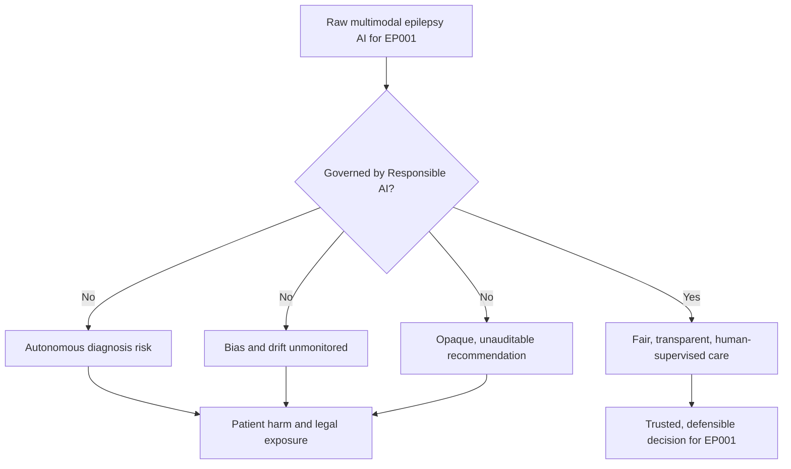
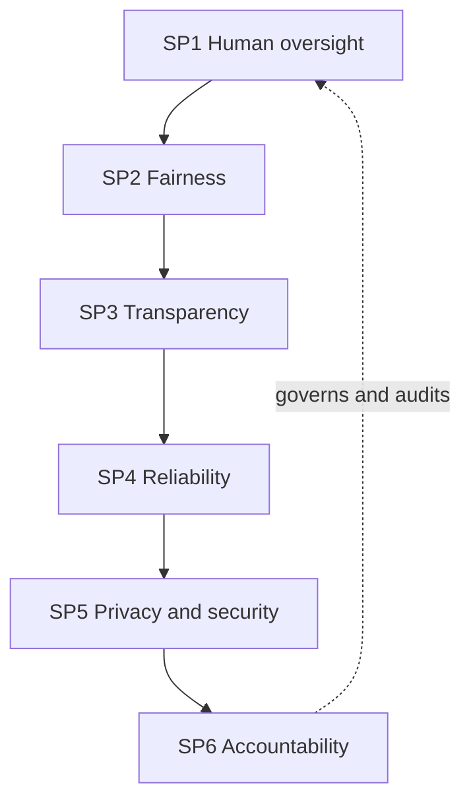
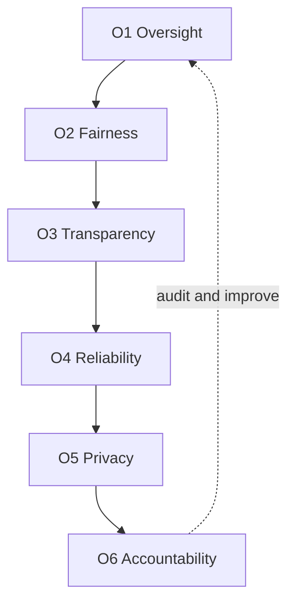
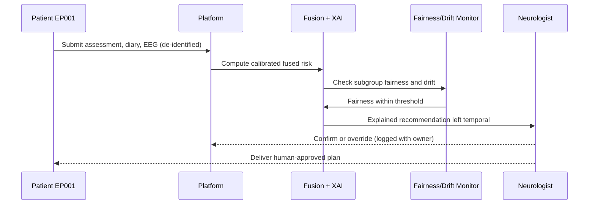
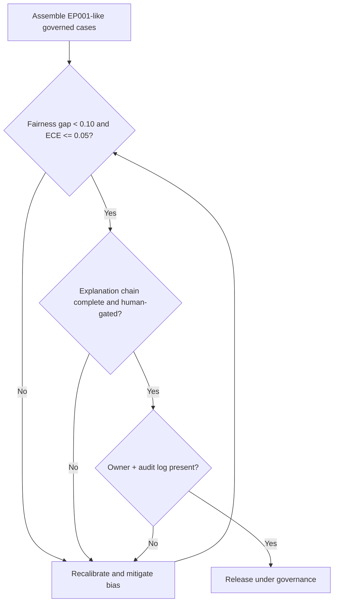
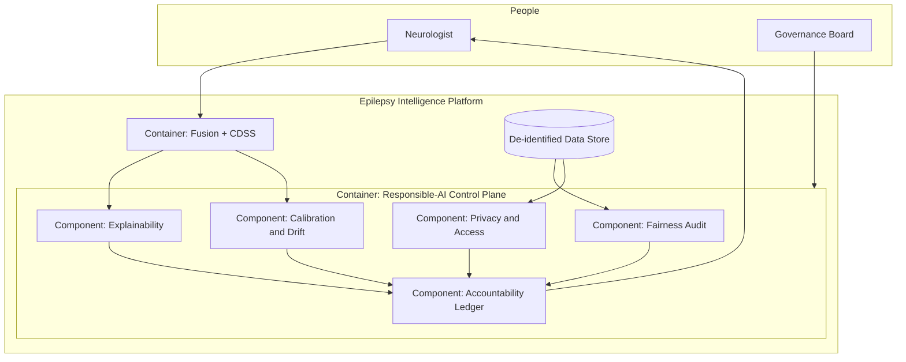
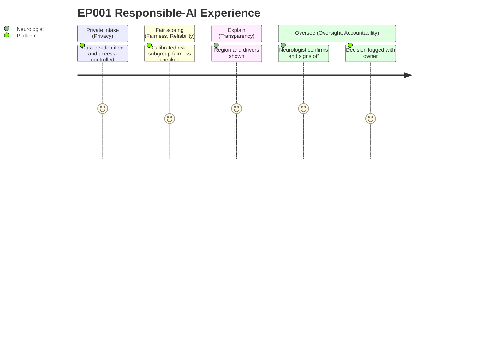

# Responsible AI — Umbrella Framework (Epilepsy, EP001)

> **Why (this doc):** A DBA committee will not accept "we used AI responsibly" as a slogan; it demands a named, operationalised framework showing *which* principles govern an epilepsy care platform and *how* each is enforced in code, workflow, and governance. This document is the umbrella under which the accountable, explainable, and interpretable pillars sit — it states the principles and maps every one to a concrete platform mechanism, a measurable KPI, and a real repository artefact.
> **How:** By following the mandatory research spine (Problem → Sub-problems → Research Problem → Research Objective → Flow → Hypotheses → Statistical Analysis), then giving a DEFINITION table, a MECHANISMS/CONTROLS table, and a KPI/METRICS table, a repo-implementation crosswalk, all four Mermaid diagram types plus a C4-style model — each anchored to index patient EP001 (29M, right-handed software engineer, focal impaired-awareness epilepsy of **left temporal** origin, F7/T7/P7, ~5 seizures/month on Carbamazepine + Levetiracetam, reduced QOLIE-31, GAD-7 = 9, driving restricted).

**Overarching question.** *Can the epilepsy platform's Responsible-AI principles be made operational — enforced by concrete mechanisms, measured by thresholds, and traceable to code — so that every EP001 recommendation is fair, transparent, human-supervised, and auditable rather than merely well-intentioned?*

---

## 1. Problem

> **Why:** A doctoral programme must anchor Responsible AI to one concrete, defensible governance gap, not to abstract ethics. **How:** State the gap between raw model capability and safe, accountable epilepsy care in terms tied to EP001.

An epilepsy platform can fuse EP001's clinical assessment, medication adherence, sleep, trigger burden, and EEG into a single drug-resistance risk and a left-temporal localisation. Delivered ungoverned, that capability creates five failure modes: (a) implied autonomous diagnosis without neurologist sign-off, (b) hidden bias — a risk score less calibrated for a young male focal-onset cohort, (c) silent performance drift as EEG hardware or prescribing patterns change, (d) opaque recommendations the neurologist cannot audit, and (e) privacy exposure of sensitive neurological data. The core problem is therefore **not model accuracy but institutional accountability** for how an epilepsy AI is designed, monitored, explained, and retired around a patient like EP001.

*Caption — This table decomposes the single "ungoverned capability" problem into the five concrete Responsible-AI failure modes it causes for EP001, motivating the framework.*

| Failure mode | Manifestation for EP001 | Responsible-AI principle violated |
|---|---|---|
| Implied autonomous diagnosis | Platform "diagnoses" left-temporal epilepsy without neurologist confirm | Human oversight |
| Hidden bias | 73% risk less calibrated for young male focal cohort | Fairness |
| Silent drift | 512 Hz EEG pipeline changes; model degrades unnoticed | Reliability |
| Opaque output | Neurologist cannot see why risk is high | Transparency / explainability |
| Data exposure | 21-channel EEG + medication data leaked | Privacy & security |

**Reason:** The problem must be shown as two divergent paths so the examiner sees exactly what the framework prevents. **Why:** A single flowchart contrasts ungoverned capability (harm, liability) against the governed path (trusted care). **What is happening:** A decision node splits EP001's recommendation into an ungoverned branch (autonomous, biased, opaque) and a governed branch (fair, transparent, supervised). **How it is happening:** The governed branch inserts fairness, transparency, reliability, and human-oversight controls before any output reaches the patient. **Reference:** Jobin, Ienca & Vayena (2019) on the convergence of AI ethics principles; Topol (2019) on human-plus-AI care.

---

## 2. Sub-Problems

> **Why:** One broad accountability problem must split into researchable, individually enforceable principles. **How:** Enumerate one sub-problem per Responsible-AI principle so the framework stays complete and auditable.

*Caption — This table maps each sub-problem to the principle that resolves it and the owning role, ensuring no Responsible-AI dimension is orphaned.*

| # | Sub-problem | Resolving principle | Primary owner |
|---|---|---|---|
| SP1 | Recommendations may be issued without a human gate | Human oversight | Neurologist |
| SP2 | The model may be unfair across sex/age subgroups | Fairness | ML Lead |
| SP3 | Outputs may be black-box and unauditable | Transparency / explainability | Explainability Officer |
| SP4 | Performance may drift silently over time | Reliability & safety | ML Lead |
| SP5 | Sensitive EEG/medication data may leak | Privacy & security | Security Officer |
| SP6 | No one may be answerable when the model errs | Accountability | Governance Board |

**Reason:** The principles form a governance cycle, not a checklist. **Why:** Ordering SP1→SP6 shows oversight first and accountability closing the loop back to oversight. **What is happening:** Each principle constrains the next; the dashed edge returns accountability to the human gate. **How it is happening:** The platform threads every EP001 decision through all six principles under a governance board. **Reference:** Floridi et al. (2018) AI4People framework; Jobin et al. (2019).

---

## 3. Research Problem

> **Why:** The examiner needs one crisp, testable statement unifying all six principles. **How:** Frame Responsible AI as a single answerable operationalisation question bound to EP001.

**Research problem:** *Can the six Responsible-AI principles — human oversight, fairness, transparency, reliability, privacy, and accountability — be operationalised as enforced platform mechanisms, measured by pre-registered thresholds, and traced to concrete repository artefacts, such that every recommendation issued for a focal-epilepsy patient like EP001 is demonstrably responsible rather than merely claimed to be?*

*Caption — This table sharpens the research problem into independent, dependent, and constraint variables so the study stays measurable and bounded.*

| Element | Definition in this study |
|---|---|
| Independent variables | Presence/absence of each principle's control (oversight gate, fairness audit, explanation layer, drift monitor, access control) |
| Dependent variables | % human-gated decisions, parity/equal-opportunity gaps, explanation completeness, calibration/drift, audit-log coverage |
| Constraint | Non-device decision support; neurologist retains authority; no autonomous diagnosis |
| Population anchor | EP001 focal impaired-awareness epilepsy, left temporal, F7/T7/P7 |

---

## 4. Research Objective

> **Why:** The problem must convert into concrete build-and-measure goals. **How:** State one overarching objective decomposed into six principle-level objectives, each traceable to a sub-problem.

**Overarching objective.** Design and evaluate a Responsible-AI framework that turns six principles into enforced mechanisms and measured KPIs for the epilepsy platform, demonstrating governed care transformation for EP001, not aspirational ethics.

*Caption — This table maps each principle-level objective one-to-one onto a sub-problem and a headline measurable target, proving completeness.*

| Objective | Addresses | Headline measurable target |
|---|---|---|
| O1 Human oversight | SP1 | 100% of recommendations human-gated |
| O2 Fairness | SP2 | Demographic-parity & equal-opportunity gap < 0.10 |
| O3 Transparency | SP3 | Explanation chain present for 100% of scores |
| O4 Reliability | SP4 | Calibration ECE ≤ 0.05; drift alarm before degradation |
| O5 Privacy & security | SP5 | 0 unauthorised accesses; full de-identification |
| O6 Accountability | SP6 | 100% decisions carry owner + audit-log entry |

**Reason:** Objectives must be shown as an ordered, closed governance pipeline. **Why:** The flowchart demonstrates the six objectives are mutually reinforcing, not a feature scatter. **What is happening:** Each objective feeds the next; O6's audit edge returns to O1. **How it is happening:** The platform realises each principle as a control gate consuming the prior gate's output under board governance. **Reference:** Floridi et al. (2018); global-policy rule 21.

---

## 5. Flow (Runtime)

> **Why:** A defense requires an auditable picture of how EP001's data becomes a responsible, human-approved decision. **How:** Present the runtime as a stage table and a `sequenceDiagram` across patient, platform, AI, and neurologist.

*Caption — This table traces one EP001 recommendation through each Responsible-AI stage so the reviewer can audit where each principle is enforced.*

| Stage | Actor/component | Principle enforced | Output |
|---|---|---|---|
| 1 Ingest | Platform + access control | Privacy | De-identified EP001 record |
| 2 Score | Fusion model | Reliability | Calibrated fused risk |
| 3 Audit | Fairness monitor | Fairness | Parity/equal-opportunity check |
| 4 Explain | XAI layer | Transparency | Region → driver → narrative |
| 5 Gate | Neurologist | Human oversight | Confirm / override |
| 6 Log | Governance ledger | Accountability | Owner + audit entry |

**Reason:** The runtime must show ordered enforcement of each principle over time. **Why:** A sequence diagram makes explicit that the AI never reaches the patient without fairness, explanation, and a human gate. **What is happening:** EP001's data is ingested privately, scored reliably, audited for fairness, explained, gated by the neurologist, and logged. **How it is happening:** Each message enforces one principle before the next stage proceeds. **Reference:** Sendak et al. (2020) on presenting clinical model information under oversight.

---

## 6. Hypotheses

> **Why:** Falsifiable hypotheses make the framework scientific rather than descriptive. **How:** State one hypothesis per principle, paired with its test statistic.

*Caption — The hypothesis table pairs each null with its alternative and the test, so each principle is independently falsifiable.*

| ID | Principle | Null (H0) | Alternative (H1) | Test / statistic |
|---|---|---|---|---|
| H1 | Oversight | Some decisions bypass the human gate | 100% human-gated | Proportion / audit count |
| H2 | Fairness | Parity/EO gap ≥ 0.10 | Gap < 0.10 | Demographic-parity & equal-opportunity difference |
| H3 | Transparency | Some scores lack explanations | 100% carry full chain | Coverage proportion |
| H4 | Reliability | Confidence uncalibrated (ECE > 0.05) | ECE ≤ 0.05 | Expected Calibration Error |
| H5 | Privacy | Re-identification possible | De-identified, 0 breaches | Access-log audit |
| H6 | Accountability | Some decisions lack an owner | 100% carry owner + log | Ledger completeness |

---

## 7. Statistical Analysis

> **Why:** The examiner will probe how each principle becomes a number. **How:** Bind every hypothesis to a metric, method, threshold, and EP001 read, then show the validation loop.

*Caption — This table lists, per principle, the metric, method, acceptance threshold, and how EP001 illustrates it, making every claim defensible.*

| Metric (principle) | Method | Acceptance threshold | EP001 read |
|---|---|---|---|
| Human-gated rate (oversight) | Audit proportion | 100% | EP001 plan confirmed by neurologist |
| Parity/EO gap (fairness) | `bias_check` gaps | < 0.10 | EP001 sex/age band within band |
| Explanation coverage (transparency) | Chain completeness | 100% | F7/T7/P7 narrative attached |
| ECE (reliability) | 10-bin calibration | ≤ 0.05 | 92% localisation within ±5% |
| Access breaches (privacy) | Log audit | 0 | EP001 record de-identified |
| Ledger completeness (accountability) | Entry count | 100% | EP001 decision owned + logged |

**Reason:** The analysis plan must be a gated loop, not a single pass. **Why:** The flowchart proves release only after fairness, calibration, transparency, oversight, and accountability all clear. **What is happening:** Governed cases pass three sequential gates or return to mitigation. **How it is happening:** Failing any gate returns to recalibration; passing all three releases under governance. **Reference:** Barocas, Hardt & Narayanan (2019) on fairness measurement; APA (2020) on transparent reporting.

---

## 8. What Responsible AI Means Here (Definition Table)

> **Why:** Principles are ambiguous until defined for this specific domain. **How:** Define each principle in epilepsy-platform terms with its EP001 test.

*Caption — This definition table fixes the meaning of each Responsible-AI principle for the epilepsy platform, with a concrete EP001 test of whether it holds.*

| Principle | Definition in this platform | EP001 test of the principle |
|---|---|---|
| Human oversight | No recommendation acts without neurologist confirmation | EP001's left-temporal plan requires sign-off |
| Fairness | Comparable calibration/selection across sex & age band | EP001's risk not distorted by being young/male |
| Transparency | Every score carries region → driver → narrative | EP001's 73% decomposed to seizure burden, sleep, trigger |
| Reliability | Calibrated confidence + monitored drift | EP001 92% localisation within ±5% band |
| Privacy & security | De-identified data, least-privilege access | EP001's 21-channel EEG access-controlled |
| Accountability | Every decision has a named owner + audit entry | EP001's decision traceable to a clinician |

---

## 9. Mechanisms & Controls

> **Why:** A principle without a mechanism is a wish. **How:** Map each principle to the concrete platform mechanism that enforces it.

*Caption — This table binds each Responsible-AI principle to the concrete platform mechanism and its enforcement point, converting ethics into engineering.*

| Principle | Concrete mechanism | Enforcement point |
|---|---|---|
| Human oversight | Rule-based recommendation surfaced for confirm/override | `fusion_analysis.ep001_case` recommendation + neurologist gate |
| Fairness | Demographic-parity & equal-opportunity audit on held-out data | `primary_analysis.bias_check` |
| Transparency | SHAP local attribution + counterfactual + calibrated confidence | `pipeline-a/phase-11` explainability stack |
| Reliability | Calibration (ECE) + drift & retraining policy | `pipeline-a/phase-16` governance |
| Privacy & security | De-identification + least-privilege access + audit log | `pipeline-a/phase-16` security governance |
| Accountability | Model cards, RACI, sign-off ledger | `responsible-ai/02-accountable-ai` |

---

## 10. KPI / Metrics

> **Why:** The committee measures whether the framework works, not whether it exists. **How:** Give each principle a KPI, its target threshold, and its data source.

*Caption — This KPI table states, per principle, the measured indicator, its target threshold, and where the number is produced.*

| KPI | Principle | Target threshold | Source artefact |
|---|---|---|---|
| Human-gated decision rate | Oversight | 100% | Fusion CDSS + dashboard log |
| Demographic-parity gap | Fairness | < 0.10 | `primary_analysis.bias_check` |
| Equal-opportunity gap | Fairness | < 0.10 | `primary_analysis.bias_check` |
| Explanation chain completeness | Transparency | 100% | `phase-11` XAI |
| Expected Calibration Error | Reliability | ≤ 0.05 | `phase-11` / `phase-16` |
| Unauthorised access count | Privacy | 0 | `phase-16` security log |
| Audit-log coverage | Accountability | 100% | Governance ledger |

---

## 11. Where Implemented in This Repo

> **Why:** The framework is only credible if each principle already maps to authored artefacts. **How:** Tabulate each principle against the concrete repository file that realises it.

*Caption — This crosswalk ties every Responsible-AI principle to the actual repository artefact that implements it, proving the framework is realised, not aspirational.*

| Principle | Repository artefact | What it does |
|---|---|---|
| Fairness | `analysis/primary_analysis.py` → `bias_check` | Parity + equal-opportunity gaps across sex & age band |
| Reliability (baseline) | `analysis/primary_analysis.py` → `statistics`, `baseline_model` | Ordinal ORs + CV AUC + confusion matrix |
| Human oversight | `analysis/fusion_analysis.py` → `ep001_case` | Rule-based recommendation "clinician confirms" |
| Transparency | `docs/pipeline-a/phase-11-explainable-ai.md` | SHAP + counterfactual + calibration for EP001 |
| Governance | `docs/pipeline-a/phase-16-governance-compliance.md` | Board, drift, security, retraining policy |
| Human-in-loop UX | `viewer/src/App.jsx` scoring engine | Four-level severity scoring feeding neurologist view |
| Accountability | `docs/responsible-ai/02-accountable-ai.md` | Model cards, RACI, sign-off ledger |

---

## 12. C4-Style Model

> **Why:** Governance requires an explicit map of who and what the framework touches. **How:** Render a C4 context/container view of the Responsible-AI control plane around the platform.

*Caption — This C4 model situates the Responsible-AI control plane among human actors and platform containers, clarifying trust boundaries for governance.*

**Reason:** A dissertation framework must show its software and human boundaries in one governed picture. **Why:** The C4 model names every actor, container, and component and the trust boundary around the control plane. **What is happening:** The data store and fusion feed the fairness, explainability, reliability, and security components, which all report to the accountability ledger surfaced to the neurologist; the board governs the whole plane. **How it is happening:** Each component is a distinct responsibility mapped to a repository artefact; the neurologist edge shows human authority. **Reference:** Brown (2018) C4 model; Sendak et al. (2020).

---

## 13. Experience (Journey)

> **Why:** Responsibility must be felt from the human's point of view, not only measured. **How:** Model EP001's and the neurologist's experience across the six principles as a journey map.

*Caption — This journey surfaces where confidence is built and where friction occurs as EP001's case passes through the six Responsible-AI principles.*

**Reason:** The principles must be experienced, not only tabulated. **Why:** A journey map exposes satisfaction and friction across the six principles. **What is happening:** EP001 moves from private intake through fair scoring, explanation, and accountable oversight. **How it is happening:** Each principle is a journey section ending at the neurologist's logged sign-off. **Reference:** Cramer et al. (1998) QOLIE-31 grounding the patient-experience dimension.

---

## Professor Readiness (Defense Q&A)

> **Why:** Anticipating examiner challenges demonstrates command of the framework's scope and limits. **How:** Pre-answer the likely questions with concise reasoning tied to the sections above.

### Q1. Isn't "Responsible AI" just a buzzword you bolted on?

> **Why:** Examiners suspect ethics-washing. **How:** Point to enforcement, not intention.

No. Each of the six principles is bound to a concrete mechanism (Section 9), a measured KPI with a threshold (Section 10), and a real repository artefact (Section 11) — e.g. fairness is the `bias_check` function's parity/equal-opportunity gaps, not a statement. A principle with no mechanism, KPI, and artefact is excluded from the framework.

### Q2. How does this umbrella relate to the accountable, explainable, and interpretable pillars?

> **Why:** The examiner will probe overlap. **How:** Position the umbrella as principles; the pillars as depth.

This document states *what* the principles are and *how* they are operationalised at a glance. The companion pillars go deep: `02-accountable-ai` details ownership/audit/model-cards, `05-explainable-ai` details post-hoc attribution, and `07-interpretable-ai` details glass-box models. The umbrella prevents the pillars from drifting apart or double-counting.

### Q3. Why is human oversight a principle rather than a feature?

> **Why:** Oversight is easily asserted. **How:** Tie it to the architecture and H1.

Because it is enforced structurally: `fusion_analysis.ep001_case` emits a rule-based recommendation explicitly marked "clinician confirms," and the runtime (Section 5) routes every recommendation to the neurologist before any patient-facing action. H1 tests that 100% of decisions are human-gated, making oversight a measured variable.

### Q4. How do you keep this strictly epilepsy and not generic AI ethics?

> **Why:** Scope creep is a routine critique. **How:** Anchor every principle to EP001.

Every principle carries an EP001 test (Section 8): fairness means EP001's 73% risk is not distorted by being young and male; transparency means the F7/T7/P7 left-temporal narrative is attached; reliability means the 92% localisation is calibrated within ±5%. The framework is instantiated on a focal-epilepsy case, not a generic template.

---

## References

American Psychological Association. (2020). *Publication manual of the American Psychological Association* (7th ed.). https://doi.org/10.1037/0000165-000

Barocas, S., Hardt, M., & Narayanan, A. (2019). *Fairness and machine learning: Limitations and opportunities*. fairmlbook.org.

Brown, S. (2018). *The C4 model for visualising software architecture*. https://c4model.com

Cramer, J. A., Perrine, K., Devinsky, O., Bryant-Comstock, L., Meador, K., & Hermann, B. (1998). Development and cross-cultural translations of a 31-item quality of life in epilepsy inventory (QOLIE-31). *Epilepsia, 39*(1), 81–88. https://doi.org/10.1111/j.1528-1157.1998.tb01278.x

Floridi, L., Cowls, J., Beltrametti, M., Chatila, R., Chazerand, P., Dignum, V., Luetge, C., Madelin, R., Pagallo, U., Rossi, F., Schafer, B., Valcke, P., & Vayena, E. (2018). AI4People — An ethical framework for a good AI society. *Minds and Machines, 28*(4), 689–707. https://doi.org/10.1007/s11023-018-9482-5

Jobin, A., Ienca, M., & Vayena, E. (2019). The global landscape of AI ethics guidelines. *Nature Machine Intelligence, 1*(9), 389–399. https://doi.org/10.1038/s42256-019-0088-2

Lundberg, S. M., & Lee, S. I. (2017). A unified approach to interpreting model predictions. *Advances in Neural Information Processing Systems, 30*, 4765–4774.

Sendak, M. P., Gao, M., Brajer, N., & Balu, S. (2020). Presenting machine learning model information to clinical end users with model facts labels. *npj Digital Medicine, 3*, 41. https://doi.org/10.1038/s41746-020-0253-3

Topol, E. J. (2019). High-performance medicine: The convergence of human and artificial intelligence. *Nature Medicine, 25*(1), 44–56. https://doi.org/10.1038/s41591-018-0300-7
