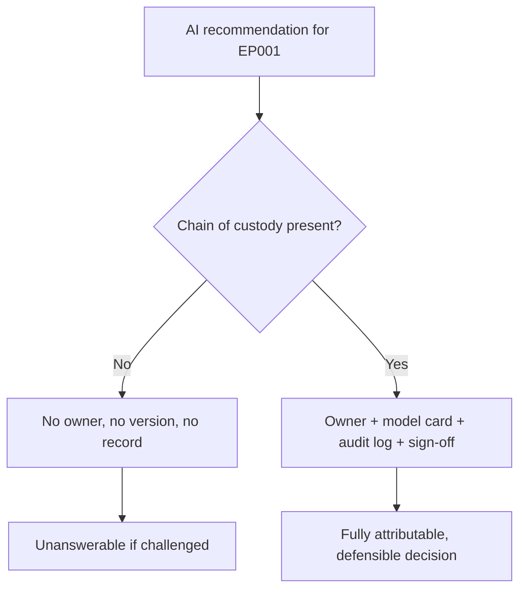
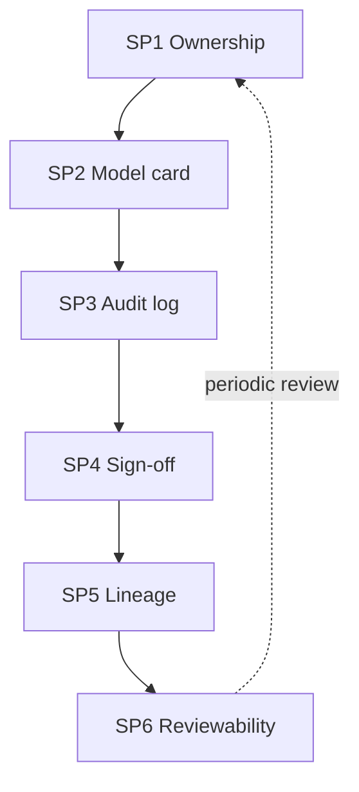
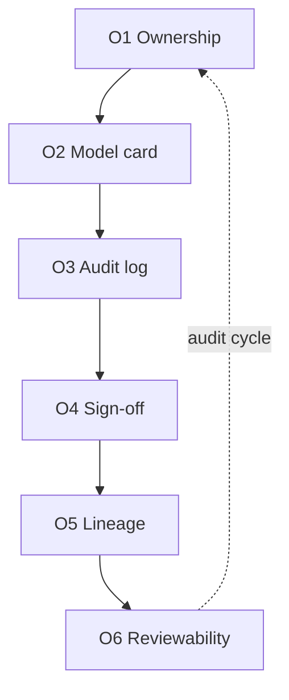
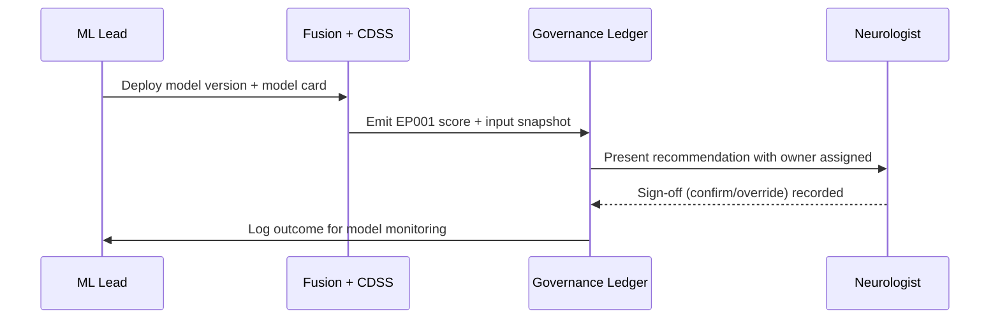
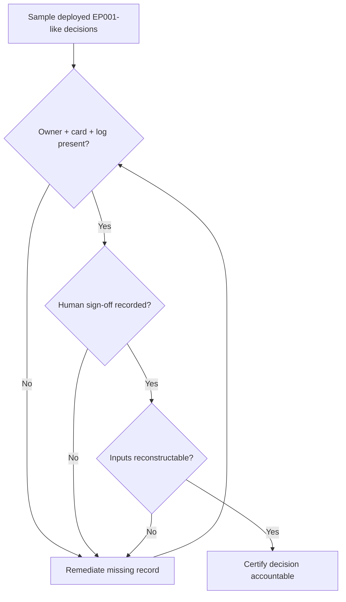
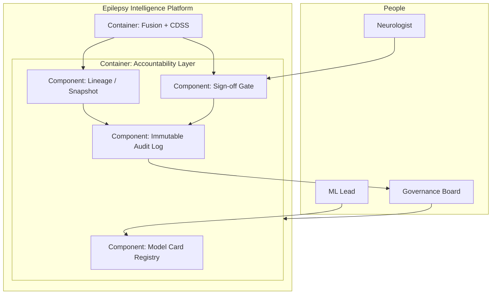
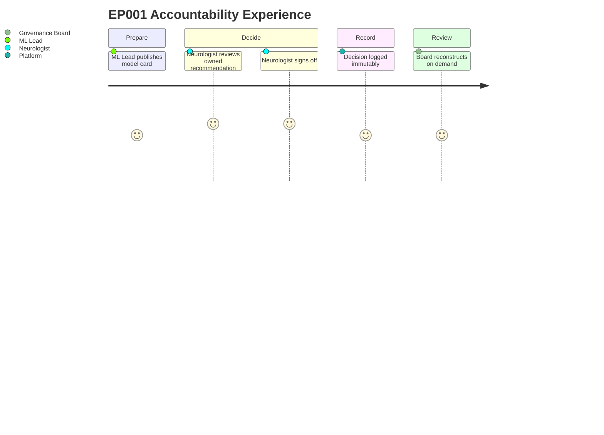

# Accountable AI — Ownership, Audit & Sign-Off (Epilepsy, EP001)

> **Why (this doc):** When an epilepsy platform recommends expediting a pre-surgical work-up for EP001, a committee — and a regulator — will ask "who is answerable, what was recorded, and how was it signed off?" Accountability is the pillar that makes every AI-assisted decision attributable to a named owner, reconstructable from an audit log, described by a model card, and gated by a human sign-off. Without it, Responsible AI is unenforceable.
> **How:** By following the research spine (Problem → Sub-problems → Research Problem → Research Objective → Flow → Hypotheses → Statistical Analysis), then giving a DEFINITION table, a MECHANISMS/CONTROLS table, a KPI/METRICS table, a RACI matrix, a repo crosswalk, all four Mermaid diagram types plus a C4-style model — anchored to EP001 (29M, focal impaired-awareness, **left temporal**, F7/T7/P7, ~5 seizures/month on CBZ + LEV, reduced QOLIE-31).

**Overarching question.** *Can every AI-assisted decision for EP001 be made attributable — traced to a named owner, a model card, an audit-log entry, and a human sign-off — so that the platform is answerable for what it recommends?*

---

## 1. Problem

> **Why:** Accountability must anchor to a concrete answerability gap, not to a compliance abstraction. **How:** State what goes wrong when an epilepsy AI acts without ownership and record.

The fusion platform produces a fused drug-resistance risk and a left-temporal localisation for EP001, then a rule-based recommendation to expedite epilepsy-centre evaluation. If that recommendation is not tied to a named owner, a versioned model card, an immutable log entry, and an explicit neurologist sign-off, then when the recommendation is questioned nobody can say **which model version produced it, on what inputs, who reviewed it, and who is answerable**. The problem is a missing chain of custody between an AI output and a responsible human.

*Caption — This table decomposes the answerability gap into the concrete accountability failures it causes for EP001, motivating each control that follows.*

| Failure mode | Manifestation for EP001 | Accountability control |
|---|---|---|
| No owner | No named clinician answerable for the expedite-work-up recommendation | RACI + sign-off ledger |
| No provenance | Cannot tell which model version scored EP001's 73% | Model card + version log |
| No record | The confirm/override event is not stored | Immutable audit log |
| No sign-off | Recommendation reaches patient without human authority | Human sign-off gate |
| No traceability | Cannot reconstruct inputs behind the score | Input snapshot + lineage |

**Reason:** The problem must be shown as presence vs absence of a custody chain. **Why:** A single flowchart contrasts an orphaned recommendation against a fully attributed one. **What is happening:** EP001's recommendation either lacks or possesses owner, version, record, and sign-off. **How it is happening:** The accountable branch binds each output to a named human and an immutable record. **Reference:** Mitchell et al. (2019) model cards; Raji et al. (2020) on internal algorithmic auditing.

---

## 2. Sub-Problems

> **Why:** Answerability decomposes into distinct, ownable questions. **How:** Enumerate the discrete accountability deficits as sub-problems with owners.

*Caption — This table lists each accountability sub-problem with the control and role that resolves it, so no dimension is orphaned.*

| # | Sub-problem | Resolving control | Owner |
|---|---|---|---|
| SP1 | Who is answerable for a given decision? | RACI assignment | Governance Board |
| SP2 | Which model version, trained how, produced it? | Model card | ML Lead |
| SP3 | What exactly happened and when? | Immutable audit log | Data Steward |
| SP4 | Did a human authorise it? | Sign-off gate | Neurologist |
| SP5 | Can the inputs be reconstructed? | Input snapshot / lineage | Data Steward |
| SP6 | Is the decision reviewable after the fact? | Retention + review policy | Governance Board |

**Reason:** Accountability sub-problems form a custody chain, not a list. **Why:** Ordering SP1→SP6 mirrors the decision's lifecycle from ownership to review. **What is happening:** Each control hands its record to the next; review loops back to ownership. **How it is happening:** The platform threads EP001's decision through all six controls. **Reference:** Raji et al. (2020); Mitchell et al. (2019).

---

## 3. Research Problem

> **Why:** One testable statement unifies the accountability controls. **How:** Frame accountability as a single answerable custody question bound to EP001.

**Research problem:** *Can the platform guarantee that every AI-assisted decision for a focal-epilepsy patient like EP001 is bound to a named owner (RACI), a versioned model card, an immutable audit-log entry, and an explicit human sign-off — such that any decision can be fully reconstructed and attributed after the fact?*

*Caption — This table sharpens the accountability problem into independent, dependent, and constraint variables.*

| Element | Definition in this study |
|---|---|
| Independent variables | Presence of RACI owner, model card, audit entry, sign-off gate, input snapshot |
| Dependent variables | Ownership coverage, card completeness, log coverage, sign-off rate, reconstruction success |
| Constraint | Neurologist holds decision authority; logs immutable; PHI de-identified |
| Population anchor | EP001 left-temporal focal epilepsy, F7/T7/P7 |

---

## 4. Research Objective

> **Why:** The problem converts into measurable custody goals. **How:** State one overarching objective decomposed into six control-level objectives.

**Overarching objective.** Design and evaluate an accountability layer that makes every EP001 decision owned, carded, logged, signed off, and reconstructable, demonstrating full answerability rather than assumed responsibility.

*Caption — This table maps each control-level objective onto a sub-problem and a measurable target.*

| Objective | Addresses | Headline measurable target |
|---|---|---|
| O1 Ownership | SP1 | 100% decisions carry a RACI-accountable owner |
| O2 Model card | SP2 | Card present for every deployed model version |
| O3 Audit log | SP3 | 100% decision events logged immutably |
| O4 Sign-off | SP4 | 100% recommendations human-signed before action |
| O5 Lineage | SP5 | Inputs reconstructable for 100% of decisions |
| O6 Reviewability | SP6 | 100% decisions reviewable within retention window |

**Reason:** Objectives must form an ordered, closed custody pipeline. **Why:** The flowchart shows the six controls are sequential and reinforcing. **What is happening:** Each objective produces a record the next consumes; review returns to ownership. **How it is happening:** The platform realises each control as a logged step for EP001. **Reference:** Mitchell et al. (2019); global-policy rule 21.

---

## 5. Flow (Runtime)

> **Why:** A defense needs an auditable picture of how a decision acquires its custody chain. **How:** Present the runtime as a stage table and a `sequenceDiagram`.

*Caption — This table traces one EP001 decision through each accountability stage, showing where each record is created.*

| Stage | Actor/component | Record produced |
|---|---|---|
| 1 Version | ML Lead | Model card (version, data, metrics, limits) |
| 2 Score | Fusion model | Fused risk + input snapshot |
| 3 Assign | Governance | RACI owner for the decision |
| 4 Present | Dashboard | Explained recommendation to neurologist |
| 5 Sign-off | Neurologist | Confirm/override event (signed) |
| 6 Log | Ledger | Immutable audit entry (who/what/when) |

**Reason:** The runtime must show each record being created in order. **Why:** A sequence diagram makes explicit that no decision reaches the patient without a signed, logged owner. **What is happening:** The model version, score, owner, sign-off, and log are produced in sequence for EP001. **How it is happening:** Each actor writes one immutable record before the next stage. **Reference:** Raji et al. (2020) internal audit; Sendak et al. (2020).

---

## 6. Hypotheses

> **Why:** Falsifiable hypotheses make accountability testable. **How:** State one hypothesis per control with its test.

*Caption — The hypothesis table pairs each null with its alternative and the test.*

| ID | Control | Null (H0) | Alternative (H1) | Test / statistic |
|---|---|---|---|---|
| H1 | Ownership | Some decisions lack an owner | 100% owned | Ledger proportion |
| H2 | Model card | Some versions lack a card | 100% carded | Card coverage |
| H3 | Audit log | Some events unlogged | 100% logged | Log coverage |
| H4 | Sign-off | Some acts bypass sign-off | 100% signed | Sign-off proportion |
| H5 | Lineage | Some inputs irrecoverable | 100% reconstructable | Reconstruction success rate |

---

## 7. Statistical Analysis

> **Why:** The examiner probes how accountability becomes a number. **How:** Bind each hypothesis to a metric, method, threshold, and EP001 read.

*Caption — This table lists, per control, the metric, method, threshold, and EP001 illustration.*

| Metric (control) | Method | Threshold | EP001 read |
|---|---|---|---|
| Ownership coverage | Ledger count / total | 100% | EP001 decision owned by treating neurologist |
| Card completeness | Card fields present / required | 100% | Fusion model card lists left-temporal use case |
| Log coverage | Logged events / total | 100% | EP001 confirm event logged |
| Sign-off rate | Signed / recommended | 100% | EP001 plan signed before action |
| Reconstruction success | Rebuilt / sampled | 100% | EP001 inputs (CBZ+LEV, EEG) rebuilt from snapshot |

**Reason:** The analysis must be a gated audit loop. **Why:** The flowchart proves certification only after ownership, record, sign-off, and lineage all clear. **What is happening:** Sampled decisions pass three gates or return to remediation. **How it is happening:** Any missing record fails the audit and is remediated. **Reference:** Raji et al. (2020); APA (2020).

---

## 8. What Accountable AI Means Here (Definition Table)

> **Why:** Accountability is vague until defined for this domain. **How:** Define each element in epilepsy-platform terms with its EP001 test.

*Caption — This definition table fixes the meaning of each accountability element, with a concrete EP001 test.*

| Element | Definition in this platform | EP001 test |
|---|---|---|
| Ownership (RACI) | A named human accountable for each decision | EP001 expedite-work-up owned by treating neurologist |
| Model card | Versioned card: data, metrics, intended use, limits | Fusion card states left-temporal focal use, not diagnosis |
| Audit log | Immutable who/what/when for every event | EP001's confirm event time-stamped and owned |
| Human sign-off | Explicit confirm/override before action | EP001 plan not actioned until signed |
| Lineage | Inputs + model version reconstructable | EP001's fused score rebuilt from snapshot |

---

## 9. Mechanisms & Controls

> **Why:** Each accountability element needs a concrete mechanism. **How:** Map each element to its platform mechanism and enforcement point.

*Caption — This table binds each accountability element to the concrete platform mechanism and enforcement point.*

| Element | Concrete mechanism | Enforcement point |
|---|---|---|
| Ownership | RACI matrix assigning A/R per decision type | Governance board policy |
| Model card | Card template (Mitchell et al.) per model version | `pipeline-a/phase-16` governance |
| Audit log | Append-only ledger of events | Platform data layer |
| Sign-off | "Clinician confirms" recommendation gate | `fusion_analysis.ep001_case` |
| Lineage | Input snapshot + version stamp | Fusion pipeline output |
| Reviewability | Retention + periodic review policy | Governance board |

---

## 10. RACI Matrix

> **Why:** Ownership is meaningless without who-does-what. **How:** Assign Responsible/Accountable/Consulted/Informed per decision activity.

*Caption — This RACI matrix assigns clear responsibility, accountability, consultation, and information duties across roles for each accountability activity, so every activity has exactly one accountable owner.*

| Activity | Neurologist | ML Lead | Data Steward | Governance Board |
|---|---|---|---|---|
| Approve model deployment | C | R | C | A |
| Author/maintain model card | I | R/A | C | I |
| Confirm/override EP001 recommendation | R/A | I | I | C |
| Maintain audit log | I | C | R/A | I |
| Reconstruct decision on challenge | C | R | R | A |
| Periodic accountability review | C | C | C | R/A |

---

## 11. KPI / Metrics

> **Why:** The committee measures whether accountability holds. **How:** Give each control a KPI, target, and source.

*Caption — This KPI table states, per control, the indicator, its target threshold, and where it is measured.*

| KPI | Control | Target | Source |
|---|---|---|---|
| Decision ownership coverage | Ownership | 100% | Governance ledger |
| Model-card completeness | Model card | 100% fields | `phase-16` card registry |
| Audit-log event coverage | Audit log | 100% | Platform ledger |
| Human sign-off rate | Sign-off | 100% | Fusion CDSS + dashboard |
| Decision reconstruction rate | Lineage | 100% of sampled | Input snapshots |
| Mean time-to-reconstruct | Reviewability | < 1 business day | Audit drill |

---

## 12. Where Implemented in This Repo

> **Why:** Accountability is credible only if mapped to artefacts. **How:** Tabulate each control against the file that realises it.

*Caption — This crosswalk ties each accountability control to the actual repository artefact implementing it.*

| Control | Repository artefact | What it does |
|---|---|---|
| Human sign-off | `analysis/fusion_analysis.py` → `ep001_case` | Emits recommendation marked "clinician confirms" |
| Lineage / snapshot | `analysis/fusion_analysis.py` → `merge`, `ep001_case` | Joins inputs by patient_id, trains on held-out cohort |
| Model metrics for card | `analysis/primary_analysis.py` → `baseline_model`, `statistics` | AUC, confusion matrix, ordinal ORs for the card |
| Governance & cards | `docs/pipeline-a/phase-16-governance-compliance.md` | Board, roles, retraining, security |
| Explanation for audit | `docs/pipeline-a/phase-11-explainable-ai.md` | SHAP chain recorded per decision |
| Human-in-loop UX | `viewer/src/App.jsx` scoring engine | Four-level scoring surfaced for clinician review |

---

## 13. C4-Style Model

> **Why:** Accountability needs an explicit map of who and what holds records. **How:** Render a C4 container/component view of the accountability layer.

*Caption — This C4 model situates the accountability layer among human actors and platform containers, clarifying where records are held and who is answerable.*

**Reason:** A dissertation accountability layer must show its record stores and human authorities. **Why:** The C4 model names the card registry, audit log, sign-off gate, and lineage component and the board that governs them. **What is happening:** The fusion container feeds lineage and sign-off, which write to the immutable log surfaced to the board; the ML Lead maintains cards; the neurologist signs off. **How it is happening:** Each component is a distinct record store mapped to an artefact; edges show authority and record flow. **Reference:** Brown (2018) C4; Mitchell et al. (2019).

---

## 14. Experience (Journey)

> **Why:** Accountability must be felt by the humans it binds. **How:** Model the neurologist's and board's experience across the custody chain.

*Caption — This journey surfaces where confidence and friction arise as EP001's decision acquires its custody chain.*

**Reason:** The custody chain must be experienced, not only tabulated. **Why:** A journey map exposes where sign-off and reconstruction create confidence or friction. **What is happening:** EP001's decision moves from carding through signed decision to logged, reviewable record. **How it is happening:** Each step writes a record the next relies on. **Reference:** Cramer et al. (1998); Raji et al. (2020).

---

## Professor Readiness (Defense Q&A)

> **Why:** Anticipating challenges shows command of the accountability design. **How:** Pre-answer likely questions concisely.

### Q1. Isn't a "human sign-off" just a rubber stamp?

> **Why:** Examiners doubt oversight quality. **How:** Tie sign-off to the explanation and record.

No — the neurologist signs off on an *explained* recommendation (SHAP drivers, calibrated confidence, left-temporal localisation from `phase-11`), can override, and both the confirmation and the override are logged immutably with an owner. A rubber stamp leaves no explanation to review and no record of the alternative; this design forces both.

### Q2. Why model cards rather than just documentation?

> **Why:** The examiner questions the added structure. **How:** Cite provenance and intended-use scoping.

Model cards (Mitchell et al., 2019) pin each deployed version to its training data, metrics (the `baseline_model` AUC and confusion matrix, the ordinal ORs), intended use ("left-temporal focal decision support, not diagnosis"), and known limits. This is what lets the board answer "which version, trained how, scored EP001's 73%?" — free-text docs do not guarantee those fields exist.

### Q3. How is this immutable log not a privacy risk itself?

> **Why:** Logging sensitive neurological data raises exposure concerns. **How:** Separate identity from record.

The log records decision events, model versions, owners, and de-identified input snapshots under the least-privilege access controls in `phase-16`. PHI is de-identified before it enters the pipeline, so the audit trail supports reconstruction without storing directly identifying data — accountability and privacy are reconciled, not traded off.

### Q4. Who is accountable when the AI and the neurologist disagree?

> **Why:** Disagreement is the crux of clinical liability. **How:** Point to RACI.

The RACI matrix (Section 10) makes the neurologist Accountable/Responsible for the confirm/override decision; the AI is decision *support*, never the decider. If they disagree, the neurologist's signed decision governs and is logged with the AI's recommendation alongside — so the record shows both the advice and the human choice that overrode or accepted it.

---

## References

American Psychological Association. (2020). *Publication manual of the American Psychological Association* (7th ed.). https://doi.org/10.1037/0000165-000

Barocas, S., Hardt, M., & Narayanan, A. (2019). *Fairness and machine learning: Limitations and opportunities*. fairmlbook.org.

Brown, S. (2018). *The C4 model for visualising software architecture*. https://c4model.com

Cramer, J. A., Perrine, K., Devinsky, O., Bryant-Comstock, L., Meador, K., & Hermann, B. (1998). Development and cross-cultural translations of a 31-item quality of life in epilepsy inventory (QOLIE-31). *Epilepsia, 39*(1), 81–88. https://doi.org/10.1111/j.1528-1157.1998.tb01278.x

Mitchell, M., Wu, S., Zaldivar, A., Barnes, P., Vasserman, L., Hutchinson, B., Spitzer, E., Raji, I. D., & Gebru, T. (2019). Model cards for model reporting. In *Proceedings of the Conference on Fairness, Accountability, and Transparency* (pp. 220–229). ACM. https://doi.org/10.1145/3287560.3287596

Raji, I. D., Smart, A., White, R. N., Mitchell, M., Gebru, T., Hutchinson, B., Smith-Loud, J., Theron, D., & Barnes, P. (2020). Closing the AI accountability gap: Defining an end-to-end framework for internal algorithmic auditing. In *Proceedings of the Conference on Fairness, Accountability, and Transparency* (pp. 33–44). ACM. https://doi.org/10.1145/3351095.3372873

Sendak, M. P., Gao, M., Brajer, N., & Balu, S. (2020). Presenting machine learning model information to clinical end users with model facts labels. *npj Digital Medicine, 3*, 41. https://doi.org/10.1038/s41746-020-0253-3

Topol, E. J. (2019). High-performance medicine: The convergence of human and artificial intelligence. *Nature Medicine, 25*(1), 44–56. https://doi.org/10.1038/s41591-018-0300-7
