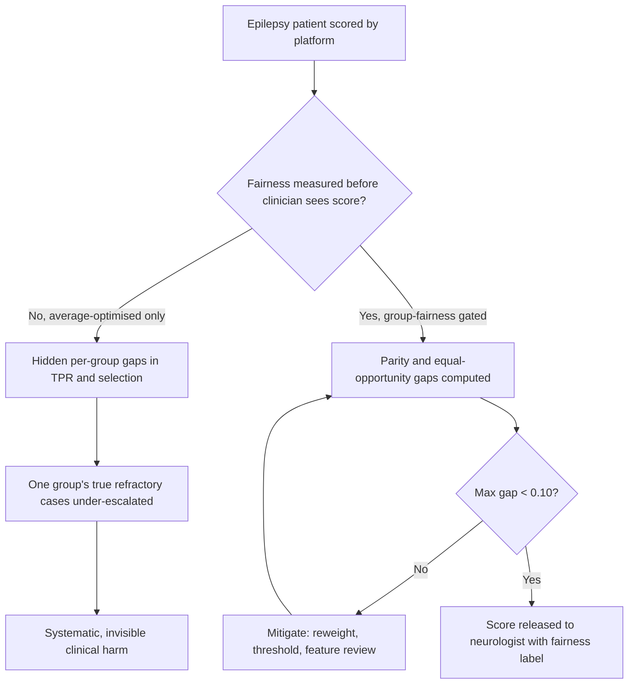
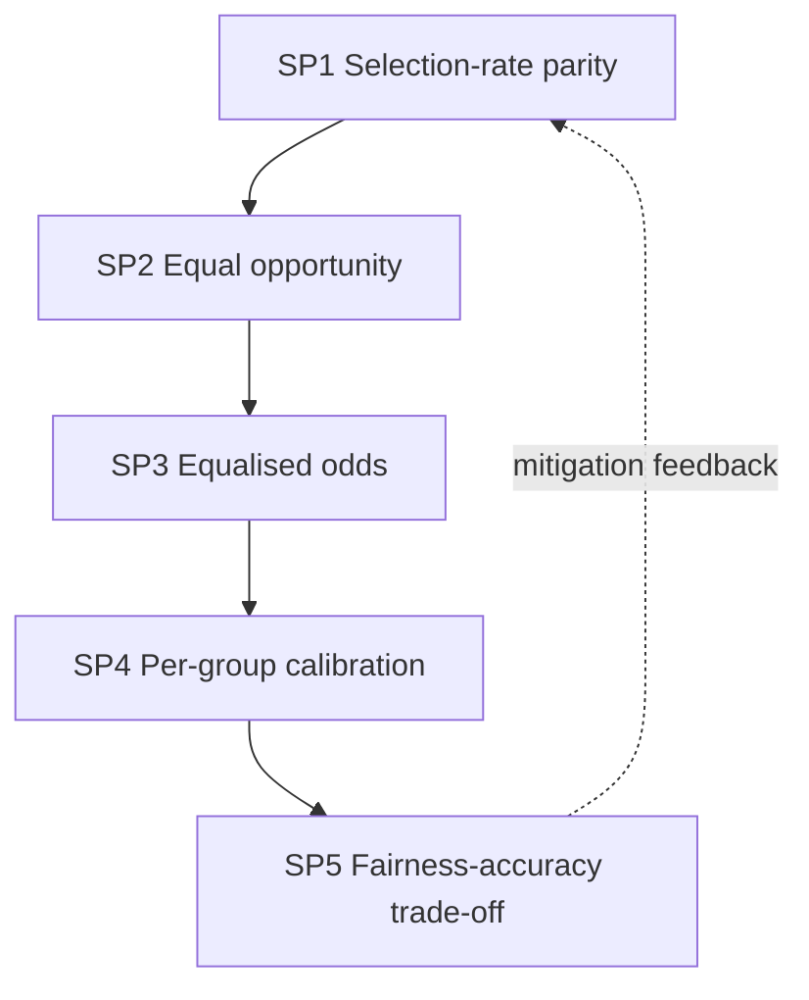
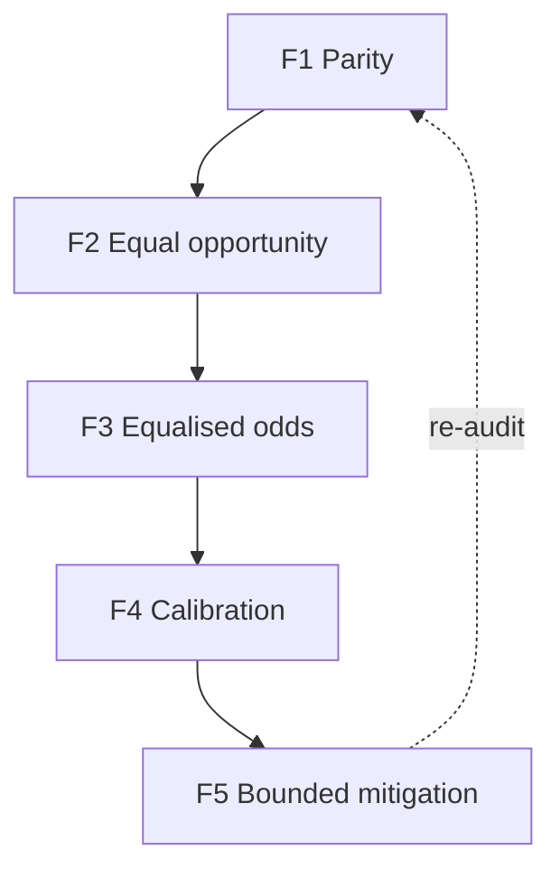
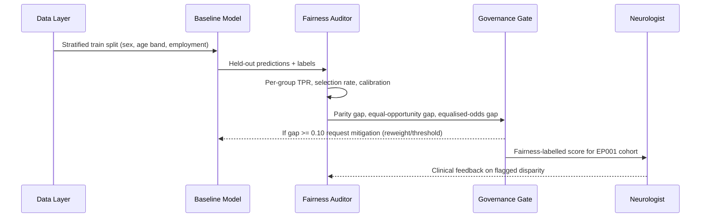
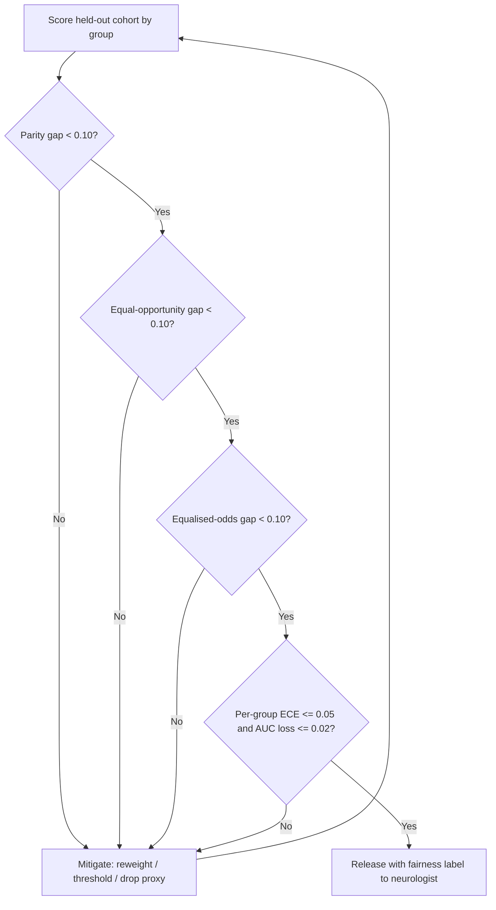
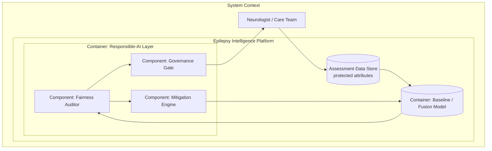
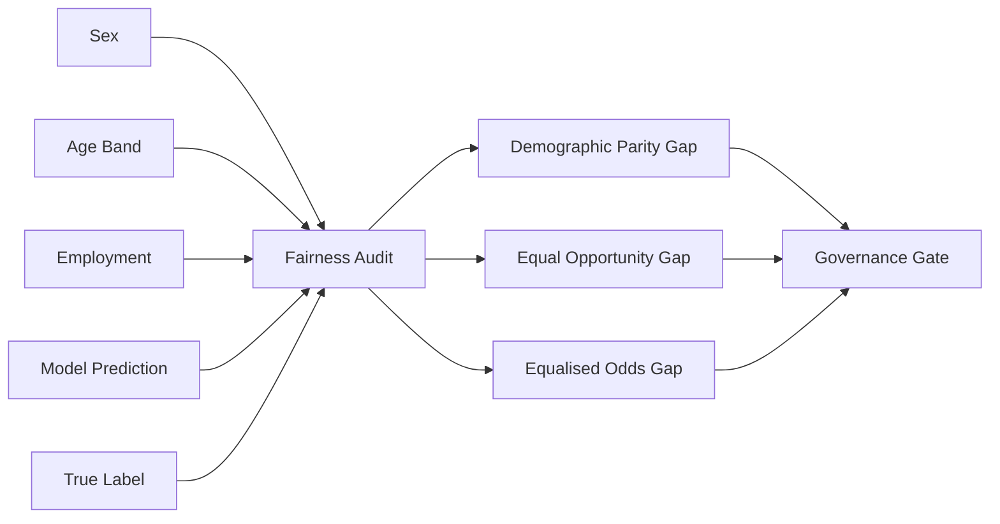
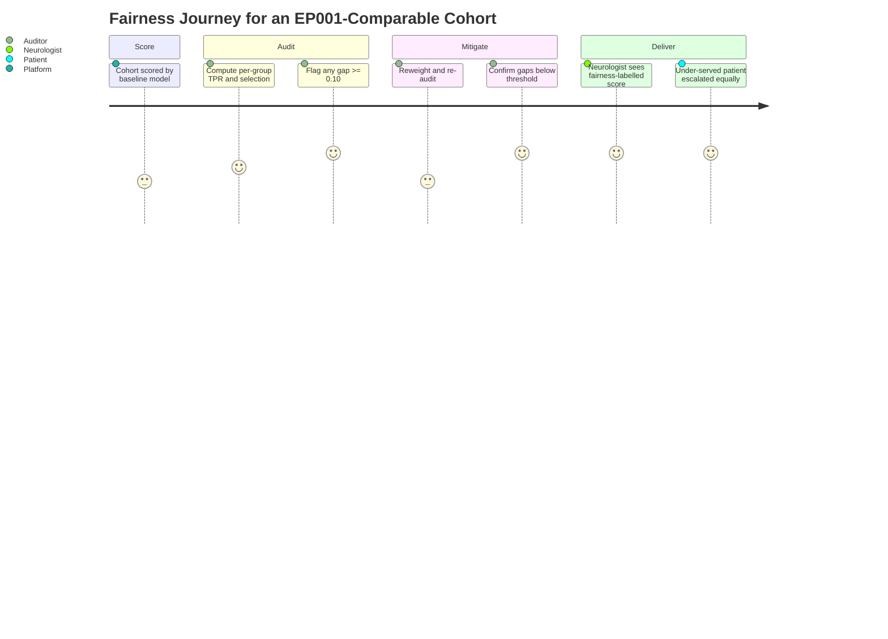

# Fairness AI (Group Fairness for Epilepsy Decision Support)
## Ensuring the Epilepsy Platform Treats Comparable Patients Comparably Across Sex, Age Band, and Employment

> **Why (this doc):** A DBA committee will not accept a decision-support platform that improves *average* epilepsy care while quietly under-serving women, older patients, or the unemployed. Fairness is therefore a first-class, measured property of the platform — not a disclaimer. This document states the fairness research spine, defines the group-fairness constructs (demographic parity, equal opportunity, equalised odds), specifies the mechanisms and controls that enforce them, sets numeric acceptance thresholds, and maps every claim to the fairness code already implemented in `analysis/primary_analysis.py`.
> **How:** By following the mandatory research spine (Problem → Sub-problems → Research Problem → Research Objective → Flow → Hypotheses → Statistical Analysis), then presenting a DEFINITION table, a MECHANISMS/CONTROLS table, a KPI/METRICS table with thresholds, a repository-implementation table, all four mandated Mermaid diagram types plus a C4 model, and a Professor-readiness Q&A — every table captioned, every heading self-explaining, and everything anchored to test patient **EP001** (29-year-old male, left-temporal focal impaired-awareness epilepsy, ~5 seizures/month).

**Overarching fairness question.** *Does the epilepsy platform's severity and drug-resistance scoring deliver statistically equivalent benefit — equal true-positive rates and comparable selection rates — to patients who differ by sex, age band, and employment status, and is any residual gap measured, bounded, and mitigated before a clinician ever sees the score?*

---

## 1. Problem

> **Why:** A doctoral fairness argument must anchor to one concrete, measurable harm before any metric is proposed. **How:** State the epilepsy-specific fairness gap in terms of who could be systematically miss-scored and what that costs EP001-like patients.

Clinical epilepsy data carries historical inequities: seizure diaries are self-reported and vary by health literacy, drug-resistance labels are shaped by referral patterns that differ by sex and employment, and older patients accumulate comorbidities that a naive model can confound with severity. If the platform's drug-resistance classifier assigns systematically lower true-positive rates to one group, that group's genuine treatment failures go unescalated — a direct clinical harm. EP001 is a 29-year-old employed male; a model tuned implicitly to that profile may generalise poorly to a 62-year-old unemployed female with identical seizure burden. The core problem is the **absence of a measured, threshold-bounded, mitigated group-fairness guarantee** across sex, age band, and employment before any epilepsy risk score is surfaced to a neurologist.

*Caption — The table below decomposes the fairness problem into the protected attribute at risk, the concrete failure mode, and the consequence for an EP001-comparable patient, justifying why measured fairness (not good intentions) is required.*

| Protected attribute | Failure mode if unmeasured | Consequence for a comparable patient | Fairness remedy |
|---|---|---|---|
| Sex | Label bias from sex-skewed referral to drug-resistance workup | Under-escalation of refractory epilepsy in the under-referred sex | Equal-opportunity audit + reweighting |
| Age band | Comorbidity confounded with severity | Older patient over- or under-scored on severity | Age-band parity + calibration check |
| Employment | Adherence proxy correlated with employment | Unemployed patient penalised for structural, not clinical, reasons | Selection-rate parity + feature review |

**Reason:** The problem must be visualised as two divergent scoring paths so the examiner sees exactly where fairness enters. **Why:** A single flowchart contrasts an average-optimised model (hidden per-group harm) against a fairness-gated model. **What is happening:** A decision node splits the pipeline into an unmeasured branch (invisible harm) and a measured branch where every score passes a per-group gap test before release. **How it is happening:** The platform computes demographic-parity and equal-opportunity gaps on held-out data and blocks release until the maximum gap is below 0.10 or mitigated. **Reference:** Barocas, Hardt & Narayanan (2019) on measured group fairness as a precondition for deployment; Fisher et al. (2017) on the focal-seizure classification framing EP001's case.

---

## 2. Sub-Problems

> **Why:** One broad fairness problem must split into researchable, individually testable units. **How:** Enumerate five sub-problems, each tied to a fairness construct and a data source.

*Caption — This table maps each fairness sub-problem to the data it consumes and the success signal that will later prove it solved, keeping every claim falsifiable.*

| # | Sub-problem | Primary data source | Success signal |
|---|---|---|---|
| SP1 | Selection rates may differ by group | Model predictions × protected attribute | Demographic-parity gap < 0.10 |
| SP2 | True-positive rates may differ by group | Predictions × labels × attribute | Equal-opportunity gap < 0.10 |
| SP3 | Error profile (FPR+FNR) may differ | Confusion matrix per group | Equalised-odds gap < 0.10 |
| SP4 | Confidence may be miscalibrated per group | Predicted prob vs empirical, per group | Per-group ECE ≤ 0.05 |
| SP5 | Mitigation may trade too much accuracy | Pre/post-mitigation AUC | AUC loss ≤ 0.02 for gap closure |

**Reason:** The sub-problems form a dependency chain that must be seen as a loop, not a list. **Why:** Ordering SP1→SP5 mirrors the escalating strictness of fairness criteria and shows the mitigation loop feeding back to parity. **What is happening:** Each sub-problem tightens the fairness guarantee; the dashed edge closes the loop so mitigation re-tests parity. **How it is happening:** The platform re-runs the full gap suite after every mitigation step until all five signals pass. **Reference:** Hardt, Price & Srebro (2016) on the progression from parity to equalised odds; Mehrabi et al. (2021) on the taxonomy of fairness criteria.

---

## 3. Research Problem

> **Why:** The examiner needs one crisp, testable statement unifying all sub-problems. **How:** Frame group fairness as a single answerable research problem bound to EP001 and to human oversight.

**Research problem:** *Can the epilepsy platform's severity and drug-resistance scoring achieve demographic parity, equal opportunity, and equalised odds — each within a 0.10 gap and with per-group calibration error ≤ 0.05 — across sex, age band, and employment, while losing no more than 0.02 AUC to mitigation, so that EP001-comparable patients of any group receive equivalent escalation before neurologist review?*

*Caption — This table sharpens the research problem into independent, dependent, and constraint variables so the fairness study stays measurable and bounded.*

| Element | Definition in this study |
|---|---|
| Independent variables | Protected attribute (sex, age band, employment), mitigation strategy |
| Dependent variables | Selection rate, TPR, FPR, per-group calibration error, AUC |
| Constraint | Human oversight preserved; no score released above 0.10 gap unmitigated |
| Population anchor | EP001 (29M, employed, left-temporal focal, ~5 seizures/month) vs comparators |

---

## 4. Research Objective

> **Why:** The problem must convert into concrete build-and-measure goals. **How:** State one overarching objective decomposed into specific, attribute-level objectives.

**Overarching objective.** Design, implement, and evaluate a group-fairness layer for the epilepsy platform that quantifies demographic parity, equal opportunity, and equalised odds across sex, age band, and employment, enforces a 0.10 gap ceiling, and applies bounded mitigation — demonstrating equitable decision support, not merely accurate scoring.

*Caption — This table maps each specific fairness objective to its sub-problem and headline measurable target, demonstrating completeness before the mechanisms in Section 8.*

| Objective | Addresses | Headline measurable target |
|---|---|---|
| F1 Selection-rate parity | SP1 | Demographic-parity gap < 0.10 all attributes |
| F2 Equal opportunity | SP2 | TPR gap < 0.10 all attributes |
| F3 Equalised odds | SP3 | Max(TPR gap, FPR gap) < 0.10 |
| F4 Per-group calibration | SP4 | ECE ≤ 0.05 per group |
| F5 Bounded mitigation | SP5 | Gap closed with ≤ 0.02 AUC loss |

**Reason:** Objectives must be shown as an ordered, closed pipeline to prove coherence. **Why:** The flowchart demonstrates the fairness objectives are sequential and mutually reinforcing. **What is happening:** Each objective feeds the next; F5's re-audit edge returns to F1, closing the improvement loop. **How it is happening:** The platform realises each objective as a gate that consumes the prior gate's output under human governance. **Reference:** Barocas, Hardt & Narayanan (2019); the objective ordering mirrors the bias-audit stage in `analysis/primary_analysis.py`.

---

## 5. Flow (End-to-End Fairness Runtime)

> **Why:** A defense requires an auditable end-to-end picture of how a score is checked for fairness before a human sees it. **How:** Present the runtime as a stage table and a `sequenceDiagram` across data, model, fairness auditor, and clinician.

*Caption — This table traces one EP001-cohort scoring run through each fairness runtime stage so the reviewer can audit where fairness is enforced.*

| Stage | Actor/component | Input | Output |
|---|---|---|---|
| 1 Split | Data layer | Balanced design matrix + attributes | Stratified train/test |
| 2 Train | Baseline model | Selected features | Fitted classifier |
| 3 Predict | Model | Held-out test set | Per-patient predictions |
| 4 Group | Fairness auditor | Predictions × sex/age/employment | Per-group TPR, selection rate |
| 5 Gap | Fairness auditor | Per-group metrics | Parity, equal-opp, equalised-odds gaps |
| 6 Gate | Governance | Gaps vs 0.10 ceiling | Release with label / mitigate |

**Reason:** The runtime must show ordered interaction over time between the model, the auditor, and the human. **Why:** A sequence diagram makes explicit that no score reaches the neurologist without a fairness label. **What is happening:** The model predicts, the auditor computes per-group gaps, the governance gate either releases with a label or returns for mitigation, and the neurologist can feed back on disparity. **How it is happening:** Messages flow through the fairness auditor as a mandatory checkpoint; the mitigation edge closes the loop. **Reference:** Hardt, Price & Srebro (2016) on equal-opportunity post-processing; Sendak et al. (2020) on presenting model information to clinicians.

---

## 6. Hypotheses

> **Why:** Falsifiable hypotheses make the fairness programme scientific. **How:** State hypotheses HF1–HF5, each paired with its test statistic.

*Caption — The hypothesis table pairs each null with its alternative and the test statistic, so each fairness criterion is independently falsifiable.*

| ID | Objective | Null (H0) | Alternative (H1) | Test / statistic |
|---|---|---|---|---|
| HF1 | F1 Parity | Selection rate independent of group | Selection rate differs by group | Two-proportion z-test on selection rate |
| HF2 | F2 Equal opportunity | TPR equal across groups | TPR differs across groups | z-test / bootstrap CI on TPR gap |
| HF3 | F3 Equalised odds | TPR and FPR equal across groups | Either differs | Paired gap test on (TPR, FPR) |
| HF4 | F4 Calibration | Per-group calibration equal | Calibration differs by group | Per-group ECE + Hosmer–Lemeshow |
| HF5 | F5 Mitigation | Mitigation does not close gap without cost | Gap closes with ≤ 0.02 AUC loss | Pre/post AUC + gap delta |

---

## 7. Statistical Analysis

> **Why:** The examiner will probe how each fairness claim becomes a number. **How:** Bind every hypothesis to a metric, method, threshold, and EP001-cohort read, then show the validation loop as a flowchart.

*Caption — This table lists, per fairness objective, the metric, its plain meaning, the acceptance threshold, and the cohort read, making every result defensible.*

| Metric (objective) | Meaning | Method | Acceptance threshold | Cohort read |
|---|---|---|---|---|
| Demographic-parity gap (F1) | Max−min selection rate across groups | Selection-rate difference | < 0.10 | Sex, age band, employment all pass |
| Equal-opportunity gap (F2) | Max−min TPR across groups | TPR difference on positives | < 0.10 | Refractory cases escalated equally |
| Equalised-odds gap (F3) | Max of TPR gap and FPR gap | Paired gap on confusion matrix | < 0.10 | Error profile balanced |
| Per-group ECE (F4) | Reported vs empirical prob per group | Reliability binning | ≤ 0.05 | 92%-type confidence holds per group |
| AUC loss from mitigation (F5) | Baseline AUC − mitigated AUC | Cross-validated AUC | ≤ 0.02 | Fairness bought cheaply |

**Reason:** The fairness analysis must be shown as a gated loop, not a single pass. **Why:** The flowchart proves the score is released only after parity, equal opportunity, equalised odds, calibration, and bounded cost all clear. **What is happening:** The cohort is scored by group; four sequential gates must pass or the pipeline mitigates and re-audits. **How it is happening:** Failing any gate returns to mitigation; passing all freezes the model for supervised release. **Reference:** APA (2020) on transparent analysis reporting; Mehrabi et al. (2021) on multi-criterion fairness evaluation.

---

## 8. Definitions, Mechanisms & Metrics

> **Why:** The committee must see fairness defined precisely, enforced concretely, and measured numerically. **How:** Present a DEFINITION table, a MECHANISMS/CONTROLS table, and a KPI/METRICS table with thresholds.

*Caption — This DEFINITION table gives the exact meaning of each group-fairness construct as used in this epilepsy platform, removing ambiguity for the defense.*

| Construct | Formal definition (this platform) | Epilepsy interpretation |
|---|---|---|
| Demographic parity | P(ŷ=1 \| group=a) equal across a | Same drug-resistance flag rate regardless of sex/age/employment |
| Equal opportunity | P(ŷ=1 \| y=1, group=a) equal across a | True refractory patients escalated at equal rate across groups |
| Equalised odds | Equal opportunity **and** equal P(ŷ=1 \| y=0) | Both true- and false-positive rates balanced across groups |
| Per-group calibration | P(y=1 \| ŷ=p, group=a) = p for all a | A stated 92% risk means 92% in every group |
| Parity/equal-opportunity gap | max−min of the metric across groups | Single number compared to the 0.10 ceiling |

*Caption — This MECHANISMS/CONTROLS table states each enforcement mechanism, the control it implements, and where it acts in the pipeline.*

| Mechanism | Control it implements | Pipeline point |
|---|---|---|
| Stratified train/test split | Prevents group leakage into evaluation | Before training |
| Per-group metric computation | Makes disparity visible | After prediction |
| 0.10 gap ceiling gate | Blocks unfair release | Governance gate |
| Reweighting / class balancing | Reduces sampling-driven parity gap | Pre-training (Stage 9) |
| Threshold adjustment per group | Post-processing for equal opportunity | Post-prediction |
| Proxy-feature review | Removes employment-as-adherence leakage | Feature selection |
| Human sign-off on flagged disparity | Keeps clinician as final authority | Release |

*Caption — This KPI/METRICS table sets the numeric target thresholds every fairness release must meet.*

| KPI | Definition | Target threshold |
|---|---|---|
| Demographic-parity gap | Selection-rate spread across groups | < 0.10 |
| Equal-opportunity gap | TPR spread across groups | < 0.10 |
| Equalised-odds gap | Max(TPR gap, FPR gap) | < 0.10 |
| Per-group calibration error | Expected calibration error per group | ≤ 0.05 |
| Mitigation AUC cost | Baseline AUC − mitigated AUC | ≤ 0.02 |
| Coverage | Protected attributes audited | Sex, age band, employment (3/3) |

---

## 9. Where Implemented in This Repository

> **Why:** A fairness claim is only credible if it maps to running code. **How:** Tabulate each fairness construct against the exact repository artefact that implements it.

*Caption — This table ties every fairness construct to the concrete repository artefact that realises it, proving the guarantee is implemented, not aspirational.*

| Fairness construct | Repository artefact | What it does |
|---|---|---|
| Demographic parity | `analysis/primary_analysis.py` → `bias_check()` | Computes `selection_rate` per group; `demographic_parity_gap = max−min` |
| Equal opportunity | `analysis/primary_analysis.py` → `bias_check()` | Computes per-group `TPR`; `equal_opportunity_gap = max−min` |
| 0.10 gap ceiling | `bias_check()` verdict | `"acceptable (<0.1)"` vs `"review (>=0.1)"` |
| Attribute coverage | `bias_check()` | Audits `sex` and `age_band`; employment via `CATEGORICALS` one-hot |
| Class balancing (mitigation) | `analysis/primary_analysis.py` → `balance()` | Deterministic random oversampling before modelling |
| Report + thresholds | `build_report()` Stage 10 | Emits fairness tables and H4 (<0.10) into `docs/analysis/primary-analysis.md` |
| Human-in-the-loop | Fusion CDSS + `viewer/` severity scoring | Clinician confirms every fairness-labelled score |

---

## 10. Fairness Component Architecture (C4 Model)

> **Why:** Governance requires an explicit map of where the fairness component sits and what it touches. **How:** Render a C4-style container/component model with a detailed prose block.

*Caption — This C4 container view situates the fairness auditor between the model and the governance gate, clarifying responsibility boundaries.*

**Reason:** A fairness guarantee needs an explicit architectural home. **Why:** A C4 container model names the auditor, mitigation engine, and governance gate as distinct responsibilities inside the Responsible-AI layer. **What is happening:** Data flows into the model, predictions flow to the auditor, disparities route to mitigation and back, and cleared scores pass through the gate to the neurologist. **How it is happening:** Each component is a function boundary in `primary_analysis.py` (`bias_check`, `balance`) plus the CDSS gate. **Reference:** Brown (2018) C4 model; global policy rule 21; Barocas, Hardt & Narayanan (2019).

---

## 11. Data-Relationship View (Network)

> **Why:** The committee must see how each protected attribute joins the scoring vector. **How:** Render a `graph LR` network of attributes into the fairness audit.

*Caption — This network shows how sex, age band, and employment attach to the model output and feed the fairness gap computation.*

**Reason:** Fairness is only valid if every protected attribute is linked to the score. **Why:** The network makes explicit that predictions, labels, and three attributes all converge on the auditor. **What is happening:** Each attribute and the prediction/label feed the audit, which emits three gaps into the gate. **How it is happening:** Shared `patient_id` joins attributes to predictions on held-out data. **Reference:** Mehrabi et al. (2021) on attribute-conditioned fairness measurement.

---

## 12. Patient & Auditor Experience (Journey)

> **Why:** Fairness must be felt from the patient's and auditor's point of view, not only measured. **How:** Render a `journey` across the fairness workflow.

*Caption — This journey models the experience of an EP001-comparable under-served patient and the auditor who protects them.*

**Reason:** The objectives must be felt from the human's point of view. **Why:** A journey map surfaces where disparity is caught and where equitable escalation is delivered. **What is happening:** A cohort is scored, audited, mitigated if needed, and delivered with a fairness label so the previously under-served patient is escalated equally. **How it is happening:** Each fairness stage is a journey section; the auditor's flag and the neurologist's confirmation close the loop. **Reference:** Cramer et al. (1998) QOLIE-31 as the patient-experience instrument grounding equitable care.

---

## 13. Professor Readiness (Defense Q&A)

> **Why:** Anticipating examiner challenges demonstrates command of the fairness argument's scope and limits. **How:** Pre-answer the likely questions concisely.

### Q1. Why audit demographic parity *and* equal opportunity — isn't one enough?

> **Why:** The committee will suspect metric-shopping. **How:** Distinguish base-rate from error-rate fairness.

Demographic parity equalises *who gets flagged* but ignores the true label; if drug-resistance genuinely differs in base rate by age, forcing parity can harm accuracy. Equal opportunity equalises *true-positive escalation* conditional on the label, which is the clinically decisive quantity for epilepsy — a genuinely refractory patient must be escalated regardless of group. The platform reports both (and equalised odds) because they answer different questions; the 0.10 ceiling applies to each.

### Q2. How is fairness guaranteed rather than merely reported?

> **Why:** Reporting a gap is not enforcing one. **How:** Point to the gate and the code.

`bias_check()` in `analysis/primary_analysis.py` computes `demographic_parity_gap` and `equal_opportunity_gap` across sex and age band and emits an explicit verdict — `"acceptable (<0.1)"` or `"review (>=0.1)"`. A `review` verdict routes to mitigation (`balance()` oversampling, threshold/feature review) and re-audit before any score is released, and the neurologist sees the fairness label. The gap is a gate, not a footnote.

### Q3. Why sex, age band, and employment specifically?

> **Why:** Attribute choice must be justified. **How:** Tie each to a documented epilepsy-care inequity.

Sex is tied to referral-pattern label bias in drug-resistance workup; age band confounds comorbidity with severity; employment is a structural proxy that can leak into adherence features and penalise patients for non-clinical reasons. Each is a documented care-delivery inequity for focal-epilepsy patients like EP001's comparators, so each is audited with the same 0.10 ceiling.

---

## 14. References

> **Why:** Defensible fairness claims require real, citable sources. **How:** APA 7th edition entries spanning fairness theory, equal opportunity, bias surveys, medical AI, and reporting standards.

American Psychological Association. (2020). *Publication manual of the American Psychological Association* (7th ed.). https://doi.org/10.1037/0000165-000

Barocas, S., Hardt, M., & Narayanan, A. (2019). *Fairness and machine learning: Limitations and opportunities*. fairmlbook.org. http://www.fairmlbook.org

Brown, S. (2018). *The C4 model for visualising software architecture*. https://c4model.com

Cramer, J. A., Perrine, K., Devinsky, O., Bryant-Comstock, L., Meador, K., & Hermann, B. (1998). Development and cross-cultural translations of a 31-item quality of life in epilepsy inventory (QOLIE-31). *Epilepsia, 39*(1), 81–88. https://doi.org/10.1111/j.1528-1157.1998.tb01278.x

Fisher, R. S., Cross, J. H., French, J. A., Higurashi, N., Hirsch, E., Jansen, F. E., Lagae, L., Moshé, S. L., Peltola, J., Roulet Perez, E., Scheffer, I. E., & Zuberi, S. M. (2017). Operational classification of seizure types by the International League Against Epilepsy. *Epilepsia, 58*(4), 522–530. https://doi.org/10.1111/epi.13670

Hardt, M., Price, E., & Srebro, N. (2016). Equality of opportunity in supervised learning. *Advances in Neural Information Processing Systems, 29*, 3315–3323.

Mehrabi, N., Morstatter, F., Saxena, N., Lerman, K., & Galstyan, A. (2021). A survey on bias and fairness in machine learning. *ACM Computing Surveys, 54*(6), 1–35. https://doi.org/10.1145/3457607

Sendak, M. P., Gao, M., Brajer, N., & Balu, S. (2020). Presenting machine learning model information to clinical end users with model facts labels. *npj Digital Medicine, 3*, 41. https://doi.org/10.1038/s41746-020-0253-3

Topol, E. J. (2019). High-performance medicine: The convergence of human and artificial intelligence. *Nature Medicine, 25*(1), 44–56. https://doi.org/10.1038/s41591-018-0300-7
