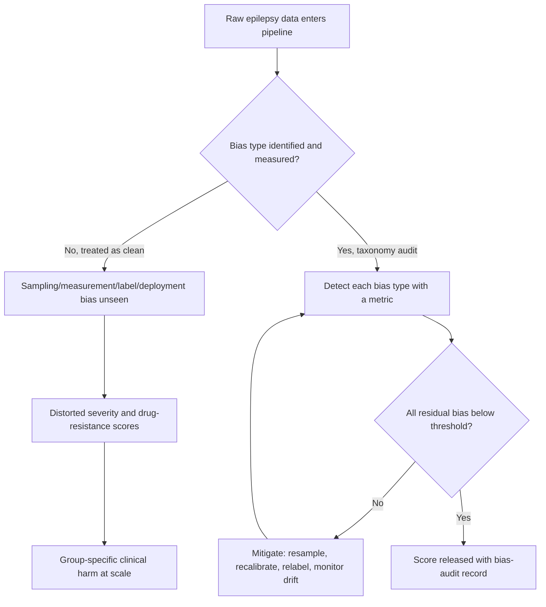
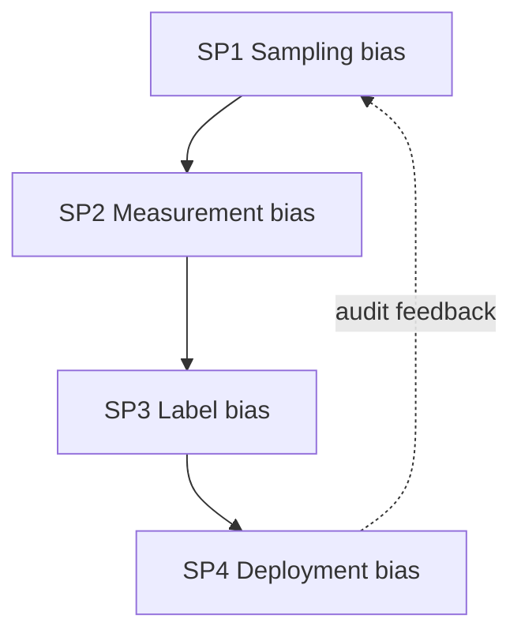
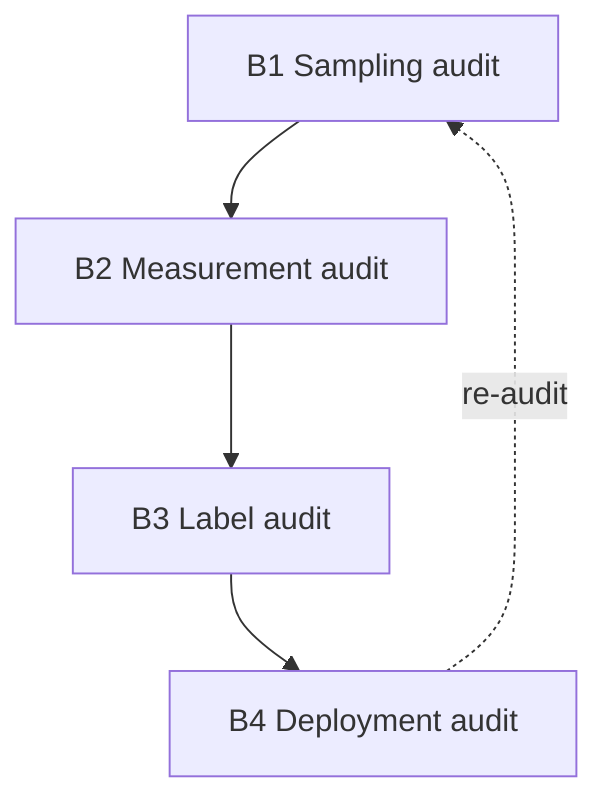
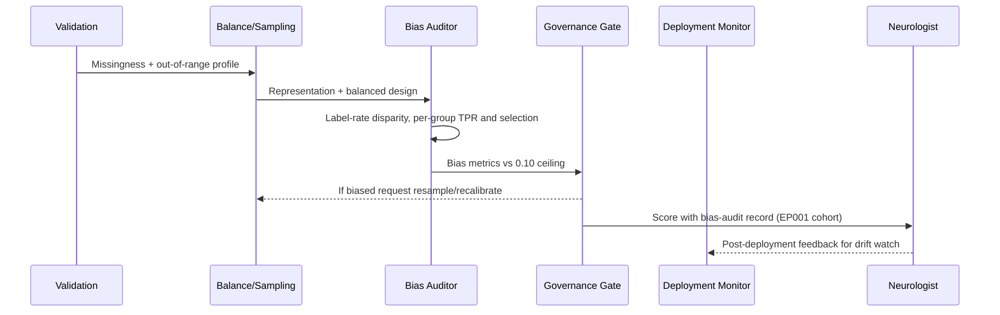
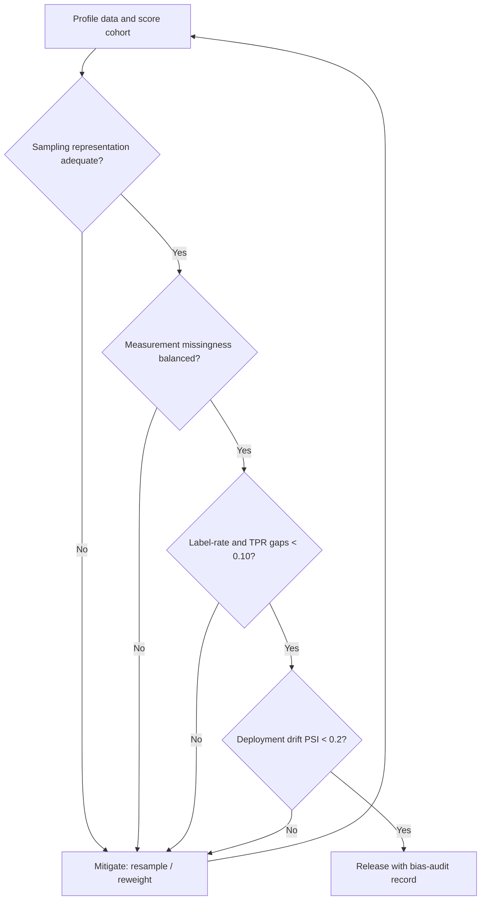
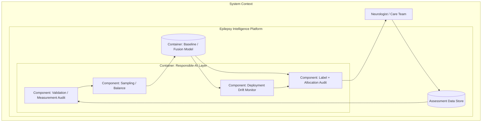
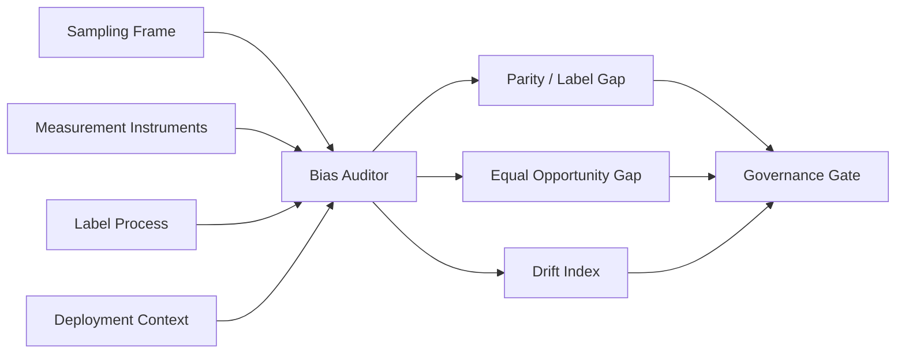
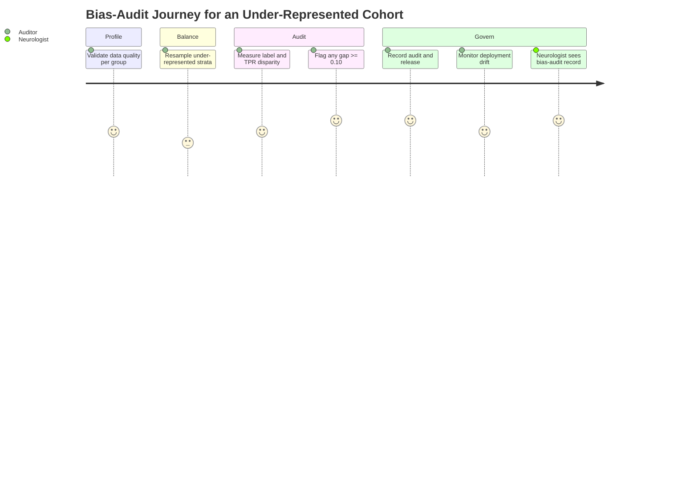

# Bias AI (Bias Taxonomy, Detection & Audit for Epilepsy Decision Support)
## Naming, Detecting, and Auditing Every Bias That Can Enter the Epilepsy Platform From Data to Deployment

> **Why (this doc):** Fairness (doc 03) measures *outcomes*; bias is about *causes*. A DBA committee will ask where distortion enters the epilepsy pipeline — the sampling frame, the measurement instrument, the label, or the deployment context — and demand that each be detected and audited. This document states the bias research spine, presents a four-class bias taxonomy, specifies detection mechanisms and controls with numeric thresholds, and maps every claim to the implemented bias check in `analysis/primary_analysis.py`.
> **How:** By following the mandatory research spine (Problem → Sub-problems → Research Problem → Research Objective → Flow → Hypotheses → Statistical Analysis), then presenting a DEFINITION table, a MECHANISMS/CONTROLS table, a KPI/METRICS table with thresholds, a repository-implementation table, all four mandated Mermaid diagram types plus a C4 model, and a Professor-readiness Q&A — every table captioned, every heading self-explaining, and everything anchored to test patient **EP001** (29-year-old male, left-temporal focal impaired-awareness epilepsy, ~5 seizures/month).

**Overarching bias question.** *At which point in the epilepsy pipeline — sampling, measurement, labelling, or deployment — does bias enter, how is each type detected and audited, and is the residual bias bounded below the platform's 0.10 disparity ceiling before any score reaches a neurologist?*

---

## 1. Problem

> **Why:** A doctoral bias argument must anchor to one concrete, traceable source of distortion before proposing detection. **How:** State the epilepsy-specific bias gap in terms of where distortion originates and what it costs EP001-comparable patients.

Bias in an epilepsy decision-support platform is not a single defect but a chain of possible distortions: the training cohort may over-represent employed, younger, urban patients (sampling bias); self-reported seizure diaries and adherence measures are noisier for some groups than others (measurement bias); drug-resistance labels reflect referral and workup patterns rather than pure biology (label bias); and a model trained on one hospital's case mix may drift when deployed elsewhere (deployment bias). EP001 — a 29-year-old employed male — sits comfortably in the majority stratum; the risk is precisely for the patients who do not. The core problem is the **absence of a taxonomy-driven detection and audit process** that names each bias type, measures it, and bounds it before an epilepsy risk score is trusted.

*Caption — The table below decomposes the bias problem into its four canonical entry points, the concrete failure mode, and the consequence for a comparable patient, justifying a taxonomy-driven audit.*

| Bias type | Entry point | Failure mode | Consequence for a comparable patient |
|---|---|---|---|
| Sampling bias | Cohort construction | Minority strata under-represented | Model unreliable for older/unemployed patients |
| Measurement bias | Instruments (diary, adherence) | Differential noise by group | Systematic mis-scoring of noisier-report groups |
| Label bias | Drug-resistance labelling | Referral pattern encoded as truth | Under-labelled group's refractory cases missed |
| Deployment bias | Site/time shift | Case-mix drift after go-live | Silent accuracy decay for new populations |

**Reason:** The problem must be visualised as two divergent data paths so the examiner sees where bias enters. **Why:** A single flowchart contrasts an untested pipeline (unseen bias) against a taxonomy-audited one. **What is happening:** A decision node splits the pipeline into an assumed-clean branch (distortion at scale) and an audited branch that detects and bounds each bias type. **How it is happening:** The platform names four bias classes, measures each, and blocks release until residual bias is below threshold or mitigated. **Reference:** Mehrabi et al. (2021) on the bias taxonomy; Fisher et al. (2017) on the focal-seizure framing of EP001.

---

## 2. Sub-Problems

> **Why:** One broad bias problem must split into researchable, individually detectable units. **How:** Enumerate four sub-problems, one per bias class.

*Caption — This table maps each bias sub-problem to its detection signal and the data it consumes, keeping every claim falsifiable.*

| # | Sub-problem | Detection signal | Primary data source |
|---|---|---|---|
| SP1 | Cohort under-represents strata | Stratum share vs population | Demographics distribution |
| SP2 | Instruments noisier for some groups | Per-group missingness / variance | Validation report (Stage 2) |
| SP3 | Labels encode referral patterns | Label rate vs clinical proxy by group | Drug-resistance label × attribute |
| SP4 | Model drifts after deployment | Performance vs monitoring baseline | Post-deployment monitoring |

**Reason:** The sub-problems form a pipeline-ordered chain that must be seen as a loop. **Why:** Ordering SP1→SP4 follows data from collection to deployment and shows monitoring feeding back to sampling. **What is happening:** Each sub-problem targets one entry point; the dashed edge returns deployment findings to cohort construction. **How it is happening:** Drift detected in SP4 triggers re-sampling in SP1 on the next cycle. **Reference:** Mehrabi et al. (2021); Barocas, Hardt & Narayanan (2019) on bias sources across the ML lifecycle.

---

## 3. Research Problem

> **Why:** The examiner needs one crisp, testable statement unifying all sub-problems. **How:** Frame bias detection as a single answerable research problem bound to EP001 and human oversight.

**Research problem:** *Can the epilepsy platform detect and audit sampling, measurement, label, and deployment bias — each with an explicit metric bounded below a 0.10 disparity ceiling and drift below a monitoring threshold — so that EP001-comparable patients from under-represented strata receive undistorted scoring before neurologist review?*

*Caption — This table sharpens the research problem into independent, dependent, and constraint variables so the bias study stays measurable and bounded.*

| Element | Definition in this study |
|---|---|
| Independent variables | Bias type, stratum, instrument, deployment site/time |
| Dependent variables | Stratum share, per-group missingness, label-rate disparity, drift magnitude |
| Constraint | No score released with unaudited bias above threshold |
| Population anchor | EP001 (majority stratum) vs under-represented comparators |

---

## 4. Research Objective

> **Why:** The problem must convert into concrete detect-and-audit goals. **How:** State one overarching objective decomposed into bias-class objectives.

**Overarching objective.** Design, implement, and evaluate a taxonomy-driven bias-audit layer that detects sampling, measurement, label, and deployment bias with explicit metrics, bounds each below the platform ceiling, and records every audit — demonstrating governed, undistorted epilepsy decision support.

*Caption — This table maps each bias objective to its sub-problem and headline measurable target.*

| Objective | Addresses | Headline measurable target |
|---|---|---|
| B1 Sampling audit | SP1 | Stratum representation gap flagged if under target |
| B2 Measurement audit | SP2 | Per-group missingness/out-of-range surfaced |
| B3 Label audit | SP3 | Label-rate disparity gap < 0.10 |
| B4 Deployment audit | SP4 | Drift monitored against a fixed baseline |

**Reason:** Objectives must be shown as an ordered, closed pipeline. **Why:** The flowchart demonstrates the bias objectives cover the full lifecycle and close the loop. **What is happening:** Each objective audits one entry point; B4's re-audit edge returns to B1. **How it is happening:** The platform runs each audit as a stage under human governance. **Reference:** Mehrabi et al. (2021); the audit ordering mirrors Stages 2, 9, and 10 in `analysis/primary_analysis.py`.

---

## 5. Flow (End-to-End Bias Audit Runtime)

> **Why:** A defense requires an auditable picture of how each bias type is detected before a human sees the score. **How:** Present a stage table and a `sequenceDiagram`.

*Caption — This table traces one cohort run through each bias-audit stage so the reviewer can audit where each bias type is caught.*

| Stage | Actor/component | Input | Output |
|---|---|---|---|
| 1 Profile | Validation | Raw matrix | Missingness/out-of-range per variable |
| 2 Sample | Balance | Class + stratum counts | Representation report |
| 3 Label | Bias auditor | Labels × attribute | Label-rate disparity |
| 4 Score | Bias auditor | Predictions × attribute | Per-group TPR, selection rate |
| 5 Gate | Governance | Bias metrics vs thresholds | Release with record / mitigate |
| 6 Monitor | Deployment monitor | Live scores | Drift vs baseline |

**Reason:** The runtime must show ordered interaction over time between validation, sampling, auditor, and human. **Why:** A sequence diagram makes explicit that no score reaches the neurologist without a bias-audit record. **What is happening:** Validation profiles measurement bias, sampling reports representation, the auditor computes label/scoring disparity, the gate releases or mitigates, and the monitor watches for deployment drift. **How it is happening:** Each message is a real artefact; the mitigation edge closes the loop. **Reference:** Barocas, Hardt & Narayanan (2019) on lifecycle bias; Sendak et al. (2020) on model-facts records.

---

## 6. Hypotheses

> **Why:** Falsifiable hypotheses make the bias programme scientific. **How:** State hypotheses HB1–HB4, each paired with its test.

*Caption — The hypothesis table pairs each null with its alternative and the test statistic, so each bias class is independently falsifiable.*

| ID | Objective | Null (H0) | Alternative (H1) | Test / statistic |
|---|---|---|---|---|
| HB1 | B1 Sampling | Strata represented in proportion | Strata under/over-represented | Chi-square goodness-of-fit vs target |
| HB2 | B2 Measurement | Missingness independent of group | Missingness differs by group | Chi-square on missingness × group |
| HB3 | B3 Label | Label rate independent of group | Label rate differs by group | Two-proportion z-test on label rate |
| HB4 | B4 Deployment | No drift vs baseline | Performance drifts after go-live | PSI / KS test vs baseline |

---

## 7. Statistical Analysis

> **Why:** The examiner will probe how each bias claim becomes a number. **How:** Bind every hypothesis to a metric, method, threshold, and cohort read, then show the audit loop as a flowchart.

*Caption — This table lists, per bias objective, the metric, its meaning, the acceptance threshold, and the cohort read.*

| Metric (objective) | Meaning | Method | Acceptance threshold | Cohort read |
|---|---|---|---|---|
| Representation gap (B1) | Stratum share vs target | Chi-square GoF | p not below alpha after balancing | Strata balanced post-oversample |
| Missingness disparity (B2) | Per-group missing/out-of-range | Chi-square on missingness | No group materially worse | Validation report clean |
| Label-rate disparity (B3) | Selection-rate spread | max−min selection rate | < 0.10 | Sex/age within ceiling |
| Equal-opportunity gap (B3) | TPR spread | max−min TPR | < 0.10 | Refractory labelled equally |
| Drift magnitude (B4) | Distribution shift vs baseline | PSI / KS | PSI < 0.2 | Monitored post-deployment |

**Reason:** The bias analysis must be shown as a gated loop, not a single pass. **Why:** The flowchart proves the score is released only after all four bias classes clear their threshold. **What is happening:** The cohort is profiled and scored; four sequential gates must pass or the pipeline mitigates and re-audits. **How it is happening:** Failing any gate returns to mitigation; passing all releases with a record. **Reference:** APA (2020) on transparent reporting; Mehrabi et al. (2021) on multi-source bias evaluation.

---

## 8. Definitions, Mechanisms & Metrics

> **Why:** The committee must see bias defined precisely, detected concretely, and bounded numerically. **How:** Present a DEFINITION table, a MECHANISMS/CONTROLS table, and a KPI/METRICS table with thresholds.

*Caption — This DEFINITION table gives the exact meaning of each bias class as used in this epilepsy platform.*

| Bias class | Formal definition (this platform) | Epilepsy example |
|---|---|---|
| Sampling bias | Training distribution ≠ target population distribution | Cohort over-weights young employed patients |
| Measurement bias | Feature error correlated with group | Seizure diary noisier for low-literacy patients |
| Label bias | Label reflects process, not ground truth | Drug-resistance label tracks referral, not biology |
| Deployment bias | Serving distribution shifts from training | New hospital's case mix differs at go-live |
| Aggregation bias | One model forced across heterogeneous groups | Single threshold ignores age-specific base rates |

*Caption — This MECHANISMS/CONTROLS table states each detection/mitigation mechanism, the control it implements, and where it acts.*

| Mechanism | Control it implements | Pipeline point |
|---|---|---|
| Validation quality report | Detects measurement bias (missing/out-of-range) | Stage 2 |
| Class + stratum balancing | Mitigates sampling bias | Stage 9 (`balance`) |
| Per-group selection rate | Detects label / allocation bias | Stage 10 (`bias_check`) |
| Per-group TPR | Detects error-rate (equal-opportunity) bias | Stage 10 (`bias_check`) |
| 0.10 gap verdict | Bounds residual bias | Stage 10 verdict |
| Drift monitoring (PSI/KS) | Detects deployment bias | Post-deployment |
| Human sign-off | Keeps clinician as final authority | Release |

*Caption — This KPI/METRICS table sets the numeric target thresholds every bias-audited release must meet.*

| KPI | Definition | Target threshold |
|---|---|---|
| Demographic-parity gap | Selection-rate spread across groups | < 0.10 |
| Equal-opportunity gap | TPR spread across groups | < 0.10 |
| Data-quality score | Completeness × validity × dedup | ≥ 0.90 |
| Missingness disparity | Per-group missing-rate spread | No group materially worse |
| Deployment drift (PSI) | Population stability index vs baseline | < 0.20 |
| Attribute coverage | Protected attributes audited | Sex, age band, employment (3/3) |

---

## 9. Where Implemented in This Repository

> **Why:** A bias claim is only credible if it maps to running code. **How:** Tabulate each bias mechanism against the exact repository artefact.

*Caption — This table ties every bias-detection mechanism to the concrete repository artefact that realises it, proving the audit is implemented.*

| Bias mechanism | Repository artefact | What it does |
|---|---|---|
| Measurement-bias detection | `analysis/primary_analysis.py` → `validate()` | Per-variable `missing_pct`, `out_of_range_pct`, quality score |
| Sampling-bias mitigation | `analysis/primary_analysis.py` → `balance()` | Deterministic random oversampling of minority class |
| Label/allocation-bias detection | `analysis/primary_analysis.py` → `bias_check()` | Per-group `selection_rate` and `TPR` across sex, age band |
| Residual-bias bound | `bias_check()` verdict | `demographic_parity_gap`, `equal_opportunity_gap` vs 0.10 |
| Attribute coverage | `bias_check()` + `CATEGORICALS` | Sex, age band; employment via one-hot encoding |
| Audit record | `build_report()` Stage 10 | Emits bias tables + H4 into `docs/analysis/primary-analysis.md` |
| Human-in-the-loop | Fusion CDSS + `viewer/` severity scoring | Clinician confirms every bias-labelled score |

---

## 10. Bias-Audit Component Architecture (C4 Model)

> **Why:** Governance requires an explicit map of where bias detection sits. **How:** Render a C4-style container/component model with a prose block.

*Caption — This C4 container view situates the bias auditor across validation, sampling, and scoring, clarifying responsibility boundaries.*

**Reason:** A bias audit needs an explicit architectural home. **Why:** A C4 container model names validation, balance, label audit, and drift monitor as distinct responsibilities. **What is happening:** Data flows through measurement audit and balancing into the model; predictions flow to the label/allocation audit; the drift monitor watches deployment and feeds back. **How it is happening:** Each component is a function boundary in `primary_analysis.py` (`validate`, `balance`, `bias_check`) plus a monitoring hook. **Reference:** Brown (2018) C4 model; global policy rule 21; Mehrabi et al. (2021).

---

## 11. Bias-Source Relationship View (Network)

> **Why:** The committee must see how each bias entry point links to the audited score. **How:** Render a `graph LR` network of bias sources into the audit.

*Caption — This network shows how the four bias entry points feed the bias auditor and the governance gate.*

**Reason:** Bias control is only valid if every entry point is linked to the audit. **Why:** The network makes explicit that all four sources converge on the auditor. **What is happening:** Each bias source feeds the audit, which emits parity, equal-opportunity, and drift signals into the gate. **How it is happening:** Each source maps to a pipeline stage joined on `patient_id` and monitoring keys. **Reference:** Mehrabi et al. (2021) on source-conditioned bias measurement.

---

## 12. Data-Steward & Auditor Experience (Journey)

> **Why:** Bias control must be felt from the steward's and auditor's point of view. **How:** Render a `journey` across the bias-audit workflow.

*Caption — This journey models the experience of auditing bias for an EP001-comparable under-represented cohort.*

**Reason:** The objectives must be felt from the human's point of view. **Why:** A journey map surfaces where each bias type is caught and recorded. **What is happening:** A steward profiles, balances, audits, records, and monitors; the neurologist receives a bias-audit record. **How it is happening:** Each bias stage is a journey section; the flag and the record close the loop. **Reference:** Cramer et al. (1998) QOLIE-31 grounding the patient-experience dimension.

---

## 13. Professor Readiness (Defense Q&A)

> **Why:** Anticipating examiner challenges demonstrates command of the bias argument. **How:** Pre-answer the likely questions concisely.

### Q1. Why a taxonomy rather than a single bias metric?

> **Why:** The committee will suspect a one-number defense. **How:** Distinguish bias source from bias outcome.

A single outcome metric (e.g. an equal-opportunity gap) tells you bias *exists* but not *where it entered*. The four-class taxonomy — sampling, measurement, label, deployment — lets the platform target the actual cause: resampling fixes sampling bias, relabelling/threshold fixes label bias, drift monitoring fixes deployment bias. `validate()`, `balance()`, and `bias_check()` each attack a different entry point, so mitigation is causal, not cosmetic.

### Q2. How is the implemented bias check more than a report?

> **Why:** Detection without a bound is not control. **How:** Point to the verdict and mitigation loop.

`bias_check()` returns `demographic_parity_gap` and `equal_opportunity_gap` across sex and age band with an explicit verdict — `"acceptable (<0.1)"` or `"review (>=0.1)"`. A `review` verdict routes back to `balance()` and feature/threshold review before release, and every score carries a bias-audit record to the neurologist. The 0.10 ceiling is enforced, not merely logged.

### Q3. How is deployment bias handled when the code audits a fixed cohort?

> **Why:** Static audits miss post-go-live drift. **How:** Separate development audit from monitoring.

The development audit (`validate`, `balance`, `bias_check`) bounds bias at training time; deployment bias is handled by monitoring population stability (PSI < 0.20) and per-group performance against the frozen baseline, with any drift routing back to re-sampling and re-audit. EP001 illustrates the development case; the monitoring hook generalises it to new populations.

---

## 14. References

> **Why:** Defensible bias claims require real, citable sources. **How:** APA 7th edition entries spanning bias surveys, fairness theory, medical AI, and reporting standards.

American Psychological Association. (2020). *Publication manual of the American Psychological Association* (7th ed.). https://doi.org/10.1037/0000165-000

Barocas, S., Hardt, M., & Narayanan, A. (2019). *Fairness and machine learning: Limitations and opportunities*. fairmlbook.org. http://www.fairmlbook.org

Brown, S. (2018). *The C4 model for visualising software architecture*. https://c4model.com

Cramer, J. A., Perrine, K., Devinsky, O., Bryant-Comstock, L., Meador, K., & Hermann, B. (1998). Development and cross-cultural translations of a 31-item quality of life in epilepsy inventory (QOLIE-31). *Epilepsia, 39*(1), 81–88. https://doi.org/10.1111/j.1528-1157.1998.tb01278.x

Fisher, R. S., Cross, J. H., French, J. A., Higurashi, N., Hirsch, E., Jansen, F. E., Lagae, L., Moshé, S. L., Peltola, J., Roulet Perez, E., Scheffer, I. E., & Zuberi, S. M. (2017). Operational classification of seizure types by the International League Against Epilepsy. *Epilepsia, 58*(4), 522–530. https://doi.org/10.1111/epi.13670

Hardt, M., Price, E., & Srebro, N. (2016). Equality of opportunity in supervised learning. *Advances in Neural Information Processing Systems, 29*, 3315–3323.

Mehrabi, N., Morstatter, F., Saxena, N., Lerman, K., & Galstyan, A. (2021). A survey on bias and fairness in machine learning. *ACM Computing Surveys, 54*(6), 1–35. https://doi.org/10.1145/3457607

Sendak, M. P., Gao, M., Brajer, N., & Balu, S. (2020). Presenting machine learning model information to clinical end users with model facts labels. *npj Digital Medicine, 3*, 41. https://doi.org/10.1038/s41746-020-0253-3

Topol, E. J. (2019). High-performance medicine: The convergence of human and artificial intelligence. *Nature Medicine, 25*(1), 44–56. https://doi.org/10.1038/s41591-018-0300-7
