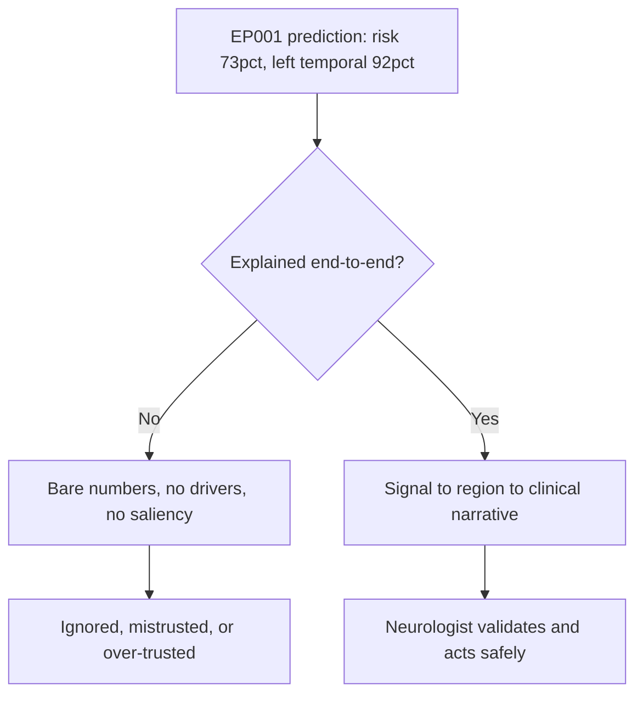
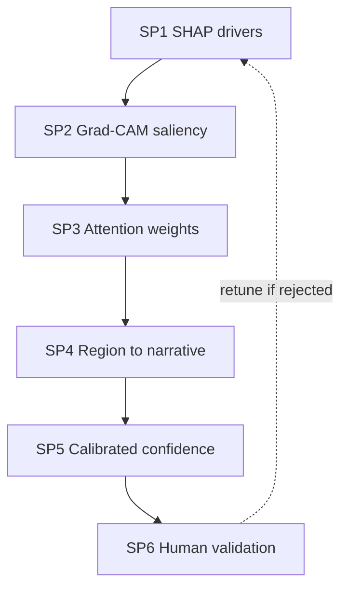
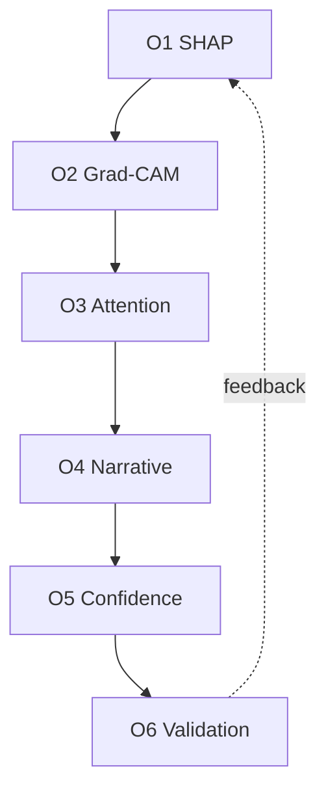
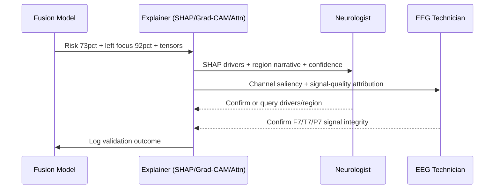
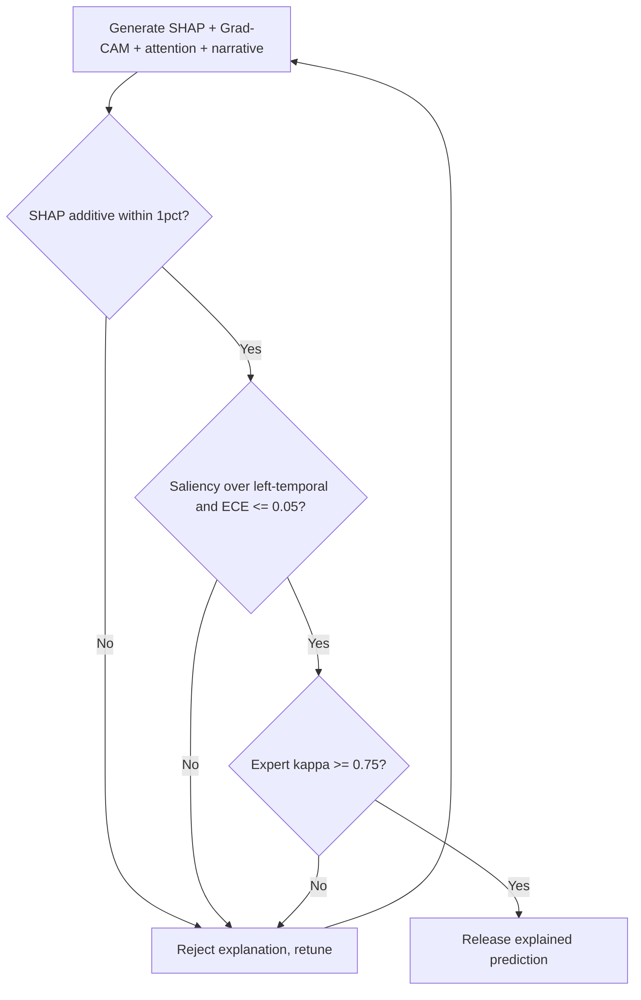
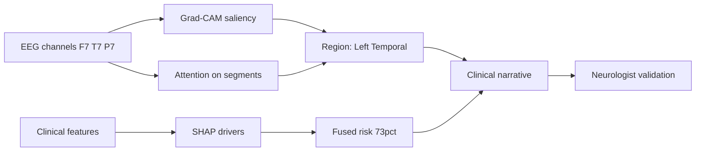
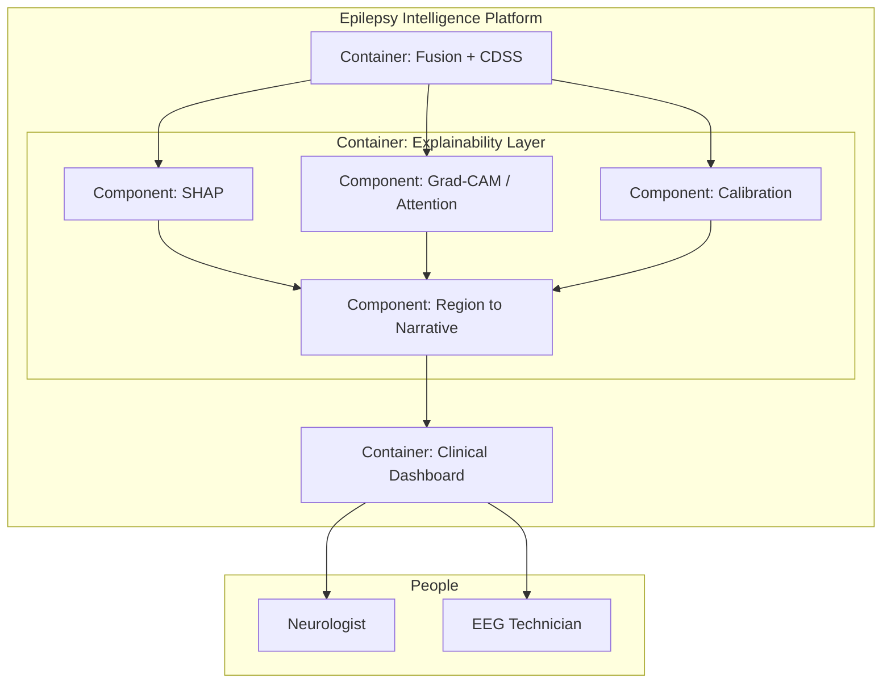
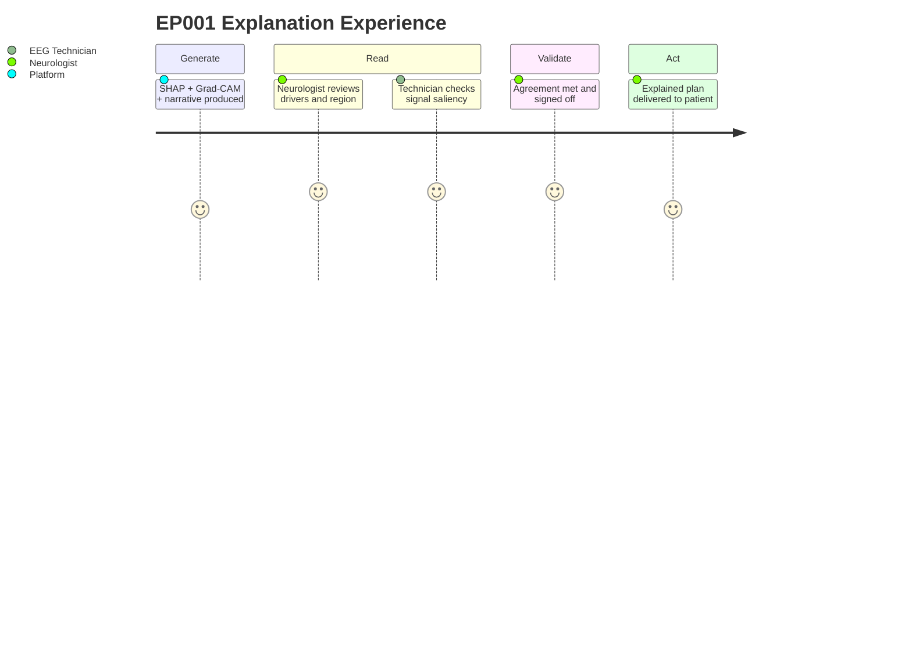

# Explainable AI — Signal → Region → Clinical Meaning (Epilepsy, EP001)

> **Why (this doc):** A left-temporal localisation and a 73% drug-resistance risk are only actionable if the neurologist can follow the reasoning from raw EEG signal to a clinical sentence. This pillar defines the platform's *post-hoc* explainability — SHAP attribution, Grad-CAM saliency, and attention weights mapped through brain region to a clinical narrative for EP001. It is the Responsible-AI-level companion to the engineering detail in `pipeline-a/phase-11-explainable-ai.md`; it frames explainability as a governance pillar and cross-links rather than duplicates that phase.
> **How:** Following the research spine (Problem → Sub-problems → Research Problem → Research Objective → Flow → Hypotheses → Statistical Analysis), then a DEFINITION table, a MECHANISMS/CONTROLS table, a KPI/METRICS table, a repo crosswalk, all four Mermaid diagram types plus a C4-style model — anchored to EP001 (29M, focal impaired-awareness, **left temporal**, F7/T7/P7 at 92% confidence, ~5 seizures/month on CBZ + LEV).

**Overarching question.** *Can every prediction for EP001 be traced end-to-end — from EEG signal and clinical features, through the epileptogenic region, to a faithful clinical explanation the neurologist validates — so that the platform's output is transparent rather than black-box?*

> **Cross-reference (no duplication):** The three-level explainability *stack* (global importance, local SHAP, counterfactual, calibrated confidence, role views, human validation) with EP001's exact 40%→73% SHAP decomposition lives in `docs/pipeline-a/phase-11-explainable-ai.md` and the EEG-side detail in `docs/pipeline-b/phase-12-eeg-explainable-ai.md`. This document governs *why explainability is a Responsible-AI pillar* and adds the signal→region→clinic mapping and the interpretable-vs-post-hoc positioning; see `07-interpretable-ai.md` for glass-box alternatives.

---

## 1. Problem

> **Why:** Explainability must anchor to a concrete decision failure, not to a general call for transparency. **How:** State what the neurologist cannot do when the EP001 output is opaque.

The platform fuses EP001's clinical history, adherence, sleep, trigger burden, and EEG into a fused risk and a left-temporal focus at F7/T7/P7. Delivered as bare numbers (73%; left, 92%), the neurologist cannot tell whether the risk driver is missed Levetiracetam, poor sleep, or trigger exposure — and cannot tell whether the localisation rests on genuine left-temporal slowing/spikes or on artifact. An accurate but unexplained output is clinically **unusable and unsafe** (over- or under-trusted). The problem is the missing, auditable path from signal to clinical meaning.

*Caption — This table decomposes the opacity problem into the concrete decision failures it causes for EP001, motivating the explainability pillar.*

| Failure mode | Who it affects | Consequence for EP001 |
|---|---|---|
| No visible risk driver | Neurologist | Cannot target dose vs sleep vs trigger |
| No spatial evidence for focus | Neurologist + EEG Tech | Cannot trust left-temporal call for surgical pathway |
| No confidence estimate | Both | Cannot distinguish firm 92% from a guess |
| No signal-quality attribution | EEG Technician | Cannot vouch the score rests on clean EEG |

**Reason:** The problem must contrast opaque vs explained output. **Why:** A single flowchart shows an unexplained prediction is clinically inert. **What is happening:** EP001's output is either bare numbers or a validated signal→region→clinic chain. **How it is happening:** The explained branch attaches drivers, saliency, and confidence before the neurologist acts. **Reference:** Rudin (2019) on the stakes of opacity; Holzinger et al. (2019) on causability.

---

## 2. Sub-Problems

> **Why:** Explainability decomposes into distinct explanatory questions. **How:** Enumerate the explanatory deficits as sub-problems with the resolving technique.

*Caption — This table lists each explanatory sub-problem with the post-hoc technique that resolves it.*

| # | Sub-problem | Resolving technique |
|---|---|---|
| SP1 | Which features drove EP001's fused risk? | Local SHAP attribution |
| SP2 | Where in the EEG/imaging is the evidence? | Grad-CAM / saliency over channels |
| SP3 | Which time-segments/channels did the model attend to? | Attention weights |
| SP4 | How does the region map to a clinical statement? | Region → narrative mapping |
| SP5 | How certain is the model? | Calibrated confidence |
| SP6 | Do experts agree the explanation is correct? | Human validation |

**Reason:** The sub-problems form an explanation chain, not a list. **Why:** Ordering SP1→SP6 mirrors the path from attribution to validated narrative. **What is happening:** Each technique refines the prior into a more clinically legible artefact. **How it is happening:** SHAP attributes, Grad-CAM localises, attention time-locates, mapping narrates, calibration qualifies, experts validate. **Reference:** Lundberg & Lee (2017); Selvaraju et al. (2020); Vaswani et al. (2017) attention.

---

## 3. Research Problem

> **Why:** One testable statement unifies the techniques. **How:** Frame explainability as a single answerable transparency question bound to EP001.

**Research problem:** *Can a post-hoc explainability layer produce, for every prediction about a focal-epilepsy patient like EP001, a faithful chain — SHAP feature drivers, Grad-CAM/attention spatial-temporal evidence, region-to-clinical-narrative mapping, and calibrated confidence — that both a neurologist and an EEG technician can read and validate as clinically correct?*

*Caption — This table sharpens the explainability problem into variables.*

| Element | Definition in this study |
|---|---|
| Independent variables | Presence of SHAP / Grad-CAM / attention / mapping / calibration |
| Dependent variables | Explanation completeness, fidelity, saliency-region agreement, calibration, validation rate |
| Constraint | Explanation must be faithful (additive reconstruction), not a plausible story; human validates |
| Population anchor | EP001 left-temporal focal epilepsy, F7/T7/P7, 92% |

---

## 4. Research Objective

> **Why:** The problem converts into measurable explanation goals. **How:** State one overarching objective decomposed into technique-level objectives.

**Overarching objective.** Deliver a faithful, validated signal→region→clinic explanation for every EP001 prediction, demonstrating transparent decision support rather than a black box.

*Caption — This table maps each objective onto a sub-problem and a measurable target.*

| Objective | Addresses | Headline measurable target |
|---|---|---|
| O1 Attribution | SP1 | Additive SHAP reconstructs score within ±1% |
| O2 Spatial evidence | SP2 | Grad-CAM peak over left-temporal channels |
| O3 Temporal evidence | SP3 | Attention concentrates on ictal/interictal segments |
| O4 Clinical mapping | SP4 | Region→narrative present for 100% of predictions |
| O5 Confidence | SP5 | Calibration ECE ≤ 0.05 |
| O6 Validation | SP6 | Neurologist–model agreement κ ≥ 0.75 |

**Reason:** Objectives must form an ordered, closed explanation pipeline. **Why:** The flowchart shows the techniques are sequential and reinforcing. **What is happening:** Each objective's artefact feeds the next; validation returns to attribution. **How it is happening:** The platform composes the chain for EP001 under human validation. **Reference:** Lundberg & Lee (2017); Selvaraju et al. (2020).

---

## 5. Flow (Runtime)

> **Why:** A defense needs the auditable signal→clinic path. **How:** Present the runtime as a stage table and a `sequenceDiagram`.

*Caption — This table traces one EP001 prediction from raw signal to a validated clinical narrative.*

| Stage | Input | Output |
|---|---|---|
| 1 Predict | EP001 fused features + EEG | Risk 73%; left focus 92% |
| 2 Attribute | Model + EP001 vector | SHAP drivers (burden, sleep, trigger) |
| 3 Localise | EEG tensor | Grad-CAM saliency over F7/T7/P7 |
| 4 Attend | Sequence model | Attention on key segments |
| 5 Narrate | Region + drivers | Clinical sentence (left temporal) |
| 6 Calibrate | Calibration set | Confidence band |
| 7 Validate | Chain + experts | κ agreement, sign-off |

**Reason:** The runtime must show the explanation composed and validated in order. **Why:** A sequence diagram makes explicit that the chain is delivered to both roles before action. **What is happening:** The model emits tensors; the explainer attributes, localises, narrates, and calibrates; both roles validate. **How it is happening:** Each message adds one explanatory layer before sign-off. **Reference:** Sendak et al. (2020); phase-11 role-specific views.

---

## 6. Hypotheses

> **Why:** Falsifiable hypotheses make explainability scientific. **How:** State the headline hypotheses with tests.

*Caption — The hypothesis table pairs each null with its alternative and the test.*

| ID | Null (H0) | Alternative (H1) | Test / statistic |
|---|---|---|---|
| H1 | SHAP is not additive/faithful | Reconstructs score within ±1% | Additive fidelity check |
| H2 | Grad-CAM peak unrelated to left-temporal | Peak over F7/T7/P7 | Saliency-region overlap |
| H3 | Explanations do not raise clinician agreement | They raise it | Paired t / Wilcoxon |
| H4 | Confidence uncalibrated | ECE ≤ 0.05 | Expected Calibration Error |
| H5 | Expert agreement no better than chance | κ ≥ 0.75 | Cohen's κ |

---

## 7. Statistical Analysis

> **Why:** The examiner probes how each explanation claim becomes a number. **How:** Bind each hypothesis to a metric, method, threshold, and EP001 read.

*Caption — This table lists, per claim, the metric, method, threshold, and EP001 illustration.*

| Metric | Method | Threshold | EP001 read |
|---|---|---|---|
| SHAP fidelity | Base + Σ contributions vs score | ±1% | 40% + drivers = 73% |
| Saliency-region overlap | Grad-CAM peak vs labelled channels | Peak on F7/T7/P7 | Left-temporal saliency |
| Explanation uplift | Agreement pre/post explanation | Δ > 0 | F7/T7/P7 narrative accepted |
| ECE | 10-bin calibration | ≤ 0.05 | 92% within ±5% |
| Expert agreement | Cohen's κ | ≥ 0.75 | κ = 0.81 (phase-11) |

**Reason:** The analysis must be a gated validation loop. **Why:** The flowchart proves release only after fidelity, localisation, calibration, and agreement clear. **What is happening:** The chain passes three gates or returns to retuning. **How it is happening:** Any failed gate withholds the explanation. **Reference:** Lundberg & Lee (2017); APA (2020).

---

## 8. What Explainable AI Means Here (Definition Table)

> **Why:** Explainability is ambiguous until defined for this domain. **How:** Define each technique in epilepsy terms with its EP001 artefact.

*Caption — This definition table fixes the meaning of each explainability technique, with a concrete EP001 artefact.*

| Technique | Definition in this platform | EP001 artefact |
|---|---|---|
| SHAP | Additive per-feature attribution of the risk score | 40% base + burden/sleep/trigger = 73% |
| Grad-CAM | Gradient saliency over EEG channels/time | Peak over F7/T7/P7 left-temporal |
| Attention | Weights over time-segments the model relied on | Ictal/interictal segment focus |
| Region→narrative | Mapping from focus to a clinical sentence | "Left temporal focus consistent with F7/T7/P7" |
| Calibrated confidence | Probability matching empirical accuracy | 92% within ±5% band |

---

## 9. Mechanisms & Controls

> **Why:** Each technique needs a concrete mechanism. **How:** Map each to its platform mechanism and enforcement point.

*Caption — This table binds each explainability technique to its concrete platform mechanism and enforcement point.*

| Technique | Concrete mechanism | Enforcement point |
|---|---|---|
| SHAP attribution | Additive local SHAP over fused features | `pipeline-a/phase-11` §9 |
| Counterfactual | Feasible minimal-change search | `pipeline-a/phase-11` §10 |
| Grad-CAM / saliency | Gradient saliency over EEG tensor | `pipeline-b/phase-12` EEG XAI |
| Calibrated confidence | Temperature scaling + ECE | `pipeline-a/phase-11` §11 |
| Role-specific views | Neurologist vs technician templates | `pipeline-a/phase-11` §12 |
| Human validation gate | κ / percent-agreement sign-off | `pipeline-a/phase-11` §14 |

---

## 10. KPI / Metrics

> **Why:** The committee measures whether explanations work. **How:** Give each technique a KPI, target, and source.

*Caption — This KPI table states, per technique, the indicator, its target threshold, and its source.*

| KPI | Technique | Target | Source |
|---|---|---|---|
| SHAP additive error | SHAP | ≤ ±1% | `phase-11` §9 |
| Saliency-region overlap | Grad-CAM | Peak on labelled channels | `phase-12` |
| Explanation completeness | Chain | 100% of predictions | `phase-11` §13 |
| Expected Calibration Error | Confidence | ≤ 0.05 | `phase-11` §11 |
| Neurologist–model κ | Validation | ≥ 0.75 | `phase-11` §14 (κ = 0.81) |
| Counterfactual accept rate | Counterfactual | ≥ 90% | `phase-11` §14 (92%) |

---

## 11. Where Implemented in This Repo

> **Why:** Explainability is credible only if mapped to artefacts. **How:** Tabulate each capability against the file that realises it.

*Caption — This crosswalk ties each explainability capability to the actual repository artefact, cross-linking phase-11/12 without duplicating them.*

| Capability | Repository artefact | What it does |
|---|---|---|
| Local SHAP + counterfactual + calibration | `docs/pipeline-a/phase-11-explainable-ai.md` | EP001 40%→73% decomposition, feasible changes, ECE 0.04 |
| EEG Grad-CAM / saliency | `docs/pipeline-b/phase-12-eeg-explainable-ai.md` | Channel saliency for the focus call |
| Localisation evidence | `analysis/fusion_analysis.py` → `ep001_case` | Left focus + confidence + region |
| Feature drivers for narrative | `analysis/primary_analysis.py` → `statistics` | Ordinal ORs / Spearman drivers |
| Explanation surfaced to human | `viewer/src/App.jsx` scoring engine | Level-tagged answers feeding the neurologist view |
| Explanation-as-pillar framing | `docs/responsible-ai/01-responsible-ai.md` | Transparency principle governance |

---

## 12. Signal → Region → Clinic Mapping (Network)

> **Why:** The core contribution of this pillar is the explicit mapping from raw signal to clinical meaning. **How:** Render it as a `graph LR` network for EP001.

*Caption — This network is the auditable signal→region→clinic path for EP001, the ordered transformation from EEG channels to a validated clinical narrative.*

**Reason:** The mapping must be shown as an explicit chain, not a claim. **Why:** The network renders the ordered path from channels and features to a validated narrative. **What is happening:** Saliency and attention converge on the left-temporal region; SHAP explains the risk; both feed the clinical narrative the neurologist validates. **How it is happening:** Grad-CAM localises spatially, attention time-locates, SHAP attributes, and the platform composes the sentence. **Reference:** Selvaraju et al. (2020); Lundberg & Lee (2017); Vaswani et al. (2017).

---

## 13. C4-Style Model

> **Why:** Explainability governance needs an explicit software map. **How:** Render a C4 container/component view of the explainability layer.

*Caption — This C4 model situates the explainability layer between the fusion model and the clinical dashboard, clarifying responsibilities.*

**Reason:** A dissertation explainability layer must show its components and consumers. **Why:** The C4 model names SHAP, Grad-CAM/attention, calibration, and mapping components and the two clinical consumers. **What is happening:** The fusion container feeds all explainer components, which converge on the region→narrative mapper surfaced to the dashboard. **How it is happening:** Each component is a distinct responsibility mapped to phase-11/12; edges show explanation flow to the neurologist and technician. **Reference:** Brown (2018) C4; Sendak et al. (2020).

---

## 14. Experience (Journey)

> **Why:** Explanation quality must be felt by its readers. **How:** Model the neurologist's and technician's experience across the explanation chain.

*Caption — This journey surfaces where confidence and friction arise as EP001's explanation is produced and validated.*

**Reason:** The chain must be experienced, not only tabulated. **Why:** A journey map exposes where the explanation builds trust or creates friction. **What is happening:** EP001's explanation moves from generation through dual-role review to signed, delivered plan. **How it is happening:** Each step corresponds to an explainer output or human checkpoint. **Reference:** Cramer et al. (1998); phase-11 §14.

---

## Professor Readiness (Defense Q&A)

> **Why:** Anticipating challenges shows command of the explainability design. **How:** Pre-answer likely questions concisely.

### Q1. How is a SHAP explanation faithful and not a plausible-sounding story?

> **Why:** Faithfulness is the central validity threat for post-hoc methods. **How:** Appeal to additive reconstruction.

SHAP is additive: EP001's population base (40%) plus signed feature contributions reconstructs the exact score (73%) within ±1% (`phase-11` §9). This is a mathematical property, not a narrative choice, so the explanation cannot silently disagree with the model.

### Q2. Post-hoc explanations can be misleading — why not just use an interpretable model?

> **Why:** Rudin (2019) argues against explaining black boxes. **How:** Position this pillar against `07-interpretable-ai`.

Both are used deliberately. Where a glass-box ordinal-logistic model suffices (severity drivers), the platform prefers it (`07-interpretable-ai`) because it is inherently transparent. Where deep EEG models add localisation accuracy the glass box cannot match, post-hoc SHAP/Grad-CAM/attention explain them — always gated by human validation (κ ≥ 0.75) and calibrated confidence, so the residual risk of a misleading explanation is bounded and audited.

### Q3. Grad-CAM says left-temporal, but what if it highlights artifact?

> **Why:** Saliency can lock onto noise. **How:** Tie explanation validity to signal validity.

The EEG technician validates that the F7/T7/P7 saliency rests on genuine low-artifact signal (impedance, readiness) before the localisation is trusted (`phase-11` §12/§14, 96% technician agreement). If saliency and signal-quality attribution disagree, the case routes to expert read rather than auto-report.

### Q4. How does this pillar avoid duplicating phase-11?

> **Why:** The examiner will check for redundancy. **How:** State the division of labour.

Phase-11 is the engineering specification (the exact SHAP table, counterfactual menu, calibration numbers). This pillar governs explainability *as a Responsible-AI principle*: it adds the signal→region→clinic mapping (Section 12), the interpretable-vs-post-hoc positioning, and the KPI/threshold governance, and cross-links phase-11/12 for the numbers rather than restating them.

---

## References

American Psychological Association. (2020). *Publication manual of the American Psychological Association* (7th ed.). https://doi.org/10.1037/0000165-000

Holzinger, A., Langs, G., Denk, H., Zatloukal, K., & Müller, H. (2019). Causability and explainability of artificial intelligence in medicine. *WIREs Data Mining and Knowledge Discovery, 9*(4), e1312. https://doi.org/10.1002/widm.1312

Lundberg, S. M., & Lee, S. I. (2017). A unified approach to interpreting model predictions. *Advances in Neural Information Processing Systems, 30*, 4765–4774.

Rudin, C. (2019). Stop explaining black box machine learning models for high stakes decisions and use interpretable models instead. *Nature Machine Intelligence, 1*(5), 206–215. https://doi.org/10.1038/s42256-019-0048-x

Selvaraju, R. R., Cogswell, M., Das, A., Vedantam, R., Parikh, D., & Batra, D. (2020). Grad-CAM: Visual explanations from deep networks via gradient-based localization. *International Journal of Computer Vision, 128*(2), 336–359. https://doi.org/10.1007/s11263-019-01228-7

Sendak, M. P., Gao, M., Brajer, N., & Balu, S. (2020). Presenting machine learning model information to clinical end users with model facts labels. *npj Digital Medicine, 3*, 41. https://doi.org/10.1038/s41746-020-0253-3

Topol, E. J. (2019). High-performance medicine: The convergence of human and artificial intelligence. *Nature Medicine, 25*(1), 44–56. https://doi.org/10.1038/s41591-018-0300-7

Vaswani, A., Shazeer, N., Parmar, N., Uszkoreit, J., Jones, L., Gomez, A. N., Kaiser, Ł., & Polosukhin, I. (2017). Attention is all you need. *Advances in Neural Information Processing Systems, 30*, 5998–6008.
