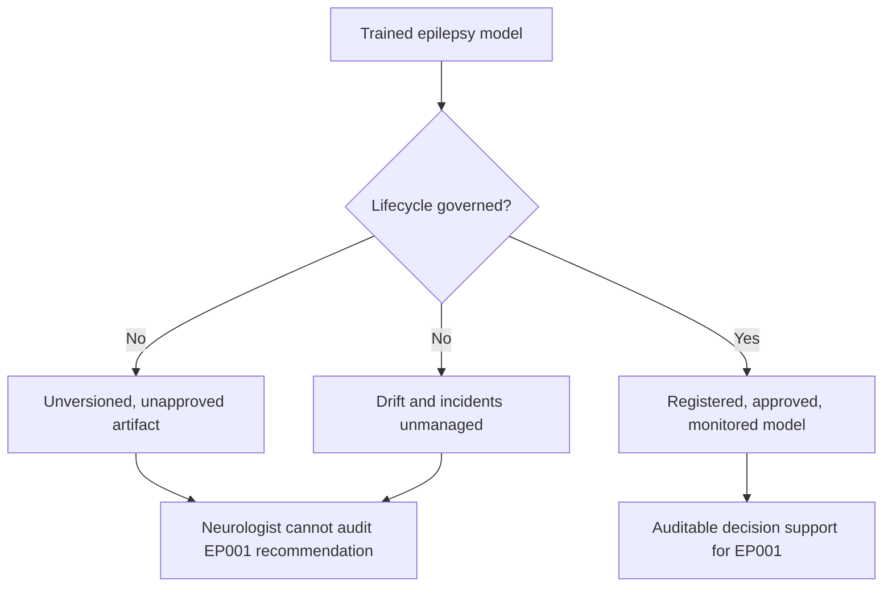
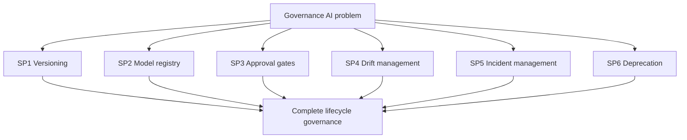
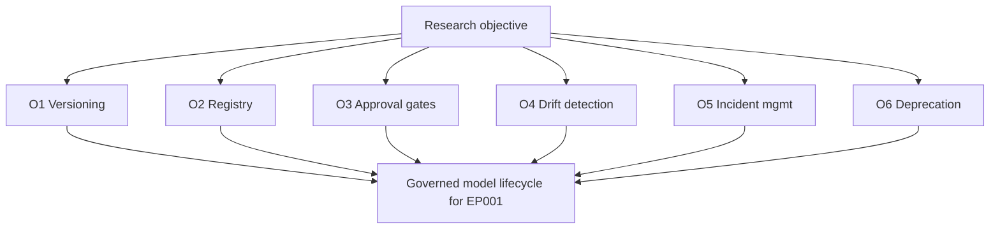
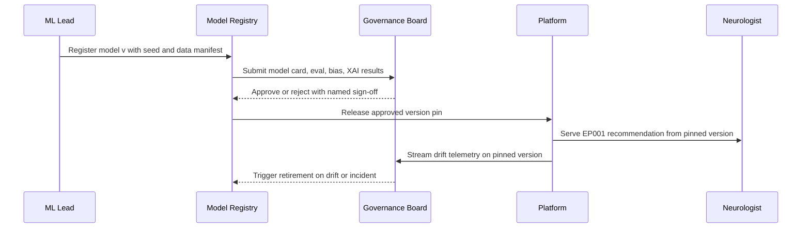
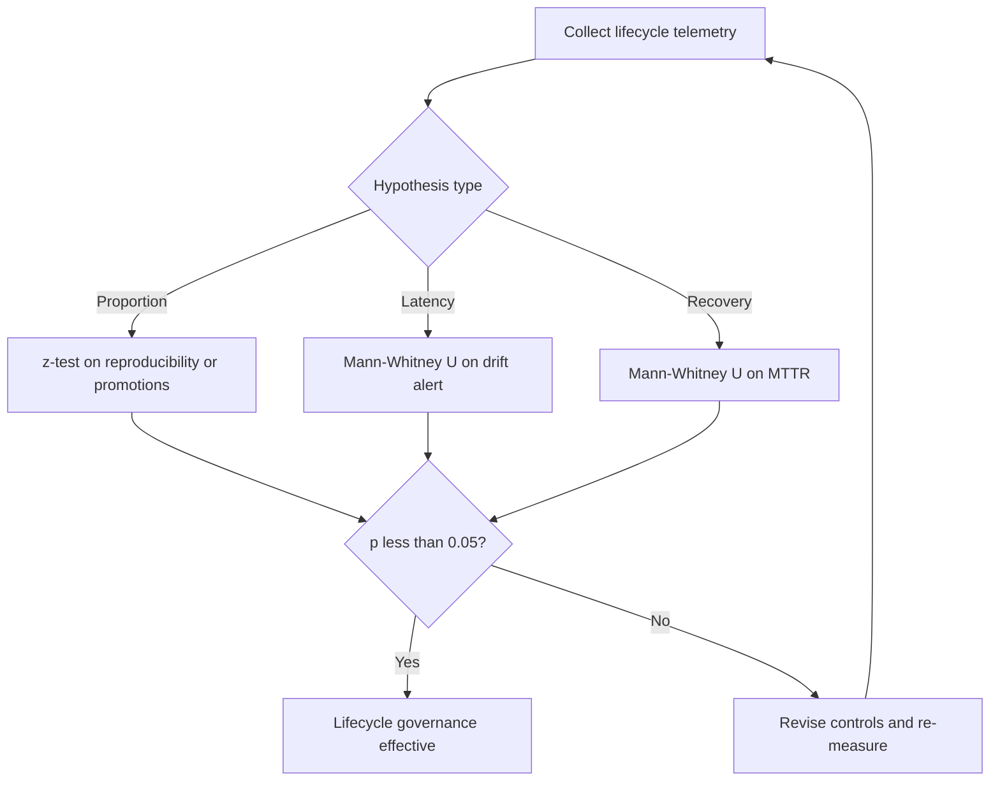
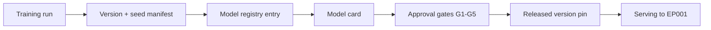
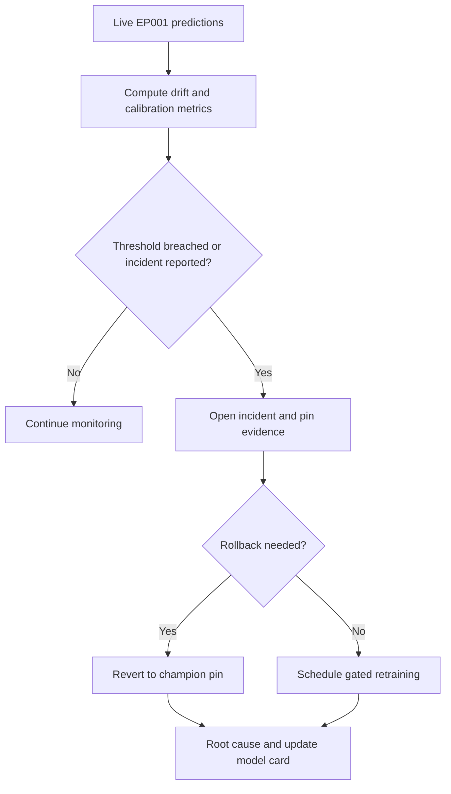
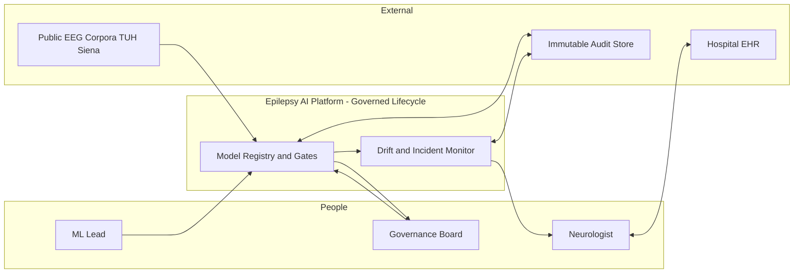
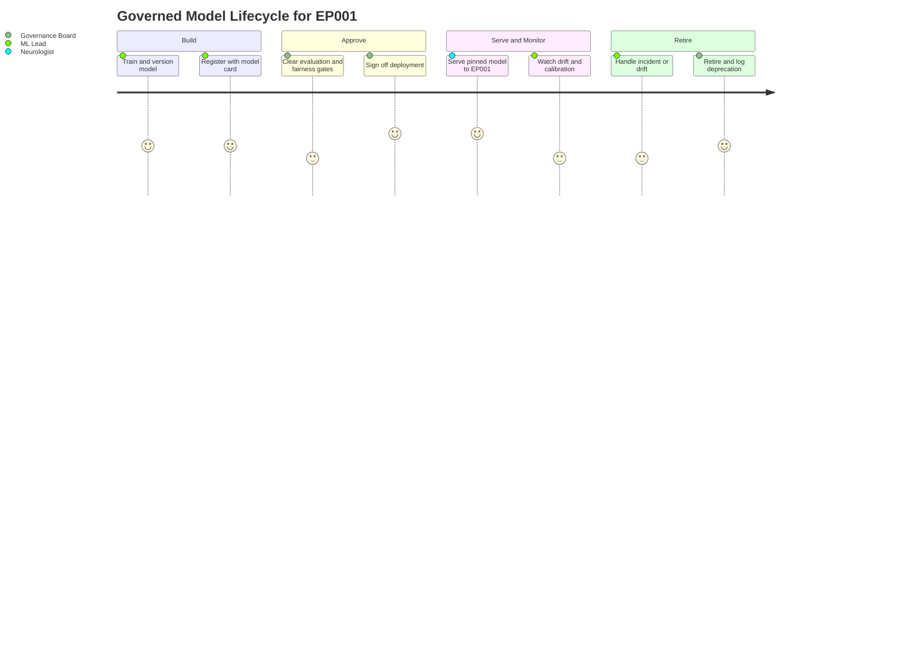

# Responsible AI Pillar 06 - Governance AI (Epilepsy, EP001)

> **Why (this doc):** An explainable remote epilepsy care platform that localizes the epileptogenic focus and stratifies seizure risk for a patient like EP001 cannot be defended unless the *lifecycle* of every model is governed - versioned, registered, gated at approval, watched for drift, and retired when unsafe. Governance AI is the discipline that makes a model's birth, promotion, and death auditable, so the Neurologist is supported by an accountable system rather than an unmanaged black box.
> **How:** By following the mandatory research spine (Problem -> Sub-problems -> Research Problem -> Research Objective -> Flow -> Hypotheses -> Statistical Analysis), then defining Governance AI, its lifecycle mechanisms/controls, a model-registry and incident register, a repo-implementation crosswalk, all four Mermaid diagram types plus a C4 model, a defense Q&A, and APA-7 references - every table captioned, every heading carrying a **Why**/**How**, anchored to test patient EP001 (left temporal, F7/T7/P7, 92%). This pillar extends, and does not duplicate, `docs/pipeline-a/phase-16-governance-compliance.md`.

**Governing question.** *Can the full lifecycle of every epilepsy model - from training run to model-registry entry to approval gate to drift-triggered retirement - be governed so that the Neurologist only ever acts on a versioned, approved, monitored model for patients such as EP001?*

---

## 1. Problem

> **Why:** Model-lifecycle governance must anchor to a concrete failure mode before controls are proposed. **How:** State the gap between a model that performs in a notebook and a model that is safe to promote, monitor, and retire in clinical service for EP001.

A localization model may reach 92% confidence on EP001's left-temporal focus in development, yet reach clinical service as an *ungoverned* artifact: no immutable version pin, no record of who approved it, no baseline to detect drift when the EEG amplifier firmware changes, and no defined path to roll it back after an incident. The problem is not model accuracy - it is the **absence of lifecycle governance**: unversioned models, unrecorded approvals, silent drift, and undefined retirement. Without it, the Neurologist cannot know *which* model produced EP001's recommendation, whether it was approved, or whether it has silently degraded since.

*Caption - The table below decomposes the abstract governance gap into concrete lifecycle failure modes and the control that answers each, so every later section maps to a named failure.*

| Lifecycle failure mode | Manifestation for EP001 | Governance answer (Section) |
|---|---|---|
| Unversioned model | Cannot reproduce the model that localized F7/T7/P7 | Versioning + registry (S8) |
| Unrecorded approval | No named sign-off before clinical exposure | Approval gates (S8) |
| Silent drift | 512 Hz pipeline changes; confidence miscalibrates unnoticed | Drift management (S9) |
| Undefined incident path | Wrong localization has no rollback or root-cause route | Incident management (S9) |
| Orphaned retirement | Superseded model still serves EP001 in production | Deprecation policy (S8) |

**Reason:** The problem must be shown as a fork between an ungoverned and a governed model lifecycle. **Why:** A single flowchart contrasts the unmanaged artifact against the registered, approved, monitored model, making the value of governance non-verbal. **What is happening:** A decision node splits the trained model into an ungoverned branch (unversioned, undrift-checked, unauditable) and a governed branch that ends in an auditable recommendation for EP001. **How it is happening:** The governed branch inserts registry, approval, and monitoring controls before any output reaches the Neurologist. **Reference:** NIST (2023) AI RMF Govern function; extends `pipeline-a/phase-16-governance-compliance.md` S12 retraining policy.

---

## 2. Sub-Problems

> **Why:** One lifecycle problem must split into individually ownable governance units. **How:** Enumerate the discrete lifecycle questions the platform must answer, each with an owner.

*Caption - This table lists each governance sub-problem with its owning role, ensuring no phase of the model lifecycle is orphaned.*

| # | Sub-problem | Primary owner |
|---|---|---|
| SP1 | How is every model uniquely versioned and reproducible? | ML Lead |
| SP2 | Where is the authoritative model registry and what does it hold? | ML Lead + Data Steward |
| SP3 | Who approves promotion and what gates must pass? | Governance Board |
| SP4 | How is drift detected and escalated after deployment? | ML Lead |
| SP5 | How are model incidents triaged, rolled back, and root-caused? | Neurologist Lead + ML Lead |
| SP6 | How and when is a model deprecated and retired? | Governance Board |

**Reason:** The sub-problems must be seen to converge on one governance system. **Why:** The flowchart shows six independent lifecycle questions rolling up into a single governed lifecycle, proving coverage. **What is happening:** Each sub-problem is a node feeding the complete lifecycle governance node. **How it is happening:** Each has a named owner (table) and a control section downstream. **Reference:** NIST (2023) AI RMF Map/Manage functions.

---

## 3. Research Problem

> **Why:** The examiner needs one crisp, testable statement unifying the sub-problems. **How:** Frame lifecycle governance as a single answerable research problem bound to EP001.

**Research problem:** *How can an enterprise epilepsy AI platform govern the complete model lifecycle - versioning, registry, approval gates, drift monitoring, incident response, and deprecation - so that only reproducible, approved, and continuously monitored models ever produce decision support for the Neurologist treating a patient such as EP001, with every promotion and retirement fully auditable?*

*Caption - This table sharpens the research problem into independent, dependent, and constraint variables so lifecycle governance stays measurable and bounded.*

| Element | Definition in this study |
|---|---|
| Independent variables | Presence of versioning, registry entry, approval gate, drift monitor, incident process |
| Dependent variables | Reproducibility rate, un-approved promotion count, drift detection latency, incident MTTR |
| Constraint | No model reaches EP001 without a registry entry and named approval |
| Population anchor | EP001 focal impaired-awareness epilepsy, left temporal, F7/T7/P7, 92% |

---

## 4. Research Objective

> **Why:** The problem must convert into build-and-measure goals. **How:** State one overarching objective decomposed into lifecycle-specific objectives, each traceable to a sub-problem and yielding an auditable artifact.

**Overarching objective.** Design and evaluate a governed model lifecycle for the epilepsy platform that guarantees every model serving EP001 is versioned, registered, approval-gated, drift-monitored, and cleanly retired - and quantify governance effectiveness against reproducibility, approval, drift-latency, and incident metrics.

*Caption - Each objective yields a concrete, auditable artifact, making lifecycle governance verifiable rather than aspirational.*

| # | Objective | Deliverable artifact | Success metric |
|---|---|---|---|
| O1 | Version and reproduce every model | Immutable version + seed manifest | 100% models reproducible from manifest |
| O2 | Maintain an authoritative model registry | Model registry + model cards | Every serving model has a registry entry |
| O3 | Enforce approval gates before promotion | Gate checklist + sign-off log | 0 un-approved promotions |
| O4 | Detect and escalate drift | Drift dashboard + alerts | Alert within 24h of threshold breach |
| O5 | Manage model incidents | Incident register + rollback runbook | MTTR < 24h; 100% root-caused |
| O6 | Govern deprecation and retirement | Deprecation policy + retirement log | 0 orphaned models in production |

**Reason:** Objectives must be an ordered, closed lifecycle to prove coherence. **Why:** The flowchart shows the six objectives as stages of one governed lifecycle rather than a scatter of controls. **What is happening:** Each objective feeds the governed lifecycle node that serves EP001. **How it is happening:** Each objective maps to an artifact and metric in the table above. **Reference:** NIST (2023) AI RMF; FDA (2021) predetermined change-control plan for versioned models.

---

## 5. Flow (End-to-End Lifecycle Runtime)

> **Why:** A defense requires an auditable picture of how a model moves from training to a governed, monitored serving state for EP001. **How:** Present the lifecycle as a stage table and a `sequenceDiagram` across ML Lead, registry, board, and Neurologist.

*Caption - This table traces one model through each lifecycle stage so the reviewer can audit where governance enters.*

| Stage | Actor/component | Input | Governance gate |
|---|---|---|---|
| 1 Train | ML Lead | Public corpora + seeds | Seed + data lineage logged |
| 2 Register | Model registry | Trained artifact | Version pinned + model card |
| 3 Approve | Governance Board | Eval + bias + explainability results | Named sign-off recorded |
| 4 Serve | Platform | Approved version | Version pin enforced at inference |
| 5 Monitor | Drift monitor | Live EP001 predictions | Baseline comparison + alerts |
| 6 Retire | Governance Board | Drift/incident evidence | Deprecation + rollback logged |

**Reason:** The lifecycle must show ordered interaction over time between humans, registry, and platform. **Why:** A sequence diagram makes explicit that no model serves EP001 before a named board approval and that drift telemetry can trigger retirement. **What is happening:** The ML Lead registers a versioned model; the board approves; the platform serves the pinned version to the Neurologist; drift telemetry flows back and can trigger retirement. **How it is happening:** Every message is logged; the version pin is enforced at inference so the served model is always identifiable. **Reference:** Sculley et al. (2015) on technical debt in ML systems; extends `pipeline-a/phase-16` S12.

---

## 6. Hypotheses

> **Why:** Falsifiable hypotheses make the governance programme scientific. **How:** State four hypotheses, each paired with the statistic that tests it.

*Caption - The hypothesis table pairs each null with its alternative and the measured variable, so governance effectiveness is independently falsifiable.*

| ID | Null (H0) | Alternative (H1) | Measured variable |
|---|---|---|---|
| H1 | Registry does not change reproducibility rate | Registry raises reproducibility to 100% | Reproducible-from-manifest rate |
| H2 | Approval gates do not change un-approved promotions | Gates reduce un-approved promotions to zero | Count of un-approved promotions |
| H3 | Drift monitoring does not shorten detection time | Monitoring shortens time-to-detect drift | Hours to drift alert |
| H4 | Incident process does not change recovery time | Process reduces mean time to recover | Incident MTTR |

---

## 7. Statistical Analysis

> **Why:** The examiner will probe how each governance claim becomes a number. **How:** Bind every hypothesis to a test, threshold, and EP001 read, then show the validation loop as a flowchart.

*Caption - This table binds each hypothesis to a statistical method and decision rule, so lifecycle governance is judged objectively.*

| Hypothesis | Test | Threshold / decision rule | EP001 read |
|---|---|---|---|
| H1 | One-proportion z-test vs baseline | Reject H0 if reproducibility = 100%, p < 0.05 | EP001's localizer rebuilds bit-identical from manifest |
| H2 | One-proportion z-test vs 0 | Reject H0 if un-approved promotions = 0, p < 0.05 | No unapproved model localized EP001 |
| H3 | Mann-Whitney U on detection latency | Reject H0 if monitored < unmonitored, p < 0.05 | Confidence drift on F7/T7/P7 flagged early |
| H4 | Mann-Whitney U on MTTR | Reject H0 if governed < ungoverned, p < 0.05 | Wrong-localization incident recovered < 24h |

**Reason:** The analysis plan must be a gated loop, not a single pass. **Why:** The flowchart proves governance is only declared effective after reproducibility, approval, drift, and recovery gates clear statistically. **What is happening:** Telemetry is routed by hypothesis type to the right test; failing any gate returns to control revision. **How it is happening:** Each test has an explicit decision rule (table) tied to EP001. **Reference:** APA (2020) on transparent analysis reporting.

---

## 8. Definition, Versioning, Registry & Approval Gates

> **Why:** Governance AI must first be defined, then made operational through versioning, a registry, and gates. **How:** A definition table, a versioning/registry mechanisms table, and an approval-gate control table.

### 8.1 Definition of Governance AI

*Caption - This table defines Governance AI and its lifecycle scope, fixing terminology before mechanisms are specified.*

| Term | Definition in this study | EP001 relevance |
|---|---|---|
| Governance AI | Discipline governing the full model lifecycle (train->register->approve->serve->monitor->retire) | Ensures EP001 is served only governed models |
| Model version | Immutable identifier binding code, data, and seed | Identifies the localizer that produced 92% |
| Model registry | Authoritative store of versions, model cards, approvals | Single source of truth for EP001's model |
| Approval gate | Mandatory checkpoint requiring named human sign-off | Blocks unapproved exposure to EP001 |
| Drift | Statistically significant change in inputs/outputs vs baseline | Detects EEG-pipeline change affecting F7/T7/P7 |
| Deprecation | Governed retirement of a superseded/unsafe model | Removes orphaned models from EP001 service |

### 8.2 Versioning & Registry Mechanisms

*Caption - This table names each versioning/registry control and what it captures, converting "we version models" into an auditable practice.*

| Mechanism | Control | Captured artifact |
|---|---|---|
| Semantic versioning | MAJOR.MINOR.PATCH per model | Version tag in registry |
| Seed manifest | Pinned random seeds + data hash | Reproducibility manifest |
| Model card | Intended use, metrics, limits, subgroup performance | Registry model card |
| Data lineage link | Corpus + preprocessing commit hash | Lineage record |
| Immutable audit | Append-only registry log | Tamper-evident history |

### 8.3 Approval Gates

*Caption - This table lists the mandatory gates between a candidate and production, preventing ungoverned promotion for EP001's care.*

| Gate | Owner | Pass criterion |
|---|---|---|
| G1 Evaluation | ML Lead | Localization accuracy >= 90%, ECE <= 0.05 |
| G2 Fairness | AI Ethics Lead | Subgroup ECE gap < 0.05 |
| G3 Explainability | Explainability Officer | Faithful rationale on sampled outputs |
| G4 Clinical validity | Neurologist Lead | Intended-use scope confirmed |
| G5 Board sign-off | Governance Board | Named approval + shadow-deploy plan |

**Reason:** The path from a training run to a served model must be a single legible network. **Why:** The `graph LR` shows versioning and registry sitting *before* approval and serving, proving governance is inline, not bolted on. **What is happening:** A training run becomes a versioned, carded registry entry, clears five gates, and only then is released as a pin serving EP001. **How it is happening:** Each node is an artifact in the registry; the pin is what the platform enforces at inference. **Reference:** Mitchell et al. (2019) model cards; FDA (2021) SaMD change-control.

---

## 9. Drift & Incident Management + Registry/Metrics Register

> **Why:** A model approved at launch can drift or fail; both must be managed with owners and metrics. **How:** A drift/incident controls table and a combined model-registry/incident register with likelihood x impact.

### 9.1 Drift & Incident Controls

*Caption - This table names each post-deployment monitor and incident control, its metric, threshold, and response, making "we manage drift" auditable.*

| Control | Metric | Threshold | Response |
|---|---|---|---|
| Data drift monitor | PSI on EEG feature distribution | PSI > 0.2 | Investigate EEG pipeline |
| Concept drift monitor | Rolling localization AUROC | Drop > 5% vs baseline | Trigger retraining review |
| Calibration drift | ECE on confidence | ECE > 0.05 | Recalibrate + shadow test |
| Incident intake | Clinician-reported error | Any confirmed error | Open incident, pin evidence |
| Rollback | Revert to prior approved pin | On confirmed incident | Restore champion version |

### 9.2 Model Registry & Incident Register

*Caption - This register ranks the top lifecycle risks by likelihood x impact with owner and mitigation, so the board prioritizes governance effort where exposure is greatest.*

| ID | Lifecycle risk | Likelihood | Impact | Mitigation | Owner |
|---|---|---|---|---|---|
| G-R1 | Unversioned model reaches EP001 | Low | High | Registry gate + version pin | ML Lead |
| G-R2 | Un-approved promotion | Low | High | Mandatory G5 board sign-off | Governance Board |
| G-R3 | Silent calibration drift on F7/T7/P7 | Medium | High | ECE drift monitor + alert | ML Lead |
| G-R4 | Delayed incident recovery | Medium | Medium | Rollback runbook + MTTR SLO | Neurologist Lead |
| G-R5 | Orphaned model left in production | Low | Medium | Deprecation policy + retirement log | Governance Board |

**Reason:** Drift and incidents must be shown as a governed response loop. **Why:** The flowchart proves that any breach or reported error routes to a defined incident, rollback, and root-cause path rather than ad-hoc firefighting. **What is happening:** Live EP001 predictions are measured; a breach opens an incident that either rolls back to the champion or schedules gated retraining, always ending in root cause. **How it is happening:** Thresholds and responses are those in the controls table; the champion pin is the last approved registry version. **Reference:** NIST (2023) AI RMF Manage function; extends `pipeline-a/phase-16` S10-S12.

---

## 10. Where Implemented in This Repo

> **Why:** Governance AI is credible only if it maps to concrete, authored implementation. **How:** Tabulate each governance mechanism against the repository artifact that realises it.

*Caption - This crosswalk ties each lifecycle-governance mechanism to where it lives in the repository, proving the pillar is realised, not aspirational.*

| Governance mechanism | Where implemented in this repo | Anchor |
|---|---|---|
| Retraining & rollback policy | `docs/pipeline-a/phase-16-governance-compliance.md` S12 | Gated promotion |
| Bias/drift monitoring | `docs/pipeline-a/phase-16` S10 | PSI/AUROC/ECE monitors |
| Explainability audit trail | `docs/pipeline-a/phase-11-explainable-ai.md` | Per-output rationale log |
| Reproducible seeds + lineage | Analysis manifests / dataset scripts | Seed + data hash |
| Consent & de-identification to Study ID | Study ID DBA-EP-001 mapping | De-identified EEG |
| Human-in-the-loop sign-off | Fusion / CDSS neurologist gate (`pipeline-c-multimodal.md`) | Named approval |
| Model registry & versioning | This pillar S8 (registry design) | Version pins |

---

## 11. C4-Style Model (Governance Context)

> **Why:** Governance requires an explicit map of who and what touches the model lifecycle. **How:** A C4 Level-1 context model naming actors, the platform, and external systems around the governed lifecycle.

*Caption - The C4 context model situates the governed model lifecycle among its human actors and external systems, clarifying trust and approval boundaries.*

**Reason:** Governance needs a single map of the lifecycle's trust boundary. **Why:** A C4 Level-1 model names every actor and system that can create, approve, monitor, or audit a model, fixing where approval authority sits. **What is happening:** The ML Lead and corpora feed the registry; the board approves; the monitor watches serving and reports to the Neurologist; the audit store records everything. **How it is happening:** The registry-and-gates plus monitor form the system-in-focus; bidirectional edges to the audit store make the lifecycle tamper-evident. **Reference:** Brown (2018) C4 model for software architecture; Sendak et al. (2020) on situating clinical AI within organizational oversight.

---

## 12. Journey (Governance Lifecycle Experience)

> **Why:** The lifecycle must be felt from the governing roles' point of view, not only measured. **How:** A journey map across ML Lead, board, and Neurologist over one model's life.

*Caption - This journey maps the recurring governance experience from training to retirement, exposing where confidence and friction arise.*

**Reason:** Lifecycle governance must surface human confidence and friction. **Why:** A journey map complements the metrics by showing where approval and monitoring feel heavy or reassuring across roles. **What is happening:** A model is built, approved, served to EP001, monitored, and retired, with satisfaction scored per step. **How it is happening:** Each lifecycle phase is a journey section owned by the responsible role. **Reference:** Topol (2019) on human-plus-AI clinical workflow.

---

## 13. Professor Readiness (Defense Q&A)

> **Why:** Anticipating examiner challenges demonstrates command of lifecycle governance. **How:** Pre-answer the likely questions with concise reasoning, tables, or logic.

### Q1. Which exact model produced EP001's 92% localization, and can you prove it?

> **Why:** Reproducibility is the crux of model accountability. **How:** Point to versioning and the registry.

Every serving model carries a semantic version bound to a seed manifest (pinned seeds + data hash) and a model card in the registry. EP001's recommendation records the version pin at inference, so the exact model is identifiable and rebuildable bit-identical from its manifest (H1, tested by one-proportion z-test vs a 100% target).

### Q2. How do you guarantee no un-approved model ever reaches EP001?

> **Why:** Un-approved promotion is a direct safety risk. **How:** Mandatory gates plus a hard metric.

Five approval gates (evaluation, fairness, explainability, clinical validity, board sign-off) must pass before a version is released; the platform enforces the released pin at inference. The KPI "un-approved promotions" has a hard target of 0, tested by z-test (H2). No named board sign-off means no release.

### Q3. What happens when the EEG pipeline changes and confidence drifts?

> **Why:** Drift is inevitable and can silently miscalibrate. **How:** Monitored thresholds routing to a governed response.

Data drift (PSI > 0.2), concept drift (AUROC drop > 5%), or calibration drift (ECE > 0.05) raises an alert within 24h (H3). The response is a governed loop: open an incident, roll back to the champion pin if needed, or schedule gated retraining, always ending in root cause and a model-card update.

### Q4. How does this differ from the Phase-16 governance chapter?

> **Why:** The committee will check for duplication. **How:** Position this pillar as the lifecycle deepening of Phase 16.

Phase 16 establishes the board, Responsible AI principles, and retraining/security posture. This pillar deepens the *lifecycle* mechanics - versioning, registry, model cards, approval gates, drift/incident registers, and deprecation - and cross-links back rather than restating them (see S10 crosswalk).

---

## 14. References

> **Why:** Defensible claims require real, citable sources. **How:** APA 7th edition entries spanning AI governance, model lifecycle, and epilepsy clinical AI.

American Psychological Association. (2020). *Publication manual of the American Psychological Association* (7th ed.). https://doi.org/10.1037/0000165-000

Brown, S. (2018). *The C4 model for visualising software architecture*. C4model.com. https://c4model.com

European Parliament and Council of the European Union. (2024). *Regulation (EU) 2024/1689 laying down harmonised rules on artificial intelligence (Artificial Intelligence Act)*. Official Journal of the European Union.

International Electrotechnical Commission. (2006). *IEC 62304: Medical device software - Software life cycle processes*. International Electrotechnical Commission.

Mitchell, M., Wu, S., Zaldivar, A., Barnes, P., Vasserman, L., Hutchinson, B., Spitzer, E., Raji, I. D., & Gebru, T. (2019). Model cards for model reporting. *Proceedings of the Conference on Fairness, Accountability, and Transparency*, 220-229. https://doi.org/10.1145/3287560.3287596

National Institute of Standards and Technology. (2023). *Artificial intelligence risk management framework (AI RMF 1.0)* (NIST AI 100-1). U.S. Department of Commerce. https://doi.org/10.6028/NIST.AI.100-1

Sculley, D., Holt, G., Golovin, D., Davydov, E., Phillips, T., Ebner, D., Chaudhary, V., Young, M., Crespo, J. F., & Dennison, D. (2015). Hidden technical debt in machine learning systems. *Advances in Neural Information Processing Systems, 28*, 2503-2511.

Sendak, M. P., Gao, M., Brajer, N., & Balu, S. (2020). Presenting machine learning model information to clinical end users with model facts labels. *npj Digital Medicine, 3*, 41. https://doi.org/10.1038/s41746-020-0253-3

Topol, E. J. (2019). High-performance medicine: The convergence of human and artificial intelligence. *Nature Medicine, 25*(1), 44-56. https://doi.org/10.1038/s41591-018-0300-7

U.S. Food and Drug Administration. (2021). *Artificial intelligence/machine learning (AI/ML)-based software as a medical device (SaMD) action plan*. U.S. Food and Drug Administration.
