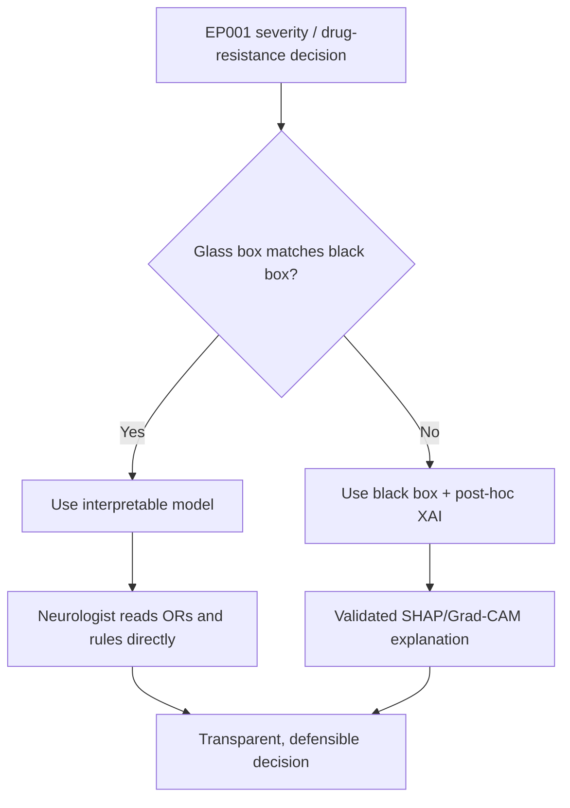
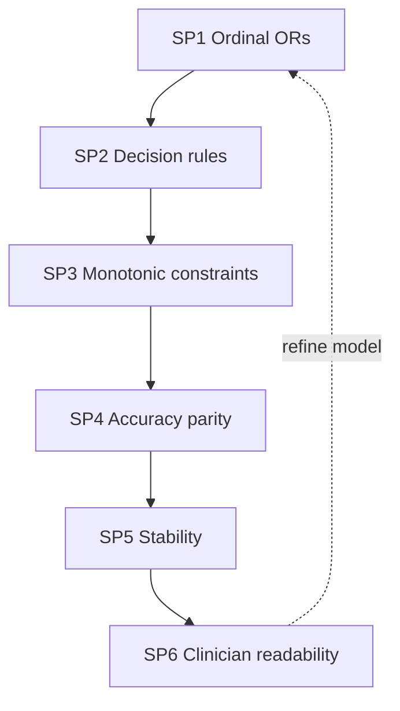
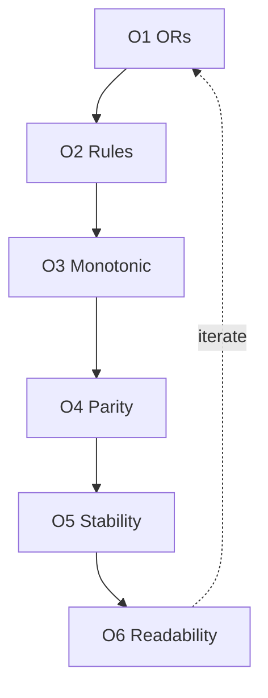
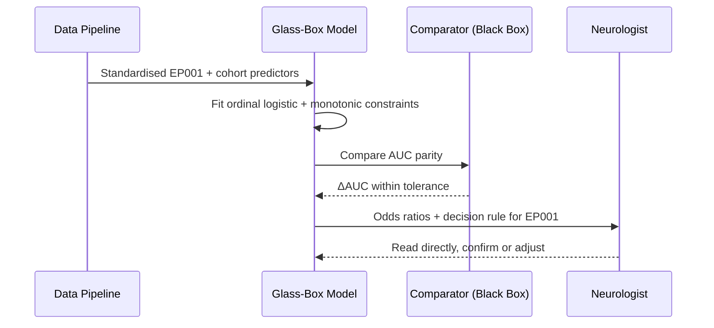
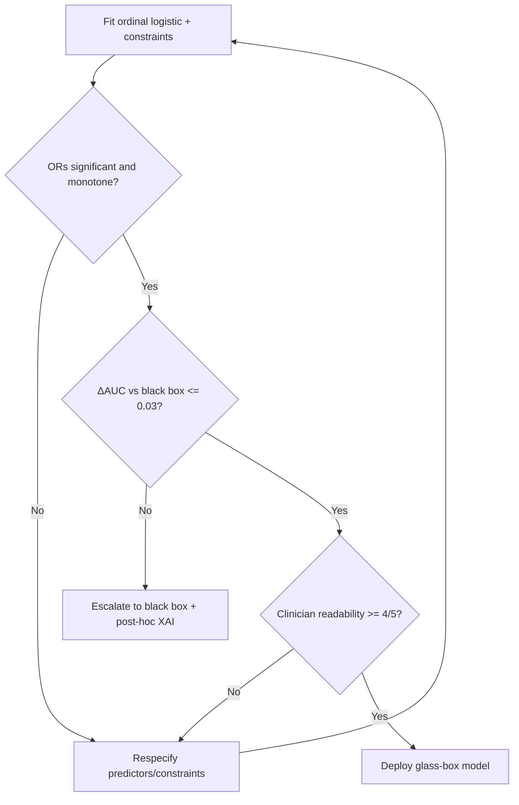
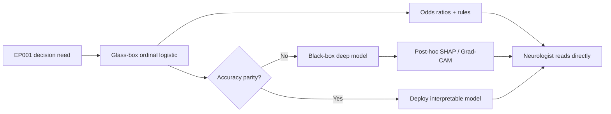
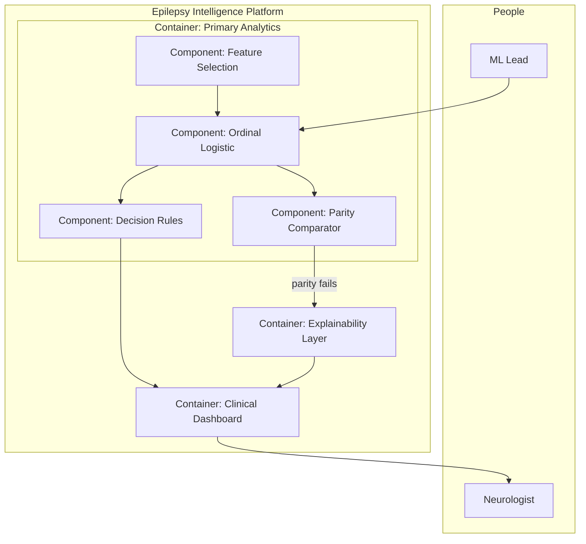
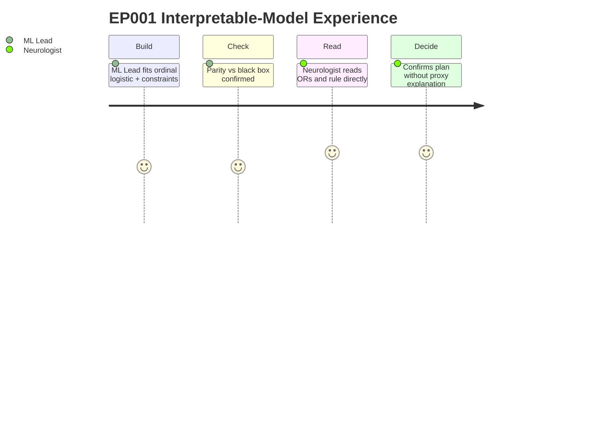

# Interpretable AI — Glass-Box Models by Design (Epilepsy, EP001)

> **Why (this doc):** Post-hoc explanations describe a black box after the fact; an interpretable model *is* transparent by construction. This pillar argues that where a glass-box model — ordinal logistic regression with reportable odds ratios, decision rules, and monotonic constraints — matches black-box performance for epilepsy severity and drug-resistance, it should be preferred, because the neurologist can read the model itself rather than a proxy explanation. It is the deliberate counterweight to `05-explainable-ai.md`.
> **How:** Following the research spine (Problem → Sub-problems → Research Problem → Research Objective → Flow → Hypotheses → Statistical Analysis), then a DEFINITION table, a MECHANISMS/CONTROLS table, a KPI/METRICS table, a repo crosswalk, all four Mermaid diagram types plus a C4-style model — anchored to EP001 (29M, focal impaired-awareness, **left temporal**, F7/T7/P7, ~5 seizures/month on CBZ + LEV, reduced QOLIE-31, GAD-7 = 9).

**Overarching question.** *For EP001's severity and drug-resistance, can a glass-box model — ordinal logistic ORs, decision rules, monotonic constraints — match black-box accuracy while being directly readable by the neurologist, so that transparency is a property of the model rather than a bolted-on explanation?*

> **Cross-reference:** `05-explainable-ai.md` covers *post-hoc* SHAP/Grad-CAM/attention for the deep EEG models that need them. This pillar governs the *inherently interpretable* models the platform prefers wherever they suffice; `01-responsible-ai.md` sets the transparency principle both serve.

---

## 1. Problem

> **Why:** Interpretability must anchor to a concrete transparency-vs-accuracy tension, not a preference. **How:** State the risk of defaulting to black boxes for EP001's clinical decisions.

The platform must estimate EP001's ordinal severity (Mild → Moderate → Severe → Refractory/Status) and drug-resistance risk. A black-box classifier can do this accurately, but the neurologist then depends on a *post-hoc* explanation (SHAP) that is a faithful-but-separate approximation of the model. For a high-stakes decision — expedite pre-surgical work-up, change a proven CBZ+LEV regimen — an approximation may be insufficient; the clinician may need to read the *actual* decision logic. The problem is that reaching for a black box when a glass box would match its accuracy needlessly sacrifices direct interpretability.

*Caption — This table decomposes the transparency-vs-accuracy tension into the concrete risks of over-using black boxes for EP001, motivating the glass-box pillar.*

| Failure mode | Manifestation for EP001 | Glass-box remedy |
|---|---|---|
| Explanation ≠ model | SHAP approximates, not equals, the decision logic | Read ORs directly from the model |
| Non-monotone surprises | Model lowers risk as seizure burden rises (implausible) | Monotonic constraints |
| Opaque thresholds | Cannot state the rule that flags drug-resistance | Explicit decision rules |
| Unnecessary complexity | Deep net where logistic suffices | Prefer glass box when accuracy ties |

**Reason:** The problem must contrast reading the model vs approximating it. **Why:** A single flowchart shows the glass box is preferred whenever accuracy ties. **What is happening:** EP001's decision routes to a glass box if it matches the black box, else to explained black box. **How it is happening:** The platform tests the accuracy gap before choosing model class. **Reference:** Rudin (2019) on preferring interpretable models for high-stakes decisions.

---

## 2. Sub-Problems

> **Why:** Interpretability decomposes into distinct design questions. **How:** Enumerate the glass-box design deficits as sub-problems.

*Caption — This table lists each interpretability sub-problem with the glass-box mechanism that resolves it.*

| # | Sub-problem | Resolving mechanism |
|---|---|---|
| SP1 | Can the severity model be read directly? | Ordinal logistic ORs |
| SP2 | Can the drug-resistance flag be stated as a rule? | Decision rules |
| SP3 | Do effects move in clinically plausible directions? | Monotonic constraints |
| SP4 | Does the glass box match black-box accuracy? | Head-to-head AUC comparison |
| SP5 | Are the coefficients stable and non-collinear? | Regularisation + diagnostics |
| SP6 | Do clinicians find the model readable? | Interpretability review |

**Reason:** The sub-problems form a design chain, not a list. **Why:** Ordering SP1→SP6 moves from readable form to validated readability. **What is happening:** Each mechanism constrains the model toward transparency without losing accuracy. **How it is happening:** ORs expose effects, rules state thresholds, constraints enforce plausibility, comparison guards accuracy. **Reference:** Harrell (2015) regression strategies; Rudin (2019).

---

## 3. Research Problem

> **Why:** One testable statement unifies the glass-box design. **How:** Frame interpretability as a single answerable question bound to EP001.

**Research problem:** *Can inherently interpretable models — ordinal logistic regression with reportable odds ratios, explicit decision rules, and monotonic constraints — estimate EP001's severity and drug-resistance with accuracy statistically indistinguishable from a black box, while remaining directly readable by the neurologist without a post-hoc proxy?*

*Caption — This table sharpens the interpretability problem into variables.*

| Element | Definition in this study |
|---|---|
| Independent variables | Model class (glass box vs black box), monotonic constraints on/off, rule depth |
| Dependent variables | Ordinal OR interpretability, rule fidelity, accuracy parity (ΔAUC), coefficient stability |
| Constraint | Clinically plausible directions enforced; neurologist authority retained |
| Population anchor | EP001 left-temporal focal epilepsy, ordinal severity, CBZ+LEV |

---

## 4. Research Objective

> **Why:** The problem converts into measurable design goals. **How:** State one overarching objective decomposed into mechanism-level objectives.

**Overarching objective.** Deliver a glass-box severity/drug-resistance model that is directly readable and accuracy-competitive for EP001, demonstrating that transparency need not cost performance.

*Caption — This table maps each objective onto a sub-problem and a measurable target.*

| Objective | Addresses | Headline measurable target |
|---|---|---|
| O1 Readable severity | SP1 | Ordinal ORs with 95% CI for each predictor |
| O2 Stated rules | SP2 | Drug-resistance rule expressible in ≤ 3 conditions |
| O3 Plausible effects | SP3 | 100% monotone where clinically required |
| O4 Accuracy parity | SP4 | ΔAUC vs black box within 0.03 (n.s.) |
| O5 Stability | SP5 | Coefficients stable under resampling |
| O6 Readability | SP6 | Clinician readability rating ≥ 4/5 |

**Reason:** Objectives must form an ordered, closed design pipeline. **Why:** The flowchart shows the mechanisms are sequential and reinforcing. **What is happening:** Each objective refines the model toward readable, accurate, stable form. **How it is happening:** The platform fits, constrains, compares, and reviews the glass box for EP001. **Reference:** Harrell (2015); Rudin (2019).

---

## 5. Flow (Runtime)

> **Why:** A defense needs the auditable fit-to-read path. **How:** Present the runtime as a stage table and a `sequenceDiagram`.

*Caption — This table traces EP001's severity estimate from data to a directly-read interpretation.*

| Stage | Input | Output |
|---|---|---|
| 1 Fit | Standardised predictors | Ordinal logistic model |
| 2 Constrain | Clinical priors | Monotonic directions enforced |
| 3 Report | Fitted model | ORs + 95% CI per predictor |
| 4 Rule | Coefficients + thresholds | Drug-resistance decision rule |
| 5 Compare | Glass vs black box | ΔAUC parity check |
| 6 Read | Model + EP001 vector | Direct clinical interpretation |

**Reason:** The runtime must show the model becoming directly readable in order. **Why:** A sequence diagram makes explicit that the glass box is validated for parity before the neurologist reads it. **What is happening:** The model is fit, constrained, compared, and read as ORs/rules for EP001. **How it is happening:** Each step preserves interpretability while guarding accuracy. **Reference:** Harrell (2015); Sendak et al. (2020).

---

## 6. Hypotheses

> **Why:** Falsifiable hypotheses make interpretability scientific. **How:** State the headline hypotheses with tests.

*Caption — The hypothesis table pairs each null with its alternative and the test.*

| ID | Null (H0) | Alternative (H1) | Test / statistic |
|---|---|---|---|
| H1 | Predictors have no ordinal effect | ORs differ from 1 | Ordinal logistic Wald test |
| H2 | Glass box underperforms black box | ΔAUC within 0.03 (n.s.) | Cross-validated AUC comparison |
| H3 | Effects are non-monotone | Monotone in required features | Constraint validation |
| H4 | Coefficients unstable | Stable under resampling | Bootstrap CI overlap |

---

## 7. Statistical Analysis

> **Why:** The examiner probes how each interpretability claim becomes a number. **How:** Bind each hypothesis to a metric, method, threshold, and EP001 read.

*Caption — This table lists, per claim, the metric, method, threshold, and EP001 illustration.*

| Metric | Method | Threshold | EP001 read |
|---|---|---|---|
| Ordinal OR (per 1 SD) | Ordinal logistic regression | CI excludes 1 | Seizure freq, adherence, QOLIE drive severity |
| Accuracy parity | 5-fold CV AUC, glass vs black | ΔAUC ≤ 0.03 | Logistic vs RF baseline comparison |
| Monotonicity | Constraint check | 100% required features | Higher burden ⇒ higher severity |
| Coefficient stability | Bootstrap resampling | CIs overlap | Stable ORs across folds |
| Readability | Clinician Likert | ≥ 4/5 | Neurologist reads rule unaided |

**Reason:** The analysis must be a gated model-selection loop. **Why:** The flowchart proves the glass box deploys only if significant, monotone, accuracy-competitive, and readable — otherwise it escalates to explained black box. **What is happening:** The model passes gates or escalates/respecifies. **How it is happening:** Accuracy shortfall routes to post-hoc XAI (`05-explainable-ai`); readability shortfall respecifies. **Reference:** Rudin (2019); Harrell (2015); APA (2020).

---

## 8. What Interpretable AI Means Here (Definition Table)

> **Why:** Interpretability is ambiguous until defined for this domain. **How:** Define each mechanism in epilepsy terms with its EP001 read.

*Caption — This definition table fixes the meaning of each glass-box mechanism, with a concrete EP001 read.*

| Mechanism | Definition in this platform | EP001 read |
|---|---|---|
| Ordinal logistic OR | Odds multiplier per 1 SD for severity level | Higher seizure frequency raises severity odds |
| Decision rule | Explicit if-then flag, readable unaided | "If breakthrough on ≥2 ASMs ⇒ flag drug-resistant" |
| Monotonic constraint | Enforced clinically-plausible direction | Risk never falls as burden rises |
| Accuracy parity | Glass box within tolerance of black box | ΔAUC small ⇒ prefer glass box |
| Coefficient stability | Effects robust across resamples | ORs steady across folds |

---

## 9. Mechanisms & Controls

> **Why:** Each interpretability mechanism needs a concrete implementation. **How:** Map each to its platform mechanism and enforcement point.

*Caption — This table binds each glass-box mechanism to the concrete platform mechanism and enforcement point.*

| Mechanism | Concrete implementation | Enforcement point |
|---|---|---|
| Ordinal logistic ORs | `OrderedModel` proportional-odds fit | `primary_analysis.statistics` (§7e) |
| Feature selection for parsimony | MI + LASSO + RFE consensus | `primary_analysis.feature_eval_select` |
| Decision rule | Threshold on selected features | Fusion recommendation logic |
| Monotonic constraint | Sign priors / constrained fit | Model-fitting policy |
| Accuracy parity check | CV AUC glass vs RF | `primary_analysis.baseline_model` |
| Readability review | Clinician rating | Governance review |

---

## 10. KPI / Metrics

> **Why:** The committee measures whether interpretability holds. **How:** Give each mechanism a KPI, target, and source.

*Caption — This KPI table states, per mechanism, the indicator, its target threshold, and its source.*

| KPI | Mechanism | Target | Source |
|---|---|---|---|
| Ordinal OR with CI reported | ORs | 100% of predictors | `primary_analysis.statistics` |
| Rule length | Decision rule | ≤ 3 conditions | Fusion recommendation |
| Monotonicity compliance | Constraints | 100% required features | Fit policy |
| ΔAUC glass vs black | Parity | ≤ 0.03 | `baseline_model` |
| Coefficient stability | Stability | CIs overlap across folds | Bootstrap |
| Clinician readability | Review | ≥ 4/5 | Governance review |

---

## 11. Where Implemented in This Repo

> **Why:** Interpretability is credible only if mapped to artefacts. **How:** Tabulate each mechanism against the file that realises it.

*Caption — This crosswalk ties each glass-box mechanism to the actual repository artefact implementing it.*

| Mechanism | Repository artefact | What it does |
|---|---|---|
| Ordinal logistic ORs | `analysis/primary_analysis.py` → `statistics` (§7e) | `OrderedModel` ORs, 95% CI, pseudo-R² for severity |
| Parsimonious feature set | `analysis/primary_analysis.py` → `feature_eval_select` | MI/LASSO/RFE consensus top-12 |
| Accuracy parity baseline | `analysis/primary_analysis.py` → `baseline_model` | Logistic (glass) vs RandomForest (black) CV AUC |
| Transparent decision rule | `analysis/fusion_analysis.py` → `ep001_case` | Rule-based recommendation, clinician confirms |
| Four-level ordinal scoring | `viewer/src/App.jsx` scoring engine | Mean-of-levels banding Mild→Refractory/Status |
| Post-hoc counterpart | `docs/responsible-ai/05-explainable-ai.md` | Black-box explanation when glass box escalates |

---

## 12. Interpretable vs Post-Hoc (Network)

> **Why:** The pillar's contribution is the principled choice between glass-box and post-hoc. **How:** Render the decision as a `graph LR` network.

*Caption — This network maps how the platform routes each epilepsy decision to an interpretable model or, on accuracy shortfall, to an explained black box for EP001.*

**Reason:** The choice must be shown as an explicit routing, not an assumption. **Why:** The network renders when the glass box is used and when the platform falls back to explained black box. **What is happening:** EP001's decision goes to ordinal logistic; if accuracy ties, it deploys; otherwise a black box with post-hoc XAI is used. **How it is happening:** The parity gate decides model class; both paths converge on a directly-read output. **Reference:** Rudin (2019); Lundberg & Lee (2017).

---

## 13. C4-Style Model

> **Why:** Interpretability governance needs an explicit software map. **How:** Render a C4 container/component view of the interpretable-modelling layer.

*Caption — This C4 model situates the interpretable-modelling components within the primary-analytics container and their fallback to the explainability layer.*

**Reason:** A dissertation interpretability layer must show its components and fallback. **Why:** The C4 model names ordinal logistic, feature selection, rules, and comparator components and the escalation edge to explainability. **What is happening:** Feature selection feeds the ordinal model, which yields rules and a parity check; parity failure escalates to the explainability container; both surface to the dashboard. **How it is happening:** Each component maps to a `primary_analysis.py` function; the comparator gate decides model class. **Reference:** Brown (2018) C4; Rudin (2019).

---

## 14. Experience (Journey)

> **Why:** Interpretability must be felt by the clinician who reads the model. **How:** Model the neurologist's and ML Lead's experience across the glass-box workflow.

*Caption — This journey surfaces where confidence and friction arise as EP001's glass-box model is fit, checked, and read.*

**Reason:** The glass box must be experienced, not only tabulated. **Why:** A journey map exposes where direct readability builds confidence over post-hoc proxies. **What is happening:** EP001's model moves from fit through parity check to a directly-read, confirmed decision. **How it is happening:** Each step preserves readability; the neurologist reads the model itself. **Reference:** Cramer et al. (1998); Rudin (2019).

---

## Professor Readiness (Defense Q&A)

> **Why:** Anticipating challenges shows command of the interpretability design. **How:** Pre-answer likely questions concisely.

### Q1. If black boxes are more accurate, why prefer a glass box at all?

> **Why:** Examiners assume an accuracy-interpretability trade-off. **How:** Cite parity and Rudin (2019).

Because the trade-off is often smaller than assumed. The platform tests it directly: the ordinal-logistic glass box is deployed only when its CV AUC is within 0.03 of the RandomForest black box (`baseline_model`). Where that parity holds — as it frequently does for structured clinical data — Rudin (2019) argues the interpretable model is the safer choice for high-stakes decisions, because the neurologist reads the *actual* logic, not an approximation.

### Q2. How do monotonic constraints avoid harming accuracy?

> **Why:** Constraints could bias the fit. **How:** Tie constraints to clinical priors.

Constraints are applied only where the clinical direction is undisputed (higher seizure burden cannot lower severity). Enforcing known-true monotonicity typically *regularises* the model — reducing implausible overfit — rather than harming honest accuracy, and it eliminates the class of "surprise" reversals that would destroy clinician trust.

### Q3. When does the platform still use a black box?

> **Why:** The examiner tests the boundary with `05-explainable-ai`. **How:** Point to the parity gate.

When the glass box cannot match accuracy — most notably EEG focus localisation from raw signal, where deep models materially outperform logistic regression. There the platform escalates to a black box governed by post-hoc SHAP/Grad-CAM/attention (`05-explainable-ai`) under human validation. Interpretability-by-design is the default; explained black box is the justified exception.

### Q4. Is an odds ratio really "interpretable" to a clinician?

> **Why:** ORs can be misread. **How:** Anchor to EP001 and CIs.

Yes, when reported per 1 SD with 95% CIs and a plain-language direction, as in `primary_analysis.statistics`. For EP001 the neurologist reads "each SD increase in seizure frequency multiplies the odds of higher severity by the reported OR," a statement grounded in a century of clinical epidemiology — far more familiar than a SHAP value.

---

## References

American Psychological Association. (2020). *Publication manual of the American Psychological Association* (7th ed.). https://doi.org/10.1037/0000165-000

Brown, S. (2018). *The C4 model for visualising software architecture*. https://c4model.com

Caruana, R., Lou, Y., Gehrke, J., Koch, P., Sturm, M., & Elhadad, N. (2015). Intelligible models for healthcare: Predicting pneumonia risk and hospital 30-day readmission. In *Proceedings of the 21th ACM SIGKDD International Conference on Knowledge Discovery and Data Mining* (pp. 1721–1730). ACM. https://doi.org/10.1145/2783258.2788613

Cramer, J. A., Perrine, K., Devinsky, O., Bryant-Comstock, L., Meador, K., & Hermann, B. (1998). Development and cross-cultural translations of a 31-item quality of life in epilepsy inventory (QOLIE-31). *Epilepsia, 39*(1), 81–88. https://doi.org/10.1111/j.1528-1157.1998.tb01278.x

Harrell, F. E. (2015). *Regression modeling strategies: With applications to linear models, logistic and ordinal regression, and survival analysis* (2nd ed.). Springer. https://doi.org/10.1007/978-3-319-19425-7

Lundberg, S. M., & Lee, S. I. (2017). A unified approach to interpreting model predictions. *Advances in Neural Information Processing Systems, 30*, 4765–4774.

Rudin, C. (2019). Stop explaining black box machine learning models for high stakes decisions and use interpretable models instead. *Nature Machine Intelligence, 1*(5), 206–215. https://doi.org/10.1038/s42256-019-0048-x

Topol, E. J. (2019). High-performance medicine: The convergence of human and artificial intelligence. *Nature Medicine, 25*(1), 44–56. https://doi.org/10.1038/s41591-018-0300-7
