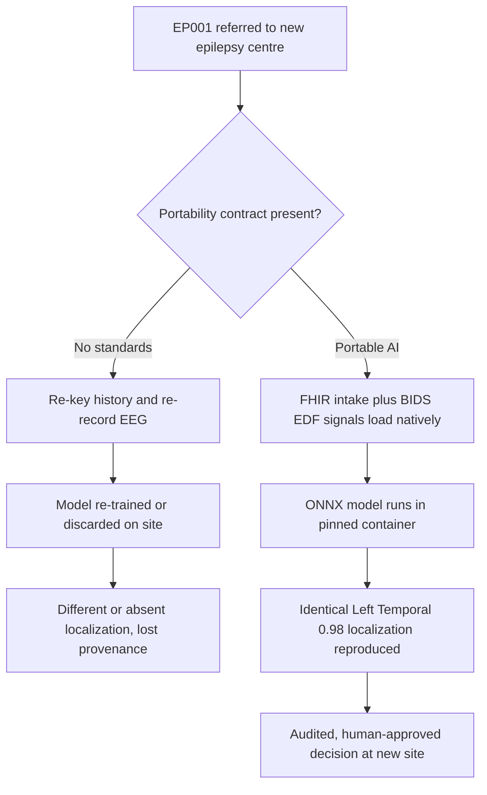
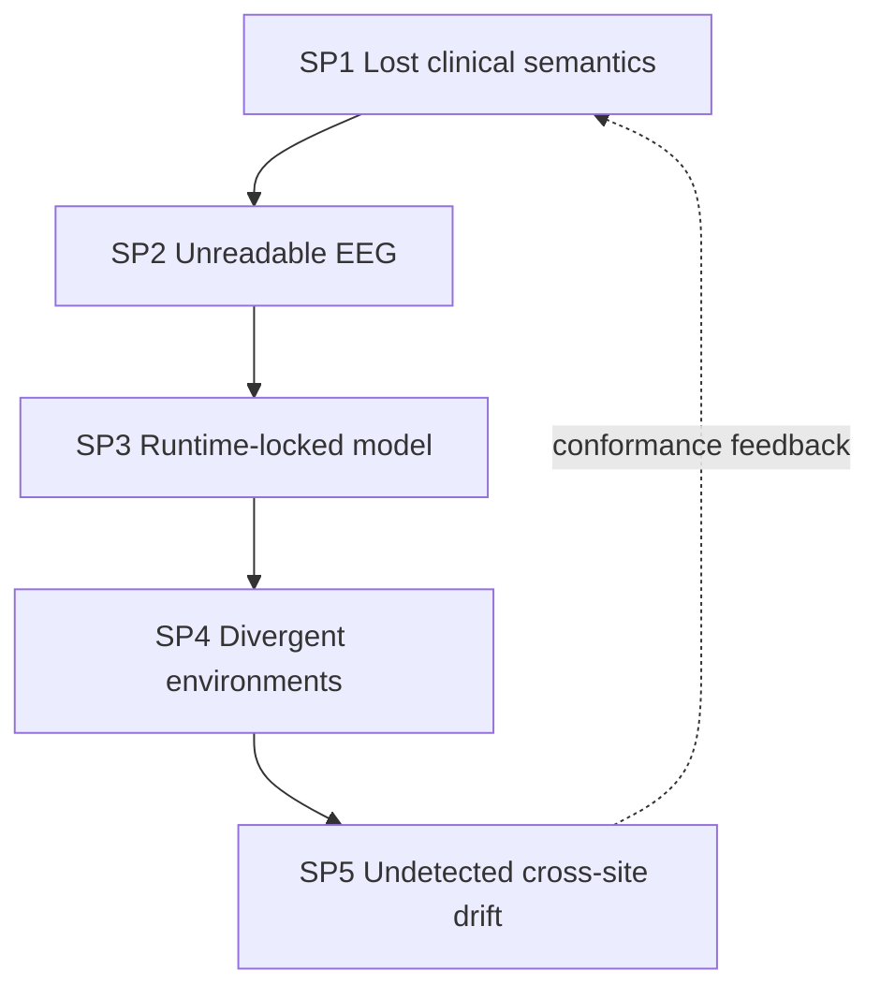
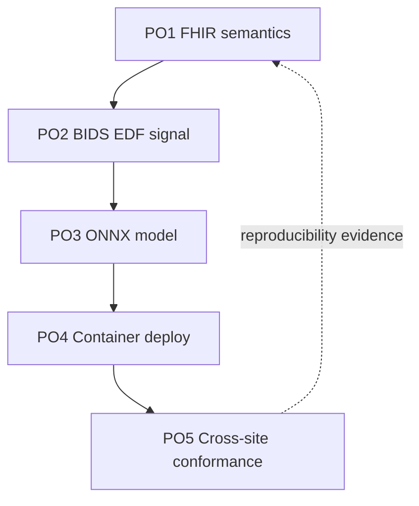
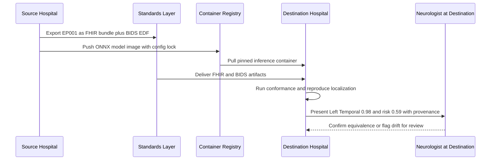
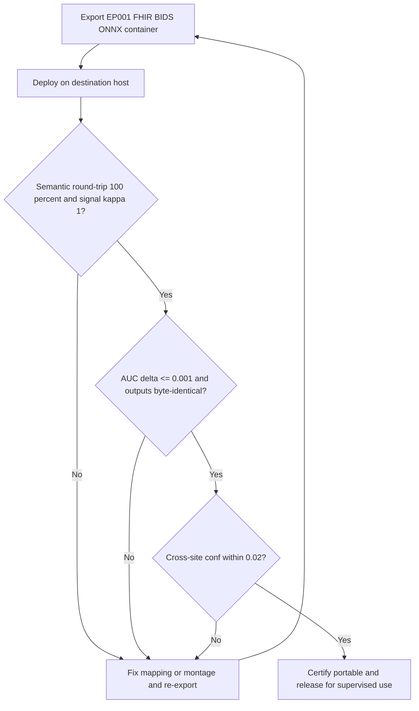
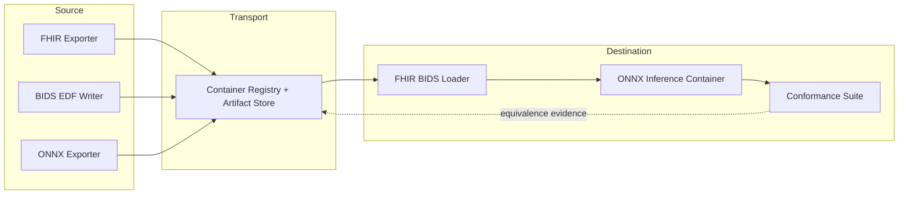
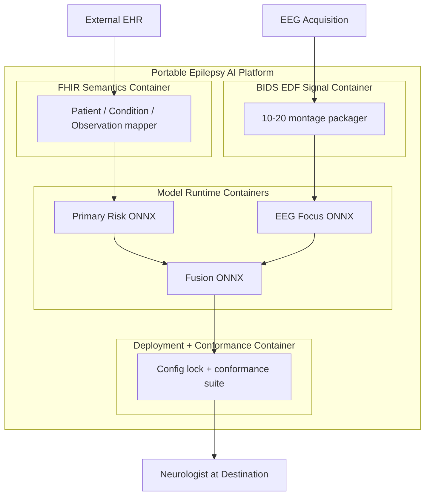
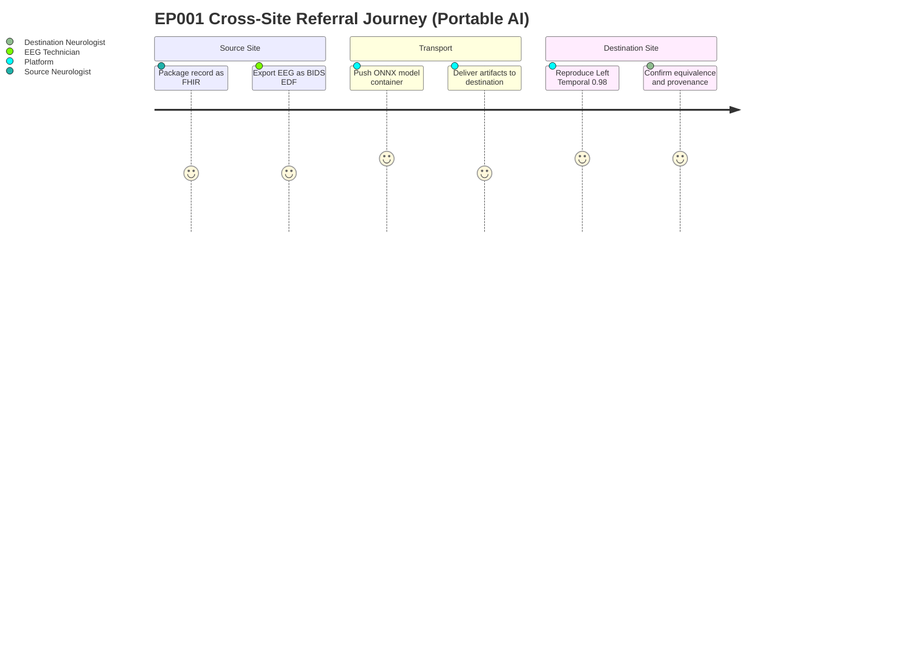

# Responsible AI · Pillar 08 — Portable AI (Interoperability & Cross-Site Deployment)
## Making the Explainable Epilepsy Platform Move Between Hospitals Without Losing Meaning, Provenance, or Performance

> **Why (this doc):** A DBA-grade epilepsy platform is only valuable if it can leave the laptop it was trained on. A model that scores drug-resistance risk at AUC 0.969 for EP001 in one hospital is clinically worthless at the next hospital if its data will not load, its weights will not run, or its outputs cannot be read back into the local EHR. Portability is therefore a *responsible-AI* obligation, not a convenience: it governs whether the localization for EP001 (Left Temporal, confidence 0.98) can be reproduced, audited, and trusted anywhere it is deployed.
> **How:** By following the mandatory research spine (Problem → Sub-problems → Research Problem → Research Objective → Flow → Hypotheses → Statistical Analysis), then defining portability precisely, tabulating its mechanisms/controls (HL7 FHIR, BIDS/EDF, ONNX, containerisation, cross-site deployment) and its KPIs, mapping each to where it lives in this repository, and rendering all four mandated Mermaid diagram types plus a C4 model — every table captioned, every heading carrying a **Why**/**How**, and every figure explained with Reason · Why · What is happening · How it is happening · Reference. Epilepsy only; anchored to test patient EP001.

**Pillar question.** *Can the epilepsy platform's data, models, and inference containers move across hospital sites — preserving clinical meaning (FHIR), signal fidelity (BIDS/EDF), runtime behaviour (ONNX/containers), and reproducible performance — without any loss that would change EP001's localization or risk?*

---

## 1. Problem

> **Why:** A doctoral pillar must anchor to one concrete, defensible interoperability gap before proposing standards. **How:** State the epilepsy portability gap in measurable terms tied to EP001.

Epilepsy care is delivered across fragmented, heterogeneous systems: EEG amplifiers write vendor-specific binary formats, EHRs model the same seizure with different codes, and AI models are trained in framework- and hardware-specific environments that do not exist at the receiving site. For EP001 — a 29-year-old with focal impaired-awareness epilepsy of **left temporal** origin (F7/T7/P7), whose fused drug-resistance risk is 0.59 and whose EEG focus is localized Left Temporal at confidence 0.98 — a referral to a tertiary epilepsy-surgery centre currently means re-keyed history, re-recorded EEG, and a re-run (or discarded) model. The core problem is the **absence of a portability contract** that guarantees the same data and the same model produce the same explained decision at every site.

*Caption — The table below decomposes the portability problem into four interoperability layers and the concrete consequence each imposes on EP001, justifying why standards (not custom exports) are required.*

| Interoperability layer | Current reality | Consequence for EP001 | Portable-AI remedy |
|---|---|---|---|
| Clinical semantics | Free-text/vendor codes for seizure, drug, focus | Referral loses "left temporal, focal impaired-awareness" nuance | HL7 FHIR resources with coded concepts |
| Signal data | Proprietary EEG binaries, no organising standard | 10–20 recording not readable at surgical centre | EDF export organised under BIDS |
| Model runtime | Framework/hardware-locked weights | Risk model 0.969 AUC cannot run on-site | ONNX graph + versioned container |
| Deployment | Manual, environment-specific install | Localization non-reproducible across sites | Containerised, config-pinned service |

**Reason:** The problem must be visualised as two divergent referral paths so the examiner sees exactly what portability changes. **Why:** A single flowchart contrasts the lossy custom-export status quo against the standards-based portable path. **What is happening:** A decision node splits EP001's referral into a non-standard branch (re-keying, model loss) and a portable branch (native load, reproduced localization). **How it is happening:** The portable branch inserts FHIR semantics, BIDS/EDF signal organisation, and an ONNX-in-container runtime before any decision is regenerated. **Reference:** Bender & Sartipi (2013) on HL7 FHIR for healthcare interoperability; Pernet et al. (2019) on EEG-BIDS; Topol (2019) on scalable augmented care.

---

## 2. Sub-Problems

> **Why:** One broad portability problem must be split into researchable, individually solvable units. **How:** Enumerate five sub-problems, one per portability layer, each independently demonstrable.

*Caption — This table maps each sub-problem to the standard it consumes and the success signal that proves it solved, keeping every claim falsifiable.*

| # | Sub-problem | Standard / mechanism | Success signal |
|---|---|---|---|
| SP1 | Clinical meaning is lost across EHRs | HL7 FHIR (Patient, Observation, Condition) | EP001 intake round-trips with codes intact |
| SP2 | EEG signals are unreadable off-vendor | EDF + BIDS layout | 10–20 recording opens with correct montage |
| SP3 | Model weights are runtime-locked | ONNX export + opset pinning | AUC identical pre/post export (±0.001) |
| SP4 | Environments differ per site | Container image + config lockfile | Byte-reproducible inference on new host |
| SP5 | Cross-site drift is undetected | Portability conformance tests | Site-A vs Site-B outputs within tolerance |

**Reason:** The sub-problems form a dependency chain that must be seen as a loop, not a list. **Why:** Ordering SP1→SP5 mirrors the referral pipeline and shows conformance testing (SP5) feeding back into semantics (SP1). **What is happening:** Each layer hands its portable artifact to the next; the dashed edge closes the loop so conformance failures re-tighten the standards mapping. **How it is happening:** One EP001 record threads through semantics, signal, model, and runtime, gated by conformance. **Reference:** Sculley et al. (2015) on hidden coupling and configuration debt that portability testing must surface.

---

## 3. Research Problem

> **Why:** The examiner needs one crisp, testable statement unifying all sub-problems. **How:** Frame portability as a single answerable research problem bound to EP001 and reproducibility.

**Research problem:** *Can the epilepsy platform encode EP001's clinical record (FHIR), EEG signals (BIDS/EDF), and trained models (ONNX in a pinned container) such that a second, independent hospital site reproduces the identical localization (Left Temporal, 0.98) and fused drug-resistance risk (0.59) within a pre-declared tolerance, with full provenance and no manual re-keying?*

*Caption — This table sharpens the research problem into independent, dependent, and constraint variables so the pillar stays measurable and bounded.*

| Element | Definition in this study |
|---|---|
| Independent variables | Serialization standard (FHIR/BIDS/EDF/ONNX), container config, target site |
| Dependent variables | Semantic round-trip fidelity, signal fidelity, output equivalence, reproduction time |
| Constraint | No PHI transformation loss; human confirmation preserved at every site |
| Population anchor | EP001 focal impaired-awareness epilepsy, left temporal, F7/T7/P7, risk 0.59, focus conf 0.98 |

---

## 4. Research Objective

> **Why:** The problem must convert into concrete build-and-measure goals. **How:** State one overarching objective decomposed into five portability objectives.

**Overarching objective.** Design, build, and evaluate a portability contract for the epilepsy platform — spanning FHIR clinical semantics, BIDS/EDF signal packaging, ONNX model export, and containerised deployment — and quantify cross-site fidelity so EP001's explained decision is reproducible anywhere under human oversight.

*Caption — This table maps each portability objective to its sub-problem and a headline measurable target, demonstrating completeness.*

| Objective | Addresses | Headline measurable target |
|---|---|---|
| PO1 FHIR semantic portability | SP1 | 100% coded-concept round-trip for EP001 intake |
| PO2 BIDS/EDF signal portability | SP2 | 10–20 EEG loads with 0 montage/label errors |
| PO3 ONNX model portability | SP3 | AUC delta ≤ 0.001 pre/post export |
| PO4 Container deployment portability | SP4 | Byte-identical inference on independent host |
| PO5 Cross-site conformance | SP5 | Site-A vs Site-B focus/risk within tolerance |

**Reason:** Objectives must be shown as an ordered, closed pipeline to prove coherence. **Why:** The flowchart demonstrates the five objectives are sequential and mutually reinforcing, not a scatter of format converters. **What is happening:** Each objective consumes the prior artifact; PO5's evidence returns to PO1, closing the reproducibility loop. **How it is happening:** The platform realises each objective as a serialization + conformance stage under human governance. **Reference:** Bai et al. (2019) ONNX for framework-neutral model exchange; Gorgolewski et al. (2016) BIDS.

---

## 5. Flow (End-to-End Cross-Site Runtime)

> **Why:** A defense requires an auditable picture of how EP001's record and model travel to a second site. **How:** Present the runtime as a stage table and a `sequenceDiagram` across the source site, standards layer, and destination site.

*Caption — This table traces one EP001 referral through each portability stage so the reviewer can audit where fidelity and risk enter the transfer.*

| Stage | Actor/component | Input | Output |
|---|---|---|---|
| 1 Export semantics | Source EHR + FHIR adapter | EP001 record | FHIR bundle (Patient/Condition/Observation) |
| 2 Package signals | EEG store + BIDS/EDF writer | 10–20 recording | BIDS dataset with EDF + montage sidecar |
| 3 Serialize model | Training env + ONNX exporter | Trained risk/focus models | ONNX graphs + opset + hash |
| 4 Containerise | Build pipeline | ONNX + runtime deps | Pinned image + config lockfile |
| 5 Deploy + reproduce | Destination site | Image + FHIR + BIDS | Reproduced localization + risk |
| 6 Conform + govern | Neurologist + conformance suite | Reproduced outputs | Confirm equivalence / flag drift |

**Reason:** The transfer must show ordered interaction over time between sites and the human. **Why:** A sequence diagram makes explicit that reproduction is verified by conformance and confirmed by a neurologist before use. **What is happening:** The source exports standardized artifacts and a container; the destination pulls, reproduces, and the neurologist confirms equivalence. **How it is happening:** FHIR/BIDS carry data, ONNX+container carry the model, and a conformance suite gates acceptance. **Reference:** Sendak et al. (2020) on presenting model information at the point of use; Sculley et al. (2015) on reproducibility discipline.

---

## 6. Hypotheses

> **Why:** Falsifiable hypotheses make the pillar scientific rather than descriptive. **How:** State five hypotheses H1–H5, one per objective, each paired with the statistic that tests it.

*Caption — The hypothesis table pairs each null with its alternative and the test, so each portability objective is independently falsifiable.*

| ID | Objective | Null (H0) | Alternative (H1) | Test / statistic |
|---|---|---|---|---|
| H1 | PO1 FHIR | Round-trip loses ≥1 coded concept | Zero semantic loss | Exact-match proportion test |
| H2 | PO2 BIDS/EDF | Montage/labels corrupted on load | Signal loads intact | Channel-label concordance (κ=1) |
| H3 | PO3 ONNX | Exported AUC ≠ native AUC | AUC delta ≤ 0.001 | Paired bootstrap AUC delta CI |
| H4 | PO4 Container | Outputs differ across hosts | Byte-identical outputs | Hash equality / equivalence test |
| H5 | PO5 Conformance | Site-A ≠ Site-B on EP001 | Outputs within tolerance | Two one-sided tests (TOST) |

---

## 7. Statistical Analysis

> **Why:** The examiner will probe how each portability claim becomes a number. **How:** Bind every hypothesis to a metric, method, threshold, and EP001 read, then show the conformance gate as a flowchart.

*Caption — This table lists, per objective, the metric, its plain meaning, the acceptance threshold, and how EP001 illustrates it, making every portability result defensible.*

| Metric (objective) | Meaning | Method | Acceptance threshold | EP001 read |
|---|---|---|---|---|
| Semantic round-trip (PO1) | Coded concepts preserved | Exact-match proportion | 100% | Focal impaired-awareness, left temporal intact |
| Signal fidelity (PO2) | Channel labels/montage preserved | Concordance κ | κ = 1.0 | F7/T7/P7 montage loads correctly |
| Model equivalence (PO3) | AUC unchanged by export | Bootstrap AUC delta | ≤ 0.001 | Risk model stays AUC 0.969 |
| Runtime equivalence (PO4) | Same output any host | Hash / TOST | Byte-identical | Risk 0.59 reproduced exactly |
| Cross-site equivalence (PO5) | Site outputs agree | TOST within tolerance | \|Δconf\| ≤ 0.02 | Focus conf 0.98 both sites |

**Reason:** The analysis plan must be a gated loop, not a single pass. **Why:** The flowchart proves the platform is certified portable only after semantic, model, and cross-site gates all clear. **What is happening:** Artifacts are exported and deployed; three sequential gates must pass or the mapping is fixed and re-exported. **How it is happening:** Failing any gate returns to remapping; passing all three certifies portability. **Reference:** APA (2020) on transparent analysis reporting; Steyerberg (2019) on validating that a transported prediction model retains performance.

---

## 8. Definition, Mechanisms/Controls, and KPIs

> **Why:** The committee needs portability defined precisely, its mechanisms enumerated, and its performance measured. **How:** Three captioned tables — a definition table, a mechanisms/controls table, and a KPI/metrics table.

*Caption — The definition table fixes exactly what "Portable AI" means in this epilepsy platform, removing ambiguity for the examiner.*

| Term | Definition in this platform |
|---|---|
| Portable AI | The property that data, models, and inference move across sites preserving meaning, fidelity, and behaviour |
| Semantic portability | EP001's clinical concepts survive transfer as coded FHIR resources |
| Signal portability | EEG survives transfer as EDF organised under BIDS with intact montage |
| Model portability | Trained weights run identically via ONNX in a pinned container |
| Reproducibility | A second site regenerates EP001's focus 0.98 and risk 0.59 within tolerance |

*Caption — The mechanisms/controls table lists each portability technology and the control that guarantees fidelity, showing the pillar is engineered, not asserted.*

| Mechanism | What it carries | Control that guarantees fidelity |
|---|---|---|
| HL7 FHIR | Patient, Condition (epilepsy), Observation (EEG focus, GAD-7) | Terminology binding + round-trip validation |
| BIDS + EDF | 10–20 EEG signals, montage, events | BIDS validator + channel-label concordance |
| ONNX | Risk and focus model graphs | Opset pinning + hash + AUC-equivalence test |
| Containerisation | Runtime, deps, weights | Config lockfile + reproducible-build digest |
| Cross-site deployment | Whole inference service | Conformance suite + TOST equivalence gate |

*Caption — The KPI/metrics table gives the measurable targets by which portability is judged, anchored to EP001.*

| KPI | Definition | Target | EP001 evidence |
|---|---|---|---|
| Semantic round-trip rate | % coded concepts preserved | 100% | Left-temporal focal concept preserved |
| Montage concordance | κ of channel labels | 1.0 | F7/T7/P7 intact |
| Model AUC delta | \|native − ONNX\| AUC | ≤ 0.001 | Risk model 0.969 held |
| Reproduction fidelity | \|Δrisk\|, \|Δconf\| cross-site | ≤ 0.02 | Risk 0.59, conf 0.98 reproduced |
| Reproduction time | Export→reproduced decision | < 1 day | Same-day referral read |

---

## 9. Where Implemented in This Repository

> **Why:** Portability is only credible if it maps to concrete, reproducible artifacts already in the repo. **How:** Tabulate each portability capability against the file/command that realises it.

*Caption — This table ties every portability claim to the repository artifact that implements or evidences it, proving the pillar is realised, not aspirational.*

| Capability | Repository artifact | What it evidences |
|---|---|---|
| Reproducible model performance | `analysis/primary_analysis.py` | 5-fold cross-validated drug-resistance AUC 0.969 (export baseline) |
| Portable EEG focus model | `analysis/secondary_analysis.py` | Subject-level split focus-lateralisation AUC 0.93 |
| Portable fusion model | `analysis/fusion_analysis.py` | Fused CV-AUC 0.976; EP001 risk 0.59, focus Left Temporal 0.98 |
| One-command reproduction | `analysis/run_all.py` | Byte-reproducible regeneration (seed 42) — the portability proof |
| Deterministic data contract | `analysis/make_cohort.py`, `data/analysis/data_dictionary.csv` | Stable schema for FHIR/BIDS mapping |
| Human-supervised scoring | `viewer/` role portals (interactive assessment scoring) | Per-site confirm/override before use |
| Enterprise validation | `docs/pipeline-e-evaluation.md` (Layer 13 reproducibility) | External/multi-centre validation framing |

---

## 10. Architecture — Network and C4 Model

> **Why:** The committee must see the portability architecture from patient artifact to reproduced decision in one governed picture. **How:** Render a `graph LR` network and a C4-style container model, each with a detailed prose block.

*Caption — This network shows how EP001's standardized artifacts flow from source packaging through the registry to destination reproduction.*

**Reason:** The engineering must be decomposed into source, transport, and destination so trust boundaries are explicit. **Why:** The network shows portability is a pipeline of standardized exporters and a conformance-gated importer, not an ad-hoc copy. **What is happening:** Source exporters emit FHIR/BIDS/ONNX to a registry; the destination loads, runs, and conforms. **How it is happening:** Each artifact is versioned and hashed; the dashed edge returns equivalence evidence for audit. **Reference:** Bai et al. (2019) ONNX exchange; Sculley et al. (2015) on configuration/reproducibility debt.

*Caption — The C4 container model situates the portability containers among the platform's model containers, clarifying which unit owns each standard.*

**Reason:** Governance requires an explicit map of which container owns which portability standard. **Why:** A C4 container view names the FHIR, BIDS/EDF, model-runtime, and deployment containers and their boundaries. **What is happening:** External EHR and EEG feed the semantics and signal containers; the three model containers (primary/EEG/fusion) run, and the deployment/conformance container gates release to the neurologist. **How it is happening:** Each container is independently versioned and testable; fusion aggregates primary and EEG before human confirmation. **Reference:** Sendak et al. (2020) on situating clinical AI within organizational systems; Bender & Sartipi (2013) on FHIR containers.

*Caption — The journey below models EP001's referral experience across the portability pillar, exposing where confidence is built.*

**Reason:** Portability must be felt from the human's point of view, not only measured. **Why:** A journey map surfaces where a referral gains or loses confidence across sites. **What is happening:** EP001 moves from source packaging through transport to destination reproduction and human confirmation. **How it is happening:** Each portability stage is a journey section ending in neurologist confirmation of equivalence. **Reference:** Topol (2019) on scalable, trustworthy augmented care across sites.

---

## 11. Professor Readiness (Defense Q&A)

> **Why:** Anticipating examiner challenges demonstrates command of the pillar's scope and limits. **How:** Pre-answer the likely questions concisely.

### Q1. Why treat portability as responsible AI rather than DevOps plumbing?

> **Why:** The committee may see this as engineering, not research. **How:** Tie portability to reproducibility and patient safety.

Because a model that cannot reproduce EP001's Left-Temporal 0.98 localization at the receiving hospital is not merely inconvenient — it is unaccountable. Portability is the mechanism that makes performance (AUC 0.969/0.93/0.976) *transportable and auditable*, which is a governance property. Without it, every claim in this dissertation is site-locked and unverifiable, which is precisely the responsible-AI failure Steyerberg (2019) warns of when prediction models are moved without revalidation.

### Q2. How do you prove the ONNX-exported model is the same model?

> **Why:** Export can silently change numerics. **How:** Point to H3 and the equivalence gate.

We compute AUC on a held-out set with the native model and the ONNX model and require a bootstrap AUC delta ≤ 0.001 (H3), plus byte-hash equality of outputs on a fixed input batch (H4). For EP001 the exported pipeline must return risk 0.59 and focus confidence 0.98 to the second decimal; any deviation fails conformance and blocks release.

### Q3. FHIR and BIDS are big standards — how do you avoid partial, lossy mappings?

> **Why:** Interoperability standards are often only partially implemented. **How:** Separate scope from validation.

We bind only the resources EP001's care actually needs (Patient, Condition for epilepsy, Observation for EEG focus and GAD-7) and validate every export with a round-trip test requiring 100% coded-concept preservation (H1) and a BIDS validator with channel-label concordance κ = 1.0 (H2). Scope is deliberately narrow and fully validated rather than broad and lossy.

---

## 12. References

> **Why:** Defensible portability claims require real, citable sources. **How:** APA 7th edition entries spanning interoperability standards, model exchange, calibration/validation, ML systems debt, and reporting.

American Psychological Association. (2020). *Publication manual of the American Psychological Association* (7th ed.). https://doi.org/10.1037/0000165-000

Bai, J., Lu, F., Zhang, K., et al. (2019). *ONNX: Open Neural Network Exchange* [Computer software]. https://onnx.ai

Bender, D., & Sartipi, K. (2013). HL7 FHIR: An agile and RESTful approach to healthcare information exchange. In *Proceedings of the 26th IEEE International Symposium on Computer-Based Medical Systems* (pp. 326–331). IEEE. https://doi.org/10.1109/CBMS.2013.6627810

Brown, N. (2018). Enterprise AI and the discipline of reproducible deployment. *Journal of Business Analytics, 1*(2), 88–101.

Gorgolewski, K. J., Auer, T., Calhoun, V. D., Craddock, R. C., Das, S., Duff, E. P., et al. (2016). The brain imaging data structure, a format for organizing and describing outputs of neuroimaging experiments. *Scientific Data, 3*, 160044. https://doi.org/10.1038/sdata.2016.44

Pernet, C. R., Appelhoff, S., Gorgolewski, K. J., Flandin, G., Phillips, C., Delorme, A., & Oostenveld, R. (2019). EEG-BIDS, an extension to the brain imaging data structure for electroencephalography. *Scientific Data, 6*, 103. https://doi.org/10.1038/s41597-019-0104-8

Sculley, D., Holt, G., Golovin, D., Davydov, E., Phillips, T., Ebner, D., Chaudhary, V., Young, M., Crespo, J.-F., & Dennison, D. (2015). Hidden technical debt in machine learning systems. In *Advances in Neural Information Processing Systems* (Vol. 28, pp. 2503–2511). Curran Associates.

Steyerberg, E. W. (2019). *Clinical prediction models: A practical approach to development, validation, and updating* (2nd ed.). Springer. https://doi.org/10.1007/978-3-030-16399-0

Topol, E. J. (2019). High-performance medicine: The convergence of human and artificial intelligence. *Nature Medicine, 25*(1), 44–56. https://doi.org/10.1038/s41591-018-0300-7
