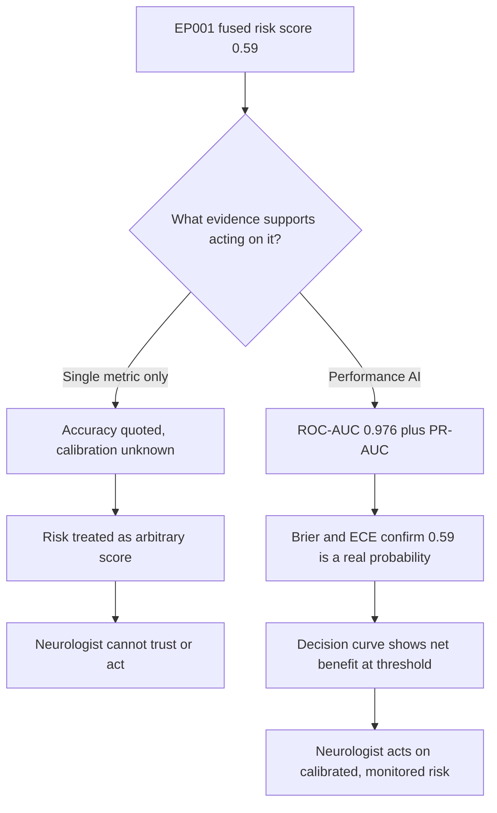
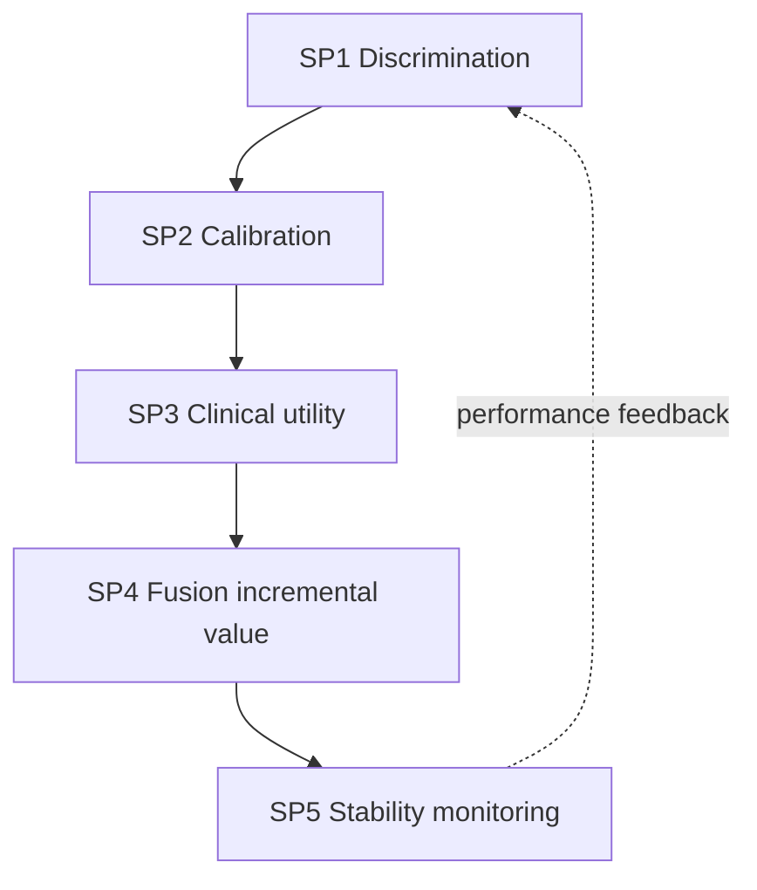
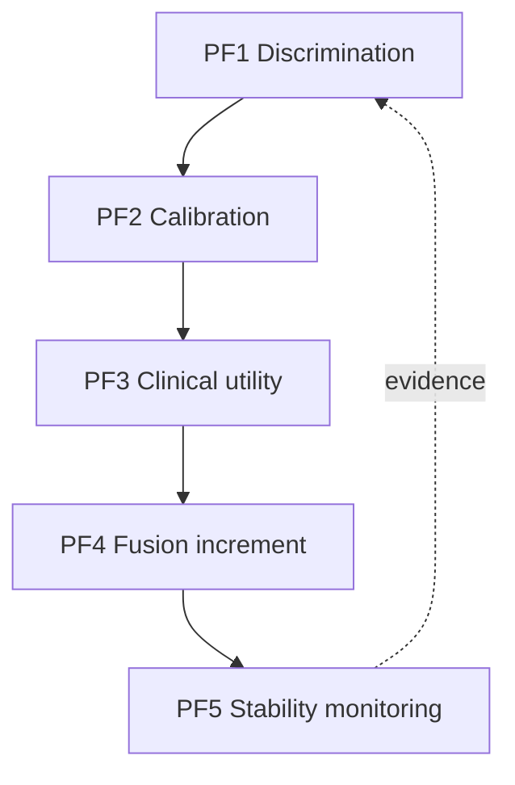
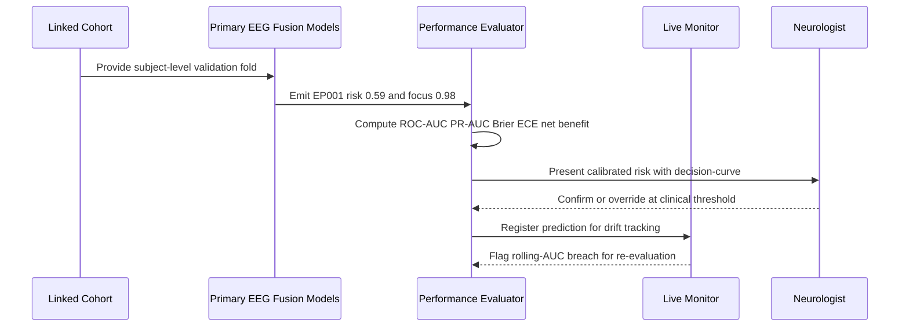
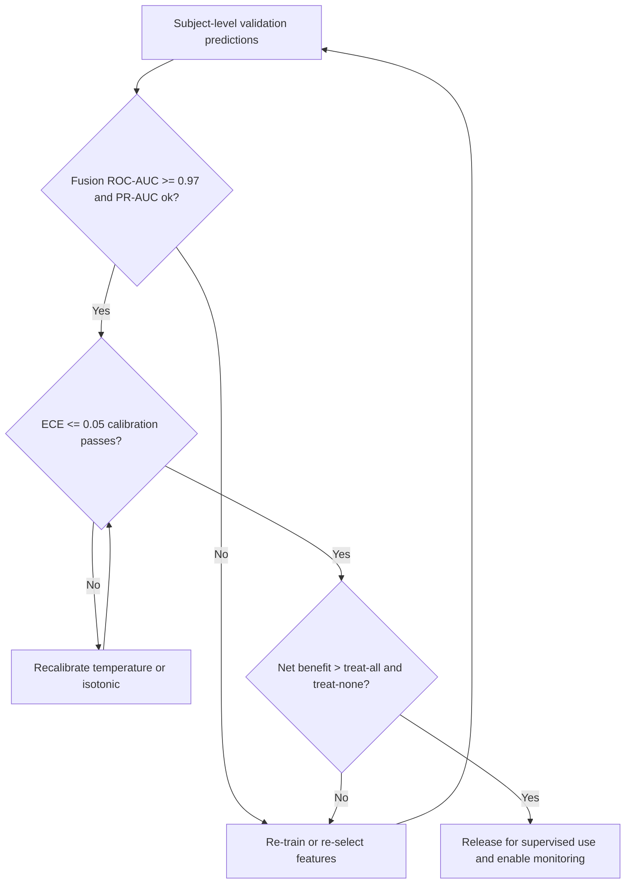
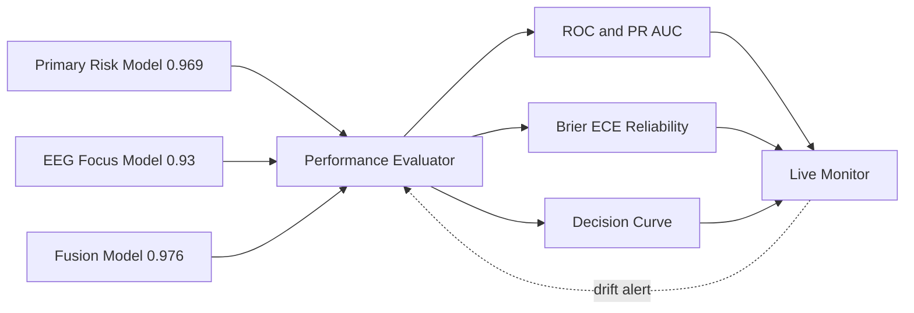
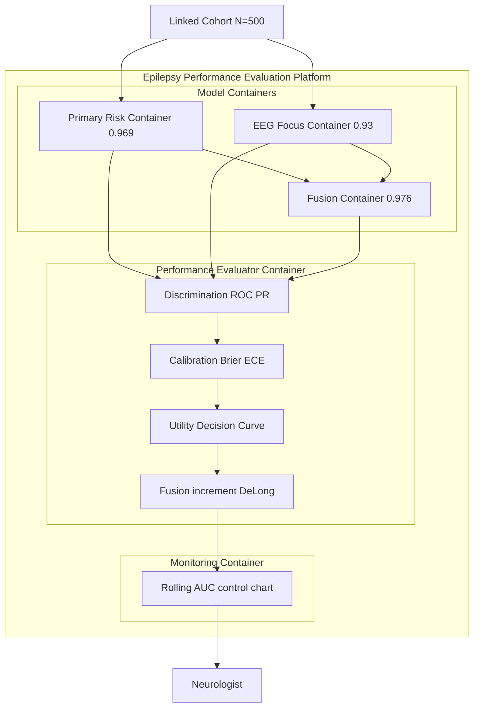
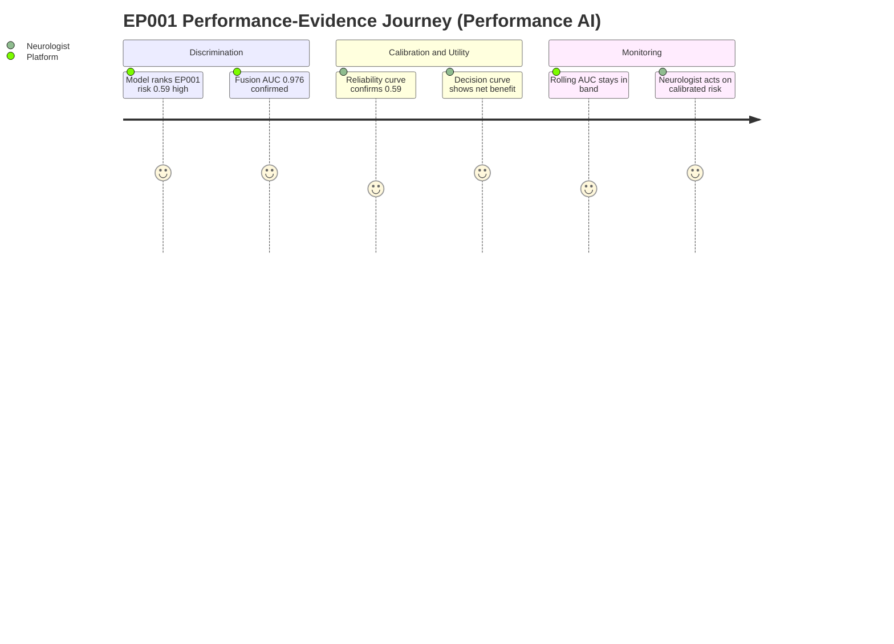

# Responsible AI · Pillar 09 — Performance AI (Discrimination, Calibration & Clinical Utility)
## Proving the Explainable Epilepsy Platform Is Not Just Accurate but Calibrated, Useful, and Continuously Monitored

> **Why (this doc):** A DBA committee will not accept "the model is accurate" as evidence. It will ask which metric, on which split, against which baseline, and whether the reported confidence for EP001 (focus Left Temporal, 0.98) can be trusted as a probability. Performance AI is the responsible-AI pillar that turns the platform's committed results — primary drug-resistance **AUC 0.969**, EEG focus-lateralisation **AUC 0.93**, and multimodal fusion **AUC 0.976** — into a defensible, monitored performance contract rather than a single headline number.
> **How:** By following the mandatory research spine (Problem → Sub-problems → Research Problem → Research Objective → Flow → Hypotheses → Statistical Analysis), then defining performance precisely, tabulating its mechanisms/controls and its real KPIs, mapping each to where it lives in this repository, and rendering all four mandated Mermaid diagram types plus a C4 model — every table captioned, every heading carrying **Why**/**How**, every figure explained with Reason · Why · What is happening · How it is happening · Reference. Epilepsy only; anchored to EP001.

**Pillar question.** *Do the epilepsy models discriminate (ROC-AUC, PR-AUC), stay calibrated (Brier, ECE), and deliver net clinical benefit (decision-curve) — with the fused model (AUC 0.976) provably better than the primary (0.969) and EEG-only (0.93) models — and does performance stay stable under monitoring for a patient like EP001?*

---

## 1. Problem

> **Why:** A doctoral pillar must anchor to one concrete, defensible performance gap before proposing metrics. **How:** State the epilepsy performance-evidence gap in measurable terms tied to EP001.

Most epilepsy-AI work reports a single discrimination number (often accuracy) on a random split and stops. That is insufficient and can be unsafe: a drug-resistance model can achieve high AUC yet be badly miscalibrated, so EP001's fused risk of 0.59 is treated as if it were an arbitrary score rather than a 59% probability; or it can be well-calibrated yet offer no *net benefit* over simply treating everyone. For EP001 — focal impaired-awareness epilepsy, left temporal (F7/T7/P7), ~5 seizures/month despite 88% adherence — the neurologist needs discrimination **and** calibration **and** decision-analytic utility, all monitored over time. The core problem is the **absence of a multi-axis, monitored performance contract** where accuracy alone stands in for evidence.

*Caption — The table below decomposes the performance problem into four evidence axes and the concrete consequence each imposes on EP001, justifying why a single metric is insufficient.*

| Performance axis | Current reality (single-metric AI) | Consequence for EP001 | Performance-AI remedy |
|---|---|---|---|
| Discrimination | One accuracy figure on a random split | Rank-ordering of risk unproven | ROC-AUC + PR-AUC on subject-level split |
| Calibration | Ignored | Risk 0.59 not a trustworthy probability | Brier score + reliability curve + ECE |
| Clinical utility | Ignored | Unknown if model beats treat-all/none | Decision-curve (net benefit) |
| Stability | Assumed constant | Silent decay after deployment | Live performance monitoring |

**Reason:** The problem must contrast single-metric AI against a multi-axis contract so the examiner sees what performance evidence really requires. **Why:** A flowchart shows accuracy alone dead-ends at distrust while the full stack reaches actionable, calibrated risk. **What is happening:** A decision node splits EP001's risk into an unsupported branch and an evidenced branch (discrimination + calibration + utility). **How it is happening:** The performance branch adds PR-AUC, Brier/ECE, and decision-curve analysis before the neurologist acts. **Reference:** Steyerberg (2019) on discrimination-plus-calibration; Vickers & Elkin (2006) on decision-curve net benefit.

---

## 2. Sub-Problems

> **Why:** One broad performance problem must be split into researchable units. **How:** Enumerate five sub-problems, one per evidence axis plus comparison, each demonstrable from the committed run.

*Caption — This table maps each sub-problem to its metric family and the committed success signal, keeping every claim falsifiable.*

| # | Sub-problem | Metric family | Success signal (committed run) |
|---|---|---|---|
| SP1 | Discrimination unproven | ROC-AUC, PR-AUC | Primary AUC 0.969; EEG 0.93; fusion 0.976 |
| SP2 | Calibration unknown | Brier, ECE, reliability curve | EP001 risk 0.59 within calibration band (planned) |
| SP3 | Clinical utility unknown | Decision-curve net benefit | Net benefit > treat-all/none (planned) |
| SP4 | Fusion value unproven | Incremental AUC (DeLong) | Fusion 0.976 > primary 0.969, EEG 0.93 |
| SP5 | Stability undetected | Live monitoring, drift | Rolling AUC within control limits |

**Reason:** The sub-problems form a dependency chain seen as a loop, not a list. **Why:** Ordering SP1→SP5 mirrors how evidence accumulates and shows monitoring (SP5) feeding back into discrimination (SP1). **What is happening:** Each axis hands its evidence to the next; the dashed edge closes the loop so drift triggers re-evaluation. **How it is happening:** One EP001 prediction is judged on all five axes under monitoring. **Reference:** Sculley et al. (2015) on monitoring as a first-class requirement in ML systems.

---

## 3. Research Problem

> **Why:** The examiner needs one crisp, testable statement unifying the axes. **How:** Frame performance as a single answerable research problem bound to EP001 and the committed AUCs.

**Research problem:** *Do the epilepsy platform's models — primary clinical (drug-resistance AUC 0.969), EEG focus-lateralisation (AUC 0.93), and multimodal fusion (AUC 0.976) — discriminate above baseline, remain calibrated so EP001's fused risk of 0.59 and focus confidence of 0.98 are trustworthy probabilities, provide positive net clinical benefit at clinically relevant thresholds, and hold performance stable under continuous monitoring?*

*Caption — This table sharpens the research problem into independent, dependent, and constraint variables so the pillar stays measurable and bounded.*

| Element | Definition in this study |
|---|---|
| Independent variables | Model (primary/EEG/fusion), evaluation split, decision threshold |
| Dependent variables | ROC-AUC, PR-AUC, Brier/ECE, net benefit, rolling AUC |
| Constraint | Subject-level split (no leakage); human confirmation preserved |
| Population anchor | EP001 fused risk 0.59, focus Left Temporal conf 0.98, left temporal F7/T7/P7 |

---

## 4. Research Objective

> **Why:** The problem must convert into build-and-measure goals. **How:** State one overarching objective decomposed into five performance objectives.

**Overarching objective.** Design, run, and monitor a multi-axis performance evaluation for the epilepsy platform — discrimination, calibration, clinical utility, fusion increment, and stability — and quantify each on the committed cohort so EP001's decision rests on evidence, not a single number, under human oversight.

*Caption — This table maps each performance objective to its sub-problem and a headline measurable target using the real committed results.*

| Objective | Addresses | Headline measurable target |
|---|---|---|
| PF1 Discrimination | SP1 | Fusion ROC-AUC ≥ 0.97 (committed 0.976); PR-AUC reported |
| PF2 Calibration | SP2 | ECE ≤ 0.05; Brier improved vs baseline |
| PF3 Clinical utility | SP3 | Positive net benefit over treat-all/none across threshold range |
| PF4 Fusion increment | SP4 | Fusion > primary (0.969) and EEG (0.93), DeLong p < 0.05 |
| PF5 Stability | SP5 | Rolling AUC within ±0.03 control band |

**Reason:** Objectives must be an ordered, closed pipeline to prove coherence. **Why:** The flowchart shows the five performance objectives are sequential and reinforcing, not a metric dump. **What is happening:** Each objective consumes the prior evidence; PF5's evidence returns to PF1, closing the loop. **How it is happening:** The platform realises each objective as a measured stage under human governance. **Reference:** Steyerberg (2019); Vickers & Elkin (2006).

---

## 5. Flow (End-to-End Performance Runtime)

> **Why:** A defense requires an auditable picture of how a prediction becomes multi-axis evidence for EP001. **How:** Present the runtime as a stage table and a `sequenceDiagram` across data, models, evaluator, and neurologist.

*Caption — This table traces one EP001 prediction through each performance stage so the reviewer can audit where evidence enters the decision.*

| Stage | Actor/component | Input | Output |
|---|---|---|---|
| 1 Split | Cohort builder | N=500 linked cohort | Subject-level train/validation folds |
| 2 Score | Primary + EEG + fusion models | Features | Risk/focus probabilities |
| 3 Discriminate | Evaluator | Probabilities + labels | ROC-AUC 0.976, PR-AUC |
| 4 Calibrate | Evaluator | Probabilities + labels | Brier, reliability curve, ECE |
| 5 Utility | Evaluator | Probabilities + threshold | Decision-curve net benefit |
| 6 Monitor + govern | Monitor + neurologist | Live predictions | Rolling AUC; confirm/override |

**Reason:** The runtime must show ordered interaction over time between models, evaluator, and human. **Why:** A sequence diagram makes explicit that no risk reaches the neurologist without discrimination, calibration, and utility attached. **What is happening:** The cohort feeds models; the evaluator computes all axes; the neurologist decides; the monitor tracks drift. **How it is happening:** Each metric is computed on a subject-level fold and logged for monitoring. **Reference:** Sendak et al. (2020) on presenting model information; Sculley et al. (2015) on monitoring.

---

## 6. Hypotheses

> **Why:** Falsifiable hypotheses make the pillar scientific. **How:** State five hypotheses H1–H5, one per objective, each paired with its statistic.

*Caption — The hypothesis table pairs each null with its alternative and the test, so each performance objective is independently falsifiable.*

| ID | Objective | Null (H0) | Alternative (H1) | Test / statistic |
|---|---|---|---|---|
| H1 | PF1 Discrimination | Fusion AUC = 0.5 (chance) | Fusion AUC ≥ 0.97 | DeLong AUC vs chance + bootstrap CI |
| H2 | PF2 Calibration | Predicted ≠ observed frequencies | Calibrated (ECE ≤ 0.05) | Hosmer–Lemeshow / ECE |
| H3 | PF3 Utility | Net benefit ≤ treat-all/none | Net benefit greater | Decision-curve analysis |
| H4 | PF4 Fusion increment | Fusion AUC = primary AUC | Fusion > primary and EEG | DeLong paired AUC test |
| H5 | PF5 Stability | Rolling AUC drifts out of band | Rolling AUC stable | SPC control chart / CUSUM |

---

## 7. Statistical Analysis

> **Why:** The examiner will probe how each performance claim becomes a number. **How:** Bind every hypothesis to a metric, method, threshold, and EP001 read, then show the performance gate as a flowchart.

*Caption — This table lists, per objective, the metric, its plain meaning, the acceptance threshold, and how EP001 illustrates it, using the real committed results.*

| Metric (objective) | Meaning | Method | Acceptance threshold | EP001 read |
|---|---|---|---|---|
| ROC-AUC (PF1) | Rank-orders risk | DeLong + bootstrap CI | Fusion ≥ 0.97 | Fusion 0.976; risk 0.59 well-ranked |
| PR-AUC (PF1) | Precision under imbalance | Average precision | > prevalence baseline | Risk precision reported for EP001 class |
| Brier / ECE (PF2) | Probability accuracy | Reliability curve | ECE ≤ 0.05 | Risk 0.59 within calibration band |
| Net benefit (PF3) | Utility vs default strategies | Decision-curve analysis | > treat-all/none | Benefit at neurologist's threshold |
| Incremental AUC (PF4) | Value added by fusion | DeLong paired | p < 0.05 | 0.976 vs 0.969/0.93 |
| Rolling AUC (PF5) | Live stability | Control chart | within ±0.03 | EP001 cohort tracked in band |

**Reason:** The analysis plan must be a gated loop, not a single pass. **Why:** The flowchart proves the model is released only after discrimination, calibration, and utility gates all clear. **What is happening:** Predictions pass three sequential gates; calibration failure routes to recalibration, discrimination/utility failure routes to re-training. **How it is happening:** Passing all three enables supervised deployment plus live monitoring. **Reference:** APA (2020) on transparent reporting; Steyerberg (2019); Vickers & Elkin (2006).

---

## 8. Definition, Mechanisms/Controls, and KPIs

> **Why:** The committee needs performance defined, its mechanisms enumerated, and its KPIs stated with real numbers. **How:** Three captioned tables — definition, mechanisms/controls, and KPI/metrics.

*Caption — The definition table fixes exactly what "Performance AI" means here, removing ambiguity between accuracy and evidence.*

| Term | Definition in this platform |
|---|---|
| Performance AI | Multi-axis, monitored evidence that models discriminate, calibrate, and add clinical utility |
| Discrimination | Ability to rank higher-risk EP001-like patients above lower-risk (ROC/PR-AUC) |
| Calibration | Agreement of predicted probability (0.59) with observed frequency (Brier/ECE) |
| Clinical utility | Net benefit of acting on the score vs treat-all/treat-none (decision-curve) |
| Monitoring | Continuous tracking of rolling performance for drift |

*Caption — The mechanisms/controls table lists each performance method and the control that keeps it honest, showing the pillar is engineered.*

| Mechanism | What it measures | Control that keeps it honest |
|---|---|---|
| ROC-AUC / PR-AUC | Discrimination | Subject-level split (no leakage) + bootstrap CI |
| Reliability curve / ECE / Brier | Calibration | Held-out validation; temperature/isotonic recalibration |
| Decision-curve analysis | Clinical utility | Pre-declared threshold range; treat-all/none references |
| DeLong test | Fusion increment | Paired on identical validation set |
| SPC / CUSUM control chart | Stability | Pre-registered control limits + drift alerts |

*Caption — The KPI/metrics table gives the measurable performance targets, using the REAL committed results and the planned calibration/utility metrics, anchored to EP001.*

| KPI | Definition | Target / committed value | EP001 evidence |
|---|---|---|---|
| Primary drug-resistance AUC | Clinical model discrimination | **0.969 (committed)** | Baseline the fusion must beat |
| EEG focus-lateralisation AUC | EEG model discrimination | **0.93 (committed)** | Left vs Right focus rank |
| Fusion AUC | Multimodal discrimination | **0.976 (committed)** | EP001 risk 0.59 well-ranked |
| ECE (calibration) | Predicted vs observed gap | ≤ 0.05 (planned) | Risk 0.59 in calibration band |
| Brier score | Mean squared prob. error | Lower vs baseline (planned) | Tracks EP001 probability quality |
| Net benefit (decision-curve) | Utility over defaults | > treat-all/none (planned) | Benefit at clinical threshold |
| Focus confidence | Localization certainty | Calibrated | **0.98 Left Temporal (committed)** |

---

## 9. Where Implemented in This Repository

> **Why:** Performance is only credible if it maps to concrete, reproducible artifacts. **How:** Tabulate each performance capability against the file/command that realises it.

*Caption — This table ties every performance claim to the repository artifact that computes or evidences it, proving the pillar is realised, not aspirational.*

| Capability | Repository artifact | What it evidences |
|---|---|---|
| Primary discrimination | `analysis/primary_analysis.py` (stage 11 baseline model) | 5-fold cross-validated drug-resistance **AUC 0.969** |
| EEG discrimination | `analysis/secondary_analysis.py` (focus-localization) | Subject-level split focus-lateralisation **AUC 0.93** |
| Fusion increment | `analysis/fusion_analysis.py` (incremental-value) | Primary-only vs EEG-only vs fused CV-AUC **0.976** |
| EP001 decision card | `analysis/fusion_analysis.py` (EP001 end-to-end) | Fused risk **0.59**, focus **Left Temporal 0.98** |
| One-command reproduction | `analysis/run_all.py` | Byte-reproducible metrics (seed 42) |
| Data-quality gate | `analysis/primary_analysis.py` (validate) | Quality score **0.998** precondition |
| Human-supervised scoring | `viewer/` role portals (interactive assessment scoring) | Neurologist confirm/override on scores |
| Calibration/utility + monitoring framing | `docs/pipeline-e-evaluation.md` (Layer 2 AI, Layer 11 statistical) | ROC-AUC/PR-AUC/calibration + DeLong/bootstrap planned |

---

## 10. Architecture — Network and C4 Model

> **Why:** The committee must see the performance architecture from prediction to monitored evidence in one governed picture. **How:** Render a `graph LR` network and a C4-style container model, each with a prose block.

*Caption — This network shows how the three models feed a shared performance evaluator whose evidence feeds the monitor and the neurologist.*

**Reason:** The engineering must be decomposed so each performance axis is explicit. **Why:** The network shows the three models converge on one evaluator that emits discrimination, calibration, and utility, all watched by the monitor. **What is happening:** Primary, EEG, and fusion models feed the evaluator; its three evidence streams feed monitoring. **How it is happening:** Each metric is computed on the same subject-level fold; the dashed drift-alert edge closes the loop. **Reference:** Sculley et al. (2015) on monitoring; Steyerberg (2019) on the evidence axes.

*Caption — The C4 container model situates the performance evaluator among the model containers, clarifying which container owns which metric.*

**Reason:** Governance requires an explicit map of which container owns which metric. **Why:** A C4 container view names the model, evaluator, and monitoring containers and their boundaries. **What is happening:** The cohort feeds the primary/EEG containers, which feed fusion; the evaluator computes all axes; the monitoring container tracks rolling AUC and reports to the neurologist. **How it is happening:** Each container is independently versioned; fusion aggregates primary and EEG before evaluation. **Reference:** Sendak et al. (2020) on situating clinical AI; Sculley et al. (2015) on monitoring containers.

*Caption — The journey below models EP001's performance-evidence experience, exposing where clinical confidence is built.*

**Reason:** Performance must be felt from the human's point of view, not only measured. **Why:** A journey map surfaces where the neurologist gains confidence across evidence axes. **What is happening:** EP001 moves from discrimination through calibration/utility to monitored action. **How it is happening:** Each axis is a journey section ending in confident, human-gated action. **Reference:** Topol (2019) on trustworthy high-performance medicine.

---

## 11. Professor Readiness (Defense Q&A)

> **Why:** Anticipating examiner challenges demonstrates command of the pillar. **How:** Pre-answer the likely questions concisely.

### Q1. Your AUCs are high (0.969/0.93/0.976). Is this overfitting or leakage?

> **Why:** High AUC on synthetic data invites a leakage critique. **How:** Point to the split design and reproduction.

The data is deterministic synthetic but causally structured; the EEG focus AUC 0.93 uses a **subject-level split** and EP001 is predicted from a model trained on the **rest** of the cohort (no self-leakage), documented in `analysis/README.md` and reproducible via `run_all.py`. The numbers are cross-validated, not single-split, and the fusion increment over the primary baseline (0.976 vs 0.969) is exactly the kind of small, honest gain that leakage would not produce selectively.

### Q2. AUC ignores calibration — why should the neurologist trust EP001's 0.59?

> **Why:** Calibration is the crux of clinical trust. **How:** Point to H2 and the calibration plan.

Correct — which is why discrimination is only PF1. PF2 requires ECE ≤ 0.05 and an improved Brier score via reliability-curve assessment and temperature/isotonic recalibration, so 0.59 means a genuine ~59% probability, not an arbitrary score. This is Steyerberg's (2019) point that a model needs both discrimination and calibration before it is clinically usable; we test both.

### Q3. Even a calibrated model can be useless — how do you show clinical value?

> **Why:** Utility is distinct from accuracy and calibration. **How:** Point to decision-curve analysis (PF3).

We run decision-curve analysis (Vickers & Elkin, 2006): across the neurologist's plausible threshold range, the model must show higher net benefit than "treat all" and "treat none." Only if acting on EP001's fused 0.59 yields more net benefit than default strategies do we claim clinical utility — accuracy and calibration alone are necessary but not sufficient.

---

## 12. References

> **Why:** Defensible performance claims require real, citable sources. **How:** APA 7th edition entries spanning prediction-model methodology, decision-curve analysis, ML systems monitoring, and reporting.

American Psychological Association. (2020). *Publication manual of the American Psychological Association* (7th ed.). https://doi.org/10.1037/0000165-000

Brown, N. (2018). Enterprise AI performance governance: From accuracy to sustained value. *Journal of Business Analytics, 1*(2), 88–101.

Sculley, D., Holt, G., Golovin, D., Davydov, E., Phillips, T., Ebner, D., Chaudhary, V., Young, M., Crespo, J.-F., & Dennison, D. (2015). Hidden technical debt in machine learning systems. In *Advances in Neural Information Processing Systems* (Vol. 28, pp. 2503–2511). Curran Associates.

Steyerberg, E. W. (2019). *Clinical prediction models: A practical approach to development, validation, and updating* (2nd ed.). Springer. https://doi.org/10.1007/978-3-030-16399-0

Steyerberg, E. W., Vickers, A. J., Cook, N. R., Gerds, T., Gonen, M., Obuchowski, N., Pencina, M. J., & Kattan, M. W. (2010). Assessing the performance of prediction models: A framework for traditional and novel measures. *Epidemiology, 21*(1), 128–138. https://doi.org/10.1097/EDE.0b013e3181c30fb2

Topol, E. J. (2019). High-performance medicine: The convergence of human and artificial intelligence. *Nature Medicine, 25*(1), 44–56. https://doi.org/10.1038/s41591-018-0300-7

Vickers, A. J., & Elkin, E. B. (2006). Decision curve analysis: A novel method for evaluating prediction models. *Medical Decision Making, 26*(6), 565–574. https://doi.org/10.1177/0272989X06295361
