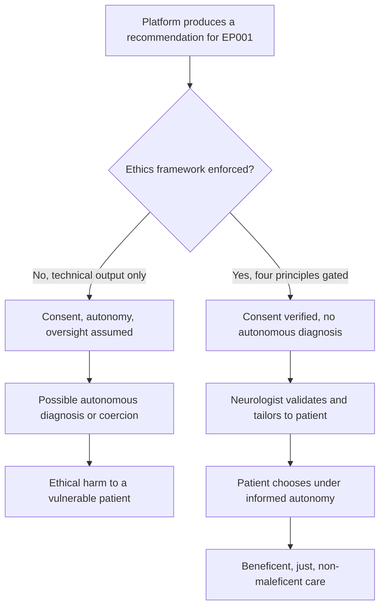
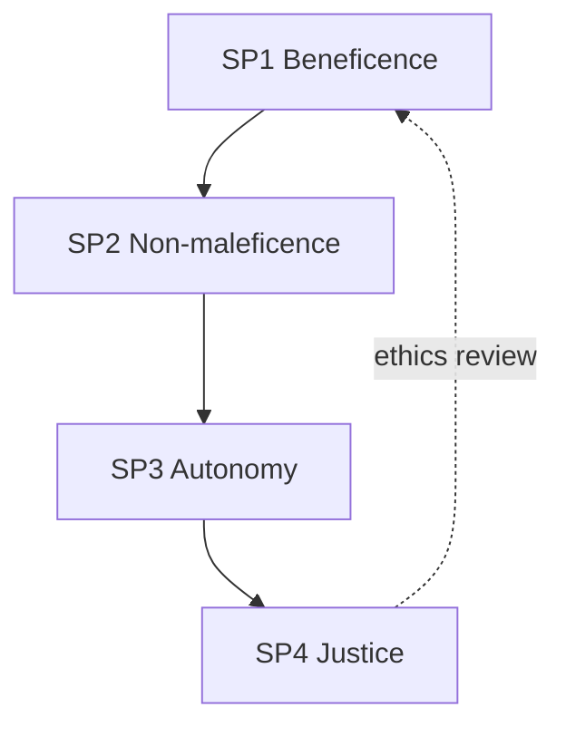
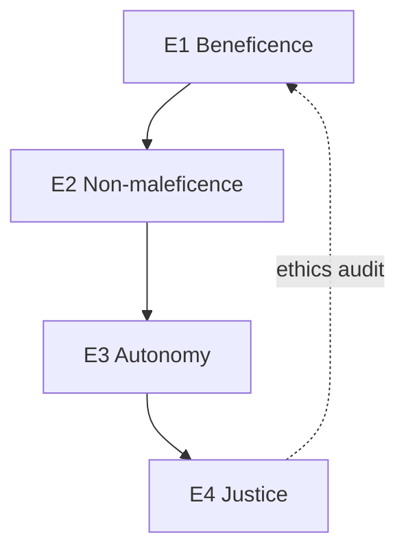
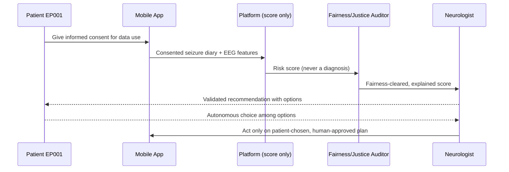
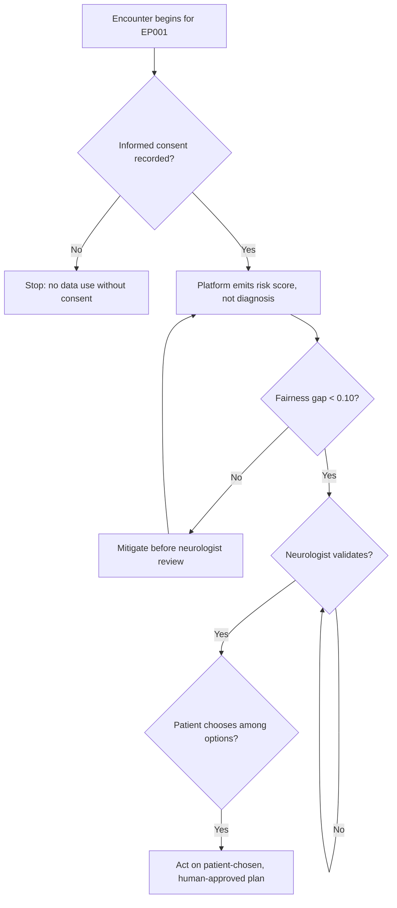
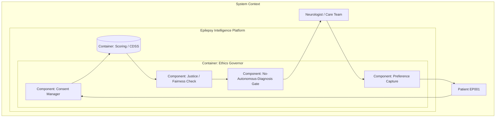
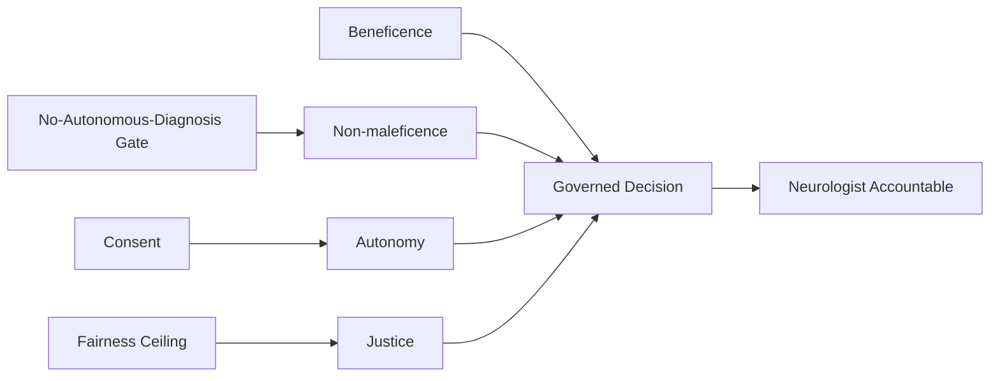
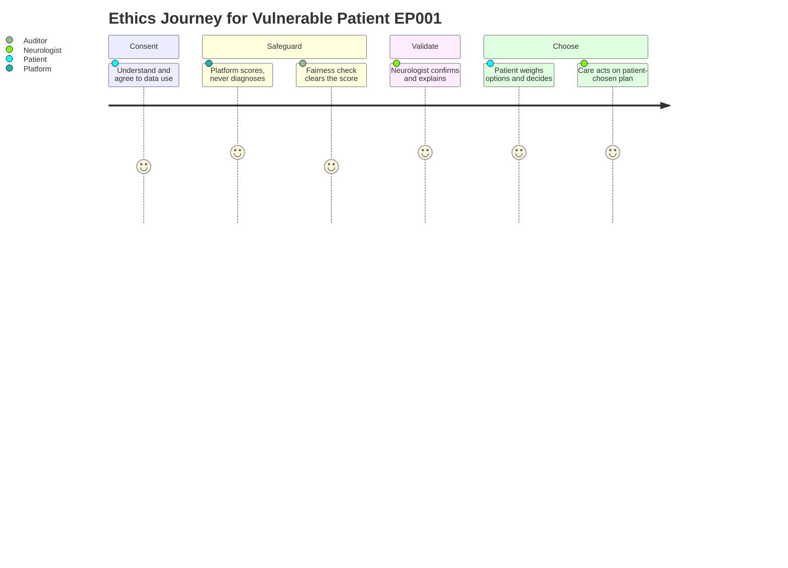

# Ethical AI (Biomedical-Ethics Framework for the Epilepsy Platform)
## Beneficence, Non-Maleficence, Autonomy, and Justice — With Consent, No Autonomous Diagnosis, and Protection of Vulnerable Patients

> **Why (this doc):** A DBA in health care is examined as much on *ethics* as on engineering. A committee will ask whether the epilepsy platform does good (beneficence), avoids harm (non-maleficence), respects patient choice (autonomy), and distributes benefit fairly (justice) — and whether these are enforced or merely asserted. This document states the ethics research spine, defines the four principles operationally for epilepsy care, specifies the mechanisms and controls (consent, no autonomous diagnosis, vulnerable-patient safeguards) with thresholds, and maps every claim to the repository.
> **How:** By following the mandatory research spine (Problem → Sub-problems → Research Problem → Research Objective → Flow → Hypotheses → Statistical Analysis), then presenting a DEFINITION table, a MECHANISMS/CONTROLS table, a KPI/METRICS table with thresholds, a repository-implementation table, all four mandated Mermaid diagram types plus a C4 model, and a Professor-readiness Q&A — every table captioned, every heading self-explaining, and everything anchored to test patient **EP001** (29-year-old male, left-temporal focal impaired-awareness epilepsy, ~5 seizures/month).

**Overarching ethics question.** *Does the epilepsy platform demonstrably enact the four principles of biomedical ethics — securing informed consent, refusing autonomous diagnosis, keeping a neurologist accountable for every decision, and protecting vulnerable epilepsy patients — such that EP001 and every comparator is helped, not harmed, and never overridden by a machine?*

---

## 1. Problem

> **Why:** A doctoral ethics argument must anchor to one concrete ethical risk before proposing safeguards. **How:** State the epilepsy-specific ethics gap in terms of what could go ethically wrong for EP001-comparable patients.

An AI epilepsy platform can cause ethical harm even when technically accurate: it can act without consent (using seizure diaries or EEG beyond what the patient agreed to), it can harm by issuing an unsupervised diagnosis that a clinician never validated, it can override autonomy by nudging a patient toward a drug change they did not choose, and it can entrench injustice by serving some groups better than others. Epilepsy patients are frequently vulnerable — impaired awareness during seizures, driving and employment restrictions, elevated anxiety (EP001's GAD-7 profile), and stigma — which raises the ethical bar. The core problem is the **absence of an operationalised, enforced biomedical-ethics framework** that guarantees consent, forbids autonomous diagnosis, preserves autonomy, and protects vulnerable patients before any recommendation is acted upon.

*Caption — The table below decomposes the ethics problem into the principle at risk, the concrete violation, and the consequence for an EP001-comparable patient, justifying an enforced framework.*

| Principle | Violation if unenforced | Consequence for a comparable patient | Ethical safeguard |
|---|---|---|---|
| Beneficence | Platform optimises metrics, not patient good | Care that helps the average, not this patient | Patient-benefit KPIs + clinician tailoring |
| Non-maleficence | Autonomous diagnosis without validation | Wrong drug change, avoidable harm | No autonomous diagnosis; clinician gate |
| Autonomy | Recommendation framed as mandate | Patient coerced into unwanted treatment | Informed consent + preference capture |
| Justice | Benefit skewed to majority strata | Vulnerable groups under-served | Fairness ceiling + vulnerable-patient policy |

**Reason:** The problem must be visualised as two divergent care paths so the examiner sees where ethics enters. **Why:** A single flowchart contrasts a technical-only output (assumed ethics) against a principle-gated path. **What is happening:** A decision node splits the pathway into an ungoverned branch (possible autonomous diagnosis or coercion) and a governed branch enforcing consent, oversight, and patient choice. **How it is happening:** The platform verifies consent, blocks autonomous diagnosis, routes to a neurologist, and captures patient preference before any action. **Reference:** Beauchamp & Childress (2019) on the four principles; Topol (2019) on human-plus-AI care.

---

## 2. Sub-Problems

> **Why:** One broad ethics problem must split into researchable, individually enforceable units. **How:** Enumerate four sub-problems, one per principle.

*Caption — This table maps each ethics sub-problem to its enforcement signal and the artefact it consumes, keeping every claim falsifiable.*

| # | Sub-problem | Enforcement signal | Primary artefact |
|---|---|---|---|
| SP1 | Benefit may not reach this patient | Patient-tailored recommendation accepted | CDSS output + clinician edit |
| SP2 | Harm from unsupervised action | 0% autonomous diagnoses | Human-gate log |
| SP3 | Autonomy may be bypassed | Consent + preference recorded | Consent record |
| SP4 | Benefit may be unjust across groups | Fairness gap < 0.10 | Bias-audit record |

**Reason:** The sub-problems form a principled chain that must be seen as a loop. **Why:** Ordering SP1→SP4 follows the classic four-principle sequence and shows justice feeding back to beneficence. **What is happening:** Each sub-problem enforces one principle; the dashed edge closes the ethics-review loop. **How it is happening:** The platform re-reviews beneficence in light of justice findings each cycle. **Reference:** Beauchamp & Childress (2019); APA (2020) ethical standards.

---

## 3. Research Problem

> **Why:** The examiner needs one crisp, testable statement unifying all sub-problems. **How:** Frame biomedical ethics as a single answerable research problem bound to EP001.

**Research problem:** *Can the epilepsy platform operationalise beneficence, non-maleficence, autonomy, and justice — with verified informed consent, zero autonomous diagnoses, recorded patient preferences, and a fairness gap below 0.10 — so that EP001 and vulnerable comparators receive beneficent, non-harmful, self-determined, and equitable care with a neurologist accountable for every decision?*

*Caption — This table sharpens the research problem into independent, dependent, and constraint variables so the ethics study stays measurable and bounded.*

| Element | Definition in this study |
|---|---|
| Independent variables | Consent state, oversight mode, preference capture, vulnerability flag |
| Dependent variables | Consent rate, autonomous-diagnosis count, preference-honoured rate, fairness gap |
| Constraint | No autonomous clinical action; clinician accountable for every decision |
| Population anchor | EP001 (vulnerable: impaired awareness, GAD-7=9, driving-restricted) |

---

## 4. Research Objective

> **Why:** The problem must convert into concrete enforce-and-measure goals. **How:** State one overarching objective decomposed into principle-level objectives.

**Overarching objective.** Design, implement, and evaluate an operational biomedical-ethics layer that verifies consent, forbids autonomous diagnosis, records patient preference, and enforces a fairness ceiling — demonstrating ethically governed epilepsy decision support with a human accountable throughout.

*Caption — This table maps each ethics objective to its sub-problem and headline measurable target.*

| Objective | Addresses | Headline measurable target |
|---|---|---|
| E1 Beneficence | SP1 | Clinician-tailored recommendation acceptance measured |
| E2 Non-maleficence | SP2 | 0 autonomous diagnoses (100% human-gated) |
| E3 Autonomy | SP3 | Consent + preference recorded for 100% of cases |
| E4 Justice | SP4 | Fairness gap < 0.10 across sex/age/employment |

**Reason:** Objectives must be shown as an ordered, closed pipeline. **Why:** The flowchart demonstrates the four principles are enforced in sequence and close the loop. **What is happening:** Each objective enforces one principle; E4's audit edge returns to E1. **How it is happening:** The platform realises each principle as a gate under human accountability. **Reference:** Beauchamp & Childress (2019); the justice gate reuses `bias_check()` in `analysis/primary_analysis.py`.

---

## 5. Flow (End-to-End Ethics Runtime)

> **Why:** A defense requires an auditable picture of how each principle is enforced before an action reaches the patient. **How:** Present a stage table and a `sequenceDiagram`.

*Caption — This table traces one EP001 encounter through each ethics runtime stage so the reviewer can audit where each principle is enforced.*

| Stage | Actor/component | Input | Output |
|---|---|---|---|
| 1 Consent | Patient + app | Data-use scope | Recorded consent |
| 2 Score | Platform | Consented data | Risk score (not a diagnosis) |
| 3 Justice | Fairness auditor | Score × attributes | Fairness gap < 0.10 |
| 4 Validate | Neurologist | Explained score | Confirmed / overridden diagnosis |
| 5 Choose | Patient | Options + preference | Autonomous decision |
| 6 Act | Care team | Patient-chosen plan | Beneficent action |

**Reason:** The runtime must show ordered interaction over time between patient, platform, auditor, and clinician. **Why:** A sequence diagram makes explicit that the platform never diagnoses and the patient always chooses. **What is happening:** Consent precedes scoring, the score is justice-checked, the neurologist validates, and the patient chooses before any action. **How it is happening:** Each message enforces one principle; the platform emits a score, not a diagnosis, and the human is accountable. **Reference:** Beauchamp & Childress (2019); Sendak et al. (2020) on clinician-mediated AI.

---

## 6. Hypotheses

> **Why:** Falsifiable hypotheses make the ethics programme scientific. **How:** State hypotheses HE1–HE4, each paired with its test.

*Caption — The hypothesis table pairs each null with its alternative and the test statistic, so each principle is independently falsifiable.*

| ID | Objective | Null (H0) | Alternative (H1) | Test / statistic |
|---|---|---|---|---|
| HE1 | E1 Beneficence | Recommendations no better than unaided | Tailored recommendations accepted more | Acceptance-rate comparison / McNemar |
| HE2 | E2 Non-maleficence | Autonomous actions occur | Zero autonomous actions | Human-gate audit count = 0 |
| HE3 | E3 Autonomy | Preference not honoured above chance | Preference honoured for all cases | Preference-honoured proportion |
| HE4 | E4 Justice | Benefit differs by group | Benefit equitable (< 0.10 gap) | Fairness-gap test (reuse `bias_check`) |

---

## 7. Statistical Analysis

> **Why:** The examiner will probe how each ethics claim becomes a number. **How:** Bind every hypothesis to a metric, method, threshold, and EP001 read, then show the enforcement loop as a flowchart.

*Caption — This table lists, per ethics objective, the metric, its meaning, the acceptance threshold, and the EP001 read.*

| Metric (objective) | Meaning | Method | Acceptance threshold | EP001 read |
|---|---|---|---|---|
| Recommendation acceptance (E1) | Clinician adopts tailored advice | Acceptance rate / McNemar | Positive uplift | Tailored ASM review adopted |
| Autonomous-diagnosis count (E2) | Actions without clinician sign-off | Human-gate audit | Exactly 0 | Every score human-gated |
| Consent + preference rate (E3) | Cases with recorded consent/choice | Proportion | 100% | Consent + preference recorded |
| Fairness gap (E4) | Selection/TPR spread across groups | `bias_check` gaps | < 0.10 | Sex/age within ceiling |

**Reason:** The ethics analysis must be shown as a gated loop, not a single pass. **Why:** The flowchart proves no action occurs without consent, fairness clearance, clinician validation, and patient choice. **What is happening:** Consent gates data use; the score is fairness-checked; the neurologist validates; the patient chooses before any action. **How it is happening:** Failing any gate halts or mitigates; passing all yields a patient-chosen, human-approved plan. **Reference:** APA (2020) ethical standards; Beauchamp & Childress (2019).

---

## 8. Definitions, Mechanisms & Metrics

> **Why:** The committee must see ethics defined precisely, enforced concretely, and measured numerically. **How:** Present a DEFINITION table, a MECHANISMS/CONTROLS table, and a KPI/METRICS table with thresholds.

*Caption — This DEFINITION table gives the operational meaning of each ethical principle as used in this epilepsy platform.*

| Principle | Formal definition (this platform) | Epilepsy interpretation |
|---|---|---|
| Beneficence | Act to advance this patient's good | Recommendation tailored to EP001, not the average |
| Non-maleficence | Do no harm; avoid unvalidated action | No autonomous diagnosis; clinician gate mandatory |
| Autonomy | Respect the patient's informed choice | Consent + preference recorded and honoured |
| Justice | Distribute benefit and burden fairly | Fairness gap < 0.10 across protected groups |
| Informed consent | Voluntary, informed agreement to specified data use | Scope-limited seizure-diary/EEG consent |

*Caption — This MECHANISMS/CONTROLS table states each ethical mechanism, the control it implements, and where it acts.*

| Mechanism | Control it implements | Pipeline point |
|---|---|---|
| Consent capture | Enforces autonomy + lawful data use | Before scoring |
| Score-not-diagnosis policy | Enforces non-maleficence | Model output |
| Mandatory clinician gate | Prevents autonomous diagnosis | Before any action |
| Preference capture | Enforces autonomy | After validation |
| Fairness ceiling (reuse `bias_check`) | Enforces justice | Before release |
| Vulnerable-patient flag | Extra safeguards for at-risk patients | Throughout |
| Explanation to clinician | Enables beneficent tailoring | Before validation |

*Caption — This KPI/METRICS table sets the numeric target thresholds every ethically governed encounter must meet.*

| KPI | Definition | Target threshold |
|---|---|---|
| Autonomous-diagnosis rate | Actions without clinician sign-off | 0% |
| Human-gated decision rate | Decisions confirmed by a clinician | 100% |
| Consent-recorded rate | Encounters with valid consent | 100% |
| Preference-honoured rate | Patient choice reflected in plan | 100% |
| Fairness gap | Selection/TPR spread across groups | < 0.10 |
| Vulnerable-patient safeguard coverage | Flagged patients with extra review | 100% |

---

## 9. Where Implemented in This Repository

> **Why:** An ethics claim is only credible if it maps to enforced mechanisms. **How:** Tabulate each ethical mechanism against the repository artefact.

*Caption — This table ties every ethical mechanism to the concrete repository artefact that realises it, proving ethics is enforced, not asserted.*

| Ethical mechanism | Repository artefact | What it does |
|---|---|---|
| Justice / fairness ceiling | `analysis/primary_analysis.py` → `bias_check()` | Demographic-parity + equal-opportunity gaps vs 0.10 |
| Non-maleficence (no autonomous diagnosis) | Fusion CDSS design | Emits risk score + suggested workup; never an unsupervised diagnosis |
| Human-in-the-loop gate | Fusion CDSS + `viewer/` severity scoring | Clinician confirms/overrides every score |
| Beneficence (tailoring) | `viewer/` per-role assessment + severity scoring | Clinician edits recommendation to the individual |
| Data-quality guard (do-no-harm on bad data) | `analysis/primary_analysis.py` → `validate()` | Blocks scoring on out-of-range/invalid data |
| Vulnerable-patient context | EP001 profile (impaired awareness, GAD-7=9) | Anchors extra-safeguard reasoning |
| Reporting / accountability | `build_report()` | Records ethics-relevant metrics for audit |

---

## 10. Ethics-Governance Architecture (C4 Model)

> **Why:** Governance requires an explicit map of where ethical enforcement sits. **How:** Render a C4-style container/component model with a prose block.

*Caption — This C4 container view situates the ethics governor between consent, scoring, and the clinician, clarifying accountability boundaries.*

**Reason:** Ethical enforcement needs an explicit architectural home. **Why:** A C4 container model names consent, justice, the no-autonomous-diagnosis gate, and preference capture as distinct responsibilities. **What is happening:** Consent precedes scoring; the score passes the justice check and the diagnosis gate to the neurologist; preference returns to the patient. **How it is happening:** Justice reuses `bias_check`; the gate is the CDSS human-in-the-loop; consent/preference are captured in the viewer workflow. **Reference:** Brown (2018) C4 model; Beauchamp & Childress (2019); global policy rule 21.

---

## 11. Principle-Relationship View (Network)

> **Why:** The committee must see how the four principles connect to the governed decision. **How:** Render a `graph LR` network of principles into the decision.

*Caption — This network shows how beneficence, non-maleficence, autonomy, and justice converge on the human-approved decision.*

**Reason:** Ethics is only valid if every principle is linked to the decision. **Why:** The network makes explicit that all four principles, plus consent and the diagnosis gate, converge on one accountable decision. **What is happening:** Each principle and its enabling mechanism feed the governed decision owned by the neurologist. **How it is happening:** Consent enables autonomy, the gate enables non-maleficence, and the fairness ceiling enables justice. **Reference:** Beauchamp & Childress (2019) on the interlocking four principles.

---

## 12. Patient Ethics Experience (Journey)

> **Why:** Ethics must be felt from the patient's point of view. **How:** Render a `journey` across EP001's ethical experience.

*Caption — This journey models EP001's experience of consent, oversight, and choice across the ethics workflow.*

**Reason:** The principles must be felt from the human's point of view. **Why:** A journey map surfaces where consent, oversight, and choice are honoured for a vulnerable patient. **What is happening:** EP001 consents, is protected by the no-diagnosis policy and fairness check, is validated by a clinician, and chooses. **How it is happening:** Each principle is a journey section; the clinician's validation and the patient's choice close the loop. **Reference:** Cramer et al. (1998) QOLIE-31 grounding the patient-experience dimension; Beauchamp & Childress (2019).

---

## 13. Professor Readiness (Defense Q&A)

> **Why:** Anticipating examiner challenges demonstrates command of the ethics argument. **How:** Pre-answer the likely questions concisely.

### Q1. How do you guarantee the platform never diagnoses autonomously?

> **Why:** "No autonomous diagnosis" is easily claimed. **How:** Point to the output contract and the gate.

The model's output contract is a *risk score plus suggested workup*, never a diagnosis; the fusion CDSS routes every score to the neurologist, who confirms or overrides before any action, and the `viewer/` severity scoring records that human decision. The KPI is 0% autonomous-diagnosis and 100% human-gated. The architecture makes an unsupervised diagnosis structurally impossible, not merely discouraged.

### Q2. How is autonomy protected for a vulnerable epilepsy patient like EP001?

> **Why:** Vulnerability (impaired awareness, anxiety, restrictions) can undermine consent. **How:** Separate consent from coercion.

Consent is scope-limited and recorded before any data use, and the recommendation is presented as options with the clinician explaining trade-offs, not as a mandate; the patient's preference is captured and honoured. EP001's anxiety profile (GAD-7 = 9) and driving/employment restrictions flag him for extra review so pressure is not mistaken for choice. Autonomy is a recorded, honoured variable.

### Q3. How does justice differ here from the fairness document?

> **Why:** The committee will probe overlap. **How:** Distinguish principle from metric.

Justice is the *ethical principle* that benefit and burden be distributed fairly; the fairness document (03) provides the *operational metric* (parity/equal-opportunity gap < 0.10) that evidences it. This document reuses `bias_check()` as the justice control but embeds it in the four-principle framework alongside consent, non-maleficence, and beneficence, so justice is one of four gates, not a standalone number.

---

## 14. References

> **Why:** Defensible ethics claims require real, citable sources. **How:** APA 7th edition entries spanning biomedical ethics, fairness, medical AI, and reporting standards.

American Psychological Association. (2020). *Publication manual of the American Psychological Association* (7th ed.). https://doi.org/10.1037/0000165-000

Barocas, S., Hardt, M., & Narayanan, A. (2019). *Fairness and machine learning: Limitations and opportunities*. fairmlbook.org. http://www.fairmlbook.org

Beauchamp, T. L., & Childress, J. F. (2019). *Principles of biomedical ethics* (8th ed.). Oxford University Press.

Brown, S. (2018). *The C4 model for visualising software architecture*. https://c4model.com

Cramer, J. A., Perrine, K., Devinsky, O., Bryant-Comstock, L., Meador, K., & Hermann, B. (1998). Development and cross-cultural translations of a 31-item quality of life in epilepsy inventory (QOLIE-31). *Epilepsia, 39*(1), 81–88. https://doi.org/10.1111/j.1528-1157.1998.tb01278.x

Hardt, M., Price, E., & Srebro, N. (2016). Equality of opportunity in supervised learning. *Advances in Neural Information Processing Systems, 29*, 3315–3323.

Mehrabi, N., Morstatter, F., Saxena, N., Lerman, K., & Galstyan, A. (2021). A survey on bias and fairness in machine learning. *ACM Computing Surveys, 54*(6), 1–35. https://doi.org/10.1145/3457607

Topol, E. J. (2019). High-performance medicine: The convergence of human and artificial intelligence. *Nature Medicine, 25*(1), 44–56. https://doi.org/10.1038/s41591-018-0300-7
