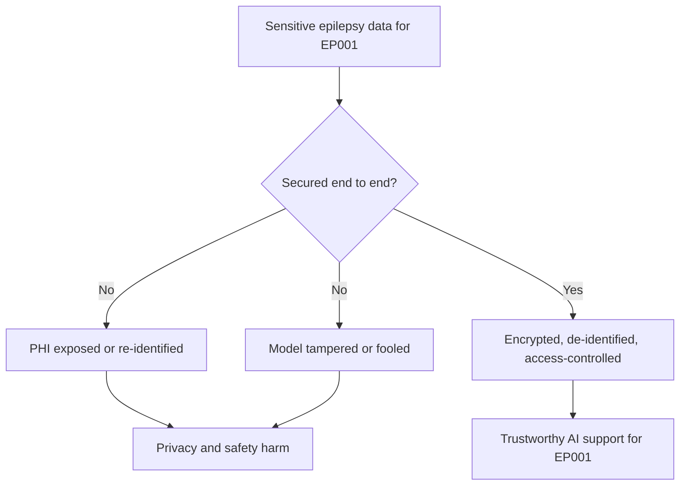
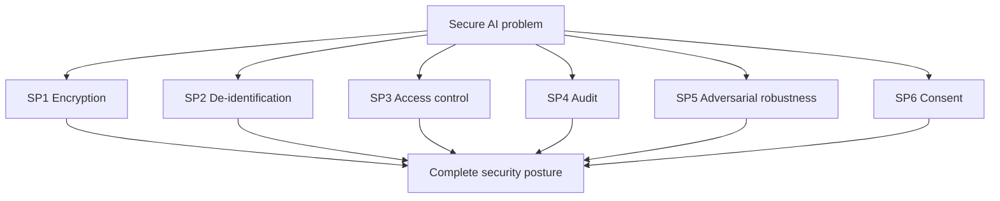
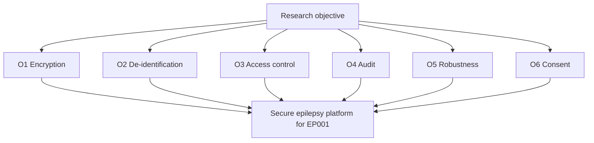
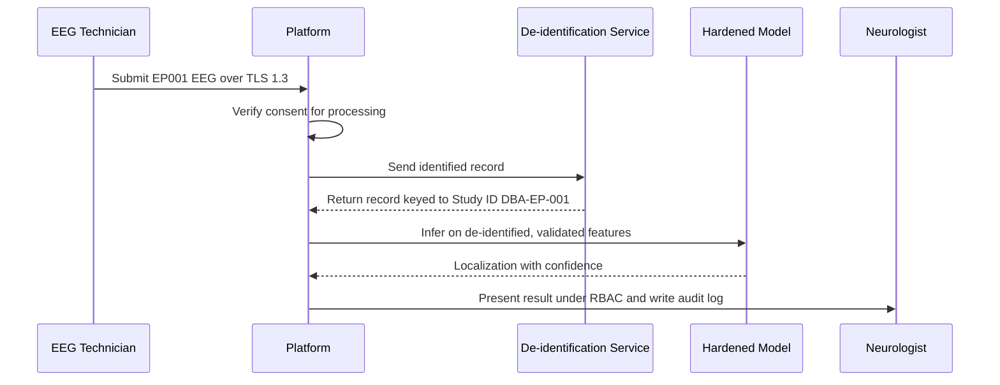
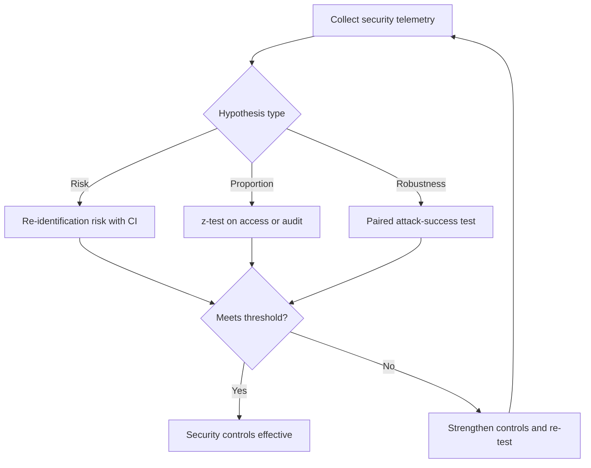
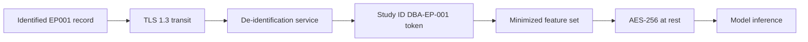
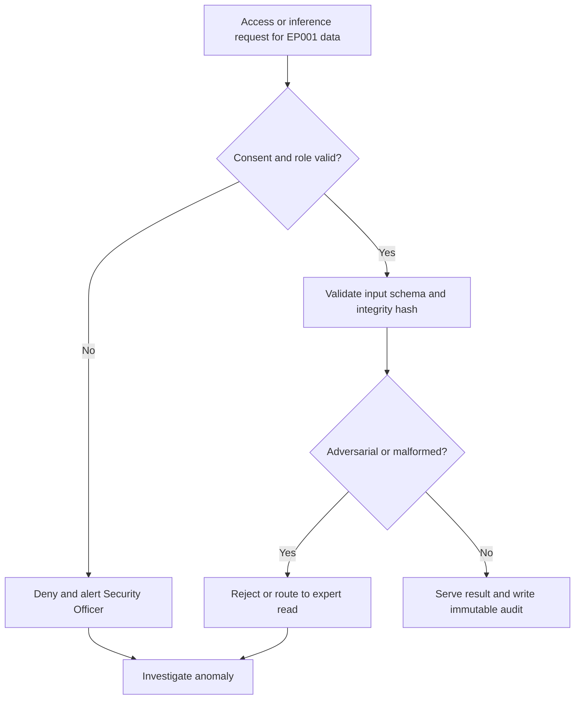
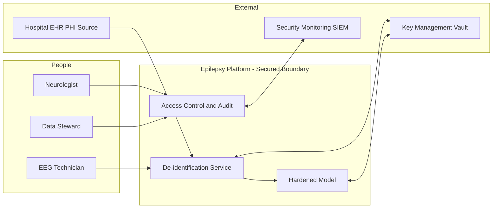
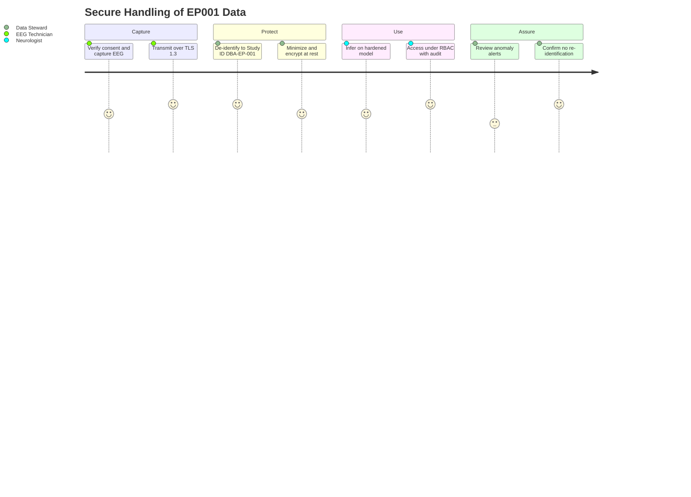

# Responsible AI Pillar 11 - Secure AI (Epilepsy, EP001)

> **Why (this doc):** The epilepsy platform ingests some of the most sensitive data a person holds - 21-channel EEG, medication history, seizure diaries, mood and quality-of-life scores - for a patient like EP001. Secure AI is the discipline that keeps this Protected Health Information (PHI) confidential, integral, available, and de-identified to a Study ID, while defending the models themselves against adversarial manipulation. Without it, the platform is neither trustworthy nor lawful.
> **How:** By following the mandatory research spine (Problem -> Sub-problems -> Research Problem -> Research Objective -> Flow -> Hypotheses -> Statistical Analysis), then defining Secure AI, its protection mechanisms/controls, an access/threat register with likelihood x impact, a repo-implementation crosswalk, all four Mermaid diagram types plus a C4 model, a defense Q&A, and APA-7 references - every table captioned, every heading carrying a **Why**/**How**, anchored to EP001 (left temporal, F7/T7/P7, 92%) and to Study ID DBA-EP-001. This pillar extends `docs/pipeline-a/phase-16-governance-compliance.md` S12.2 rather than duplicating it.

**Governing question.** *Can the platform protect EP001's PHI - through encryption, least-privilege access, de-identification to Study ID DBA-EP-001, auditing, and adversarial robustness - so that clinically useful AI never comes at the cost of a privacy, integrity, or safety breach?*

---

## 1. Problem

> **Why:** Security controls must anchor to a concrete breach scenario before they are proposed. **How:** State the gap between a useful multimodal model and a model whose data and integrity are protected end-to-end for EP001.

An epilepsy model is only useful if it sees rich, identifiable-adjacent signals - EEG waveforms, drug levels, seizure timings - yet each of those signals is a re-identification vector and a target. For EP001 the failure modes are concrete: 21-channel EEG exfiltrated and linked back to a named person; an over-broad access grant letting a non-treating user read the seizure diary; an adversarially perturbed EEG segment that flips a localization; or an unencrypted backup leaking medication history. The problem is not model performance - it is the **absence of defense-in-depth**: protecting PHI in transit and at rest, minimizing and de-identifying it to a Study ID, constraining who may touch it, auditing every access, and hardening the model against adversarial inputs.

*Caption - The table below decomposes the abstract security gap into concrete threats and the control that answers each, so every later section maps to a named threat.*

| Threat | Manifestation for EP001 | Security answer (Section) |
|---|---|---|
| Data exfiltration | 21-channel EEG + medication data stolen | Encryption + minimization (S8) |
| Re-identification | EEG linked back to named EP001 | De-identification to Study ID (S8) |
| Over-broad access | Non-treating user reads seizure diary | Role-based access control (S9) |
| Tampering | EEG segment altered before inference | Integrity checks + audit (S9) |
| Adversarial input | Perturbed EEG flips F7/T7/P7 localization | Adversarial robustness (S9) |

**Reason:** The problem must fork between an exposed and a secured data-and-model path. **Why:** A single flowchart contrasts the breach path against the defense-in-depth path, making the value of Secure AI immediate. **What is happening:** A decision node splits EP001's data into an unsecured branch (exposure, re-identification, tampering) and a secured branch ending in trustworthy support. **How it is happening:** The secured branch applies encryption, de-identification, access control, and robustness before any output is trusted. **Reference:** HHS (2013) HIPAA Security Rule; NIST (2023) AI RMF Secure and resilient characteristic.

---

## 2. Sub-Problems

> **Why:** One security problem must split into individually ownable protection units. **How:** Enumerate the discrete security questions the platform must answer, each with an owner.

*Caption - This table lists each security sub-problem with its owning role, ensuring no protection dimension is orphaned.*

| # | Sub-problem | Primary owner |
|---|---|---|
| SP1 | How is PHI protected in transit and at rest? | Security Officer |
| SP2 | How is data minimized and de-identified to a Study ID? | Data Steward |
| SP3 | Who may access which data, under least privilege? | Security Officer |
| SP4 | How is every access audited and tamper-evident? | Security Officer |
| SP5 | How is the model hardened against adversarial inputs? | ML Lead |
| SP6 | How is consent captured and enforced? | Data Steward + Neurologist Lead |

**Reason:** The sub-problems must converge on one security posture. **Why:** The flowchart shows six protection questions rolling up into a single defense-in-depth posture, proving coverage. **What is happening:** Each sub-problem is a node feeding the complete security posture. **How it is happening:** Each has a named owner (table) and a downstream control section. **Reference:** NIST (2023) AI RMF Map function.

---

## 3. Research Problem

> **Why:** The examiner needs one testable statement unifying the sub-problems. **How:** Frame PHI protection and model robustness as a single answerable research problem bound to EP001.

**Research problem:** *How can the epilepsy platform protect EP001's PHI - through encryption, data minimization, de-identification to Study ID DBA-EP-001, least-privilege access, immutable auditing, enforced consent, and adversarial robustness - so that model utility is preserved while privacy, integrity, and safety breaches are provably prevented or contained?*

*Caption - This table sharpens the research problem into independent, dependent, and constraint variables so security stays measurable and bounded.*

| Element | Definition in this study |
|---|---|
| Independent variables | Encryption state, de-identification, access role, audit presence, adversarial defense |
| Dependent variables | Re-identification risk, unauthorized-access count, audit completeness, adversarial success rate |
| Constraint | No raw identifiers leave the boundary; every access logged |
| Population anchor | EP001 / Study ID DBA-EP-001, left temporal, F7/T7/P7, 92% |

---

## 4. Research Objective

> **Why:** The problem must convert into build-and-measure goals. **How:** State one overarching objective decomposed into security-specific objectives, each yielding an auditable artifact.

**Overarching objective.** Design and evaluate a defense-in-depth security posture for the epilepsy platform that keeps EP001's PHI confidential, integral, available, and de-identified to Study ID DBA-EP-001, and hardens the models against adversarial inputs - quantified against re-identification, access, audit, and robustness metrics.

*Caption - Each objective yields a concrete, auditable artifact, making security verifiable rather than aspirational.*

| # | Objective | Deliverable artifact | Success metric |
|---|---|---|---|
| O1 | Encrypt PHI in transit and at rest | Encryption policy + config | 100% PHI encrypted (TLS 1.3 / AES-256) |
| O2 | De-identify to Study ID | ID mapping + de-id pipeline | 0 raw identifiers past boundary |
| O3 | Enforce least-privilege access | RBAC matrix | 0 unauthorized accesses |
| O4 | Audit every access immutably | Append-only access log | 100% accesses logged |
| O5 | Harden models against adversarial input | Robustness test suite | Adversarial success rate < threshold |
| O6 | Capture and enforce consent | Consent record + enforcement gate | 100% processing consent-backed |

**Reason:** Objectives must be an ordered, closed posture to prove coherence. **Why:** The flowchart shows the six objectives as facets of one secure platform rather than a scatter of controls. **What is happening:** Each objective feeds the secure platform node serving EP001. **How it is happening:** Each maps to an artifact and metric in the table. **Reference:** NIST (2023) AI RMF; HHS (2013) HIPAA Security Rule safeguards.

---

## 5. Flow (End-to-End Secure Data Runtime)

> **Why:** A defense requires an auditable picture of how EP001's data moves securely from capture to inference. **How:** Present the flow as a stage table and a `sequenceDiagram` across EEG Technician, de-identification service, model, and Neurologist.

*Caption - This table traces one EP001 recording through each secure stage so the reviewer can audit where protection enters.*

| Stage | Actor/component | Input | Security gate |
|---|---|---|---|
| 1 Capture | EEG Technician | 21-channel EEG, medication list | Consent verified |
| 2 Encrypt | Platform | Raw PHI | TLS 1.3 in transit |
| 3 De-identify | De-id service | Identified record | Map to Study ID DBA-EP-001 |
| 4 Store | Platform | De-identified record | AES-256 at rest |
| 5 Infer | Model | De-identified features | Input validation + robustness check |
| 6 Review | Neurologist | Result + rationale | RBAC + audit log write |

**Reason:** The secure runtime must show ordered protection over time. **Why:** A sequence diagram makes explicit that consent, encryption, and de-identification all precede inference, and that access is role-gated and logged. **What is happening:** The technician submits over TLS; consent is verified; the record is de-identified to Study ID DBA-EP-001; the hardened model infers; the Neurologist reviews under RBAC with an audit write. **How it is happening:** Each hop enforces one control; raw identifiers never reach the model. **Reference:** El Emam et al. (2015) on de-identification; HHS (2013) Security Rule.

---

## 6. Hypotheses

> **Why:** Falsifiable hypotheses make the security programme scientific. **How:** State four hypotheses, each paired with the statistic that tests it.

*Caption - The hypothesis table pairs each null with its alternative and the measured variable, so security effectiveness is independently falsifiable.*

| ID | Null (H0) | Alternative (H1) | Measured variable |
|---|---|---|---|
| H1 | De-identification does not change re-identification risk | De-identification lowers re-identification risk | Re-identification success rate |
| H2 | RBAC does not change unauthorized-access rate | RBAC reduces unauthorized access to zero | Count of unauthorized accesses |
| H3 | Adversarial training does not change attack success | Adversarial training lowers attack success | Adversarial success rate |
| H4 | Audit coverage does not reach completeness | Audit reaches 100% coverage | Fraction of accesses logged |

---

## 7. Statistical Analysis

> **Why:** The examiner will probe how each security claim becomes a number. **How:** Bind every hypothesis to a test, threshold, and EP001 read, then show the validation loop as a flowchart.

*Caption - This table binds each hypothesis to a statistical method and decision rule, so security effectiveness is judged objectively.*

| Hypothesis | Test | Threshold / decision rule | EP001 read |
|---|---|---|---|
| H1 | Re-identification risk estimate + bootstrap CI | Reject H0 if risk CI upper bound < 0.09 | EP001 record not re-identifiable |
| H2 | One-proportion z-test vs 0 | Reject H0 if unauthorized access = 0, p < 0.05 | No non-treating access to EP001 diary |
| H3 | Paired test on attack success pre/post defense | Reject H0 if success falls, p < 0.05 | Perturbed EEG no longer flips F7/T7/P7 |
| H4 | One-proportion z-test vs 1.0 | Reject H0 if coverage = 100%, p < 0.05 | Every EP001 access appears in log |

**Reason:** The analysis plan must be a gated loop. **Why:** The flowchart proves security is declared effective only after re-identification, access, robustness, and audit gates clear. **What is happening:** Telemetry routes by hypothesis type to the right test; failing any gate returns to control strengthening. **How it is happening:** Each test carries an explicit decision rule tied to EP001. **Reference:** APA (2020) on transparent analysis reporting; El Emam et al. (2015) on re-identification risk thresholds.

---

## 8. Definition, Encryption & De-identification

> **Why:** Secure AI must be defined, then made operational through encryption and de-identification to a Study ID. **How:** A definition table, an encryption/minimization mechanisms table, and the Study ID mapping.

### 8.1 Definition of Secure AI

*Caption - This table defines Secure AI and its scope, fixing terminology before mechanisms are specified.*

| Term | Definition in this study | EP001 relevance |
|---|---|---|
| Secure AI | Discipline protecting PHI confidentiality/integrity/availability and model robustness | Protects EP001's EEG, meds, diary |
| PHI | Individually identifiable health information | EP001 name, DOB linked to EEG |
| De-identification | Removing/replacing identifiers so data no longer identifies a person | Map EP001 -> Study ID DBA-EP-001 |
| Least privilege | Access limited to the minimum needed for a role | Only treating team reads diary |
| Adversarial robustness | Model resistance to malicious input perturbation | Perturbed EEG cannot flip localization |
| Consent | Documented authorization to process data | EP001 consent gates processing |

### 8.2 Encryption & Minimization Mechanisms

*Caption - This table names each protection control and its purpose, converting "we secure data" into an auditable practice.*

| Mechanism | Control | Purpose |
|---|---|---|
| Transit encryption | TLS 1.3 on all channels | Confidentiality in motion |
| At-rest encryption | AES-256 on stores and backups | Confidentiality at rest |
| Data minimization | Store only fields the model needs | Reduce exposure surface |
| Tokenized identifiers | Replace direct IDs with Study ID token | Break re-identification link |
| Key management | Rotated keys, hardware-backed vault | Limit key compromise blast radius |
| Integrity hashing | Hash EEG segments before inference | Detect tampering |

### 8.3 De-identification to Study ID

*Caption - This mapping shows exactly how EP001 becomes Study ID DBA-EP-001, the single most important privacy control in this pillar.*

| Identified attribute | Handling | De-identified form |
|---|---|---|
| Name / DOB | Removed from analysis record | (not stored in model store) |
| Medical record number | Tokenized | Study ID DBA-EP-001 |
| EEG recording | Linked only via Study ID | DBA-EP-001 EEG (F7/T7/P7) |
| Medication history | Coded, date-shifted | DBA-EP-001 med profile |
| Free-text notes | Scrubbed of identifiers | De-identified narrative |

**Reason:** The path from identified record to model input must be a single legible network. **Why:** The `graph LR` shows encryption and de-identification sitting *before* storage and inference, proving privacy is inline. **What is happening:** An identified EP001 record is encrypted, de-identified to token DBA-EP-001, minimized, encrypted at rest, and only then fed to the model. **How it is happening:** Each node is a control; the token is what all downstream stores key on, so no raw identifier persists. **Reference:** El Emam et al. (2015); HHS (2013) de-identification standard.

---

## 9. Access Control, Audit & Adversarial Robustness + Threat Register

> **Why:** Confidential data must be reachable only by the right roles, every touch logged, and the model resilient to attack. **How:** An RBAC/audit/robustness controls table and a threat register scored by likelihood x impact.

### 9.1 Access, Audit & Robustness Controls

*Caption - This table names each control, its mechanism, and response, making "we control access and defend the model" auditable.*

| Control | Mechanism | Response on violation |
|---|---|---|
| Role-based access | Neurologist / EEG Technician / Data Steward roles | Deny + alert Security Officer |
| Attribute-based scoping | Access only to the treating team's patients | Block cross-patient read |
| Immutable audit | Append-only, hash-chained access log | Tamper triggers investigation |
| Anomaly detection | Baseline access patterns per role | Flag unusual bulk export |
| Input validation | Schema + range checks on EEG features | Reject malformed segment |
| Adversarial defense | Adversarial training + input smoothing | Route low-confidence to expert read |

### 9.2 Threat & Access Register

*Caption - This register ranks the top security threats by likelihood x impact with owner and mitigation, so effort concentrates where exposure is greatest.*

| ID | Threat | Likelihood | Impact | Mitigation | Owner |
|---|---|---|---|---|---|
| S-R1 | EEG/medication data exfiltrated | Low | High | AES-256 + minimization + audit | Security Officer |
| S-R2 | EP001 re-identified from EEG | Low | High | De-identification to Study ID | Data Steward |
| S-R3 | Non-treating user reads diary | Medium | High | RBAC + attribute scoping | Security Officer |
| S-R4 | Adversarial EEG flips localization | Low | High | Adversarial training + expert routing | ML Lead |
| S-R5 | Audit log tampered | Low | Medium | Hash-chained append-only log | Security Officer |

**Reason:** Access and robustness must be a single enforced decision loop. **Why:** The flowchart proves every request is consent-and-role checked, integrity-validated, and adversarially screened before a result is served and logged. **What is happening:** A request passes consent/role and integrity checks; malformed or adversarial input is rejected or routed to an expert; valid requests are served with an audit write. **How it is happening:** The checks are those in the controls table; the audit log is hash-chained. **Reference:** Finlayson et al. (2019) adversarial attacks on medical ML; HHS (2013) access-control standard.

---

## 10. Where Implemented in This Repo

> **Why:** Secure AI is credible only if it maps to concrete implementation. **How:** Tabulate each security mechanism against the repository artifact that realises it.

*Caption - This crosswalk ties each security mechanism to where it lives in the repository, proving the pillar is realised, not aspirational.*

| Security mechanism | Where implemented in this repo | Anchor |
|---|---|---|
| Encryption (TLS/AES-256) | `docs/pipeline-a/phase-16-governance-compliance.md` S12.2 | Transit + at rest |
| RBAC (Neurologist / EEG Technician) | `docs/pipeline-a/phase-16` S12.2 | Least privilege |
| Immutable access/audit trail | `docs/pipeline-a/phase-16` S12.2 + phase-11 XAI log | Accountability |
| De-identification to Study ID | Study ID DBA-EP-001 mapping (S8.3) | De-identified EEG |
| Consent capture & enforcement | Onboarding intake + governance gate | Consent-backed processing |
| Adversarial robustness / input validation | Model security controls (phase-16 S12.2) | Integrity |
| Human-in-the-loop expert routing | Fusion / CDSS (`pipeline-c-multimodal.md`) | Low-confidence to expert |

---

## 11. C4-Style Model (Security Context)

> **Why:** Security requires an explicit map of who and what touches PHI. **How:** A C4 Level-1 context model naming actors, the secured platform, and external systems with trust boundaries.

*Caption - The C4 context model situates the secured platform among its actors and external systems, clarifying the PHI trust boundary.*

**Reason:** Security needs a single map of the PHI trust boundary. **Why:** A C4 Level-1 model names every actor and system that can supply, de-identify, access, or monitor PHI, fixing where the boundary sits. **What is happening:** The technician and EHR supply identified data to the de-identification service; the model runs inside the boundary; the Neurologist and Data Steward reach it only through access control; the vault and SIEM secure and watch it. **How it is happening:** De-identification, RBAC/audit, and the hardened model form the system-in-focus; the boundary is where raw identifiers stop. **Reference:** Brown (2018) C4 model; HHS (2013) Security Rule.

---

## 12. Journey (Secure Handling Experience)

> **Why:** Security must be felt from the handling roles' point of view, not only measured. **How:** A journey map across technician, steward, and Neurologist over one secured record.

*Caption - This journey maps the secure-handling experience from capture to review, exposing where protection reassures or adds friction.*

**Reason:** Secure handling must surface human confidence and friction. **Why:** A journey map complements the metrics by showing where protection feels heavy or reassuring across roles. **What is happening:** A record is captured, de-identified, encrypted, used under RBAC, and assured against re-identification, with satisfaction scored per step. **How it is happening:** Each phase is a journey section owned by the responsible role. **Reference:** Topol (2019) on trustworthy clinical AI workflow.

---

## 13. Professor Readiness (Defense Q&A)

> **Why:** Anticipating examiner challenges demonstrates command of Secure AI. **How:** Pre-answer the likely questions with concise reasoning, tables, or logic.

### Q1. How do you ensure EP001 cannot be re-identified from the EEG?

> **Why:** Re-identification is the central privacy risk. **How:** De-identification to a Study ID plus a measured risk bound.

Direct identifiers (name, DOB, MRN) are removed or tokenized to Study ID DBA-EP-001 before the record reaches the model store; dates are shifted and notes scrubbed. Re-identification risk is estimated with a bootstrap CI and must fall below the accepted threshold (H1). The model and all downstream stores key only on the token, never the person.

### Q2. What stops a non-treating user from reading EP001's seizure diary?

> **Why:** Over-broad access is a common breach vector. **How:** Least-privilege RBAC plus attribute scoping and audit.

Access is role-based (Neurologist / EEG Technician / Data Steward) and attribute-scoped to the treating team's patients; a non-treating request is denied and alerts the Security Officer. Every access is written to a hash-chained immutable log, and the KPI "unauthorized accesses" targets 0 (H2).

### Q3. Could an adversarial EEG segment fool the localizer for EP001?

> **Why:** Medical models are known to be attackable. **How:** Input validation, adversarial training, and expert routing.

Inputs are schema- and integrity-validated (hashed before inference); the model is adversarially trained and inputs are smoothed. Attack success is measured pre/post defense (H3), and low-confidence or suspicious inputs route to an expert read rather than auto-reporting a localization for F7/T7/P7.

### Q4. How does this extend, rather than repeat, the Phase-16 security section?

> **Why:** The committee will check for duplication. **How:** Position this pillar as the depth layer over Phase 16 S12.2.

Phase 16 S12.2 establishes encryption, RBAC, and audit at the governance level. This pillar deepens the *mechanics* - the de-identification-to-Study-ID mapping, minimization, key management, adversarial robustness, and a scored threat register - and cross-links back rather than restating them (see S10).

---

## 14. References

> **Why:** Defensible claims require real, citable sources. **How:** APA 7th edition entries spanning health-data security, de-identification, adversarial ML, and clinical AI.

American Psychological Association. (2020). *Publication manual of the American Psychological Association* (7th ed.). https://doi.org/10.1037/0000165-000

Brown, S. (2018). *The C4 model for visualising software architecture*. C4model.com. https://c4model.com

El Emam, K., Rodgers, S., & Malin, B. (2015). Anonymising and sharing individual patient data. *BMJ, 350*, h1139. https://doi.org/10.1136/bmj.h1139

European Parliament and Council of the European Union. (2016). *Regulation (EU) 2016/679 (General Data Protection Regulation)*. Official Journal of the European Union.

Finlayson, S. G., Bowers, J. D., Ito, J., Zittrain, J. L., Beam, A. L., & Kohane, I. S. (2019). Adversarial attacks on medical machine learning. *Science, 363*(6433), 1287-1289. https://doi.org/10.1126/science.aaw4399

National Institute of Standards and Technology. (2023). *Artificial intelligence risk management framework (AI RMF 1.0)* (NIST AI 100-1). U.S. Department of Commerce. https://doi.org/10.6028/NIST.AI.100-1

Topol, E. J. (2019). High-performance medicine: The convergence of human and artificial intelligence. *Nature Medicine, 25*(1), 44-56. https://doi.org/10.1038/s41591-018-0300-7

U.S. Department of Health and Human Services. (2013). *HIPAA administrative simplification: Regulation text (45 CFR Parts 160, 162, and 164)*. U.S. Department of Health and Human Services.

U.S. Food and Drug Administration. (2021). *Artificial intelligence/machine learning (AI/ML)-based software as a medical device (SaMD) action plan*. U.S. Food and Drug Administration.
