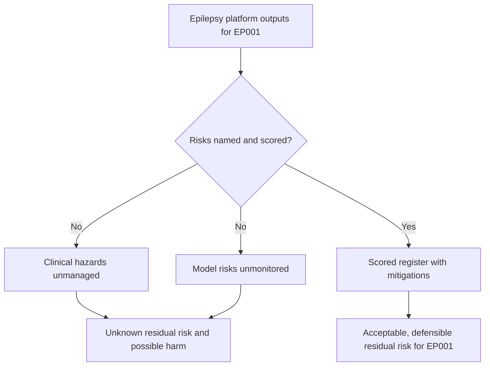
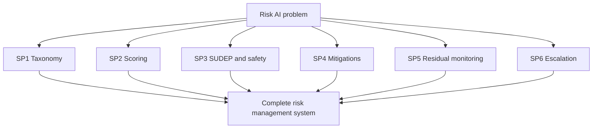
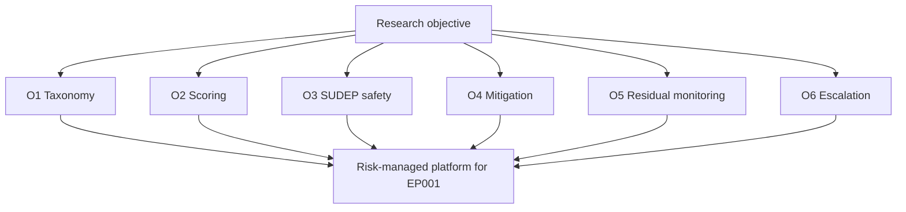
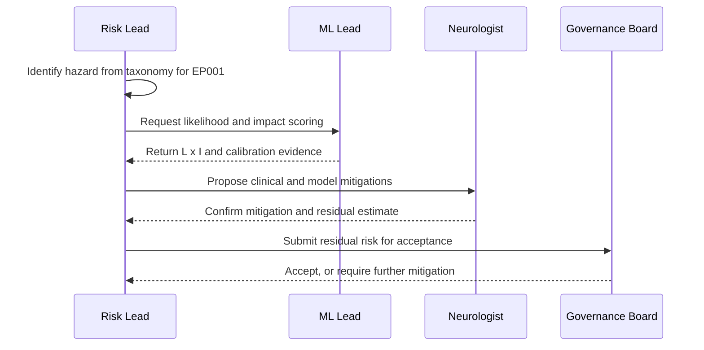
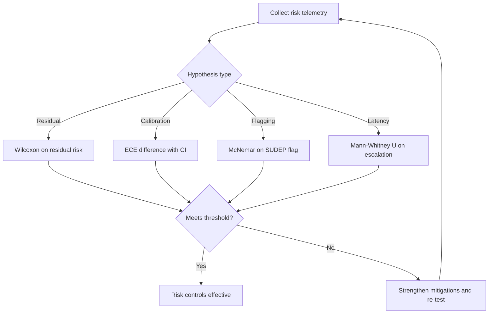
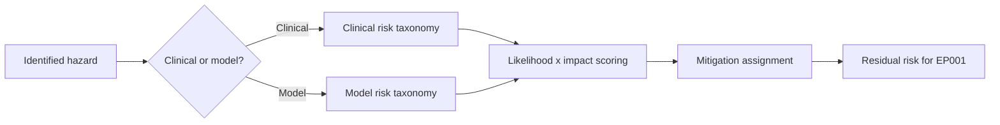
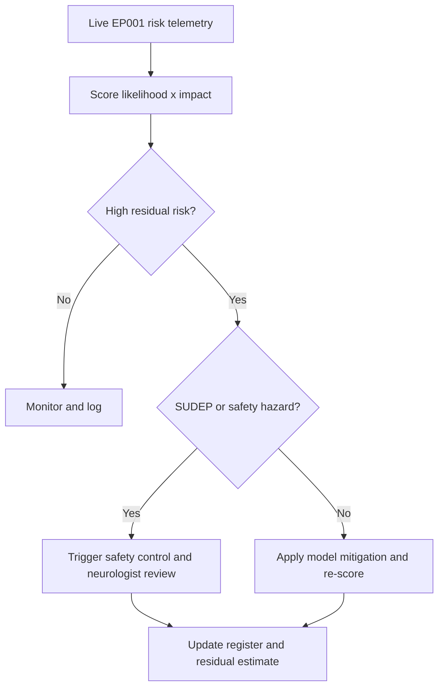
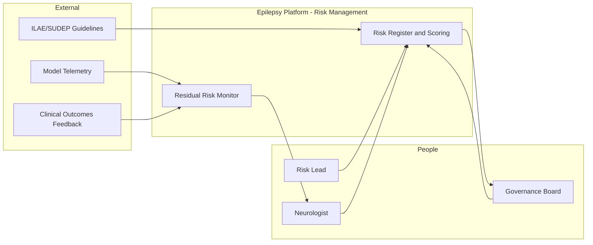
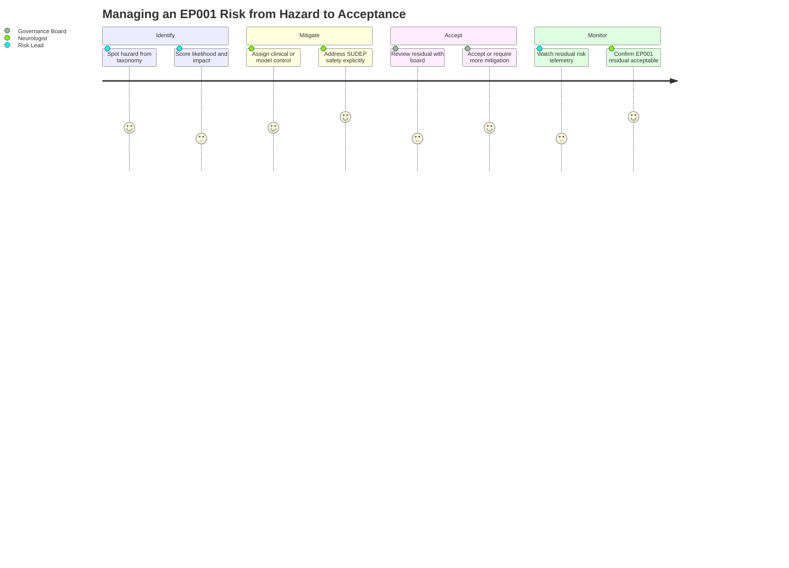

# Responsible AI Pillar 12 - Risk AI (Epilepsy, EP001)

> **Why (this doc):** An epilepsy platform that localizes the focus and stratifies seizure risk for a patient like EP001 carries two families of risk that must be named, scored, and mitigated: **clinical risk** (a missed high-risk state, an under-warned SUDEP hazard) and **model risk** (miscalibration, drift, spurious features). Risk AI is the discipline that builds a shared taxonomy, a scored register, and a mitigation loop so no hazard is left implicit. Unmanaged risk, not model error alone, is what harms patients.
> **How:** By following the mandatory research spine (Problem -> Sub-problems -> Research Problem -> Research Objective -> Flow -> Hypotheses -> Statistical Analysis), then defining Risk AI, its clinical/model risk taxonomy and controls, a likelihood x impact risk register including SUDEP/safety, a repo-implementation crosswalk, all four Mermaid diagram types plus a C4 model, a defense Q&A, and APA-7 references - every table captioned, every heading carrying a **Why**/**How**, anchored to EP001 (left temporal, F7/T7/P7, 92%). This pillar extends the risk register in `docs/pipeline-a/phase-16-governance-compliance.md` S13.3 rather than duplicating it.

**Governing question.** *Can every clinical and model risk in the epilepsy platform - including SUDEP and safety hazards - be systematically identified, scored by likelihood x impact, mitigated, and monitored, so residual risk for a patient such as EP001 is acceptable and defensible?*

---

## 1. Problem

> **Why:** Risk management must anchor to concrete hazards before controls are proposed. **How:** State the gap between an accurate model and a platform whose clinical and model risks are enumerated, scored, and mitigated for EP001.

A localizer can be 92% confident on EP001's left-temporal focus and still contribute to harm if its risks are unmanaged: a falsely reassuring risk score before a breakthrough seizure; an under-recognized SUDEP hazard in a patient with poor adherence (88%) and poor sleep (5.2 h); a miscalibrated confidence that the Neurologist over-trusts; or a spurious feature that fails silently on a new EEG amplifier. The problem is not point accuracy - it is the **absence of a risk taxonomy and register**: clinical and model hazards that are neither named, scored, owned, nor mitigated, leaving residual risk unknown and indefensible.

*Caption - The table below decomposes the abstract risk gap into concrete hazard classes and the control that answers each, so every later section maps to a named hazard.*

| Hazard class | Manifestation for EP001 | Risk answer (Section) |
|---|---|---|
| Clinical - under-warning | Low score before a breakthrough seizure | Clinical risk taxonomy (S8) |
| Clinical - SUDEP/safety | Nocturnal risk under-recognized | SUDEP/safety controls (S9) |
| Model - miscalibration | 92% over-trusted, empirically 80% | Calibration monitoring (S9) |
| Model - drift | New amplifier degrades F7/T7/P7 features | Drift-linked risk review (S9) |
| Model - spurious feature | Localizer keys on artifact, not signal | Feature audit (S8) |

**Reason:** The problem must fork between unmanaged and managed risk. **Why:** A single flowchart contrasts unnamed hazards against a scored, mitigated register, making the value of Risk AI immediate. **What is happening:** A decision node splits the platform's outputs into an unmanaged branch (unknown residual risk) and a managed branch ending in acceptable residual risk for EP001. **How it is happening:** The managed branch applies a taxonomy, scoring, and mitigations before risk is declared acceptable. **Reference:** ISO (2019) 14971 risk management for medical devices; NIST (2023) AI RMF Manage function.

---

## 2. Sub-Problems

> **Why:** One risk problem must split into individually ownable hazard units. **How:** Enumerate the discrete risk questions the platform must answer, each with an owner.

*Caption - This table lists each risk sub-problem with its owning role, ensuring no hazard class is orphaned.*

| # | Sub-problem | Primary owner |
|---|---|---|
| SP1 | What is the shared clinical + model risk taxonomy? | Risk Lead |
| SP2 | How is each risk scored by likelihood x impact? | Risk Lead + ML Lead |
| SP3 | How are SUDEP and safety hazards handled specifically? | Neurologist Lead |
| SP4 | What mitigations reduce each risk to acceptable? | Neurologist Lead + ML Lead |
| SP5 | How is residual risk monitored over time? | ML Lead |
| SP6 | How is risk escalated and reviewed by the board? | Governance Board |

**Reason:** The sub-problems must converge on one risk system. **Why:** The flowchart shows six risk questions rolling up into a single risk-management system, proving coverage. **What is happening:** Each sub-problem is a node feeding the complete risk-management system. **How it is happening:** Each has a named owner (table) and a downstream control section. **Reference:** ISO (2019) 14971 risk-management process.

---

## 3. Research Problem

> **Why:** The examiner needs one testable statement unifying the sub-problems. **How:** Frame clinical and model risk management as a single answerable research problem bound to EP001.

**Research problem:** *How can the epilepsy platform systematically identify, score, mitigate, and monitor its clinical and model risks - including SUDEP and safety hazards - so that residual risk for a patient such as EP001 is reduced to an acceptable, board-approved, and continuously monitored level?*

*Caption - This table sharpens the research problem into independent, dependent, and constraint variables so risk management stays measurable and bounded.*

| Element | Definition in this study |
|---|---|
| Independent variables | Presence of taxonomy, scoring, mitigation, monitoring per risk |
| Dependent variables | Residual risk score, calibration gap, mitigation coverage, escalation latency |
| Constraint | No risk left unscored; residual risk board-approved before deployment |
| Population anchor | EP001 focal impaired-awareness epilepsy, left temporal, F7/T7/P7, 92% |

---

## 4. Research Objective

> **Why:** The problem must convert into build-and-measure goals. **How:** State one overarching objective decomposed into risk-specific objectives, each yielding an auditable artifact.

**Overarching objective.** Design and evaluate a risk-management system for the epilepsy platform that enumerates and scores every clinical and model risk (including SUDEP/safety), mitigates each to an acceptable residual level, and monitors residual risk over time - quantified against calibration, coverage, and escalation metrics.

*Caption - Each objective yields a concrete, auditable artifact, making risk management verifiable rather than aspirational.*

| # | Objective | Deliverable artifact | Success metric |
|---|---|---|---|
| O1 | Build a clinical + model risk taxonomy | Risk taxonomy table | 100% hazards classified |
| O2 | Score every risk by likelihood x impact | Scored risk register | Every risk has L x I score |
| O3 | Address SUDEP/safety explicitly | SUDEP safety control set | SUDEP hazard has named mitigation |
| O4 | Mitigate each risk to acceptable | Mitigation-to-risk map | 100% high risks mitigated |
| O5 | Monitor residual risk | Residual-risk dashboard | Calibration gap < 0.05 sustained |
| O6 | Escalate and review risk | Board risk-review cadence | Breaches escalated < 48h |

**Reason:** Objectives must be an ordered, closed system to prove coherence. **Why:** The flowchart shows the six objectives as stages of one risk-managed platform rather than a scatter of controls. **What is happening:** Each objective feeds the risk-managed platform node serving EP001. **How it is happening:** Each maps to an artifact and metric in the table. **Reference:** ISO (2019) 14971; NIST (2023) AI RMF.

---

## 5. Flow (End-to-End Risk Runtime)

> **Why:** A defense requires an auditable picture of how a hazard is identified, scored, mitigated, and monitored for EP001. **How:** Present the flow as a stage table and a `sequenceDiagram` across Risk Lead, ML Lead, Neurologist, and board.

*Caption - This table traces one hazard through each risk-management stage so the reviewer can audit where risk control enters.*

| Stage | Actor/component | Input | Risk gate |
|---|---|---|---|
| 1 Identify | Risk Lead | Hazard from taxonomy | Logged in register |
| 2 Score | Risk + ML Lead | Likelihood, impact | L x I computed |
| 3 Mitigate | Neurologist + ML Lead | Scored risk | Mitigation assigned |
| 4 Review | Governance Board | Residual score | Acceptance decision |
| 5 Monitor | ML Lead | Live EP001 telemetry | Threshold watch |
| 6 Escalate | Governance Board | Breach signal | Re-review + re-mitigate |

**Reason:** The risk runtime must show ordered management over time. **Why:** A sequence diagram makes explicit that no residual risk is accepted without scoring, mitigation, and board acceptance. **What is happening:** The Risk Lead identifies a hazard; the ML Lead scores it; the Neurologist assigns mitigation; the board accepts or requires more. **How it is happening:** Each message updates the register; residual risk is what the board formally accepts. **Reference:** ISO (2019) 14971 risk-acceptance process; extends `pipeline-a/phase-16` S13.3.

---

## 6. Hypotheses

> **Why:** Falsifiable hypotheses make the risk programme scientific. **How:** State four hypotheses, each paired with the statistic that tests it.

*Caption - The hypothesis table pairs each null with its alternative and the measured variable, so risk-management effectiveness is independently falsifiable.*

| ID | Null (H0) | Alternative (H1) | Measured variable |
|---|---|---|---|
| H1 | Mitigations do not change residual risk | Mitigations lower residual risk score | Residual L x I score |
| H2 | Calibration monitoring does not change over-trust | Monitoring reduces calibration gap | ECE on confidence |
| H3 | SUDEP screening does not change hazard flagging | Screening raises SUDEP hazard flagging | SUDEP flag sensitivity |
| H4 | Risk review cadence does not change escalation time | Cadence shortens escalation latency | Hours to escalate breach |

---

## 7. Statistical Analysis

> **Why:** The examiner will probe how each risk claim becomes a number. **How:** Bind every hypothesis to a test, threshold, and EP001 read, then show the validation loop as a flowchart.

*Caption - This table binds each hypothesis to a statistical method and decision rule, so risk-management effectiveness is judged objectively.*

| Hypothesis | Test | Threshold / decision rule | EP001 read |
|---|---|---|---|
| H1 | Wilcoxon signed-rank on pre/post residual | Reject H0 if residual falls, p < 0.05 | EP001 high risks fall to acceptable |
| H2 | ECE difference + bootstrap CI | Reject H0 if gap reduction CI excludes 0 | 92% confidence matches empirical +-5% |
| H3 | McNemar on flag vs reference | Reject H0 if sensitivity rises, p < 0.05 | EP001 nocturnal SUDEP hazard flagged |
| H4 | Mann-Whitney U on escalation latency | Reject H0 if governed < ungoverned, p < 0.05 | Calibration breach escalated < 48h |

**Reason:** The analysis plan must be a gated loop. **Why:** The flowchart proves risk control is declared effective only after residual, calibration, flagging, and escalation gates clear. **What is happening:** Telemetry routes by hypothesis type to the right test; failing any gate returns to mitigation strengthening. **How it is happening:** Each test carries an explicit decision rule tied to EP001. **Reference:** APA (2020) on transparent analysis reporting.

---

## 8. Definition & Clinical + Model Risk Taxonomy

> **Why:** Risk AI must be defined, then made operational through a shared taxonomy of clinical and model risks. **How:** A definition table and a two-family taxonomy/controls table.

### 8.1 Definition of Risk AI

*Caption - This table defines Risk AI and its scope, fixing terminology before the taxonomy is specified.*

| Term | Definition in this study | EP001 relevance |
|---|---|---|
| Risk AI | Discipline identifying, scoring, mitigating, and monitoring clinical + model risk | Keeps EP001 residual risk acceptable |
| Clinical risk | Hazard to patient outcome from platform use | Under-warned breakthrough seizure |
| Model risk | Hazard from model behavior (miscalibration, drift, spurious features) | 92% over-trusted or drifted |
| Likelihood x impact | Product scoring a risk's probability and severity | Prioritizes EP001's top hazards |
| Residual risk | Risk remaining after mitigation | Board-accepted level for EP001 |
| SUDEP | Sudden unexpected death in epilepsy | Elevated by poor sleep/adherence |

### 8.2 Clinical + Model Risk Taxonomy & Controls

*Caption - This taxonomy names each risk in both families with its control, converting "we manage risk" into an auditable classification.*

| Family | Risk | Control mechanism |
|---|---|---|
| Clinical | Under-warning before seizure | Conservative thresholds + human review |
| Clinical | Over-warning / alarm fatigue | Calibrated risk bands + triage |
| Clinical | SUDEP hazard under-recognized | SUDEP screening + nocturnal monitoring |
| Model | Miscalibration | Temperature scaling + ECE monitor |
| Model | Concept/data drift | PSI + AUROC monitors |
| Model | Spurious feature reliance | Feature/attribution audit |
| Model | Automation bias in clinician | Confidence display + override prompt |

**Reason:** The path from hazard to residual risk must be a single legible network. **Why:** The `graph LR` shows classification and scoring sitting *before* mitigation and residual acceptance, proving risk handling is systematic. **What is happening:** A hazard is classified into the clinical or model family, scored by L x I, mitigated, and reduced to a residual level for EP001. **How it is happening:** Each node is a register step; residual risk is what the board accepts. **Reference:** ISO (2019) 14971; Lundberg & Lee (2017) attribution audit for spurious features.

---

## 9. SUDEP/Safety Controls & Risk Register

> **Why:** SUDEP and safety are the gravest hazards and must be handled explicitly, then all risks scored in a register. **How:** A SUDEP/safety controls table and a likelihood x impact risk register.

### 9.1 SUDEP & Safety Controls

*Caption - This table names each SUDEP/safety control and its trigger, making the platform's gravest-hazard handling auditable and specific to EP001.*

| Safety control | Trigger | Response |
|---|---|---|
| SUDEP risk screening | Poor adherence + nocturnal seizures | Flag for neurologist counseling |
| Nocturnal monitoring emphasis | Sleep < 6h + seizure history | Prioritize overnight surveillance |
| Adherence risk prompt | Adherence < 90% | Dosing-reminder recommendation |
| Escalation on rapid deterioration | Risk trend crosses threshold | Urgent review flag |
| Conservative uncertainty routing | Confidence below band | Route to expert, no auto-report |

### 9.2 Risk Register (Likelihood x Impact)

*Caption - This register ranks the top clinical and model risks by likelihood x impact with owner and mitigation, so the board prioritizes where residual exposure is greatest for EP001.*

| ID | Risk | Likelihood | Impact | Mitigation | Owner |
|---|---|---|---|---|---|
| K-R1 | SUDEP hazard under-recognized | Medium | High | SUDEP screening + nocturnal monitoring | Neurologist Lead |
| K-R2 | Under-warning before breakthrough seizure | Medium | High | Conservative thresholds + human review | Neurologist Lead |
| K-R3 | Confidence miscalibration (92% over-trusted) | Medium | High | Temperature scaling + ECE monitor | ML Lead |
| K-R4 | Drift degrades F7/T7/P7 localization | Medium | Medium | PSI/AUROC monitors + retraining | ML Lead |
| K-R5 | Automation bias in clinician | Medium | Medium | Confidence display + override prompt | Neurologist Lead |
| K-R6 | Alarm fatigue from over-warning | Low | Medium | Calibrated bands + triage | Risk Lead |

**Reason:** SUDEP/safety and model risk must share one enforced response loop. **Why:** The flowchart proves any high residual risk routes to either a safety control (for SUDEP/safety) or a model mitigation, always updating the register. **What is happening:** Live telemetry is scored; high-risk items branch on whether they are safety hazards; both branches update residual risk. **How it is happening:** Controls are those in the tables; residual risk is re-estimated after each mitigation. **Reference:** Ryvlin et al. (2011) on SUDEP risk; ISO (2019) 14971.

---

## 10. Where Implemented in This Repo

> **Why:** Risk AI is credible only if it maps to concrete implementation. **How:** Tabulate each risk mechanism against the repository artifact that realises it.

*Caption - This crosswalk ties each risk mechanism to where it lives in the repository, proving the pillar is realised, not aspirational.*

| Risk mechanism | Where implemented in this repo | Anchor |
|---|---|---|
| Risk register (L x I) | `docs/pipeline-a/phase-16-governance-compliance.md` S13.3 | Scored register |
| Bias/drift/calibration monitors | `docs/pipeline-a/phase-16` S10 | PSI/AUROC/ECE |
| Explainability / spurious-feature audit | `docs/pipeline-a/phase-11-explainable-ai.md` | Attribution audit |
| Conservative uncertainty routing | Fusion / CDSS (`pipeline-c-multimodal.md`) | Expert routing |
| Human-in-the-loop review | Fusion neurologist sign-off | Override prompt |
| Reproducible seeds (risk of non-repro) | Analysis manifests | Seed pinning |
| SUDEP/safety counseling | Clinical assessment + monitoring docs | Nocturnal monitoring |

---

## 11. C4-Style Model (Risk Context)

> **Why:** Risk management requires an explicit map of who and what owns each hazard. **How:** A C4 Level-1 context model naming actors, the risk system, and external inputs.

*Caption - The C4 context model situates the risk-management system among its actors and external inputs, clarifying who owns and accepts risk.*

**Reason:** Risk needs a single map of ownership and acceptance. **Why:** A C4 Level-1 model names every actor and input that can create, score, monitor, or accept risk, fixing where acceptance authority sits. **What is happening:** The Risk Lead and guidelines feed the register; model telemetry and outcomes feed the monitor; the board accepts residual risk; the Neurologist acts on monitored risk. **How it is happening:** The register-and-scoring plus monitor form the system-in-focus; the board holds acceptance authority. **Reference:** Brown (2018) C4 model; ISO (2019) 14971 risk-acceptance roles.

---

## 12. Journey (Risk Management Experience)

> **Why:** Risk management must be felt from the owning roles' point of view, not only measured. **How:** A journey map across Risk Lead, Neurologist, and board over one hazard's lifecycle.

*Caption - This journey maps the risk-management experience from identification to acceptance, exposing where confidence and friction arise.*

**Reason:** Risk management must surface human confidence and friction. **Why:** A journey map complements the metrics by showing where scoring and acceptance feel heavy or reassuring across roles. **What is happening:** A hazard is identified, mitigated, accepted, and monitored, with satisfaction scored per step. **How it is happening:** Each phase is a journey section owned by the responsible role. **Reference:** Topol (2019) on clinician trust in AI-supported care.

---

## 13. Professor Readiness (Defense Q&A)

> **Why:** Anticipating examiner challenges demonstrates command of Risk AI. **How:** Pre-answer the likely questions with concise reasoning, tables, or logic.

### Q1. How does the platform handle SUDEP risk for EP001 specifically?

> **Why:** SUDEP is the gravest epilepsy hazard. **How:** Explicit screening tied to EP001's risk factors.

EP001's poor adherence (88%) and poor sleep (5.2 h) elevate SUDEP risk. The register lists SUDEP under-recognition as a high-impact risk (K-R1) with a named control: SUDEP screening plus nocturnal-monitoring emphasis and an adherence prompt, flagged for neurologist counseling. SUDEP flag sensitivity is tested by McNemar against a reference (H3).

### Q2. What if the Neurologist over-trusts the 92% confidence?

> **Why:** Automation bias and miscalibration are model risks. **How:** Calibration monitoring plus override prompting.

Miscalibration (K-R3) is mitigated by temperature scaling and an ECE monitor requiring reported confidence to match empirical accuracy within +-5% (H2); automation bias (K-R5) is mitigated by displaying calibrated confidence bands and prompting an explicit override decision. Low-confidence outputs route to an expert read rather than auto-reporting F7/T7/P7.

### Q3. How do you know residual risk is actually acceptable, not just claimed?

> **Why:** Residual acceptance is the crux of ISO 14971. **How:** Scored register plus board acceptance and measurement.

Every hazard is scored by likelihood x impact, mitigated, and re-scored; residual risk is formally accepted by the Governance Board before deployment. Mitigation effectiveness is tested by Wilcoxon on pre/post residual scores (H1), so acceptance rests on measured reduction, not assertion.

### Q4. How does this extend the Phase-16 risk register?

> **Why:** The committee will check for duplication. **How:** Position this pillar as the taxonomy-and-SUDEP deepening of Phase 16.

Phase 16 S13.3 provides a governance-level risk register. This pillar deepens it into a two-family clinical/model *taxonomy*, adds explicit SUDEP/safety controls, formalizes likelihood x impact scoring and residual acceptance, and cross-links back rather than restating the governance risks (see S10).

---

## 14. References

> **Why:** Defensible claims require real, citable sources. **How:** APA 7th edition entries spanning risk management, SUDEP, medical AI, and reporting standards.

American Psychological Association. (2020). *Publication manual of the American Psychological Association* (7th ed.). https://doi.org/10.1037/0000165-000

Brown, S. (2018). *The C4 model for visualising software architecture*. C4model.com. https://c4model.com

International Organization for Standardization. (2019). *ISO 14971:2019 Medical devices - Application of risk management to medical devices*. International Organization for Standardization.

Lundberg, S. M., & Lee, S. I. (2017). A unified approach to interpreting model predictions. *Advances in Neural Information Processing Systems, 30*, 4765-4774.

National Institute of Standards and Technology. (2023). *Artificial intelligence risk management framework (AI RMF 1.0)* (NIST AI 100-1). U.S. Department of Commerce. https://doi.org/10.6028/NIST.AI.100-1

Ryvlin, P., Nashef, L., & Tomson, T. (2011). Prevention of sudden unexpected death in epilepsy: A realistic goal? *Epilepsia, 52*(Suppl. 1), 23-28. https://doi.org/10.1111/j.1528-1167.2011.03199.x

Topol, E. J. (2019). High-performance medicine: The convergence of human and artificial intelligence. *Nature Medicine, 25*(1), 44-56. https://doi.org/10.1038/s41591-018-0300-7

U.S. Food and Drug Administration. (2021). *Artificial intelligence/machine learning (AI/ML)-based software as a medical device (SaMD) action plan*. U.S. Food and Drug Administration.
