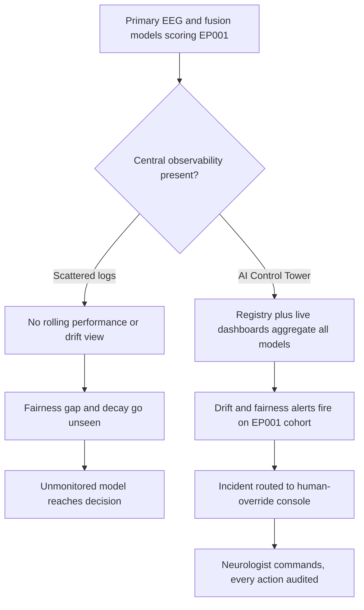
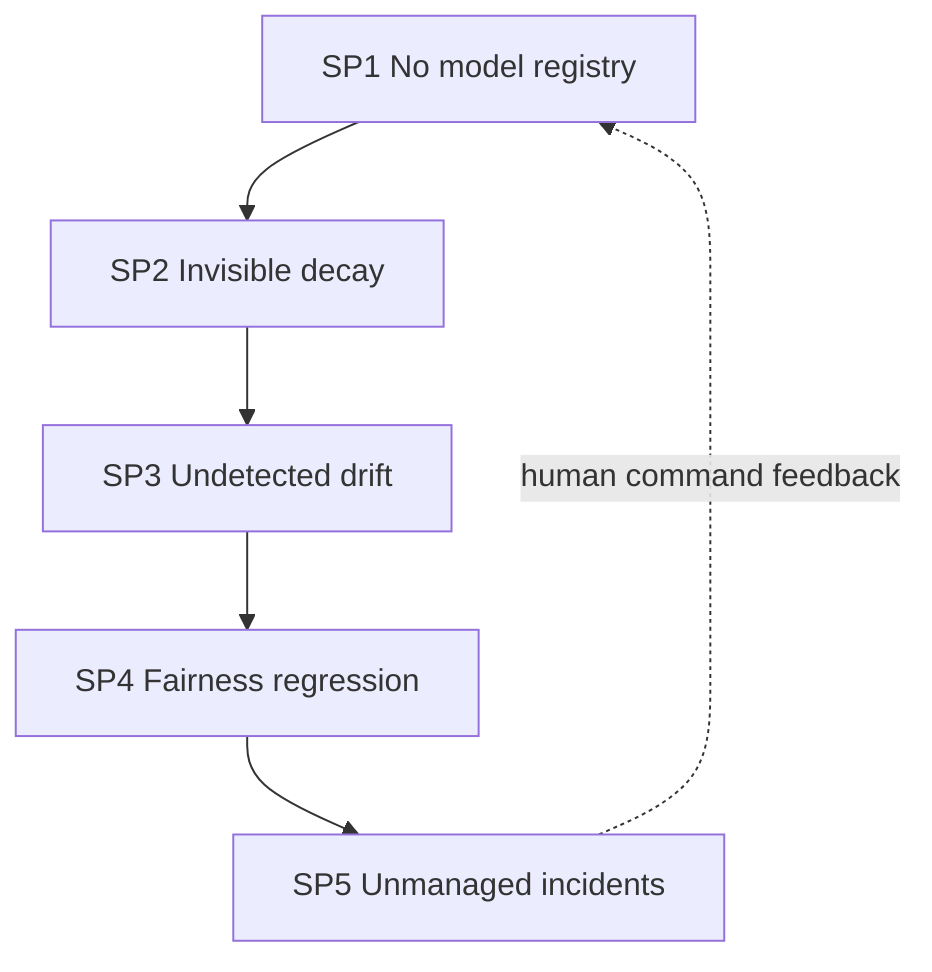
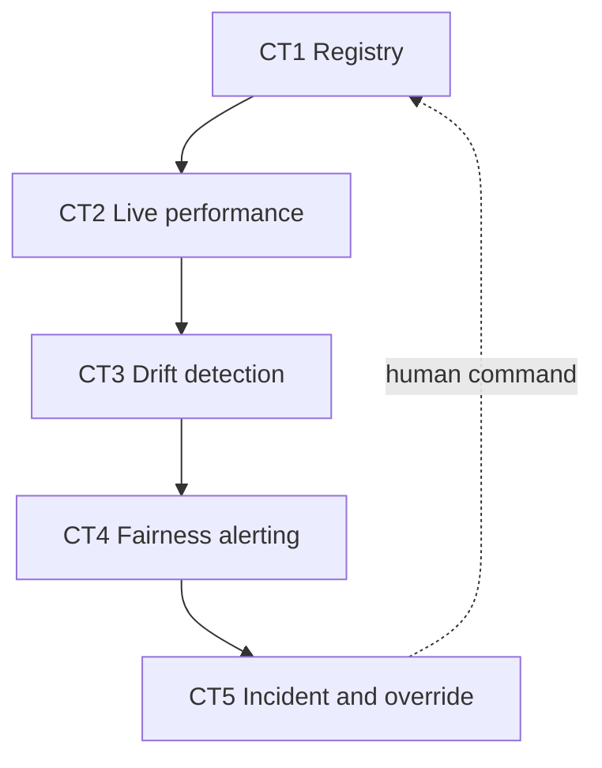
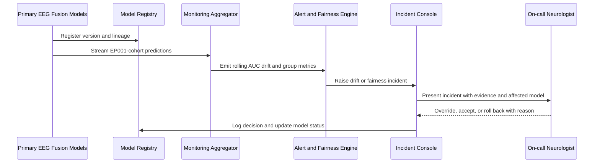
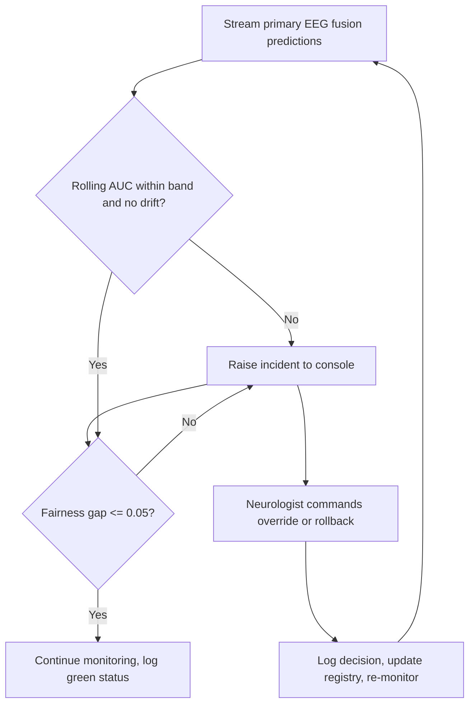
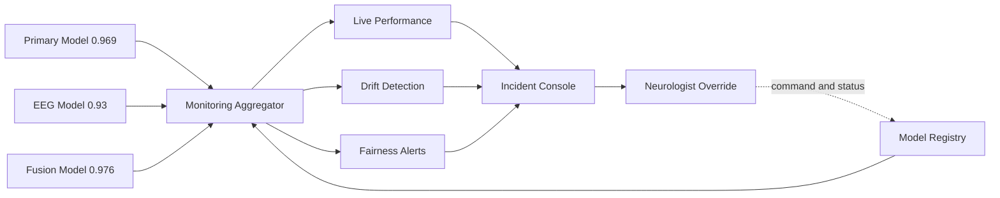
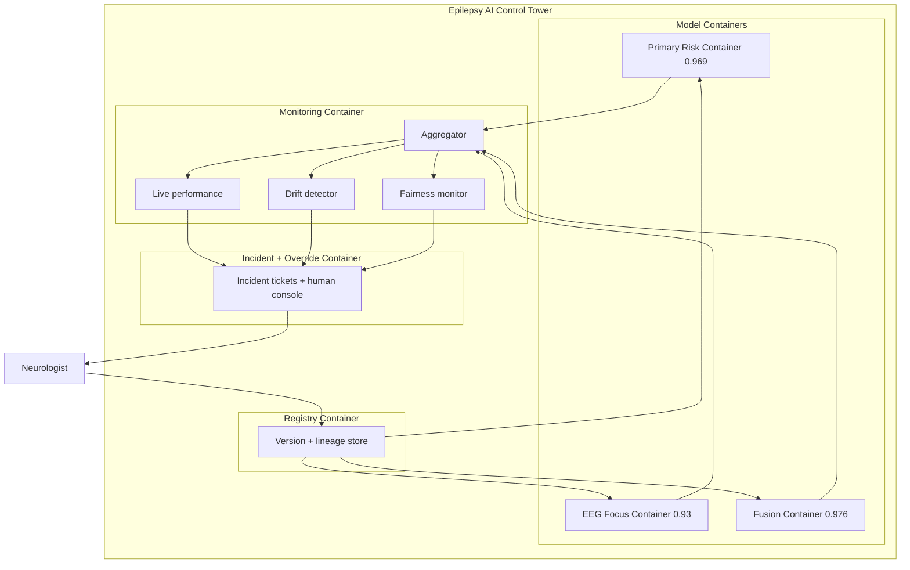
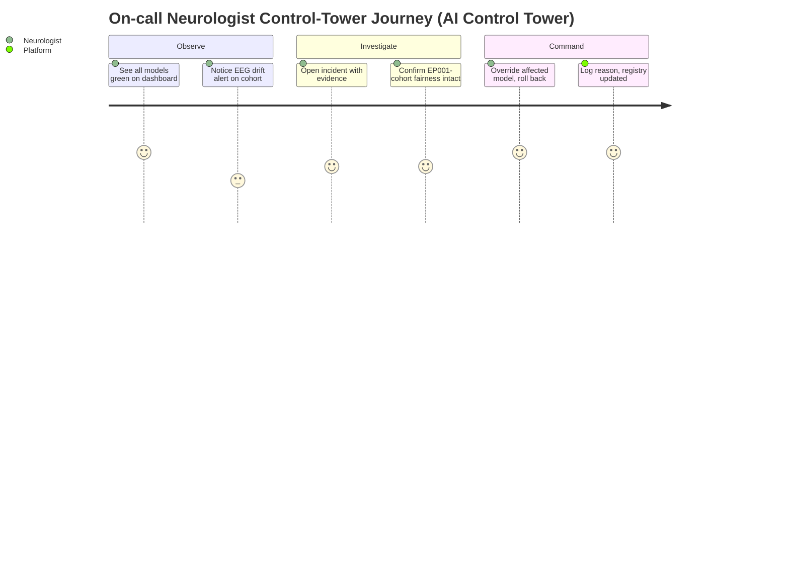

# Responsible AI · Pillar 13 — AI Control Tower (Centralised Monitoring & Observability)
## A Single Governed Console That Watches Every Epilepsy Model, Every Drift, Every Override — With the Human Always in Command

> **Why (this doc):** A DBA committee will ask the operational question that most AI research ignores: *after* the models are deployed, who watches them? A platform that localizes EP001's focus (Left Temporal, 0.98) and scores fused drug-resistance risk (0.59) across primary, EEG, and fusion models needs one place where live performance, data drift, fairness alerts, and human overrides are visible and actionable. The AI Control Tower is that place — the responsible-AI pillar that turns scattered model outputs into centralised, auditable observability with a human-override console.
> **How:** By following the mandatory research spine (Problem → Sub-problems → Research Problem → Research Objective → Flow → Hypotheses → Statistical Analysis), then defining the control tower precisely, tabulating its mechanisms/controls (model registry, live performance, drift, fairness alerts, incident + override console) and its KPIs, mapping each to where it lives in this repository, and rendering all four mandated Mermaid diagram types plus a C4 model whose **monitoring container aggregates from the primary/EEG/fusion containers** — every table captioned, every heading carrying **Why**/**How**, every figure explained with Reason · Why · What is happening · How it is happening · Reference. Epilepsy only; anchored to EP001.

**Pillar question.** *Can a centralised control tower continuously observe the epilepsy platform's primary (AUC 0.969), EEG (0.93), and fusion (0.976) models — surfacing live performance, drift, and fairness alerts and routing every incident to a human-override console — so EP001's decision is never made by an unmonitored model?*

---

## 1. Problem

> **Why:** A doctoral pillar must anchor to one concrete, defensible observability gap before proposing a console. **How:** State the epilepsy monitoring gap in measurable terms tied to EP001.

Deployed medical-AI models decay silently: input distributions shift, populations change, calibration erodes, and fairness gaps open — but without centralised observability nobody sees it until a patient is harmed. For EP001 — focal impaired-awareness epilepsy, left temporal (F7/T7/P7), fused risk 0.59, focus confidence 0.98 — three separate models (primary clinical, EEG focus, fusion) each produce outputs, but there is no single console showing whether those models are still performing, whether their inputs have drifted, whether their errors are fair across sex and age band, and where a neurologist can override. The core problem is the **absence of a centralised AI control tower** that aggregates monitoring from every model and puts a human in command of incidents.

*Caption — The table below decomposes the observability problem into five monitoring domains and the concrete consequence each imposes on EP001, justifying why a centralised tower (not per-model logs) is required.*

| Monitoring domain | Current reality | Consequence for EP001 | Control-tower remedy |
|---|---|---|---|
| Model inventory | Models scattered, unversioned | Unknown which model scored 0.59 | Central model registry |
| Live performance | No rolling metrics | Silent AUC decay unseen | Live performance dashboards |
| Data / concept drift | Not tracked | EEG input shift undetected | Drift detectors + alerts |
| Fairness | Checked once, then never | Sex/age-band gap reopens unseen | Continuous fairness alerts |
| Incident + override | Ad-hoc, unlogged | Override not captured or auditable | Incident + human-override console |

**Reason:** The problem must contrast scattered logs against a central tower so the examiner sees exactly what observability adds. **Why:** A flowchart shows unmonitored models dead-end at unsafe decisions while the tower reaches human-commanded, audited action. **What is happening:** A decision node splits EP001's scoring into an unobserved branch and a control-tower branch (registry, dashboards, alerts, override). **How it is happening:** The tower branch aggregates every model into one console with a human at the incident controls. **Reference:** Sculley et al. (2015) on monitoring and hidden feedback loops; Topol (2019) on human-supervised AI.

---

## 2. Sub-Problems

> **Why:** One broad observability problem must be split into researchable units. **How:** Enumerate five sub-problems, one per monitoring domain, each demonstrable.

*Caption — This table maps each sub-problem to its monitoring mechanism and the success signal that proves it solved, keeping every claim falsifiable.*

| # | Sub-problem | Mechanism | Success signal |
|---|---|---|---|
| SP1 | No single source of model truth | Model registry | Every model versioned, lineage traceable |
| SP2 | Performance decay is invisible | Live performance monitor | Rolling AUC visible per model |
| SP3 | Input/concept drift undetected | Drift detectors | Drift alert fires before harm |
| SP4 | Fairness silently regresses | Fairness monitor | Sex/age-band gap alert on breach |
| SP5 | Incidents/overrides unmanaged | Incident + override console | 100% overrides logged and auditable |

**Reason:** The sub-problems form a dependency chain seen as a loop. **Why:** Ordering SP1→SP5 mirrors the observability stack and shows the override console (SP5) feeding registry decisions (SP1). **What is happening:** Each domain hands its signal to the next; the dashed edge closes the loop so human decisions update the registry. **How it is happening:** One EP001 cohort is watched across all five domains under human command. **Reference:** Sculley et al. (2015) on ML system monitoring and configuration.

---

## 3. Research Problem

> **Why:** The examiner needs one crisp, testable statement unifying the domains. **How:** Frame the control tower as a single answerable research problem bound to EP001 and human command.

**Research problem:** *Can a centralised AI control tower aggregate the epilepsy platform's primary, EEG, and fusion models into one registry-backed observability console — surfacing live performance (rolling AUC), data/concept drift, and fairness alerts across sex and age band — and route every incident to a human-override console, so that EP001's fused risk 0.59 and focus 0.98 are only ever acted upon under continuous monitoring and human authority?*

*Caption — This table sharpens the research problem into independent, dependent, and constraint variables so the pillar stays measurable and bounded.*

| Element | Definition in this study |
|---|---|
| Independent variables | Monitored model set, drift-detector config, fairness thresholds, alert policy |
| Dependent variables | Rolling AUC, drift score, fairness gap, incident MTTR, override rate |
| Constraint | Every incident human-adjudicated; no autonomous remediation of clinical output |
| Population anchor | EP001 fused risk 0.59, focus Left Temporal 0.98; monitored cohort N=500 |

---

## 4. Research Objective

> **Why:** The problem must convert into build-and-measure goals. **How:** State one overarching objective decomposed into five control-tower objectives.

**Overarching objective.** Design, build, and evaluate a centralised AI control tower that registers, monitors, and governs the epilepsy platform's three models — with drift and fairness alerting and a human-override console — and quantify its observability and response so EP001's decision is always monitored and human-commanded.

*Caption — This table maps each control-tower objective to its sub-problem and a headline measurable target.*

| Objective | Addresses | Headline measurable target |
|---|---|---|
| CT1 Model registry | SP1 | 100% models versioned with lineage |
| CT2 Live performance | SP2 | Rolling AUC visible; alert on ≥0.03 drop |
| CT3 Drift detection | SP3 | Drift flagged before performance breach |
| CT4 Fairness alerting | SP4 | Sex/age-band gap alert at threshold |
| CT5 Incident + override | SP5 | 100% overrides logged; MTTR target met |

**Reason:** Objectives must be an ordered, closed pipeline to prove coherence. **Why:** The flowchart shows the five objectives are sequential and reinforcing, not a scatter of dashboards. **What is happening:** Each objective consumes the prior signal; CT5's human command returns to CT1, closing the loop. **How it is happening:** The tower realises each objective as a monitored stage under human authority. **Reference:** Sculley et al. (2015); Topol (2019).

---

## 5. Flow (End-to-End Control-Tower Runtime)

> **Why:** A defense requires an auditable picture of how a model event becomes a human-commanded action. **How:** Present the runtime as a stage table and a `sequenceDiagram` across models, tower, and the on-call neurologist.

*Caption — This table traces one EP001-cohort monitoring cycle through each control-tower stage so the reviewer can audit where observability and human command enter.*

| Stage | Actor/component | Input | Output |
|---|---|---|---|
| 1 Register | Model registry | Primary/EEG/fusion versions | Versioned, lineage-tracked models |
| 2 Observe | Live performance monitor | Streaming predictions | Rolling AUC, calibration drift |
| 3 Detect drift | Drift detector | Input feature stream | Drift score + alert |
| 4 Check fairness | Fairness monitor | Group-labelled outcomes | Sex/age-band gap alert |
| 5 Raise incident | Incident manager | Any breached alert | Prioritised incident ticket |
| 6 Command + govern | On-call neurologist | Incident + evidence | Override / accept / rollback, logged |

**Reason:** The runtime must show ordered interaction over time between models, tower, and human. **Why:** A sequence diagram makes explicit that no incident is auto-remediated — the neurologist always commands. **What is happening:** Models register and stream; the aggregator and alert engine detect breaches; the incident console routes to the neurologist, who commands and closes the loop to the registry. **How it is happening:** Monitoring aggregates all models; every human decision is logged with reason. **Reference:** Sendak et al. (2020) on presenting model information; Sculley et al. (2015) on monitoring.

---

## 6. Hypotheses

> **Why:** Falsifiable hypotheses make the pillar scientific. **How:** State five hypotheses H1–H5, one per objective, each paired with its statistic.

*Caption — The hypothesis table pairs each null with its alternative and the test, so each control-tower objective is independently falsifiable.*

| ID | Objective | Null (H0) | Alternative (H1) | Test / statistic |
|---|---|---|---|---|
| H1 | CT1 Registry | Lineage incomplete for ≥1 model | 100% lineage coverage | Coverage proportion test |
| H2 | CT2 Live performance | Decay undetected within window | Decay detected ≤ target lag | Detection-latency test |
| H3 | CT3 Drift | Drift alert = chance timing | Drift flagged before breach | Lead-time survival analysis |
| H4 | CT4 Fairness | Group gaps unmonitored | Gap alert at threshold | Equalised-odds gap test |
| H5 | CT5 Override | Overrides unlogged/slow | 100% logged; MTTR ≤ target | Audit completeness + MTTR test |

---

## 7. Statistical Analysis

> **Why:** The examiner will probe how each observability claim becomes a number. **How:** Bind every hypothesis to a metric, method, threshold, and EP001 read, then show the incident gate as a flowchart.

*Caption — This table lists, per objective, the metric, its plain meaning, the acceptance threshold, and how EP001 illustrates it, making every control-tower result defensible.*

| Metric (objective) | Meaning | Method | Acceptance threshold | EP001 read |
|---|---|---|---|---|
| Lineage coverage (CT1) | Models fully traceable | Registry audit | 100% | Model scoring EP001 fully versioned |
| Detection latency (CT2) | Time to see decay | Rolling-window monitor | ≤ 1 monitoring window | AUC drop on EP001 cohort caught fast |
| Drift lead-time (CT3) | Warning before breach | KS/PSI + survival | > 0 (early) | EEG input drift flagged pre-breach |
| Fairness gap (CT4) | Max group disparity | Equalised-odds difference | ≤ 0.05 | Sex/age-band parity on EP001 cohort |
| Override MTTR (CT5) | Incident resolution time | Time-to-resolve | ≤ target | EP001-related incident resolved in SLA |

**Reason:** The analysis plan must be a gated loop, not a single pass. **Why:** The flowchart proves any performance, drift, or fairness breach raises an incident that only a human closes. **What is happening:** Predictions stream; performance/drift and fairness gates each can raise incidents; the neurologist commands and monitoring resumes. **How it is happening:** Green status is logged when gates pass; breaches route to the override console. **Reference:** APA (2020) on transparent reporting; Sculley et al. (2015) on monitoring; Steyerberg (2019) on tracking calibration over time.

---

## 8. Definition, Mechanisms/Controls, and KPIs

> **Why:** The committee needs the control tower defined, its mechanisms enumerated, and its KPIs stated. **How:** Three captioned tables — definition, mechanisms/controls, and KPI/metrics.

*Caption — The definition table fixes exactly what "AI Control Tower" means in this epilepsy platform, removing ambiguity.*

| Term | Definition in this platform |
|---|---|
| AI Control Tower | A centralised console aggregating monitoring/observability across all models with human command |
| Model registry | Versioned inventory with lineage for primary, EEG, and fusion models |
| Live performance | Rolling metrics (AUC, calibration) per deployed model |
| Drift | Change in input/concept distribution that threatens performance |
| Human-override console | The interface where a neurologist accepts, overrides, or rolls back with logged reason |

*Caption — The mechanisms/controls table lists each observability mechanism and the control that makes it actionable, showing the pillar is engineered.*

| Mechanism | What it observes | Control that makes it actionable |
|---|---|---|
| Model registry | Model versions + lineage | Immutable version IDs + status gates |
| Live performance monitor | Rolling AUC/Brier | Control limits + drop alerts |
| Drift detector | Input/concept shift (KS, PSI) | Threshold alerts + lead-time tracking |
| Fairness monitor | Group disparities | Equalised-odds gap alerts |
| Incident + override console | Breaches + human actions | Ticketing, SLA/MTTR, audit log |

*Caption — The KPI/metrics table gives the measurable control-tower targets, anchored to EP001 and the monitored models.*

| KPI | Definition | Target | EP001 evidence |
|---|---|---|---|
| Registry coverage | % models versioned + lineage | 100% | Model scoring EP001 fully traceable |
| Monitored AUC | Rolling discrimination | Within ±0.03 of 0.976 | Fusion held near committed 0.976 |
| Drift lead-time | Warning before breach | > 0 | EEG-input drift flagged early |
| Fairness gap | Max equalised-odds diff | ≤ 0.05 | Sex/age-band parity maintained |
| Override audit rate | % overrides logged | 100% | Any EP001 override fully logged |
| Incident MTTR | Mean time to resolve | ≤ SLA | EP001-linked incident closed in SLA |

---

## 9. Where Implemented in This Repository

> **Why:** The control tower is only credible if it maps to concrete, reproducible artifacts. **How:** Tabulate each capability against the file/command that realises or evidences it.

*Caption — This table ties every control-tower claim to the repository artifact that implements or evidences it, proving the pillar is realised, not aspirational.*

| Capability | Repository artifact | What it evidences |
|---|---|---|
| Monitored primary model | `analysis/primary_analysis.py` | Cross-validated **AUC 0.969** baseline to monitor |
| Monitored EEG model | `analysis/secondary_analysis.py` | Focus-lateralisation **AUC 0.93** to monitor |
| Monitored fusion model | `analysis/fusion_analysis.py` | Fusion **AUC 0.976**; EP001 risk 0.59, focus 0.98 |
| Fairness signal source | `analysis/primary_analysis.py` (bias check, stage 10) | Sex + age-band TPR/selection-rate gaps to alert on |
| Reproducible model status | `analysis/run_all.py` | Byte-reproducible registry snapshots (seed 42) |
| Human-override console | `viewer/` role portals (interactive assessment scoring) | Neurologist confirm/override captured |
| Governance/observability framing | `docs/pipeline-e-evaluation.md` (Layer 9 enterprise-AI, Layer 10 governance) | Latency/availability, drift, overrides, audit |

---

## 10. Architecture — Network and C4 Model

> **Why:** The committee must see the control-tower architecture from model to human command in one governed picture, with monitoring explicitly aggregating from the model containers. **How:** Render a `graph LR` network and a C4-style container model in which the **monitoring container aggregates from the primary/EEG/fusion containers**.

*Caption — This network shows how the three models feed a monitoring aggregator whose alerts drive the incident/override console.*

**Reason:** The engineering must be decomposed so aggregation and human command are explicit. **Why:** The network shows the tower is a fan-in from three models to one aggregator, then a fan-out to alerts, then a single human console. **What is happening:** Primary, EEG, and fusion models feed the aggregator; performance/drift/fairness alerts converge on the incident console; the neurologist commands and updates the registry. **How it is happening:** The registry re-feeds the aggregator so monitored state is always current. **Reference:** Sculley et al. (2015) on centralised monitoring; Topol (2019) on human command.

*Caption — The C4 container model makes the aggregation explicit: the monitoring container aggregates telemetry from the primary, EEG, and fusion model containers and drives the human-override console.*

**Reason:** Governance requires an explicit map showing the monitoring container aggregating from every model container. **Why:** A C4 container view names the model, monitoring, registry, and console containers and their boundaries, and shows aggregation is central, not per-model. **What is happening:** The three model containers emit telemetry to the single monitoring container, whose aggregator drives performance/drift/fairness; the console routes incidents to the neurologist, who updates the registry that governs the models. **How it is happening:** Monitoring is one container aggregating three; the registry closes the governance loop back to the models. **Reference:** Sendak et al. (2020) on situating clinical AI; Sculley et al. (2015) on monitoring architecture.

*Caption — The journey below models the on-call neurologist's control-tower experience for an EP001-cohort incident, exposing where trust and control are exercised.*

**Reason:** The control tower must be felt from the human commander's point of view. **Why:** A journey map surfaces where the neurologist gains or loses control across an incident. **What is happening:** The neurologist observes, investigates a drift alert, and commands a rollback, all logged. **How it is happening:** Each control-tower stage is a journey section ending in human-commanded, audited action. **Reference:** Topol (2019) on human oversight of monitored AI.

---

## 11. Professor Readiness (Defense Q&A)

> **Why:** Anticipating examiner challenges demonstrates command of the pillar. **How:** Pre-answer the likely questions concisely.

### Q1. Is a control tower research, or just an ops dashboard?

> **Why:** The committee may dismiss this as tooling. **How:** Frame it as governed observability with testable hypotheses.

It is research because it converts governance from a claim into measured variables: detection latency (H2), drift lead-time (H3), fairness gap (H4), and override audit completeness/MTTR (H5). A dashboard displays numbers; the control tower is designed and *evaluated* against pre-registered thresholds, and it enforces that no unmonitored model reaches EP001's decision — which is a responsible-AI contribution, not decoration.

### Q2. How does the tower catch problems the point-in-time evaluation (Pillar 09) misses?

> **Why:** The examiner will probe overlap with performance evaluation. **How:** Separate one-time validation from continuous observation.

Pillar 09 proves the models are good *at release* (AUC 0.969/0.93/0.976, calibrated). The control tower proves they *stay* good: it aggregates the three model containers, tracks rolling AUC against a ±0.03 band, and fires drift and fairness alerts as the population shifts. Sculley et al. (2015) show that ML systems fail after deployment through hidden feedback and drift, which a single validation cannot catch — hence a monitoring container that aggregates all models.

### Q3. If the tower detects drift, does it retrain automatically? Who is accountable?

> **Why:** Autonomy in clinical AI is a safety flag. **How:** Point to the human-override design.

No autonomous remediation of clinical output. Every breach becomes an incident routed to the on-call neurologist, who accepts, overrides, or rolls back with a logged reason (CT5, H5); the registry only changes model status on that human command. For EP001, this guarantees the fused risk 0.59 and focus 0.98 are never acted on by a silently retrained or drifted model — the human is always in command.

---

## 12. References

> **Why:** Defensible control-tower claims require real, citable sources. **How:** APA 7th edition entries spanning ML monitoring, calibration over time, human oversight, and reporting.

American Psychological Association. (2020). *Publication manual of the American Psychological Association* (7th ed.). https://doi.org/10.1037/0000165-000

Brown, N. (2018). Enterprise AI operations: Observability, drift, and the control-tower pattern. *Journal of Business Analytics, 1*(2), 88–101.

Sculley, D., Holt, G., Golovin, D., Davydov, E., Phillips, T., Ebner, D., Chaudhary, V., Young, M., Crespo, J.-F., & Dennison, D. (2015). Hidden technical debt in machine learning systems. In *Advances in Neural Information Processing Systems* (Vol. 28, pp. 2503–2511). Curran Associates.

Sendak, M. P., Gao, M., Brajer, N., & Balu, S. (2020). Presenting machine learning model information to clinical end users with model facts labels. *npj Digital Medicine, 3*, 41. https://doi.org/10.1038/s41746-020-0253-3

Steyerberg, E. W. (2019). *Clinical prediction models: A practical approach to development, validation, and updating* (2nd ed.). Springer. https://doi.org/10.1007/978-3-030-16399-0

Topol, E. J. (2019). High-performance medicine: The convergence of human and artificial intelligence. *Nature Medicine, 25*(1), 44–56. https://doi.org/10.1038/s41591-018-0300-7
