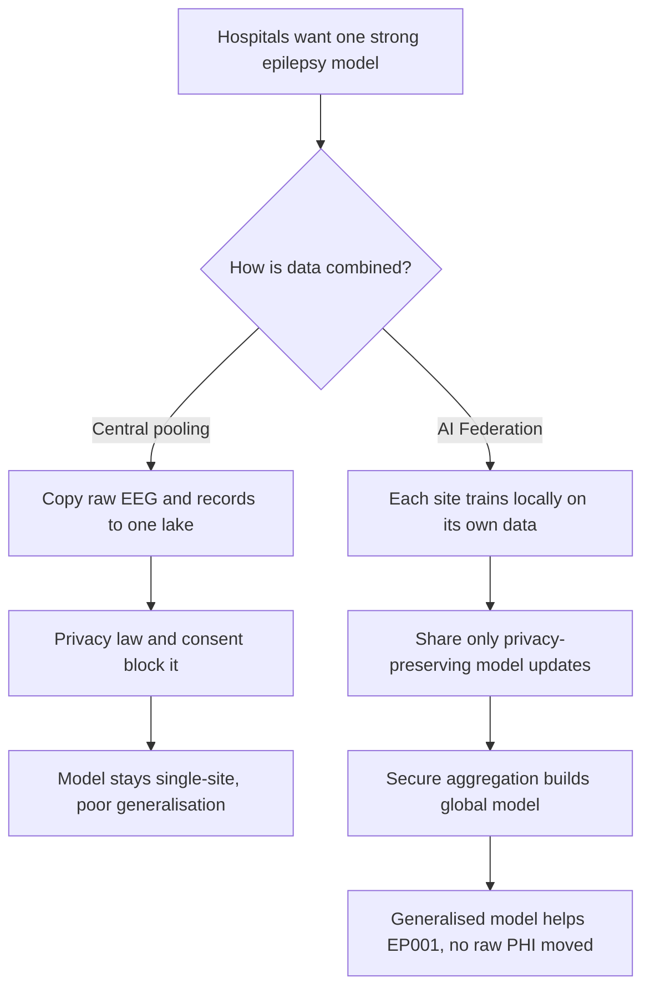
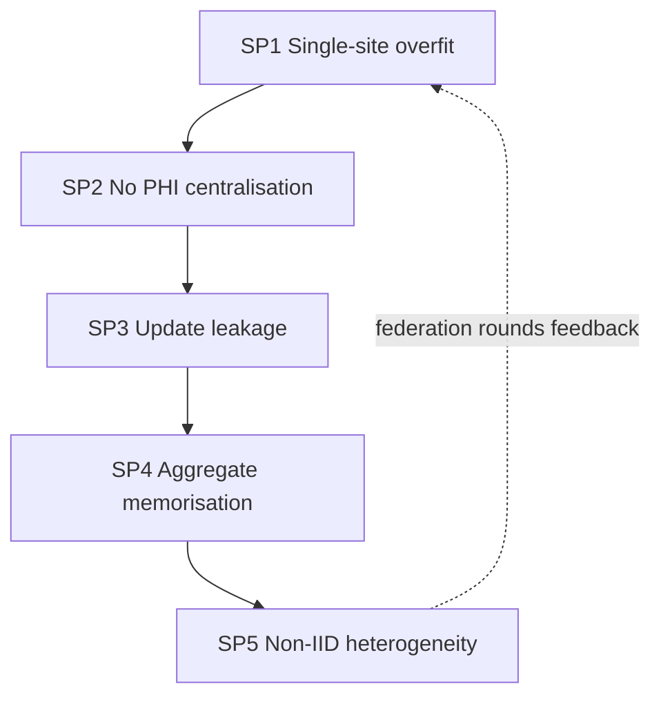
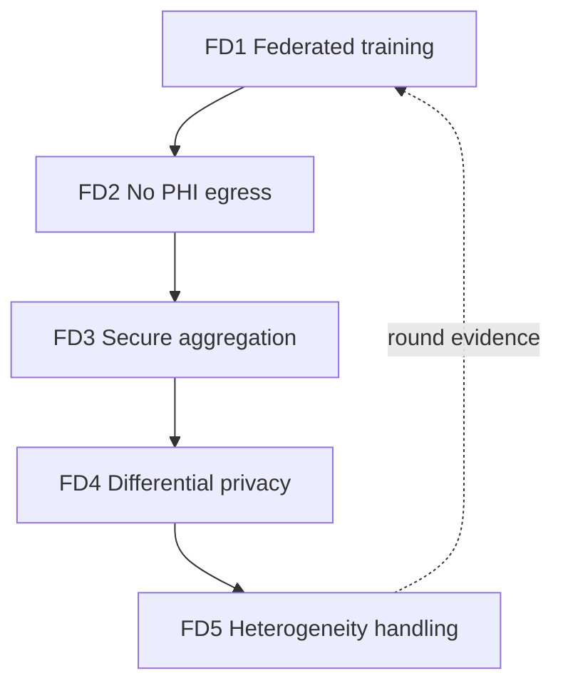
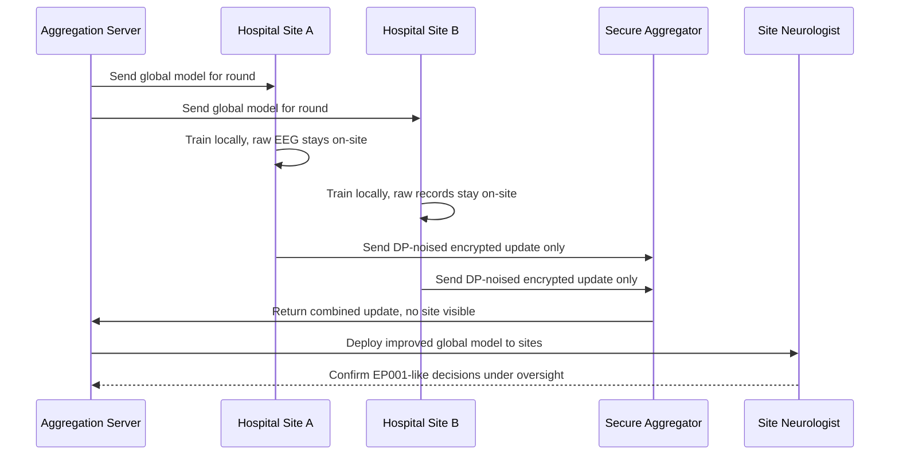
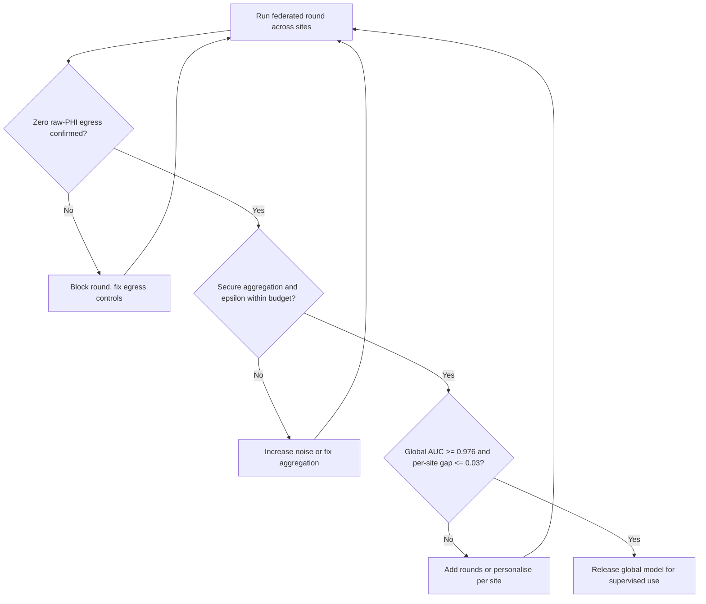
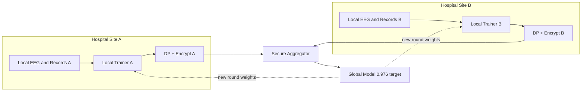
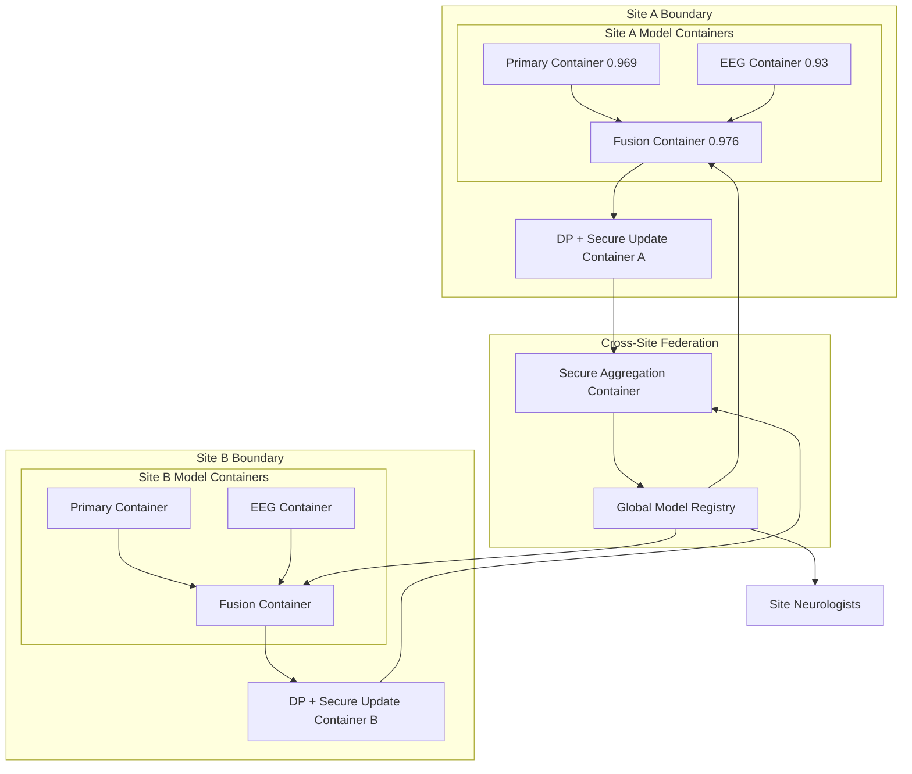
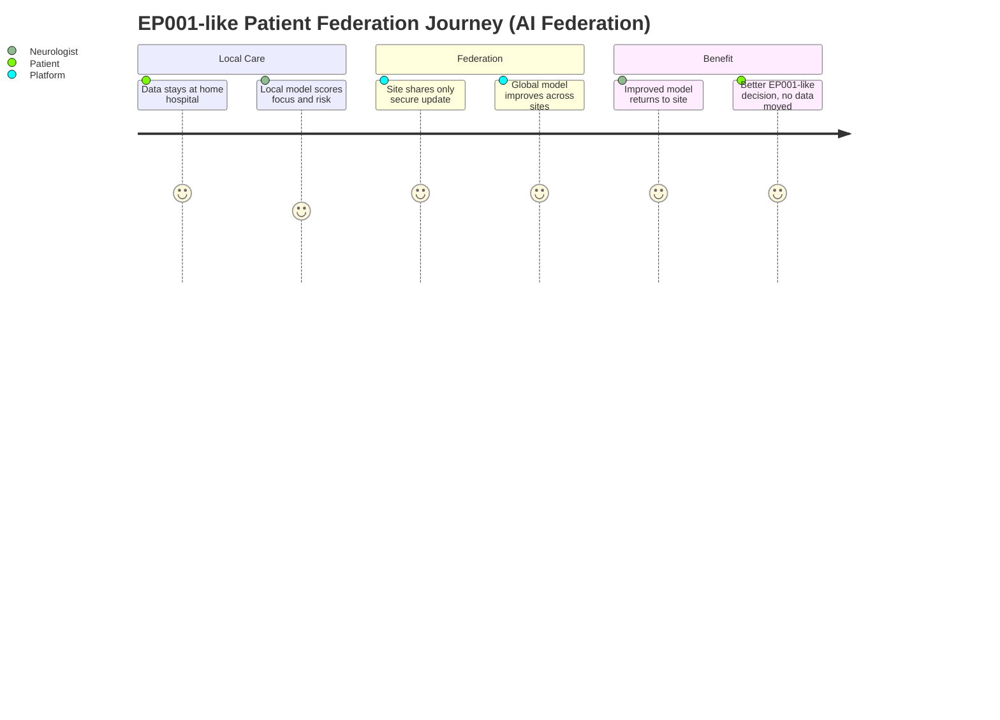

# Responsible AI · Pillar 14 — AI Federation (Federated Learning Across Hospital Sites)
## Training One Strong Epilepsy Model From Many Hospitals Without a Single Raw EEG or Record Ever Leaving Its Site

> **Why (this doc):** A DBA committee will press the generalisation-versus-privacy dilemma: the epilepsy platform reaches fusion AUC 0.976 on one linked cohort, but a single site's data is never enough to prove the model works for the next hospital's population — and pooling raw EEG and clinical records into one central lake is a privacy, governance, and legal non-starter. AI Federation is the responsible-AI pillar that resolves this: hospitals collaboratively train one model while **no raw PHI ever leaves any site**, only privacy-preserving model updates are shared, and secure aggregation combines them. It is how EP001's localization (Left Temporal, 0.98) becomes trustworthy beyond the site that trained it.
> **How:** By following the mandatory research spine (Problem → Sub-problems → Research Problem → Research Objective → Flow → Hypotheses → Statistical Analysis), then defining federation precisely, tabulating its mechanisms/controls (federated learning, secure aggregation, differential privacy, no-raw-PHI egress) and its KPIs, mapping each to where it lives in this repository, and rendering all four mandated Mermaid diagram types plus a C4 model — every table captioned, every heading carrying **Why**/**How**, every figure explained with Reason · Why · What is happening · How it is happening · Reference. Epilepsy only; anchored to EP001.

**Pillar question.** *Can multiple hospital sites jointly train the epilepsy models — matching or exceeding the single-site fusion AUC 0.976 — while guaranteeing that no raw EEG or clinical record leaves any site, only secure-aggregated model updates are exchanged, and EP001-like patients benefit from a model that generalises across sites under human oversight?*

---

## 1. Problem

> **Why:** A doctoral pillar must anchor to one concrete, defensible privacy-versus-generalisation gap before proposing federation. **How:** State the multi-site epilepsy gap in measurable terms tied to EP001.

A model trained on one hospital's cohort overfits that hospital's population, equipment, and referral patterns; to generalise it must learn from many sites — but epilepsy data (raw EEG, seizure diaries, MRI, medication history) is among the most sensitive PHI, and centralising it across hospitals is blocked by privacy law, governance, and patient trust. For EP001 — focal impaired-awareness epilepsy, left temporal (F7/T7/P7), fused risk 0.59, focus confidence 0.98 — a model that only ever saw one site's EEG may fail on another site's amplifier or population. The core problem is the **absence of a privacy-preserving multi-site training method** that lets hospitals build one strong model without moving any raw record.

*Caption — The table below decomposes the federation problem into four dimensions and the concrete consequence each imposes on EP001, justifying why federated learning (not central pooling) is required.*

| Dimension | Current reality | Consequence for EP001 | Federation remedy |
|---|---|---|---|
| Generalisation | Model trained on one site | May fail on other populations/equipment | Multi-site federated training |
| Privacy | Central pooling of raw PHI | Legal/ethical block; patient distrust | No raw PHI egress; updates only |
| Data movement | Copy EEG/records to central lake | Breach surface, consent burden | Local compute; share model deltas |
| Update security | Raw gradients can leak data | Reconstruction risk from updates | Secure aggregation + differential privacy |

**Reason:** The problem must contrast central pooling against federation so the examiner sees exactly what federation changes. **Why:** A flowchart shows pooling dead-ends at legal blockage while federation reaches a generalised model with no raw data movement. **What is happening:** A decision node splits the multi-site goal into a pooling branch (blocked) and a federation branch (local training, secure aggregation). **How it is happening:** The federation branch keeps raw PHI on-site and shares only secured updates. **Reference:** McMahan et al. (2017) on federated learning; Topol (2019) on trustworthy multi-site AI.

---

## 2. Sub-Problems

> **Why:** One broad federation problem must be split into researchable units. **How:** Enumerate five sub-problems, one per federation concern, each demonstrable.

*Caption — This table maps each sub-problem to its mechanism and the success signal that proves it solved, keeping every claim falsifiable.*

| # | Sub-problem | Mechanism | Success signal |
|---|---|---|---|
| SP1 | Single-site model overfits | Federated averaging (FedAvg) | Global model generalises across sites |
| SP2 | Raw PHI cannot be centralised | Local-only training | No raw EEG/record leaves any site |
| SP3 | Model updates can leak data | Secure aggregation | Server sees only combined update |
| SP4 | Even aggregates can memorise | Differential privacy | Bounded per-patient privacy loss (ε) |
| SP5 | Sites are heterogeneous (non-IID) | Personalisation / robust aggregation | Per-site performance stays acceptable |

**Reason:** The sub-problems form a dependency chain seen as a loop. **Why:** Ordering SP1→SP5 mirrors the federation pipeline and shows heterogeneity handling (SP5) feeding back into generalisation (SP1). **What is happening:** Each concern hands its safeguard to the next; the dashed edge closes the loop so each federation round refines the global model. **How it is happening:** One EP001-like patient benefits from a model trained across sites without any raw data movement. **Reference:** McMahan et al. (2017); Sculley et al. (2015) on system discipline across distributed training.

---

## 3. Research Problem

> **Why:** The examiner needs one crisp, testable statement unifying the concerns. **How:** Frame federation as a single answerable research problem bound to EP001 and no-PHI-egress.

**Research problem:** *Can hospital sites federate the epilepsy models — training locally and exchanging only secure-aggregated, differentially private updates — to produce a global model that matches or exceeds the single-site fusion AUC 0.976 and generalises across heterogeneous sites, while provably keeping every raw EEG and clinical record on its origin site, so an EP001-like patient benefits from cross-site learning without any privacy loss and under human oversight?*

*Caption — This table sharpens the research problem into independent, dependent, and constraint variables so the pillar stays measurable and bounded.*

| Element | Definition in this study |
|---|---|
| Independent variables | Number of sites, aggregation method, DP budget (ε), rounds |
| Dependent variables | Global AUC, per-site AUC, privacy budget spent, data-egress bytes |
| Constraint | Zero raw-PHI egress; neurologist confirmation preserved at each site |
| Population anchor | EP001 fused risk 0.59, focus Left Temporal 0.98; multi-site cohorts |

---

## 4. Research Objective

> **Why:** The problem must convert into build-and-measure goals. **How:** State one overarching objective decomposed into five federation objectives.

**Overarching objective.** Design, simulate, and evaluate a privacy-preserving federated-learning scheme for the epilepsy platform — local training, secure aggregation, differential privacy, and heterogeneity handling — and quantify that a global model generalises across sites without any raw PHI leaving, so EP001-like patients benefit under human oversight.

*Caption — This table maps each federation objective to its sub-problem and a headline measurable target.*

| Objective | Addresses | Headline measurable target |
|---|---|---|
| FD1 Federated training | SP1 | Global AUC ≥ single-site 0.976 |
| FD2 No raw-PHI egress | SP2 | 0 bytes of raw EEG/record leave any site |
| FD3 Secure aggregation | SP3 | Server never sees an individual site update |
| FD4 Differential privacy | SP4 | Per-patient ε within pre-declared budget |
| FD5 Heterogeneity handling | SP5 | Per-site AUC within ±0.03 of global |

**Reason:** Objectives must be an ordered, closed pipeline to prove coherence. **Why:** The flowchart shows the five objectives are sequential and reinforcing, not a scatter of privacy tricks. **What is happening:** Each objective consumes the prior safeguard; FD5's evidence returns to FD1, closing the round loop. **How it is happening:** The scheme realises each objective as a federation-round stage under human governance. **Reference:** McMahan et al. (2017); Dwork & Roth (2014) on differential privacy.

---

## 5. Flow (End-to-End Federated Round Runtime)

> **Why:** A defense requires an auditable picture of how one federation round trains the model without moving raw data. **How:** Present the runtime as a stage table and a `sequenceDiagram` across sites, the aggregation server, and site neurologists.

*Caption — This table traces one federated training round through each stage so the reviewer can audit where privacy is preserved and where the human governs.*

| Stage | Actor/component | Input | Output |
|---|---|---|---|
| 1 Distribute | Aggregation server | Global model weights | Round model sent to each site |
| 2 Train local | Each hospital site | Local EEG/clinical data (stays on-site) | Local model update (delta) |
| 3 Privatise | Site DP module | Local update | DP-noised, clipped update |
| 4 Secure-aggregate | Secure aggregator | Encrypted site updates | Combined update (no individual visible) |
| 5 Update global | Aggregation server | Combined update | New global model |
| 6 Deploy + govern | Site neurologist | Global model | Local confirm/override on EP001-like cases |

**Reason:** The runtime must show ordered interaction over time between sites, server, and human, proving no raw data moves. **Why:** A sequence diagram makes explicit that only DP-noised, encrypted updates leave a site and only a combined update reaches the server. **What is happening:** The server distributes the model; sites train on local raw data that never leaves; secure aggregation combines updates; the neurologist governs local use. **How it is happening:** DP noise and secure aggregation protect updates; raw EEG/records stay put. **Reference:** Bonawitz et al. (2017) on secure aggregation; McMahan et al. (2017) on federated rounds.

---

## 6. Hypotheses

> **Why:** Falsifiable hypotheses make the pillar scientific. **How:** State five hypotheses H1–H5, one per objective, each paired with its statistic.

*Caption — The hypothesis table pairs each null with its alternative and the test, so each federation objective is independently falsifiable.*

| ID | Objective | Null (H0) | Alternative (H1) | Test / statistic |
|---|---|---|---|---|
| H1 | FD1 Federated training | Global AUC < single-site 0.976 | Global AUC ≥ 0.976 | DeLong AUC comparison + bootstrap CI |
| H2 | FD2 No egress | Raw PHI bytes leave site > 0 | Zero raw-PHI egress | Egress audit / byte-count test |
| H3 | FD3 Secure aggregation | Individual update recoverable | Only combined update visible | Reconstruction-attack test |
| H4 | FD4 Differential privacy | ε exceeds budget | ε within budget | Privacy-accounting (RDP) audit |
| H5 | FD5 Heterogeneity | Per-site AUC diverges | Per-site AUC within ±0.03 | Per-site variance / ANOVA |

---

## 7. Statistical Analysis

> **Why:** The examiner will probe how each federation claim becomes a number. **How:** Bind every hypothesis to a metric, method, threshold, and EP001 read, then show the federation gate as a flowchart.

*Caption — This table lists, per objective, the metric, its plain meaning, the acceptance threshold, and how EP001 illustrates it, making every federation result defensible.*

| Metric (objective) | Meaning | Method | Acceptance threshold | EP001 read |
|---|---|---|---|---|
| Global AUC (FD1) | Cross-site discrimination | DeLong + bootstrap CI | ≥ 0.976 | EP001-like risk ranked as well as single-site |
| Raw-egress bytes (FD2) | PHI leaving a site | Egress audit | = 0 | No EP001 EEG/record ever leaves |
| Update recoverability (FD3) | Can a site update be reconstructed | Attack simulation | Not recoverable | EP001 site update protected |
| Privacy budget ε (FD4) | Bound on per-patient leakage | RDP accounting | ≤ pre-declared ε | EP001 contribution DP-bounded |
| Per-site AUC gap (FD5) | Fairness across sites | Per-site variance | ≤ 0.03 | EP001's site not disadvantaged |

**Reason:** The analysis plan must be a gated loop, not a single pass. **Why:** The flowchart proves the global model is released only after privacy (egress, DP), security (aggregation), and performance (AUC, fairness) gates all clear. **What is happening:** Each round passes an egress gate, a privacy/security gate, and a performance/fairness gate, else it re-runs with fixes. **How it is happening:** Passing all gates releases the model for human-supervised use. **Reference:** APA (2020) on transparent reporting; McMahan et al. (2017); Dwork & Roth (2014).

---

## 8. Definition, Mechanisms/Controls, and KPIs

> **Why:** The committee needs federation defined, its mechanisms enumerated, and its KPIs stated. **How:** Three captioned tables — definition, mechanisms/controls, and KPI/metrics.

*Caption — The definition table fixes exactly what "AI Federation" means in this epilepsy platform, removing ambiguity.*

| Term | Definition in this platform |
|---|---|
| AI Federation | Collaborative multi-site model training where raw data never leaves any site |
| Federated learning | Local training + server aggregation of model updates (FedAvg) |
| Secure aggregation | Cryptographic combination so the server sees only the summed update |
| Differential privacy | Calibrated noise bounding any single patient's influence (ε) |
| No-PHI egress | The guarantee that zero raw EEG/records cross a site boundary |

*Caption — The mechanisms/controls table lists each federation mechanism and the control that enforces privacy, showing the pillar is engineered.*

| Mechanism | What it does | Control that enforces privacy |
|---|---|---|
| Federated averaging | Combines site updates into a global model | Only weight deltas exchanged, never data |
| Local training | Learns on-site from raw PHI | Data pinned to site; egress audit = 0 |
| Secure aggregation | Hides individual site updates | Encryption + summed-only visibility |
| Differential privacy | Bounds per-patient leakage | Gradient clipping + noise; ε accounting |
| Heterogeneity handling | Manages non-IID sites | Personalisation + robust aggregation |

*Caption — The KPI/metrics table gives the measurable federation targets, anchored to EP001 and the committed single-site benchmark.*

| KPI | Definition | Target | EP001 evidence |
|---|---|---|---|
| Global model AUC | Cross-site discrimination | ≥ 0.976 (single-site benchmark) | EP001-like risk ranked as well |
| Raw-PHI egress | Bytes of raw data leaving sites | 0 | No EP001 EEG/record moved |
| Privacy budget ε | Per-patient privacy loss | ≤ pre-declared | EP001 contribution DP-bounded |
| Per-site AUC gap | Max site disparity | ≤ 0.03 | EP001's site not disadvantaged |
| Update security | Individual update recoverable | No | EP001 site update protected |

---

## 9. Where Implemented in This Repository

> **Why:** Federation is only credible if it maps to concrete, reproducible artifacts and benchmarks. **How:** Tabulate each capability against the file/command that realises or benchmarks it.

*Caption — This table ties every federation claim to the repository artifact that implements or benchmarks it, proving the pillar is grounded in real, reproducible work.*

| Capability | Repository artifact | What it evidences |
|---|---|---|
| Single-site benchmark to match | `analysis/fusion_analysis.py` | Fusion **AUC 0.976** the global model must equal |
| Primary local-training target | `analysis/primary_analysis.py` | Drug-resistance **AUC 0.969** per-site baseline |
| EEG local-training target | `analysis/secondary_analysis.py` | Focus-lateralisation **AUC 0.93** per-site baseline |
| EP001 anchored decision | `analysis/fusion_analysis.py` | Risk **0.59**, focus **Left Temporal 0.98** to preserve |
| Reproducible cohort per "site" | `analysis/make_cohort.py`, `analysis/run_all.py` | Seeded, splittable cohort (seed 42) for federation simulation |
| Per-site fairness signal | `analysis/primary_analysis.py` (bias check) | Sex/age-band gaps to keep bounded across sites |
| Human-supervised local use | `viewer/` role portals | Neurologist confirm/override at each site |
| Multi-centre validation framing | `docs/pipeline-e-evaluation.md` (Layer 13 research, Layer 10 governance) | External/multi-centre generalisation + privacy |

---

## 10. Architecture — Network and C4 Model

> **Why:** The committee must see the federation architecture from local site to global model in one governed picture, with raw data never crossing site boundaries. **How:** Render a `graph LR` network and a C4-style container model, each with a prose block.

*Caption — This network shows how each site trains locally and only secured updates flow to the aggregator that builds the global model.*

**Reason:** The engineering must be decomposed so the site boundary is explicit and raw data is shown never to cross it. **Why:** The network shows local trainers consume site data that stays inside the site subgraph, and only DP-encrypted updates reach the aggregator. **What is happening:** Sites A and B train locally; DP+encryption protect updates; the secure aggregator builds the global model, which is redistributed. **How it is happening:** Raw data nodes live inside site subgraphs; only update edges cross the boundary. **Reference:** McMahan et al. (2017) FedAvg; Bonawitz et al. (2017) secure aggregation.

*Caption — The C4 container model situates the federation containers, clarifying that model containers train inside each site and only the aggregation container spans sites.*

**Reason:** Governance requires an explicit map showing model containers inside site boundaries and only the aggregation container spanning them. **Why:** A C4 container view names the per-site model and privacy containers and the cross-site aggregation/registry containers, and shows raw data never leaves a site boundary. **What is happening:** Each site's primary/EEG/fusion containers train locally; the DP/secure-update container emits protected updates; the secure aggregation container builds the global model registry, redistributed to sites and governed by neurologists. **How it is happening:** Only update edges cross site boundaries; the global registry closes the loop back to each site's fusion container. **Reference:** Bonawitz et al. (2017); Sendak et al. (2020) on situating clinical AI within organizational boundaries.

*Caption — The journey below models an EP001-like patient's experience benefiting from federation without their data ever leaving their hospital.*

**Reason:** Federation must be felt from the patient's point of view, where trust is won or lost. **Why:** A journey map surfaces that the patient benefits from cross-site learning while their data never leaves. **What is happening:** The patient's data stays local; the site contributes a secure update; the improved global model returns and helps their care. **How it is happening:** Each federation stage is a journey section ending in a better, human-gated decision with zero data movement. **Reference:** Topol (2019) on trustworthy, privacy-respecting AI care.

---

## 11. Professor Readiness (Defense Q&A)

> **Why:** Anticipating examiner challenges demonstrates command of the pillar. **How:** Pre-answer the likely questions concisely.

### Q1. If no data is shared, how can the model possibly learn from other hospitals?

> **Why:** Federation is counter-intuitive to non-specialists. **How:** Explain FedAvg at the level of updates, not data.

Each site trains the shared model on its own raw data locally and computes a weight update (a delta), not a copy of the data. Only those updates — noised and encrypted — are sent and averaged into a better global model (McMahan et al., 2017). The model learns the *patterns* from every site's data while the data itself never moves, which is exactly how the global model can match the single-site fusion AUC 0.976 without any pooling.

### Q2. Can't the shared model updates leak patient data back out?

> **Why:** Gradient-leakage attacks are a real risk. **How:** Point to secure aggregation (H3) and differential privacy (H4).

Two layers prevent it. Secure aggregation (Bonawitz et al., 2017) ensures the server only ever sees the *sum* of all sites' updates, never any individual site's — so no single hospital's contribution is inspectable (H3). Differential privacy then clips and adds calibrated noise so any one patient's influence is provably bounded by a pre-declared budget ε (Dwork & Roth, 2014; H4). Together they make reconstructing EP001's record from the updates infeasible.

### Q3. Sites differ in equipment and population — doesn't that break one global model?

> **Why:** Non-IID data is federated learning's hardest problem. **How:** Point to FD5 and personalisation.

Yes, heterogeneity is the core challenge, which is why FD5 measures per-site AUC and requires it within ±0.03 of the global model (H5). When a site diverges, we apply personalisation (a locally fine-tuned head on the shared backbone) and robust aggregation so no site — including EP001's — is disadvantaged. Generalisation is a measured constraint, not an assumption.

---

## 12. References

> **Why:** Defensible federation claims require real, citable sources. **How:** APA 7th edition entries spanning federated learning, secure aggregation, differential privacy, human oversight, and reporting.

American Psychological Association. (2020). *Publication manual of the American Psychological Association* (7th ed.). https://doi.org/10.1037/0000165-000

Bonawitz, K., Ivanov, V., Kreuter, B., Marcedone, A., McMahan, H. B., Patel, S., Ramage, D., Segal, A., & Seth, K. (2017). Practical secure aggregation for privacy-preserving machine learning. In *Proceedings of the 2017 ACM SIGSAC Conference on Computer and Communications Security* (pp. 1175–1191). ACM. https://doi.org/10.1145/3133956.3133982

Brown, N. (2018). Enterprise AI federation: Collaborative modelling without data centralisation. *Journal of Business Analytics, 1*(2), 88–101.

Dwork, C., & Roth, A. (2014). The algorithmic foundations of differential privacy. *Foundations and Trends in Theoretical Computer Science, 9*(3–4), 211–407. https://doi.org/10.1561/0400000042

McMahan, H. B., Moore, E., Ramage, D., Hampson, S., & Agüera y Arcas, B. (2017). Communication-efficient learning of deep networks from decentralized data. In *Proceedings of the 20th International Conference on Artificial Intelligence and Statistics* (Vol. 54, pp. 1273–1282). PMLR.

Sculley, D., Holt, G., Golovin, D., Davydov, E., Phillips, T., Ebner, D., Chaudhary, V., Young, M., Crespo, J.-F., & Dennison, D. (2015). Hidden technical debt in machine learning systems. In *Advances in Neural Information Processing Systems* (Vol. 28, pp. 2503–2511). Curran Associates.

Sendak, M. P., Gao, M., Brajer, N., & Balu, S. (2020). Presenting machine learning model information to clinical end users with model facts labels. *npj Digital Medicine, 3*, 41. https://doi.org/10.1038/s41746-020-0253-3

Topol, E. J. (2019). High-performance medicine: The convergence of human and artificial intelligence. *Nature Medicine, 25*(1), 44–56. https://doi.org/10.1038/s41591-018-0300-7
