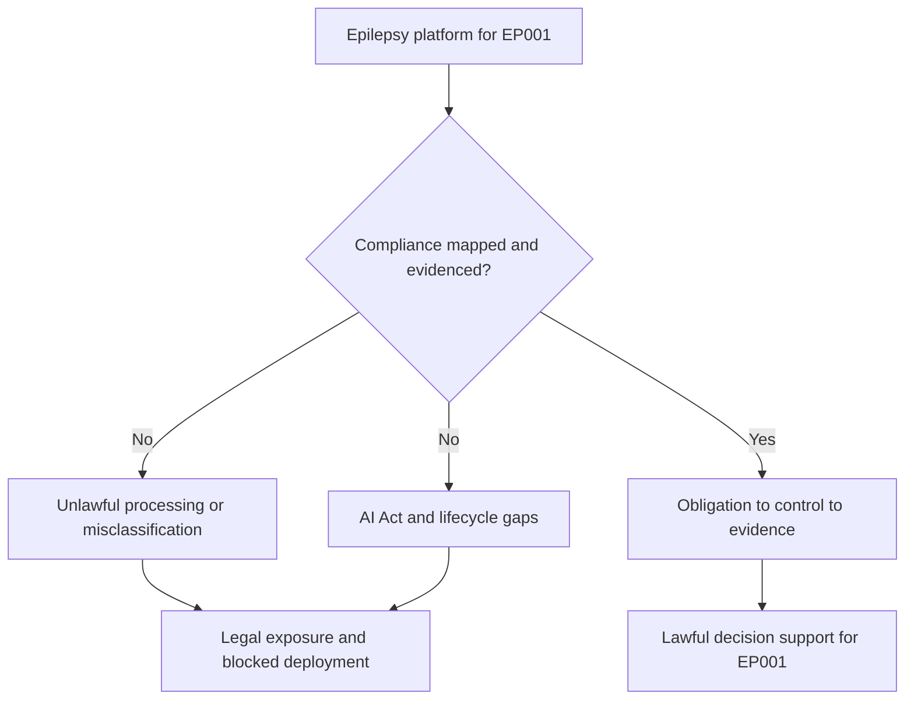
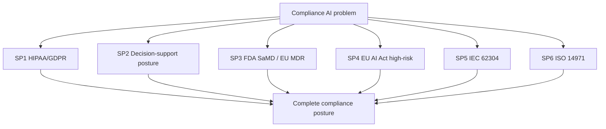
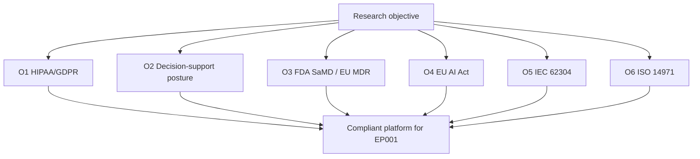
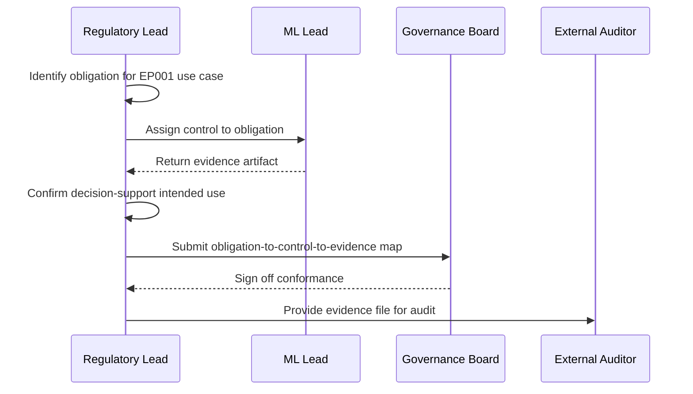
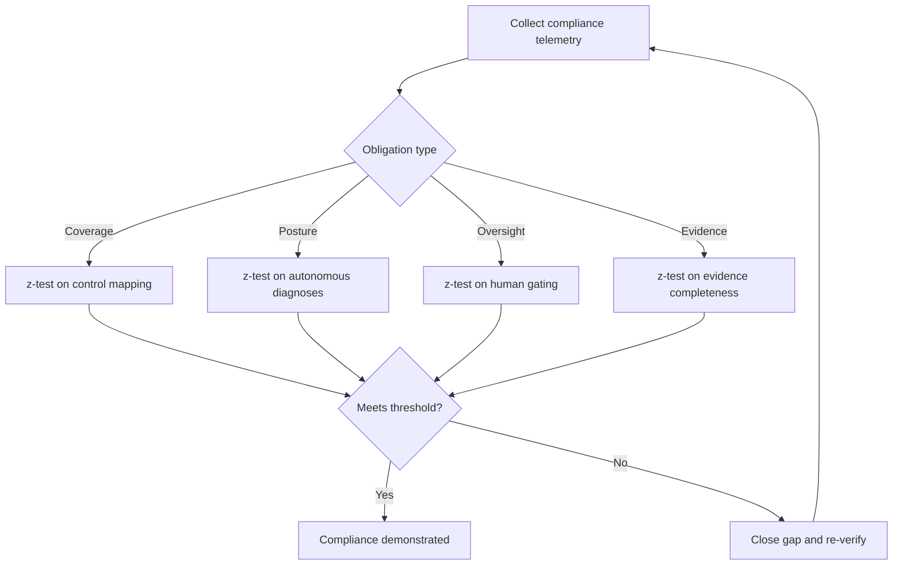
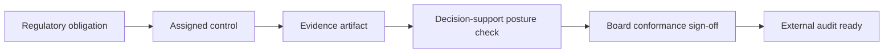
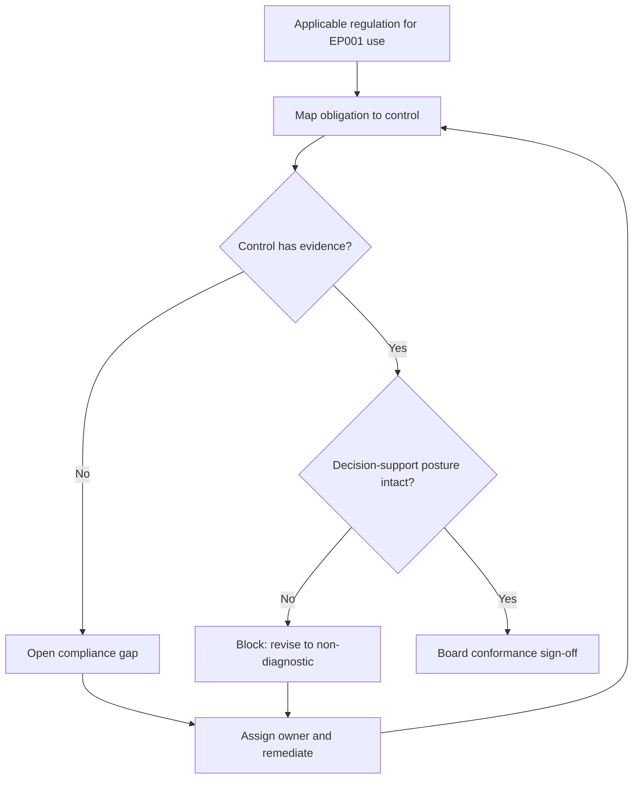
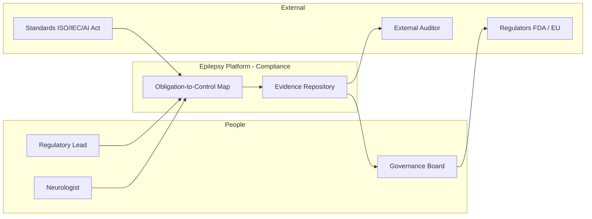
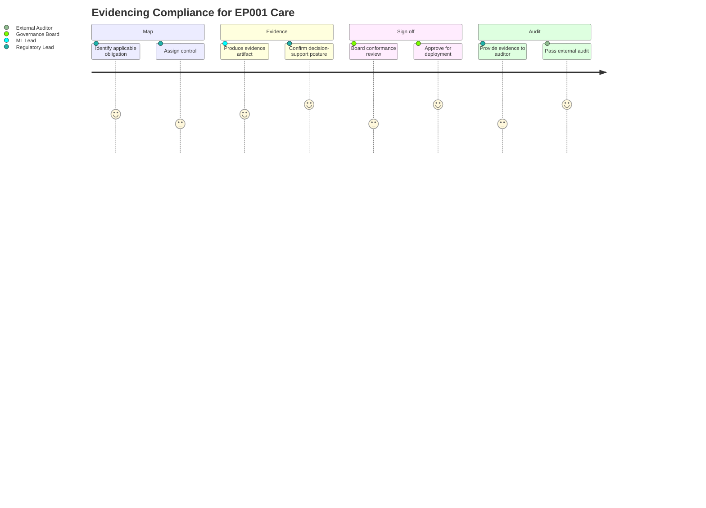

# Responsible AI Pillar 15 - Compliance AI (Epilepsy, EP001)

> **Why (this doc):** An epilepsy platform that localizes the focus and stratifies risk for a patient like EP001 operates inside a dense web of law and standards - HIPAA and GDPR for data, FDA Software-as-a-Medical-Device (SaMD) and EU MDR for medical software, the EU AI Act's high-risk regime for clinical AI, and the IEC 62304 / ISO 14971 lifecycle-and-risk standards. Compliance AI is the discipline that maps each obligation to a concrete control and a piece of evidence, and that positions the platform unambiguously as **clinical decision support, not autonomous diagnosis**. Without it, the platform is legally indefensible.
> **How:** By following the mandatory research spine (Problem -> Sub-problems -> Research Problem -> Research Objective -> Flow -> Hypotheses -> Statistical Analysis), then defining Compliance AI, its regulation-to-control mechanisms, a compliance mapping/evidence register, a repo-implementation crosswalk, all four Mermaid diagram types plus a C4 model, a defense Q&A, and APA-7 references - every table captioned, every heading carrying a **Why**/**How**, anchored to EP001 (left temporal, F7/T7/P7, 92%). This pillar extends the regulatory framing in `docs/pipeline-a/phase-16-governance-compliance.md` S13.1 rather than duplicating it.

**Governing question.** *Can the epilepsy platform demonstrate compliance with HIPAA/GDPR, FDA SaMD / EU MDR, the EU AI Act high-risk regime, IEC 62304, and ISO 14971 - mapping each obligation to a control and evidence - while remaining positioned as clinical decision support that never diagnoses EP001 autonomously?*

---

## 1. Problem

> **Why:** Compliance must anchor to a concrete legal exposure before controls are proposed. **How:** State the gap between a working model and a lawfully deployable clinical tool for EP001.

A localizer at 92% confidence on EP001's left-temporal focus can be technically excellent and still unlawful to deploy: processing PHI without a HIPAA/GDPR lawful basis; making autonomous diagnostic claims that reclassify it as a higher-risk regulated device; failing the EU AI Act's high-risk obligations (risk management, data governance, human oversight, transparency, logging); or lacking the IEC 62304 software-lifecycle and ISO 14971 risk-management records regulators expect. The problem is not accuracy - it is the **absence of a compliance map**: obligations that are not tied to controls and evidence, and an intended-use posture that is not clearly decision support.

*Caption - The table below decomposes the abstract compliance gap into concrete regulatory exposures and the control that answers each, so every later section maps to a named obligation.*

| Regulatory exposure | Manifestation for EP001 | Compliance answer (Section) |
|---|---|---|
| Unlawful PHI processing | EEG/meds processed without lawful basis | HIPAA/GDPR controls (S8) |
| Device misclassification | Autonomous "diagnosis" claim | Decision-support positioning (S8) |
| AI Act high-risk gaps | No human oversight / logging evidence | AI Act control mapping (S9) |
| Lifecycle non-conformance | No IEC 62304 software records | Lifecycle evidence (S9) |
| Risk-management gap | No ISO 14971 risk file | Risk-file evidence (S9) |

**Reason:** The problem must fork between an unmapped and a mapped compliance posture. **Why:** A single flowchart contrasts legal exposure against an obligation-to-control-to-evidence map, making the value of Compliance AI immediate. **What is happening:** A decision node splits the platform into an unmapped branch (exposure, blocked deployment) and a mapped branch ending in lawful decision support for EP001. **How it is happening:** The mapped branch ties each obligation to a control and evidence before deployment. **Reference:** European Parliament and Council (2024) EU AI Act; FDA (2021) SaMD action plan.

---

## 2. Sub-Problems

> **Why:** One compliance problem must split into individually ownable obligation units. **How:** Enumerate the discrete compliance questions the platform must answer, each with an owner.

*Caption - This table lists each compliance sub-problem with its owning role, ensuring no obligation is orphaned.*

| # | Sub-problem | Primary owner |
|---|---|---|
| SP1 | How is PHI processing lawful under HIPAA/GDPR? | Regulatory Lead + Data Steward |
| SP2 | How is the platform positioned as decision support, not a diagnostic device? | Regulatory Lead |
| SP3 | How are FDA SaMD / EU MDR expectations met? | Regulatory Lead |
| SP4 | How are EU AI Act high-risk obligations satisfied? | Regulatory Lead + AI Ethics Lead |
| SP5 | How is IEC 62304 software lifecycle evidenced? | ML Lead |
| SP6 | How is ISO 14971 risk management evidenced? | Risk Lead |

**Reason:** The sub-problems must converge on one compliance posture. **Why:** The flowchart shows six obligations rolling up into a single compliance posture, proving coverage. **What is happening:** Each sub-problem is a node feeding the complete compliance posture. **How it is happening:** Each has a named owner (table) and a downstream control section. **Reference:** European Parliament and Council (2024) AI Act high-risk requirements.

---

## 3. Research Problem

> **Why:** The examiner needs one testable statement unifying the sub-problems. **How:** Frame regulatory compliance as a single answerable research problem bound to EP001.

**Research problem:** *How can the epilepsy platform demonstrate, with mapped controls and traceable evidence, compliance with HIPAA/GDPR, FDA SaMD / EU MDR, the EU AI Act high-risk regime, IEC 62304, and ISO 14971 - while maintaining an intended-use posture as clinical decision support that never issues an autonomous diagnosis for a patient such as EP001?*

*Caption - This table sharpens the research problem into independent, dependent, and constraint variables so compliance stays measurable and bounded.*

| Element | Definition in this study |
|---|---|
| Independent variables | Presence of lawful basis, control mapping, evidence artifact, human-oversight design per obligation |
| Dependent variables | Obligation coverage, evidence completeness, autonomous-diagnosis count, oversight rate |
| Constraint | Intended use = decision support; 0 autonomous diagnoses |
| Population anchor | EP001 focal impaired-awareness epilepsy, left temporal, F7/T7/P7, 92% |

---

## 4. Research Objective

> **Why:** The problem must convert into build-and-measure goals. **How:** State one overarching objective decomposed into compliance-specific objectives, each yielding an auditable artifact.

**Overarching objective.** Design and evaluate a compliance framework for the epilepsy platform that maps every applicable obligation (HIPAA/GDPR, FDA SaMD / EU MDR, EU AI Act high-risk, IEC 62304, ISO 14971) to a control and evidence, and that provably maintains a decision-support (non-diagnostic) posture for EP001.

*Caption - Each objective yields a concrete, auditable artifact, making compliance verifiable rather than aspirational.*

| # | Objective | Deliverable artifact | Success metric |
|---|---|---|---|
| O1 | Establish lawful PHI basis | HIPAA/GDPR basis + DPIA | 100% processing consent/lawful-basis backed |
| O2 | Maintain decision-support posture | Intended-use statement | 0 autonomous diagnoses issued |
| O3 | Meet FDA SaMD / EU MDR expectations | SaMD/MDR conformance file | Classification + controls documented |
| O4 | Satisfy EU AI Act high-risk duties | AI Act obligation-to-control map | Every high-risk duty has a control |
| O5 | Evidence IEC 62304 lifecycle | Software lifecycle records | Lifecycle processes documented |
| O6 | Evidence ISO 14971 risk management | Risk management file | Risk file complete + current |

**Reason:** Objectives must be an ordered, closed posture to prove coherence. **Why:** The flowchart shows the six objectives as facets of one compliant platform rather than a scatter of paperwork. **What is happening:** Each objective feeds the compliant platform node serving EP001. **How it is happening:** Each maps to an artifact and metric in the table. **Reference:** European Parliament and Council (2024) AI Act; IEC (2006) 62304; ISO (2019) 14971.

---

## 5. Flow (End-to-End Compliance Runtime)

> **Why:** A defense requires an auditable picture of how an obligation becomes a control and evidence for EP001. **How:** Present the flow as a stage table and a `sequenceDiagram` across Regulatory Lead, ML Lead, board, and auditor.

*Caption - This table traces one obligation through each compliance stage so the reviewer can audit where conformance is established.*

| Stage | Actor/component | Input | Compliance gate |
|---|---|---|---|
| 1 Identify obligation | Regulatory Lead | Regulation clause | Logged in mapping |
| 2 Assign control | Regulatory + ML Lead | Obligation | Control specified |
| 3 Produce evidence | ML / Risk Lead | Control output | Evidence artifact filed |
| 4 Verify posture | Regulatory Lead | Intended-use statement | Non-diagnostic confirmed |
| 5 Board review | Governance Board | Mapping + evidence | Conformance sign-off |
| 6 Audit | External auditor | Evidence file | Independent verification |

**Reason:** The compliance runtime must show ordered conformance over time. **Why:** A sequence diagram makes explicit that every obligation is tied to a control and evidence, the non-diagnostic posture is confirmed, and the board signs off before external audit. **What is happening:** The Regulatory Lead identifies an obligation; the ML Lead supplies control and evidence; posture is confirmed; the board signs off; an auditor verifies. **How it is happening:** Each message adds a row to the mapping; evidence is the artifact an auditor can inspect. **Reference:** FDA (2021) SaMD action plan; European Parliament and Council (2024) AI Act conformity assessment.

---

## 6. Hypotheses

> **Why:** Falsifiable hypotheses make the compliance programme scientific. **How:** State four hypotheses, each paired with the statistic that tests it.

*Caption - The hypothesis table pairs each null with its alternative and the measured variable, so compliance effectiveness is independently falsifiable.*

| ID | Null (H0) | Alternative (H1) | Measured variable |
|---|---|---|---|
| H1 | Control mapping does not change obligation coverage | Mapping raises coverage to 100% | Fraction of obligations with a control |
| H2 | Intended-use posture does not change diagnosis rate | Posture holds autonomous diagnoses at 0 | Count of autonomous diagnoses |
| H3 | Human-oversight design does not change oversight rate | Design raises oversight to 100% | Fraction of decisions human-gated |
| H4 | Evidence process does not change evidence completeness | Process raises completeness to 100% | Fraction of controls with evidence |

---

## 7. Statistical Analysis

> **Why:** The examiner will probe how each compliance claim becomes a number. **How:** Bind every hypothesis to a test, threshold, and EP001 read, then show the validation loop as a flowchart.

*Caption - This table binds each hypothesis to a statistical method and decision rule, so compliance effectiveness is judged objectively.*

| Hypothesis | Test | Threshold / decision rule | EP001 read |
|---|---|---|---|
| H1 | One-proportion z-test vs 1.0 | Reject H0 if coverage = 100%, p < 0.05 | Every obligation on EP001 use has a control |
| H2 | One-proportion z-test vs 0 | Reject H0 if diagnoses = 0, p < 0.05 | No autonomous diagnosis issued for EP001 |
| H3 | One-proportion z-test vs 1.0 | Reject H0 if oversight = 100%, p < 0.05 | Every EP001 decision neurologist-gated |
| H4 | One-proportion z-test vs 1.0 | Reject H0 if completeness = 100%, p < 0.05 | Every control has an EP001-traceable artifact |

**Reason:** The analysis plan must be a gated loop. **Why:** The flowchart proves compliance is declared only after coverage, posture, oversight, and evidence gates clear. **What is happening:** Telemetry routes by obligation type to the right test; failing any gate returns to gap closure. **How it is happening:** Each test carries an explicit decision rule tied to EP001. **Reference:** APA (2020) on transparent analysis reporting.

---

## 8. Definition, HIPAA/GDPR & Decision-Support Positioning

> **Why:** Compliance AI must be defined, then made operational through data-law controls and the non-diagnostic positioning. **How:** A definition table, a HIPAA/GDPR controls table, and a decision-support vs autonomous-device contrast.

### 8.1 Definition of Compliance AI

*Caption - This table defines Compliance AI and its scope, fixing terminology before mechanisms are specified.*

| Term | Definition in this study | EP001 relevance |
|---|---|---|
| Compliance AI | Discipline mapping obligations to controls and evidence | Makes EP001's care lawful |
| Lawful basis | HIPAA authorization / GDPR Article 6+9 ground | Basis to process EEG/meds |
| SaMD | Software as a Medical Device | Classifies the platform's function |
| High-risk AI | EU AI Act category for clinical AI | Triggers oversight/logging duties |
| Decision support | AI informs, human decides | EP001 recommendation, not diagnosis |
| Evidence artifact | Record proving a control operates | Audit-ready proof for EP001 |

### 8.2 HIPAA/GDPR Controls

*Caption - This table maps each data-law obligation to a control, converting "we comply with privacy law" into an auditable practice.*

| Obligation | Control | Evidence |
|---|---|---|
| Lawful basis (GDPR Art. 6/9) | Consent + treatment basis | Consent record |
| Minimum necessary (HIPAA) | Data minimization | Field-level scope log |
| De-identification | Map to Study ID DBA-EP-001 | De-id pipeline record |
| Data subject rights (GDPR) | Access/erasure workflow | Rights-request log |
| Breach notification | Incident + notification runbook | Incident register |
| Security safeguards (HIPAA) | Encryption + RBAC + audit | Security control records |

### 8.3 Decision Support, Not Autonomous Diagnosis

*Caption - This contrast makes the non-device boundary explicit, the single most important compliance claim for EP001.*

| Attribute | Decision support (this platform) | Autonomous diagnosis (excluded) |
|---|---|---|
| Output | "Left temporal focus, 92% - review" | "Diagnosis: epilepsy confirmed" |
| Authority | Neurologist decides | System decides |
| Human-in-loop | Mandatory | Optional/absent |
| Regulatory weight | Lower-risk decision support | Higher-risk autonomous device |
| For EP001 | Informs neurologist workup | Never auto-diagnoses |

**Reason:** The path from obligation to audit-readiness must be a single legible network. **Why:** The `graph LR` shows control and evidence sitting *before* the posture check and sign-off, proving compliance is systematic, not retrospective. **What is happening:** An obligation gets a control and evidence, passes the decision-support posture check, is signed off by the board, and becomes audit-ready. **How it is happening:** Each node is a mapping row; the posture check enforces the non-diagnostic boundary. **Reference:** HHS (2013) HIPAA; European Parliament and Council (2016) GDPR; FDA (2021) SaMD.

---

## 9. Regulatory Mapping & Compliance Register

> **Why:** Every applicable regulation must map to a control and evidence, and gaps must be tracked. **How:** A regulation-to-control-to-evidence mapping table and a compliance register scored by likelihood x impact.

### 9.1 Regulation -> Control -> Evidence Mapping

*Caption - This mapping ties each major regulation/standard to a concrete control and evidence artifact, the core compliance deliverable of this pillar.*

| Regulation / standard | Key obligation | Control | Evidence artifact |
|---|---|---|---|
| HIPAA (HHS, 2013) | Safeguard PHI, minimum necessary | Encryption, RBAC, minimization | Security control records |
| GDPR (EU, 2016) | Lawful basis, data-subject rights | Consent + rights workflow | Consent + rights log |
| FDA SaMD (FDA, 2021) | Intended-use, change control | Intended-use statement, versioning | SaMD conformance file |
| EU MDR | Clinical evaluation, post-market | Clinical validation, surveillance | Clinical evaluation report |
| EU AI Act high-risk (EU, 2024) | Risk mgmt, data governance, human oversight, transparency, logging | Risk file, lineage, HITL, disclosure, audit log | AI Act conformity file |
| IEC 62304 (IEC, 2006) | Software lifecycle processes | Documented lifecycle + versioning | Software lifecycle records |
| ISO 14971 (ISO, 2019) | Risk management process | Risk file, residual acceptance | Risk management file |

### 9.2 Compliance Register (Likelihood x Impact)

*Caption - This register ranks the top compliance risks by likelihood x impact with owner and mitigation, so effort concentrates where legal exposure is greatest for EP001.*

| ID | Compliance risk | Likelihood | Impact | Mitigation | Owner |
|---|---|---|---|---|---|
| C-R1 | PHI processed without lawful basis | Low | High | Consent + lawful-basis gate | Data Steward |
| C-R2 | Platform perceived as auto-diagnosing | Low | High | Non-diagnostic wording + HITL | Regulatory Lead |
| C-R3 | EU AI Act high-risk duty unmet | Medium | High | Obligation-to-control map + logging | Regulatory Lead |
| C-R4 | IEC 62304 lifecycle record missing | Medium | Medium | Lifecycle documentation + versioning | ML Lead |
| C-R5 | ISO 14971 risk file stale | Medium | Medium | Scheduled risk-file review | Risk Lead |
| C-R6 | GDPR data-subject request unmet | Low | Medium | Rights workflow + SLA | Data Steward |

**Reason:** Regulatory mapping and posture must share one enforced conformance loop. **Why:** The flowchart proves every obligation is mapped to an evidenced control and that the non-diagnostic posture is a hard gate before sign-off. **What is happening:** A regulation is mapped to a control; missing evidence opens a gap; a broken posture blocks and forces revision; only evidenced, non-diagnostic controls reach board sign-off. **How it is happening:** Controls and owners are those in the mapping and register; gaps route to remediation. **Reference:** European Parliament and Council (2024) AI Act; FDA (2021) SaMD; extends `pipeline-a/phase-16` S13.1.

---

## 10. Where Implemented in This Repo

> **Why:** Compliance AI is credible only if it maps to concrete implementation. **How:** Tabulate each compliance mechanism against the repository artifact that realises it.

*Caption - This crosswalk ties each compliance mechanism to where it lives in the repository, proving the pillar is realised, not aspirational.*

| Compliance mechanism | Where implemented in this repo | Anchor |
|---|---|---|
| Decision-support (non-device) framing | `docs/pipeline-a/phase-16-governance-compliance.md` S13.1 | Intended-use statement |
| Encryption / RBAC / audit (HIPAA) | `docs/pipeline-a/phase-16` S12.2 | Security safeguards |
| De-identification to Study ID | Study ID DBA-EP-001 mapping | De-identified EEG |
| Consent capture | Onboarding intake + governance gate | Lawful basis |
| Human-in-the-loop (AI Act oversight) | Fusion / CDSS (`pipeline-c-multimodal.md`) | Mandatory sign-off |
| Explainability/transparency (AI Act) | `docs/pipeline-a/phase-11-explainable-ai.md` | Rationale + logging |
| Reproducible seeds + lifecycle records | Analysis manifests (IEC 62304) | Versioned lineage |
| Risk file (ISO 14971) | `docs/responsible-ai/12-risk-ai.md` + phase-16 S13.3 | Risk register |

---

## 11. C4-Style Model (Compliance Context)

> **Why:** Compliance requires an explicit map of who and what evidences each obligation. **How:** A C4 Level-1 context model naming actors, the compliance system, and external authorities.

*Caption - The C4 context model situates the compliance system among its actors and external authorities, clarifying who owns evidence and conformance.*

**Reason:** Compliance needs a single map of evidence ownership and authority. **Why:** A C4 Level-1 model names every actor and authority that can define, evidence, sign off, or audit an obligation, fixing where conformance authority sits. **What is happening:** The Regulatory Lead and standards feed the mapping; controls produce evidence; the board signs off toward regulators; auditors verify; the Neurologist's oversight is itself a mapped control. **How it is happening:** The obligation map plus evidence repository form the system-in-focus; external authorities and auditors close the conformance loop. **Reference:** Brown (2018) C4 model; European Parliament and Council (2024) AI Act conformity assessment.

---

## 12. Journey (Compliance Lifecycle Experience)

> **Why:** Compliance must be felt from the owning roles' point of view, not only measured. **How:** A journey map across Regulatory Lead, board, and auditor over one obligation's lifecycle.

*Caption - This journey maps the compliance experience from obligation to audit, exposing where confidence and friction arise.*

**Reason:** Compliance must surface human confidence and friction. **Why:** A journey map complements the metrics by showing where mapping and audit feel heavy or reassuring across roles. **What is happening:** An obligation is mapped, evidenced, signed off, and audited, with satisfaction scored per step. **How it is happening:** Each phase is a journey section owned by the responsible role. **Reference:** Topol (2019) on trustworthy clinical AI deployment.

---

## 13. Professor Readiness (Defense Q&A)

> **Why:** Anticipating examiner challenges demonstrates command of Compliance AI. **How:** Pre-answer the likely questions with concise reasoning, tables, or logic.

### Q1. Is this platform a regulated medical device, and how do you keep it lawful for EP001?

> **Why:** Misclassification is the central legal risk. **How:** Intended-use scoping plus mapped controls.

The platform is positioned as clinical **decision support**: it outputs "left temporal focus, 92% - review", never "epilepsy confirmed", and the Neurologist holds full decision authority with mandatory human-in-the-loop. This intended-use posture, non-diagnostic wording, and the obligation-to-control map keep it appropriately classified, with autonomous diagnoses held at 0 (H2).

### Q2. How do you satisfy the EU AI Act's high-risk obligations?

> **Why:** Clinical AI is high-risk under the AI Act. **How:** Each duty maps to a control and evidence.

*Caption - This table shows each AI Act high-risk duty mapped to a control for EP001.*

| AI Act duty | Control for EP001 |
|---|---|
| Risk management | ISO 14971 risk file (Pillar 12) |
| Data governance | Lineage + de-identification to Study ID |
| Human oversight | Mandatory neurologist sign-off |
| Transparency | Explanation + confidence disclosure |
| Logging | Immutable audit trail |

Every high-risk duty has a mapped control with evidence (H1, H4), and human oversight is designed-in at 100% (H3).

### Q3. What legal basis lets you process EP001's EEG and medication data?

> **Why:** Unlawful processing voids the whole deployment. **How:** HIPAA authorization plus GDPR treatment/consent basis with minimization.

Processing rests on a documented lawful basis - HIPAA authorization and GDPR Article 6/9 grounds (consent plus provision of care) - with minimum-necessary data, de-identification to Study ID DBA-EP-001, and a data-subject rights workflow. Every processing action is consent/lawful-basis backed (O1) and evidenced in the register (C-R1).

### Q4. How does this extend the Phase-16 regulatory section?

> **Why:** The committee will check for duplication. **How:** Position this pillar as the mapping-and-standards deepening of Phase 16.

Phase 16 S13.1 establishes the decision-support (non-device) framing. This pillar deepens it into a full regulation-to-control-to-evidence *mapping* across HIPAA/GDPR, FDA SaMD/EU MDR, the EU AI Act high-risk regime, IEC 62304, and ISO 14971, adds a scored compliance register, and cross-links back rather than restating the framing (see S10).

---

## 14. References

> **Why:** Defensible claims require real, citable sources. **How:** APA 7th edition entries spanning data law, medical-device and AI regulation, lifecycle and risk standards.

American Psychological Association. (2020). *Publication manual of the American Psychological Association* (7th ed.). https://doi.org/10.1037/0000165-000

Brown, S. (2018). *The C4 model for visualising software architecture*. C4model.com. https://c4model.com

European Parliament and Council of the European Union. (2016). *Regulation (EU) 2016/679 (General Data Protection Regulation)*. Official Journal of the European Union.

European Parliament and Council of the European Union. (2024). *Regulation (EU) 2024/1689 laying down harmonised rules on artificial intelligence (Artificial Intelligence Act)*. Official Journal of the European Union.

International Electrotechnical Commission. (2006). *IEC 62304: Medical device software - Software life cycle processes*. International Electrotechnical Commission.

International Organization for Standardization. (2019). *ISO 14971:2019 Medical devices - Application of risk management to medical devices*. International Organization for Standardization.

National Institute of Standards and Technology. (2023). *Artificial intelligence risk management framework (AI RMF 1.0)* (NIST AI 100-1). U.S. Department of Commerce. https://doi.org/10.6028/NIST.AI.100-1

Topol, E. J. (2019). High-performance medicine: The convergence of human and artificial intelligence. *Nature Medicine, 25*(1), 44-56. https://doi.org/10.1038/s41591-018-0300-7

U.S. Department of Health and Human Services. (2013). *HIPAA administrative simplification: Regulation text (45 CFR Parts 160, 162, and 164)*. U.S. Department of Health and Human Services.

U.S. Food and Drug Administration. (2021). *Artificial intelligence/machine learning (AI/ML)-based software as a medical device (SaMD) action plan*. U.S. Food and Drug Administration.
