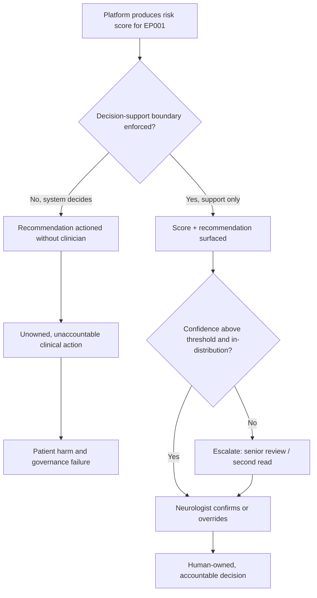
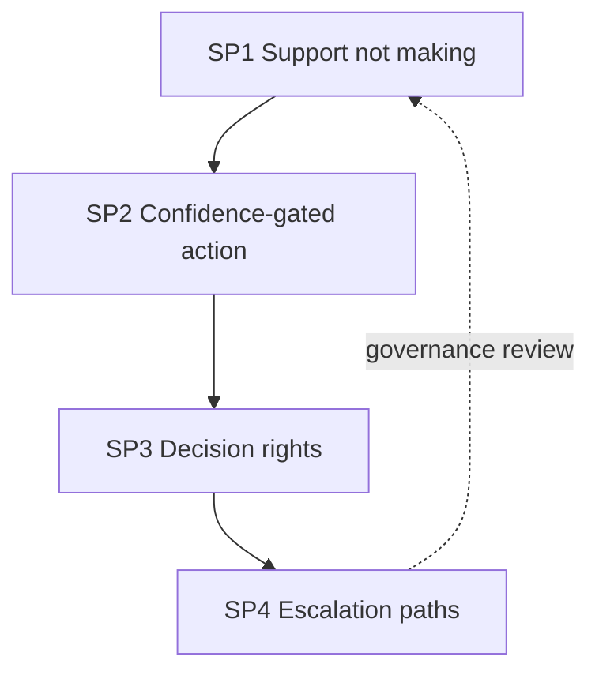
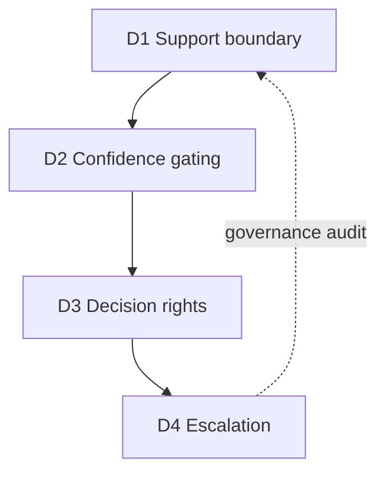
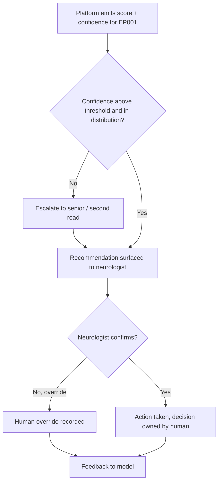
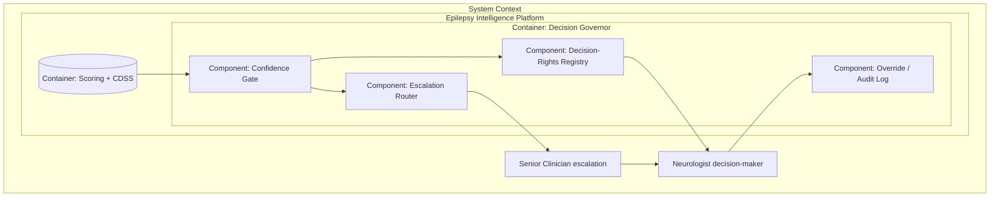
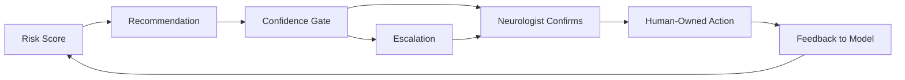
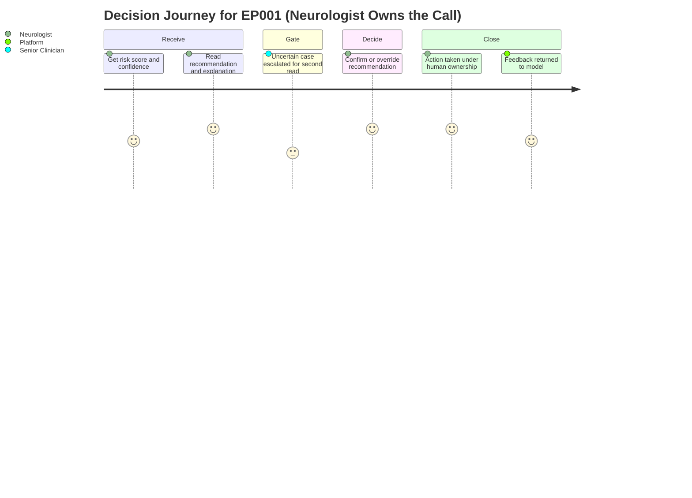

# Decision AI (Decision-Support vs Decision-Making in the Epilepsy Platform)
## Risk Score → Recommendation → Clinician Confirms — With Explicit Decision Rights and Escalation

> **Why (this doc):** The single most consequential Responsible-AI boundary is *who decides*. A DBA committee will insist the epilepsy platform is a **decision-support** system, not a **decision-making** one: it may compute a risk score and a recommendation, but a neurologist must confirm every clinical decision. This document states the decision research spine, defines decision-support versus decision-making, specifies the decision-rights and escalation mechanisms with thresholds, and maps every claim to the human-in-the-loop implementation in the repository.
> **How:** By following the mandatory research spine (Problem → Sub-problems → Research Problem → Research Objective → Flow → Hypotheses → Statistical Analysis), then presenting a DEFINITION table, a MECHANISMS/CONTROLS table, a KPI/METRICS table with thresholds, a repository-implementation table, all four mandated Mermaid diagram types plus a C4 model, and a Professor-readiness Q&A — every table captioned, every heading self-explaining, and everything anchored to test patient **EP001** (29-year-old male, left-temporal focal impaired-awareness epilepsy, ~5 seizures/month).

**Overarching decision question.** *Does the epilepsy platform confine itself to decision-support — producing a risk score and a recommendation that a neurologist must confirm — with explicit decision rights, defined escalation paths, and 100% human-gated actions, so that EP001's care is machine-informed but human-decided?*

---

## 1. Problem

> **Why:** A doctoral decision-rights argument must anchor to one concrete boundary risk before proposing controls. **How:** State the epilepsy-specific decision gap in terms of who could wrongly hold decision authority for EP001.

An AI epilepsy platform that blurs decision-support into decision-making creates a governance and safety failure: if the system's recommendation is acted on without a clinician confirming, accountability evaporates, low-confidence or out-of-distribution cases are actioned without escalation, and the neurologist is reduced to a rubber stamp rather than the decision-maker. For EP001 — whose care involves a consequential antiseizure-medication pathway and driving/employment implications — a mis-assigned decision right could push a drug change that no clinician owned. The core problem is the **absence of an explicit decision-rights and escalation model** that keeps the platform in a support role, routes every recommendation through a clinician, and escalates uncertain cases rather than acting on them.

*Caption — The table below decomposes the decision problem into the decision boundary at risk, the failure mode, and the consequence for EP001, justifying an explicit decision-rights model.*

| Decision boundary | Failure mode if unmanaged | Consequence for EP001 | Decision control |
|---|---|---|---|
| Support vs making | System acts on its own output | Unowned drug change | Score+recommendation only; clinician confirms |
| Confidence handling | Low-confidence cases auto-actioned | Uncertain call acted on blindly | Confidence threshold → escalation |
| Decision rights | Roles unclear on who owns the call | Diffused accountability | RACI-style decision-rights table |
| Escalation | No path for edge cases | Rare presentation mishandled | Defined escalation to senior/second read |



**Reason:** The problem must be visualised as two divergent decision paths so the examiner sees where authority sits. **Why:** A single flowchart contrasts a system-decides path (unaccountable action) against a support-only path. **What is happening:** A decision node splits the pathway into an ungoverned branch (system acts) and a governed branch where confidence gates escalation and a clinician confirms. **How it is happening:** The platform emits only a score and recommendation; low-confidence cases escalate; the neurologist owns the decision. **Reference:** Topol (2019) on human-plus-AI decision augmentation; Fisher et al. (2017) on the focal-seizure framing of EP001.

---

## 2. Sub-Problems

> **Why:** One broad decision problem must split into researchable, individually controllable units. **How:** Enumerate four sub-problems, one per decision control.

*Caption — This table maps each decision sub-problem to its control signal and the artefact it consumes, keeping every claim falsifiable.*

| # | Sub-problem | Control signal | Primary artefact |
|---|---|---|---|
| SP1 | System may overstep into deciding | Human-gated action rate | Human-gate log |
| SP2 | Low-confidence cases may be actioned | Escalation on low confidence | Confidence + escalation log |
| SP3 | Decision ownership may be unclear | Documented decision rights | Decision-rights (RACI) table |
| SP4 | Edge cases may lack a path | Escalation coverage | Escalation policy |



**Reason:** The sub-problems form a decision-governance chain that must be seen as a loop. **Why:** Ordering SP1→SP4 moves from the core boundary to escalation and shows governance feeding back. **What is happening:** Each sub-problem controls one facet of decision authority; the dashed edge closes the governance loop. **How it is happening:** Escalation findings in SP4 refine the support boundary in SP1 each cycle. **Reference:** Topol (2019); Sendak et al. (2020) on decision governance for clinical AI.

---

## 3. Research Problem

> **Why:** The examiner needs one crisp, testable statement unifying all sub-problems. **How:** Frame decision governance as a single answerable research problem bound to EP001.

**Research problem:** *Can the epilepsy platform operate strictly as decision-support — 100% of actions human-gated, low-confidence cases escalated rather than actioned, decision rights explicitly assigned, and escalation paths defined — so that EP001's risk score informs but a neurologist decides every clinical action?*

*Caption — This table sharpens the research problem into independent, dependent, and constraint variables so the decision study stays measurable and bounded.*

| Element | Definition in this study |
|---|---|
| Independent variables | Decision mode, confidence level, role, case type |
| Dependent variables | Human-gated rate, escalation rate, decision-agreement (κ), override rate |
| Constraint | Platform never makes a clinical decision; clinician always confirms |
| Population anchor | EP001 (ASM pathway, driving/employment-restricted) |

---

## 4. Research Objective

> **Why:** The problem must convert into concrete govern-and-measure goals. **How:** State one overarching objective decomposed into decision-control objectives.

**Overarching objective.** Design, implement, and evaluate a decision-governance layer that confines the platform to support, gates action on confidence, assigns explicit decision rights, and defines escalation — demonstrating machine-informed but human-decided epilepsy care.

*Caption — This table maps each decision objective to its sub-problem and headline measurable target.*

| Objective | Addresses | Headline measurable target |
|---|---|---|
| D1 Support-only boundary | SP1 | 100% of actions human-gated |
| D2 Confidence gating | SP2 | Low-confidence cases escalated, not actioned |
| D3 Decision rights | SP3 | RACI defined for every decision type |
| D4 Escalation paths | SP4 | 100% edge-case escalation coverage |



**Reason:** Objectives must be shown as an ordered, closed pipeline. **Why:** The flowchart demonstrates the decision controls are enforced in sequence and close the loop. **What is happening:** Each objective controls one decision facet; D4's audit edge returns to D1. **How it is happening:** The platform realises each control as a gate under human authority. **Reference:** Topol (2019); the human-gate reuses the fusion CDSS and `viewer/` severity scoring.

---

## 5. Flow (End-to-End Decision Runtime)

> **Why:** A defense requires an auditable picture of how a score becomes a human-owned decision. **How:** Present a stage table and a `sequenceDiagram`.

*Caption — This table traces one EP001 encounter through each decision runtime stage so the reviewer can audit where authority sits.*

| Stage | Actor/component | Input | Output |
|---|---|---|---|
| 1 Score | Platform | Fused features | Risk score + confidence |
| 2 Recommend | CDSS | Score + guidelines | Suggested workup (not an order) |
| 3 Gate | Confidence gate | Confidence + distribution | Proceed / escalate |
| 4 Escalate | Senior clinician | Uncertain case | Second read |
| 5 Confirm | Neurologist | Recommendation | Confirm / override |
| 6 Record | Governance | Decision | Accountable audit entry |

```mermaid
sequenceDiagram
  participant Pl as Platform (score)
  participant C as CDSS (recommendation)
  participant Gt as Confidence Gate
  participant Sr as Senior Clinician
  participant N as Neurologist
  Pl->>C: Risk score + calibrated confidence
  C->>Gt: Recommendation (suggested workup, not an order)
  Gt-->>Sr: If confidence low / out-of-distribution, escalate
  Sr-->>N: Second read for uncertain EP001 case
  Gt->>N: If confident, route recommendation
  N-->>C: Confirm or override (decision owned here)
  N->>Pl: Feedback for learning; action only after confirmation
```

**Reason:** The runtime must show ordered interaction over time between platform, gate, and clinicians. **Why:** A sequence diagram makes explicit that the platform recommends and the clinician decides, with escalation for uncertainty. **What is happening:** The platform scores, the CDSS recommends, the gate escalates low-confidence cases, and the neurologist confirms or overrides. **How it is happening:** Each message keeps authority with humans; action follows only after confirmation. **Reference:** Sendak et al. (2020); Topol (2019) on escalation and human confirmation.

---

## 6. Hypotheses

> **Why:** Falsifiable hypotheses make the decision programme scientific. **How:** State hypotheses HD1–HD4, each paired with its test.

*Caption — The hypothesis table pairs each null with its alternative and the test statistic, so each decision control is independently falsifiable.*

| ID | Objective | Null (H0) | Alternative (H1) | Test / statistic |
|---|---|---|---|---|
| HD1 | D1 Support | Some actions occur without a clinician | 100% human-gated | Human-gate audit rate = 1.0 |
| HD2 | D2 Confidence | Low-confidence cases actioned | Low-confidence cases escalated | Escalation rate on low-confidence subset |
| HD3 | D3 Rights | Decision ownership ambiguous | Every decision type has an owner | Decision-rights coverage audit |
| HD4 | D4 Escalation | Edge cases lack a path | All edge cases escalate | Escalation coverage = 100% |

---

## 7. Statistical Analysis

> **Why:** The examiner will probe how each decision claim becomes a number. **How:** Bind every hypothesis to a metric, method, threshold, and EP001 read, then show the governance loop as a flowchart.

*Caption — This table lists, per decision objective, the metric, its meaning, the acceptance threshold, and the EP001 read.*

| Metric (objective) | Meaning | Method | Acceptance threshold | EP001 read |
|---|---|---|---|---|
| Human-gated rate (D1) | Share of actions clinician-confirmed | Audit log proportion | 100% | Every EP001 action confirmed |
| Escalation rate on low-confidence (D2) | Uncertain cases sent up | Subset proportion | 100% of low-confidence | Below-threshold case escalated |
| Decision-rights coverage (D3) | Decision types with an owner | RACI audit | 100% | ASM-change owner = neurologist |
| Escalation coverage (D4) | Edge cases with a path | Policy audit | 100% | Rare presentation has a route |
| Decision agreement (support quality) | CDSS vs neurologist | Cohen κ | κ ≥ 0.60 | Concordant workup |



**Reason:** The decision governance must be shown as a gated loop, not a single pass. **Why:** The flowchart proves no action occurs without confidence clearance (or escalation) and clinician confirmation. **What is happening:** The score is confidence-gated; uncertain cases escalate; the neurologist confirms or overrides; feedback returns to the model. **How it is happening:** Failing the confidence gate escalates; confirmation yields a human-owned action. **Reference:** APA (2020) on transparent reporting; Topol (2019) on human-owned decisions.

---

## 8. Definitions, Mechanisms & Metrics

> **Why:** The committee must see decision roles defined precisely, enforced concretely, and measured numerically. **How:** Present a DEFINITION table, a MECHANISMS/CONTROLS table (including decision rights), and a KPI/METRICS table with thresholds.

*Caption — This DEFINITION table distinguishes decision-support from decision-making as used in this epilepsy platform.*

| Term | Formal definition (this platform) | Epilepsy interpretation |
|---|---|---|
| Decision-support | System informs a human who decides | Platform outputs score + recommendation only |
| Decision-making | System selects and enacts the action | Explicitly forbidden for clinical decisions |
| Confidence gate | Threshold below which cases escalate | Low-confidence EP001 case → second read |
| Decision right | Named owner accountable for a decision type | Neurologist owns ASM changes |
| Escalation | Route for uncertain / edge cases | Senior review or second read |

*Caption — This MECHANISMS/CONTROLS table states each decision-governance mechanism, the control it implements, and where it acts.*

| Mechanism | Control it implements | Pipeline point |
|---|---|---|
| Score+recommendation output contract | Confines platform to support | Model output |
| Mandatory clinician confirmation | Enforces human decision authority | Before action |
| Confidence threshold | Escalates uncertainty | After scoring |
| Decision-rights (RACI) table | Assigns accountable owner | Governance |
| Escalation policy | Routes edge cases | On low confidence / OOD |
| Override logging | Preserves accountability + learning | On decision |
| Decision-agreement (κ) tracking | Measures support quality | Post-decision |

*Caption — This decision-rights table names, per decision type, who is Responsible, Accountable, Consulted, and Informed (RACI), so ownership is unambiguous.*

| Decision type | Responsible | Accountable | Consulted | Informed |
|---|---|---|---|---|
| Risk score generation | Platform | Neurologist | — | Care team |
| Workup recommendation | CDSS | Neurologist | EEG technician | Patient |
| ASM change | Neurologist | Neurologist | Pharmacist | Patient |
| Escalation to second read | Confidence gate | Senior clinician | Neurologist | Care team |

*Caption — This KPI/METRICS table sets the numeric target thresholds every governed decision must meet.*

| KPI | Definition | Target threshold |
|---|---|---|
| Human-gated action rate | Actions confirmed by a clinician | 100% |
| Autonomous-action rate | Actions without confirmation | 0% |
| Low-confidence escalation rate | Uncertain cases escalated | 100% |
| Decision-rights coverage | Decision types with named owner | 100% |
| Decision agreement (κ) | CDSS vs neurologist concordance | ≥ 0.60 |
| Escalation coverage | Edge cases with a defined path | 100% |

---

## 9. Where Implemented in This Repository

> **Why:** A decision-governance claim is only credible if it maps to enforced mechanisms. **How:** Tabulate each mechanism against the repository artefact.

*Caption — This table ties every decision-governance mechanism to the concrete repository artefact that realises it, proving support-only is enforced.*

| Decision mechanism | Repository artefact | What it does |
|---|---|---|
| Human-in-the-loop confirmation | Fusion CDSS + `viewer/` severity scoring | Clinician confirms/overrides every score before action |
| Score+recommendation contract | Fusion CDSS design | Emits risk score + suggested workup, never an order |
| Support-quality measurement | `analysis/primary_analysis.py` baseline (AUC, confusion) | Quantifies the recommendation's reliability |
| Fairness precondition to decision | `analysis/primary_analysis.py` → `bias_check()` | Ensures the recommendation is equitable before a decision |
| Data-quality precondition | `analysis/primary_analysis.py` → `validate()` | Blocks decisions on invalid data |
| Interactive decision workflow | `viewer/` per-role portal (section → role → patient) | Presents score and captures the human decision |
| Accountability record | `build_report()` | Records decision-relevant metrics for audit |

---

## 10. Decision-Governance Architecture (C4 Model)

> **Why:** Governance requires an explicit map of where decision authority sits. **How:** Render a C4-style container/component model with a prose block.

*Caption — This C4 container view situates the decision governor between the CDSS and the clinician, clarifying authority boundaries.*



**Reason:** Decision authority needs an explicit architectural home. **Why:** A C4 container model names the confidence gate, decision-rights registry, escalation router, and audit log as distinct responsibilities. **What is happening:** The CDSS output passes the confidence gate; confident cases route via decision rights to the neurologist, uncertain cases route through escalation to a senior clinician, and decisions are logged. **How it is happening:** The gate and log are realised by the CDSS human-in-the-loop and the `viewer/` workflow. **Reference:** Brown (2018) C4 model; Topol (2019); global policy rule 21.

---

## 11. Decision-Flow Relationship View (Network)

> **Why:** The committee must see how score, recommendation, and confirmation connect. **How:** Render a `graph LR` network of the decision chain.

*Caption — This network shows how the risk score flows through recommendation and confidence gating into a human-owned decision.*



**Reason:** Decision governance is only valid if every step links to the human-owned action. **Why:** The network makes explicit that score and recommendation converge, via gating or escalation, on clinician confirmation. **What is happening:** The score becomes a recommendation, is confidence-gated or escalated, and reaches a human-owned action that feeds back. **How it is happening:** Each edge is a real handoff; no path reaches action without confirmation. **Reference:** Sendak et al. (2020) on clinical decision governance.

---

## 12. Clinician Decision Experience (Journey)

> **Why:** Decision governance must be felt from the clinician's point of view. **How:** Render a `journey` across the neurologist's decision experience for EP001.

*Caption — This journey models the neurologist's experience of receiving support and owning the decision for EP001.*



**Reason:** The controls must be felt from the human's point of view. **Why:** A journey map surfaces where the clinician receives support and where they own the decision. **What is happening:** The neurologist receives a score and recommendation, escalates if uncertain, decides, and closes with feedback. **How it is happening:** Each control is a journey section; escalation and confirmation keep authority human. **Reference:** Cramer et al. (1998) QOLIE-31 grounding the experience dimension; Topol (2019).

---

## 13. Professor Readiness (Defense Q&A)

> **Why:** Anticipating examiner challenges demonstrates command of the decision argument. **How:** Pre-answer the likely questions concisely.

### Q1. How is the platform prevented from making decisions rather than supporting them?

> **Why:** The support/making boundary is the crux. **How:** Point to the output contract and the gate.

The output contract is a *risk score plus suggested workup*, never an order; the fusion CDSS routes every recommendation to the neurologist, who confirms or overrides before any action, and the `viewer/` severity scoring records that human decision. The KPI is 100% human-gated and 0% autonomous action. Decision-making is architecturally reserved to the clinician.

### Q2. What happens to low-confidence or unusual cases?

> **Why:** Uncertainty is where automation fails. **How:** Point to the confidence gate and escalation.

Cases below the confidence threshold or out-of-distribution do not proceed to a routine recommendation; the confidence gate escalates them to a senior clinician or second read (D2, escalation coverage 100%). EP001's calibrated confidence (a temperature-scaled probability) is checked at the gate, so an uncertain call is routed to a human rather than actioned.

### Q3. How do you show the support is actually good, not just human-gated?

> **Why:** A gated but poor recommendation still wastes clinician effort. **How:** Point to agreement and baseline metrics.

Support quality is measured by decision agreement (Cohen κ ≥ 0.60) between the CDSS recommendation and the neurologist, and by the baseline model's cross-validated AUC and confusion matrix in `analysis/primary_analysis.py`. A recommendation that clinicians routinely override signals poor support and triggers model review, so the human gate and the quality metric work together.

---

## 14. References

> **Why:** Defensible decision-governance claims require real, citable sources. **How:** APA 7th edition entries spanning medical AI, decision governance, fairness, and reporting standards.

American Psychological Association. (2020). *Publication manual of the American Psychological Association* (7th ed.). https://doi.org/10.1037/0000165-000

Barocas, S., Hardt, M., & Narayanan, A. (2019). *Fairness and machine learning: Limitations and opportunities*. fairmlbook.org. http://www.fairmlbook.org

Brown, S. (2018). *The C4 model for visualising software architecture*. https://c4model.com

Cramer, J. A., Perrine, K., Devinsky, O., Bryant-Comstock, L., Meador, K., & Hermann, B. (1998). Development and cross-cultural translations of a 31-item quality of life in epilepsy inventory (QOLIE-31). *Epilepsia, 39*(1), 81–88. https://doi.org/10.1111/j.1528-1157.1998.tb01278.x

Fisher, R. S., Cross, J. H., French, J. A., Higurashi, N., Hirsch, E., Jansen, F. E., Lagae, L., Moshé, S. L., Peltola, J., Roulet Perez, E., Scheffer, I. E., & Zuberi, S. M. (2017). Operational classification of seizure types by the International League Against Epilepsy. *Epilepsia, 58*(4), 522–530. https://doi.org/10.1111/epi.13670

Hardt, M., Price, E., & Srebro, N. (2016). Equality of opportunity in supervised learning. *Advances in Neural Information Processing Systems, 29*, 3315–3323.

Sendak, M. P., Gao, M., Brajer, N., & Balu, S. (2020). Presenting machine learning model information to clinical end users with model facts labels. *npj Digital Medicine, 3*, 41. https://doi.org/10.1038/s41746-020-0253-3

Topol, E. J. (2019). High-performance medicine: The convergence of human and artificial intelligence. *Nature Medicine, 25*(1), 44–56. https://doi.org/10.1038/s41591-018-0300-7
