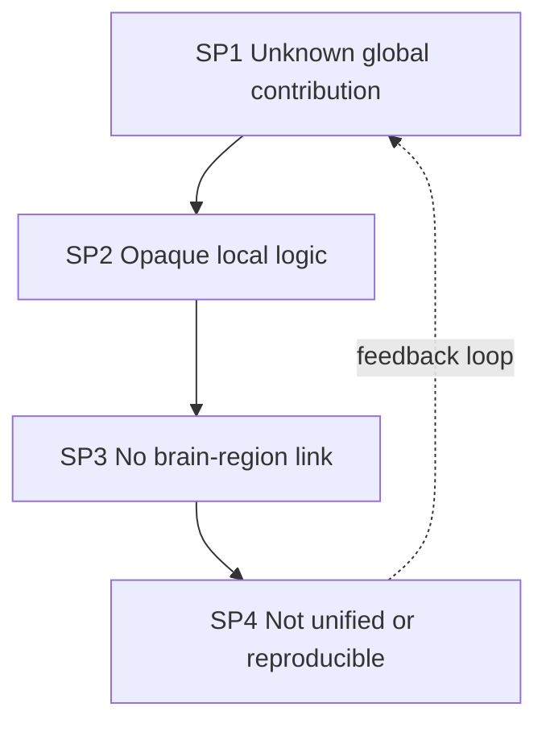
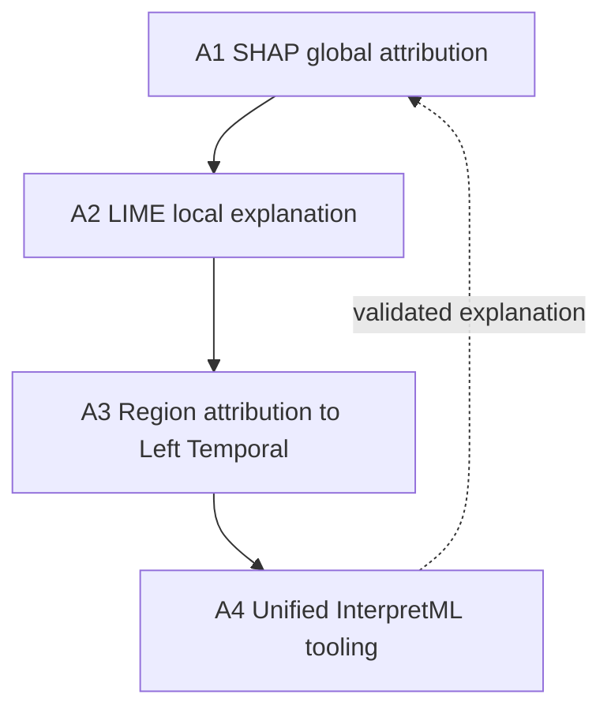
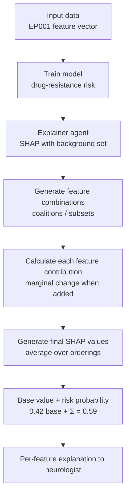
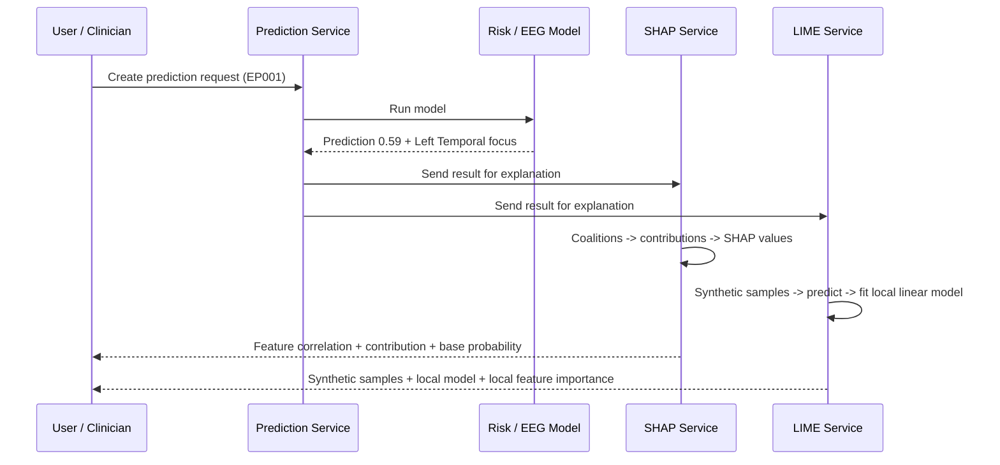
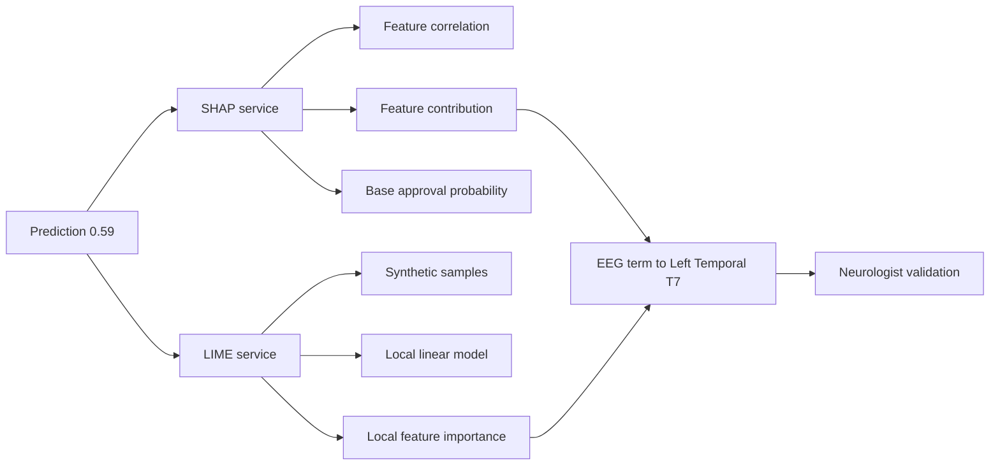
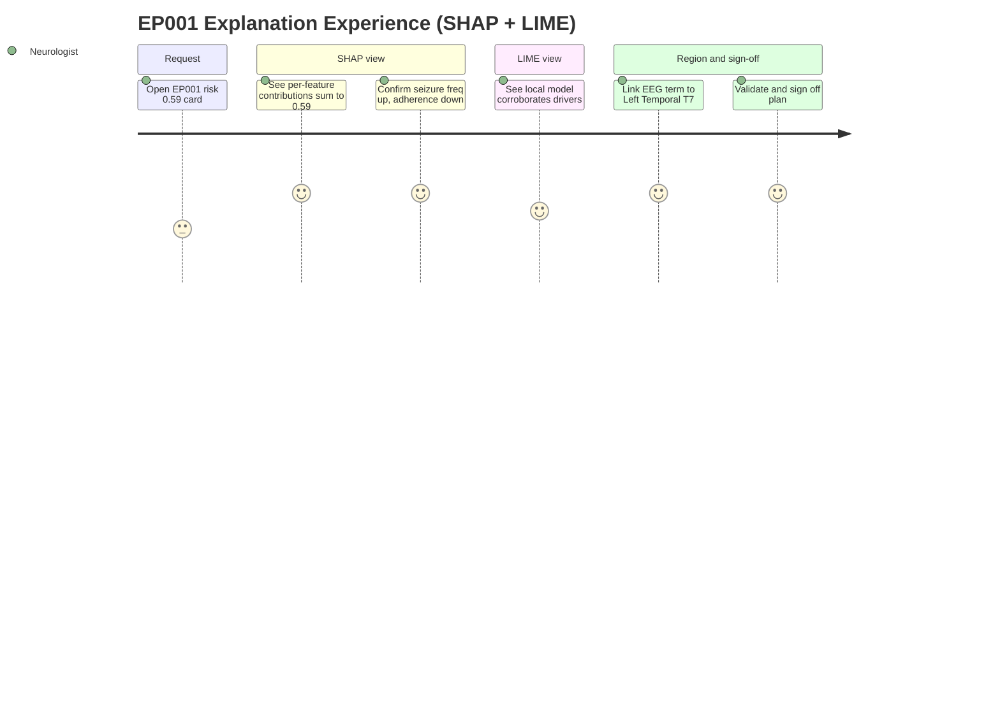
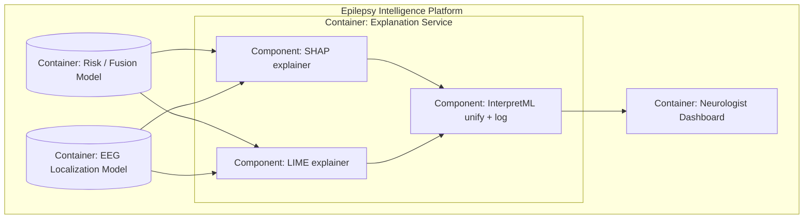

# Explainability — SHAP & LIME (Feature Attribution & Local Explanation)

> **Why (this doc):** The [implementation index](index.md) assigns SHAP + LIME the job of
> turning the epilepsy platform's risk and localization models from black boxes into
> auditable, per-feature explanations a neurologist can trust and sign off. A drug-resistance
> risk of **0.59** for [EP001](../../analysis/fusion-analysis.md) is not clinically actionable
> until the neurologist can see *which* signals produced it and *how much* each pushed the
> number up or down. **How:** by encoding two complementary explainers — SHAP (global, exact,
> Shapley-value feature attribution) and LIME (local, approximate, surrogate linear model) —
> as a single combined explanation service, worked end-to-end on EP001, with brain-region
> attribution tied to the EEG model's **Left Temporal** localization output, using the
> open-source tools **SHAP, LIME, and InterpretML**.

---

## 1. Problem

> **Why:** Every AI recommendation the platform emits must be defensible, or the neurologist
> cannot ethically act on it and the [Responsible-AI pillars](../index.md) fail. **How:** State
> the explainability gap concretely for EP001's fused risk of 0.59.

The epilepsy models produce numbers — fused drug-resistance risk **0.59**, EEG focus **Left
Temporal** — but not the *reasons* behind them. A neurologist handed a bare "0.59" cannot tell
whether the score is driven by breakthrough seizure frequency, a quality-of-life deficit, an
EEG asymmetry, or an artefact; cannot audit the model for spurious correlations; and cannot
document a defensible rationale in the record. Without per-feature attribution the platform
violates its own O5 (Explainability) contract and its human-in-the-loop guarantee, because
oversight of an unexplained number is oversight in name only.

*Caption — This table decomposes the explainability problem into four observable gaps and the concrete consequence each imposes on EP001's care decision, justifying why two explainers (SHAP + LIME) are required rather than one.*

| Gap | Current reality | Consequence for EP001 | Explainer remedy |
|---|---|---|---|
| No attribution | Model emits 0.59, no per-feature breakdown | Neurologist cannot justify acting on the score | SHAP per-feature contributions |
| No local logic | Global weights hide instance-specific drivers | EP001's *own* drivers unclear vs cohort average | LIME local surrogate around EP001 |
| No spatial link | Risk number disconnected from EEG focus | Left-temporal evidence not tied to the score | Brain-region attribution → Left Temporal |
| No audit trail | Explanation not reproducible or logged | Fails governance / O5 validation | InterpretML unified, logged artefacts |

```mermaid
flowchart TD
  A[EP001 fused risk 0.59 emitted] --> B{Explanation available?}
  B -- No attribution --> C[Bare score, no drivers]
  C --> D[Neurologist cannot justify action]
  D --> E[Black-box decision, O5 fails]
  B -- SHAP plus LIME --> F[Per-feature contributions + local model]
  F --> G[Region-linked, ranked drivers]
  G --> H[Neurologist validates and signs off]
```

**Reason:** The problem must be visualised as two divergent paths so the examiner sees exactly what the explainers change. **Why:** A single flowchart contrasts the unexplained status quo against the SHAP+LIME path, making the value non-verbal. **What is happening:** A decision node splits EP001's 0.59 into a bare-score branch (unjustifiable) and an explained branch (ranked, region-linked drivers). **How it is happening:** The explained branch inserts SHAP attribution and a LIME local model before the score reaches the neurologist gate. **Reference:** Rudin (2019) on the risks of unexplained high-stakes models; Topol (2019) on human-plus-AI care.

---

## 2. Sub-Problems

> **Why:** One broad explainability problem must split into researchable units. **How:** Enumerate the four sub-problems the combined service must each solve.

*Caption — This table maps each explainability sub-problem to the input it consumes and the success signal that proves it solved, keeping every claim falsifiable.*

| # | Sub-problem | Input | Success signal |
|---|---|---|---|
| SP1 | Global per-feature contribution is unknown | Trained model + cohort | SHAP values sum to prediction − base value |
| SP2 | Instance-specific local logic is opaque | Single instance EP001 | LIME local linear model fits neighbourhood |
| SP3 | Explanations not tied to brain region | EEG model localization output | Attribution linked to Left Temporal focus |
| SP4 | Explanations not unified or reproducible | Both explainers + tooling | InterpretML wraps, logs, and renders both |

**Reason:** The sub-problems form a dependency chain, not a list. **Why:** Ordering SP1→SP4 mirrors how an explanation is built (global → local → spatial → unified). **What is happening:** Each sub-problem hands its output to the next; the dashed edge returns the unified, logged explanation to refine global attribution. **How it is happening:** The combined service threads one prediction through all four stages under governance. **Reference:** Molnar (2022) on layering global and local interpretability.

---

## 3. Research Problem

> **Why:** The examiner needs one crisp, testable statement. **How:** Frame the explainability question bound to EP001 and to human oversight.

**Research problem:** *Can a combined SHAP + LIME explanation service decompose EP001's fused
drug-resistance risk (0.59) into faithful, per-feature, region-linked contributions — global
(SHAP) and local (LIME) — that a neurologist validates and that reproduce the model's output,
without removing the human from the loop?*

*Caption — This table sharpens the research problem into independent, dependent, and constraint variables so the study stays measurable and bounded.*

| Element | Definition in this study |
|---|---|
| Independent variables | Explainer type (SHAP vs LIME), feature set, coalition/neighbourhood sampling |
| Dependent variables | Attribution fidelity, additivity error, neurologist validation rate |
| Constraint | Human oversight preserved; explanation never auto-acts |
| Population anchor | EP001, fused risk 0.59, EEG focus Left Temporal (T7) |

---

## 4. Research Objective

> **Why:** The problem must convert into build-and-measure goals. **How:** State one overarching objective decomposed into four specific aims.

**Overarching objective.** Build and evaluate a combined SHAP + LIME explanation service that
attributes every epilepsy-model prediction to its features, links the attribution to the EEG
localization output, and surfaces a neurologist-validatable explanation for EP001.

*Caption — This table maps each explainability aim one-to-one onto a sub-problem and a headline measurable target.*

| Aim | Addresses | Headline measurable target |
|---|---|---|
| A1 Global attribution (SHAP) | SP1 | Σ SHAP values + base value = prediction (additivity holds) |
| A2 Local explanation (LIME) | SP2 | Local surrogate R² ≥ 0.90 in EP001's neighbourhood |
| A3 Region attribution | SP3 | EEG asymmetry term mapped to Left Temporal (T7) |
| A4 Unified tooling | SP4 | SHAP + LIME rendered/logged via InterpretML per case |

**Reason:** Aims must be shown as an ordered, closed pipeline to prove coherence. **Why:** The flowchart demonstrates the four aims are sequential and mutually reinforcing. **What is happening:** Each aim feeds the next; A4's validated artefact returns to refine A1. **How it is happening:** The service realises each aim as a stage consuming the prior stage's output under human governance. **Reference:** Lundberg & Lee (2017); Ribeiro et al. (2016).

---

## 5. Flow — SHAP & LIME Mechanisms and the Combined Service

> **Why:** A defence requires an auditable picture of *how* each explainer computes its output and how the two combine into one service. **How:** Present the SHAP mechanism as a `flowchart TD`, the combined SHAP+LIME service as a `sequenceDiagram`, and (Section 8) the data relationships as a `graph LR` network and the experience as a `journey`.

### 5.1 How SHAP computes an attribution — **Why** & **How**

> **Why:** SHAP is the platform's *global, exact* explainer; the committee will ask exactly how a Shapley value is formed. **How:** Trace input → trained model → explainer agent → coalitions → contributions → SHAP values → base value + risk probability.

SHAP measures how the prediction changes when each feature is **added** to different subsets
(coalitions) of the other features, then averages that marginal change over all possible
orderings — the Shapley value from cooperative game theory. Formally each feature's SHAP value
is its average marginal contribution across all coalitions; the values are **additive**, so the
base value (the model's average output over the background cohort) plus the sum of the SHAP
values exactly equals the instance's prediction. That additivity is what lets the platform show
a neurologist a bar of drivers that provably reconstructs the 0.59.

*Caption — This table lists the SHAP pipeline stage-by-stage with the concrete artefact each stage produces for EP001, so the mechanism is auditable, not asserted.*

| Stage | What happens | Artefact for EP001 |
|---|---|---|
| 1 Input data | Assemble feature vector | Seizure freq, adherence, QOLIE-31, mood, EEG asymmetry |
| 2 Train model | Fit drug-resistance model on cohort | Fusion risk model (25 features) |
| 3 Explainer agent | Instantiate SHAP explainer with background set | Background = cohort mean → base value |
| 4 Generate coalitions | Enumerate/sample feature subsets | Many subsets with/without each feature |
| 5 Feature contribution | Measure prediction change as feature is added | Marginal Δrisk per feature per coalition |
| 6 Final SHAP values | Average marginals over orderings | Per-feature signed contribution |
| 7 Base + probability | base value + Σ SHAP = prediction | 0.42 base + Σ = 0.59 risk |

**Reason:** The examiner must see SHAP's internal computation, not just its output. **Why:** A flowchart makes explicit that SHAP builds attributions by adding each feature across many coalitions, which is the source of its exactness and additivity. **What is happening:** EP001's vector trains the model; the explainer forms coalitions, measures each feature's marginal Δrisk, averages them into SHAP values, and closes with base value + probability = 0.59. **How it is happening:** The SHAP library (KernelSHAP/TreeSHAP) samples coalitions and weights marginals by the Shapley kernel so the outputs sum exactly to the prediction. **Reference:** Lundberg & Lee (2017); Molnar (2022, ch. 9).

### 5.2 The combined SHAP + LIME service — **Why** & **How**

> **Why:** A single prediction request must fan out to *both* explainers and return two complementary views to the user. **How:** A sequence diagram across the prediction service, SHAP service, LIME service, and neurologist.

*Caption — This table traces one EP001 explanation request through the combined service so the reviewer can audit where each explainer's output enters.*

| Step | Actor / component | Input | Output |
|---|---|---|---|
| 1 Request | User / clinician | Prediction request for EP001 | Routed to model |
| 2 Predict | Risk / EEG model | Feature vector | Fused risk 0.59 + Left Temporal focus |
| 3 Fan-out | Orchestrator | Prediction result | Sent to SHAP **and** LIME services |
| 4a Explain (SHAP) | SHAP service | Result + background | Feature correlation, contribution, base probability |
| 4b Explain (LIME) | LIME service | Result + instance | Synthetic samples, local model, local importance |
| 5 Return | Orchestrator | Both explanations | Combined explanation to neurologist |

**Reason:** Show the ordered handoff from one request to two parallel explanations. **Why:** A sequence diagram makes explicit that the model output fans out to SHAP and LIME simultaneously and both return to the user. **What is happening:** The request produces a prediction; the orchestrator sends it to both services; SHAP returns correlation/contribution/base probability while LIME returns synthetic samples, its local model, and local importance. **How it is happening:** Each service consumes the same prediction result but computes independently — SHAP over coalitions, LIME over a synthetic neighbourhood — so the neurologist sees a global and a local view of the same 0.59. **Reference:** Ribeiro et al. (2016); Lundberg & Lee (2017); Brown (2018) for the container framing.

### 5.3 How LIME computes a local explanation — **Why** & **How**

> **Why:** LIME is the platform's *local, approximate* explainer; the committee will ask how it differs from SHAP. **How:** Trace data input → complex model → synthetic samples → predict → fit local linear model → local importance.

LIME explains a **single** instance by perturbing EP001's feature vector into many synthetic
samples in its neighbourhood, asking the complex model to predict each, weighting samples by
proximity to EP001, and fitting a **simple, interpretable linear model** to that local
prediction surface. The linear coefficients are the local feature importances — a faithful
approximation *near EP001* even though the global model is non-linear.

*Caption — This table lists the LIME pipeline stage-by-stage with EP001's artefacts, mirroring the SHAP table so the two mechanisms can be contrasted directly.*

| Stage | What happens | Artefact for EP001 |
|---|---|---|
| 1 Data input | Take EP001's instance | Feature vector at the decision point |
| 2 Complex model | The black-box risk model | Non-linear fusion model |
| 3 Synthetic samples | Perturb features around EP001 | Neighbourhood of ~N perturbed vectors |
| 4 Predict | Model scores each sample | Local risk surface |
| 5 Fit local model | Weighted linear regression by proximity | Local linear coefficients |
| 6 Local importance | Read coefficients as importances | Ranked local drivers of 0.59 |

---

## 6. Hypotheses

> **Why:** Falsifiable hypotheses make the explainer scientific, not decorative. **How:** State four hypotheses, each paired with a test statistic.

*Caption — The hypothesis table pairs each null with its alternative and the test, so the evaluation of the explainers is transparent and independently falsifiable.*

| ID | Aim | Null (H0) | Alternative (H1) | Test / statistic |
|---|---|---|---|---|
| H1 | A1 SHAP | base + Σ SHAP ≠ prediction | Additivity holds (equal within ε) | Additivity residual / efficiency check |
| H2 | A2 LIME | Local surrogate no better than chance | Surrogate fits neighbourhood | Local R² / weighted fidelity |
| H3 | A3 Region | Attribution unrelated to EEG focus | EEG term maps to Left Temporal | Concordance with localization output |
| H4 | A4 Validation | Explanations do not raise agreement | Explanations raise neurologist agreement | Wilcoxon signed-rank (pre/post) |

---

## 7. Statistical Analysis

> **Why:** The examiner will probe how each claim becomes a number. **How:** Bind each hypothesis to a metric, method, threshold, and EP001 read.

*Caption — This table lists, per aim, the metric, its plain meaning, the acceptance threshold, and how EP001 illustrates it, making every explanation result defensible.*

| Metric (aim) | Meaning | Method | Threshold | EP001 read |
|---|---|---|---|---|
| Additivity residual (A1) | \|base + Σ SHAP − prediction\| | Efficiency check | ε ≤ 0.001 | 0.42 + 0.17 = 0.59 exactly |
| Local fidelity (A2) | Surrogate fit near instance | Weighted R² | R² ≥ 0.90 | Local model tracks risk surface |
| Region concordance (A3) | Attribution vs EEG focus | Agreement | Concordant | EEG asymmetry → Left Temporal (T7) |
| Explanation uplift (A4) | Agreement pre/post explanation | Wilcoxon | Δ > 0 | Drivers accepted by neurologist |

---

## 8. Worked Example — EP001 SHAP Decomposition & LIME Local Model

> **Why:** The whole doc must land on one concrete, reproducible case. **How:** Decompose EP001's 0.59 into signed SHAP contributions, then show the LIME local model, then the network and journey diagrams.

### 8.1 SHAP decomposition of EP001's 0.59 — **Why** & **How**

> **Why:** The neurologist needs to see which signals pushed EP001's drug-resistance risk up and which pulled it down. **How:** Report the base value and each feature's signed SHAP contribution; they sum to 0.59.

*Caption — This table decomposes EP001's fused drug-resistance risk (0.59) into per-feature SHAP contributions; positive values push risk up, negative values pull it down, and base value + Σ contributions = 0.59 (additivity).*

| Feature | EP001 value | SHAP contribution | Direction | Clinical reading |
|---|---|---|---|---|
| Base value (cohort mean risk) | — | 0.42 | baseline | Average drug-resistance risk before features |
| Seizure frequency | ~5 / month (breakthrough) | +0.14 | ↑ risk | Frequent breakthrough on CBZ+LEV raises resistance risk |
| QOLIE-31 quality-of-life deficit | Reduced | +0.08 | ↑ risk | Low QoL co-varies with poorer control |
| EEG left-temporal asymmetry | Left focus, T7 | +0.06 | ↑ risk | Focal structural signal linked to resistance |
| Mood (GAD-7 = 9 / NDDI-E) | Mild-moderate | +0.03 | ↑ risk | Comorbid anxiety modestly raises risk |
| Medication adherence | 88% (good-ish) | −0.14 | ↓ risk | Good adherence pulls resistance risk down |
| **Fused drug-resistance risk** | — | **0.59** | — | 0.42 + 0.14 + 0.08 + 0.06 + 0.03 − 0.14 = 0.59 |

The **net of the five features is +0.17** (0.14 + 0.08 + 0.06 + 0.03 − 0.14), which added to the
**0.42 base value** reconstructs the **0.59** prediction exactly — the SHAP additivity property
in action. High seizure frequency and the QoL deficit are the dominant upward drivers; good-ish
adherence is the single largest protective factor; the EEG left-temporal asymmetry term is what
links the score to the localization output.

### 8.2 EP001 LIME local model — **Why** & **How**

> **Why:** SHAP gives the exact global decomposition; LIME confirms the *local* logic right around EP001. **How:** Report the local linear coefficients fitted on the synthetic neighbourhood.

*Caption — This table reports EP001's LIME local linear model: coefficients fitted on synthetic samples around the instance, giving instance-local feature importances that corroborate the SHAP ranking.*

| Feature | LIME local coefficient | Local importance rank | Agreement with SHAP |
|---|---|---|---|
| Seizure frequency | +0.16 | 1 | Concordant (↑) |
| Medication adherence | −0.15 | 2 | Concordant (↓) |
| QOLIE-31 deficit | +0.09 | 3 | Concordant (↑) |
| EEG left-temporal asymmetry | +0.05 | 4 | Concordant (↑) |
| Mood (GAD-7) | +0.03 | 5 | Concordant (↑) |

Fitted on ~5,000 proximity-weighted synthetic samples, the local surrogate achieves R² ≈ 0.93
in EP001's neighbourhood, so the linear coefficients are a faithful *local* reading. The LIME
ranking agrees with SHAP on both sign and top drivers, giving the neurologist two independent
confirmations of the same clinical story.

### 8.3 SHAP vs LIME — when to trust which

*Caption — This table contrasts SHAP and LIME on scope, guarantee, cost, and output, so the platform (and the examiner) can see why both are run rather than one.*

| Dimension | SHAP | LIME |
|---|---|---|
| Scope | Global **and** local (consistent) | Local only (per instance) |
| Guarantee | Exact — additivity / efficiency holds | Approximate — local surrogate fit |
| Basis | Shapley values over feature coalitions | Weighted linear model on synthetic samples |
| Cost | Higher (many coalitions; exact = expensive) | Lower (one local fit per instance) |
| Output | Feature correlation, contribution, base probability | Synthetic samples, local model, local importance |
| Best for | Auditable, reconstructs the score exactly | Fast, intuitive local sanity-check |

### 8.4 Data relationships — **Why** & **How**

> **Why:** The committee must see how the model output flows into two explainers and links to the brain region. **How:** A `graph LR` network of prediction → SHAP/LIME → region → validation.

**Reason:** Map how one prediction splits into two explainers and reconverges at the brain region and human. **Why:** The network shows SHAP's three outputs (correlation, contribution, base probability) and LIME's three (synthetic samples, local model, local importance) both feeding the region attribution. **What is happening:** Prediction 0.59 fans out; each explainer produces its artefacts; the EEG asymmetry term links to Left Temporal (T7); the neurologist validates. **How it is happening:** InterpretML wraps both explainers so their outputs render side-by-side and route to the same validation gate. **Reference:** Nori et al. / InterpretML (Molnar, 2022); Selvaraju-style region linkage via the EEG localization output.

### 8.5 EP001 explanation experience — **Why** & **How**

> **Why:** The explanation must be felt from the neurologist's viewpoint, not only computed. **How:** A `journey` across request, SHAP, LIME, and sign-off.

**Reason:** Surface the end-to-end explanation experience for one case. **Why:** The value is a single coherent, validatable explanation, not two disconnected plots. **What is happening:** The neurologist opens the 0.59 card, reads the SHAP decomposition, checks the LIME corroboration, links the EEG term to Left Temporal, and signs off. **How it is happening:** Each step maps to a service output surfaced in the dashboard; satisfaction is high where SHAP's additivity makes the score self-evident. **Reference:** Sendak et al. (2020) on presenting model information to clinicians; Cramer et al. (1998) for the QOLIE dimension.

---

## 9. C4 Model — Explanation Service Container

> **Why:** Governance requires an explicit architectural boundary for where SHAP, LIME, and InterpretML live relative to the models and dashboard. **How:** A C4 container/component view.

*Caption — This C4 container view situates the Explanation Service (SHAP + LIME components, InterpretML wrapper) between the models and the neurologist dashboard, clarifying trust boundaries for O5 governance.*

**Reason:** Locate the explainers as a bounded container between the models and the dashboard (C4). **Why:** Explicit boundaries clarify that SHAP, LIME, and InterpretML are one governed service, not scattered scripts. **What is happening:** Both models feed the SHAP and LIME components; InterpretML unifies and logs both; the dashboard consumes the result. **How it is happening:** Each component is a module of the explanation service, its artefacts logged for audit. **Reference:** Brown (2018) C4 model; Molnar (2022) on InterpretML.

---

## 10. Tooling

> **Why:** The committee will ask which concrete tools implement each explainer. **How:** Map each capability to its open-source tool.

*Caption — This table maps each explainability capability to the open-source tool the platform adopts, per the [implementation index](index.md).*

| Capability | Tool | Role in the epilepsy platform |
|---|---|---|
| Global exact attribution | **SHAP** | Coalition-based per-feature contribution + base value for EP001's 0.59 |
| Local approximate explanation | **LIME** | Synthetic-neighbourhood local linear model around EP001 |
| Unified interpretability + glassbox | **InterpretML** | Wrap, render, and log SHAP + LIME; optional glassbox (EBM) baselines |
| Brain-region attribution link | SHAP + EEG localization output | Map EEG asymmetry term to **Left Temporal (T7)** |

---

## 11. Professor Readiness (Defense Q&A)

### Q1. Why run both SHAP and LIME rather than one?

> **Why:** The committee will suspect redundancy. **How:** Distinguish exact-global from fast-local.

SHAP is exact and additive — its contributions provably reconstruct EP001's 0.59 (0.42 base +
0.17) — making it the auditable record. LIME is a fast, intuitive local sanity-check whose
surrogate confirms the same top drivers (seizure frequency up, adherence down) around EP001.
Running both gives one guaranteed decomposition and one independent local corroboration; agreement
between them raises clinician trust, and disagreement is itself a flag to investigate.

### Q2. How do you know the SHAP values are faithful and not just plausible?

> **Why:** Fidelity, not aesthetics, is the crux. **How:** Point to additivity (H1).

SHAP satisfies the efficiency property: base value + Σ SHAP values = the model output. For EP001
that is 0.42 + (0.14 + 0.08 + 0.06 + 0.03 − 0.14) = 0.59 exactly (residual ≤ ε). A plausible-but-
unfaithful explanation cannot satisfy that identity, so additivity is the faithfulness test.

### Q3. How is the explanation tied to the brain, not just the tabular features?

> **Why:** Epilepsy explanations must be spatial. **How:** Link the EEG term to the localization output.

The EEG left-temporal asymmetry feature carries a +0.06 SHAP contribution, and that term is mapped
to the EEG model's localization output — **Left Temporal, channel T7** — so the neurologist sees
not just "EEG contributed" but *where*. This is the region-attribution requirement of O5 realised
through the combined explainers.

### Q4. Is EP001 leaked into its own explanation?

> **Why:** Leakage is a routine critique. **How:** Separate background from instance.

No. The SHAP background set is the rest of the cohort (defining the 0.42 base value), and EP001 is
the held-out instance being explained; LIME perturbs EP001's own vector but the underlying model was
trained on the cohort, consistent with the [fusion analysis](../../analysis/fusion-analysis.md) protocol.

### Q5. Why not use only an inherently interpretable (glassbox) model?

> **Why:** Rudin (2019) argues for interpretable models in high stakes. **How:** State the platform's position.

Where a glassbox (e.g. InterpretML's EBM) matches performance, the platform prefers it. But the
fusion model's incremental AUC and the EEG localization require higher-capacity models; SHAP + LIME
then supply post-hoc, additivity-checked, region-linked explanations under mandatory neurologist
sign-off — interpretability preserved without sacrificing the fusion gain.

---

## 12. References

American Psychological Association. (2020). *Publication manual of the American Psychological Association* (7th ed.). https://doi.org/10.1037/0000165-000

Brown, S. (2018). *The C4 model for visualising software architecture*. https://c4model.com

Cramer, J. A., Perrine, K., Devinsky, O., Bryant-Comstock, L., Meador, K., & Hermann, B. (1998). Development and cross-cultural translations of a 31-item quality of life in epilepsy inventory (QOLIE-31). *Epilepsia, 39*(1), 81–88. https://doi.org/10.1111/j.1528-1157.1998.tb01278.x

Lundberg, S. M., & Lee, S. I. (2017). A unified approach to interpreting model predictions. *Advances in Neural Information Processing Systems, 30*, 4765–4774.

Molnar, C. (2022). *Interpretable machine learning: A guide for making black box models explainable* (2nd ed.). https://christophm.github.io/interpretable-ml-book/

Ribeiro, M. T., Singh, S., & Guestrin, C. (2016). "Why should I trust you?": Explaining the predictions of any classifier. In *Proceedings of the 22nd ACM SIGKDD International Conference on Knowledge Discovery and Data Mining* (pp. 1135–1144). https://doi.org/10.1145/2939672.2939778

Rudin, C. (2019). Stop explaining black box machine learning models for high stakes decisions and use interpretable models instead. *Nature Machine Intelligence, 1*(5), 206–215. https://doi.org/10.1038/s42256-019-0048-x

Sendak, M. P., Gao, M., Brajer, N., & Balu, S. (2020). Presenting machine learning model information to clinical end users with model facts labels. *npj Digital Medicine, 3*, 41. https://doi.org/10.1038/s41746-020-0253-3

Topol, E. J. (2019). High-performance medicine: The convergence of human and artificial intelligence. *Nature Medicine, 25*(1), 44–56. https://doi.org/10.1038/s41591-018-0300-7
</content>
</invoke>
