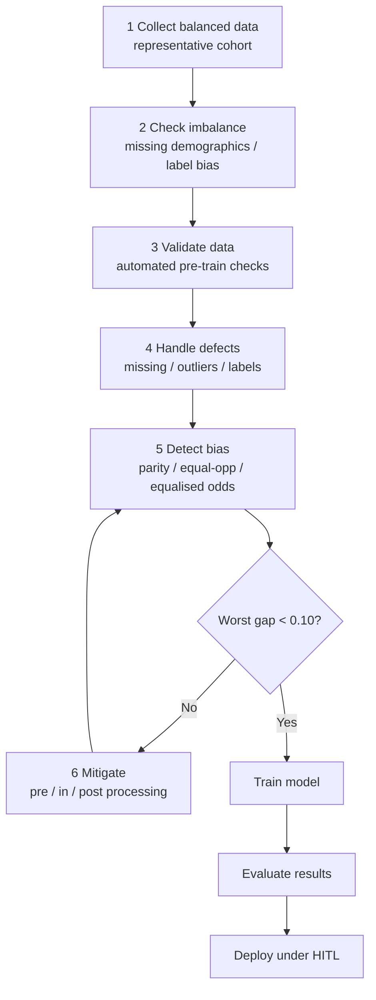
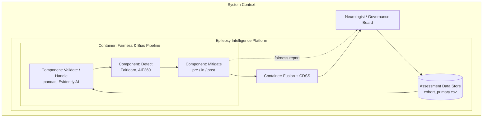
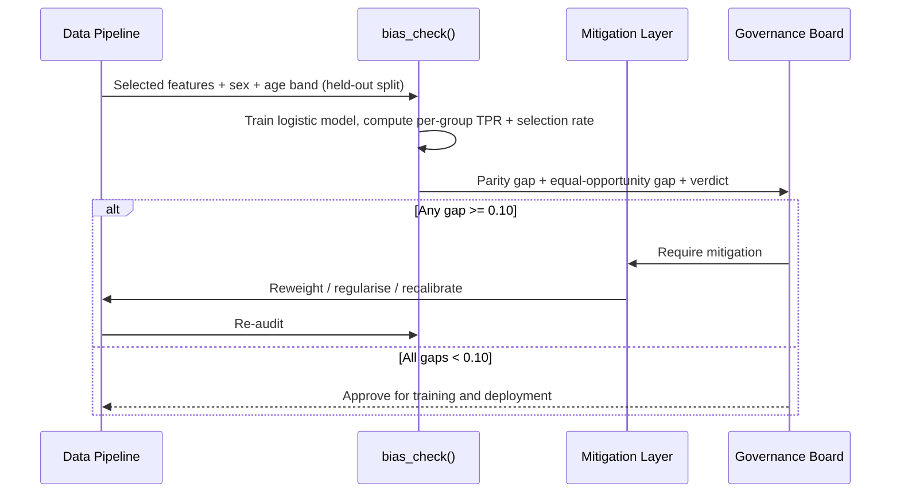
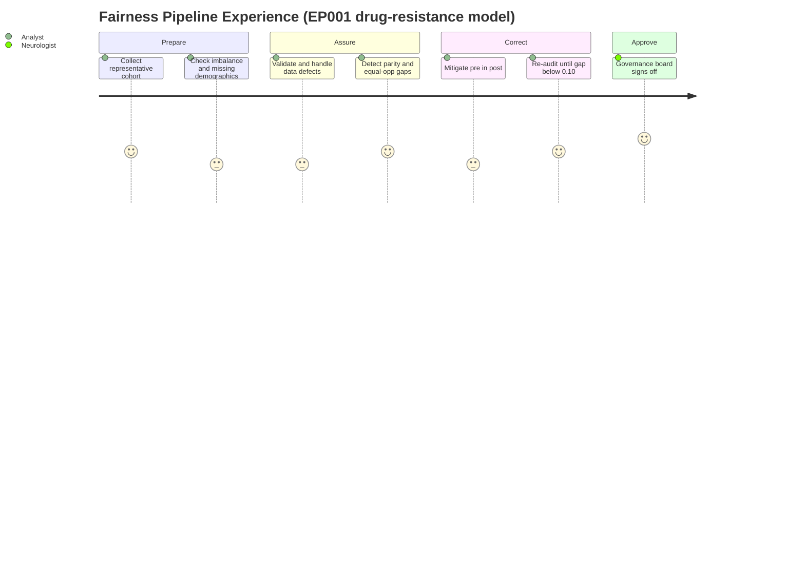

# Fairness & Bias Pipeline — Detect and Mitigate Group Disparity

> **Why (this doc):** The [implementation index](index.md) commits the platform to
> *fairness* and *bias detection* as first-class Responsible-AI capabilities; this doc
> operationalises them as a concrete six-step pipeline — collect → check → validate →
> handle → detect → mitigate — that runs **before** any epilepsy model is trained and
> **again** before it is deployed. **How:** Each step is stated as a captioned table plus
> a matching diagram, the mitigation stage is given as a stage→technique→tool table, and
> the whole pipeline is anchored on the fairness of EP001's drug-resistance model, whose
> demographic-parity and equal-opportunity gaps are already computed by
> `analysis/primary_analysis.py` → `bias_check()` against a **< 0.10** threshold.

**Problem:** An epilepsy drug-resistance model that is accurate *on average* can still be
systematically wrong for a subgroup (e.g., women, or the 51–90 age band), quietly denying
EP001-like patients timely escalation. Aggregate AUC hides this harm.
**Sub-problems:** unrepresentative data; class imbalance and missing demographics; label
bias; undetected group disparity; and mitigation that trades away too much accuracy.
**Research Problem:** Can a repeatable pipeline guarantee that the primary drug-resistance
model is fair across sex and age band before it reaches a neurologist's screen?
**Research Objective:** Deliver a six-step collect→mitigate pipeline whose exit gate is a
demographic-parity **and** equal-opportunity gap below 0.10 on held-out data.
**Flow:** Collect → check → validate → handle → detect (Fairlearn/AIF360) → mitigate
(pre/in/post) → train → evaluate → deploy.
**Hypotheses:** H1 the raw model shows a measurable parity gap across at least one
protected attribute; H2 pre/in/post mitigation reduces the worst gap below 0.10; H3
mitigation costs < 3 AUC points versus the unmitigated baseline.
**Statistical Analysis:** demographic parity, equal opportunity (TPR gap), equalised odds,
and statistical parity difference — computed per group via `bias_check()`.

## Six-Step Fairness Pipeline

*Caption — The user-specified six-step pipeline, each step paired with its concrete action
and the tool that performs it, so every stage is auditable and reproducible.*

| # | Step | What it does | Primary tools |
|---|---|---|---|
| 1 | **Collect balanced data** | Ensure training data is representative of the deployment population (sex, age band, focus laterality). | make_cohort seeds; sampling design |
| 2 | **Check for imbalance** | Detect class imbalance, missing demographics, sampling bias, and label bias. | pandas, Evidently AI |
| 3 | **Validate the data** | Automated data validation *before* training (completeness, range, type, logical consistency). | pandas, Evidently AI; `validate()` |
| 4 | **Handle defects** | Repair missing values, outliers, protected attributes, and labels with a logged audit trail. | pandas, Evidently AI; `clean()` |
| 5 | **Detect bias** | Compute demographic parity, equal opportunity, equalised odds, statistical parity difference. | Fairlearn, IBM AIF360; `bias_check()` |
| 6 | **Mitigate bias** | Apply pre-processing, in-processing, and post-processing corrections. | Fairlearn, AIF360 |

After Step 6 the corrected model is **trained → evaluated → deployed** only if the
detected gaps clear the < 0.10 gate.

*Caption — The pipeline as a top-down process flow; each node is one step above, and the
diamond is the fairness exit gate that governs whether the model is allowed to deploy.*



**Reason:** To show the fairness pipeline as a gated loop rather than a one-shot check.
**Why:** A DBA defense needs proof the model *cannot* deploy while a group is under-served —
the diamond enforces that. **What is happening:** Data is collected, checked, validated, and
repaired; bias is detected; if any gap ≥ 0.10 the model is routed through mitigation and
re-measured until it passes, then trained, evaluated, and deployed. **How it is happening:**
Steps 2–5 map to `validate()`, `clean()`, and `bias_check()` in `analysis/primary_analysis.py`;
the loop edge re-runs detection after each mitigation. **Reference:** Barocas, Hardt &
Narayanan (2019); NIST (2023).

## Bias Detection Metrics

*Caption — The four detection metrics named in the spec, their plain meaning, and how
each is read for EP001's drug-resistance model, so a non-specialist examiner can interpret
the fairness gaps.*

| Metric | Meaning | Tool | EP001 read |
|---|---|---|---|
| Demographic parity | Equal selection (flag-as-resistant) rate across groups | Fairlearn, AIF360 | Women and men flagged resistant at similar rates |
| Equal opportunity | Equal true-positive rate (TPR) across groups | Fairlearn (Hardt et al. 2016) | Truly-resistant patients caught equally by sex |
| Equalised odds | Equal TPR **and** false-positive rate across groups | Fairlearn, AIF360 | Neither missed nor over-flagged by age band |
| Statistical parity difference | Signed gap in selection rate between groups | AIF360 | Magnitude/direction of any sex disparity |

`bias_check()` implements the first two directly: it trains a logistic model on the selected
features, splits held-out test data, and reports per-group `selection_rate` (demographic
parity) and `TPR` (equal opportunity) across `sex` and a three-level `age_band` (18–30,
31–50, 51–90), then derives `demographic_parity_gap` and `equal_opportunity_gap` with a
verdict of `acceptable (<0.1)` or `review (>=0.1)`.

## Bias Mitigation (Pre / In / Post-processing)

*Caption — The mitigation stage expressed as stage → technique → tool, the required table
form; it shows the three intervention points and what each corrects, so a reviewer can see
fairness is defended at data, model, and output level.*

| Stage | Technique | Tool |
|---|---|---|
| **Pre-processing** | Reweight samples; balance classes (oversample minority); remove biased features | Fairlearn `CorrelationRemover`; AIF360 `Reweighing`, `DisparateImpactRemover` |
| **In-processing** | Fairness-aware learning; fairness regularisation (constrained optimisation) | Fairlearn `ExponentiatedGradient`, `GridSearch`; AIF360 `PrejudiceRemover` |
| **Post-processing** | Adjust decision threshold per group; calibrate output to reduce disparate impact | Fairlearn `ThresholdOptimizer`; AIF360 `CalibratedEqOddsPostprocessing` |

*Caption — The mitigation options as a decision network, showing the three entry points into
the model lifecycle and how all converge on a re-audited, fair model.*

```mermaid
graph LR
    DATA[Training Data] --> PRE[Pre-processing<br/>reweight / balance / drop feature]
    PRE --> ALGO[Learning Algorithm]
    ALGO --> IN[In-processing<br/>fairness regularisation]
    IN --> RAW[Raw Predictions]
    RAW --> POST[Post-processing<br/>per-group threshold / calibration]
    POST --> FAIR[Fair Model]
    FAIR --> AUDIT[Re-audit: parity + equal-opp]
    AUDIT -.gap >= 0.10.-> PRE
```

**Reason:** To make explicit that fairness can be repaired at three distinct points, not
only in the data. **Why:** A single lever (e.g., reweighting) may under-correct; the network
shows pre/in/post as complementary, all feeding a re-audit. **What is happening:** Data-level
reweighting/balancing, model-level fairness regularisation, and output-level threshold
calibration each reduce disparity; the re-audit loops back if the gap is still ≥ 0.10. **How
it is happening:** Fairlearn and AIF360 supply the concrete estimators in the table; the
dashed edge re-enters pre-processing when the exit gate fails. **Reference:** Bird et al.
(2020); Bellamy et al. (2019).

## C4 Model — Fairness Container

*Caption — C4 container view locating the fairness/bias component between the assessment
data store and the fusion/CDSS layer, clarifying the governance boundary where bias is
caught before deployment.*



**Reason:** Governance needs an explicit software boundary for where fairness is enforced.
**Why:** A C4 container view names the responsibilities (validate/handle, detect, mitigate)
and their neighbours (data store, fusion), so accountability is unambiguous. **What is
happening:** Cohort data flows through validation, bias detection, and mitigation before
reaching fusion; a fairness report is emitted to the neurologist/board. **How it is
happening:** Each component maps to a stage of `analysis/primary_analysis.py`; the report
edge realises the audit obligation. **Reference:** Brown (2018); NIST (2023).

## Fairness Audit Sequence (EP001 Drug-Resistance Model)

*Caption — The runtime interaction that produces the fairness verdict for EP001's model,
showing who hands what to whom and where the human governance gate sits.*



**Reason:** The fairness decision must be shown as a governed, human-gated interaction over
time. **Why:** A sequence diagram proves the model is not auto-deployed — the governance
board approves only after gaps clear 0.10. **What is happening:** The data pipeline supplies
held-out features and protected attributes; `bias_check()` computes gaps; the board either
mandates mitigation and a re-audit or approves. **How it is happening:** The `alt` branch is
literally the `verdict` field returned by `bias_check()`; approval routes forward, failure
loops back through the mitigation layer. **Reference:** Hardt, Price & Srebro (2016);
Barocas, Hardt & Narayanan (2019).

## Analyst Journey Through the Fairness Pipeline

*Caption — The lived experience of the analyst producing a fair EP001 model, exposing where
effort and friction concentrate across the six steps.*



**Reason:** Fairness work has real human cost that affects turnaround and adoption. **Why:**
A journey map surfaces where the analyst struggles (checking demographics, mitigation) versus
where confidence is high (governance sign-off). **What is happening:** The analyst moves from
cohort collection through detection, correction, and re-audit to board approval, with
satisfaction scored per step. **How it is happening:** Each journey section corresponds to a
pipeline step and its backing function; the board sign-off closes the loop. **Reference:**
APA (2020); NIST (2023).

## Professor Readiness (Defense Q&A)

### Q1. Why audit both demographic parity and equal opportunity rather than one?

> **Why:** Examiners will probe metric choice. **How:** Distinguish the two harms.

Demographic parity asks whether groups are *flagged* at equal rates; equal opportunity asks
whether *truly drug-resistant* patients are *caught* at equal rates (TPR). A model can pass
one and fail the other — e.g., equal flagging but lower TPR for older patients. `bias_check()`
reports both, and the exit gate requires *both* gaps below 0.10, so neither harm slips through.

### Q2. How do you know the < 0.10 threshold is enforced and not just reported?

> **Why:** "We measure fairness" is easily claimed. **How:** Point to the gate and the loop.

`bias_check()` returns an explicit `verdict` of `acceptable (<0.1)` or `review (>=0.1)` per
protected attribute; the pipeline flowchart routes any `review` result back through
mitigation and re-detection before training. Deployment is downstream of the gate, so a
failing model structurally cannot proceed.

### Q3. Does mitigation destroy accuracy?

> **Why:** Fairness-accuracy trade-off is the standard critique. **How:** Bound the cost (H3).

H3 caps the acceptable AUC loss at 3 points versus the unmitigated baseline reported by
`baseline_model()`. Post-processing (per-group thresholds via Fairlearn `ThresholdOptimizer`)
typically corrects disparity with minimal accuracy cost; if the cost exceeds the cap, the
board reviews the model rather than auto-accepting the mitigation.

### Q4. Why treat age band as protected when age drives clinical risk?

> **Why:** Age is both a legitimate predictor and a protected attribute. **How:** Separate
> calibration from disparity.

Age band is monitored for *disparate error*, not removed as a feature: the goal is equal
*error rates* across bands, not equal predictions. `bias_check()` bins age into 18–30,
31–50, 51–90 and checks TPR/selection-rate gaps, so clinically justified age effects remain
while systematic under-detection of any band is flagged.

## References

American Psychological Association. (2020). *Publication manual of the American Psychological Association* (7th ed.). https://doi.org/10.1037/0000165-000

Barocas, S., Hardt, M., & Narayanan, A. (2019). *Fairness and machine learning: Limitations and opportunities*. fairmlbook.org. https://fairmlbook.org

Bellamy, R. K. E., Dey, K., Hind, M., Hoffman, S. C., Houde, S., Kannan, K., Lohia, P., Martino, J., Mehta, S., Mojsilović, A., Nagar, S., Ramamurthy, K. N., Richards, J., Saha, D., Sattigeri, P., Singh, M., Varshney, K. R., & Zhang, Y. (2019). AI Fairness 360: An extensible toolkit for detecting and mitigating algorithmic bias. *IBM Journal of Research and Development, 63*(4/5), 4:1–4:15. https://doi.org/10.1147/JRD.2019.2942287

Bird, S., Dudík, M., Edgar, R., Horn, B., Lutz, R., Milan, V., Sameki, M., Wallach, H., & Walker, K. (2020). *Fairlearn: A toolkit for assessing and improving fairness in AI* (Technical Report MSR-TR-2020-32). Microsoft Research.

Hardt, M., Price, E., & Srebro, N. (2016). Equality of opportunity in supervised learning. *Advances in Neural Information Processing Systems, 29*, 3315–3323.

National Institute of Standards and Technology. (2023). *Artificial intelligence risk management framework (AI RMF 1.0)* (NIST AI 100-1). U.S. Department of Commerce. https://doi.org/10.6028/NIST.AI.100-1
